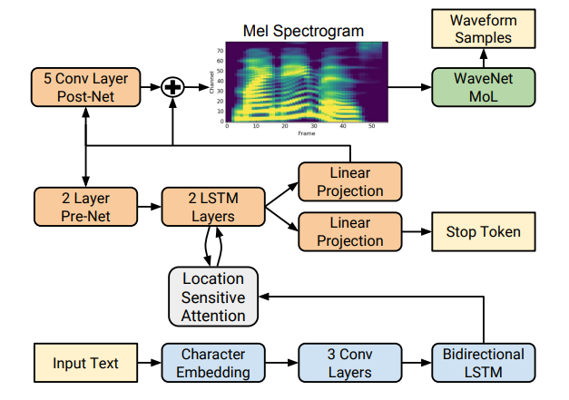
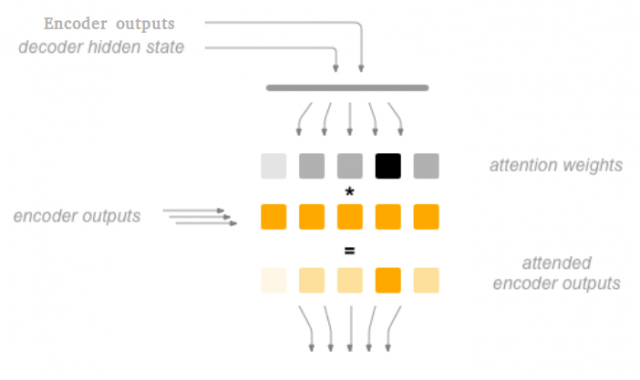
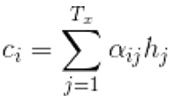
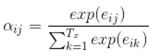
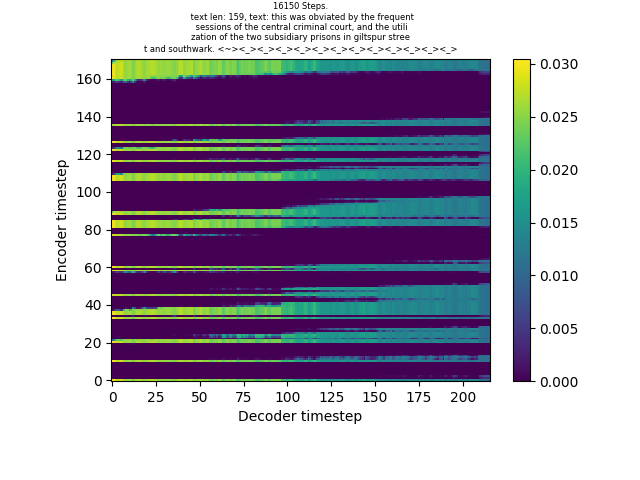
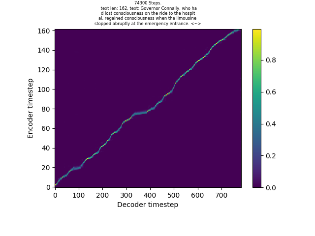

Нейросетевой синтез речи с помощью архитектуры Tacotron 2, или «Get alignment or die train'» / Блог компании NIX Solutions

Нашей команде поставили задачу: повторить результаты работы искусственной нейронной сети синтеза речи [Tacotron2](https://arxiv.org/pdf/1712.05884.pdf) авторства DeepMind. Это рассказ о тернистом пути, пройденном нами в ходе реализации проекта.  
  
Задача компьютерного синтеза речи уже достаточно давно интересовала ученых и технических специалистов. Однако классические методы не позволяют синтезировать речь, не отличимую от человеческой. И здесь, как и во многих других областях, на помощь пришло глубокое обучение.

Давайте рассмотрим классические методы синтеза.

## Конкатенативный синтез речи

Этот метод основан на предварительной записи коротких аудио-фрагментов, которые затем объединяются для создания связной речи. Она получается очень чистая и ясная, но абсолютно лишена эмоциональной и интонационной составляющих, то есть звучит неестественно. А всё потому, что невозможно получить аудиозапись всех возможных слов, произносимых во всех возможных сочетаниях эмоций и просодии. Конкатенативные системы требуют огромных баз данных и жесткого кодирования комбинаций для формирования слов. Разработка надежной системы занимает очень много времени.

## Параметрический синтез речи

Применение конкатенативного TTS ограничено из-за больших требований к данным и времени разработки. Поэтому был разработан статистический метод, исследующий саму природу данных. Он генерирует речь с помощью комбинирования таких параметров, как частота, спектр амплитуд и т.д.

Параметрический синтез состоит из двух этапов.

1.  Сначала из текста извлекаются лингвистические признаки, например, фонемы, продолжительность и т.д.
2.  Затем для вокодера (системы, генерирующей wave-формы) извлекаются признаки, которые представляют соответствующий речевой сигнал: кепстр, частота, линейная спектрограмма, мел-спектрограмма.
3.  Эти, настроенные вручную, параметры наряду с лингвистическими особенностями передаются в модель вокодера, а тот выполняет множество сложных преобразований для генерирования звуковой волны. При этом вокодер оценивает параметры речи, такие как фаза, просодия, интонация и другие.

Если мы можем аппроксимировать параметры, которые определяют речь на каждой её единице, тогда мы сможем создать параметрическую модель. Параметрический синтез требует значительно меньше данных и тяжелой работы, нежели конкатенативные системы.

Теоретически всё просто, но на практике возникает много артефактов, приводящих к приглушенной речи с «жужжащим» призвуком, что совсем не похоже на естественное звучание.

Дело в том, что на каждом этапе синтеза мы жестко кодируем некоторые признаки и надеемся получить реалистично звучащую речь. Но выбранные данные базируются на нашем понимании речи, а ведь человеческое знание не абсолютно, поэтому взятые признаки не обязательно будут лучшим возможным решением.

И здесь на сцену выходит Deep Learning во всём своём великолепии.

Глубокие нейронные сети являются мощным инструментом, который, теоретически, может аппроксимировать сколь угодно сложную функцию, т. е. привести некоторое пространство входных данных X в пространство выходных данных Y. В контексте нашей задачи это будут, соответственно, текст и аудио с речью.

## Предобработка данных

Для начала определимся, что мы имеем в качестве входных данных и что хотим получить на выходе.

Входными данными будет текст, а выходными — [мел](https://ru.wikipedia.org/wiki/%D0%9C%D0%B5%D0%BB_(%D0%B2%D1%8B%D1%81%D0%BE%D1%82%D0%B0_%D0%B7%D0%B2%D1%83%D0%BA%D0%B0))-спектрограмма. Это низкоуровневое представление, полученное применением быстрого преобразования Фурье к дискретному аудиосигналу. Сразу следует отметить, что спектрограммы, полученные таким образом, еще **необходимо нормализовать** путем сжатия динамического диапазона. Это позволяет уменьшить естественное соотношение между самым громким и самым тихим звуком на записи. В наших экспериментах лучше всего показало себя использование спектрограмм, приведенных к **диапазону \[-4;4\]**.

  
_Рисунок 1: Мел-спектрограмма аудиосигнала речи, приведенная к диапазону \[-4;4\]._

В качестве обучающего набора данных мы выбрали [LJSpeech dataset](https://keithito.com/LJ-Speech-Dataset/), который содержит 13 100 аудиодорожек по 2-10 сек. и файл с текстом, соответствующим английской речи, записанной на аудио.

Звук с помощью вышеописанных преобразований кодируется в мел-спектрограммы. Текст токенизируется и превращается

в последовательность целых чисел. Сразу подчеркну, что тексты нормализованы: все числа написаны словесно, а возможные аббревиатуры расшифровываются, например: «Mrs. Robinson» — «Missis Robinson».

Таким образом, после предобработки мы получаем наборы numpy-массивов числовых последовательностей и мел-спектрограмм, записанных в npy-файлы на диске.

Чтобы на этапе обучения все размерности в батчах-тензорах совпадали, мы будем добавлять к коротким последовательностям паддинги. Для последовательностей в виде текстов это будут зарезервированные под паддинг 0, а для спектрограмм — фреймы, значения в которых немного ниже, чем определенное нами минимальное значение спектрограмм. Это рекомендуется для обособления данных паддингов, отделения их от шумов и тишины.

Теперь мы имеем данные, представляющие текст и аудио, которые пригодны для обработки искусственной нейронной сетью. Давайте рассмотрим архитектуру Feature prediction net, которую по имени центрального элемента всей системы синтеза далее будем называть Tacotron2.

## Архитектура

Tacotron 2 представляет собой не одну сеть, а две: Feature prediction net и NN-vocoder [WaveNet](https://arxiv.org/pdf/1609.03499.pdf). Исходная статья, а также наше собственное видение проделанной работы позволяют считать первой скрипкой Feature prediction net, в то время как вокодер WaveNet играет роль периферийной системы.

Tacotron2 — это архитектура [sequence to sequence](https://towardsdatascience.com/sequence-to-sequence-model-introduction-and-concepts-44d9b41cd42d). Она состоит из **кодировщика** (encoder), создающего некоторое внутреннее представление о входном сигнале (символьных токенах), и **декодировщика** (decoder), который превращает это представление в мел-спектрограмму. Также крайне важным элементом сети является так называемый **PostNet**, призванный улучшить спектрограмму, сгенерированную декодером.

  
_Рисунок 2: Архитектура сети Tacotron 2._

Рассмотрим подробнее блоки сети и их модули.

Первым слоем **кодировщика** является Embedding-слой. Он на основании последовательности натуральных чисел, представляющих символы, создает многомерные (512-мерные) векторы.

Далее embedding-векторы подаются в блок из трёх одномерных свёрточных слоев. Каждый слой включает в себя 512 фильтров длиной 5. Это значение является хорошим размером фильтра в данном контексте, потому что захватывает некоторый символ, а также два предыдущих и два последующих его соседа. За каждым свёрточным слоем следует нормализация по мини-батчам и ReLU-активация.

Тензоры, полученные после свёрточного блока, подаются на двунаправленные LSTM-слои, по 256 нейронов в каждом. Результаты прямого и обратного прохода конкатенируются.

**Декодер** имеет рекуррентную архитектуру, то есть на каждом последующем шаге используются выходные данные с предыдущего шага. Здесь ими будет являться один фрейм спектрограммы. Ещё одним важным, если не ключевым, элементом данной системы является механизм мягкого (обучаемого) [внимания](https://arxiv.org/pdf/1506.07503.pdf) — относительно новый и набирающий всё большую популярность приём. На каждом шаге декодера внимание для формирования контекстного вектора и обновления веса внимания использует:

*   проекцию предыдущего скрытого состояние RNN-сети декодера на полносвязный слой,
*   проекцию выходных данных кодировщика на полносвязный слой,
*   а также аддитивные (накапливаемые на каждом временном шаге работы декодера) веса внимания.

Идею внимания следует понимать так: «какую часть данных кодировщика следует использовать на текущем шаге декодера».

  
_Рисунок 3: Схема работы механизма внимания._

На каждом шаге работы декодера вычисляется контекстный вектор _Ci_ (на рисунке выше обозначен как «attended encoder outputs»), представляющий собой произведение выходных данных кодировщика (_h_) и весов внимания (_α_):

где _αij_ — веса внимания, вычисляемые по формуле:

где _eij_ — так называемая «энергия», формула вычисления которой зависит от используемого вами типа механизма внимания (в нашем случае это будет гибридный тип, использующий как location-based attention, так и content-based attention). Вычисляется энергия по формуле:

_eij = vaT tanh(Wsi-1 \+ Vhj \+ Ufi,j \+ b)_

где:

*   _si-1_ — предыдущее скрытое состояние LSTM-сети декодера,
*   _αi-1_ — предыдущие веса внимания,
*   _hj_ — j-тое скрытое состояние кодировщика,
*   _W_, _V_, _U_, _va_ и _b_ — тренируемые параметры,
*   _fi,j_ — location-признаки, вычисляемые по формуле:
    
    _fi = F * αi-1_
    
    где _F_ — операция свёртки (convolution).
    

Для ясного понимания происходящего добавим, что некоторые нижеописанные модули предполагают использование информации с предыдущего шага декодера. Но если это первый шаг, то информация будет представлять собой тензоры нулевых значений, что является распространённой практикой при создании рекуррентных структур.

Теперь рассмотрим **алгоритм работы**.

Сначала выходные данные декодера с предыдущего временного шага подаются в небольшой модуль PreNet, представляющий собой стек из двух полносвязных слоёв по 256 нейронов каждый, чередующихся с dropout-слоями с рейтом 0,5. Отличительной чертой этого модуля является то, что dropout используется в нём не только на этапе обучения модели, но и на этапе вывода.

Выходные данные PreNet в конкатенации с контекстным вектором, полученным в результате работы механизма внимания, подаются на вход в однонаправленную двухслойную LSTM-сеть, по 1024 нейрона в каждом слое.

Затем конкатенация выходных данных LSTM-слоев с тем же (а возможно, и другим) контекстным вектором подаётся в полносвязный слой с 80 нейронами, что соответствует количеству каналов спектрограммы. Этот финальный слой декодера и формирует предсказанную спектрограмму фрейм за фреймом. А уже его выходные данные подаются в качестве входных на следующий временной шаг декодера в PreNet.

Почему в предыдущем абзаце мы упомянули, что контекстный вектор может быть уже другим? Одним из возможных подходов является пересчёт контекстного вектора после того, как на данном шаге получено скрытое состояние LSTM-сети. Однако в наших экспериментах этот подход себя не оправдал.

Помимо проекции на 80-нейронный полносвязный слой конкатенация выходных данных LSTM-слоев с контекстным вектором подаётся в полносвязный слой с одним нейроном, после которого следует сигмоидная активация — это слой «stop token prediction». Он предсказывает вероятность того, что фрейм, созданный на данном шаге декодера является завершающим. Этот слой предназначен для того, чтобы на этапе вывода модели генерировать спектрограмму не фиксированной, а произвольной длины. То есть на этапе вывода этот элемент определяет количество шагов декодера. Его можно рассматривать как бинарный классификатор.

Выходными данными декодера со всех его шагов будет явятся предсказанная спектрограмма. Однако и это ещё не всё. Для улучшения качества спектрограммы она пропускается через модуль PostNet, представляющий собой стек из пяти одномерных свёрточных слоев с 512 фильтрами в каждом и с размером фильтра 5. За каждым слоем (кроме последнего) следует батч-нормализация и тангенс-активация. Чтобы вернутся к размерности спектрограммы мы пропускаем выходные данные post-net через полносвязный слой с 80 нейронами и складываем полученные данные с изначальным результатом работы декодера. Получаем сгенерированную из текста мел-спектрограмму. Profit.

Все свёрточные модули регуляризируются dropout-слоями с рейтом 0,5, а рекуррентные слои — более новым методом [Zoneout](https://arxiv.org/pdf/1506.07503.pdf) с рейтом 0,1. Он достаточно прост: вместо того, чтобы подавать на следующий временной шаг LSTM-сети скрытое состояние и состояние ячейки, полученные на текущем шаге, мы заменяем часть данных значениями с предыдущего шага. Это делается как на этапе обучения, так и на этапе вывода. При этом Zoneout-методу подвергается только скрытые состояние (что передаётся на следующий шаг LSTM) на каждом шаге, в то время как вывод LSTM-ячейки на текущем шаге остаётся неизменным.

В качестве фреймворка глубокого обучения мы выбрали PyTorch. Хотя на момент реализации сети он был в состоянии пре-релиза, но уже являлся весьма мощным инструментом построения и обучения искусственных нейронных сетей. В нашей работе мы используем и другие фреймворки, такие как TensorFlow и Keras. Однако последний был отброшен в связи с необходимостью реализации нестандартных кастомных структур, а если сравнивать TensorFlow и PyTorch, то при использовании второго не возникает ощущения, что модель вырвана из языка Python. Однако мы не беремся утверждать, что один из них лучше, а другой хуже. Использование того или иного фреймворка может зависеть от разных факторов.

Обучается сеть методом обратного распространения ошибки. В качестве оптимизатора используется [ADAM](https://arxiv.org/pdf/1412.6980.pdf), в качестве функций ошибок — Mean Square Error до и после PostNet, а также Binary Cross Entropy над фактическими и предсказанными значениями слоя Stop Token Prediction. Результирующая ошибка является простой суммой указанных трех.

Обучалась модель на одной GPU GeForce 1080Ti с 11 Гб памяти.

## Визуализация

При работе с такой большой моделью важно видеть, как проходит процесс обучения. И тут удобным инструментом стал TensorBoard. Мы отслеживали значение ошибки как на тренировочных, так и на валидационных итерациях. Кроме того, мы выводили на экран целевые спектрограммы, предсказанные спектрограммы на этапе обучения, предсказанные спектрограммы на этапе валидации, а также выравнивание (alignment), которое представляет собой аддитивно-накапливаемые веса внимания со всех шагов обучения.

Вполне возможно, что сначала ваше внимание будет не слишком информативно:

  
_Рисунок 4: Пример неудачно обученных весов внимания._

Но после того, как все ваши модули начнут работать как швейцарские часы, вы, наконец-то, получите что-то подобное:

  
_Рисунок 5: Пример удачно обученных весов внимания._

Что означает этот график? На каждом шаге декодера мы пытаемся декодировать один фрейм спектрограммы. Однако не совсем понятно, какую информацию кодировщика нужно использовать на каждом шаге декодера. Можно предположить, что это соответствие будет прямым. К примеру, если мы имеем входную текстовую последовательность в 200 символов и соответствующую ей спектрограмму в 800 фреймов, то на каждый символ будет приходится по 4 фрейма. Однако согласитесь, что речь, сгенерированная на основании такой спектрограммы, была бы напрочь лишена естественности. Какие-то слова мы произносим быстрее, какие-то медленнее, где-то делаем паузы, а где-то нет. И учесть все возможные контексты не представляется возможным. Вот почему внимание является ключевым элементом всей системы: оно задаёт соответствие между шагом декодера и информацией из кодировщика, чтобы получить информацию, необходимую для генерирования конкретного фрейма. И чем больше значение весов внимания, тем больше «внимания следует обратить» на соответствующую часть данных кодировщика при генерировании фрейма спектрограммы.

На этапе обучения также будет полезным генерировать аудио, а не только визуально оценивать качество спектрограмм и внимания. Однако те, кто работал с WaveNet, согласятся, что использовать его в качестве вокодера на этапе обучения было бы непозволительной роскошью с точки зрения временных затрат. Поэтому рекомендуется использовать [алгоритм Гриффина-Лима](https://pdfs.semanticscholar.org/ade8/d1511a61d78948bb0d43e207593389935421.pdf), который позволяет частично восстановить сигнал после быстрых преобразований Фурье. Почему частично? Дело в том, что конвертируя сигнал в спектрограммы мы теряем информацию о фазе. Однако качества полученного таким образом аудио будет вполне достаточно для того, чтобы понять, в каком направлении вы движетесь.

## Извлеченные уроки

Тут мы поделимся некоторыми мыслями о построении процесса разработки, подав их в формате советов. Некоторые из них довольно общие, другие более конкретны.

**Об организации рабочего процесса**:

*   Используйте систему контроля версий, чётко и ясно описывайте все изменения. Это может показаться очевидной рекомендаций, но всё же. При поиске оптимальной архитектуры постоянно происходят изменения. И получив какой-то удовлетворительный промежуточный результат, обязательно сделайте себе чекпойнт, чтобы смело вносить последующие изменения.  
    
*   С нашей точки зрения, в подобных архитектурах следует придерживаться принципов инкапсуляции: один класс — один Python-модуль. Такой подход нечасто встречается в ML-задачах, однако он поможет вам структурировать код и ускорит отладку и разработку. Как в коде, так и в своем видении архитектуры разделите её на блоки, блоки на модули, а модули на слои. Если в модуле есть код, выполняющий определённую роль, то объедините его в метод класса модуля. Это прописные истины, однако мы не поленились сказать о них еще раз.  
    
*   Снабдите классы [numpy-style документацией](https://sphinxcontrib-napoleon.readthedocs.io/en/latest/example_numpy.html). Это значительно упростит работу как вам, так и коллегам, которые будут читать ваш код.  
    
*   Всегда рисуйте архитектуру вашей модели. Во-первых, это поможет вам осмыслить её, во-вторых, взгляд со стороны на архитектуру и на гиперпараметры модели позволит быстрее выявить неточности в вашем подходе.  
    
*   Лучше работать командой. Если вы работаете один, всё равно собирайте коллег и обсуждайте вашу работу. Как минимум, они могут задать вам вопрос, который наведёт вас на некоторые мысли, а как максимум — укажут на конкретную неточность, не позволяющую вам успешно обучить модель.  
    
*   Другой полезный прием связан уже с предобработкой данных. Предположим, что вы решили проверить некоторую гипотезу и внесли в модель соответствующие изменения. Но перезапускать обучение, особенно перед выходными, будет рискованно. Подход может оказаться изначально неправильным и вы впустую потратите время. Что же тогда делать? Увеличьте размер окна быстрого преобразования Фурье. Параметром по умолчанию является 1024; увеличьте его в 4, или даже 8 раз. Это «сожмет» спектрограммы в соответствующее количество раз и значительно ускорит обучение. Восстановленное из них аудио будет обладать более низким качеством, но ведь не в этом сейчас ваша задача? За 2-3 часа вы уже можете получить alignment («выравнивание» весов внимания, как показано на рисунке выше), это будет свидетельствовать об архитектурной правильности подхода и его можно опробовать уже на больших данных.  
    

**Построение и обучение модели**:

*   Мы предположили, что если формировать батчи не случайным образом, а на основе их длины, ускорит процесс обучения модели и сделает сгенерированные спектрограммы более качественными. Логичное предположение, в основе которого лежит гипотеза, что чем больше полезного сигнала (а не паддингов) подается на обучение сети, тем лучше. Однако этот подход себя не оправдал, в своих экспериментах мы не смогли подобным образом обучить сеть. Вероятно, это связано с потерей случайности выбора экземпляров для обучения.  
    
*   Используйте современные алгоритмы инициализации параметров сети с некоторыми оптимизированными начальными состояниями. К примеру, в своих экспериментах мы использовали Xavier Uniform Weight Initialization. Если в вашем модуле нужно использовать нормализацию по мини-батчам и некоторую функцию активации, то чередоваться друг с другом они должны именно в таком порядке. Ведь если мы применим, к примеру, ReLU-активацию, то сразу потеряем весь отрицательный сигнал, который должен быть вовлечён в процесс нормализации данных конкретного батча.  
    
*   С определенного шага обучения используйте динамический learning rate. Это действительно помогает уменьшить значение ошибки и увеличить качество сгенерированных спектрограмм.  
    
*   После создания модели и неудачных попыток обучить её на батчах из всего набора данных полезно будет попытаться переобучить её на одном батче. Если вам это удастся, вы получите alignment, а воссозданное на основании сгенерированных спектрограмм аудио будет содержать речь (или хотя бы её подобие). Это подтвердит, что в целом ваша архитектура правильная, и не хватает лишь небольших деталей.
    
    Кстати об этих деталях. Ошибки в построении модели могут быть самыми разными. К примеру, в начальных экспериментах мы получили классическую ошибку – неверную функцию активации после полносвязного слоя. Поэтому всегда спрашивайте себя, почему вы хотите использовать ту или иную функцию активации в конкретном слое. Здесь полезно разложить всё по отдельным модулям, так будет легче инспектировать каждый элемент модели.
    
*   При работе с RNN-сетями мы пробовали передавать скрытые состояния и состояния ячеек как инициализирующие на следующую итерацию обучения. Однако этот подход себя не оправдал. Да, он создаст вам некоторое скрытое представление обо всём имеющемся наборе данных. Однако нужно ли это в контексте данной задачи? Куда более интересным и уместным подходом может оказаться обучение начального скрытого состояния LSTM-слоев в точности как обычного параметра-весов.  
    
*   Ещё одно практическое замечание относительно рекуррентных структур, а именно LSTM-сети, которое мы почерпнули из книги «Глубокое обучение»: «_Обычно веса нейронной сети инициализируются маленькими случайными числами, и это прекрасно работает для почти всех весов LSTM-ячеек. Особым случаем является свободный член «забывающего» гейта bf. Дело в том, что если этот свободный член инициализировать около нуля, это фактически будет значить, что все LSTM-ячейки изначально будут иметь значение ft около 1/2. А это значит, что та самая карусель константной ошибки перестает работать: мы начинаем с того, что фактически вводим во все ячейки фактор «забывания» в 1/2, и в результате ошибки и память будут затухать экспоненциально. Поэтому свободный член bf нужно инициализировать большими значениями, около 1 или даже 2: тогда значения забывающих гейтов ft в начале обучения будут близки к нулю и градиенты будут вольно литься по просторам нашей рекуррентной архитектуры_».  
    
*   Работая с seq2seq-моделями вы сталкиваетесь с проблемой разной длины последовательностей в батче. Она очень просто решается добавлением паддингов — зарезервированных символов в случае входных данных кодировщика, или же фреймов с определенными значениями в случае декодера. А как правильно применять функцию ошибки к предсказанным спектрограммам и действительным? В наших экспериментах хорошо себя показало использование маски в функции ошибки, чтобы считать ошибку только на полезном сигнале (исключая паддинги).  
    
*   Теперь специфическая рекомендация для фреймворка PyTorch. Хотя LSTM-слой в декодере является, по сути, своей LSTM-ячейкой, которая на каждом шаге декодера принимает информацию только для одного элемента последовательности, рекомендуется использовать именно класс `torch.nn.LSTM`, а не `torch.nn.LSTMCell`. Причина в том, что бекэнд LSTM реализован в CUDNN-библиотеке на языке C, а LSTMCell – на Python. Этот трюк позволит вам значительно увеличить быстродействие системы.

И в завершение статьи [поделимся примерами генерирования речи из текстов, которые не содержались в обучающем наборе.](https://yadi.sk/d/g6LS3Ufn17OiCg)