Обзор 27” IPS монитора Acer HA270bid: для самостоятельной доработки

Так случилось, что

~в жизни~

на экране моего старого 24-дюймового IPS монитора Philips появилась светлая полоса. Аккурат посреди экрана, сверху вниз. Вопрос покупки нового монитора внезапно назрел.  

### Глупости выбора

На носу были новогодние праздники, поэтому бюджет на покупку дисплея был выделен по остаточному принципу и оказался

~никакущий~

скромный. В то же время хотелось чего-то большего, чем «старые» 24-дюйма. Ну, хотя бы 27… И, удивительное дело, тут же в почте я обнаружил письмо, где один уважаемый интернет-магазин предлагала мне неплохой монитор BenQ GW2780 всего за $200. Вот и чудесно, подумал я. Вполне годная вещь. Буквально на следующий день я сел за оформление заказа и … оказалось, вчерашнее предложение от магазина больше не действительно! Высказав пришедшие на ум недобрые слова, я немедля заказал в другом магазине самый недорогой (если не учитывать контрабас и б/у) 27-дюймовый IPS Full HD монитор, который только можно было найти на рынке – это Acer HA270bid. В тот же вечер дисплей доставили мне домой. Выпущен монитор, согласно надписи, в июне 2018 года, а родом он из Китая.

### Первое впечатление: ё

Монитор запакован производителем в картонную коробку, предусмотрительно снабженную ручкой для переноски. Девайс нетяжелый, да и коробка не очень громоздкая, поэтому покупку в «таре» вполне удобно нести в руке.

Внутри коробки устройство бережно защищено пенопластом. Однако будьте аккуратны и извлекайте содержимое из упаковки при горизонтальном положении коробки и убедившись, что монитор находится экраном вниз. Иначе элементы подставки и блок питания с грохотом вывалятся на пол, так как они не закреплены. Экономия на копеечном скотче нынче в тренде.

В комплектацию входит

~немощный~

блок питания на 30Вт (19В/1,58А). Он имеет не совсем типичный вход типа IEC 320 C5 для сетевого шнура питания, но в принципе это не страшно – нужный кабель в комплекте.

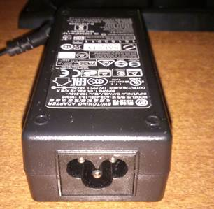  
_**Блок питания**_

Провод идущий от блока питания к монитору очень тонкий. Проследите, чтобы этот провод не смогли достать домашние питомцы и старайтесь проложить его так, чтобы случайно ничем не передавить.

Удивительно, но Acer в конце 2018 года вкладывает в коробку с монитором кабель VGA. Кто-то может сообщить им, что этот разъем безнадежно устарел и его в чистом виде давно нет ни на одной приличной видеокарте?

Но вернемся к монитору. Возможности крепления на VESA кронштейн здесь нет. Ну и ладно. Я вообще ни разу в жизни не видел, чтобы у кого-либо монитор висел на кронштейне VESA. Обычно там обитают телевизоры. Поэтому по привычке просто водрузим дисплей на подставку…  
Шустро привинтив основание подставки к ножке, я попытался подсоединить ножку к монитору. Но не тут-то было! Оказалось, закрепление подставки – далеко не тривиальная задача. Причем требующая недюжинной физической силы и крайней осторожности. Во-первых, само крепление сделано настолько неудачно, что пазы на ножке подставки постоянно норовят выскочить из направляющих на корпусе монитора при «состыковке». Во-вторых, чтобы подставка встала на место и защелки зафиксировались, потребовалось приложить такие физические усилия, что становилось боязно за сам монитор. Мне так и не удалось зафиксировать подставку, положив монитор горизонтально. Только уперев дисплей в пол и сильно прижимая подставку сверху, где-то с 5-й попытки, мне таки посчастливилось «пристыковать» подставку, каждую секунду переживая что тонкий корпус монитора вот-вот треснет под натиском моих усилий или потока матерных слов. Думаю, в Acer нанимают специальных мазо-инженеров. Иначе я не могу объяснить выпуск такой фуеты в 2018 году.

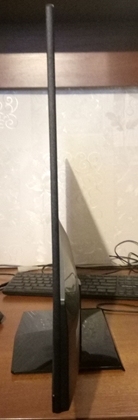  
_**Монитор на подставке, вид сбоку**_

Зато на ножке монитор стоит монолитом! Он не начинает трястись и раскачиваться, если нечаянно зацепить сам дисплей или толкнуть стол. Это очень хорошо. Ибо проблема «желейной вибрации», к моему удивлению, проявлялась у весьма недешевых 27-дюймовых мониторов с «крутыми» подставками и ценами.

К монитору прилагается некая бесполезная макулатура. Поскольку руководством пользователя назвать эти бумаги нельзя. В частности, там нет ни слова от том, как нужно настраивать монитор для мало-мальски приличного отображения картинки. Я бы еще понял и простил, когда дисплей имеет приличные заводские настройки, не требующие серьезного вмешательства (вот за это самое я и хотел взять BenQ). Но это не наш случай, к сожалению.

### Второе впечатление: см. первое

Итак, монитор водружен на стол и подключен к видеокарте ПК по интерфейсу HDMI. Включаем.  
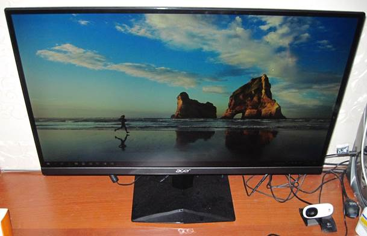  
**_Монитор. Вид спереди-сверху_**

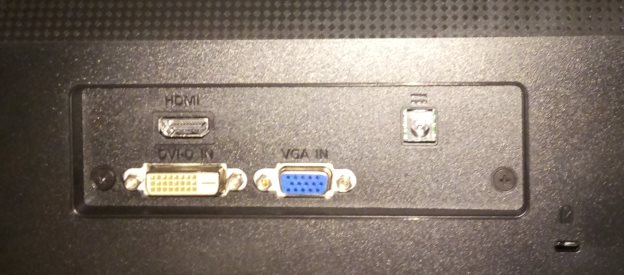  
**_Интерфейсы подключения_**

Показывает — уже хорошо (памятуя о насилии над монитором при закреплении подставки). Смотрим на экран… На первый взгляд оптимистично. Битых пикселей нет, равномерность белого визуально безупречна.

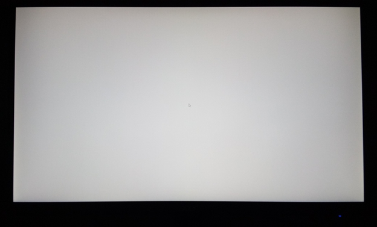  
**_Равномерность белого_**

На сплошном черном заметно некоторое повышение яркости по нижним углам, но оно незначительное. Я наблюдал картину гораздо хуже на мониторах в полтора раза дороже.

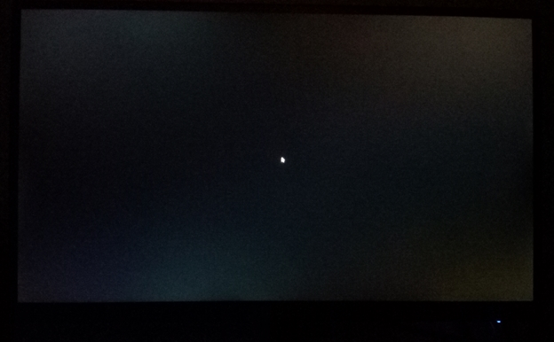  
**_Равномерность черного_**

Покрытие экрана матовое, никаких бликов нет. Великолепно. Синий диод, сигнализирующий об активности монитора, неярок и ненавязчив. Даже когда мигает в режиме ожидания. Здесь в целом зачет.

А вот цветопередача… По умолчанию она хромает на три ноги из шести (у монитора регулировка по 6-ти базовым цветам). Предустановленными в мониторе предварительными настройками изображения пользоваться нельзя. Они плохи. Все, без исключения. Один режим ужаснее другого. Так, я с удивлением наблюдал, как на экране исчезало из виду выделение серым чередующихся строк в файловом менеджере Total Commander при выборе режима отображения Graphics. Graphics, бро! Пресловутые режимы BluLight пусть и делают картинку визуально «краснее», от проблем не избавляют. Изображение неприятно. Оно вызывает боль. В буквальном смысле этого слова – боль в глазах. В общем и целом, на настройки качества изображения в этом мониторе компания Acer просто положила болт. Большой и толстый.

Ах, да. Поддержка, русского языка в меню монитора есть. Но как только я увидел этот шрифт… Им вполне можно пытать какого-нибудь адепта каллиграфии. В общем, я сразу переключил язык меню обратно на английский, не обессудьте.

### Как настроить монитор без применения кувалды

Кнопки управления экранным меню расположены на нижней грани рамки экрана и скрыты от взора пользователя. Но пару минут привыкания — и пользовался клавишами можно довольно уверенно, тем более кнопок немного и все они хорошо прощупываются пальцами.

Стоит поменять хоть один параметр экранного меню по своему усмотрению, и настройки монитора автоматически переходят в режим User. Отлично, поехали…

Сначала выбираем цветовую температуру User или Warm – они ничем не отличаются. Выбирать Cold не советую. Этот режим мало соответствует представлению о холодной цветовой температуре, я скорее назвал бы его синюшным. Обильной синеве всего и вся на экране больше подошло бы определение Trash, а не Cold. А вот User или Warm – это попадание где-то в район 6500К, что нам и требуется. Я остановился на Warm.

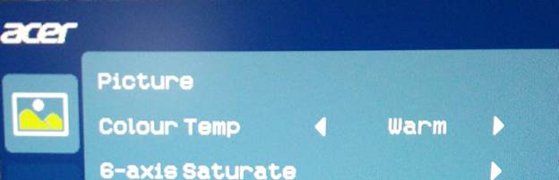  
**_Цветовая температура – душевно теплая (Warm)_**

Перейдем к более глубоким настройкам. Стоит зайти по ссылке [http://www.lagom.nl/lcd-test/contrast.php](http://www.lagom.nl/lcd-test/contrast.php) и увидеть тестовое изображение с цветовым градиентом, как ресницы на глазах становятся дыбом: монитор не способен отображать ярких оттенков в зеленом, голубом и желтом цветах. Оттенки просто сливаются.

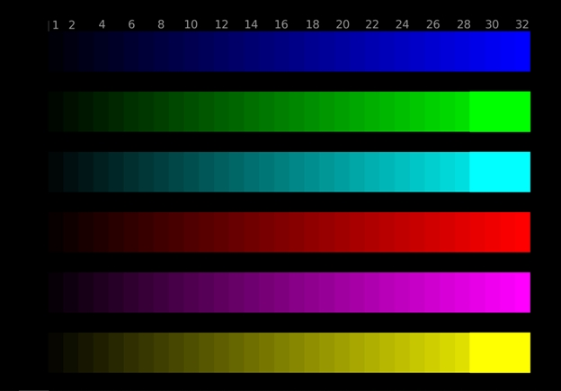  
**_Печальный градиент_**

Еще более наглядно проблему можно увидеть, если вывести на экран тестовый круг с градиентной заливкой в программе TFTtest. Вместо равномерно плавного градиента вы будете видеть посреди круга большое яркое светлое пятно. Чем больше это пятно – тем более неадекватны настройки монитора (проблему можно увидеть и на диагональной градиентной заливке в этом же тесте, но там она не так сильно бросается в глаза).

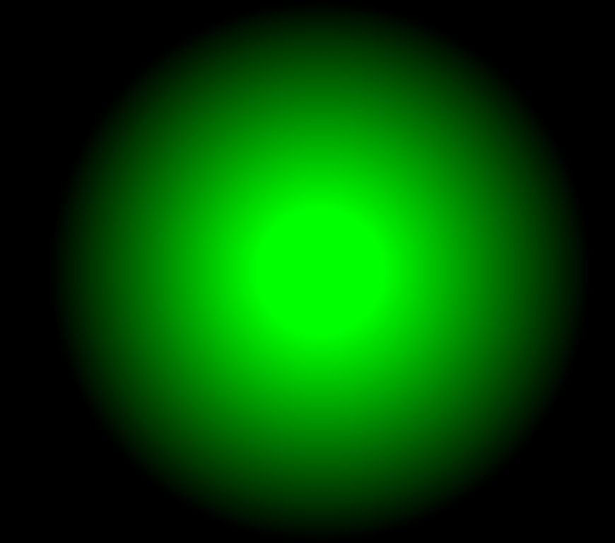

  
**_Ненормальный градиент на цветных кругах\- признак проблемы_**

При этом зеленый и голубой цвет были настолько «токсичны» (даже в любом из режимов BluLight, вся разница между которыми на самом деле заключается в изменении общей яркости подсветки), что «выедали» глаза за несколько минут, стоило вывести на монитор изображение с преобладанием ярко-зеленых или сине-голубых оттенков. И это не сугубо мои личные впечатления от работы за монитором, но и ощущения других людей.

Чтобы устранить это вопиющие безобразие, первым делом я понизил насыщенность голубого и желтого цветов в меню монитора, пока на тестовой шкале не «проявились» все градиенты этих цветов.

  
**_Понижение насыщенности цветов_**

Насыщенность зеленого больше чем на 2 пункта понижать не стал, так нужный эффект тут проявляется минимально, а излишняя потеря насыщенности делает изображение более «выцветшим», чем хотелось бы. Но не стоит думать, что «кривой» градиент зеленого (точнее неспособность монитора отображать светлые оттенки зеленого) так и останется нескорректированным. Поправить ситуацию нам помогут азы настройки.

Как известно, если на мониторе (телевизоре, проекторе – нужное подчеркнуть) сливаются яркие оттенки, виновата завышенная контрастность. Ну что же, находим этот параметр в меню монитора и понижаем. Примерно на уровне 33% от максимального значения контрастность на экране приходит в норму, все оттенки на цветных градиентах, в том числе на зеленом, различимы:

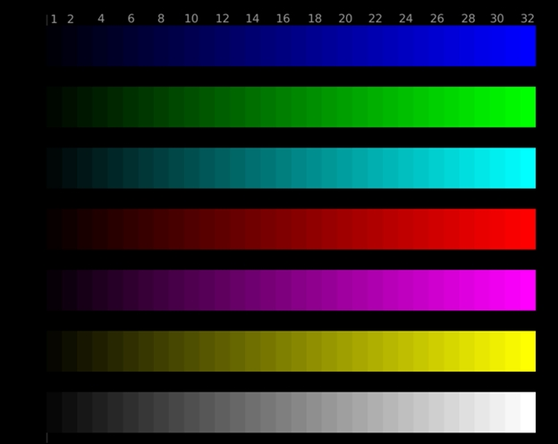  
**_Градиент пришел в норму_**

А на оттенках серого в тесте [http://www.lagom.nl/lcd-test/white.php](http://www.lagom.nl/lcd-test/white.php) четко прослеживаются даже самые яркие полутона 253 и 254, что можно назвать отличным результатом.

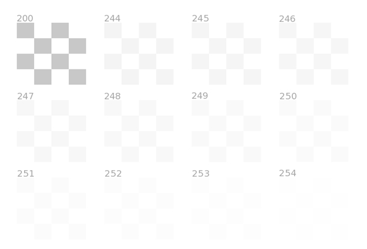  
**_Яркие оттенки серого на тестовом изображении_**

Итак, светлые оттенки готовы, градиент на цветных кругах также, естественно, пришел в норму:

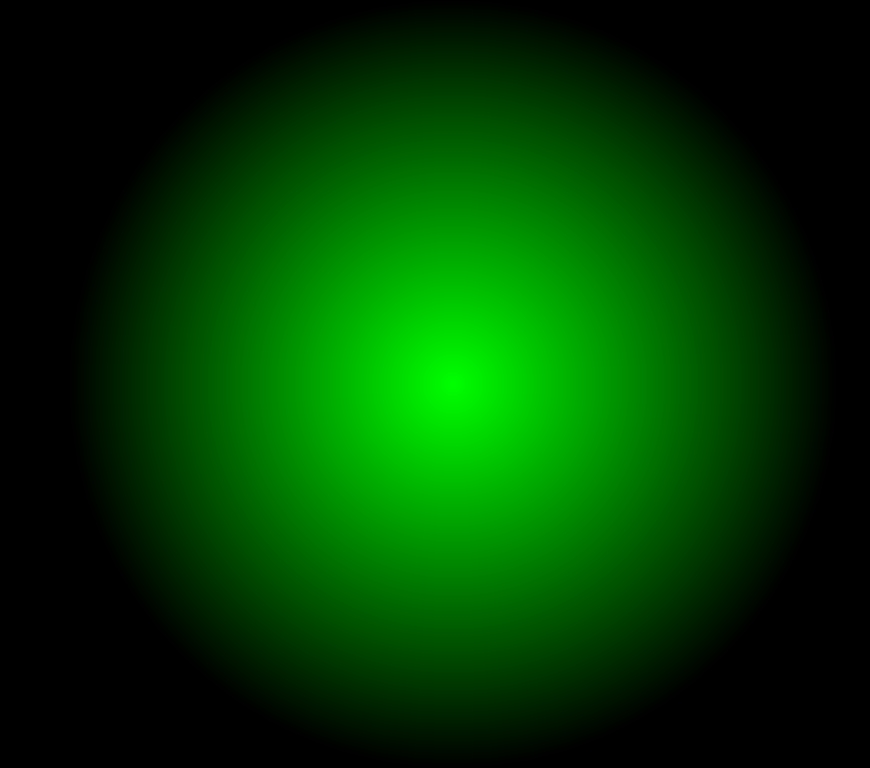

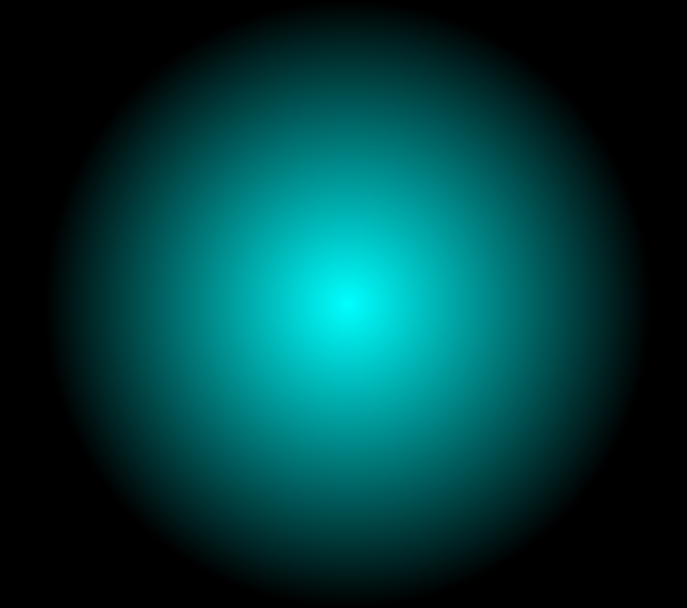  
**_Нормальный градиент на цветных кругах_**

Переходим на темную сторону

~силы~

. За видимость чего-нибудь в темных полутонах у нас отвечает яркость. Регулируем ее, пока не увидим максимальное число «оттенков темного», в чем нам поможет ссылка [http://www.lagom.nl/lcd-test/black.php](http://www.lagom.nl/lcd-test/black.php).

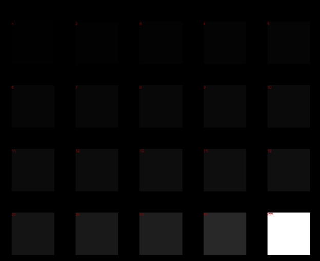  
**_Регулировка видимости темных оттенков с помощью яркости_**

Можно также попробовать настроить монитор по нижеприведенной картинке (взята с сайта [https://geekbrains.ru/posts/how\_to\_setup_monitor](https://geekbrains.ru/posts/how_to_setup_monitor) ):

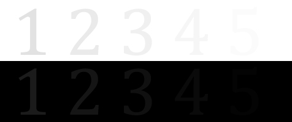

В идеале вы должны видеть все цифры (от 1 до 5) на белом и черном поле. Чем больше цифр видно – тем лучше настройка монитора. Не всегда удается добиться наилучшего результата. Так, если в светлой области на мониторе Acer HA270bid видны все цифры (за это отвечает регулировка контраста), то при любом значении яркости в меню монитора на темном поле визуально различима только цифра 4. То есть результат очень хороший, хотя и не отличный. Попытка увеличить яркость в драйвере видеокарты слишком высветляет картинку, поэтому не наш вариант. Смиряемся и просто выставляем яркость в меню монитора на оптимальное и не напрягающее глаза значение 44% от максимальной. Теперь за монитором можно сидеть часами, наслаждаясь прекрасным изображением и не чувствуя «нагрузки» на глаза.

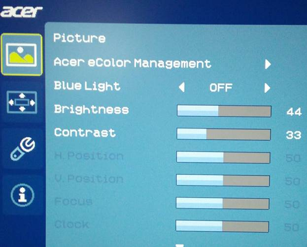  
**_Оптимальные параметры: яркость 44, контрастность 33_**

Кстати, мониторчик наш Flicker-Free, то есть без мерцания подсветки, так что бояться понижать яркость не стоит. Flicker-Free тут точно имеется, все мои попытки выявить мерцание не увенчались успехом. Жаль, что нет AMD FreeSync, но слишком много требовать от бюджетного монитора тоже ведь нельзя.

Зачем понадобилось все это колбасиво с настройками? Правильные настройки дают нам возможность увидеть на экране монитора изображение в том виде, как задумывал его создатель. С деталями и нюансами, которые не исчезают в темноте и не теряются в однотонно-ярком свете. Это весьма актуально при просмотре/редактировании фото и изображений, при воспроизведении фильмов, в играх, и даже при банальном веб-серфинге. Попробую объяснить на наглядном примере. Возьмем эту картинку (все права на нее принадлежат законным владельцам, она взята исключительно в качестве наглядного пособия):

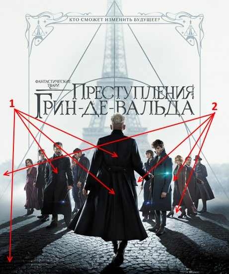  
**_Постер фильма «Фантастические твари: Преступления Грин-де-Вальда»_**

Если у экрана недостаточная яркость, то области указанные (1), будут просто черными — вы не заметите складок на плаще героя и не увидите брусчатки на наиболее темной части тротуара. В то же время если у дисплея завышена контрастность, светлые участки изображения, указанные (2), будут просто однотонно яркими, на которых нельзя различить детали.

Ну вот, собственно, все. После проведенных настроек мой бюджетный монитор стал показывать весьма недурственное изображение. Признаюсь, лучше, чем я ожидал от устройства за $190\. Скажу больше, лично я не вижу принципиальной разницы между изображением, выводимым на Acer HA270bid и монитор Acer Predator X27, кроме того, что мелкий пиксель на последнем вызывает у меня резь в глазах при чтении текста с экрана (увы, мое зрение ушло в минус еще со школьной скамьи), да и нет у меня видеокарты способной потянуть 4К при 144Гц. Зато купив Acer HA270bid вместо Acer Predator X27, и не переплатив ни копейки за маркетинговые понты, я сэкономил $2860 (на минуточку — это цена еще 15 мониторов Acer HA270bid), что довольно неплохо. Как считаете?

### Вывод

Если денег нет, а держаться как-то надо, и вас угораздило купить дешманский 27-дюймовый IPS монитор Acer HA270bid, не отчаивайтесь. Стоит не полениться покрутить его настройки – и монитор покажет вам отличное изображение. Конечно, другой купленный экземпляр может отличаться по оптимальным параметрам от моего, но направление «куда копать» вы наверняка уже поняли…

### Плюсы и минусы

\+ большой

~у~

матовый IPS экран  
\+ не шаткая конструкция  
\+ доступная цена  
— придется пережить ужас во время крепления ножки  
— неадекватные настройки изображения по умолчанию

### Технические характеристики

Диагональ экрана: 27" (69 см)  
Тип ЖК матрицы: IPS  
Размер пикселя: 0,3144 х 0,3144 мм  
Углы обзора (Г/В): 178°/178°  
Разрешение: 1920 x 1080  
Частота обновления: 60 Гц  
Время реакции матрицы: 4 мс (от серого к серому)  
Тип подсветки: светодиодная WLED  
Яркость: 250 кд/м²  
Контрастность: 1000:1  
Регулировка положения экрана: наклон -5 ~ +15°  
Видеовходы: DVI-D, HDMI, VGA  
Поддержка Flicker-Free: есть  
Энергопотребление: работа 25/30Вт (типичное /максимум), сон — 0,25Вт, выкл. — 0,22Вт  
Размеры: 621 x 453,3 x 185,6 мм  
Вес: 3.6 кг