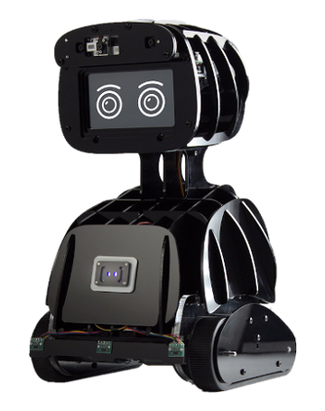
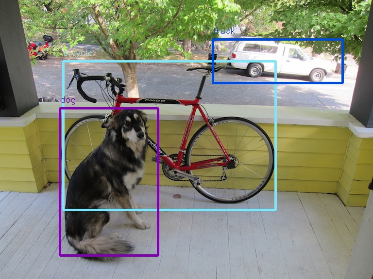
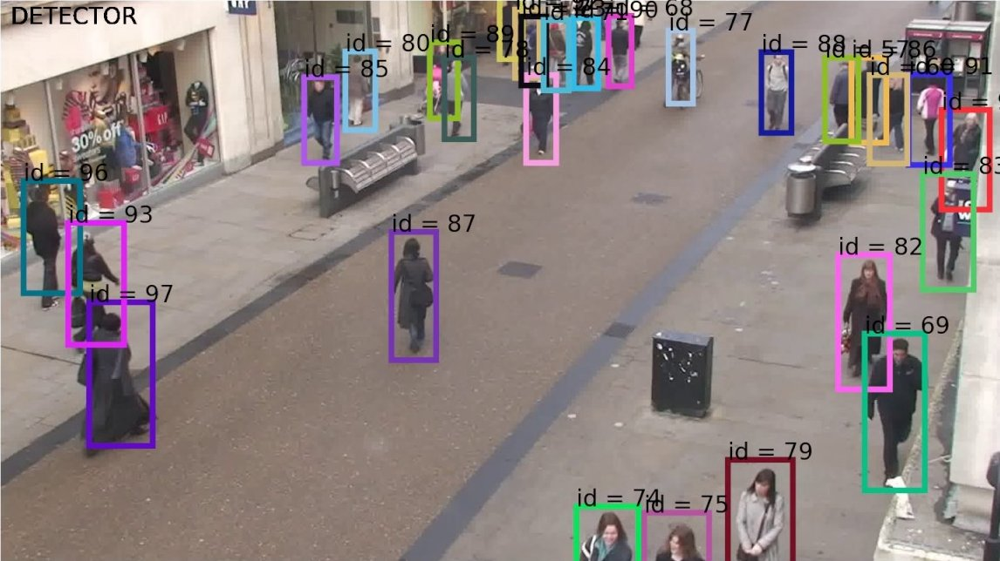
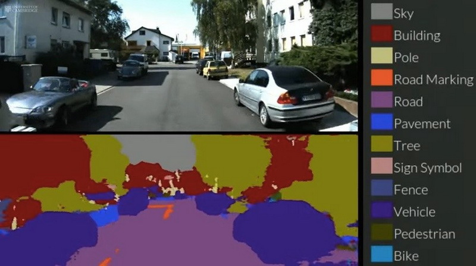
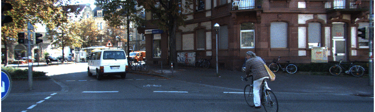
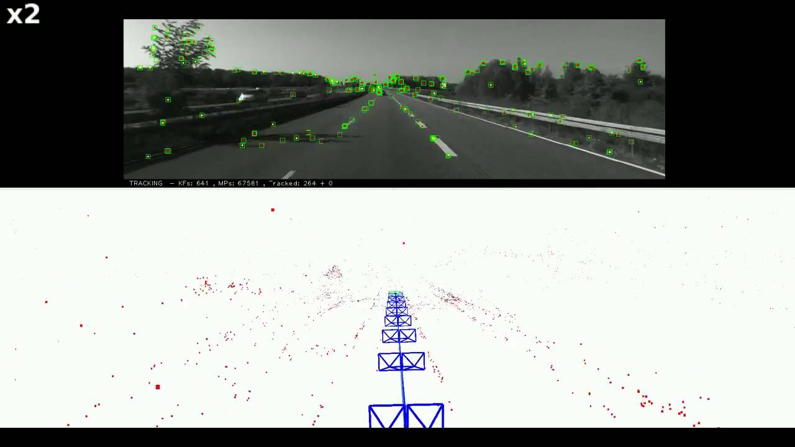
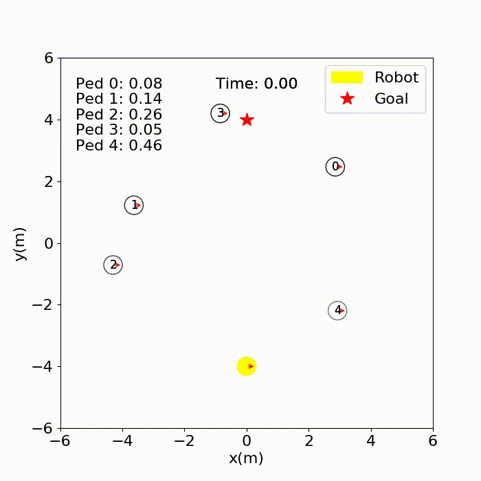
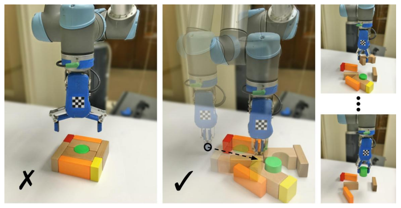

Обзор алгоритмов глубокого машинного обучения для роботов

[max8m](https://habr.com/ru/users/max8m/ "Автор публикации") сегодня в 08:38

Обзор будет полезен для тех, кто занимается физическими роботами и кому стало недостаточно arduino, а также для людей, кто хотел бы реализовать какие-либо из функций восприятия окружающего мира в своих роботах или устройствах.

  
_Робот Misty от компании Misty Robotics представленный на CES_

В зависимости от назначения робота, ему необходимо решать различные задачи. Бывает, что для их решения достаточно контроллера и, например, простейших сенсоров. Однако, иногда необходимо, чтобы робот мог выполнять задачи не по жестко заложенным координатам, а в зависимости от состояния окружающего пространства или рабочей области. Тогда становится необходимым использовать более сложные сенсоры, как например, камеры или лидары и использовать специальные алгоритмы для обработки поступающей информации.

## Зрение и понимание

Видеть и понимать увиденное — это первая функция, которая может прийти на ум.

### Детектирование объектов

Позволяет находить в области видения объекты заданных типов  
Пример алгоритма [github.com/pjreddie/darknet](https://github.com/pjreddie/darknet)

  
  

### Трекинг объектов

Позволяет отслеживать перемещение объекта или объектов в области видения  
Пример алгоритма [github.com/nwojke/deep_sort](https://github.com/nwojke/deep_sort)

  
  

### Сегментация

Позволяет попиксельно определять содержимое области видения  
Пример алгоритма [github.com/toimcio/SegNet-tensorflow](https://github.com/toimcio/SegNet-tensorflow)

  
  

### Оценка глубины

Позволяет определять препятствия на пути и расстояния до них с использованием компьютерного зрения.  
Пример работы алгоритма

Пример алгоритма для обычной камеры [github.com/mrharicot/monodepth](https://github.com/mrharicot/monodepth)  
Пример алгоритма для стерео камеры [github.com/AlexJinlei/Stereo\_Vision\_Camera](https://github.com/AlexJinlei/Stereo_Vision_Camera)  
Если же условия работы вашего робота позволяют использовать Depth камеры с активной IR подсветкой, например такие как Intel Realsense, то вы можете применять проприетарное SDK [github.com/IntelRealSense/librealsense/releases](https://github.com/IntelRealSense/librealsense/releases)

**Анимация**

  

## Перемещение и принятие решений

Большинству физических роботов, будь то манипулятор, мобильный робот или что-либо еще, необходимо как-либо перемещаться в пространстве. И иногда в процессе этих перемещений, особенно если условия или среда функционирования могут существенно изменяться, роботу необходимо изменять траекторию и скорость движении.

### Ориентация в пространстве

Позволяет определять координаты собственного местоположения робота в пространстве, в том числе внутри зданий.  
Пример алгоритма [github.com/raulmur/ORB_SLAM2](https://github.com/raulmur/ORB_SLAM2)

  
  

### Принятие решений при перемещениях

Позволяет мобильному роботу принимать решения о необходимых маневрах для оптимизации траектории движения в динамическом окружении. Алгоритм использует [обучение с подкреплением](https://ru.wikipedia.org/wiki/%D0%9E%D0%B1%D1%83%D1%87%D0%B5%D0%BD%D0%B8%D0%B5_%D1%81_%D0%BF%D0%BE%D0%B4%D0%BA%D1%80%D0%B5%D0%BF%D0%BB%D0%B5%D0%BD%D0%B8%D0%B5%D0%BC).  
Пример алгоритма [github.com/vita-epfl/CrowdNav](https://github.com/vita-epfl/CrowdNav)

**Анимация**

  

  

### Захват и манипуляции объектами

Позволяет роботу-манипулятору принимать решения о необходимых действиях, необходимых для захвата объектов различной формы. Алгоритм также использует обучение с подкреплением.  
Пример алгоритма [github.com/andyzeng/visual-pushing-grasping](https://github.com/andyzeng/visual-pushing-grasping)

  

## Особенности реализации для роботов

  

### Производительность

Алгоритмы, описанные в этой статье, достаточно прожорливые вычислительно и чаще всего требуют GPU. Поэтому, в зависимости от требований к условиям эксплуатации робота, разработчику необходимо выбрать вариант исполнения и оптимизировать код.

Возможные варианты:

*   вычисления на выделенном персональном ПК
*   вычисления в облаке
*   вычисления на борту

Сделанный выбор продиктует свои требования как к оборудованию, так и к оптимизации алгоритмов.

### Взаимодействие

Одного алгоритма для решения какой-либо задачи часто бывает недостаточно. Поэтому, при использовании алгоритмов в роботах, разработчикам придется столкнуться с интеграционной задачей, т.е. необходимо обеспечить взаимодействие с другими алгоритмами и ПО.

## Вместо вывода

Работая в компании разрабатывающей ПО для роботов, часто приходится сталкиваться с различными роботами и алгоритмами, а также находить новые подходы к решению сложных задач. Обратил внимание, что в последнее время возрос интерес к функциям, связанным с безопасностью и возможностью автономной работы механизмов, особенно в непосредственной близости от людей.

Представленный обзор содержит далеко не исчерпывающий перечень задач и алгоритмов. В качестве примеров приведены по одному алгоритму по выбору автора. Также обратите внимание, что любая из представленных задач может быть решена множеством других способов и/или с использованием других алгоритмов. Если у вас есть под рукой еще какие-либо примеры задач с алгоритмами, то оставляйте в комментариях.

PS На сладкое — красивое видео из “поднебесной” с колесным роботом и системой принятия решений на борту

Теги:

*   [robot](https://habr.com/ru/search/?q=%5Brobot%5D&target_type=posts)
*   [ai](https://habr.com/ru/search/?q=%5Bai%5D&target_type=posts)
*   [deep learning](https://habr.com/ru/search/?q=%5Bdeep%20learning%5D&target_type=posts)
*   [computer vision](https://habr.com/ru/search/?q=%5Bcomputer%20vision%5D&target_type=posts)
*   [искусственный интеллект](https://habr.com/ru/search/?q=%5B%D0%B8%D1%81%D0%BA%D1%83%D1%81%D1%81%D1%82%D0%B2%D0%B5%D0%BD%D0%BD%D1%8B%D0%B9%20%D0%B8%D0%BD%D1%82%D0%B5%D0%BB%D0%BB%D0%B5%D0%BA%D1%82%5D&target_type=posts)
*   [машинное обучение](https://habr.com/ru/search/?q=%5B%D0%BC%D0%B0%D1%88%D0%B8%D0%BD%D0%BD%D0%BE%D0%B5%20%D0%BE%D0%B1%D1%83%D1%87%D0%B5%D0%BD%D0%B8%D0%B5%5D&target_type=posts)
*   [компьютерное зрение](https://habr.com/ru/search/?q=%5B%D0%BA%D0%BE%D0%BC%D0%BF%D1%8C%D1%8E%D1%82%D0%B5%D1%80%D0%BD%D0%BE%D0%B5%20%D0%B7%D1%80%D0%B5%D0%BD%D0%B8%D0%B5%5D&target_type=posts)