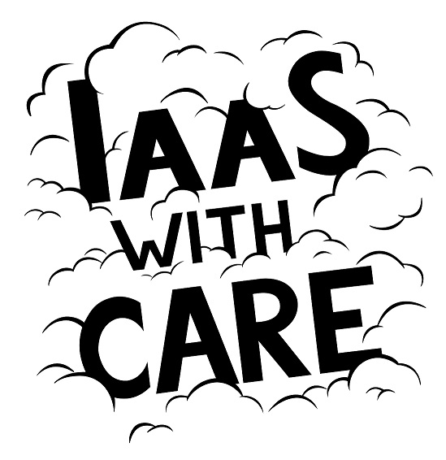

Облачный чек-лист, или как нас оценивал заказчик / Блог компании КРОК Облачные сервисы

Крупной иностранной компании понадобилось заехать в наше облако из-за закона о персональных данных. Поскольку они сами по себе занимаются аудитом других компаний, то подошли к вопросу привычно: изучили рынок, составили список требований к облаку и начали проверять, кто и как ему соответствует.

Переносили все системы: тестовые среды, тест \+ прод, препрод, все виртуальные машины, виртуальные сервера плюс все системы виртуальной инфраструктуры. Даже поддержка у них своя появилась в России. От нас — только аренда ресурсов.

Проверяли они нас знатно, по масштабам: почти полный аудит ЦОДа. Но они смотрели не железо и теххарактеристики в основном, а то, как выстроены процессы ИБ и как соблюдаются разные SLA. С их точки зрения, именно процессы по стабильности SLA указывают на качество работы компании. И мы им рассказывали про каждый из компонентов детально.

Я хочу поделиться списком критериев к проверке. Потому что появилась хоть какая-то методология, ведь до этого мало какой заказчик так системно подходил к вопросу.  

### Общие параметры

  

> Основных требований было порядка двух десятков. Среди них — такие базовые, как размещение платформы на двух дата-центрах, наличие консоли для управления ресурсами, возможность работать посредством API, оплата услуг по факту использования с гранулярностью не более одного часа, наличие средств автоматизации, например, Terraform. Другие требования не сказать чтобы нас сильно удивили, их просто поголовно все заказчики не предъявляют. Среди подобного требования — необходимость иметь в собственности здание, в котором работает облачный ЦОД.
> 
> Но тут всё понятно в целом. Этот заказчик, видимо, тоже читал историю российского рынка коллокации. Или кто-то из их клиентов где-то уже встревал за рубежом. Всё остальное в целом стандартное. Требование ЦОДа именно в Москве (такое тоже было в списке) — это для возможности приехать админу и для скорости обращений при репликации. Самый важный пункт после двух ЦОДов — детализированные метрики в SLA. Как я уже говорил, это их волновало больше всего по каждому пункту.

### Требования к персоналу

Это был один из самых сложных блоков, потому что заказчик, имея огромный опыт проектной деятельности (у них сотни производственных и розничных клиентов по миру), переложил его в какой-то степени и на ИТ. В целом это здравый подход, но требования получились «тяжёлыми».

Вот на что нас проверяли:

> *   Наличие трёх уровней технической поддержки платформы: первая линия -— решение инцидентов на уровне платформы (HW, виртуализация), вторая линия — решение проблем в инфраструктуре заказчика, находящейся в облачной платформе (уровень ОС, СУБД и прочего прикладного ПО), третья линия — подключение разработчиков облачной платформы поставщика и/или вендоров для решения проблем.
> *   Режим работы 24х7х365 первой линии технической поддержки.
> *   Обязательное знание русского и английского языков у специалистов всех уровней поддержки.
> *   Возможность заведения заявок по появившемуся инциденту по электронной почте или по звонку в службу технической поддержки.
> *   Возможность заведения заявок по появившемуся инциденту по звонку в службу технической поддержки.
> *   Время реакции специалистов технической поддержки на инцидент — от 10 до 15 минут в зависимости от приоритета заявки (поставщик обязан зафиксировать детализированное описание приоритетов инцидентов в контракте на услуги).
> *   Время решения инцидента— от 90 до 240 минут в зависимости от приоритета заявки (поставщик обязан зафиксировать детализированное описание приоритетов инцидентов в контракте на услуги).
> *   Обязательное наличие выделенной проектной команды, в состав которой входят: аккаунт-менеджер, менеджер проекта, технический архитектор, инженеры.
> *   Возможность использования различных средств коммуникации между командой поставщика и командой заказчика для более оперативного решения вопросов (например, с помощью мессенджеров Telegram, WhatsApp и пр.).
> *   Фиксирование списка проектной команды в подписанном контракте на услуги предоставления облачной платформы. Список должен включать в себя Ф.И.О., контактные номера мобильных телефонов, e-mail-адреса всех причастных к активности лиц заказчика и поставщика.

Здесь один из самых важных пунктов для заказчика был в том, что предоставляются именно три линии поддержки. Первая линия есть всегда и у всех, вторая линия поддержки обычно есть, но требования к ней уже довольно размытые. Но есть ещё и третья, которая по факту пилит различные фишки. И ничего не отдаётся на аутсорс, как делают иногда мелкие провайдеры. Проектом занимаются только свои сотрудники. На крупный проект заказчика выделяется не сервисная команда, а отдельная проектная, и это фиксируется в документах.

Выделенная проектная команда — отдельный важный момент. У нормального провайдера облачных услуг это всё обычно входит в услуги в каком-то виде. Но опять ж, нет прямого явного требования на это, и нет никаких стандартов. В целом есть люди, которые занимаются непосредственно поддержанием клиента, есть человек, который управляет конкретным проектом, есть инженеры. Выделять время для этих людей заказчику дорого, но нужно, потому что в большинстве случаев за пределами «просто хостингов» нужно как раз решение довольно сложных задач. Или простых, но быстро и с первого раза. Поэтому эти люди команды будут активны 24х7, всегда на связи и готовы помочь. С любым видом связи, который удобен клиенту. Это та услуга, которая обычно предоставляется «любимым» клиентам, но у нас — всем. И она задокументирована.

По общению: очень важно иметь личные телефоны в контактах на случай разных ЧП. В серьёзных проектах общение идёт через мессенджеры для ускорения (ещё пару лет назад было не так, все общались в почте). Директор по продажам дал личный номер, который не отключает ночью и в отпуске, — это норма. Но об этом может сказать не каждый.

Теперь чуть подробнее — про требования к отдельным подсистемам и процессам.

### Требования к сертификации

  

**...**

> *   Система учёта потребляемых ресурсов должна соответствовать установленным требованиям «Правил применения автоматизированных систем расчётов, утв. Приказом Мининформсвязи России 02.07.2007 № 73».
> *   Провайдер должен обладать актуальным сертификатом соответствия Систем управления информационной безопасности компании требованиям стандарта ISO/IEC 27001:2013 в отношении предоставления услуг аутсорсинга ЦОД и Виртуального ЦОД.
> *   Наличие актуального сертификата на облачную платформу PCI DSS v3.2.
> *   Аттестат соответствия PCI DSS 3.2 должен включать в себя ИТ-поддержку, физическую безопасность, безопасность системных сервисов, физическое оборудование, сети, хранилище.
> *   Сертификаты ЦОД Tier III Design, ЦОД Tier III Facility, ЦОД Tier III Operational sustainability.

  

Здесь без сюрпризов: PCI DSS для финансовых данных и T-III по трём сертификатам. Это важно именно для бизнеса заказчика. Для своей компании надо составлять собственный список сертификации. А вот первый пункт заслуживает отдельного внимания. Как выяснилось, для заказчика было важно, чтобы мы предоставили документ, который свидетельствует о грамотной работе нашей системы биллинга. На наше счастье, мы как раз примерно за год до того сертифицировали её в Минкомсвязи.

Ниже — перечень требований к основным элементам облачной платформы. Так как мы и ранее достаточно плотно работали с иностранными заказчиками, подобный список, но в сильно сокращённом виде, уже имелся. В той или иной мере информация была указана в SLA и других документах. По запросу бизнес-консультанта мы перелопатили всё, что у нас было, скомпоновали и проапдейтили. В результате получили достаточно солидный по объёму документ, который можем предлагать для ознакомления другим заказчикам.  
Итак, что конкретно указано в чек-листах относительно технических параметров платформы.

### Вычислительные ресурсы

  

**...**

> *   Выделение вычислительных ресурсов (виртуальные ядра, оперативная память) должно осуществляться гарантированным образом, исключающим возможность взаимного влияния виртуальных серверов заказчика, размещённых на одном физическом узле, друг на друга.
> *   Облачная платформа должна предоставлять возможность изменения объёма вычислительных ресурсов без пересоздания ВМ.
> *   Возможность гарантированного размещения ВМ на разных физических узлах.
> *   Облачная платформа должна предоставлять выбор кластера (ДЦ) при запуске ВМ.
> 
>   

  

  

### Диски

  

**...**

> *   Облачная платформа должна предоставлять возможность создания виртуальных дисков разной производительности (IOPS) через веб-интерфейс управления и API.
> *   Облачная платформа должна предоставлять возможность изменения производительности дисков «на лету».
> *   Дисковые ресурсы должны быть доступны с гарантиями производительности, измеряемой количеством IOPS на диск.
> *   Гарантии производительности дисков должны распространяться до 100 000 IOPS.
> *   Облачная платформа должна предоставлять возможность миграции данных между дисковыми ресурсами разной производительности «на лету» без остановки в предоставлении сервиса.
> 
>   

  

  

### Сети

  

**...**

> *   Облачная платформа должна позволять организовывать изолированные сетевые окружения, недоступные для других заказчиков облачной платформы.
> *   Изолированные сетевые окружения облачной платформы должны позволять управлять сетевой адресацией и маршрутизацией ИТ-инфраструктуры заказчика.
> *   Облачная платформа должна обладать функциональностью по подключению внешних выделенных каналов связи заказчиков.
> *   Должно быть обеспечено назначение или удаление внешних IP-адресов виртуальным серверам при помощи облачной платформы.
> *   Облачная платформа должна обеспечивать внешнее отказоустойчивое подключение на скорости не менее 40 Гбит/с.
> *   Облачная платформа должна иметь встроенные DNS и DHCP-сервисы.
> *   Облачная платформа должна обеспечивать IPSec VPN-соединения.
> *   Облачная платформа должна обеспечивать отказоустойчивый доступ в сеть Интернет, не зависящий от провайдера, и агрегировать не менее четырёх провайдеров.
> *   Пропускная способность между ВМ в пределах одного ЦОДа должна составлять не менее 10 Гбит/с.
> *   L2-связность между виртуальными инфраструктурами, развёрнутыми в различных дата-центрах.

  

  

### Объектное хранилище

  

**...**

> *   Облачная платформа должна иметь файловый сервис, совместимый по программному интерфейсу с Amazon S3.
> *   Объектное хранилище должно работать по протоколу, обеспечивающему возможность для хранения и получения любого объёма данных в любое время из любой точки сети Интернет.
> *   Система хранения данных в целях отказоустойчивости должна быть распределена как минимум между двумя площадками исполнителя.
> *   Система хранения должна иметь возможность расширяться по мере добавления файлов.
> *   Объектное хранилище должно поддерживать версионирование.
> *   Каждый объект в хранилище должен быть реплицирован между площадками исполнителя. В случае единичного отказа любого из компонент объектного хранилища не должно быть влияния на качество сервиса.
> *   Возможность работы с хранилищем через HTTPS.
> *   Поддержка access control list (ACL) и Policy.
> *   Поддержка политики Object Lifecycle срока жизни объектов.
> *   Возможность шифрования на стороне сервера Server side encryption.
> *   Поддержка статических web-сайтов и пользовательских имен для web-сайтов типа mysite.ru
> *   Уровень отказоустойчивости сервиса хранения — не ниже 99,99 %.

  

  

### ИБ

  

**...**

> *   Должно быть обеспечено разделение информационной среды заказчика в рамках облачной платформы на несколько независимых виртуальных сетей.
> *   Управление доступом к виртуальным сетям должно быть реализовано по различным портам и протоколам при помощи бесплатного встроенного межсетевого экрана.
> *   Должно быть обеспечено объединение серверов виртуальной платформы в одну виртуальную частную сеть (VPN) с физическими или виртуальными серверами заказчика, расположенными на удалённой площадке или ЦОДе.
> *   Доступ к функциям программного управления (API) облачной платформы должен быть предоставлен таким образом, чтобы не была допущена компрометация системы безопасности даже при использовании небезопасных транспортных протоколов.
> *   Для доступа к функциям программного управления (API) облачной платформой должен применяться протокол HTTPS. Сертификаты должны быть подписаны доверенными центрами сертификатов.
> *   Доступ к виртуальным Linux\\UNIX-серверам должен осуществляться посредством протокола SSH с использованием беспарольной аутентификации по ключам. Виртуальная платформа должна предоставлять возможность управления ключами аутентификации (создание и удаление), а также обеспечивать доступный из ВМ механизм для доставки публичных ключей в ВМ в процессе её загрузки.
> *   Организация защищённого доступа к серверам ИТ-системы должна осуществляться с использованием IPsec VPN-соединения.
> *   В виртуальную платформу должен быть встроен межсетевой экран, настраиваемый отдельно для каждой виртуальной сети, а также для виртуальных сетей изолированных облачных окружений.
> *   Наличие результатов теста на проникновение со сроком исполнения не более 1 года.

  

  

### Резервное копирование

  

**...**

> *   Управление услугой резервного копирования должно производиться заказчиком самостоятельно через веб-интерфейс управления.
> *   Через веб-интерфейс должна быть доступна функциональность по заданию расписания резервного копирования отдельных серверов, а также по их ручному резервному копированию и восстановлению.
> *   Услуга по резервному копированию данных должна учитываться и оплачиваться по факту использования, а именно по Гигабайтам защищаемых данных в месяц.
> *   Услуга по резервному копированию данных должна предоставлять возможность по резервному копированию распространённого корпоративного системного и прикладного ПО. Программные агенты, устанавливаемые на защищаемые серверы, должны быть бесплатными.
> *   Управление резервным копированием — через веб-интерфейс и через программный агент.
> *   Использование файлового эластичного S3-хранилища для хранения копий.
> *   Использование дедупликации.

  

  

### Биллинг

  

**...**

> *   В облачной платформе должно быть доступно логическое деление ВМ на группы с опцией раздельного биллинга.
> *   Оплата только фактически занятого объёма.

  

  

### Чем кончилось

Проверка была для нас действительно изматывающей, но благодаря ей мы сами многому научились. Например, ориентируясь на иностранных коллег, отработали несколько процедур, привели в полный порядок все документы. Собственно, дальше мы поработали некоторое время, а потом предложили стратегическое партнёрство. Потому что у этой компании также много клиентов в России. Сейчас это всё — на стадии обсуждения, но методология проверки уже появилась. Разумеется, чек-листы не дают полного представления о том, что и как смотрели бизнес-консультанты, но я постарался выгрузить основное, что позволит вам самим построить методологию проверки. Тут, конечно, есть некоторое лукавство с моей стороны, потому что мы эту проверку прошли и победили, то есть чек-листы почти в полной мере применимы к нашему облаку. Потому что наша платформа соответствовала их крупному проекту. Надеюсь, что вы используете здравый смысл и поймёте, что именно нужно вашему проекту от платформы, и соответственно поменяете требования.

Если вдруг остались вопросы не для комментариев — моя почта NiVasilev@croc.ru