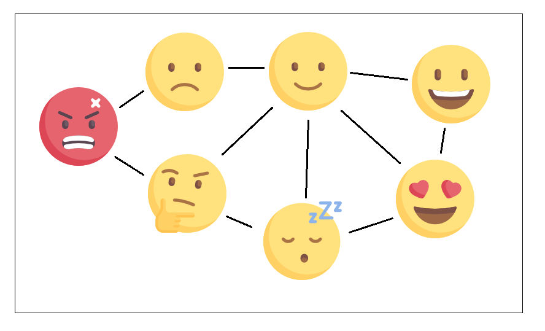

Определение «токсичной личности» в ИТ

[Wladyslaw_Salabun](https://habr.com/ru/users/Wladyslaw_Salabun/ "Автор публикации") сегодня в 12:43

В [прошлой статье](https://habr.com/post/432700/) мы с автором пришли к выводу, что нет точного определения «токсичной личности». Поэтому я решил восполнить этот пробел в образовании и самостоятельно сформулировать это определение.

**В чем заключается суть проблемы?**

Независимо от типа отношений обе стороны всегда считают, что их в чем-то обидели. Например, коллектив не дает человеку высказывать свое мнение. Тут возможны 2 варианта:

1.  Коллектив считает поведение человека неприемлемым (токсичным)
2.  Человек считает действия коллектива манипулятивными (токсичными)

  
Ну и кто прав? Вы можете написать в комментариях свое мнение, а я предложу вам свое.  
  
Первым делом я пошел по всех первых страницах в гугле по запросу «токсичная личность», все прочитал, переварил, и у меня получилось такое определение:  
«

Токсичная личность

» — работник, который не чувствует себя частью коллектива, или разделяет сплоченный коллектив на части.

Суть коллектива в том, чтобы прилагать

совместные усилия

для достижения

общей цели

. А «токсичная личность» превращает работу в сказку про лебедя, рака, и щуку, поэтому

разделение коллектива

на части я считаю главной ее чертой.

А теперь примеры. Яды, которыми коллектив разделяется на части и антидоты:  
(антидоты придумал я сам, если у вас есть идеи получше, напишите в комментариях)

* * *

**Яд:** «Я всегда прав, потому что у меня больше опыта, а вы не компетентны и должны писать код как я пишу». (

критика

)

**Антидот:** «Если вы не можете объяснить почему ваш код лучше, значит вы сами в нем не уверены. Были бы уверены — сразу бы показали как нужно и сказали почему».

* * *

**Яд:** «Лучше говорить прямо. Острое словцо помогает мотивировать человека быстрее решить задачу». (

напрасные траты времени

)

**Антидот:** «Если нецензурная речь помогает быстрее решать задачу, то почему вы не используете те же методы при составлении SQL запросов, например? Добавьте туда побольше словечек, чтобы базе данных еще понятнее было».

* * *

**Яд:** «Я все равно скажу все, что думаю про их баг-репорты! Вы просто отнимаете у меня право на свободу слова, вы манипуляторы!» (

напрасные траты сил

)

**Антидот:** «Наша цель не ограничивать вас в чем-либо, а быстрее и легче создать такой-то продукт. Как именно ваши высказывания помогают другим людям быстрее делать свою работу?»

* * *

**Яд:** «Это всего лишь бизнес. Выживает сильнейший.» (

отсутствие эмпатии

)

**Антидот:** «Все вещи в мире созданы группами людей. Если вы уверены, что вы сильнее всех — давно бы сделали все сами, зачем вы тратите наше время? Хотите работать вместе — давайте договариваться».

* * *

**Яд:** «IT — не детский садик. Вы просто неженки, обиженки. Вы не стрессоустойчивые!» (высмеивание)

**Антидот:** «А с каким именно стрессом должны бороться наши сотрудники? С тем, который вы создаете умышленно своими высказываниями?»

* * *

Еще существуют люди, которые дают коллегам заведомо ложную информацию, либо вообще не делятся ею. Пример яда я не придумал, но тут наверно всем понятно, что их нужно в первую очередь выявлять и увольнять, потому что это прямые убытки для всех.

Итак, мой вердикт:

Оба неправы. Тот, кто с позиции силы делит коллектив на части, и тот, кто защищаясь отдаляется от коллектива — оба участника отношений являются «токсичными личностями»

.

**Какие решения проблемы существуют?**

Роберт Саттон предлагает вообще не работать с токсичными людьми. И это кажется самым верным решением, потому что перевоспитать человека невозможно.

Я лично считаю, что нужно дать человеку шанс, или даже два. Возможно тогда человек поймет, что стратегия “око за око, зуб за зуб” приносит прибыль только в условиях парадокса заключенного, а в любом коллективе всегда выгоднее кооперация. Но, если вокруг много «токсичных людей», то тут единственный выход срочно бежать из такого коллектива.

Согласны ли вы с моим определением токсичности? Жду ваши мнения в комментариях.

Теги:

*   [никто не читает теги](https://habr.com/ru/search/?q=%5B%D0%BD%D0%B8%D0%BA%D1%82%D0%BE%20%D0%BD%D0%B5%20%D1%87%D0%B8%D1%82%D0%B0%D0%B5%D1%82%20%D1%82%D0%B5%D0%B3%D0%B8%5D&target_type=posts)