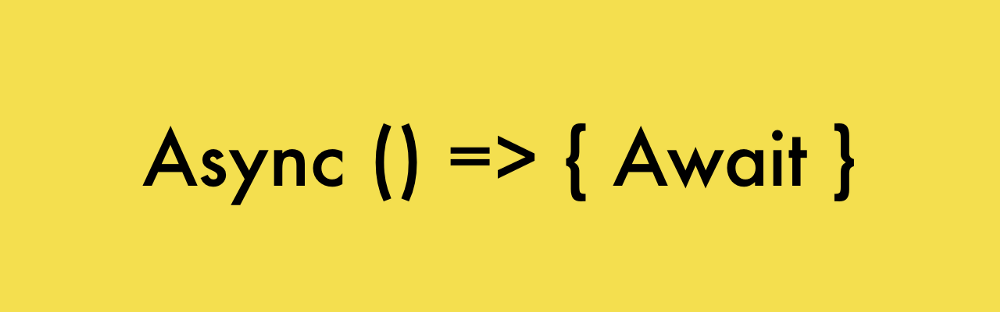
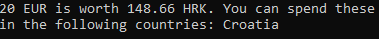

Осваиваем async/await на реальном примере / Блог компании RUVDS.com

Конструкция async/await представляет собой сравнительно новый подход к написанию асинхронного кода в JavaScript. Она основана на промисах и, в результате, не блокирует главный поток. Новшество этой конструкции заключается в том, что благодаря ей асинхронный код становится похожим на синхронный и ведёт себя подобным образом. Это открывает перед программистом замечательные возможности.

До появления async/await при разработке асинхронных механизмов программ использовались коллбэки и промисы. Автор материала, перевод которого мы публикуем сегодня, предлагает сначала вспомнить о том, как писать код по-старому, а потом, на реальном примере, изучить применение async/await.  

## Коллбэки

Вот как выглядит пример кода, в котором используются коллбэки (функции обратного вызова):

    setTimeout(() => {
      console.log('This runs after 1000 milliseconds.');
    }, 1000);

При использовании вложенных функций обратного вызова возникает проблема, называемая «адом коллбэков». Вот упрощённый пример кода, иллюстрирующий эту проблему:

    asyncCallOne(() => {
      asyncCallTwo(() => {
        asyncCallThree(() => {
          asyncCallFour(() => {
            asyncCallFive(() => {
              
            })
          })
        })
      })
    })

Если в коде присутствуют структуры, состоящие из вложенных друг в друга коллбэков, такой код может оказаться трудным для понимания, его будет сложно поддерживать.

## Промисы

Вот пример кода, в котором используются промисы (Promise-объекты):

    const promiseFunction = new Promise((resolve, reject) => {
      const add = (a, b) => a + b;
      resolve(add(2, 2));
    });
    promiseFunction.then((response) => {
      console.log(response);
    }).catch((error) => {
      console.log(error);
    });

Функция `promiseFunction()` из этого примера возвращает объект `Promise`, который представляет собой некое действие, выполняемое функцией. Вызов метода `resolve()` указывает промису на то, что его работа успешно завершена. В подобных конструкциях используется и метод промисов `.then()` — с его помощью, после успешного разрешения промиса, можно выполнить некий коллбэк. Метод `.catch()` вызывается в тех случаях, если в ходе работы промиса что-то пошло не так.

## Асинхронные функции

Функции, объявленные с использованием ключевого слова `async` (асинхронные функции), дают нам возможность писать аккуратный и не перегруженный служебными конструкциями код, позволяющий получить тот же результат, который мы получали с использованием промисов. Надо отметить, что ключевое слово `async` — это, в сущности, лишь «синтаксический сахар» для промисов.

Асинхронные функции создают, пользуясь при объявлении функции ключевым словом `async`. Выглядит это так:

    const asyncFunction = async () => {
      
    }

Выполнение асинхронной функции можно приостановить с использованием ключевого слова `await`. Его можно использовать только в асинхронных функциях. Оно позволяет возвратить результат работы асинхронной функции, который будет доступен после того, как такая функция завершит выполнение некоей задачи.

Сравним работу асинхронной функции и промиса, которые возвращают строку:

    
    const asyncGreeting = async () => 'Greetings';
    
    const promiseGreeting = () => new Promise(((resolve) => {
      resolve('Greetings');
    }));
    asyncGreeting().then(result => console.log(result));
    promiseGreeting().then(result => console.log(result));

Несложно заметить, что использование ключевого слова `async` позволяет писать асинхронный код, который выглядит как синхронный. С таким кодом гораздо легче работать.

Теперь, когда мы рассмотрели базовые вещи, перейдём к нашему примеру.

## Конвертер валют

  

### ▍Предварительная подготовка

Здесь мы создадим простое, но познавательное с точки зрения изучения конструкции async/await приложение. Оно представляет собой конвертер валют, который использует реальные данные, получаемые из соответствующих API. Программа принимает сумму в некоей валюте, код этой валюты, а также код валюты, в которую мы хотим конвертировать эту сумму. После этого программа выводит результат, предварительно загрузив актуальные данные по курсам валют. Программа также выводит список стран, в которых можно потратить деньги в той валюте, в которую осуществляется перевод заданной суммы.

В частности, здесь мы собираемся пользоваться данными из двух асинхронных источников информации:

1.  Сервис [currencylayer.com](https://currencylayer.com/). На этом сайте нужно будет завести бесплатную учётную запись и получить ключ для доступа к API (API Access Key). Отсюда мы будем брать данные, необходимые для конверсии суммы из одной валюты в другую.
2.  Сервис [restcountries.eu](http://restcountries.eu/). Им можно пользоваться без регистрации. Отсюда мы загрузим данные о том, где можно пользоваться валютой, в которую мы конвертировали заданную сумму денег.

Создадим новую директорию и выполним в ней команду `npm init`. Когда программа задаст нам вопрос об имени создаваемого пакета — введём `currency-converter`. На остальные вопросы программы можно не отвечать, нажимая в ответ `Enter`. После этого установим в нашем проекте пакет Axios, выполнив в его директории команду `npm install axios --save`. Создадим новый файл с именем `currency-converter.js`.

Приступим к написанию кода программы, подключив в этом файле Axios:

    const axios = require('axios');

В нашем проекте будет три асинхронные функции. Первая будет загружать данные о валютах. Вторая будет загружать данные о странах. Третья будет эти данные собирать, представлять в удобном для пользователя виде и выводить на экран.

### ▍Первая функция — асинхронная загрузка данных о валютах

Создадим асинхронную функцию `getExchangeRate()`, которая будет принимать два аргумента: `fromCurrency` и `toCurrency`:

    const getExchangeRate = async (fromCurrency, toCurrency) => {}

В этой функции нам надо загрузить данные. Благодаря использованию конструкции async/await можно записывать полученные данные непосредственно в некую переменную или константу. Перед написанием кода этой функции не забудьте зарегистрироваться [на сайте](https://currencylayer.com/) и получить ключ доступа к API. Для загрузки данных нам понадобится следующая конструкция:

    const response = await axios.get('http://www.apilayer.net/api/live?access_key=[ваш код доступа к API]');

После получения ответа системы нужные нам данные можно будет обнаружить в объекте `response` по адресу `response.data.quotes`. Вот как выглядит фрагмент объекта с интересующими нас данными (он виден в программе как `response.data`):

    {
       "success":true,
       "terms":"https:\/\/currencylayer.com\/terms",
       "privacy":"https:\/\/currencylayer.com\/privacy",
       "timestamp":1547891348,
       "source":"USD",
       "quotes":{
          "USDAED":3.673042,
          "USDAFN":75.350404,
          "USDALL":109.203989,
    ...
    
          "USDZWL":322.355011
       }
    }

Поместим объект с курсами валют в константу `rate`:

    const rate = response.data.quotes;

Код базовой валюты можно найти по адресу `response.data.source`. Запишем код базовой валюты в константу `baseCurrency`:

    const baseCurrency = response.data.source;

Так как по умолчанию данные, возвращаемые этим API, представляют собой курс валюты по отношению к американскому доллару (USD), создадим константу `usd`, в которую запишем результат деления 1 на курс валюты, в которой задана сумма:

    const usd = 1 / rate[`${baseCurrency}${fromCurrency}`]; 

Обратите внимание на то, как формируется ключ, по которому мы получаем значение курса. В объекте, получаемом из API, фрагмент которого приведён выше, ключи представляют собой строки, начинающиеся с `USD` и заканчивающиеся кодом соответствующей валюты. Так как подразумевается, что наша программа принимает строковые коды валют, мы формируем ключ, конкатенируя строку, содержащую код базовой валюты, и то, что передано функции в параметре `fromCurrency`.

Теперь, для того, чтобы получить курс обмена валюты `fromCurrency` на валюту `toCurrence`, мы умножаем константу `usd` на курс для `toCurrency`. Выглядит это так:

    const exchangeRate = usd * rate[`${baseCurrency}${toCurrency}`]; 

В итоге то, что попадёт в `exchangeRate`, мы из функции возвращаем. Вот как выглядит её полный код:

    const getExchangeRate = async (fromCurrency, toCurrency) => {
        try {
          const response = await axios.get('http://www.apilayer.net/api/live?access_key=[ваш код доступа к API]);
    
          const rate = response.data.quotes;
          const baseCurrency = response.data.source;
          const usd = 1 / rate[`${baseCurrency}${fromCurrency}`];
          const exchangeRate = usd * rate[`${baseCurrency}${toCurrency}`];
      
          return exchangeRate;
        } catch (error) {
          throw new Error(`Unable to get currency ${fromCurrency} and ${toCurrency}`);
        }
    };

Обратите внимание на то, что для обработки ошибок, которые могут возникнуть в ходе выполнения запроса, используется обычная конструкция try/catch.

### ▍Вторая функция — асинхронная загрузка данных о странах

Наша вторая функция, `getCountries()`, асинхронно загружающая информацию о странах, в которых можно пользоваться валютой, в которую мы преобразуем заданную в другой валюте сумму, будет принимать аргумент `currencyCode`:

    const getCountries = async (currencyCode) => {}

Для загрузки данных мы пользуемся следующей командой:

    const response = await axios.get(`https://restcountries.eu/rest/v2/currency/${currencyCode}`);

Если, например, мы используем в запросе код `HRK` (хорватская куна), то в ответ нам придёт JSON-код, фрагмент которого показан ниже:

    [  
       {  
          "name":"Croatia",
    ...
    
       }
    ]

Он представляет собой массив объектов с информацией о странах. В свойствах `name` этих объектов содержится название страны. Обратиться к этому массиву можно с помощью конструкции `response.data`. Применим метод массивов `map()` для извлечения названий стран из полученных данных и возвратим из функции `getCountries()` эти данные, которые будут представлять собой массив названий стран:

    return response.data.map(country => country.name);

Вот как выглядит полный код функции `getCountries()`:

    const getCountries = async (currencyCode) => {
        try {
          const response = await axios.get(`https://restcountries.eu/rest/v2/currency/${currencyCode}`);
      
          return response.data.map(country => country.name);
        } catch (error) {
          throw new Error(`Unable to get countries that use ${currencyCode}`);
        }
    };

  

### ▍Третья функция — сбор и вывод данных

Наша третья асинхронная функция, `convertCurrency ()`, будет принимать аргументы `fromCurrency`, `toCurrency` и `amount` — коды валют и сумму.

    const convertCurrency = async (fromCurrency, toCurrency, amount) => {}

В ней мы сначала получаем обменный курс:

    const exchangeRate = await getExchangeRate(fromCurrency, toCurrency);

Потом загружаем список стран:

    const countries = await getCountries(toCurrency);

Далее — выполняем конверсию:

    const convertedAmount = (amount * exchangeRate).toFixed(2);

А после того, как все необходимые данные собраны — возвращаем строку, которую увидит пользователь программы:

    return `${amount} ${fromCurrency} is worth ${convertedAmount} ${toCurrency}. You can spend these in the following countries: ${countries}`;

Вот полный код функции:

    const convertCurrency = async (fromCurrency, toCurrency, amount) => {
        const exchangeRate = await getExchangeRate(fromCurrency, toCurrency);
        const countries = await getCountries(toCurrency);
        const convertedAmount = (amount * exchangeRate).toFixed(2);
      
        return `${amount} ${fromCurrency} is worth ${convertedAmount} ${toCurrency}. You can spend these in the following countries: ${countries}`;
    };

Обратите внимание на то, что в этой функции нет блока try/catch, так как она работает лишь с результатами, предоставленными ей двумя ранее описанными функциями.

### ▍Запуск программы

Мы подготовили три функции, две из которых загружают данные из различных сервисов, а одна собирает эти данные и готовит к выводу. Теперь нам осталось лишь вызвать эту функцию, передав ей всё необходимое. Мы не будем реализовывать здесь механизмы, позволяющие вызывать нашу программу из командной строки с передачей ей кодов валют и сумм, хотя вы, при желании, вполне можете это сделать. Мы просто вызовем функцию `convertCurrency()`, передав ей необходимые данные:

    convertCurrency('EUR', 'HRK', 20)
        .then((message) => {
          console.log(message);
        }).catch((error) => {
          console.log(error.message);
        });

Здесь мы хотим выяснить — на сколько хорватских кун можно обменять 20 евро и попутно узнать о том, в каких странах можно эти деньги потратить.

Вызовем программу, введя в терминале следующую команду:

    node currency-converter.js

В ответ мы получим примерно следующее.

_Результат работы программы_

Вот, на всякий случай, полный код нашего проекта.

    const axios = require('axios');
    
    const getExchangeRate = async (fromCurrency, toCurrency) => {
        try {
          const response = await axios.get('http://www.apilayer.net/api/live?access_key=[ваш код доступа к API]');
    
          const rate = response.data.quotes;
          const baseCurrency = response.data.source;
          const usd = 1 / rate[`${baseCurrency}${fromCurrency}`];
          const exchangeRate = usd * rate[`${baseCurrency}${toCurrency}`];
      
          return exchangeRate;
        } catch (error) {
          throw new Error(`Unable to get currency ${fromCurrency} and ${toCurrency}`);
        }
    };
      
    const getCountries = async (currencyCode) => {
        try {
          const response = await axios.get(`https://restcountries.eu/rest/v2/currency/${currencyCode}`);
      
          return response.data.map(country => country.name);
        } catch (error) {
          throw new Error(`Unable to get countries that use ${currencyCode}`);
        }
    };
      
    const convertCurrency = async (fromCurrency, toCurrency, amount) => {
        const exchangeRate = await getExchangeRate(fromCurrency, toCurrency);
        const countries = await getCountries(toCurrency);
        const convertedAmount = (amount * exchangeRate).toFixed(2);
      
        return `${amount} ${fromCurrency} is worth ${convertedAmount} ${toCurrency}. You can spend these in the following countries: ${countries}`;
    };
      
    convertCurrency('EUR', 'HRK', 20)
        .then((message) => {
          console.log(message);
        }).catch((error) => {
          console.log(error.message);
        });

  

## Итоги

Надеемся, этот пример использования конструкции async/await в реальных условиях помог тем, кто раньше этой конструкции не понимал, в ней разобраться.

**Уважаемые читатели!** Если вы используете на практике конструкцию async/await — просим поделиться впечатлениями о ней.

