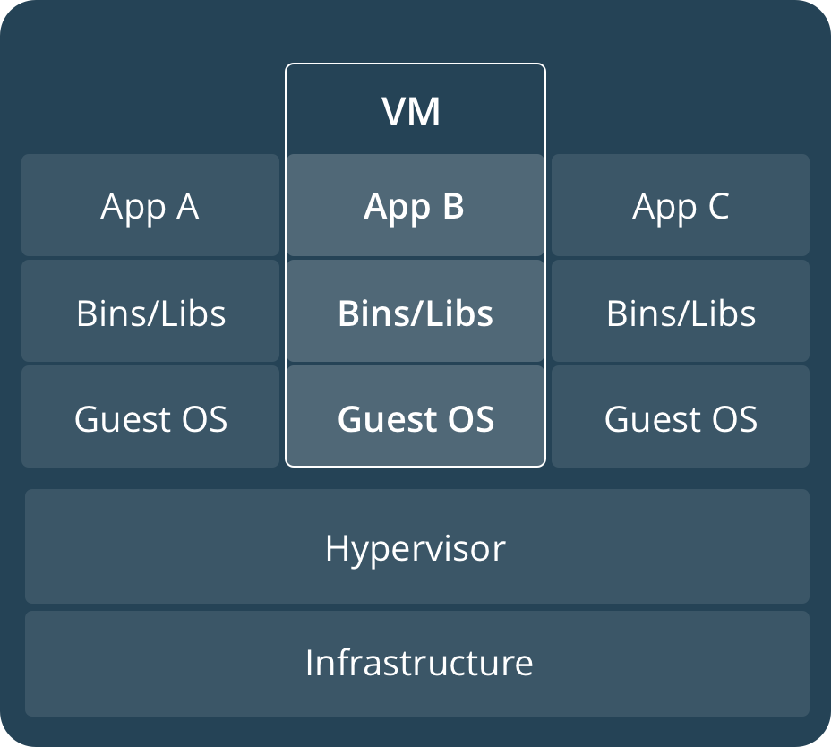
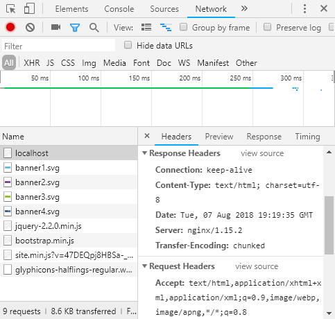

Пакуем приложения ASP.NET Core с помощью Docker / Блог компании Microsoft

Приложения ASP.NET Core теперь по-настоящему кросс-платформенны и могут запускаться в «никсах», а соответственно, и в Docker. Посмотрим, как их можно упаковать, чтобы развертывать на Linux и использовать в связке с Nginx. Подробности под катом!

_Примечание: мы продолжаем серию публикаций полных версий статей из журнала Хакер. Орфография и пунктуация автора сохранены._

  

## О докере

О микросервисной архитектуре слышали практически все. Сам концепт разбития приложения на части не сказать чтобы новый. Но, новое – это хорошо забытое и переработанное старое.

Если постараться рассказать об архитектуре в нескольких словах, то веб приложение разбивается на отдельные унитарные части — сервисы. Сервисы не взаимодействуют между собой напрямую и не имеют общих баз данных. Это делается для возможности изменять каждый сервис без последствий для других. Сервисы упаковываются в контейнеры. Среди контейнеров правит балом Docker.

Для того, чтобы описать что такое Docker очень часто упрощенно используют термин «виртуальная машина». Сходство определенно есть, но говорить так неправильно. Проще всего это различие понять, посмотрев на следующие изображения с официальной документации докера:

Контейнеры используют ядро текущей операционной системы и делят его между собой. В то время как виртуальные машины с помощью hypervisor используют аппаратные ресурсы.  
Образ/Image докера это read-only объект, который, по сути, хранит в себе шаблон для построения контейнера. Контейнер — это среда в которой выполняется код. Образы хранятся в репозиториях. Например, официальный репозиторий [Docker Hub](https://hub.docker.com/) позволяет хранить только один образ приватно. Впрочем, это бесплатно, поэтому даже за это нужно их поблагодарить.

  

Докер не является единственным представителем контейнеризации. Кроме его существуют и другие технологии. Например:

[rkt](https://coreos.com/rkt/) (произносится как 'рокет') от CoreOS

[LXD](https://www.ubuntu.com/containers/lxd) (произносится как ‘лексди’) от Ubuntu

Windows Containers — ни за что не угадаете от кого.

Теперь, когда мы ознакомились с теорией, давайте перейдем к практике.

Установку докера особого смысла разбирать нет, ведь его можно установить на множество операционных систем. Укажу только, что скачать его под свою платформу можно из [Docker Store](https://store.docker.com/search?type=edition&amp;offering=community). Если вы устанавливаете Docker под Windows, то необходимо чтобы в BIOS и в ОС была включена виртуализация. О том как включить ее в 10-ке можно прочитать в следующем артикуле: [Установка Hyper-V вWindows10](https://docs.microsoft.com/ru-ru/virtualization/hyper-v-on-windows/quick-start/enable-hyper-v)

  

## Создание проекта с поддержкой докера

Докер это, конечно Linux-овый продукт, но при необходимости можно его использовать при разработке под Mac или под Windows. При создании проекта в Visual Studio для добавления поддержки докера достаточно поставить флажок Enable Docker Support.

Поддержку докера можно добавить и в существующий проект. Добавляется она в проект таким же образом, как и добавляются различные новые компоненты. Контекстное меню Add – Docker Support.

В случае, если на вашей машине установлен и запущен докер, будет автоматически открыта консоль и выполнена команда

  

    docker pull microsoft/aspnetcore:2.0

которая запускает процесс скачивания образа. Этот образ фактически является заготовкой на основе которого будет создан ваш образ. ASP.NET Core 2.1 использует уже другой образ – [microsoft/dotnet:sdk](https://hub.docker.com/r/microsoft/dotnet/)

В директории с решением для вас будут созданы автоматически следующие файлы:  
.dockerignore (исключение файлов и директорий из образа докера), docker-compose.yml (с помощью этого файла можно сконфигурировать выполнение нескольких сервисов), docker-compose.override.yml (вспомогательная конфигурация docker-compose), docker-compose.dcproj (файл проекта для Visual Studio).

В директории с проектом создастся файл Dockerfile. Собственно, с помощью этого файла мы и создаем свой образ. По умолчанию (в случае, если проект называется DockerServiceDemo) он может выглядеть примерно так:

  

    FROM microsoft/aspnetcore:2.0 AS base
    WORKDIR /app
    EXPOSE 80
    
    FROM microsoft/aspnetcore-build:2.0 AS build
    WORKDIR /src
    
    COPY DockerServiceDemo/DockerServiceDemo.csproj DockerServiceDemo/
    RUN dotnet restore DockerServiceDemo/DockerServiceDemo.csproj
    COPY . .
    WORKDIR /src/DockerServiceDemo
    RUN dotnet build DockerServiceDemo.csproj -c Release -o /app
    
    FROM build AS publish
    RUN dotnet publish DockerServiceDemo.csproj -c Release -o /app
    
    FROM base AS final
    WORKDIR /app
    COPY --from=publish /app .
    ENTRYPOINT ["dotnet", "DockerServiceDemo.dll"]

Начальная конфигурация для .NET Core 2.0 не позволит вам сразу построить образ с помощью команды docker build. Она настроена на то, что будет запущен файл docker-compose из директории уровнем выше. Для того чтобы построение происходило успешно Dockerfile можно привести к подобному виду:

  

    FROM microsoft/aspnetcore:2.0 AS base
    WORKDIR /app
    EXPOSE 80
    
    FROM microsoft/aspnetcore-build:2.0 AS build
    WORKDIR /src
    COPY DockerServiceDemo.csproj DockerServiceDemo.csproj
    RUN dotnet restore DockerServiceDemo.csproj
    COPY . .
    WORKDIR /src
    RUN dotnet build DockerServiceDemo.csproj -c Release -o /app
    
    FROM build AS publish
    RUN dotnet publish DockerServiceDemo.csproj -c Release -o /app
    
    FROM base AS final
    WORKDIR /app
    COPY --from=publish /app .
    ENTRYPOINT ["dotnet", "DockerServiceDemo.dll"]

Все что я сделал, это убрал лишнюю директорию DockerServiceDemo.

Если вы используете Visual Studio Code, то файлики вам придется генерировать вручную. Хотя в VS Code и имеется вспомогательный функционал в виде расширения [Docker](https://marketplace.visualstudio.com/items?itemName=PeterJausovec.vscode-docker) Добавлю ссылку на мануал о том как работать с докером из VS Code – [Working with Docker](https://code.visualstudio.com/docs/azure/docker). Да, статья на английском, но она ведь с картинками

  

## «Три аккорда» докера

Для ежедневной работы с докером достаточно помнить всего лишь несколько команд.

Самая главная команда это, конечно, построение образа. Для того чтобы это сделать необходимо с помощью bash/CMD/PowerShell зайти в директорию, где находится Dockerfile и выполнить команду:

  

    docker build -t your_image_name . 

Здесь после параметра -t задается имя вашего образа. Внимание — в конце команды после пробела точка. Эта точка означает что используется текущая директория. Образ можно пометить образ каким-нибудь тэгом (номером или названием). Для этого после имени поставить двоеточие и указать тэг. Если тег не указать, то по умолчанию он будет задан с наименованием latest. Для того, чтобы отправить образ в репозиторий, необходимо, чтобы имя образа включало в себя имя репозитория. Примерно так:

  

    docker build -t docker_account_name/image_name:your_tag . 

Здесь your\_docker\_account_name это имя вашего аккаунта в docker hub.

Если вы создали образ толко с локальным именем, не включающим в себя репозиторий, то пометить образ другим именем можно и после построения с помощью следующей команды:

  

    docker tag image_name docker_account_name/image_name:your_tag

Для того чтобы отправить изменения в хаб теперь необходимо выполнить следующую команду:

  

    docker push docker_account_name/image_name:your_tag

Перед этим необходимо зайти в ваш аккаунт докера. На Windows это делается из UI приложения, а вот на *nix это делается командой:

  

    docker login

На самом деле трех команд недостаточно. Необходимо еще иметь возможность проверить работу контейнера. Команда, с помощью которой можно запустить контейнер выглядит так:

  

    docker run -it -p 5000:80 image_name

Параметр -it создаст псевдо-TTY и ваш контейнер станет отвечать на запросы. После запуска команды сервис станет доступным по адресу [http://localhost:5000/](http://localhost:5000/)

-p 5000:80 связывает порт 5000 контейнера с портом 80 хоста.

Кроме того, есть такие команды:

  

    docker ps –a

Покажет вам список контейнеров. Так как добавлен ключ -a, то будут отображены все контейнеры, а не только те, которые запущены на данный момент.

  

    docker rm container_name

Эта команда удалит контейнер с именем container_name. rm – сокращение от remove

  

    docker logs container_name

Отобразит логи контейнера

  

    docker rmi image_name

Удалит образ с именем image_name

  

## Запуск контейнера через реверс прокси-сервер

Дело в том, что сами приложения .NET Core используют свой веб-сервер Kestrel. Этот сервер не рекомендуется для работы на production. Почему? Есть несколько объяснений.  
Если есть несколько приложений, которые делят между собой IP и порт, то Kestrel не сможет распределять трафик. Кроме того, реверс прокси-сервер предоставляет собой дополнительный слой безопасности, упрощает балансировку нагрузки и настройку SSL, а также лучше интегрируется в существующую инфраструктуру. Для большинства разработчиков самой главной причиной необходимости реверс-прокси, является дополнительная безопасность.

Для начала восстановим начальную конфигурацию Dockerfile. А после разберёмся с файлом docker-compose.yml и попробуем запустить наш сервис в одиночку. Формат файла yml читается так «ямл» и является аббревиатурой то ли от «Yet Another Markup Language», то ли от «YAML Ain't Markup Language». То ли еще один язык разметки, то ли не язык разметки совсем. Как-то все не определенно.

Мой файл docker-compose созданный по умолчанию выглядит так:

  

    version: '3.4'
    
    services:
      dockerservicedemo:
        image: ${DOCKER_REGISTRY}dockerservicedemo
        build:
          context: .
          dockerfile: DockerServiceDemo/Dockerfile

Файл docker-compose.override.yml добавляет в конфигурацию несколько настроек:  
version: '3.4'

  

    services:
      dockerservicedemo:
        environment:
          - ASPNETCORE_ENVIRONMENT=Development
        ports:
          - "80"

Построить созданное решение мы можем с помощью docker-compose build, в вызвав команду docker-compose up мы запустим наш контейнер. Все работает? Тогда переходим к следующему шагу. Создаем файл nginx.info. Конфигурация будет примерно следующая:

  

    worker_processes 4;
    
    events { worker_connections 1024; }
    
    http {
        sendfile on;
    
        upstream app_servers {
            server dockerservicedemo:80;
        }
    
        server {
        listen 80;
        location / {
            proxy_pass         http://app_servers;
            proxy_http_version 1.1;
            proxy_set_header   Upgrade $http_upgrade;
            proxy_set_header   Connection keep-alive;
            proxy_set_header   Host $host;
            proxy_cache_bypass $http_upgrade;
            proxy_set_header   X-Forwarded-For $proxy_add_x_forwarded_for;
            proxy_set_header   X-Forwarded-Proto $scheme;
          }
        }
    }

Здесь мы указываем, что nginx будет прослушивать 80-ый порт (listen 80;). А полученные запросы будет переадресовывать на 80-ый порт хоста в контейнер dockerservicedemo. Кроме того, мы указываем nginx какие заголовки необходимо передавать дальше.

Мы можем использовать http в nginx, а доступ к вебсайту осуществлять через https. Когда https запрос проходит через http прокси, то много информации из https не передается в http. Кроме того, при использовании прокси теряется внешний IP адрес. Для того, чтобы эта информация передавалась в заголовках, необходимо изменить код нашего ASP.NET проекта и добавить в начало метода Configure файла Startup.cs следующий код:

  

     app.UseForwardedHeaders(new ForwardedHeadersOptions {
                    ForwardedHeaders = ForwardedHeaders.XForwardedFor | ForwardedHeaders.XForwardedProto
                });

Большинство прокси серверов используют заголовки X-Forwarded-For и X-Forwarded-Proto. Именно эти заголовки и указаны сейчас в конфигурации nginx.

Теперь включим образ nginx и файл nginx.conf в конфигурацию doker-compose. Осторожно в YAML пробелы имеют значение:

  

    version: '3.4'
    
    services:
      dockerservicedemo:
        image: ${DOCKER_REGISTRY}dockerservicedemo
        build:
          context: .
          dockerfile: DockerServiceDemo/Dockerfile
        ports:
          - 5000:80
      proxy:
        image: nginx:latest
        volumes:
          - ./DockerServiceDemo/nginx.conf:/etc/nginx/nginx.conf
        ports:
          - 80:80

Здесь мы добавляем к нашей конфигурации прокси в виде образа nginx. К этому образу «цепляем» внешний файл настроек. Его мы как-бы монтируем в файловую систему контейнера с помощью механизма под названием volume. Если добавить в конец :ro то объект будет смонтирован только для чтения.

Прокси слушает внешний 80-ый порт машины на которой запущен контейнер и передает запрос на внутренний 80-ый порт контейнера.

Выполнив команду doker-compose up мы запулим, то есть извлечем из репозитория образ nginx и стартанем наш контейнер вместе с контейнером прокси. Теперь по адресу [http://localhost:80/](http://localhost/) он будет доступен через nginx. На 5000-ом порту приложение «крутится» еще и под Kestrel.

Проверить то, что запрос к веб приложению проходит через реверс-прокси мы можем так. Открыть в браузере Chrome developer tools и зайти на закладку Network. Здесь кликнуть на localhost и выбрать закладку Headers.

  

## Запускаем контейнер через прокси и HTTPS

Версия ASP.NET Core 2.1 принесла с собой улучшения поддержки HTTPS.  
Скажем, следующий middleware позволяет совершать редирект с незащищенного соединения на защищенное:

  

    app.UseHttpsRedirection();

А следующий позволяет использовать HTTP Strict Transport Security Protocol – HSTS.

  

    app.UseHsts();

HSTS — это фича из протокола HTTP/2, спецификация которого была выпущена в 2015-ом году. Этот функционал поддерживается современными браузерами и информирует о том, что вебсайт использует только https. Таким образом происходит защита от downgrade атаки, во время которой атакующий может с помощью перехода на незащищенный протокол http каким-либо образом воспользоваться ситуацией. Например, понизить версию TLS или даже подменить сертификат.

Как правило, данный вид атак используется совместно с man-in-the-middle атаками. Следует знать и помнить о том, что HSTS не спасает от ситуации, когда пользователь заходит на сайт по протоколу http и потом редиректится на https. Существует так называемый [Chrome preload list](https://hstspreload.org/), который содержит ссылки на сайты поддерживающие https. Другие браузеры (Firefox, Opera, Safari, Edge) также поддерживают списки https сайтов, созданные на базе списка Chrome. Но во всех этих списках содержатся далеко не все сайты.

При первом запуске какого-либо Core приложения на Windows вы получите сообщение о том, что был создан и установлен сертификат разработчика. Кликнув кнопку и установив сертификат, вы таким образом сделаете его доверенным. С командной строки на macOS добавить доверие сертификату можно с помощью команды:  
dotnet dev-certs https –trust

Если утилита dev-certs не установлена, то установить ее можно командой:

  

    dotnet tool install --global dotnet-dev-certs 

Как добавить сертификат в trusted на Linux зависит от дистрибутива.  
В тестовых целях используем именно сертификат разработчика. Действия с сертификатом подписанным CA аналогичные. При желании можно использовать и бесплатные сертификаты [LetsEncrypt](https://letsencrypt.org/)

Экспортировать сертификат разработчика в файл можно с помощью команды

  

    dotnet dev-certs https -ep путь_к_создаваемому_файлу.pfx

Файл необходимо скопировать в директорию %APPDATA%/ASP.NET/Https/ под Windows или же в /root/.aspnet/https/ под macOS/Linux.

Для того, чтобы контейнер подцепил путь к сертификату и его пароль необходимо создать User secrets со следующим содержимым:

  

    {
        "Kestrel":{
            "Certificates":{
                "Default":{
                    "Path":     "/root/.aspnet/https/имя_вашего_сертификата.pfx",
                    "Password": "пароль_от_вашего_сертификата"
                }
            }
        }
    }

Этот файл хранит незашифрованные данные и потому используется только при разработке. Создается файл в Visual Studio через вызов контекстного меню на иконке проекта или с помощью утилиты user-secrets на Linux.

На Windows файл будет сохранен в директории %APPDATA%\\Microsoft\\UserSecrets\\&lt;user\_secrets\_id&gt;\\secrets.json, а на macOS и Linux он сохранится в ~/.microsoft/usersecrets/&lt;user\_secrets\_id&gt;/secrets.json

Для сохранения настроек на продакшн некоторые дистрибутивы Linux могут использовать [systemd](https://access.redhat.com/documentation/en-us/red_hat_enterprise_linux_atomic_host/7/html/managing_containers/using_systemd_with_containers) Настройки сохраняются под атрибутом Service. Например, так:

  

    [Service]
    Environment="Kestrel _ Certificates _ Default _Path=/root/.aspnet/https/имя_вашего_сертификата.pfx"
    Environment="Kestrel _ Certificates _ Default _Password=пароль_от_вашего_сертификата"

Далее приведу и разберу сразу рабочий вариант конфигурации докера для прокси и контейнера через https.

Файл docker-compose:

  

    version: '3.4'
    
    services:
      dockerservicedemo21:
        image: ${DOCKER_REGISTRY}dockerservicedemo
        build:
          context: .
          dockerfile: DockerServiceDemo/Dockerfile
    
    Файл override:
    version: '3.4'
    
    services:
      dockerservicedemo:
        environment:
          - ASPNETCORE_ENVIRONMENT=Development
          - ASPNETCORE_URLS=https://+:44392;http://+:80
          - ASPNETCORE_HTTPS_PORT=44392
        ports:
          - "59404:80"
          - "44392:44392"
        volumes:
          - ${APPDATA}/ASP.NET/Https:/root/.aspnet/https:ro
          - ${APPDATA}/Microsoft/UserSecrets:/root/.microsoft/usersecrets:ro
      proxy:
        image: nginx:latest
        volumes:
          - ./DockerServiceDemo/nginx.conf:/etc/nginx/nginx.conf
          - ./DockerServiceDemo/cert.crt:/etc/nginx/cert.crt
          - ./DockerServiceDemo/cert.rsa:/etc/nginx/cert.rsa
        ports:
          - "5001:44392"

Теперь опишу непонятные моменты. ASPNETCORE_URLS позволяет нам не указывать в коде приложения с помощью app.UseUrl прослушиваемый приложением порт.

ASPNETCORE\_HTTPS\_PORT делает редирект аналогичный тому, какой бы сделал следующий код:  
services.AddHttpsRedirection(options => options.HttpsPort = 44392)

То есть трафик с http запросов будет перенаправлен на определенный порт https запросов.  
С помощью ports указывается, что запрос с внешнего 59404-ого порта будет перенаправлен на 80-ый контейнера, а с 44392-ого внешнего порта на 44392-ой. Теоретически, раз у нас будет настроен реверс прокси-сервер, то ports с этими перенаправлениями мы можем и убрать.  
С помощью volumes монтируется директория с pfx сертификатом и UserSecrets приложения с указанием пароля и ссылки на сертификат.

В разделе proxy указывается что запросы с 5001-ого внешнего порта будут перенаправляться на 44392-ой порт nginx. Кроме того, монтируется файл с конфигурацией nginx, а также сертификат и ключ к сертификату.

Для того, чтобы их одного сертификата формата pfx (который у нас уже есть) создать файлы crt и rsa можно воспользоваться OpenSSL. Сначала необходимо извлечь сертификат:

  

    openssl pkcs12 -in ./ваш_сертификат.pfx -clcerts -nokeys -out domain.crt

А затем приватный ключ:

  

    openssl pkcs12 -in ./ваш_сертификат.pfx -nocerts -nodes -out domain.rsa

Конфигурация nginx следующая:

  

    worker_processes 4;
    
    events { worker_connections 1024; }
    
    http {
        sendfile on;
    
        upstream app_servers {
            server dockerservicedemo:44392;
        }
    
        server {
        listen 44392 ssl;
        ssl_certificate /etc/nginx/cert.crt;
        ssl_certificate_key /etc/nginx/cert.rsa;
        location / {
            proxy_pass         https://app_servers;
            proxy_set_header   Upgrade $http_upgrade;
            proxy_set_header   Connection keep-alive;
            proxy_set_header   Host $host;
            proxy_cache_bypass $http_upgrade;
            proxy_set_header   X-Forwarded-For $proxy_add_x_forwarded_for;
            proxy_set_header   X-Forwarded-Proto $scheme;
          }
        }
    }

Прокси сервер прослушивает 44392-ой порт. На этот порт приходят запросы с 5001-ого порта хоста. Далее прокси перенаправляет запросы на 44392-ой порт контейнера dockerdemoservice.

Разобравшись с данными примерами, вы получите хороший бэкграунд для работы с докером, микросервисами и nginx.

Напоминаем, что это полная версия [статьи из журнала Хакер](https://xakep.ru/2018/08/20/aspnet-docker-nginx/). Ее автор — [Алексей Соммер](https://habrahabr.ru/users/asommer/).