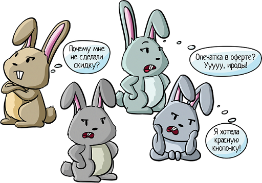
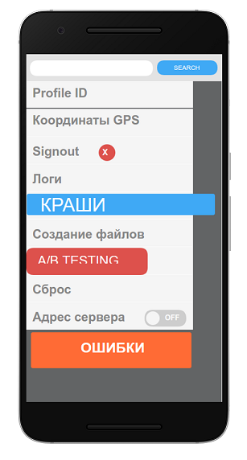
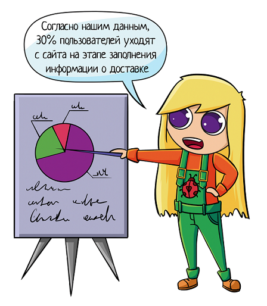
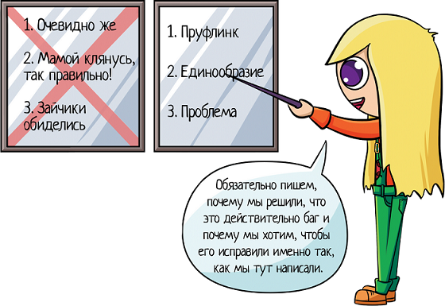

Паттерны и антипаттерны обоснования задач

## Содержание

  

*   [1\. Антипаттерны: плохое обоснование](https://habr.com/post/434522/#anti_patterns)  
    *   [1.1. Очевидно же](https://habr.com/post/434522/#obvious)
    *   [1.2. Мамой клянусь!](https://habr.com/post/434522/#mama)
    *   [1.3. Зайчики обиделись](https://habr.com/post/434522/#rabbits)
*   [2\. Хорошие паттерны обоснования](https://habr.com/post/434522/#good_patterns)  
    *   [2.1. Пруфлинк](https://habr.com/post/434522/#pruf_link)  
        *   [Ссылка на требования](https://habr.com/post/434522/#link_doc)
        *   [Сами требования](https://habr.com/post/434522/#doc)
        *   [Ссылка в интернет](https://habr.com/post/434522/#link_internet)
        *   [Письмо заказчика](https://habr.com/post/434522/#letter)
        *   [ROI](https://habr.com/post/434522/#roi)
        *   [Статистика](https://habr.com/post/434522/#statistics)
    *   [2.2. Единообразие](https://habr.com/post/434522/#uniformity)
    *   [2.3. Проблема, или #жизньболь](https://habr.com/post/434522/#problem)
*   [3\. Когда обоснование не нужно](https://habr.com/post/434522/#not_need_pruf)
*   [4\. Итоги](https://habr.com/post/434522/#itogo)

Когда вы заводите задачу, ее нужно обосновать. Вы должны убедить разработчика, что:

*   это действительно баг;
*   его необходимо исправить;
*   его нужно исправить именно так, как мы сказали.

А то иногда читаешь баги (особенно баги новичков) и задаешься вопросом:

— Почему это баг??

Например, там написано: «Загружаем отчет, получаем 57,6. А должно быть — 57.9».

Если записать обоснование, это решит проблемы:

*   Коллеги отвлекают с вопросами «А почему это баг?», вырывая из контекста.
*   Спустя месяц ты сам забыл, а, собственно, почему это был баг…

_**См также:**  
[Зачем нужно обоснование в баге](https://okiseleva.blogspot.com/2018/11/blog-post_28.html) — более подробно о том, зачем вообще обоснование._

Через меня прошли сотни начинающих тестировщиков (студентов). Вот как раз на их задачах я и начала задаваться вопросом «А почему это баг?»… Спрашиваешь ребят, а в ответ получаешь «Да это же очевидно!». Ну как-то не очень =))

Через кучу задач и вопросов «А почему?» стали вырисовываться паттерны ответов. Я выделила хорошие и плохие паттерны. О них и хочу рассказать.

Эта статья для:

*   **начинающих тестировщиков** — узнайте, как грамотно объяснять свою точку зрения;
*   **тест-менеджеров** — чтобы дать ссылку своим падаванам и потом ссылаться на антипаттерны без дополнительных объяснений.

## 1\. Антипаттерны: плохое обоснование

  
  

### 1.1. Очевидно же

Почему вообще тестировщики не пишут обоснование в баге? Да потому что им кажется это очевидным. И они проецируют свои мысли на всех. Мне очевидно = всем очевидно, зачем что-то писать?

Но на самом деле это не так, потому что каждый человек находится в каком-то своем контексте. И то, что очевидно вам, совсем не факт, что очевидно кому-то другому.

Давайте разберемся на простых примерах. Прочитайте слово, которое я напишу ниже — о чем вы подумали, когда его читали? Какие ассоциации пришли на ум?

> **ЗАМОК**
> 
> Дверной замок или огромная каменная крепость?
> 
> **БРАК**
> 
> Свадьба или сломанный айфон?  
> ...

Да, это омонимы. Но они очень четко показывают проблему «это же очевидно». Вам очевидно, что замок — это замОк, а мне — что зАмок.

И если вы вы пишете в баге:

> **Результат**  
> 57,6
> 
> **Ожидаемый результат**  
> Очевидно же, что там должно быть 57.9

То это вообще не отвечает на мой вопрос «ПОЧЕМУ?» Что значит «очевидно»? Объясните мне, пожалуйста. Мне-то неочевидно, иначе бы я не переспрашивала. А вот автору очевидно и он думает, что всем тоже.

Если говорить про опыт начинающих, то лучше всех сформулировал эту мысль один из моих студентов:

> «Я не понимал, зачем вообще обосновывать баги, пока не почитал баги других студентов»

Можно очень долго рассказывать, что «очевидно» для всех разное и я не в вашем контексте, и много чего еще… Но автор задачи будет считать, что к нему просто придираются, это у остальных непонятно, а у него все хорошо!

И только читая чужие баги, начинаешь задумываться «Хммм, а почему он думает так? Я вот подумал иначе». Тогда-то и приходит понимание, что твое «очевидно» очевидно не всем.

> Однажды я зашла в баг-трекер и увидела такой баг от студента: «Мы вводим имя Шарипат, оно определяется как мужское. А должно — как женское!». Почему должно как женское? Я смотрю на это имя — ну Шарипат и Шарипат, выглядит как мужское. Я спрашиваю:
> 
> — Почему ты так решил? Почему женское?  
> — Да потому, что у меня жену так зовут!
> 
> И вот это уже как минимум объясняет мне, почему он завел задачу. Когда мы тестируем приложения, мы сначала пробуем простые данные, знакомые нам вещи. Мы пробуем свое имя, имя жены, брата, сестры…
> 
> Он попробовал ввести имя жены и обнаружил баг. И если бы он хотя бы так и написал в ожидаемом результате: «Пол женский, это женское имя — у меня жену так зовут», то у меня как минимум отпал бы вопрос «Почему ты вообще завел эту задачу?».
> 
> Конечно, такого обоснования недостаточно. Погуглите «необычные имена», у нас ведь не запрещено хоть Тумбочкой сына назвать, но стоит ли считать это слово корректным мужским именем?
> 
> Так что тут надо погуглить, какие вообще бывают имена, локализовать проблему — проблема с русскими именами? Казахскими? Украинскими? А должна ли система уметь их обрабатывать? И так далее. Может, вообще не баг…  
> И все же «у меня так зовут жену» хотя бы позволяет автору ввести нас в свой контекст и поясняет, почему он вообще решил завести задачу.

И помните — очевидность может быть продиктована контекстом. Вы сейчас внимательно изучали большой модуль системы, знаете все досконально. Поэтому вам совершенно очевидно, что «эта фишка должна работать ВОТ ТАК». Но если к задаче вернуться через месяц-другой, вы уже будете работать над другим модулем, и вспомнить, почему именно так, будет уже сложнее.

> Даже самый тупой карандаш острее самой острой памяти интернет

Когда вы заводите баг, и ожидаемый результат кажется вам очевидным, остановитесь и задумайтесь: «Почему я так считаю?». И запишите ответ на этот вопрос.  

### 1.2. Мамой клянусь!

Когда студент понимает, что вообще ничего не писать, «потому что это очевидно», не проканает, он переходит на следующую стадию гнева, отрицания, и обоснования багов, которая называется «Мамой клянусь!» Это когда мы просто говорим, что так правильно, не объясняя, почему.

То есть обоснование выглядит примерно так:

> **Результат**  
> 57,6
> 
> **Ожидаемый результат**  
> 57.9, потому что так правильно

Но такое обоснование снова не отвечает на мой вопрос «Но почему?». Почему ты решил, что так правильно? Я все еще не ванга и не телепат, и я не знаю, почему ты считаешь это правильным.

По сути это мало чем отличается от ситуации «вообще ничего не написал, потому что это очевидно». Поэтому я и называю это второй стадией — именно по такому сценарию обычно и развиваются события, сначала «очевидно», потом «да так точно правильно». Посмотрим на примере из жизни студентов:

> **Пётр и индусы**
> 
> Наша система умеет склонять имена по падежам. Студент проверяет имя Пётр. Знаете, как оно склоняется? В именительном падеже оно пишется через букву Ё, а во всех остальных — через Е. «Пётр, но Петру».
> 
> И вот я захожу в баг-трекер и читаю такой баг: «Пётр склоняется по падежам через букву ё, а должно через е».
> 
> Я спрашиваю:
> 
> — А почему ты так считаешь?  
> — Ну очевидно же, что через Е надо (первая стадия)  
> — Почему ты считаешь, что это очевидно?  
> — Но это же по правилам русского языка так!  
> — По каким правилам?  
> — Ну что, я вам должен бегать и гуглить правила русского языка? (вторая стадия — так правильно, верьте мне)  
> — ДА! Да, именно это ты и должен делать. Потому что это будет уже обоснованием бага. Потому что, возможно, твой разработчик индус, и ты тоже индус. И вы не знаете правил русского языка! Так дай на них ссылку, и все вопросы сразу отпадут.
> 
> 

Конечно, тут не надо доходить до крайностей и давать ссылки на словари, когда вы ставите баг на опечатку или пропущенную запятую. И все же «Пётр» — нетривиальный пример, это ведь исключение из правил. Всегда работает так, а для Петра иначе.

Поэтому тут ссылка будет нелишней. Особенно если разработчик спросил «А разве так правильно?». Можно обвинить его в глупости и неграмотности и испортить отношения. А можно дать ссылку, мягко подтвердив свою точку зрения.

Но ок, возьмем другой пример, не про правила русского языка, которые «так очевидны».

> **Емейл.рф**
> 
> Эту задачу очень любят заводить мои студенты (почти каждый поток ее оформляют):
> 
> — Я пытаюсь зарегистрироваться с емейлом.рф и не могу. Это баг!  
> — Почему?  
> — Как это почему? Мы живем в России, такие емейлы есть у всех!
> 
> Я рассказывала этот кейс на конференции DUMP, и у меня был полный зал слушателей. Я попросила поднять руки тех, у кого есть такой емейл. Из 200 человек руки подняли три человека.
> 
> То, что мы живем в России, вообще не говорит о том, что у всех есть такие емейлы. Ну да, ну да… А еще ручные медведи и матрешки…
> 
> Причинно-следственной связи здесь нет, просто сложно отказаться от своей идеи. Ведь вот же, я баг нашел! Как это может оказаться не багом?? Такой классный же. Россия же, очевидно же! Нет, не очевидно? Ну все равно Россия, НАВЕРНЯКА таких много.

Такое обоснование больше похоже на «Мне лень пойти погуглить, поискать факты. Верьте на слово». Когда у нас нету фактов и доказательств, есть стремление завуалировать свое обоснование и написать «Наверное, возможно, наверняка...».

Но это СТОП-слова! Если у вас возникает желание их написать — значит, у вас нет реальных фактов. Значит, вы просто додумываете. А почему нужно делать задачу, основанную на фантазии тестировщика? Докажите свою теорию!

А если фактов нет? Тогда задачу даже заводить не стоит. Да, сложно отказываться от «своего, родного» бага. Но это тоже надо уметь.

> **Емейл.рф — факты**
> 
> Какие тут могли бы быть факты?
> 
> Во-первых, мы можем делать наш сайт для каких-то гос заказчиков, которых обязуют регистрироваться именно в домене.рф. Корпоративный стандарт, у них нет выхода.
> 
> Или у нас действительно есть много таких заказчиков, это показывает статистика. Например, в логах много ошибок «попытка зарегаться через такой домен». И возможно, тогда стоит сделать эту фичу. Чтобы не потерять потенциальных клиентов.
> 
> На основании таких фактов РМ (Project Manager) принимает решение, будем делать задачу или нет. И если будем, то когда. А может сказать «ну есть ошибки, и ладно, их меньше 1% общих регистраций, не будем делать»

Вместо абстрактного «да такие люди точно есть!» приводите ФАКТЫ.

А при постановке задачи используйте принцип 5 почему. Записывая ожидаемый результат, спросите себя «А почему я именно это ожидаю?». Первый ответ будет «Это же очевидно», но снова задайтесь вопросом «А почему?». И если заметите, что никаких данных нет, просто вам так кажется — поищите факты или обсудите ситуацию с коллегами.  

### 1.3. Зайчики обиделись

Если фактов нет, а от бага отказываться не хочется, студенты переходят к следующей стадии гнева, отрицания и обоснования багов… Давление на эмоции:

> Я пытаюсь зарегистрироваться с именем Ктулху, а система не дает. Должна давать, а иначе… Я обиделся и ушел, а ВЫ! Потеряли клиента!
> 
> И обязательно все такие же как я, так что вы растеряли ВСЕХ клиентов, а они еще и в суд подали за оскорбление и все деньги отняли!
> 
> И прочие кары...

Конечно, когда лично мне что-то не нравится, то очень злит игнорирование моей проблемы. Что значит «Нормальные люди не регистрируются с таким именем?» Я что, ненормальная?! Как хочу, так и называюсь, как вы можете мне что-то запрещать?!

А дальше включается проекция — если мне это не нравится, то и другим пользователям не понравится! Если не всем, то как минимум многим. Поэтому это точно баг и надо исправить. Ну или хотя бы зачесть в рамках обучения, если речь о студентах.

Однако обиженный пользователь — самое плохое обоснование, которое только может быть. Потому что им можно обосновать любую чепуху:

*   На главной нету котика? Ну все! Я обиделся и УШЕЛ! А ВЫ! Потеряли клиента!!
*   Я зарегался и мне не заплатили за это денег?? Я обиделся и ушел… А ВЫ! Ну вы поняли!

Все что угодно может произойти и обидеть меня. Кнопочка зеленая, а я хотела красную, система не предложила мне пиццу в подарок… Я, как пользователь, могу обидеться на все, что угодно. Но кого это волнует? Всем все равно не угодишь, обиды неизбежны. А уж вестись на угрозы вообще последнее дело.

> Все началось с одного из студентов, который как раз и сказал эту сокровенную фразу:  
> — Ах вы не хотите делать регистрацию через домен рф? А я как пользователь попробовал зарегистрироваться, увидел эту вопиющую ситуацию, и УШЕЛ! А ВЫ! Потеряли клиента!
> 
> Тогда то моя знакомая и сказала, что такие речи очень похожи на «Зайчики обиделись». Не знаю, откуда она взяла эту аналогию, но всем понравилось.
> 
> Студент осознал, что погорячился. Пошел искать обоснование без эмоций. А у нас появилось название антипаттерна.

Запомните одно простое правило — **эмоций в баге быть не должно!**

Эмоции — явление проходящее. Это сейчас вы полыхаете праведным гневом и хотите выразить его в ехидных комментариях типа «только идиот мог так написать код». Но вспомните любую ситуацию, когда рядом с вами капризнячал ребенок, устраивая маме истерику из-за некупленной игрушки или мороженки. Вам как стороннему наблюдателю приятно следить за этой сценкой? А ведь ваша истерика в баг-трекере выглядит точно так же!

Поэтому, если уж очень хочется — выскажите все устно. Обсудите с разработчиком задачу в курилке, яро отстаивая свою позицию. Но как только дошли до компьютера — эмоции убираем, пишем лишь факты. Без «если да кабы» и без «а ВЫ! Потеряли клиента!»

Помните, что к задачам возвращаются и спустя год-два-три. И тогда уже даже вы будете брезгливо смотреть на свою же истерику. Прошлых эмоций ведь больше нет, вот это и выглядит смешно. Так что эмоции максимум устно — в курилке! А в баге как-нибудь без них.

И в обосновании не пишем про мега-обиженных зайчиков. Иногда такое отстаивание задачи доходит до смешного:

> Студент нашел опечатку в оферте пользователя. Поставил баг с критикал-приоритетом. На просьбу пояснить приоритет очень возмутился:
> 
> — Система меня обманула, я не могу ей доверять!!!
> 
> Наверное, переживал, что вопрос выльется в «это и не баг вовсе», вот и стал отстаивать свой баг. Но никто ж не против, что это баг. Но почему критикал то? Кто вообще оферту читает?
> 
> — Я читаю! Поэтому я вижу, что система плохая, если уж там опечатка, то что она может? И как ей верить то теперь?!
> 
> Но «я читаю» ≠ «все читают». И потом сам студент признал, что не читает внимательно КАЖДОЕ лицензионного соглашение, которое нам подсовывается при установке программ. Так и с офертой та же история. Пока все хорошо, ее не читают. Если что-то не нравится, уже обращаются к правилам.
> 
> Однако «система меня обманула и я не могу ей теперь верить» из-за одной опечатки на десятой странице текста, который мало кто читает… Ну… Не пишите такое в баге, не смешите своего РМ.

Итак, эмоции из бага убираем. А что мы можем там оставить? Конечно же, факты!

Вместо того, чтобы писать на эмоциях «зайчики точно обидятся, уйдут, а вы растеряете клиентов»:

— соберите статистику;  
— оцените трудозатраты;  
— посчитайте ROI;  
— опросите пользователей;  
— сравните продукт с конкурентами;

И вместо белки-истерички станете крутым тестировщиком, который заводит продуманные баги!  

## 2\. Хорошие паттерны обоснования

Как обосновывать баги правильно? Что такого надо написать в ожидаемом результате, чтобы ваш баг исправили так, как вы написали? И не переспрашивали по 10 раз «а почему именно так правильно»?

Выше обсудили три антипаттерна, давайте обсудим и три хороших паттерна обоснования багов.  

### 2.1. Пруфлинк

Это может быть:

*   Ссылка на требования
*   Сами требования (ворд файл, презенташка...)
*   Ссылка в интернет
*   Подсчитанный ROI
*   Письмо заказчика
*   Статистика

  
**Ссылка на требования**

Самый простой баг — когда есть ТЗ и система работает не так, как там описано.

Так и пишем в ожидаемом результате: «57,9, потому что так в ТЗ». Хм, хм… Погодите-ка. Это звучит как «мамой клянусь»…

Да, в такой формулировке так и звучит. Поэтому подтвердите свои слова ссылкой. Иначе разработчик читает баг, и ему надо:

*   осознать, про какое ТЗ идет речь;
*   найти само ТЗ;
*   найти конкретное место, о котором речь;
*   вчитаться…

Не проще ли оставить только последний пункт? Ведь разработчик может работать на 10 разных проектах, документация которых разнесена в 10 разных мест. У него поиск ТЗ займет минут 5-10, а для вас добавить ссылку — дело секунды. Вы ведь сейчас тестируете по ТЗ, значит, оно открыто и находится перед глазами. Скопировали ссылку и вставили!

Уважайте время коллег, и они будут вам благодарны.  
  
**Сами требования**

Если требования хранятся НЕ в конфлюенсе или другой облачной системе, а в обычном ворде, прикладывайте тот документ, по которому вы тестируете.

Вполне возможно, что вы тестируете устаревшие требования. И если вы приложите прям ворд-файл, по которому проверяете, его может увидеть аналитик и сказать «Ой, погоди, мы уже 10 раз все поменяли, забыл выложить. На, держи!»

Если вы этого не сделаете, то потратите три часа на разборки с разработчиком, который скажет «а у меня по другому!». Вы будете бегать, смотреть его требования, потом ваши, потом искать аналитика, чтобы уточнить кто прав…

А так вы сразу вложили требования, разработчик посмотрел сказал «что-то какая-то фигня», перенаправил аналитику. Аналитик их писал, и он, открыв ваш ворд, сразу поймет, устарел он или нет. Вот и экономия времени!  
  
**Ссылка в интернет**

Как мы помним, требования бывают далеко не всегда. И вместо них может быть… Ссылка в интернет! Да, почему бы и нет?

Если вспомним про наш пример «Пётр, Петру», то, даже если у нас в системе есть требования, вряд ли там написано «Система работает по правилам русского языка» и перечислены все правила русского языка. Конечно, так никто не пишет. И все равно получается, если хотите сослаться на правила русского языка, вам придется пойти их и погуглить.

Или если взять пример с Шарипат. Опять таки, с чего вы взяли, что это нормальное женское имя? Идем гуглим всякие казахские и прочие имена, находим Шарипат, находим другие похожие имена и даем ссылочку на эту страничку.

И тут уже, даже если разработчик с вами не согласен, он может прийти и сказать — «Смотри, ты дал ссылку на сайт, да это же желтая пресса какая-то, там всегда пишут фигню». Но если вы не дали ссылку, разработчику придется самому гуглить, самому искать всякие сайты и только тогда он поймет, что, возможно, вы напали на какие-то ложные сведения. Сэкономьте ему время, дайте сразу ссылку в интернет.

Да, здесь нужно понимать, что не каждая ссылка полезна и оправдана, но она как минимум покажет, почему вы считаете, что это действительно баг. Это вам уже не «мамой клянусь», а с обоснованием!  
  
**Письмо заказчика**

Обоснованием может быть отсылка на письмо заказчика. У нас в джире есть даже отдельное поле, «Бизнес-обоснование», куда мы записываем, какой заказчик просил эту фичу. И тогда, когда мы читаем наш баг, то мы сразу же видим:

— Ага, бизнес-обоснование пустое. Это значит, что мы сами нашли эту проблему и считаем, что ее нужно поправить.

Либо:

— Ага, вот такой то заказчик на проблему жаловался 1 августа 2015 года

И если нам надо уточнить у этого Заказчика, что именно его не устраивает, то мы легко можем найти это письмо, ведь у нас есть вся информация (кто, когда, как называется письмо). Зная эту инфу, я пойду и найду письмо за 5 сек в своем аутлуке. Если этой инфы нет, то мне придется пойти в аутлук и искать среди 10 разных папочек — какой заказчик это просил и в каком письме?

К тому же, если мы видим, что эту фичу просили несколько разных заказчиков, то у нее сразу повышается приоритет. Так как мы понимаем:

— Ага, вот заказчик 1 жаловался тогда-то, через пару недель / месяцев жаловался заказчик другой. Хмммм, но ведь наверняка есть куча других заказчиков, которые тоже страдают, но молчат. Плачут, колются, но продолжают жрать кактус. Ведь не все будут писать нам и сообщать о проблеме…

Так что чем больше жалоб, тем выше приоритет. Так как мы понимаем, что это реальный пользователь пожаловался, у них действительно есть такие проблемы. И даже если мы вернемся к багу спустя полгода или год, благодаря вложенному письму или хотя бы ссылке на него всегда можно будет поднять историю задачи.  
  
**ROI**

Мы можем попробовать подсчитать ROI — коэффициент окупаемости. Действительно ли нам нужно сделать эту фичу или исправить этот баг? Принесет ли это должный эффект?

Одно дело — внести мелкую правку на полчаса разработки, которая поможет сотням пользователей. Совершенно другое — из-за истерики одного пользователя две недели переделывать работу системы, которая всех остальных устраивает.

Если мы подсчитали ROI и видим, что овчинка стоит выделки — вкладываем расчеты в задачу. Но иногда после подсчетов выясняется, что делать задачу не нужно. И это — нормально! Значит, мы сэкономили время команды на обсуждение ненужной фичи.

Именно для этого мы и продумываем обоснование — потому что иногда кажется «Ах, какой баг, какой баг!», а потом начинаешь думать над обоснованием… И понимаешь, что фигня это, а не баг, даже заводить не стоит…

> Например, мы приходим на работу с мобильным приложением, а там есть дебаг-панель для тестировщиков, которая выглядит примерно так:
> 
> 
> 
> Воу-воу! Тут синенькое, там красненькое, текст не виден полностью, шрифты идут вразброс… Явный баг! Как это до меня не заметили? Срочно оформляю, нужен рефакторинг!
> 
> Как обосновать? «Да вы что, если если пользователь ТАКОЕ увидит, то он сразу обидится и уйдет.» Стоп. Включаем мозг. Это дебаг-панель. Она для тестировщиков и разработчиков, помощник в тестировании\[2\]. Пользователь ее НИКОГДА не увидит. А если увидит, то ВОТ ЭТО уже будет баг, причем критичный!
> 
> А наведение красоты… Да кому она нужна, красота эта? Новый функционал туда добавляется срочно и быстро. Тестировщик приходит, жалуется на проблему, разработчик на коленке пишет код. Работает? Не трогай!
> 
> Ничего не случится с чувством прекрасного у тестировщика, пусть в других местах такие баги ищет. Потому что на рефакторинг этой панели может уйти неделя разработки. А это очень дорого. И ради чего? Ради красоты? Да ну ее нафиг, лучше сделать функционал, за который клиент заплатит.
> 
> Так что подсчитали трудозатраты и поняли — нам и так хорошо живется, ничего менять не стоит!

  
**Статистика**

Соберите статистику и вложите в задачу:

— количество ошибок в логах;  
— количество жалоб в техподдержку;  
— количество кликов на кнопку;  
— количество пользователей, которые ушли на этапе оформления заказа (закрыли вкладку);  
— …

То есть если вы считаете, что типовая форма оформления заказа в интернет-магазине «плохая» и ее надо улучшить — обоснуйте. Чем именно она плоха? Тем, что для ввода адреса надо знать свой индекс и заполнять 10 обязательных полей? А правда ли это плохо или раздражает только вас?

Учтите, что разработчики могут не видеть «очевидного» в своем ПО. Они ведь его разрабатывали, тестировали… Видят постоянно по 100 раз в день, уже привыкли к интерфейсу. Так что даже если он и правда устарел, нужны факты.

А собираются факты легко — просим сделать статистику, чтобы посмотреть, когда пользователь уходит со страницы. И если он добавил пиццу в корзину, а потом начал заполнять поля и после 5-7 плюнул и ушел, это не очень круто. А если так каждый третий поступает — точно стоит что-то улучшать!

> Если вспомнить про емейл.рф, то можно посмотреть по логам — а есть ли вообще ошибки вида «Попытка зарегистрироваться на такой емейл отклонена»? Может, их вовсе нету, а мы тут уже кучу обиженных пользователей придумали, из-за которых сайт буквально миллионы потерял.

Почему статистика лучше эмоций? Да потому что мы, ИТ-специалисты, и простые пользователи — два разных мира. То, что удобно нам, неудобно им. И наоборот.

Допустим, делаем мы бухгалтерское ПО. Нам кажется: «фу, мышкой никто не работает, надо сделать так, чтобы все работало из командной строки, чтобы мышку вообще не надо было трогать!». Мы тратим на этот функционал кучу времени, а реальные пользователи его вообще не используют. Потому что им нужна мышка, чтобы взять, тыкнуть на большую кнопку… А то что удобно программистам, им вообще до лампочки, так как им удобно совершенно другое.

И если вы хотите рассказывать всем, что нужно пользователям, сначала изучите юзабилити тестирование, а потом говорите, обидятся зайчики, или нет.

> В своей системе мы собираем анонимную статистику, какой функционал используется, а какой нет. На веб-форме есть очень много фильтров, которые тяжело поддерживать. А нужны ли они? Нельзя просто взять и убрать, стоит проверить.
> 
> Так вот статистика обычно очень удивляет. Мы думали, этот фильтр не используют вовсе, а на самом деле каждый час отрабатывает. А на другой возлагали большие надежды, а он никому и не нужен...

Только статистика честно расскажет о существовании проблемы. Если статистики нет, это будет всего лишь вкусовщина. А вкусы у всех разные. Тестировщику хочется кнопку красную, разработчику — зеленую, а дизайнеру — синюю. Так что ищите факты и давайте на них пруфлинк!

### 2.2. Единообразие

Если пруфлинка нет, мы можем сослаться на единообразие в работе системы. Потому что если система всегда работает так, и тут вдруг она заработала иначе — это вполне может быть обоснованием бага.

Например, если наша система работает как пунтосвитчер (это когда я печатаю на русском, забыв переключить раскладку, а система переключает ее сама). Я могу набрать «Ольга», а могу «Jkmuf», система второй вариант сама превратит в первый.

Такое бывает на всяких гос приложениях. Они иногда сами работают по такому же принципу. Ты должен регистрироваться четко как у тебя в паспорте. Так как мы живем в России — регистрация именно на русском, так что английские буковки будем исправлять. Ты же явно забыл поменять раскладку, парень!

> Jkmuf → Ольга

Окей, но что, если я пытаюсь напечатать имя «Юля»? Оно начинается на букву Ю, а этой букве соответствует не буква русского алфавита, а спецсимвол:

> \> → Ю

И это совершенно другой класс эквивалентности!

То есть, если мы понимаем, что система работает как пунтосвитчер, у нас есть как минимум 2 класса эквивалентности: есть русские буквы, которым соответствуют латинские буквы, а есть такие, которым соответствует спецсимвол.

Это совершенно разные классы, их надо проверить! И возможно, когда мы печатаем спецсимвол, то система его не распознает. И тогда мы заводим баг — я набираю символ >, я ожидаю, что система его переведет в букву Ю, но ничего не происходит. Почему я это ожидаю? Потому что система УЖЕ так работает, потому что если я введу Jkmuf, система поймет, что это Ольга.

Мы показываем, что система уже так работает, и это уже хорошее обоснование. Мы не говорим «мамой клянусь, она так работает», мы доказываем это на Ольге.

### 2.3. Проблема, или #жизньболь

Расскажите о какой-то реальной проблеме пользователя.

Потому что мы с вами – тестировщики. Наша задача — крушить и ломать, вводить «Войну и мир» в короткое поле, редактировать одну запись в двух вкладках браузера и прочая, прочая. И даже если у нас что-то не работает, это не значит, что пользователь тоже будет так поступать.

И иногда баги не исправляют просто потому, что «да никто так не делает!». И это нормально. Зачем тратить силы и ресурсы на проблему, которая никогда не возникнет?

Особенно это касается проблем с usability. Как мы помним, то, что удобно айтишнику, неудобно простому пользователю. И наоборот! И получается, что если мы просто пишем «Ну это неудобно...» — это плохое обоснование, мало ли что неудобно тебе, остальных все устраивает. А вот если мы собираем фидбек от пользователей, аттачим их письма, в которых они нам жалуются, то это сразу говорит о том, что такая проблема действительно существует. И это уже повышает ее приоритет.

Проблема реального заказчика всегда лучше, чем просто какой-то негативный тест от тестировщика.

Это не значит, что на проблемы тестировщиков никогда не исправляют. Если проблема есть у вас, тоже жалуйтесь! Может, разработчик может вам помочь буквально за 5 минут, просто он не в курсе ситуации.

> Тестируя новую фичу, я покрываю ее автотестами. Фреймворк для тестов уже давно есть, мы к нему привыкли. Тесты похожи друг на друга, поэтому копипастятся — ведь обычно мы меняем один какой-то параметр, оставляя остальное неизменным. Это принцип «1 тест = 1 проверка», чтобы падение теста сразу указывало на причину.
> 
> И вот мне надо из автотеста в автотест копипастить параметры. И я должна их раскопипастить из первого теста во второй, в третий, в четвертый, в пятый, в десятый… И в этой копипасте мне надо поменять лишь 1 значение в одной строчке, и если я это не сделаю, у меня все развалится со страшной ошибкой.
> 
> Разумеется, когда я копипастой занимаюсь, то хоть где-то да ошибусь… В итоге я написала 30 тестов, запустила их одним разом, и у меня все свалилось с NPE. Я сижу, чешу голову и думаю «блин, где же я ошиблась».
> 
> Я весь день разбираюсь, ищу ошибку, запускаю автотесты… Пытаюсь найти баг или место, где я облажалась. В итоге нахожу и потом на следующем митинге жалуюсь:
> 
> — Я вчера весь день писала эти автотесты, потому что ошиблась в пятом тесте и потом долго пыталась понять, в чем причина падения. Ох уж эта копипаста!
> 
> И тут разработчик говорит:  
> — Да подошла бы ко мне, я бы тебе за полчаса все зарефакторил и починил эту проблему.
> 
> А что, так можно было?!!!  
> 

Пожалуйтесь, не бойтесь! Может, вы страдаете, а разработчик даже не догадывается об этом. И может быть, он сможет быстро исправить вашу проблему, здесь и сейчас. А может и не исправить, но подсказать путь обхода.

Конечно, если проблема разовая, или сейчас исправлять ее слишком долго, то задача оптимизации уедет в следующий релиз или дальше. Но стоит хотя бы обсудить «как это можно улучшить» и поставить задачу. Ведь если задачи нет — никто ничего не сделает.

Есть разные случаи проблем:

— проблема заказчика;  
— проблема реального пользователя;  
— проблема тестировщика;  
— проблема внутри команды;

Одни более приоритетны, другие менее. И все же, если мы описываем реальный кейс и реальную проблему, то у такой задачи больше шансов на исправление, чем у «очевидно же, так всем будет лучше».

Да, нужно понимать, что, даже если мы опишем, как реальным пользователям плохо, это все равно не гарантирует того, что мы исправим баг, но такова жизнь. В любом случае, если мы хотя бы описали проблему, то будет как минимум понятно, почему мы вообще поставили эту задачу. Даже если мы вернемся к нему через месяц, два или три. Мы всегда увидим, почему мы считали, что пользователям плохо и неудобно с этим работать.  

## 3\. Когда обоснование не нужно

Внезапно, не правда ли? =)

Тем не менее у антипаттерна «очевидно же» есть исключения. Нам и правда НЕ нужно писать обоснование, если система:

*   зависла;
*   упала с необработанной ошибкой;

Особенно если это произошло на production. Если у нас сайт лежит, тут не до обоснований, надо бить в гонг и бежать к разработчику «срочно чини!». Можно вообще без бага. А можно с кратеньким «Ошибка 500 на главной», этого хватит.

Не надо высасывать обоснование из пальца, потому что «оно нужно всегда». Писать «система не должна падать» — текст ради текста.

Но! Вам обязательно надо написать ожидаемый результат. Даже если он кажется вам очевидным, запишите его, от вас не убудет.

> **Шаги**  
> Открыть сайт [example.com](http://example.com/)
> 
> **Результат**  
> Ошибка 500
> 
> **Ожидаемый результат**  
> Открылась главная страница

Тут вроде бы все просто — главная не открывается, а должна. Но есть примеры сложнее.

Например, разработчик сделал формулу из ТЗ и где-то происходит деление на ноль. Если вы просто напишите «Ошибки быть не должно, отчет загружен», то разработчик все равно придет к вам с вопросом «Как он должен открыться то? Там же деление на ноль!».

Вам надо это продумать и написать «Я ожидаю, что откроется отчет с такими-то значениями согласно формуле ХХХ» — пока будете думать, что там должно быть, можете сами обнаружить косяк в ТЗ. А дальше уже уточните у аналитика, как правильно.

Так что даже если обоснования нет — есть хотя бы ожидаемый результат. И помните, что это исключение из правил. Система не должна падать и зависать. Однако такие баги встречаются редко, а в остальных случаях обоснование должно быть.  

## 4\. Итоги

Мы обсудили 3 антипаттерна. Три ступени гнева, отрицания и обоснования багов:

1.  **Очевидно же** — Нам очевидно, вот и не обосновываем. А потом получаем «ой, я забыл, почему так хотел»… Это очевидно только вам, только здесь и только сейчас. Через полгода сами забудете, почему именно так. Объясните как для тупых, что там за очевидность такая.
2.  **Мамой клянусь, так правильно!** — Зачем клясться? Почему-то же вы считаете, что так правильно, вот и расскажите, почему. Дайте ссылку на требования, например.
3.  **Зайчики обиделись** — «Ах ты не добавил котика на главную? Ну все! Я обиделся… И УШЕЛ! А вы! Потеряли клиента!!». Но то, что неудобно вам, может быть удобно другим. Так что уберите эмоции и приведите факты.

Вместо них стоит использовать правильное обоснование:

1.  **Пруфлинк** — ТЗ, интернет, письмо клиента, в котором он просил этот функционал...
2.  **Единообразие** — Если система всегда работает так, а в одном месте по-другому, стоит исправить!
3.  **Проблема** — опишите проблему, которая возникает у вас, или у пользователя (если вы общаетесь с клиентами). Реальная проблема всегда лучше, чем просто негативный тест.

Обязательно пишем, почему мы решили, что это действительно баг и почему мы хотим, чтобы его исправили именно так, как мы тут написали. Задаем себе вопросы из серии «5 почему»

— почему я считаю, что это очевидно?  
— почему я считаю, что так правильно?  
— почему я считаю, что пользователи расстроятся?

Даем ссылки на требования, в интернет, указываем на единообразие или рассказываем о реальной проблеме пользователя.

И когда будете спустя год перечитывать грамотно оформленные задачи, вы еще скажете мне «Спасибо!» ツ