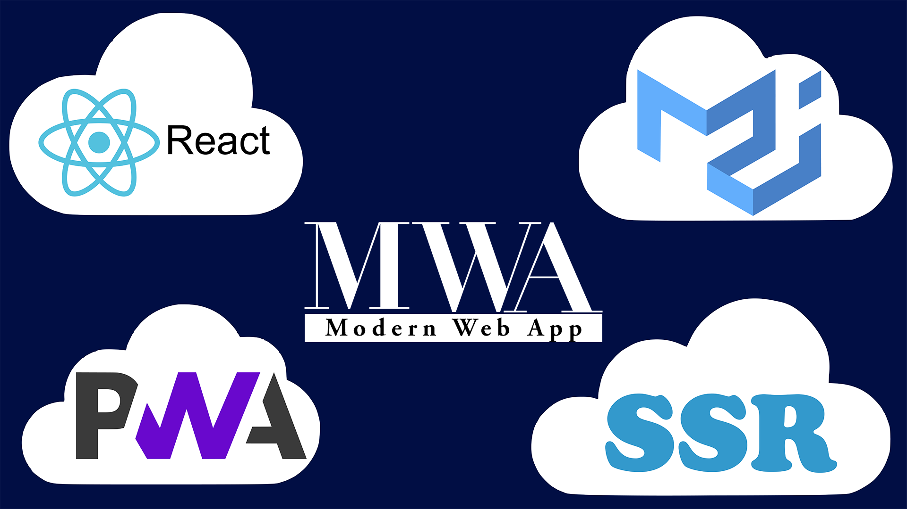
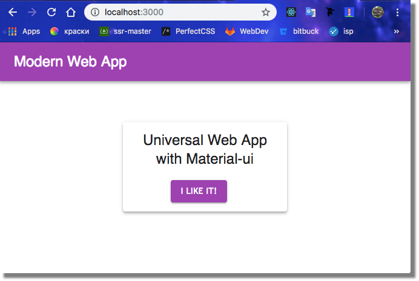
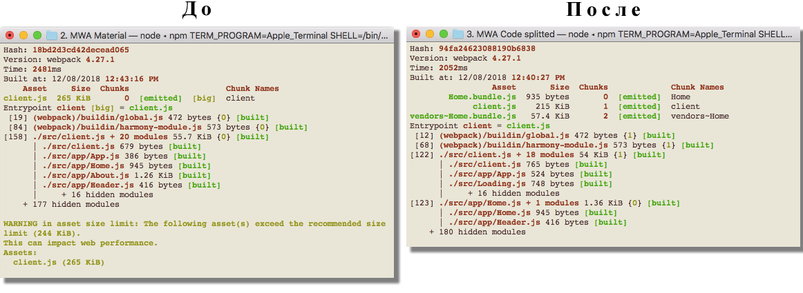
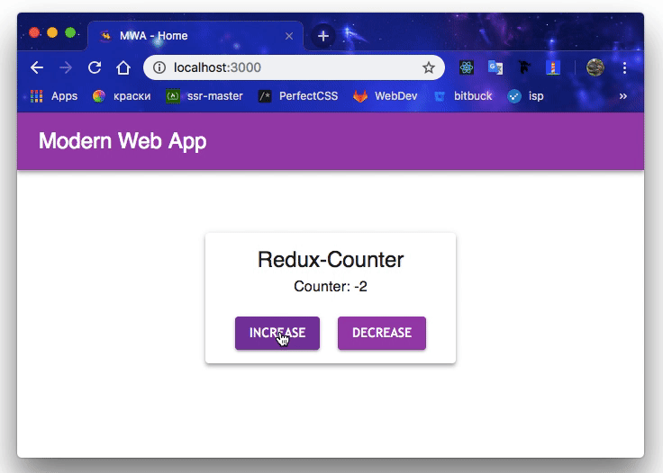
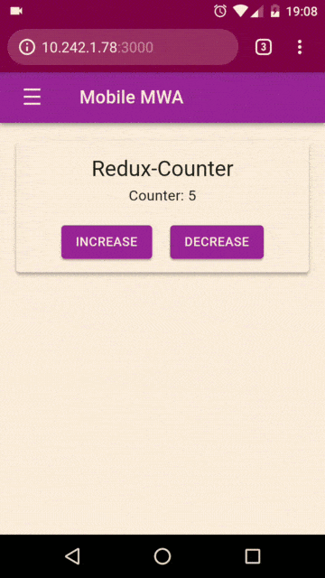
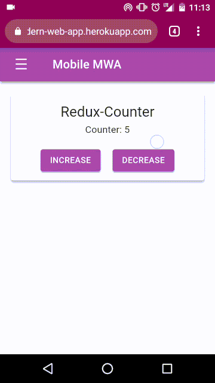
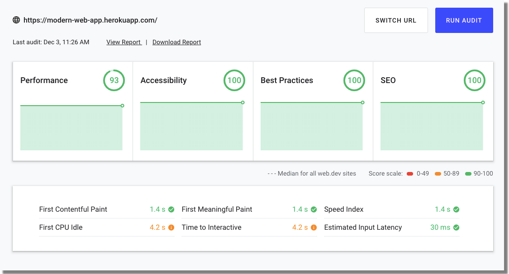

Перед вами — React Modern Web App

Перед тем как начать собирать с нуля **Modern Web App** нужно разобраться, что такое — Современное Веб-Приложение?

Modern Web App (MWA) — приложение, придерживающееся всех современных веб-стандартов. Среди них Progressive Web App — возможность скачивать мобильную браузерную версию на телефон и использовать как полноценное приложение. Так же это возможность листать сайт в оффлайне как с мобильного устройства, так и с компьютера; современный материальный дизайн; идеальная поисковая оптимизация; и естественно — высокая скорость загрузки.

Вот что будет в нашем MWA (советую использовать эту навигацию по статье):

  

*   [Universal Web App](https://habr.com/post/432368/#ssr)
*   [Material-ui](https://habr.com/post/432368/#material)
*   [Code Splitting](https://habr.com/post/432368/#splitting)
*   [Пример использования Redux](https://habr.com/post/432368/#redux)
*   [Мобильная версия](https://habr.com/post/432368/#mobile)
*   [Progressive Web App](https://habr.com/post/432368/#pwa)
*   Babel 7, Webpack и многое другое

Люди на Хабре деловые, поэтому сразу ловите ссылку на [GitHub репозиторий](https://github.com/VanishMax/Modern-Web-App), [архив](https://drive.google.com/open?id=1J-Ud7cS8E3pDNNjQfiVWrKP7MpcsZfXn) с каждой из стадий разработки и [демо](https://modern-web-app.herokuapp.com/). Статья рассчитана на разработчиков, знакомых с node.js и react. Вся необходимая теория представлена в необходимом объеме. Расширяйте кругозор, переходя по ссылкам.

Приступим!

### 1\. Universal

Стандартные действия: создаем рабочую директорию и выполняем `git init`. Открываем _package.json_ и добавляем пару строк:

  

    "dependencies": {
        "@babel/cli": "^7.1.5",
        "@babel/core": "^7.1.6",
        "@babel/preset-env": "^7.1.6",
        "@babel/preset-react": "^7.0.0",
        "@babel/register": "^7.0.0",
        "babel-loader": "^8.0.4",
        "babel-plugin-root-import": "^6.1.0",
        "express": "^4.16.4",
        "react": "^16.6.3",
        "react-dom": "^16.6.3",
        "react-helmet": "^5.2.0",
        "react-router": "^4.3.1",
        "react-router-dom": "^4.3.1",
        "webpack": "^4.26.1",
        "webpack-cli": "^3.1.2"
    }

Выполняем `npm install` и, пока устанавливается, разбираемся.

Поскольку мы находимся на рубеже 2018 и 2019 года, наше веб-приложение будет [универсальным (или изоморфным)](https://habr.com/company/oleg-bunin/blog/319038/), — как на бэке, так и на фронте будет [ECMAScript](https://tproger.ru/translations/wtf-is-ecmascript/) версии не ниже ES2017. Для этого _index.js_ (входной файл приложения) подключает babel/register, и весь ES код, идущий за ним, **babel** на лету превращает в JavaScript, понятный браузеру, с помощью babel/preset-env и babel/preset-react. Для удобства разработки я обычно использую плагин babel-plugin-root-import, с помощью которого все импорты из корневой директории будут выглядеть как '~/', а из src/ — '&/'. В качестве альтернативы вы можете прописывать длинные пути или использовать alias'ы из webpack'а.

_index.js_

  

    require("@babel/register")();
    require("./app");

_.babelrc_

  

    {
      "presets":
      [
        [
          "@babel/preset-env",
          {
            "targets":
            {
              "node": "current"
            }
          }
        ],
        "@babel/preset-react"
      ],
      "plugins": [
        ["babel-plugin-root-import", {
          "paths": [{
            "rootPathPrefix": "~",
            "rootPathSuffix": ""
          }, {
            "rootPathPrefix": "&",
            "rootPathSuffix": "src/"
          }]
        }]
      ]
    }

Время настраивать **Webpack**. Создаем _webpack.config.js_ и используем код (здесь и далее обращайте внимание на комментарии в коде).

  

    const path = require('path');
    
    module.exports = {
      
      entry: {
        client: './src/client.js'
      },
      
      output: {
        path: path.resolve(__dirname, 'public'),
        publicPath: '/'
      },
      module: {
      
      
        rules: [
          { test: /\.js$/, exclude: /node_modules/, loader: "babel-loader" }
        ]
      }
    }

С этого момента начинается самое интересное. Пора разработать серверную часть приложения. **Server-side Rendering** (SSR) — это технология, призванная в разы ускорить загрузку веб-приложения и решить [вечный спор](https://vc.ru/marketing/36449-poiskovaya-optimizaciya-saytov-ispolzuyushchih-spa-prilozheniya) насчет поисковой оптимизации в Single Page Application (SEO в SPA). Для этого мы берем HTML-шаблон, засовываем в него контент и отправляем пользователю. Сервер делает это очень быстро — страница отрисовывается за считанные миллисекунды. Однако на сервере нет возможности манипулировать DOM'ом, поэтому клиентская часть приложения обновляет страницу, и она наконец-то становится интерактивной. Понятно? Разрабатываем!

_app.js_

  

    import express from 'express'
    import path from 'path'
    import stateRoutes from './server/stateRoutes'
    
    
    const app = express()
    
    
    app.use(express.static('public'))
    app.use('/assets', express.static(path.resolve(__dirname, 'assets')))
    
    
    const PORT = process.env.PORT || 3000
    app.listen(PORT, '0.0.0.0', () => {
      console.log(`The app is running in PORT ${PORT}`)
    })
    
    
    
    stateRoutes(app)

_server/stateRoutes.js_

  

    import ssr from './server'
    
    export default function (app) {
      
      
      app.get('*', (req, res) => {
        const response = ssr(req.url)
        res.send(response)
      })
    }

Файл _server/server.js_ собирает контент, сгенерированный react, и передает его в HTML-шаблон — _/server/template.js_. Стоит уточнить, что на сервере используется именно статический роутер, потому что мы не хотим менять url страницы во время загрузки. А **react-helmet** — библиотека, сильно упрощающая работу с метаданными (да и в целом с тегом head).

_server/server.js_

  

    import React from 'react'
    import { renderToString } from 'react-dom/server'
    import { StaticRouter } from 'react-router-dom'
    import { Helmet } from 'react-helmet'
    
    import App from '&/app/App'
    import template from './template'
    
    export default function render(url) {
    
      
      const reactRouterContext = {}
    
      
      let content = renderToString(
        <StaticRouter location={url} context={reactRouterContext}>
          <App/>
        </StaticRouter>
      )
    
      
      const helmet = Helmet.renderStatic()
    
      
      return template(helmet, content)
    }

В _server/template.js_ в голове выводим данные из helmet, подключаем фавикон, стили из статической директории /assets. В теле — контент и webpack бандл _client.js_, находящийся в папке /public, но так как она статическая — обращаемся по адресу корневой директории — /client.js.

_server/template.js_

  

    
    export default function template(helmet, content = '') {
      const scripts = ``
    
      const page = `<!DOCTYPE html>
                  <html lang="en">
                  <head>
                    ${helmet.title.toString()}
                    ${helmet.meta.toString()}
                    ${helmet.link.toString()}
                    <meta charset="utf-8">
                    <meta name="viewport" content="width=device-width, initial-scale=1">
                    <meta name="theme-color" content="#810051">
                    <link rel="shortcut icon" href="/assets/logos/favicon.ico" type="image/x-icon">
                    <link rel="icon" href="/assets/logos/favicon.ico" type="image/x-icon">
                    <link rel="stylesheet" href="/assets/global.css">
                  </head>
                  <body>
                    

                       

                          <!--- magic happens here -->  ${content}
                       

                    

                    ${scripts}
                  </body>
                  `
      return page
    }

Переходим к простому — клиентская часть. Файл _src/client.js_ восстанавливает сгенерированный сервером HTML, не обновляя DOM, и делает его интерактивным. (Подробнее об этом [здесь](https://habr.com/company/ruvds/blog/339148/)). Этим занимается react-функция **hydrate**. И теперь нам не за чем делать статичный роутер. Используем обычный — BrowserRouter.

_src/client.js_

  

    import React from 'react'
    import { hydrate } from 'react-dom'
    import { BrowserRouter } from 'react-router-dom'
    import App from './app/App'
    
    hydrate(
      <BrowserRouter>
        <App/>
      </BrowserRouter>,
      document.querySelector('#app')
    )

Уже в двух файлах успел засветиться react-компонент App. Это главный компонент desktop-приложения, выполняющий роутинг. Его код весьма банален:

_src/app/App.js_

  

    import React from 'react'
    import { Switch, Route } from 'react-router'
    import Home from './Home'
    
    export default function App() {
      return(
        <Switch>
          <Route exact path="/" component={Home}/>
        </Switch>
      )
    }

Ну и _src/app/Home.js_. Заметьте, как работает Helmet — обычная обертка тега head.

  

    import React from 'react'
    import { Helmet } from 'react-helmet'
    
    export default function Home() {
      return(
        

          <Helmet>
            <title>Universal Page</title>
            <meta name="description" content="Modern Web App - Home Page" />
          </Helmet>
          <h1>
            Welcome to the page of Universal Web App
          </h1>
        

      )
    }

Поздравляю! Мы разобрали первую часть разработки MWA! Осталась лишь пара штрихов для того, чтобы все это дело протестировать. В идеале можете заполнить папку _/assets_ файлами глобальных стилей и фавиконом соответственно шаблону — server/template.js. Еще у нас нет команд запуска приложения. Вернемся к _package.json_:

  

    "scripts": {
        "start": "npm run pack && npm run startProd",
        "startProd": "NODE_ENV=production node index.js",
        "pack": "webpack --mode production --config webpack.config.js",
        "startDev": "npm run packDev && node index.js",
        "packDev": "webpack --mode development --config webpack.config.js"
      }

Можете заметить две категории комманд — Prod и Dev. Отличаются они webpack v4 конфигурацией. Про `--mode` стоит почитать [здесь](https://habr.com/post/347812/).  
Обязательно опробуйте получившееся универсальное приложение по адресу **localhost:3000**

  

### 2\. Material-ui

Эта часть туториала будет посвящена подключению к веб-приложению с SSR библиотеки material-ui. Почему именно она? Все просто — библиотека активно развивается, поддерживается, имеет широкую документацию. С ней можно строить красивый пользовательский интерфейс как раз плюнуть.

Сама схема подключения, подходящая нашему приложению, описана [здесь](https://material-ui.com/guides/server-rendering/). Что ж, let's do it.

Устанавливаем необходимые зависимости:

  

    npm i @material-ui/core jss react-jss

Дальше нам предстоит внести изменения в уже существующие файлы. В _server/server.js_ мы оборачиваем наше приложение в JssProvider и MuiThemeProvider, которые будут предоставлять material-ui компоненты и, что очень важно, объект sheetsRegistry — css, который необходимо поместить в HTML шаблон. На клиентской стороне используем только MuiThemeProvider, снабжая его объектом темы.

  

**server, template и client**

_server/server.js_

  

    import React from 'react'
    import { renderToString } from 'react-dom/server'
    import { StaticRouter } from 'react-router-dom'
    import { Helmet } from 'react-helmet'
    
    
    import { SheetsRegistry } from 'react-jss/lib/jss'
    import JssProvider from 'react-jss/lib/JssProvider'
    import {
      MuiThemeProvider,
      createMuiTheme,
      createGenerateClassName,
    } from '@material-ui/core/styles'
    import purple from '@material-ui/core/colors/purple'
    
    import App from '&/app/App'
    import template from './template'
    
    export default function render(url) {
    
      const reactRouterContext = {}
    
      
      const sheetsRegistry = new SheetsRegistry()
      const sheetsManager = new Map()
      
      const theme = createMuiTheme({
        palette: {
          primary: purple,
          secondary: {
            main: '#f44336',
          },
        },
        
        typography: {
          useNextVariants: true,
        },
      })
      const generateClassName = createGenerateClassName()
    
      
      let content = renderToString(
        <StaticRouter location={url} context={reactRouterContext}>
          <JssProvider registry={sheetsRegistry} generateClassName={generateClassName}>
            <MuiThemeProvider theme={theme} sheetsManager={sheetsManager}>
              <App/>
            </MuiThemeProvider>
          </JssProvider>
        </StaticRouter>
      )
    
      const helmet = Helmet.renderStatic()
    
      
      return template(helmet, content, sheetsRegistry)
    }

_server/template.js_

  

    export default function template(helmet, content = '', sheetsRegistry) {
    
      const css = sheetsRegistry.toString()
      const scripts = ``
    
      const page = `<!DOCTYPE html>
                  <html lang="en">
                  <head> ... </head>
                  <body>
                    
...

                    
                    ${scripts}
                  </body>
                  `
      return page
    }

_src/client.js_

  

    ...
    import MuiThemeProvider from '@material-ui/core/styles/MuiThemeProvider'
    import createMuiTheme from '@material-ui/core/styles/createMuiTheme'
    import purple from '@material-ui/core/colors/purple'
    
    
    
    const theme = createMuiTheme({
      palette: {
        primary: purple,
        secondary: {
          main: '#f44336',
        },
      },
      typography: {
        useNextVariants: true,
      },
    })
    
    
    hydrate(
      <MuiThemeProvider theme={theme}>
        <BrowserRouter>
          <App/>
        </BrowserRouter>
      </MuiThemeProvider>,
      document.querySelector('#app')
    )

Теперь предлагаю добавить немного стильного дизайна в компонент Home. Все компоненты material-ui можете посмотреть на их официальном сайте, здесь же хватит Paper, Button, AppBar, Toolbar и Typography.

_src/app/Home.js_

  

    import React from 'react'
    import { Helmet } from 'react-helmet'
    
    import Paper from '@material-ui/core/Paper'
    import Typography from '@material-ui/core/Typography'
    import Button from '@material-ui/core/Button'
    
    import Header from './Header'
    
    
    const styles = {
      paper: {
        margin: "auto",
        marginTop: 200,
        width: "40%",
        padding: 15
      },
      btn: {
        marginRight: 20
      }
    }
    
    export default function Home() {
      return(
        

          <Helmet>
            <title>Universal Material Page</title>
          </Helmet>
          <Header/>
          <Paper elevation={4} style={styles.paper} align="center">
            <Typography variant="h5">Universal Web App with Material-ui</Typography>
             
            <Button variant="contained" color="primary" style={styles.btn}>I like it!</Button>
          </Paper>
        

      )
    }

_src/app/Header.js_

  

    import React from 'react'
    import AppBar from '@material-ui/core/AppBar'
    import Toolbar from '@material-ui/core/Toolbar'
    import Typography from '@material-ui/core/Typography'
    
    export default function Header() {
      return (
        <AppBar position="static">
          <Toolbar>
            <Typography variant="h5" color="inherit">
              Modern Web App
            </Typography>
          </Toolbar>
        </AppBar>
      )
    }

Теперь должно получиться что-то похожее:

  

### 3\. Code Splitting

Если вы планируете писать что-то большее, чем TODO лист, то ваше приложение будет увеличиваться пропорционально бандлу client.js. Чтобы избежать долгой загрузки страниц у пользователя, уже давно придуман code splitting. Однако однажды Ryan Florence, один из создателей React-router, отпугнул потенциальных разработчиков своей фразой:

  

> Godspeed those who attempt the server-rendered, code-split apps.

_Удачи всем, кто решит создать ssr приложения с code splitting_

Мы с вами отбитые — сделаем! Устанавливаем необходимое:

  

    npm i @babel/plugin-syntax-dynamic-import babel-plugin-dynamic-import-node react-loadable

Проблема заключается в одной лишь функции — import. Эту асинхронную функцию динамического импорта поддерживает webpack, но огромной проблемой станет babel компиляция. К счастью, к 2018 году подъехали библиотеки, помогающие разобраться с этим. babel/plugin-syntax-dynamic-import и babel-plugin-dynamic-import-node избавят нас от ошибки `"Unexpected token when using import()"`. Почему же две библиотеки для одной задачи? dynamic-import-node нужен именно для серверного рендеринга, и будет подхватывать импорты на сервере на лету:

_index.js_

  

    require("@babel/register")({
      plugins: ["@babel/plugin-syntax-dynamic-import", "dynamic-import-node"]
    });
    require("./app");

Одновременно с этим изменяем глобальный файл babel-конфигурации _.babelrc_

  

    "plugins": [
        "@babel/plugin-syntax-dynamic-import",
        "react-loadable/babel",
        ...
    ]

Здесь появилась **react-loadable**. Это библиотека с отличной документацией соберет все разбитые импортом webpack'а модули на сервере, а клиент с такой же легкостью подхватит их. Для этого нужно серверу загрузить все модули:

_app.js_

  

    import Loadable from 'react-loadable'
    ...
    Loadable.preloadAll().then(() => app.listen(PORT, '0.0.0.0', () => {
      console.log(`The app is running in PORT ${PORT}`)
    }))
    ...

Сами же модули подключить очень просто. Взгляните на код:

_src/app/App.js_

  

    import React from 'react'
    import { Switch, Route } from 'react-router'
    
    import Loadable from 'react-loadable'
    import Loading from '&/Loading'
    const AsyncHome = Loadable({
      loader: () => import( './Home'),
      loading: Loading,
      delay: 300,
    })
    
    export default function App() {
      return(
        <Switch>
          <Route exact path="/" component={AsyncHome}/>
        </Switch>
      )
    }

React-loadable асинхронно загружает компонент Home, давая понять webpack'у, что он должен называться именно Home (да, это редкий случай, когда комментарии несут какой-то смысл). `delay: 300` означает, что если через 300мс компонент все еще не загрузится, нужно показать, что загрузка все же идет. Этим занимается Loading:

_src/Loading.js_

  

    import React from 'react'
    import CircularProgress from '@material-ui/core/CircularProgress'
    
    
    const styles = {
      div: {
        width: '20%',
        margin: 'auto',
        transition: 'margin 1s',
        backgroundColor: 'lightgreen',
        color: 'white',
        cursor: 'pointer',
        borderRadius: '3px'
      }
    }
    
    export default function Loading(props) {
      if (props.error) {
      
      
        return 
 window.location.reload(true) } align="center">
          <h3>
            Please, click here or reload the page. New content is ready.
          </h3>
        

      } else if (props.pastDelay) {
      
        return <CircularProgress color="primary"/>
      } else {
      // Иначе не выводим Loading вовсе
        return null
      }
    }

Чтобы дать понять серверу, какие именно модули мы импортируем, нам нужно было бы прописать:

  

    Loadable({
      loader: () => import('./Bar'),
      modules: ['./Bar'],
      webpack: () => [require.resolveWeak('./Bar')],
    });

Но, чтобы не повторят один и тот же код, существует react-loadable/babel плагин, который мы уже успешно подключили в _.babelrc_. Теперь, когда сервер знает, что импортировать, нужно узнать, что же будет отрендерено. Схема работы немного напоминает Helmet:

_server/server.js_

  

    import Loadable from 'react-loadable'
    import { getBundles } from 'react-loadable/webpack'
    import stats from '~/public/react-loadable.json'
    
    ...
    let modules = []
    
      
      let content = renderToString(
        <StaticRouter location={url} context={reactRouterContext}>
          <JssProvider registry={sheetsRegistry} generateClassName={generateClassName}>
            <MuiThemeProvider theme={theme} sheetsManager={sheetsManager}>
              <Loadable.Capture report={moduleName => modules.push(moduleName)}>
                <App/>
              </Loadable.Capture>
            </MuiThemeProvider>
          </JssProvider>
        </StaticRouter>
      )
      ...
      // Превращаем модули в бандлы (рассказано дальше)
      let bundles = getBundles(stats, modules)
      // И передаем в HTML-шаблон
      return template(helmet, content, sheetsRegistry, bundles)

Чтобы убедиться, что клиент загружает все модули, отрендеренные на сервере, нам нужно соотнести их с бандлами, созданными by webpack. Для этого внесем изменения в конфигурацию сборщика. Плагин react-loadable/webpack выписывает все модули в отдельный файл. Еще нам стоит сказать webpack'у, чтобы он правильно сохранял модули после динамического импорта — в объекте output.

_webpack.config.js_

  

    const ReactLoadablePlugin = require('react-loadable/webpack').ReactLoadablePlugin;
    ...
    output: {
        path: path.resolve(__dirname, 'public'),
        publicPath: '/',
        chunkFilename: '[name].bundle.js',
        filename: "[name].js"
      },
    plugins: [
        new ReactLoadablePlugin({
          filename: './public/react-loadable.json',
        })
      ]

Прописываем модули в шаблоне, загружая их по очереди:

_server/template.js_

  

    export default function template(helmet, content = '', sheetsRegistry, bundles) {
    ...
      const page = `<!DOCTYPE html>
                  <html lang="en">
                  <head>...</head>
                  <body>
                    

                       

                          <!--- magic happens here -->  ${content}
                       

                       ${bundles.map(bundle => ``).join('\n')}
                    

                    
                    ${scripts}
                  </body>
                  `
      return page
    }

Осталось лишь обработать клиентскую часть. Метод `Loadable.preloadReady()` загружает все модули, которые заранее отдал пользователю сервер.

_src/client.js_

  

    import Loadable from 'react-loadable'
    
    Loadable.preloadReady().then(() => {
      hydrate(
        <MuiThemeProvider theme={theme}>
          <BrowserRouter>
            <App/>
          </BrowserRouter>
        </MuiThemeProvider>,
        document.querySelector('#app')
      )
    })

Готово! Запускаем и смотрим на результат — в прошлой части бандлом был лишь один файл — client.js весом 265кб, а теперь — 3 файла, наибольший из которых весит 215кб. Стоит ли говорить, что скорость загрузки страницы значительно вырастет при масштабировании проекта?

  

### 4\. Redux счетчик

Теперь мы приступим к решению практических задач. Как решить дилемму, когда у сервера есть данные (скажем, из базы даных), надо вывести их на экран для того, чтобы поисковые роботы смогли найти контент, а затем использовать эти данные на клиенте.

Решение есть. Оно используется почти в каждой статье по SSR, однако то, как это реализовано там, далеко не всегда поддается хорошей масштабируемости. Простыми словами, следуя большинству туториалов, вам не удастся сделать реальный сайт с SSR по принципу "Раз, два, и в продакшн". Сейчас попробую расставить точки над i.

Нам понадобится только **redux**. Дело в том, что у redux есть глобальный store, который мы можем передавать от сервера клиенту по щелчку пальцев.  
Теперь важное (!): у нас не зря есть файл _server/stateRoutes_. Он управляет объектом **initialState**, который там генерируется, из него создается store, а затем передается в HTML-шаблон. Клиент достает этот объект из `window.__STATE__`, пересоздает store и все. Вроде несложно.

Установим:

  

    npm i redux react-redux

Выполним действия, описанные выше. Тут по большей части повторение ранее использованного кода.

  

**Обработка сервером и клиентом счетчика**

_server/stateRoutes.js_:

  

    import ssr from './server'
    
    
    const initialState = {
      count: 5
    }
    
    export default function (app) {
      app.get('*', (req, res) => {
        
        const response = ssr(req.url, initialState)
        res.send(response)
      })
    }
    

_server/server.js_:

  

    import { Provider } from 'react-redux'
    import configureStore from '&/redux/configureStore'
    ...
    export default function render(url, initialState) {
    
    
    const store = configureStore(initialState)
    ...
      
      let content = renderToString(
        <StaticRouter location={url} context={reactRouterContext}>
          <Provider store={store} >
            <JssProvider registry={sheetsRegistry} generateClassName={generateClassName}>
              <MuiThemeProvider theme={theme} sheetsManager={sheetsManager}>
                <Loadable.Capture report={moduleName => modules.push(moduleName)}>
                  <App/>
                </Loadable.Capture>
              </MuiThemeProvider>
            </JssProvider>
          </Provider>
        </StaticRouter>
      )
      ...
      // Передаем initialState в HTML-шаблон
      return template(helmet, content, sheetsRegistry, bundles, initialState)
    }

_server/template.js_

  

    export default function template(helmet, content = '', sheetsRegistry, bundles, initialState = {}) {
      ...
      
      const scripts = `
                       `
    
      const page = `<!DOCTYPE html>
                  <html lang="en">
                  <head>...</head>
                  <body>
                    ...
                    ${scripts}
                  </body>
                  `
      return page
    }

Получаем store на клиенте. _src/client.js_

  

    import Loadable from 'react-loadable'
    import { Provider } from 'react-redux'
    import configureStore from './redux/configureStore'
    ...
    
    const state = window.__STATE__
    const store = configureStore(state)
    
    Loadable.preloadReady().then(() => {
      hydrate(
        <Provider store={store} >
          <MuiThemeProvider theme={theme}>
            <BrowserRouter>
              <App/>
            </BrowserRouter>
          </MuiThemeProvider>
        </Provider>,
        document.querySelector('#app')
      )
    })

Логика redux в SSR закончилась. Теперь обычная работа с redux — создание стора, экшены, редьюсеры, коннект и прочее. Надеюсь, что это будет понятно без особых объяснений. Если нет, почитайте [документацию](https://redux.js.org/basics).

  

**Весь Redux здесь**

_src/redux/configureStore.js_

  

    import { createStore } from 'redux'
    import rootReducer from './reducers'
    
    export default function configureStore(preloadedState) {
      return createStore(
        rootReducer,
        preloadedState
      )
    }

_src/redux/actions.js_

  

    
    export const INCREASE = 'INCREASE'
    export const DECREASE = 'DECREASE'
    
    
    export function increase() {
      return {
        type: INCREASE
      }
    }
    export function decrease() {
      return {
        type: DECREASE
      }
    }

_src/redux/reducers.js_

  

    import { INCREASE, DECREASE } from './actions'
    
    export default function count(state, action) {
      switch (action.type) {
        case INCREASE:
          
          return Object.assign({}, state, {
            count: state.count + 1
          })
        case DECREASE:
          
          return Object.assign({}, state, {
            count: state.count - 1
          })
        default:
          
          return state
      }
    }

_src/app/Home.js_

  

    import React from 'react'
    import { Helmet } from 'react-helmet'
    import { bindActionCreators } from 'redux'
    import { connect } from 'react-redux'
    import * as Actions from '&/redux/actions'
    
    import Header from './Header'
    import Paper from '@material-ui/core/Paper'
    import Typography from '@material-ui/core/Typography'
    import Button from '@material-ui/core/Button'
    
    const styles = {
      paper: {
        margin: 'auto',
        marginTop: '10%',
        width: '40%',
        padding: 15
      },
      btn: {
        marginRight: 20
      }
    }
    
    class Home extends React.Component{
      constructor(){
        super()
        this.increase = this.increase.bind(this)
        this.decrease = this.decrease.bind(this)
      }
      
      increase(){
        this.props.actions.increase()
      }
      decrease(){
        this.props.actions.decrease()
      }
      render(){
        return (
          

            <Helmet>
              <title>MWA - Home</title>
              <meta name="description" content="Modern Web App - Home Page" />
            </Helmet>
            <Header/>
            <Paper elevation={4} style={styles.paper} align="center">
              <Typography variant="h5">Redux-Counter</Typography>
              <Typography variant="subtitle1">Counter: {this.props.count}</Typography>
               
              <Button variant="contained" color="primary" onClick={this.increase} style={styles.btn}>Increase</Button>
              <Button variant="contained" color="primary" onClick={this.decrease}>Decrease</Button>
            </Paper>
          

        )
      }
    }
    
    // Добавляем в props счетчик
    const mapStateToProps = (state) => ({
      count: state.count
    })
    // Добавляем actions к this.props
    const mapDispatchToProps = (dispatch) => ({
      actions: bindActionCreators(Actions, dispatch)
    })
    
    // Используем react-redux connect для подключения к стору
    export default connect(
      mapStateToProps,
      mapDispatchToProps
    )(Home)

Такой результат кропотливой работы:

  

### 5\. Мобильная версия

 Теперь мы будем разрабатывать то, что нужно каждому современному сайту в обязательном порядке — мобильную версию. Делается это даже проще чем могло казаться. Нам нужно на сервере определить устройство пользователя и, в зависимости от этого, передавать ему нужную версию приложения с помощью **initialState**, который мы создали в прошлом разделе.

Установим последнюю за статью зависимость:

  

    npm i mobile-detect

**mobile detect** определяет браузер юзера по заголовку user-agent, выдает null на десктопы и подробную информацию об устройстве и браузере в случае мобильного устройства.

Работаем с сервером:

_server/stateRoutes.js_

  

    import ssr from './server'
    import MobileDetect from 'mobile-detect'
    
    const initialState = {
      count: 5,
      mobile: null
    }
    
    export default function (app) {
      app.get('*', (req, res) => {
        
        const md = new MobileDetect(req.headers['user-agent'])
        const response = ssr(req.url, initialState, md.mobile())
        res.send(response)
      })
    }

Чтобы сотый раз не повторять один и тот же файл — полезай внутрь:

  

**Обработка сервером и клиентом мобильной версии**

_server/server.js_

  

    ...
    import App from '&/app/App'
    import MobileApp from '&/mobileApp/App'
    
    export default function render(url, initialState, mobile) {
    
      
      let content = renderToString(
        <StaticRouter location={url} context={reactRouterContext}>
          <Provider store={store} >
            <JssProvider registry={sheetsRegistry} generateClassName={generateClassName}>
              <MuiThemeProvider theme={theme} sheetsManager={sheetsManager}>
                <Loadable.Capture report={moduleName => modules.push(moduleName)}>
                  {mobile === null ? <App/> : <MobileApp/> }
                </Loadable.Capture>
              </MuiThemeProvider>
            </JssProvider>
          </Provider>
        </StaticRouter>
      )
    
      // Передаем клиенту информацию об устройстве пользователя
      initialState.mobile = mobile
    
      return template(helmet, content, sheetsRegistry, bundles, initialState)
    }

_src/client.js_

  

    ...
    const state = window.__STATE__
    const store = configureStore(state)
    
    
    Loadable.preloadReady().then(() => {
      hydrate(
        <Provider store={store} >
          <MuiThemeProvider theme={theme}>
            <BrowserRouter>
              {state.mobile === null ? <App/> : <MobileApp/> }
            </BrowserRouter>
          </MuiThemeProvider>
        </Provider>,
        document.querySelector('#app')
      )
    })

Теперь работенка осталась только для верстальщика или ленивого react-разработчика, любителя вставлять готовые красивые компоненты. Чтобы было чуть интереснее, добавил в мобильную версию роутинг. Посмотреть этот код можете в директории _src/mobileApp_ [здесь](https://github.com/VanishMax/Modern-Web-App).

  

### 6\. Прогрессивное приложение

_Progressive Web App_ (PWA), [по словам Google](https://developers.google.com/web/progressive-web-apps/) — это привлекательные, быстрые и надежные приложения, устанавливаемые на устройстве пользователя, управляемые в оффлайне.

 Насчет устройств пользователя нужно внести ясность. На девайсах с андроидом у вас не будет проблем: современные Chrome, Opera и Samsung Internet сами предложат вам установить приложение, если оно [соответствует требованиям](https://developers.google.com/web/fundamentals/app-install-banners/). На iOS вы можете добавить приложение на главный экран только если зайдете в дебри Safari, однако это еще не гарантирует качественной работы. Как разработчику, вам нужно будет учесть [некоторые факторы](https://goo.gl/VyuYNR). На десктопах уже можно установить PWA: на Windows с Chrome v70, Linux с v70, ChromeOS с v67. Ожидаем PWA на macOS — предварительно такая возможность станет доступна в первой половине 2019 года с приходом Chrome v72.

Разработчикам нужно не так уж много сделать: PWA можно интегрировать на любой сайт без особых затрат. Только постарайтесь, чтобы ваш сайт имел мобильную версию или, по крайней мере, адаптивный дизайн.

2 файла — manifest.json и service-worker.js — наша необходимость. [Манифест](https://developers.google.com/web/fundamentals/web-app-manifest/) — это json файл, объясняющий, как приложение должно вести себя, когда установлено. [Service-worker](https://developer.mozilla.org/ru/docs/Web/API/Service_Worker_API) делает все остальное: управляет хешем и push-уведомлениями, перехватывает и модифицирует сетевые запросы и многое другое.

Начнем с манифеста. Описание всех директив почитайте по ссылкам, тут же будет самое важное:

_public/manifest.json_:

  

    {
      "short_name": "MWA",
      "name": "Modern Web App",
      "description": "Modern app built with React SSR, PWA, material-ui, code splitting and much more",
      "icons": [
        {
          "src": "/assets/logos/yellow 192.png",
          "sizes": "192x192",
          "type": "image/png"
        },
        {
          "src": "/assets/logos/yellow 512.png",
          "sizes": "512x512",
          "type": "image/png"
        }
      ],
      "start_url": ".",
      "display": "standalone",
      "theme_color": "#810051",
      "background_color": "#FFFFFF"
    }

Советую ознакомиться с [отличным туториалом](https://serviceworke.rs/) по написанию service-worker'а, потому что дело это не из самых легких. Смотрите внимательно на код, поддерживающий установку, кэширование и обновление:

_public/service-worker.js_

  

    
    var CACHE = 'cache'
    
    
    self.addEventListener('install', function(evt) {
      evt.waitUntil(precache())
    })
    
    
    self.addEventListener('fetch', function(evt) {
      console.log('The service worker is serving the asset.')
      evt.respondWith(fromCache(evt.request))
      evt.waitUntil(update(evt.request))
    })
    
    
    function precache() {
      return caches.open(CACHE).then(function (cache) {
        return cache.addAll([
          './',
          '/assets/MWA.png',
          '/assets/global.css',
          '/assets/logos/favicon.ico',
          '/assets/logos/yellow 192.png',
          '/assets/logos/yellow 512.png',
          '/robots.txt'
        ])
      })
    }
    
    
    function fromCache(request) {
      return caches.open(CACHE).then(function (cache) {
        return cache.match(request).then(function (matching) {
          return matching || null
        })
      })
    }
    
    
    
    function update(request) {
      return caches.open(CACHE).then(function (cache) {
        return fetch(request).then(function (response) {
          return cache.put(request, response)
        })
      })
    }

Чтобы окончательно заставить PWA работать, нужно подключить манифест и регистрацию сервис-воркера к html-шаблону:

_server/template.js_

  

    export default function template(helmet, content = '', sheetsRegistry, bundles, initialState = {}) {
    
      const scripts = `...
                       `
    
      const page = `<!DOCTYPE html>
                  <html lang="en">
                  <head>
                    ...
                    <link rel="manifest" href="/manifest.json">
                  </head>
                  <body>
                    ...
                    ${scripts}
                  </body>
                  `
      return page
    }

Готово! Если подключить к приложению https, то браузер предложит установить приложение, как это показано на gif выше в случае с [demo](https://modern-web-app.herokuapp.com/).

  

### 7\. Конец

На этом заканчивается повествование о разработке чудесного MWA. За эту нереальную статью успели разобрать, как с нуля создать приложение, дающее фору большинству шаблонных. Теперь вам незачем искать в Гугле, как связать между собой SSR и Code Splitting, как в два шага сделать PWA и как передавать данные с сервера на клиент при серверном рендере.

Кстати, вот такую статистику по MWA выдает недавно созданный веб-сайт [web.dev](https://web.dev/):

Если ты внимательно прочитал эту статью, ты — монстр. Можешь плюсануть, поддержать звездочкой на гитхабе, хотя самая лучшая поддержка — это максимальная эксплуатация моего кода.

Кстати, MWA — opensource проект. Используйте, распространяйте, улучшайте!

Удачи!