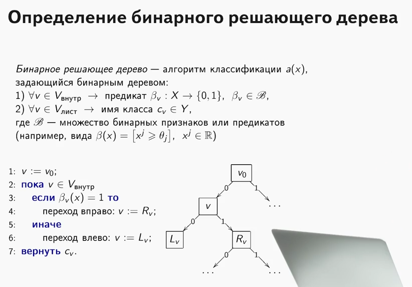
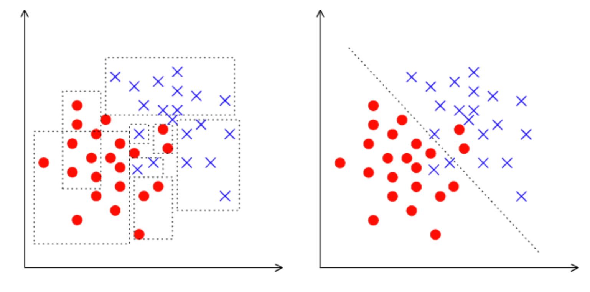
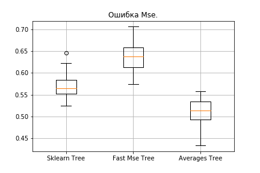

Пишем XGBoost с нуля — часть 1: деревья решений / Блог компании Mail.ru Group

Привет, Хабр!

После многочисленных поисков качественных руководств о решающих деревьях и ансамблевых алгоритмах (бустинг, решающий лес и пр.) с их непосредственной реализацией на языках программирования, и так ничего не найдя (кто найдёт — напишите в комментах, может, что-то новое почерпну), я решил сделать своё собственное руководство, каким бы я хотел его видеть. Задача на словах простая, но, как известно, дьявол кроется в мелочах, коих в алгоритмах с деревьями очень много.

Так как тема достаточно обширная, то очень сложно будет уместить всё в одну статью, поэтому будет две публикации: первая посвящена деревьям, а вторая часть будет посвящена реализации алгоритма градиентного бустинга. Весь изложенный здесь материал собран и оформлен на основе открытых источников, моего кода, кода коллег и друзей. Сразу предупреждаю, кода будет много.

  
  
Так что нужно знать и уметь, чтобы научиться писать с нуля свои ансамблевые алгоритмы с решающими деревьями? Поскольку ансамбль алгоритмов — это не что иное, как композиция «слабых алгоритмов», то для написания хорошего ансамбля требуются хорошие «слабые алгоритмы», именно их мы подробно разберём в этой статье. Как понятно из названия, это решающие деревья, и двигаясь от простого к сложному, мы научимся их писать. При этом акцент будет сделан непосредственно на реализации, вся теория будет излагаться по-минимуму, в основном я буду давать ссылки на материалы для самостоятельного изучения.

Чтобы усвоить материал, необходимо понимать, насколько хорош или плох наш алгоритм. Понимать будем очень просто — зафиксируем какой-то определённый набор данных и будем сравнивать наши алгоритмы с алгоритмами деревьев из Sklearn (ну а как же без этой библиотеки). Сравнивать будем многое: сложность алгоритма, метрики на данных, время работы и т.д.

Что же такое решающее дерево? Очень хороший материал, где объяснён принцип работы решающего дерева, содержится [в курсе ODS](https://github.com/Yorko/mlcourse.ai/blob/master/jupyter_russian/topic03_decision_trees_knn/topic3_trees_knn.ipynb) (кстати, классный курс, рекомендую тем, кто начинает своё знакомство с ML).

Очень важное пояснение: во всех нижеописанных случаях все признаки будут являться вещественными, специальных преобразований с данными вне алгоритмов мы делать не будем (сравниваем алгоритмы, а не датасеты).

Теперь давайте научимся решать задачу регрессии с помощью решающих деревьев. В качестве энтропии будем использовать метрику [MSE](https://en.wikipedia.org/wiki/Mean_squared_error).

Реализуем очень простой класс `RegressionTree`, который основан на рекурсивном подходе. Намеренно начнём с очень неэффективной, но простой в понимании реализации такого класса, чтобы в дальнейшем уметь улучшать её.

### 1\. Класс RegressionTree()

  

    class RegressionTree():
        
        '''
        Класс RegressionTree решает задачу регрессии. Основан на рекурсивных
        вызовах, когда прописываются условия выхода из рекурсии. 
        '''
        
        def __init__(self, max_depth=3, n_epoch=10, min_size=8):
            
            '''
            Объявляем переменные класса.
            '''
            
            self.max_depth = max_depth 
            self.min_size = min_size 
            self.value = 0 
            self.feature_idx = -1 
            self.feature_threshold = 0 
            self.left = None 
            self.right = None 
            
        def fit(self, X, y):
            
            '''
            Процедура обучения дерева. На выходе получим обученную модель.
            '''
            
            
            self.value = y.mean()
            base_error = ((y - self.value) ** 2).sum()
            error = base_error
            flag = 0
            
            
            prev_error_left = base_error
            prev_error_right = 0
            
            
            if self.max_depth <= 1:
                return
        
            dim_shape = X.shape[1]
            
            
            left_value = 0
            right_value = 0
            
            
            for feat in range(dim_shape):
                
                
                idxs = np.argsort(X[:, feat])
                
                
                N = X.shape[0]
                N1, N2 = N, 0
                thres = 1
                
                
                while thres < N - 1:
                    N1 -= 1
                    N2 += 1
                    
                    idx = idxs[thres]
                    x = X[idx, feat]
                    
                    
                    if thres < N - 1 and x == X[idxs[thres + 1], feat]:
    
                        thres += 1
                        continue
                    
                    
                    target_right = y[idxs][:thres]
                    target_left = y[idxs][thres:]
                    mean_right = y[idxs][:thres].mean(), 
                    mean_left = y[idxs][thres:].mean()
                    
                    
                    
                    left_shape = target_left.shape[0]
                    right_shape = target_right.shape[0]
                    mean_left_array = [mean_left for _ in range(left_shape)]
                    mean_right_array = [mean_right for _ in range(right_shape)]
                    
                    
                    prev_error_left = N1/N * mse(target_left, mean_left_array) 
                    prev_error_right = N2/N * mse(target_right, mean_right_array)
                    
                    
                    if (prev_error_left + prev_error_right < error):
                            if (min(N1,N2) > self.min_size):
                                self.feature_idx = feat
                                self.feature_threshold = x
                                left_value = mean_left
                                right_value = mean_right
    
                                flag = 1
                                error = prev_error_left + prev_error_right
                                         
                    thres += 1
            
            
            if self.feature_idx == -1:
                return
            
            
            
            self.left = RegressionTree(self.max_depth - 1)
            self.left.value = left_value
            self.right = RegressionTree(self.max_depth - 1)
            self.right.value = right_value
            
            
            idxs_l = (X[:, self.feature_idx] > self.feature_threshold)
            idxs_r = (X[:, self.feature_idx] <= self.feature_threshold)
            
            
            self.left.fit(X[idxs_l, :], y[idxs_l])
            self.right.fit(X[idxs_r, :], y[idxs_r])
            
        def __predict(self, x):
            
            '''
            Функция для генерирования предсказания - смотрим узлы, идем 
            в соответствующих  потомков и смотрим в конце self.value - это
            и будет ответом.
            '''
            
            if self.feature_idx == -1:
                return self.value
            
            if x[self.feature_idx] > self.feature_threshold:
                return self.left.__predict(x)
            else:
                return self.right.__predict(x)
            
        def predict(self, X):
            
            '''
            Предикт для матрицы - просто для каждой строчки вызываем __predict().
            '''
            
            y = np.zeros(X.shape[0])
            
            for i in range(X.shape[0]):
                y[i] = self.__predict(X[i])
                
            return y
    

Вкратце поясню, что здесь делает каждый метод.

Метод `fit`, как понятно из названия, обучает модель. На вход подаётся обучающая выборка и происходит процедура обучения дерева. Сортируя признаки, мы ищем наилучшее разбиение дерева с точки зрения уменьшения энтропии, в данном случае `mse`. Определить, что удалось найти хороший сплит, очень просто, достаточно выполнения двух условий. Мы не хотим, чтобы в разбиение попадало мало объектов (защита от переобучения), и средневзвешенная ошибка по `mse` должна быть меньше той ошибки, которая есть сейчас в дереве — мы ищем тот самый прирост [information gain](https://en.wikipedia.org/wiki/Information_gain_in_decision_trees). Пройдя таким образом все признаки и все уникальные значения по ним, мы переберём все варианты и выберем наилучшее разбиение. А дальше делаем рекурсивный вызов на полученных разбиениях до тех пор, пока не выполнятся условия выхода из рекурсии.

Метод `__predict`, как понятно из названия, делает предикт. Получив на вход объект, он идёт по узлам полученного дерева — в каждом узле зафиксирован номер признака и значение по нему, и в зависимости от того, какое значение у поступившего метода объекта по этому признаку, мы идём либо в правого потомка, либо в левого, пока не дойдём до листа, в котором и будет ответ для данного объекта.

Метод `predict` делает то же самое, что и прошлый метод, только для группы объектов.

Импортируем всем известный набор данных о домах в Калифорнии. Это обычный датасет с данными и таргетом для решения задачи регрессии.

    data = datasets.fetch_california_housing()
    X = np.array(data.data)
    y = np.array(data.target)
    

Что ж, давайте начнём сравнение! Для начала посмотрим, насколько быстро алгоритм обучается. Зададим у себя и в Sklearn единственный параметр `max_depth`, пусть он будет равен 2.

    %%time
    A = RegressionTree(2) 
    A.fit(X,y)

    from sklearn.tree import DecisionTreeRegressor
    %%time
    model = DecisionTreeRegressor(max_depth=2)
     
    model.fit(X,y)

На экран выведется следующее:

*   Для нашего алгоритма — CPU times: user 4min 47s, sys: 8.25 ms, total: 4min 47s  
    Wall time: 4min 47s
*   Для Sklearn — CPU times: user 53.5 ms, sys: 0 ns, total: 53.5 ms  
    Wall time: 53.4 ms

Как видите, алгоритм обучается в тысячи раз медленне. В чём причина? Давайте разбираться.

Вспомним, как устроена процедура поиска наилучшего разбиения. Как известно, в общем случае, при размере объектов

N и при количестве признаков

d, сложность нахождения наилучшего сплита равна

O(N∗logN∗d).

Откуда берётся такая сложность?

Во-первых, для эффективного пересчёта ошибки необходимо перед проходом по признаку отсортировать все столбцы, чтобы двигаться от меньшего к наибольшему. Поскольку мы делаем так для каждого признака, это порождает соответствующую сложность. Как видите, признаки мы сортируем, но вся беда кроется в пересчёте ошибки — мы каждый раз загоняем данные в метод `mse`, который работает за линию. Это и делает пересчёт ошибки таким неэффективным! Ведь тогда сложность нахождения сплита возрастает до

O(N2∗d), что при больших

N колоссально замедляет работу алгоритма. Поэтому плавно переходим к следующему пункту.

### 2\. Класс RegressionTree() с быстрым пересчётом ошибки

Что нужно сделать, чтобы быстро пересчитывать ошибку? Взять ручку и бумагу, и расписать, как мы должны изменять формулы.

Допустим, на каком-то шаге уже есть ошибка, посчитанная для

N объектов. Она имеет следующую формулу:

∑i=1n(yi−∑i=1NyiN)2. Тут надо поделить на

N, но пока давайте это опустим. Мы хотим быстро получить вот такую ошибку —

∑i=1N−1(yi−∑i=1N−1yiN−1)2, то есть перекинем ошибку, которую вносит элемент

yi, в другую часть.

Поскольку объект мы перекидываем, ошибку нужно пересчитывать в двух местах — в правой части (без учёта этого объекта), и в левой части (с учётом этого объекта). Но мы без ограничения общности выведем только одну формулу, так как они будут похожи.

Поскольку мы работаем с `mse`, то нам не повезло: быстрый пересчёт ошибки вывести достаточно сложно, но при работе с другими метриками (например, критерием Джини, если решаем задачу классификации) вывод быстрого пересчёта даётся гораздо легче.

Что ж, давайте начать выводить формулы!

∑i=1N(yi−∑i=1NyiN)2=∑i=1N−1(yi−∑i=1NyiN)2+(yN−∑i=1NyiN)2

Распишем первый член:

∑i=1N−1(yi−∑i=1NyiN)2=∑i=1N−1(yi−∑i=1N−1yi+yNN)2=∑i=1N−1(Nyi−∑i=1N−1yiN−yNN)2=∑i=1N−1((N−1)yi−∑i=1N−1yiN−yN−yiN)2=∑i=1N−1((N−1)yi−∑i=1N−1yiN)2−2((N−1)yi−∑i=1N−1yiN)yN−yiN+(yN−yiN)2=∑i=1N−1((N−1)yi−∑i=1N−1yiN)2−∑i=1N−1(2((N−1)yi−∑i=1N−1yiN)yN−yiN−(yN−yiN)2)=∑i=1N−1((N−1)yi−∑i=1N−1yiN−1)2∗(N−1N)2−∑i=1N−1(2((N−1)yi−∑i=1N−1yiN)yN−yiN−−(yN−yiN)2)

Уф, осталось совсем чуть-чуть. Осталось только выразить требуемую сумму.

∑i=1N(yi−∑i=1NyiN)2=∑i=1N−1((N−1)yi−∑i=1N−1yiN−1)2∗(N−1N)2−∑i=1N−1(2((N−1)yi−∑i=1N−1yiN)(yN−yiN)−(yN−yiN)2)+(yN−∑i=1NyiN)2

А дальше уже понятно, как выражать нужную сумму. Для пересчёта ошибки нам нужно хранить только суммы элементов справа и слева, а также сам новый элемент, который поступил на вход. Теперь ошибка пересчитывается за

O(1).

Что ж, давайте реализуем это в коде.

    class RegressionTreeFastMse():
        
        '''
        Класс RegressionTree с быстрым пересчетом ошибки. Сложность пересчета ошибки
        на каждой итерации составляет O(1).
        '''
        
        
        def __init__(self, max_depth=3, min_size=10):
            
            self.max_depth = max_depth
            self.min_size = min_size
            self.value = 0
            self.feature_idx = -1
            self.feature_threshold = 0
            self.left = None
            self.right = None
            
        
        def fit(self, X, y):
            
            
            self.value = y.mean()
            
            
            base_error = ((y - self.value) ** 2).sum()
            error = base_error
            flag = 0
            
            
            if self.max_depth <= 1:
                return
        
            dim_shape = X.shape[1]
            
            left_value, right_value = 0, 0
            
            for feat in range(dim_shape):
                
                prev_error1, prev_error2 = base_error, 0 
                idxs = np.argsort(X[:, feat])
                
                
                mean1, mean2 = y.mean(), 0
                sm1, sm2 = y.sum(), 0
                
                N = X.shape[0]
                N1, N2 = N, 0
                thres = 1
                
                while thres < N - 1:
                    N1 -= 1
                    N2 += 1
    
                    idx = idxs[thres]
                    x = X[idx, feat]
                    
                    
                    delta1 = (sm1 - y[idx]) * 1.0 / N1 - mean1
                    delta2 = (sm2 + y[idx]) * 1.0 / N2 - mean2
                    
                    
                    sm1 -= y[idx]
                    sm2 += y[idx]
                    
                    
                    prev_error1 += (delta1**2) * N1 
                    prev_error1 -= (y[idx] - mean1)**2 
                    prev_error1 -= 2 * delta1 * (sm1 - mean1 * N1)
                    mean1 = sm1/N1
                    
                    prev_error2 += (delta2**2) * N2 
                    prev_error2 += (y[idx] - mean2)**2 
                    prev_error2 -= 2 * delta2 * (sm2 - mean2 * N2)
                    mean2 = sm2/N2
                    
                    
                    if thres < N - 1 and np.abs(x - X[idxs[thres + 1], feat]) < 1e-5:
                        thres += 1
                        continue
                    
                    
                    
                    if (prev_error1 + prev_error2 < error):
                        if (min(N1,N2) > self.min_size):
                        
                            
                            self.feature_idx, self.feature_threshold = feat, x
                            
                            left_value, right_value = mean1, mean2
    
                            
                            flag = 1
                            error = prev_error1 + prev_error2
                                         
                    thres += 1
     
            
            if self.feature_idx == -1:
                return
            
            self.left = RegressionTreeFastMse(self.max_depth - 1)
            
            self.left.value = left_value
            self.right = RegressionTreeFastMse(self.max_depth - 1)
            
            self.right.value = right_value
            
            idxs_l = (X[:, self.feature_idx] > self.feature_threshold)
            idxs_r = (X[:, self.feature_idx] <= self.feature_threshold)
        
            self.left.fit(X[idxs_l, :], y[idxs_l])
            self.right.fit(X[idxs_r, :], y[idxs_r])
            
        def __predict(self, x):
            if self.feature_idx == -1:
                return self.value
            
            if x[self.feature_idx] > self.feature_threshold:
                return self.left.__predict(x)
            else:
                return self.right.__predict(x)
            
        def predict(self, X):
            y = np.zeros(X.shape[0])
            
            for i in range(X.shape[0]):
                y[i] = self.__predict(X[i])
                
            return y

Измерим время, которое уходит теперь на обучение, и сравним с аналогом из Sklearn.

    %%time
    A = RegressionTreeFastMse(4, min_size=5)
    A.fit(X,y)
    test_mytree = A.predict(X)
    test_mytree

  

    %%time
    model = DecisionTreeRegressor(max_depth=4)
    model.fit(X,y)
    test_sklearn = model.predict(X)
    

  

*   Для нашего алгоритма получится — CPU times: user 3.11 s, sys: 2.7 ms, total: 3.11 s  
    Wall time: 3.11 s.
*   Для алгоритма из Sklearn — CPU times: user 45.9 ms, sys: 1.09 ms, total: 47 ms  
    Wall time: 45.7 ms.

Результаты уже поприятнее. Что ж, давайте дальше улучшать алгоритм.

### 3\. Класс RegressionTree() с линейными комбинациями признаков

Сейчас в нашем алгоритме никак не используются взаимосвязи между признаками. Мы фиксируем один признак и смотрим только ортогональные разбиения пространства. Как же научиться использовать линейные взаимосвязи между признаками? То есть искать лучшие разбиения не как

ааfeat<x, а

∑i=1Kbi∗ai<x, где

K — какое-то число меньше размерности нашего пространства?

Вариантов много, я выделю два, наиболее интересных с моей точки зрения. Оба этих подхода изложены в [книжке Фридмана](https://books.google.ru/books/about/Classification_and_Regression_Trees.html) (он и придумал эти деревья).

Приведу картинку, чтобы было понятно, что имеется ввиду:

Во-первых, можно попробовать находить эти линейные разбиения алгоритмически. Понятно, что перебрать все линейные комбинации невозможно, потому что их бесконечное количество, поэтому такой алгоритм должен быть жадным, то есть на каждой итерации улучшать результат предыдущей итерации. Основную идею этого алгоритма можно прочитать в книжке, также оставлю здесь ссылку на [репозиторий](https://github.com/dimjava/MachineLearningTechnoSphere/blob/master/Boosting/GradBoostingLin.ipynb) моего друга и коллеги с реализацией этого алгоритма.

Во-вторых, если не отходить далеко от идеи поиска наилучшего ортогонального разбиения, то как нам модифицировать датасет, чтобы и информация о взаимосвязи признаков использовалась, и поиск был по ортогональным разбиениям? Правильно, сделать какие-то преобразования исходных признаков в новые. Например, можно взять суммы каких-то комбинаций признаков и искать разбиения уже по ним. Такой метод хуже ложится в алгоритмическую концепцию, но свою задачу он выполняет — ищет ортогональные разбиения уже в каких-то взаимосвязях признаков.

Что ж, давайте реализуем — будем добавлять в качестве новых признаков, например, всевозможные комбинации сумм признаков

i,j, где

i<j. Замечу, что сложность алгоритма в этом случае возрастёт, понятно во сколько раз. Ну и чтобы считалось побыстрее, будем использовать cython.

    %load_ext Cython
    
    %%cython -a 
    
    import itertools
    import numpy as np
    cimport numpy as np
    from itertools import *
    
    cdef class RegressionTreeCython:
        
        cdef public int max_depth
        cdef public int feature_idx
        cdef public int min_size
        cdef public int averages 
        
        cdef public np.float64_t feature_threshold
        cdef public np.float64_t value
    
        cpdef RegressionTreeCython left
        cpdef RegressionTreeCython right
        
        def __init__(self, max_depth=3, min_size=4, averages=1):
            
            self.max_depth = max_depth
            self.min_size = min_size
            self.value = 0
            self.averages = averages
            self.feature_idx = -1
            self.feature_threshold = 0
            self.left = None
            self.right = None
                
    
        def data_transform(self, np.ndarray[np.float64_t, ndim=2] X, list index_tuples):
            
            
            for i in index_tuples:
                
                X = np.hstack((X, X[:, i[0]:(i[1]+1)].sum(axis=1).reshape(X.shape[0],1)))
            return X
        
        def fit(self, np.ndarray[np.float64_t, ndim=2] X, np.ndarray[np.float64_t, ndim=1] y):
    
            cpdef np.float64_t mean1 = 0.0
            cpdef np.float64_t mean2 = 0.0
            cpdef long N = X.shape[0]
            cpdef long N1 = X.shape[0]
            cpdef long N2 = 0
            cpdef np.float64_t delta1 = 0.0
            cpdef np.float64_t delta2 = 0.0
            cpdef np.float64_t sm1 = 0.0
            cpdef np.float64_t sm2 = 0.0
            cpdef list index_tuples
            cpdef list stuff
            cpdef long idx = 0
            
            cpdef np.float64_t prev_error1 = 0.0
            cpdef np.float64_t prev_error2 = 0.0
            cpdef long thres = 0
            cpdef np.float64_t error = 0.0
            
            cpdef np.ndarray[long, ndim=1] idxs
            
            cpdef np.float64_t x = 0.0
            
            
            
            if self.averages:
                stuff = list(range(0,X.shape[1],1))
                index_tuples = list(combinations(stuff,2))
                
                X = self.data_transform(X, index_tuples)
                
            
            self.value = y.mean()
            
            
            base_error = ((y - self.value) ** 2).sum()
            error = base_error
            flag = 0
            
            
            if self.max_depth <= 1:
                return
        
            dim_shape = X.shape[1]
            
            left_value, right_value = 0, 0
            
            for feat in range(dim_shape):
                
                prev_error1, prev_error2 = base_error, 0 
                idxs = np.argsort(X[:, feat])
                
                
                mean1, mean2 = y.mean(), 0
                sm1, sm2 = y.sum(), 0
                
                N = X.shape[0]
                N1, N2 = N, 0
                thres = 1
                
                while thres < N - 1:
                    N1 -= 1
                    N2 += 1
    
                    idx = idxs[thres]
                    x = X[idx, feat]
                    
                    
                    delta1 = (sm1 - y[idx]) * 1.0 / N1 - mean1
                    delta2 = (sm2 + y[idx]) * 1.0 / N2 - mean2
                    
                    
                    sm1 -= y[idx]
                    sm2 += y[idx]
                    
                    
                    prev_error1 += (delta1**2) * N1 
                    prev_error1 -= (y[idx] - mean1)**2 
                    prev_error1 -= 2 * delta1 * (sm1 - mean1 * N1)
                    mean1 = sm1/N1
                    
                    prev_error2 += (delta2**2) * N2 
                    prev_error2 += (y[idx] - mean2)**2 
                    prev_error2 -= 2 * delta2 * (sm2 - mean2 * N2)
                    mean2 = sm2/N2
                    
                    
                    if thres < N - 1 and np.abs(x - X[idxs[thres + 1], feat]) < 1e-5:
                        thres += 1
                        continue
                    
                    
                    
                    if (prev_error1 + prev_error2 < error):
                        if (min(N1,N2) > self.min_size):
                        
                            
                            self.feature_idx, self.feature_threshold = feat, x
                            
                            left_value, right_value = mean1, mean2
    
                            
                            flag = 1
                            error = prev_error1 + prev_error2
                                         
                    thres += 1
            
            
            
            
            
            
            if self.feature_idx == -1:
                return
            
            
            self.left = RegressionTreeCython(self.max_depth - 1, averages=0)
            self.left.value = left_value
            self.right = RegressionTreeCython(self.max_depth - 1, averages=0)
            self.right.value = right_value
            
            
            idxs_l = (X[:, self.feature_idx] > self.feature_threshold)
            idxs_r = (X[:, self.feature_idx] <= self.feature_threshold)
            
            
            self.left.fit(X[idxs_l, :], y[idxs_l])
            self.right.fit(X[idxs_r, :], y[idxs_r])
            
        def __predict(self, np.ndarray[np.float64_t, ndim=1] x):
            
            if self.feature_idx == -1:
                return self.value
            
            if x[self.feature_idx] > self.feature_threshold:
                return self.left.__predict(x)
            else:
                return self.right.__predict(x)
            
        def predict(self, np.ndarray[np.float64_t, ndim=2] X):
    
            
            if self.averages:
                stuff = list(range(0,X.shape[1],1))
                index_tuples = list(itertools.combinations(stuff,2))
                X = self.data_transform(X, index_tuples)
                
            y = np.zeros(X.shape[0])
            
            for i in range(X.shape[0]):
                y[i] = self.__predict(X[i])
                
            return y

  

### 4\. Сравнение результатов

Что ж, давайте сравним результаты. Будем сравнивать три алгоритма с одинаковыми параметрами — дерево из Sklearn, наше обычное дерево и наше дерево с новыми признаками. Поделим много раз наш датасет на обучающий и тестовый наборы, и посчитаем ошибку.

    from sklearn.model_selection import KFold
    
    def get_metrics(X,y,n_folds=2, model=None):
    
        kf = KFold(n_splits=n_folds, shuffle=True)
        kf.get_n_splits(X)
    
        er_list = []
        for train_index, test_index in kf.split(X):
            X_train, X_test = X[train_index], X[test_index]
            y_train, y_test = y[train_index], y[test_index]
            model.fit(X_train,y_train)
            predict = model.predict(X_test)
            er_list.append(mse(y_test, predict))
        
        return er_list

Теперь прогоним всех алгоритмы.

    import matplotlib.pyplot as plt
    
    data = datasets.fetch_california_housing()
    X = np.array(data.data)
    y = np.array(data.target)
    
    er_sklearn_tree = get_metrics(X,y,30,DecisionTreeRegressor(max_depth=4, min_samples_leaf=10))
    er_fast_mse_tree = get_metrics(X,y,30,RegressionTreeFastMse(4, min_size=10))
    er_averages_tree = get_metrics(X,y,30,RegressionTreeCython(4, min_size=10))
    
    %matplotlib inline
    data = [er_sklearn_tree, er_fast_mse_tree, er_averages_tree]
    fig7, ax7 = plt.subplots()
    ax7.set_title('')
    ax7.boxplot(data, labels=['Sklearn Tree', 'Fast Mse Tree', 'Averages Tree'])
    plt.grid()
    plt.show()

Результаты:

Наше обычное дерево проиграло Sklearn (оно и понятно: Sklearn хорошо оптимизирован, и [в нем](https://scikit-learn.org/stable/auto_examples/tree/plot_tree_regression.html) по умолчанию в дереве используется ещё много параметров, которые мы не учитываем), однако при добавлении сумм результат становится приятнее.

Подведем итоги: мы научились с нуля писать решающие деревья, научились улучшать их работу и проверили их эффективность на реальных датасетах, сравнив с алгоритмом из Sklearn. Однако методами, которые приведены здесь, улучшение работы алгоритмов не ограничивается, поэтому имейте ввиду, что предложенный код можно сделать ещё лучше. В следующей статье на основе этих алгоритмов будем писать бустинг.

Всем успехов!