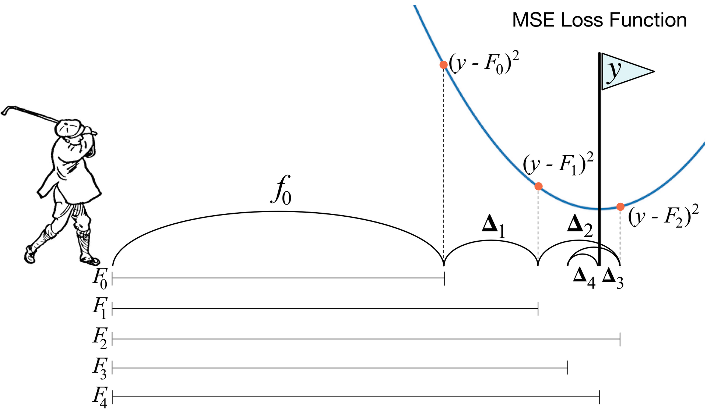
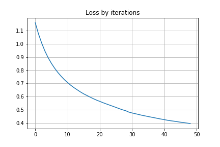
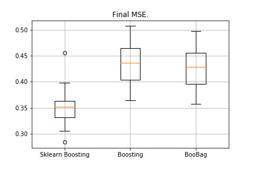
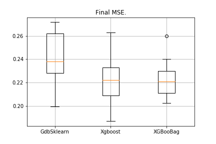

Пишем XGBoost с нуля — часть 2: градиентный бустинг / Блог компании Mail.ru Group

Всем привет!

В [прошлой статье](https://habr.com/ru/company/mailru/blog/438560/) мы разбирались, как устроены решающие деревья, и с нуля реализовали  
алгоритм построения, попутно оптимизируя и улучшая его. В этой статье мы реализуем алгоритм градиентного бустинга и в конце создадим свой собственный XGBoost. Повествование будет идти по той же схеме: пишем алгоритм, описываем его, в заверешение подводим итоги, сравнивая результаты работы с аналогами из Sklearn'а.

В этой статье упор тоже будет сделан на реализацию в коде, поэтому всю теорию лучше почитать в другом вместе (например, [в курсе ODS](https://github.com/Yorko/mlcourse.ai/tree/master/jupyter_russian/topic10_boosting)), и уже со знанием теории можно переходить к этой статье, так как тема достаточно сложная.

  
  
Что такое градиентный бустинг? Картинка с гольфистом как нельзя лучше описывает основную идею. Для того, что загнать мяч в лунку, гольфист делает каждый следующий удар с учётом опыта предыдущих ударов — для него это необходимое условие, чтобы загнать мяч в лунку. Еслиочень грубо (я не мастер игры в гольф :)), то при каждом новом ударе первое, на что смотрит гольфист, это на расстояние между мячом и лункой после предыдущего удара. И основная задача — следующим ударом уменьшить это расстояние.

Бустинг строится очень похожим способом. Во-первых, нам нужно ввести определение «лунки», то есть цели, к которой мы будем стремиться. Во-вторых, нам нужно научится понимать, в какую сторону нужно бить клюшкой, чтобы попасть ближе к цели. В-третьих, с учётом всех этих правил нужно придумать правильную последовательность ударов, чтобы каждый последующий сокращал расстояние между мячом и лункой.

Теперь дадим чуть более строгое определение. Введём модель взвешенного голосования:

h(x)=∑i=1nbiai,x∈X,bi∈R

Здесь

X — это пространство, из которого берём объекты,

bi,ai — это коэффицент перед моделью и непосредственно сама модель, то есть дерево решений. Допустим, что уже на каком-то шаге с помощью описанных правил удалось добавить в композицию

T−1 слабый алгоритм. Чтобы научиться понимать, какой-именно должен быть алгоритм на шаге

T, введем функцию ошибки:

err(h)=∑j=1NL(∑i=1T−1aibi(xj)+bTaT(xj))→minaT,bT

Получается, что наилучшим алгоритмом будет тот, который сможет максимально уменьшать ошибку, полученную на предыдущих итерациях. И так как бустинг градиентный, то у этой функции ошибки обязательно должен существовать вектор антиградиента, вдоль которого можно двигаться в поисках минимума. Всё!

Непосредственно перед реализацией вставлю ещё пару слов о том, как именно у нас всё будет устроено. Как и в прошлой статье, в качестве лосса возьмем MSE. Посчитаем её градиент:

mse(y,predict)=(y−predict)2∇predictmse(y,predict)=predict−y

Таким образом, вектор антиградиента будет равен

y−predict. На шаге

i мы считаем ошибки алгоритма, полученного на прошлых итерациях. Далее обучаем наш новый алгоритм на этих ошибках, а затем со знаком минус и каким-то коэффициентом добавляем к нашему ансамблю.

Теперь приступим к реализации.

### 1\. Реализация обычного класса градиентного бустинга

  

    import pandas as pd
    import matplotlib.pyplot as plt
    import numpy as np
    from tqdm import tqdm_notebook
    from sklearn import datasets
    from sklearn.metrics import mean_squared_error as mse
    from sklearn.tree import DecisionTreeRegressor
    import itertools
    %matplotlib inline
    
    %load_ext Cython
    
    %%cython -a 
    
    import itertools
    import numpy as np
    cimport numpy as np
    from itertools import *
    
    cdef class RegressionTreeFastMse:
        
        cdef public int max_depth
        cdef public int feature_idx
        cdef public int min_size
        cdef public int averages 
        
        cdef public np.float64_t feature_threshold
        cdef public np.float64_t value
    
        cpdef RegressionTreeFastMse left
        cpdef RegressionTreeFastMse right
        
        def __init__(self, max_depth=3, min_size=4, averages=1):
            
            self.max_depth = max_depth
            self.min_size = min_size
            self.value = 0
            self.feature_idx = -1
            self.feature_threshold = 0
            self.left = None
            self.right = None
        
        def fit(self, np.ndarray[np.float64_t, ndim=2] X, np.ndarray[np.float64_t, ndim=1] y):
    
            cpdef np.float64_t mean1 = 0.0
            cpdef np.float64_t mean2 = 0.0
            cpdef long N = X.shape[0]
            cpdef long N1 = X.shape[0]
            cpdef long N2 = 0
            cpdef np.float64_t delta1 = 0.0
            cpdef np.float64_t delta2 = 0.0
            cpdef np.float64_t sm1 = 0.0
            cpdef np.float64_t sm2 = 0.0
            cpdef list index_tuples
            cpdef list stuff
            cpdef long idx = 0
            
            cpdef np.float64_t prev_error1 = 0.0
            cpdef np.float64_t prev_error2 = 0.0
            cpdef long thres = 0
            cpdef np.float64_t error = 0.0
            
            cpdef np.ndarray[long, ndim=1] idxs
            
            cpdef np.float64_t x = 0.0
                
            
            self.value = y.mean()
            
            base_error = ((y - self.value) ** 2).sum()
            error = base_error
            flag = 0
            
            
            if self.max_depth <= 1:
                return
        
            dim_shape = X.shape[1]
            
            left_value, right_value = 0, 0
            
            for feat in range(dim_shape):
                
                prev_error1, prev_error2 = base_error, 0 
                idxs = np.argsort(X[:, feat])
                
                
                mean1, mean2 = y.mean(), 0
                sm1, sm2 = y.sum(), 0
                
                N = X.shape[0]
                N1, N2 = N, 0
                thres = 1
                
                while thres < N - 1:
                    N1 -= 1
                    N2 += 1
    
                    idx = idxs[thres]
                    x = X[idx, feat]
                    
                    
                    delta1 = (sm1 - y[idx]) * 1.0 / N1 - mean1
                    delta2 = (sm2 + y[idx]) * 1.0 / N2 - mean2
    
                    
                    sm1 -= y[idx]
                    sm2 += y[idx]
                    
                    
                    prev_error1 += (delta1**2) * N1 
                    prev_error1 -= (y[idx] - mean1)**2 
                    prev_error1 -= 2 * delta1 * (sm1 - mean1 * N1)
                    mean1 = sm1/N1
                    
                    prev_error2 += (delta2**2) * N2 
                    prev_error2 += (y[idx] - mean2)**2 
                    prev_error2 -= 2 * delta2 * (sm2 - mean2 * N2)
                    mean2 = sm2/N2
                    
                    
                    if thres < N - 1 and np.abs(x - X[idxs[thres + 1], feat]) < 1e-5:
                        thres += 1
                        continue
                    
                    if (prev_error1 + prev_error2 < error):
                        if (min(N1,N2) > self.min_size):
                        
                            
                            self.feature_idx, self.feature_threshold = feat, x
                            
                            left_value, right_value = mean1, mean2
    
                            
                            flag = 1
                            error = prev_error1 + prev_error2
                                         
                    thres += 1
            
            
            if self.feature_idx == -1:
                return
            
            
            self.left = RegressionTreeFastMse(self.max_depth - 1)
            self.left.value = left_value
            self.right = RegressionTreeFastMse(self.max_depth - 1)
            self.right.value = right_value
            
            
            idxs_l = (X[:, self.feature_idx] > self.feature_threshold)
            idxs_r = (X[:, self.feature_idx] <= self.feature_threshold)
            
            
            self.left.fit(X[idxs_l, :], y[idxs_l])
            self.right.fit(X[idxs_r, :], y[idxs_r])
            
        def __predict(self, np.ndarray[np.float64_t, ndim=1] x):
            
            if self.feature_idx == -1:
                return self.value
            
            if x[self.feature_idx] > self.feature_threshold:
                return self.left.__predict(x)
            else:
                return self.right.__predict(x)
            
        def predict(self, np.ndarray[np.float64_t, ndim=2] X):
                
            y = np.zeros(X.shape[0])
            for i in range(X.shape[0]):
                y[i] = self.__predict(X[i])
                
            return y

  

    class GradientBoosting():
        
        def __init__(self, n_estimators=100, learning_rate=0.1, max_depth=3, 
                     random_state=17, n_samples = 15, min_size = 5, base_tree='Bagging'):
                
            self.n_estimators = n_estimators
            self.max_depth = max_depth
            self.learning_rate = learning_rate
            self.initialization = lambda y: np.mean(y) * np.ones([y.shape[0]])
            self.min_size = min_size
            self.loss_by_iter = []
            self.trees_ = []
            self.loss_by_iter_test = []
            self.n_samples = n_samples
            self.base_tree = base_tree
    
        
        def fit(self, X, y):
            self.X = X
            self.y = y
            b = self.initialization(y)
            
            prediction = b.copy()
            
            for t in tqdm_notebook(range(self.n_estimators)):               
                
                if t == 0:
                    resid = y
                else:
                    
                    resid = (y - prediction)
                
                
                if self.base_tree == 'Bagging':
                    tree = Bagging(max_depth=self.max_depth,
                                           min_size = self.min_size)                
                if self.base_tree == 'Tree':
                    tree = RegressionTreeFastMse(max_depth=self.max_depth,
                                              min_size = self.min_size)
                    
                
                tree.fit(X, resid)
                
                b = tree.predict(X).reshape([X.shape[0]])
                self.trees_.append(tree)
                prediction += self.learning_rate * b
                
                if t > 0:
                    self.loss_by_iter.append(mse(y,prediction))
                       
            return self
        
        def predict(self, X):
            
            
            pred = np.ones([X.shape[0]]) * np.mean(self.y)
            
            for t in range(self.n_estimators):
                pred += self.learning_rate * self.trees_[t].predict(X).reshape([X.shape[0]])
                
            return pred
        

Построим теперь кривую лосса на обучающей выборке, чтобы убедиться, что при каждой итерации у нас действительно происходит его уменьшение.

    GDB = GradientBoosting(n_estimators=50)
    GDB.fit(X,y)
    x = GDB.predict(X)
    plt.grid()
    plt.title('Loss by iterations')
    plt.plot(GDB.loss_by_iter)

### 2\. Бэггинг над решающими деревьями

Отлично, перед тем как сравнивать результаты, давайте поговорим ещё и о процедуре [бэггинга](http://www.machinelearning.ru/wiki/index.php?title=%D0%91%D1%8D%D0%B3%D0%B3%D0%B8%D0%BD%D0%B3) над деревьями.

Тут вс просто: мы хотим защититься от переобучения, и поэтому с помощью выборок с возращением будем усреднять наши предсказания, чтобы случайно не напороться на выбросы (почему это так работает — лучше почитайте по ссылке).

    class Bagging():
        
        '''
        Класс Bagging - предназначен для генерирования бустрапированного
        выбора моделей.
        '''
        
        def __init__(self, max_depth = 3, min_size=10, n_samples = 10):
                
            
            self.max_depth = max_depth
            self.min_size = min_size
            self.n_samples = n_samples
            self.subsample_size = None
            self.list_of_Carts = [RegressionTreeFastMse(max_depth=self.max_depth, 
                                    min_size=self.min_size) for _ in range(self.n_samples)]
    
        def get_bootstrap_samples(self, data_train, y_train):
            
            
            indices = np.random.randint(0, len(data_train), (self.n_samples, self.subsample_size))
            samples_train = data_train[indices]
            samples_y = y_train[indices]
            return samples_train, samples_y
        
        def fit(self, data_train, y_train):
            
            
            self.subsample_size = int(data_train.shape[0])
            samples_train, samples_y = self.get_bootstrap_samples(data_train, y_train)
            for i in range(self.n_samples):
                self.list_of_Carts[i].fit(samples_train[i], samples_y[i].reshape(-1))
            return self
            
        def predict(self, test_data):
            
            
            num_samples = test_data.shape[0]
            pred = []
            for i in range(self.n_samples):
                pred.append(self.list_of_Carts[i].predict(test_data))
            pred = np.array(pred).T
    
            return np.array([np.mean(pred[i]) for i in range(num_samples)])
        

Отлично, теперь в качестве базового алгоритма можем использовать не одно дерево, а бэггинг из деревьев — так мы, опять же, защитимся от переобучения.

### 3\. Результаты

Сравним результаты наших алгоритмов.

    from sklearn.model_selection import KFold
    import matplotlib.pyplot as plt
    from sklearn.ensemble import GradientBoostingRegressor as GDBSklearn
    import copy
    
    def get_metrics(X,y,n_folds=2, model=None):
        kf = KFold(n_splits=n_folds, shuffle=True)
        kf.get_n_splits(X)
    
        er_list = []
        for train_index, test_index in tqdm_notebook(kf.split(X)):
            X_train, X_test = X[train_index], X[test_index]
            y_train, y_test = y[train_index], y[test_index]
            model.fit(X_train,y_train)
            predict = model.predict(X_test)
            er_list.append(mse(y_test, predict))
        
        return er_list
    
    data = datasets.fetch_california_housing()
    X = np.array(data.data)
    y = np.array(data.target)
    er_boosting = get_metrics(X,y,30,GradientBoosting(max_depth=3, n_estimators=40, base_tree='Tree' ))
    er_boobagg = get_metrics(X,y,30,GradientBoosting(max_depth=3, n_estimators=40, base_tree='Bagging' ))
    er_sklearn_boosting = get_metrics(X,y,30,GDBSklearn(max_depth=3,n_estimators=40, learning_rate=0.1))
    
    %matplotlib inline
    data = [er_sklearn_boosting, er_boosting, er_boobagg]
    fig7, ax7 = plt.subplots()
    ax7.set_title('')
    ax7.boxplot(data, labels=['Sklearn Boosting', 'Boosting', 'BooBag'])
    plt.grid()
    plt.show()

Получили:

Мы пока не можем победить аналог из Sklearn, потому что опять не учитываем очень много параметров, которые используются в [этом методе](https://scikit-learn.org/stable/modules/generated/sklearn.ensemble.GradientBoostingRegressor.html). Однако мы видим, что бэггинг чуть-чуть помогает.

Не будем отчаиваться, и перейдём к написанию XGBoost'а.

### 4\. XGBoost

Прежде чем читать дальше, очень советую сначала ознакомиться со следующим [видео](https://www.youtube.com/watch?v=yFXXi_edUS0), в нём очень хорошо объясняется теория.

Вспомним, какую ошибку мы минимизируем в обычном бустинге:

err(h)=∑j=1NL(∑i=1T−1aibi(xj)+bTaT(xj))

XGBoost явно добавляет регуляризацию в этот функционал ошибки:

err(h)=∑j=1NL(∑i=1T−1aibi(xj)+bTaT(xj))+∑i=1Tω(ai)

Как считать этот функционал? Сначала приближаем его с помощью ряда Тейлора второго порядка, где новый алгоритм рассматривается как приращение, вдоль которого мы будем двигаться, и дальше уже расписываем в зависимости от того, какой у нас лосс:

f(x+δx)≈f(x)+f(x)′δx+0.5∗f(x)″(δx)2

Необходимо определить, какое дерево мы будем считать плохим, а какое хорошим.

Вспомним, на каком принципе построена с [регрессия](https://craftappmobile.com/l1-vs-l2-regularization/) с

L2-регуляризацией — чем больше по норме значения коэффициентов перед регрессией, тем хуже, поэтому нужно, чтобы они были как можно меньше.

В XGBoost идея очень похожа: дерево штрафуется, если сумма нормы значений в листьях в нём очень большая. Поэтому сложность дерева здесь вводится следующим образом:

ω(a)=γZ+0.5∗∑i=1Zwi2

  

w — значения в листьях,

Z — количество листьев.

В видео есть переходные формулы, мы их здесь выводить не будем. Всё сводится к тому, что новое разбиение мы будем выбирать, максимизируя gain:

Gain=Gl2Sl2+λ+Gr2Sr2+λ−(Gl+Gr)2Sl2+Sr2+λ−γ

Здесь

γ,λ — это числовые параметры регуляризации, а

Gi,Si — соответствующие суммы из первых и вторых производных при данном разбиении.

Всё, теория очень кратко изложена, ссылки даны, теперь поговорим, какими будут производные, если мы работает с MSE. Всё просто:

mse(y,predict)=(y−predict)2∇predictmse(y,predict)=predict−y∇predict2mse(y,predict)=1

Когда будем считать суммы

Gi,Si, к первой просто прибавляем

predict−y, а ко второй — просто количество.

    %%cython -a 
    
    import numpy as np
    cimport numpy as np
    
    cdef class RegressionTreeGain:
        cdef public int max_depth
        cdef public np.float64_t gain
        cdef public np.float64_t lmd
        cdef public np.float64_t gmm
        
        cdef public int feature_idx
        cdef public int min_size
    
        cdef public np.float64_t feature_threshold
        cdef public np.float64_t value
        
        cpdef public RegressionTreeGain left
        cpdef public RegressionTreeGain right
        
        def __init__(self, int max_depth=3, np.float64_t lmd=1.0, np.float64_t gmm=0.1, min_size=5):
            self.max_depth = max_depth
            self.gmm = gmm
            self.lmd = lmd
            self.left = None
            self.right = None
            self.feature_idx = -1
            self.feature_threshold = 0
            self.value = -1e9
            self.min_size = min_size
            
            return
        
        def fit(self, np.ndarray[np.float64_t, ndim=2] X, np.ndarray[np.float64_t, ndim=1] y):
            
            cpdef long N = X.shape[0]
            cpdef long N1 = X.shape[0]
            cpdef long N2 = 0
            cpdef long idx = 0
            cpdef long thres = 0
            cpdef np.float64_t gl, gr, gn
            cpdef np.ndarray[long, ndim=1] idxs
            cpdef np.float64_t x = 0.0
            cpdef np.float64_t best_gain = -self.gmm
            
            if self.value == -1e9:
                self.value = y.mean()
            
            base_error = ((y - self.value) ** 2).sum()
            error = base_error
            flag = 0
            
            if self.max_depth <= 1:
                return
            
            dim_shape = X.shape[1]
            
            left_value = 0
            right_value = 0
            
            
            
            
            
            
            for feat in range(dim_shape):
                
                idxs = np.argsort(X[:, feat])
                 
                gl,gr = y.sum(),0.0
    
                N1, N2, thres = N, 0, 0
                
                while thres < N - 1:
                    N1 -= 1
                    N2 += 1
    
                    idx = idxs[thres]
                    x = X[idx, feat]
                    
                    gl -= y[idx]
                    gr += y[idx]
                    
                    
                    gn = (gl**2) / (N1 + self.lmd)  + (gr**2) / (N2 + self.lmd)
                    gn -= ((gl + gr)**2) / (N1 + N2 + self.lmd) + self.gmm
                    
                    if thres < N - 1 and x == X[idxs[thres + 1], feat]:
                        thres += 1
                        continue
                    
                    
                    if (gn > best_gain) and (min(N1,N2) > self.min_size):
                        
                        flag = 1
                        best_gain = gn
                        left_value = -gl / (N1 + self.lmd)
                        right_value = -gr / (N2 + self.lmd)
                        
                        self.feature_idx = feat
                        self.feature_threshold = x
    
                    thres += 1
            
            self.gain = best_gain
            if self.feature_idx == -1:
                return
                    
            self.left = RegressionTreeGain(max_depth=self.max_depth - 1, gmm=self.gmm, lmd=self.lmd)
            self.left.value = left_value
            self.right = RegressionTreeGain(max_depth=self.max_depth - 1, gmm=self.gmm, lmd=self.lmd)
            self.right.value = right_value
            
            idxs_l = (X[:, self.feature_idx] > self.feature_threshold)
            idxs_r = (X[:, self.feature_idx] <= self.feature_threshold)
        
            self.left.fit(X[idxs_l, :], y[idxs_l])
            self.right.fit(X[idxs_r, :], y[idxs_r])
            
            
            if (self.left.left == None or self.right.left == None):
                if self.gain < 0.0:
                    self.left = None
                    self.right = None
                    self.feature_idx = -1
    
        def __predict(self, np.ndarray[np.float64_t, ndim=1] x):
            if self.feature_idx == -1:
                return self.value
            
            if x[self.feature_idx] > self.feature_threshold:
                 return self.left.__predict(x)
            else:
                return self.right.__predict(x)
            
        def predict(self, np.ndarray[np.float64_t, ndim=2] X):
            y = np.zeros(X.shape[0])
            
            for i in range(X.shape[0]):
                y[i] = self.__predict(X[i])
                
            return y

Небольшое уточнение: чтобы формулы в деревьях с gain'ом были красивее, в бустинге обучаем таргет со знаком минус.

Слегка модифицируем наш бустинг, сделаем некоторые параметры адаптивными. Например, если замечаем, что лосс начал выходить на плато, то уменьшаем learning rate и увеличиваем max_depth у следующих эстиматоров. Также добавим новый бэггинг — теперь сделаем бустинг над бэггингами из деревьев с gain'ом:

    class Bagging():
        
        def __init__(self, max_depth = 3, min_size=5, n_samples = 10):
                
            self.max_depth = max_depth
            self.min_size = min_size
            self.n_samples = n_samples
            self.subsample_size = None
            self.list_of_Carts = [RegressionTreeGain(max_depth=self.max_depth, 
                                    min_size=self.min_size) for _ in range(self.n_samples)]
    
        
        def get_bootstrap_samples(self, data_train, y_train):
            
            indices = np.random.randint(0, len(data_train), (self.n_samples, self.subsample_size))
            samples_train = data_train[indices]
            samples_y = y_train[indices]
            return samples_train, samples_y
        
        def fit(self, data_train, y_train):
            
            self.subsample_size = int(data_train.shape[0])
            samples_train, samples_y = self.get_bootstrap_samples(data_train, y_train)
            for i in range(self.n_samples):
                self.list_of_Carts[i].fit(samples_train[i], samples_y[i].reshape(-1))
            return self
            
        def predict(self, test_data):
            
            num_samples = test_data.shape[0]
            pred = []
            for i in range(self.n_samples):
                pred.append(self.list_of_Carts[i].predict(test_data))
            pred = np.array(pred).T
    
            return np.array([np.mean(pred[i]) for i in range(num_samples)])

  

    class GradientBoosting():
        
    
        def __init__(self, n_estimators=100, learning_rate=0.2, max_depth=3, 
                     random_state=17, n_samples = 15, min_size = 5, base_tree='Bagging'):
                
            self.n_estimators = n_estimators
            self.max_depth = max_depth
            self.learning_rate = learning_rate
            self.initialization = lambda y: np.mean(y) * np.ones([y.shape[0]])
            self.min_size = min_size
            self.loss_by_iter = []
            self.trees_ = []
            self.loss_by_iter_test = []
            self.n_samples = n_samples
            self.base_tree = base_tree
    
            
            
            self.add_to_max_depth = 1
            self.init_mse_board = 1.5
        
        def fit(self, X, y):
            print (self.base_tree)
            self.X = X
            self.y = y
            b = self.initialization(y)
            
            prediction = b.copy()
            
            for t in tqdm_notebook(range(self.n_estimators)):
                            
                if t == 0:
                    resid = y
                else:
                    resid = (y - prediction)
                    if (mse(temp_resid,resid) < self.init_mse_board):
                        self.init_mse_board /= 1.5
                        self.add_to_max_depth += 1
                        self.learning_rate /= 1.1
                        
                
                if self.base_tree == 'Bagging':
                    tree = Bagging(max_depth=self.max_depth+self.add_to_max_depth,
                                             min_size = self.min_size)
                    resid = -resid
                    
                if self.base_tree == 'Tree':
                    tree = RegressionTreeFastMse(max_depth=self.max_depth+self.add_to_max_depth, min_size = self.min_size)
                    
                if self.base_tree == 'XGBoost':
                    tree = RegressionTreeGain(max_depth=self.max_depth+self.add_to_max_depth, min_size = self.min_size)
                    resid = -resid
                    
                tree.fit(X, resid)
                b = tree.predict(X).reshape([X.shape[0]])
                
                self.trees_.append(tree)
                prediction += self.learning_rate * b
                temp_resid = resid
    
            return self
        
        def predict(self, X):
            
            
            pred = np.ones([X.shape[0]]) * np.mean(self.y)
            
            for t in range(self.n_estimators):
                pred += self.learning_rate * self.trees_[t].predict(X).reshape([X.shape[0]])
                
            return pred

  

### 5\. Результаты

По традиции, сравним результаты:

    data = datasets.fetch_california_housing()
    X = np.array(data.data)
    y = np.array(data.target)
    
    import matplotlib.pyplot as plt
    from sklearn.ensemble import GradientBoostingRegressor as GDBSklearn
    
    er_boosting_bagging = get_metrics(X,y,30,GradientBoosting(max_depth=3, n_estimators=150,base_tree='Bagging'))
    er_boosting_xgb = get_metrics(X,y,30,GradientBoosting(max_depth=3, n_estimators=150,base_tree='XGBoost'))
    er_sklearn_boosting = get_metrics(X,y,30,GDBSklearn(max_depth=3,n_estimators=150,learning_rate=0.2))
    
    %matplotlib inline
    data = [er_sklearn_boosting, er_boosting_xgb, er_boosting_bagging]
    fig7, ax7 = plt.subplots()
    ax7.set_title('')
    ax7.boxplot(data, labels=['GdbSklearn', 'Xgboost',  'XGBooBag'])
    plt.grid()
    plt.show()

Картинка будет следующая:

Самая низкая ошибка у XGBoost, но у XGBooBag ошибка более скученная, что определённо лучше: алгоритм более устойчив.

На этом всё. Очень надеюсь, что материал, изложенный в двух статьях, был полезен, и вы смогли узнать для себя что-то новое. Особую благодарность выражаю Дмитрию за всестороннюю обратную связь и исходники, Антону — за советы, Владимиру — за сложные задания по учебе.

Всем успехов!