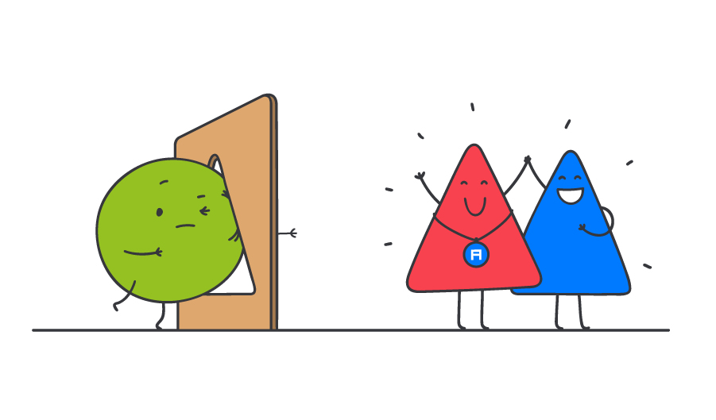

Подражание не может быть стратегией развития продукта / Блог компании Alconost

## Если что-то сработало для одной компании, это не обязательно означает, что то же самое сработает для другой

Недавно YouTube объявил о больших изменениях на подписной платформе YouTube Premium (раньше она называлась YouTube Red): они отказываются от подписки и открывают премиум-контент бесплатно (но с рекламой) для всех пользователей YouTube. Издание _USA Today_ опубликовало статью об этом под заголовком «[Не все готовы платить за подписку. Не верите? Спросите YouTube](https://www.usatoday.com/story/tech/talkingtech/2018/11/30/not-everyone-willing-pay-subscriptions-just-ask-youtube/2161331002/)». Согласно этой статье, люди устали от подписок — или, цитируя статью: «Пользователи сказали свое слово. Хватит уже этих подписок».

Есть множество подписных сервисов — и вполне вероятно, мы можем достичь точки насыщения. Однако я не думаю, что проблема у YouTube Premium была именно в этом: люди будут платить почти за все, что дает то, что кажется им ценным и вписывается в их представление о мире — ради этого они готовы даже залезть в долги. Поэтому кредитные карты так популярны.

Думаю, настоящая проблема с YouTube Premium была в том, что они решили повторить то, что делают другие сервисы потокового видео.

YouTube выстроил свою стратегию вокруг того, что делали остальные, и теперь столкнулся с истиной, которую слишком часто игнорируют: подражание не может быть стратегией развития.

Подражание — повсюду: мы как дизайнеры, разработчики, бизнесмены и менеджеры по продуктам ориентируемся на успешные методики, анализируем работу конкурентов — и в результате часто применяем к созданию продукта имитационный подход. Если что-то работает для других, оно должно сработать и для нас — так нам кажется. Загвоздка в том, что часто такое подражание не работает — по крайней мере не так, как мы ожидаем.

**Переведено в [Alconost](https://alconost.com/?utm_source=habrahabr&utm_medium=article&utm_campaign=translation&utm_content=emulation)**  
  
Ваш продукт, сфера и способ его использования, а также место, которое вы занимаете в головах людей, уникальны. Пользователи формируют представление о бренде и продукте благодаря множеству самых разных факторов. Не бывает одинаковых брендов — и никогда не будет.

**Копируя чужой продукт, компания предполагает, что копируемая особенность была для конкурентов успешной, и что исходный продукт разрабатывался для достижения той же цели, что и новый продукт-имитация.**

YouTube следил за развитием рынка потокового видео и обратил внимание на то, что казалось новой формулой успеха: создавайте качественный контент с известными личностями, сделайте к нему платный доступ — и за это будут платить. Так делает Netflix. Так делает Amazon. Так делает Hulu.

Но все не так просто, как может показаться на первый взгляд. Netflix добился успеха, потому что они с самого начала распространяли контент по подписке. Сервис всегда был известен своим качественным контентом, даже когда они доставляли видео на DVD в маленьких красных пакетиках. Подписка Hulu работает, потому что они — потоковый эквивалент телевидения: не хочешь платить за кабель, но хочешь смотреть кабельные шоу — подписывайся на Hulu. Видеосервис Amazon работает, потому что их пользователи уже заплатили за подписку Prime, к которой добавили видео. Сомневаюсь, что без этого подписной Amazon Video взлетел бы.

На первый взгляд кажется, что все три компании сделали одно и то же. В действительности же каждый сервис разработал для премиум-контента собственное предложение, ориентированное на пользователей этого сервиса, варианты его использования и особенности компании. А YouTube этого не сделал.

YouTube никогда не был известен ни премиум-контентом, ни платным контентом — он приобрел популярность как раз за обратное: бесплатный контент не самого высокого качества. Как известно, одна из задач при поиске рыночной ниши для продукта — закрепить за ним определенный образ в головах аудитории. И после этого уже становится очень трудно что-то изменить — это может быть даже сложнее, чем первоначальная задача. А YouTube зарекомендовал себя как место, где можно бесплатно смотреть короткие видео.

YouTube никогда не пытался использовать модель Netflix — она ему не характерна и не соответствует роли, которую этот видеосервис играет в жизни пользователей. Поэтому недавняя смена подхода на платформе имеет мало общего с желанием или нежеланием клиентов платить за еще одну подписку.

Подражание как стратегия развития продукта привлекательна по многим причинам. Например, потому что это легко: не нужно ни в чем разбираться — просто копируй. А еще этот подход кажется менее рискованным: ведь другие уже проверили идею, и она работает. Но на самом деле это заблуждение: подражание так же рискованно, как и попытка пробовать что-то новое — а возможно, даже более рискованно.

Рисков здесь множество. Во-первых — это сужение фокуса внимания. Увлекшись подражанием, можно перестать обращать внимание на уникальные, ценные особенности продукта. Это может привести к чрезмерной сосредоточенности на конкуренции, а не клиентах.

Многие годы я руководил развитием продукта в компании, которая работала над сервисом потокового видео. И столько раз на совещаниях я слышал: «Ну, так ведь делает Netflix». **Мне каждый раз хотелось напомнить: мы работаем не для клиентов конкурента — а для своих собственных клиентов, а они, как бы нам ни хотелось думать, совсем другие, их привлекают уникальные характерные особенности именного нашего сервиса.**

Итогом такой невнимательности может быть риск утраты возможностей. Сосредоточиваясь на подражании, вы перестаете рассматривать варианты, которые затрагивают отличительные черты компании и ее клиентской базы, упускаете шансы сделать что-то впечатляющее, неожиданное. А ведь именно на это нужно обращать внимание в первую очередь — на уникальные преимущества, ради которых клиенты в первую очередь и пришли к вам. Сосредоточившись на этом, можно экспоненциально повышать ценность продукта, усиливая привязанность клиентов к конкретным особенностям, которые делают продукт уникальным.

**Попробуйте перебрать в уме не самые удачные элементы продукта, на совершенствование которых просто не было времени. Если посмотреть со стороны, может показаться, что все они — неотъемлемая часть вашего продукта, потому в целом оно работает.**

И еще один риск, о котором я хочу упомянуть, — подражание «мимо цели». Копируя чужой продукт, компания предполагает, что копируемая особенность была для конкурентов успешной. Кроме того, предполагается, что исходный продукт разрабатывался для достижения той же цели, что и новый продукт-имитация.

Проще всего определить успех по очевидным признакам вроде бизнес-модели (например, в том, что это сервис по подписке): денежный поток, поступающий в Netflix, говорит сам за себя. Но часто имитируется что-то намного меньшее: например, конкретные функции, подход к конверсии и даже макет и стиль определенного экрана. Определить, насколько эти детали действительно вносят вклад в успех, может быть намного сложнее. И еще труднее узнать истинные бизнес-цели, стоящие за исходной идеей.

Вспомните собственный продукт. Попробуйте перебрать в уме не самые удачные элементы, на совершенствование которых просто не было времени. Если посмотреть со стороны, может показаться, что все они — неотъемлемая часть вашего продукта, потому в целом оно работает. И я, опять же, бесчисленное множество раз слышал заявления вроде такого: «Ну, мы знаем, что \[конкурент X\] проводит много тестов, поэтому это должно работать».

Все мы становимся жертвами подражания. Посмотрите хотя бы, насколько похожи интерфейсы большинства приложений. Какие возможности мы упускаем, подражая друг другу?

На предыдущей работе мы несколько раз пытались подражать сервису Netflix. Неудивительно, что результаты обычно не соответствовали ожиданиям. Причина, как вы, наверное, уже догадались, была в том, что мы — не Netflix. В первую очередь мы отличались с технической точки зрения, и возможности у нас были другими. Но еще более важно то, что поведение и цели наших пользователей никогда не были такими же, как у клиентов Netflix: туда вы приходите расслабиться, развлечься и отдохнуть. Наш же контент был завлекающим, информационным, — его хочется обсудить, «переварить». А Netflix не ориентируется на подобное поведение.

Мы неоднократно обнаруживали, что самыми успешными функциями у нас были те, что мы разработали сами — те, что были бы неактуальны для пользователей Netflix, но зато здорово соответствовали нашей уникальной аудитории и идеально вписывались в образ нашего продукта.

Обращать внимание на ситуацию на рынке может быть полезно: это помогает информировать и вдохновлять команду разработчиков. Но старайтесь не попасть в ловушку и не сделать подражание своей стратегией. Всегда отслеживайте, что уникально в вашем продукте и вашей аудитории. Играйте от своих сильных сторон — это лучший путь снизить риски и добиться большего.

**О переводчике**

Перевод статьи выполнен в Alconost.

Alconost занимается [локализацией игр](https://alconost.com/services/game-localization?utm_source=habrahabr&utm_medium=article&utm_campaign=translation&utm_content=emulation), [приложений и сайтов](https://alconost.com/services/software-localization?utm_source=habrahabr&utm_medium=article&utm_campaign=translation&utm_content=emulation) на 70 языков. Переводчики-носители языка, лингвистическое тестирование, облачная платформа с API, непрерывная локализация, менеджеры проектов 24/7, любые форматы строковых ресурсов.

Мы также делаем [рекламные и обучающие видеоролики](https://alconost.com/services/video-production?utm_source=habrahabr&utm_medium=article&utm_campaign=translation&utm_content=emulation) — для сайтов, продающие, имиджевые, рекламные, обучающие, тизеры, эксплейнеры, трейлеры для Google Play и App Store.

→ [Подробнее](https://alconost.com/?utm_source=habrahabr&utm_medium=article&utm_campaign=translation&utm_content=trend)