Полное руководство по профессиональному поиску скрытых камер и шпионских устройств

Вне всякого сомнения, это наиболее исчерпывающее руководство по обнаружению работающих скрытых камер и устройств слежения.

Мы покажем вам эффективные стратегии того, как очистить большую часть комнат от скрытых камер и жучков, без использования сверхдорогого оборудования для борьбы со слежкой или привлечения сторонней компании.

Большая часть процессов и шагов, которые мы покажем вам, взята у наших лучших правительственных агентств, для которых борьба со слежкой жизненно важна, поэтому эти технологии проверены и испытаны. И, что самое важное – это может повторить любой человек!

В статье мы опишем точный пошаговый процесс, который мы используем для поиска скрытых устройств слежения и камер. Начнём!  

## Поиск скрытых камер и устройств становится необходимостью

За последние пару лет мы наблюдаем рост количества случаев недобросовестного использования скрытых камер и шпионского оборудования, идущего во вред посетителям круизных лайнеров, отелей, квартир и домов, сдающихся через Airbnb, и так далее. К сожалению, эта тенденция в ближайшее время не собирается идти на спад, однако вы можете принять меры и убедиться, что вы не стали её жертвой. В данной статье мы покажем, как именно это можно сделать.

## Какие устройства могут быть использованы против вас?

Перед проверкой помещения необходимо определить, оборудование какого типа будет использовано против вас в определённой ситуации.

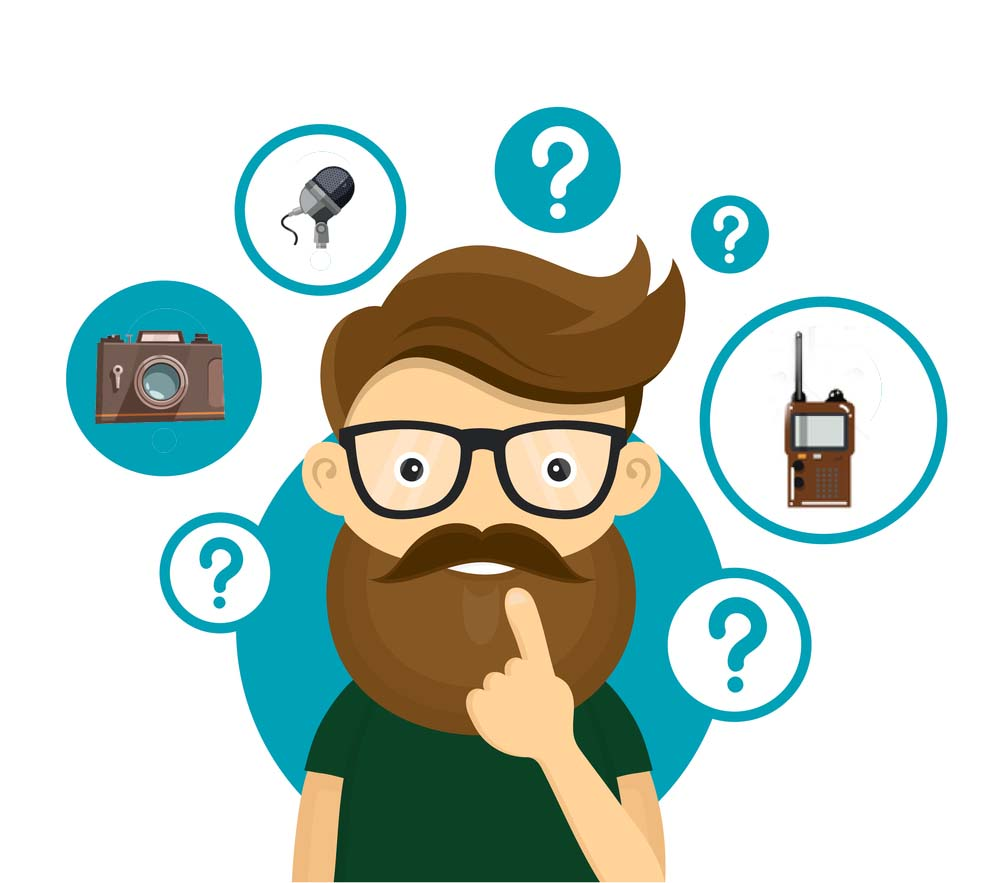

К примеру, если вы ночуете в отеле или номере с завтраком, вы наверняка можете найти оборудование для слежки, предназначенное для съёмки компрометирующих видеороликов или фотографий жильцов.

Если вы находитесь в месте, где проводятся бизнес-встречи, например, в переговорной, вы можете предположить, что среди собранных здесь сведений могут оказаться важные разговоры. Наиболее вероятно, что в такой ситуации будет использовано устройство для записи аудио.

Учитывайте такие факторы при осмотре комнаты, и обращайте внимание на наиболее уязвимые и компрометирующее места комнаты.

## Разбейте поиск жучков на следующие шаги

  

### Шаг 1: Входя в комнату, предполагайте наличие слежки

Если вы впервые останавливаетесь в отеле или квартире с Airbnb, автоматически предполагайте, что за вами следят и вас записывают. Однако расслабьтесь – паниковать не нужно!

С наибольшей вероятностью за вами не следят, но чтобы убедиться в этом на 100%, необходимо всё же проверить помещение.

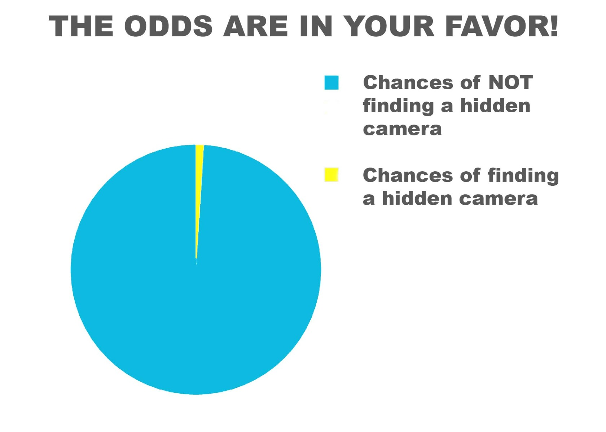  
_Шансы найти скрытую камеру весьма малы_

Сравните это с использованием ремня безопасности в автомобиле. Скорее всего, он вам не потребуется, но если он пригодится, вы будете рады, что использовали его. Поэтому всегда лучше предполагать, что вас записывают, если только у вас нет 100% уверенности в том, что в комнате нет никакого следящего оборудования.

### Шаг 2: разбейте комнату на квадранты

Встаньте в центр комнаты. Разбейте её на квадранты. Определив их и начальные точки, обработайте каждый квадрант по очереди, используя описанные здесь технологии.

Разбиение комнаты на секции позволит вам систематически и тщательно проверить комнату и очистить каждую секцию, не пропустив ни одной мелочи.

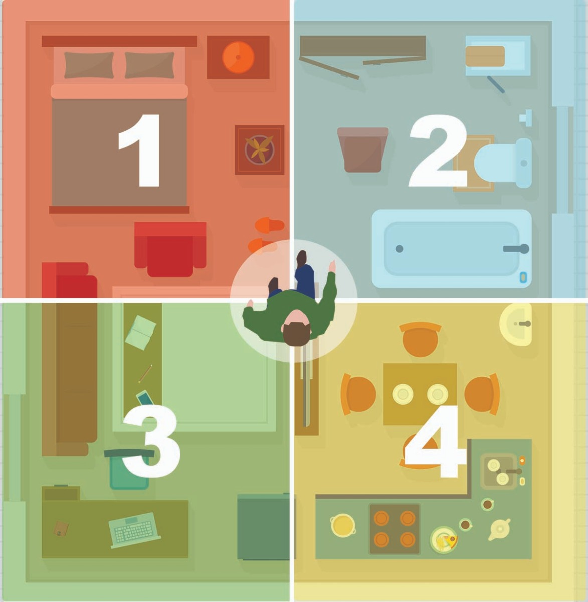

### Шаг 3: начните с простого наблюдения

Тщательно осмотрите комнату, обращая внимание на всё, что бросается в глаза или кажется подозрительным. Есть ли в комнате повторяющиеся вещи? Часы, детекторы дыма, кофейники. Есть ли в стенах или потолке необычные отверстия? Расположены ли вещи в комнате необычно?

Проверьте все приборы – телевизор, часы, телефон, фен, кофейник – нет ли у них торчащих проводов, подозрительных лампочек, или чего-то ещё, что выглядит ненормально.

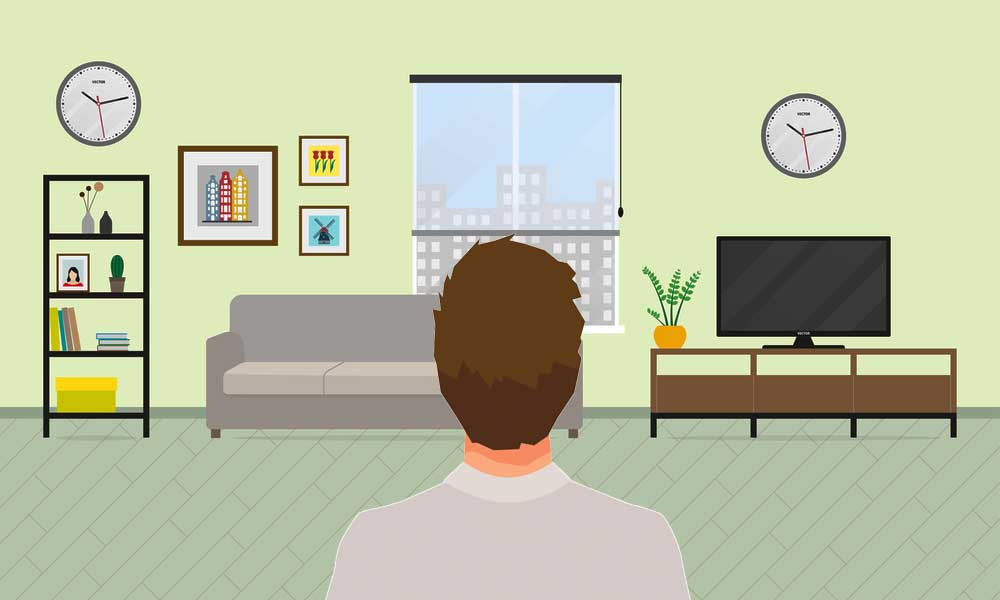

### Шаг 4: проверьте каждую розетку и определите, что в них воткнуто

Всем устройствам для слежки требуется источник питания; питается ли устройство от розетки или от батареи, зависит от того, каков ваш предполагаемый срок проживания в комнате, и есть ли у злоумышленника доступ к ней.

Устройства с аккумуляторами работают ограниченное время, а те, что работают от электрических розеток, можно использовать для постоянного и длительного наблюдения.

Проверьте розетки, определите всё, что в них воткнуто. Внимательно осмотрите всё, что выглядит так, будто находится не на своём месте.

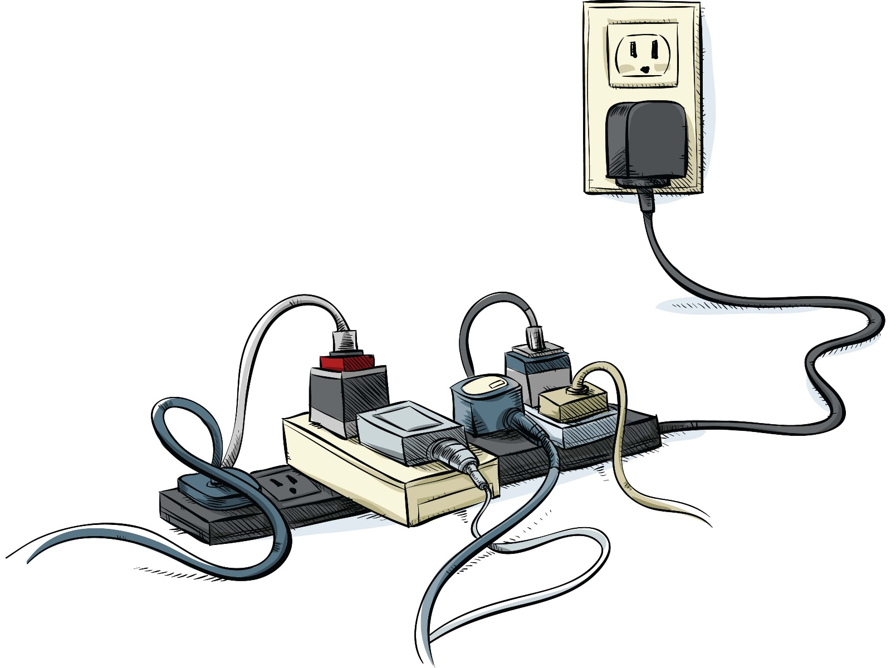

## Что насчёт видеонаблюдения и записи аудио?

Любое устройство для записи видео будет расположено так, чтобы обеспечивать наилучшую возможность для съёмки. К примеру, устройство для видеонаблюдения будет направлено на ванную комнату, на место перед шкафом, где человек переодевается, или на постель. Важно помнить о всех узких местах и местах частого перемещения, которые заставляют жильцов идти по определённому пути или занимать определённое место в комнате.

Среди мест, на которые нужно обратить внимание – дверь в ванную комнату, входная дверь и все коридоры/прихожие.

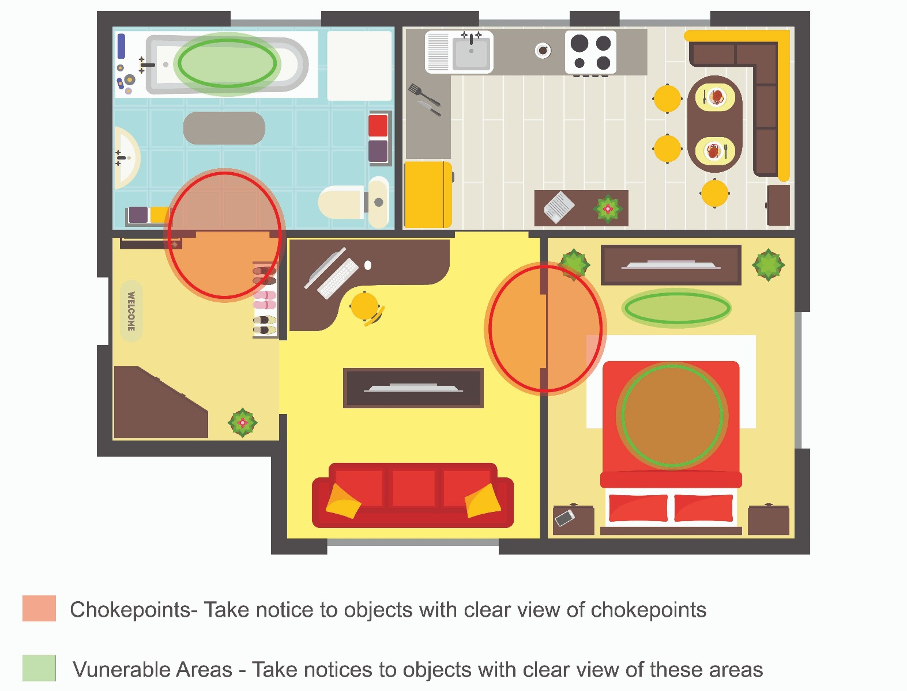  
_Красное — узкие места, зелёное — уязвимые. Необходимо искать камеры, которые могут быть направлены на эти места._

Важно обратить особое внимание на места, в которых обычно ведутся разговоры. Если кто-либо захочет разместить в комнате следящее оборудование с целью записать разговор с хорошим качеством, он расположит устройство в тех местах, где обычно собираются люди.

Стоит обратить внимание на кровати, столы, кушетки, кресла и балконы.

## Объекты, уязвимые для установки шпионских устройств

Все ли устройства и принадлежности в вашей комнате совпадают с другими объектами в вашей комнате или во всём доме? Не расположены ли какие-либо из них в странных местах или странным образом? Не меняются ли они от комнаты к комнате?

Обращайте внимание на датчики дыма, термостаты, розетки, сантехнику и лампочки. Здравый смысл подсказывает, что все эти устройства должны быть похожими друг на друга, поскольку обычно они появляются в комнате или здании во время строительства.

Это наблюдение может выявить аномалию, которую стоит исследовать подробнее. Нет ли в разных комнатах схожих устройств, которые расположены странным образом или в странных местах? Во время исследования помещения вы должны задавать себе подобные вопросы и углубляться в исследование предметов в случае подозрений.

Совпадают ли картины с украшением или стилем комнаты или дома, в котором вы остановились? Чаще всего у отелей и съёмных жилищ прослеживается общий стиль украшения.

К примеру, в современном отеле, скорее всего, современными будут украшения, сантехника, мебель и приборы. В сельской гостинице с завтраком может быть более ветхая мебель с шармом старины. Обращайте внимание на сантехнику и украшения, которые вызывают подозрение.

## Знайте о предлагаемых удобствах

Всегда стоит хорошо знать об услугах и удобствах, предлагаемых там, где вы останавливаетесь, и сравнивать их с реальными устройствами и удобствами, имеющимися в вашей комнате.

К примеру, если в описании комнаты указан один кофейник, а вы видите два, изучите их на предмет аномалий. Если кофе предлагается в столовой, должен ли быть кофейник в вашей комнате? Нет ли в комнате нескольких часов?

На большинстве сайтов будут перечислены предлагаемые удобства и устройства, но вы всегда можете задать вопросы на рецепции, если не уверены в том, что должно быть у вас в комнате.

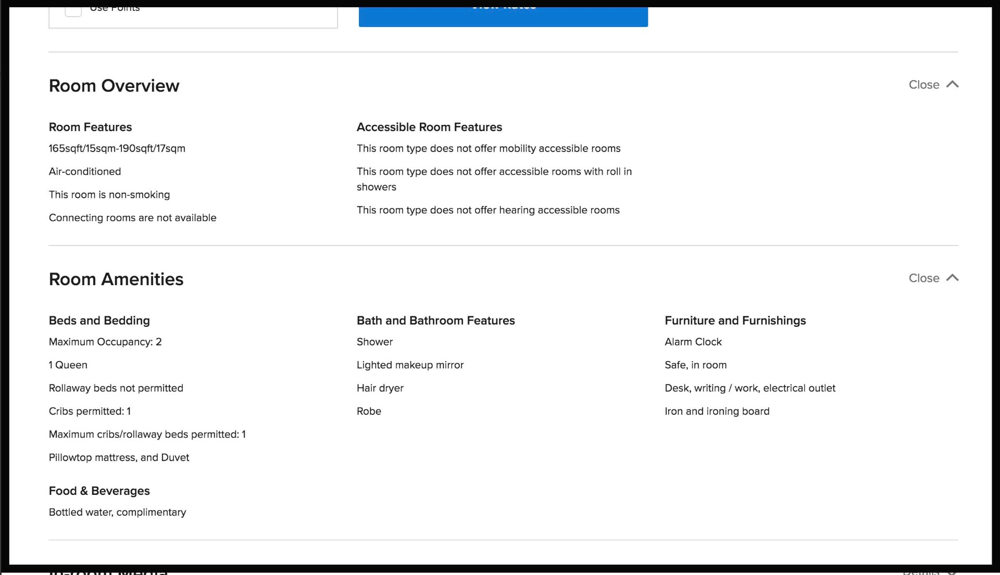

Если в комнате на потолке есть плитка – является ли она частью подвесного потолка или встроена в потолок? Нет ли в ней отверстий? Не выделяется ли какая-то из плиток на фоне остальных, не выпирает ли?

Если плитки подвесного потолка можно легко поднять, изучите их и убедитесь, что над ними не спрятаны следящие устройства.

## Проверьте зеркала

Рекомендуется всегда проверять все зеркала в комнате, чтобы убедиться, что они не двусторонние. Лучший способ проверки – использование пальца. Отражение пальца в большинстве зеркал не будет соприкасаться с пальцем, если упереть его прямо в зеркало. Между отражением и пальцем должен будет остаться промежуток примерно в 5 мм.

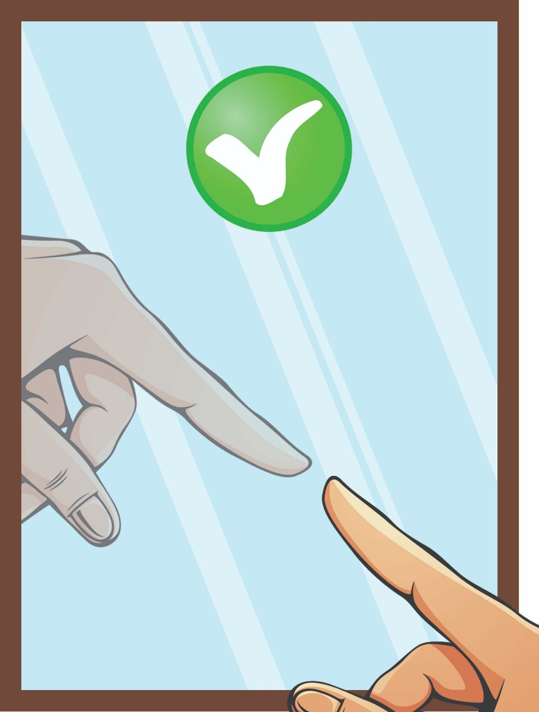

Если вы коснулись пальцем зеркала, и отражение в нём соприкасается с пальцем, нужно изучить зеркало подробнее.

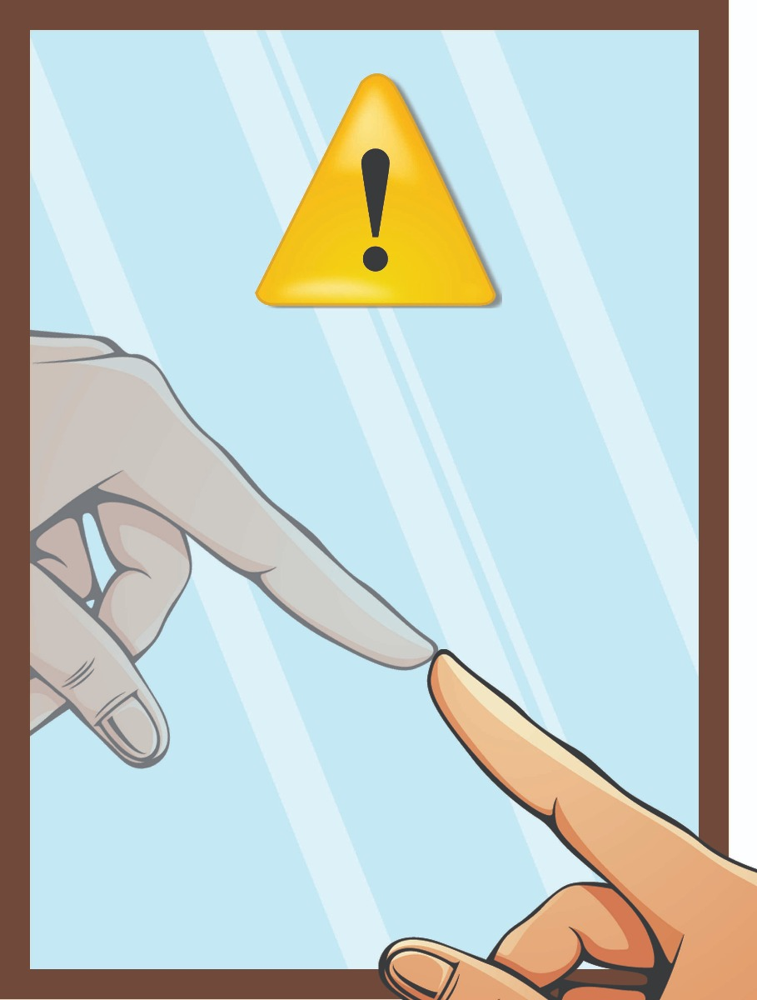

Важно отметить, что в таких местах, как бары или автозаправки, вместо обычных зеркал может использоваться зеркальная плёнка на металлической основе, которая выглядит, как двустороннее зеркало. Это делается для того, чтобы избежать возможных стеклянных осколков, опасных для посетителей.

Ещё одна технология проверки заключается в том, чтобы выключить свет и посветить фонариком в зеркало, чтобы узнать, есть ли что-то за ним.

## Углубляемся далее

Закончив визуальный и физический обзор, рекомендуется пристальнее рассмотреть все подозрительные объекты, устройства или места, используя несколько простых в использовании и недорогих устройств для обнаружения слежки. С их помощью можно будет найти устройства, которые не видны при визуальном осмотре.

### Шаг 1: купите детектор радиосигналов

Большей части устройств наблюдения долговременного использования потребуется способ передавать информацию наблюдателю. Детектор жучков сканирует выбранную область в поисках устройств, испускающих радиосигналы, и обнаружив их, выдаёт звуковой сигнал, изменяющийся по мере приближения или удаления от источника. Таким способом пользователь может в итоге обнаружить устройство, испускающее радиоволны.

Коммерческие следящие устройства передают сигналы в диапазоне от 10 МГц до 8 ГГц. Большинство детекторов жучков обнаружат их, сканируя диапазон от 10 Гц вплоть до 24 ГГц. У профессиональных детекторов диапазон ещё больше, а кроме этого есть ещё и куча особых возможностей. Однако такие устройства весьма дороги и могут обойтись вам в сотни или тысячи долларов.

Ваша конкретная ситуация определяет уровень обнаружения, нужный вам. Обычный человек, использующий детектор для проверки комнаты в отеле или квартиры, снятой через AirBnB, может обойтись простым устройством, распознающим и находящим неизвестные источники радиосигналов. Качественный [детектор](https://www.senteltechsecurity.com/professional-audio-video-and-tracking-bug-detector.html), способный справиться с такой задачей, можно купить всего за $100.

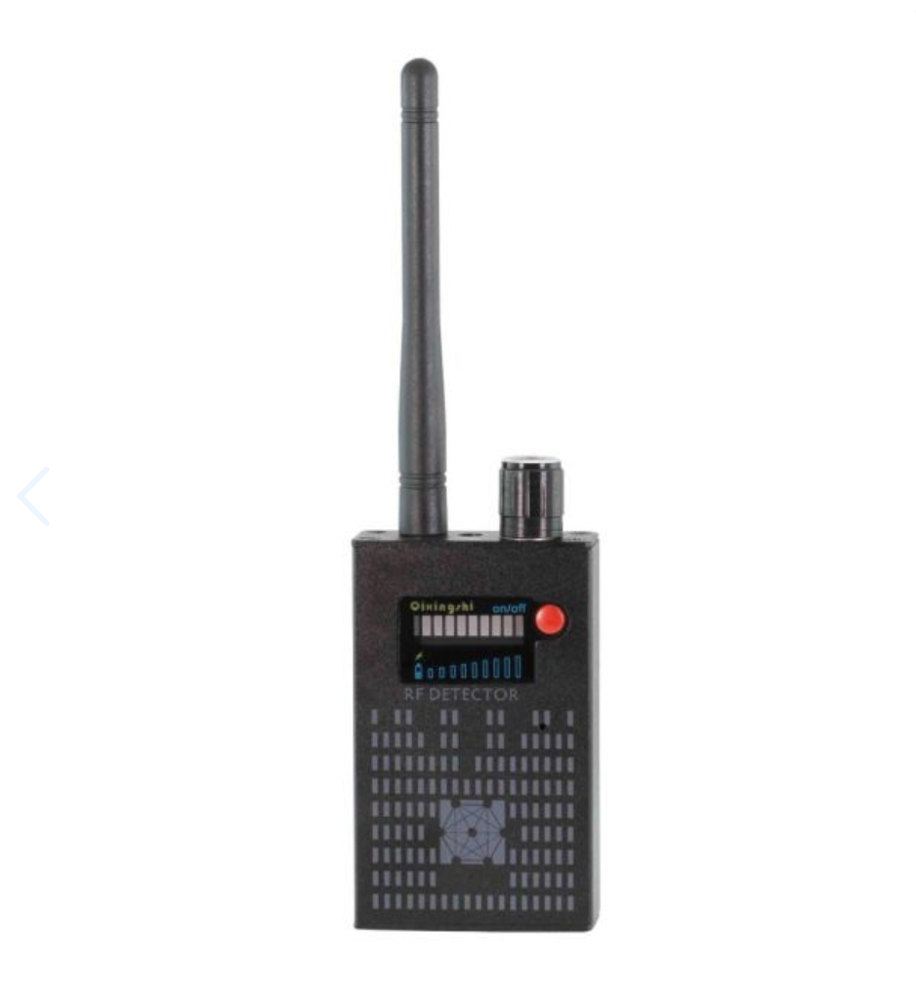

### Шаг 2: обзаведитесь детектором линз камеры

Детекторы радиосигнала способны обнаруживать беспроводные устройства, передающие информацию. А что насчёт независимых устройств, сохраняющих информацию на флэш-карту? Для их обнаружения вам пригодится детектор линз.

Он засекает отражение света от линз записывающей видео камеры. При его использовании на экране прибора линзы подсвечиваются или выдают блики, и так пользователь узнаёт об их присутствии в комнате.

Можно поискать универсальные устройства, способные одновременно распознавать радиосигналы и линзы камер – например, хорошим выбором будет [Lawmate Defender DD802](https://www.senteltechsecurity.com/lawmate-dd802-defender.html). Это устройство профессионального уровня, эффективно обнаруживающее камеры и радиосигналы.

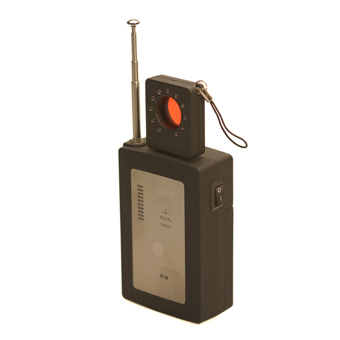

### Шаг 3: отключите все устройства, испускающие радиосигналы

Перед началом осмотра комнаты важно отключить все устройства, которые в принципе могут испускать радиосигналы. Отключите все телефоны, Bluetooth-устройства, ноутбуки, планшеты, и т.п.

Также будет хорошей идеей проверить ваш детектор, включив его и проведя им рядом с телефоном. Если он способен распознать частоты сигналов, излучаемые телефоном, значит, он работает правильно.

### Шаг 4: проведите проверку при помощи техники «окраски» стен

Выберите границу одного из квадрантов и начните «красить» стены. Это значит, что нужно просто водить детектором вверх и вниз по стене, медленно и методично, осматривая их при этом визуально. Вы должны осматривать стены на предмет любых повреждений или аномалий, прислушиваясь при этом к работе датчика.

Окрашивайте стены, пока не дойдёте до конца квадранта. Ничего не обнаружив, отметьте квадрант как свободный от устройств, и переходите к следующему.

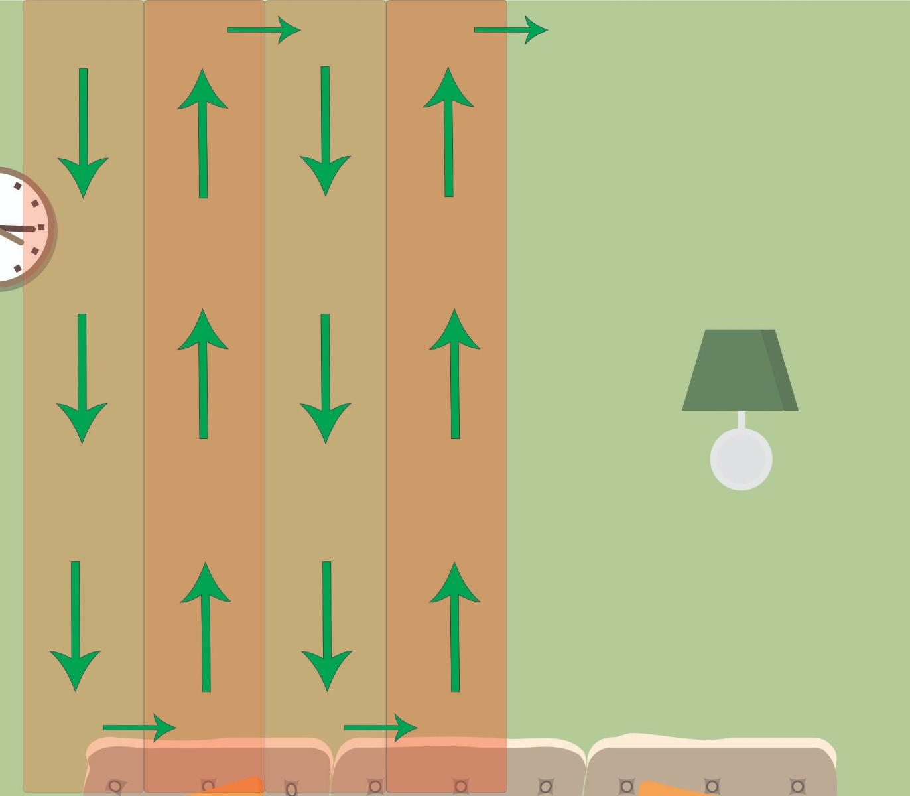

### Шаг 5: «покрасьте» стены детектором линз камеры

Повторите процесс в каждом квадранте по той же схеме покраски, используя детектор линз камеры.

### Шаг 6: выключите свет

Выключите свет и поищите необычные точечные источники света. У многих шпионских камер есть светодиод, сообщающий о начале записи или наличии питания. Если наблюдатель не озаботился отключением индикатора, вы можете использовать их ошибку в свою пользу, увидев и найдя такую камеру.

### Шаг 7: используйте телефон

Для записи видео в ночное время большинству шпионских камер нужна будет инфракрасная подсветка, освещающая сцену так, чтобы запись можно было вести и в полной темноте.

Инфракрасное излучение идеально для использования при скрытом наблюдении, потому что глаз человека его не распознаёт. Видимые волны находятся в диапазоне от 390 до 700 нм, а инфракрасные – от 700 до 1000000 нм.

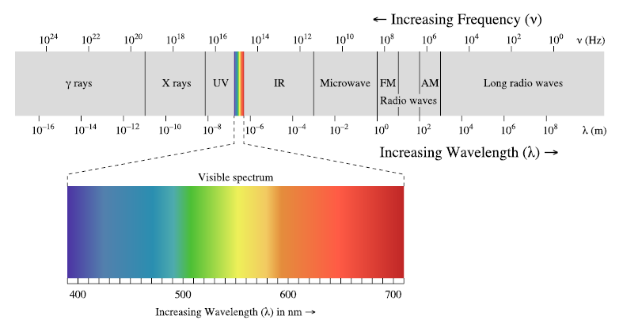

Один из быстрых и эффективных способов заметить инфракрасное излучение – использовать фронтальную камеру телефона. В отличие от основной камеры, у неё нет инфракрасного фильтра, и она легко распознаёт инфракрасный свет в темноте.

Возьмите любой пульт дистанционного управления, отправляющий инфракрасные сигналы управляемому устройству, и запустите фотографирование с фронтальной камеры телефона. Направьте пульт ДУ в камеру и нажмите любую кнопку. Невидимый глазом инфракрасный свет будет виден на экране. При осмотре помещения помните, что инфракрасный свет легко спрятать от ничего не подозревающей жертвы наблюдения.

## Что насчёт тепловизоров?

Ещё одно устройство, помогающее в обнаружении следящего оборудования, о котором необходимо знать – это тепловизор. Любое следящее устройство, записывает ли оно видео, аудио, или испускает инфракрасные лучи, будет испускать и некое тепловое излучение, которое легко обнаружить при помощи тепловизора.

Большинство камер наблюдения достаточно сильно греются из-за небольшого размера и потому, что они обычно упрятаны внутрь какого-либо предмета, не вызывающего подозрений, и не обеспечивающего хорошей вентиляции.

Можно использовать, к примеру, такое устройство, как [FLIR ONE Gen 3](https://www.flir.com/products/flir-one-gen-3/) – оно подсоединяется к смартфону и позволяет использовать его в качестве тепловизора.

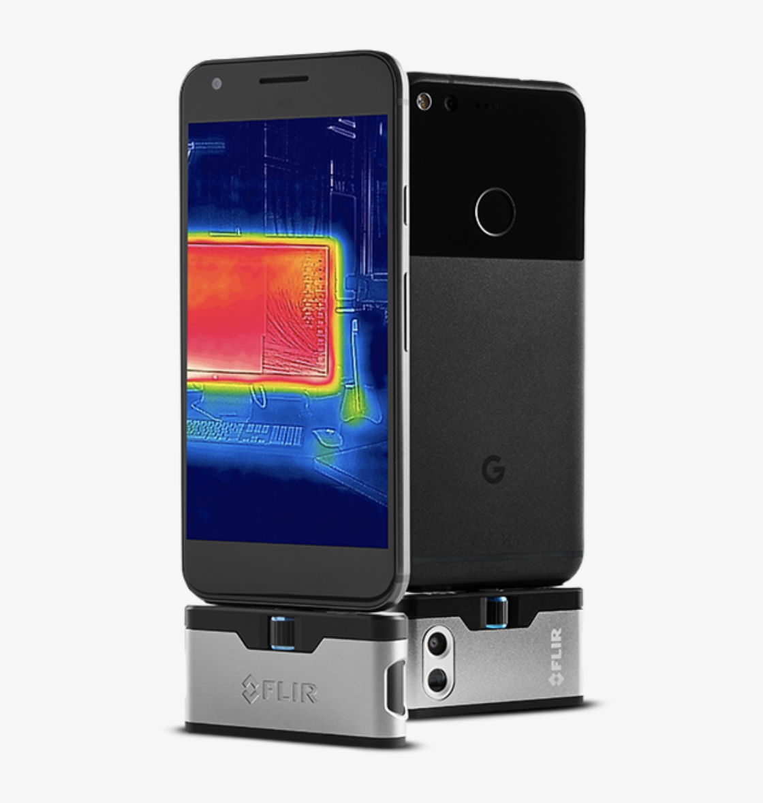

Такой тепловизор позволит вам найти горячие точки в комнате при помощи телефона. Найдя такую точку в стене, за картиной, в детекторе дыма, за любым другим устройством или в другом месте, кажущемся необычным или подозрительным, вы можете исследовать эту аномалию. Будет разумно тщательно осмотреть это место на предмет следящих устройств.

## Что делать при обнаружении следящего устройства

Если вы обнаружили устройство для слежки, не трогайте его. Выйдите из его поля зрения и позвоните в полицию.

Большинство современных камер слежения используют детектор движения и кольцевую запись на флэш-карту. Во многих случаях из-за этого злоумышленник случайно записывал сам себя, в тот момент, когда устанавливал камеру и потом уходил с места наблюдения.

Выйдя из поля зрения камеры, вы уменьшаете шансы того, что новое видео запишется поверх старого при заполнении флэш-карты. Если злоумышленник записал своё изображение на камеру, лучше минимизировать шансы того, что эта запись будет перезаписана новой.