Понимание сверточных нейронных сетей через визуализации в PyTorch

В нашу эру, машины успешно достигли 99% точности в понимании и определении признаков и объектов на изображениях. Мы сталкиваемся с этим повседневно, например: распознавание лиц в камере смартфонов, возможность поиска фотографий в google, сканирование текста со штрих-кода или книг с хорошей скоростью и т. д. Такая эффективность машин стала возможным благодаря особому типу нейронной сети, называемой сверточной нейронной сетью. Если вы энтузиаст глубокого обучения, вы, вероятно, слышали об этом, и вы могли разработать несколько классификаторов изображений. Современные фреймворки глубокого обучения, такие как Tensorflow и PyTorch, упрощают обучение машин изображениям. Однако все еще остается вопрос: как данные проходят через слои нейронной сети и как компьютер обучается на них? Чтобы получить четкое представление с нуля, мы погрузимся в свертку, визуализируя изображение каждого слой.

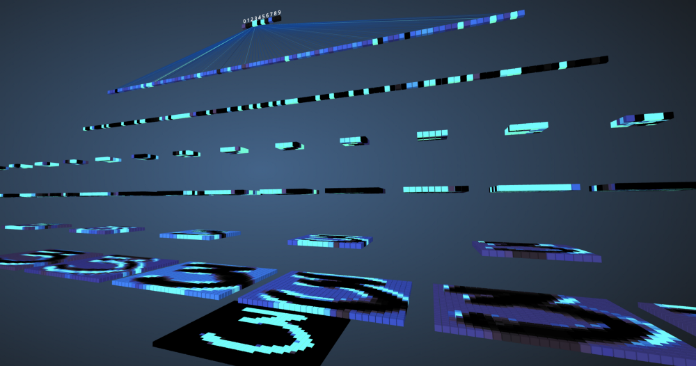  

## Сверточные нейронные сети

Прежде чем приступить к изучению сверточных нейронных сетях (СНС), нужно научиться работать с нейронными сетями. Нейронные сети имитируют человеческий мозг для решения сложных проблем и поиска закономерностей в данных. За последние несколько лет они заменили многие алгоритмы машинного обучения и компьютерного зрения. Базовая модель нейронной сети состоит из нейронов, организованных в слоях. Каждая нейронная сеть имеет входной и выходной слой и несколько скрытых слоев, добавленными к ней в зависимости от сложности проблемы. При передаче данных через слои, нейроны обучаются и распознают признаки. Это представление нейронной сети называется моделью. После того, как модель обучена, мы просим сеть сделать прогнозы на основе тестовых данных.

СНС представляет собой особый тип нейронной сети, который работает хорошо с изображениями. Ян Лекун предложил их в 1998 году, где они распознавали число, присутствующее во входном изображении. Также СНС применяются для распознавания речи, сегментации изображения и обработки текста. До создания сверточных нейронных сетей многослойные персептроны использовались при построении классификаторов изображений. Классификация изображений относится к задаче извлечения классов из многоканального (цветного, черно-белого) растрового изображения. Многослойные персептроны занимают много времени для поиска информации в изображениях, поскольку каждый вход должен быть связан с каждым нейроном в следующем слое. СНС обошли их, используя концепцию, называемую локальной связностью. Это означает, что мы подключим каждый нейрон только к локальной области входов. Это минимизирует количество параметров, позволяя различным частям сети специализироваться на высокоуровневых признаках, таких как текстура или повторяющийся узор. Запутались? Давайте сравним, как изображения передаются через многослойные персептроны (МП) и сверточные нейронные сети.

## Сравнение МП и СНС

Общее количество записей во входном слое для многослойного персептрона будет 784, поскольку входное изображение имеет размер 28x28 = 784 (рассматривается набор данных MNIST). Сеть должна быть способна предсказать число на входном изображении, что означает, что выходные данные могут принадлежать любому из следующих классов в диапазоне от 0 до 9. В выходном слое мы возвращаем оценки класса, скажем, если данный вход является изображением с номером «3», то в выходном слое соответствующий нейрон «3» имеет более высокий значение по сравнению с другими нейронами. Снова возникает вопрос: «Сколько скрытых слоев нам нужно и сколько нейронов должно быть в каждом?» Для примера возьмем следующий код МП:

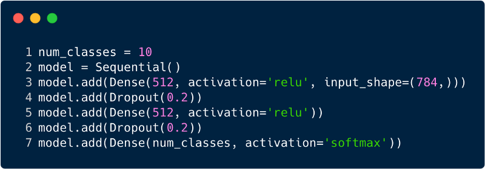

Приведенный код реализован с использованием фреймворка под названием Keras. В первом скрытом слое 512 нейронов, которые связаны с входным слоем из 784 нейронов. Следующий скрытый слой: исключающий слой, который решает проблему переобучения. 0.2 означает, что есть 20% вероятность не учитывать нейроны предыдущего скрытого слоя. Мы снова добавили второй скрытый слой с тем же количеством нейронов, что и в первом скрытом слое (512), а затем еще один исключающий слой. Наконец, заканчивая этот набор слоев выходным слоем, состоящим из 10 классов. Класс, который имеет наибольшее значение, будет числом, предсказанным моделью. Так выглядит многослойная сеть после определения всех слоев. Одним из недостатков многоуровневого персептрона является то, что он полносвязный, что занимает много времени и места.

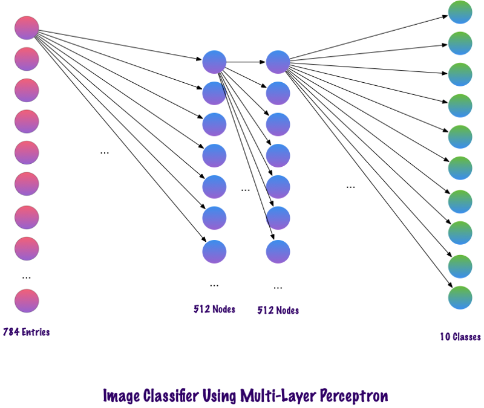

Свертки не используют полностью связанные слои. Они используют разреженные слои, которые принимают матрицы в качестве входных данных, что дает преимущество над МП. В МП каждый узел отвечает за понимание всей картины. В СНС мы разбиваем изображение на области (небольшие локальные области пикселей). Выходной слой объединяет полученные данные от каждого скрытого узла, чтобы найти закономерности. Ниже приведено изображение того, как слои связаны.

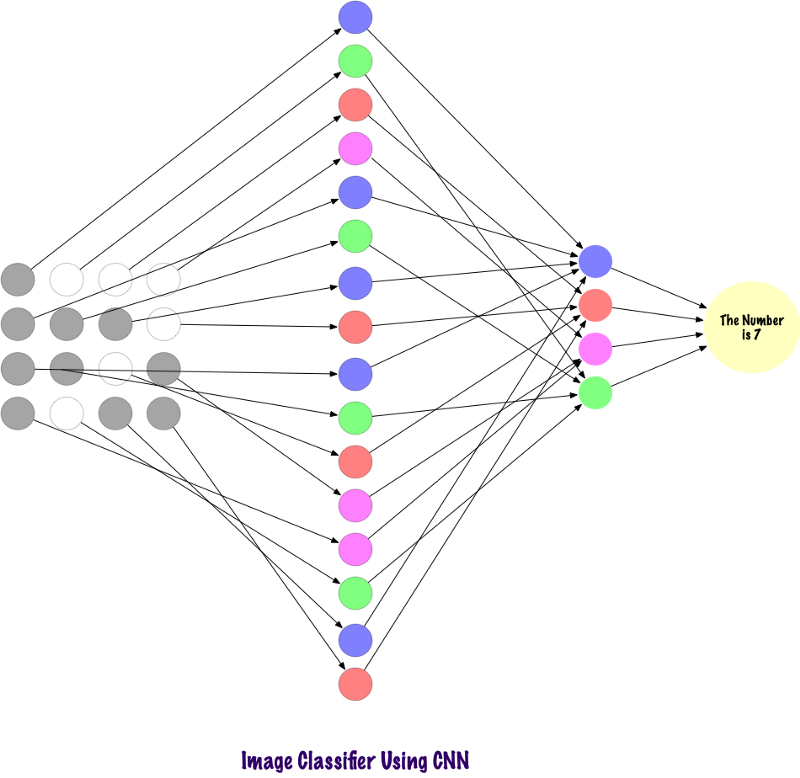

Теперь давайте посмотрим, как СНС находят информацию на фотографиях. Перед этим нам нужно понять, как извлекаются признаки. В СНС мы используем разные слои, каждый слой сохраняет признаки изображения, например, учитывает изображение собаки, когда сети необходимо классифицировать собаку, она должна идентифицировать все признаки, такие как глаза, уши, язык, ноги и т.п. Эти признаки разбиты и распознаются на локальных уровнях сети с использованием фильтров и ядер.

## Как компьютеры смотрят на изображение?

Человек, смотрящий на изображение и понимающий его значение, звучит очень разумно. Скажем, вы гуляете, и замечаете множество пейзажей вокруг вас. Как мы понимаем природу в этом случае? Мы делаем снимки окружающей среды, используя наш основной орган чувств — глаз, а затем отправляем его на сетчатку. Это все выглядит довольно интересно, правда? Теперь давайте представим, что компьютер делает то же самое. В компьютерах изображения интерпретируются с использованием набора значений пикселей, которые лежат в диапазоне от 0 до 255. Компьютер смотрит на эти значения пикселей и понимает их. На первый взгляд, он не знает объектов и цветов. Он просто распознает значения пикселей, а изображение эквивалентно набору значений пикселей для компьютера. Позже, анализируя значения пикселей, он постепенно узнает, является ли изображение серым или цветным. Изображения в градациях серого имеют только один канал, поскольку каждый пиксель представляет интенсивность одного цвета. 0 означает черный, а 255 означает белый, остальные варианты черного и белого, то есть серый, находятся между ними.

Цветные изображения имеют три канала, красный, зеленый и синий. Они представляют интенсивность 3 цветов (трехмерная матрица), и когда значения одновременно изменяются, это дает большой набор цветов, действительно цветовую палитру! После чего компьютер распознает кривые и контуры объектов на изображении. Все это можно изучить в сверточной нейронной сети. Для этом мы будем использовать PyTorch для загрузки набора данных и применения фильтров к изображениям. Ниже приведен фрагмент кода.

    
    import torch
    import numpy as np
    
    from torchvision import datasets
    import torchvision.transforms as transforms
    
    
    num_workers = 0
    batch_size = 20
    
    
    transform = transforms.ToTensor()
    
    train_data = datasets.MNIST(root='data', train=True,
                                       download=True, transform=transform)
    test_data = datasets.MNIST(root='data', train=False,
                                      download=True, transform=transform)
    
    
    train_loader = torch.utils.data.DataLoader(train_data, batch_size=batch_size,
        num_workers=num_workers)
    test_loader = torch.utils.data.DataLoader(test_data, batch_size=batch_size, 
        num_workers=num_workers)
    
    import matplotlib.pyplot as plt
    %matplotlib inline
        
    dataiter = iter(train_loader)
    images, labels = dataiter.next()
    images = images.numpy()
    
    
    fig = plt.figure(figsize=(25, 4))
    for image in np.arange(20):
        ax = fig.add_subplot(2, 20/2, image+1, xticks=[], yticks=[])
        ax.imshow(np.squeeze(images[image]), cmap='gray')
        ax.set_title(str(labels[image].item()))
    

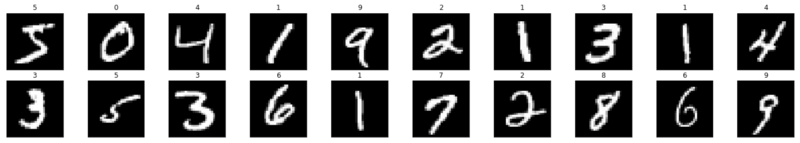

Теперь давайте посмотрим, как одиночное изображение подается в нейронную сеть.

    img = np.squeeze(images[7])
    
    fig = plt.figure(figsize = (12,12)) 
    ax = fig.add_subplot(111)
    ax.imshow(img, cmap='gray')
    width, height = img.shape
    thresh = img.max()/2.5
    for x in range(width):
        for y in range(height):
            val = round(img[x][y],2) if img[x][y] !=0 else 0
            ax.annotate(str(val), xy=(y,x),
                color='white' if img[x][y]<thresh else 'black')
    

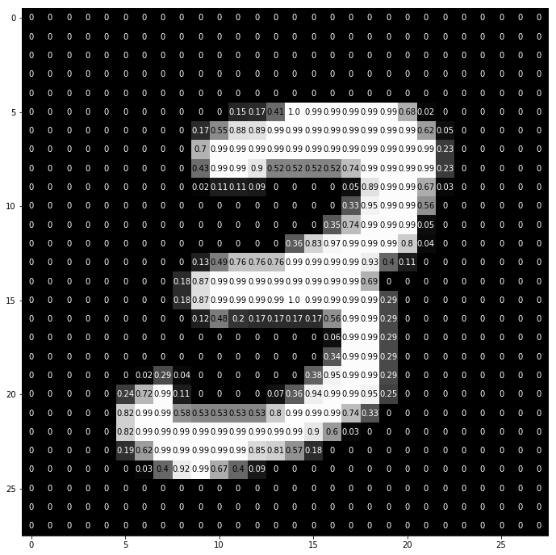

Вот как число «3» разбивается на пиксели. Из набора рукописных цифр случайным образом выбирается «3», в котором отображаются значения пикселей. Здесь ToTensor () нормализует фактические значения пикселей (0–255) и ограничивает их диапазоном от 0 до 1. Почему это так? Потому что это облегчает вычисления в последующих разделах, либо для интерпретации изображений, либо для поиска общих шаблонов, существующих в них.

## Создание своего собственного фильтра

Фильтры, как следует из названия, фильтруют информацию. В случае сверточных нейронных сетей, при работе с изображениями, информация о пикселях фильтруется. Почему мы должны фильтровать вообще? Помните, что компьютер должен пройти процесс обучения для понимания изображений, очень похожий на то, как это делает ребенок. В этом случае, тем не менее, нам не потребуется много лет! Короче говоря, он учится с нуля, а затем продвигается к целому.

Следовательно, сеть должна изначально знать все грубые части изображения, а именно края, контуры и другие низкоуровневые элементы. После того как они обнаружены, прокладывается путь для сложных признаков. Чтобы добраться до них, мы должны сначала извлечь низкоуровневые признаки, затем средние, а затем высокоуровневые. Фильтры представляют способ извлечения информации, которая нужна пользователю, а не просто слепую передачу данных, из-за которой компьютер не понимает структурирование изображений. В начале, низкоуровневые функции могут быть извлечены с учетом конкретного фильтра. Фильтр здесь также представляет собой набор значений пикселей, аналогично изображению. Его можно понимать как веса, которые соединяют слои в сверточной нейронной сети. Эти веса или фильтры умножаются на входные значения для получения промежуточных изображений, которые представляют понимание изображения компьютером. Затем они умножаются еще на несколько фильтров, чтобы расширить обзор. Затем он обнаруживает видимые органы человека (при условии, что на изображении присутствует человек). Позже, с включением еще нескольких фильтров и нескольких слоев, компьютер восклицает: «О, да! Это человек."

Если говорить о фильтрах, то у нас есть много вариантов. Возможно, вам захочется размыть изображение, тогда применим фильтр размытия, если нужно добавить резкости, тогда на помощь придет фильтр резкости и т. д.

Давайте посмотрим на несколько фрагментов кода, чтобы понять функциональные возможности фильтров.

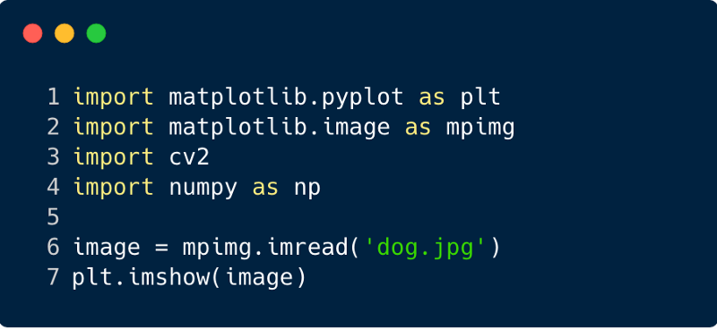

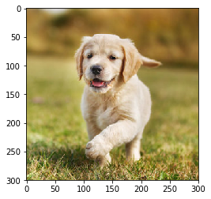

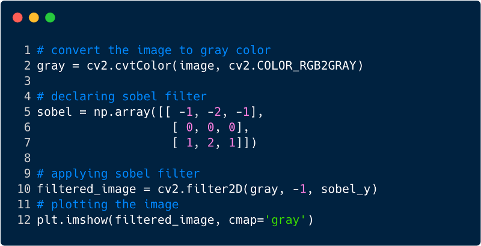

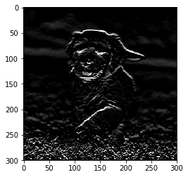

Вот так выглядит изображение после применения фильтра, в данном случае мы использовали фильтр Собеля.

## Сверточные нейронные сети

До сих пор мы видели, как фильтры используются для извлечения признаков из изображений. Теперь, чтобы завершить всю сверточную нейронную сеть, нам нужно знать обо всех слоях, которые мы используем для ее проектирования. Слои, используемые в СНС,

1.  Сверточный слой
2.  Слой пулинга
3.  Полностью связанный слой

Со всеми тремя слоями сверточный классификатор изображений выглядит так:

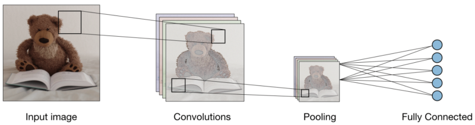

Теперь давайте посмотрим, что делает каждый слой.

**Сверточный слой (CONV)** использует фильтры, которые выполняют операции свертки, сканируя входное изображение. Его гиперпараметры включают в себя размер фильтра, который может быть 2x2, 3x3, 4x4, 5x5 (но не ограничиваясь этим) и шаг S. Полученный результат O называется картой признаков или картой активации, в которой все признаки рассчитаны с использованием входных слоев и фильтров. Ниже приведено изображение генерации карт признаков при применении свертки,

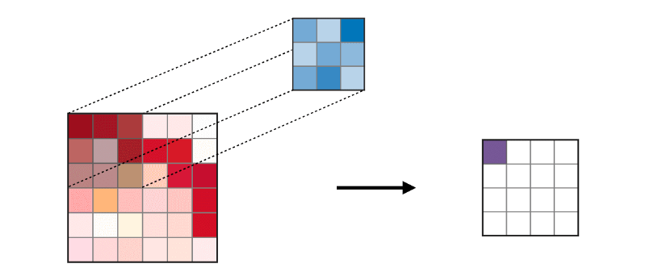

**Слой объединения (POOL)** используется для уплотнения признаков, обычно применяемых после слоя свертки. Существует два типа операций объединения — это максимальное и среднее объединение, где берется максимальное и среднее значение признаков, соответственно. Ниже изображена работа операций объединения,

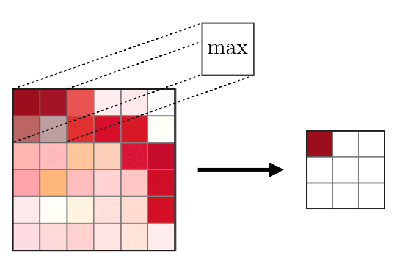

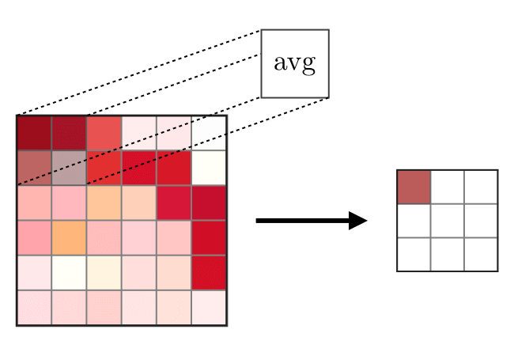

**Полносвязные слои (FC)** работает с плоским входом, где каждый вход связан со всеми нейронами. Обычно они используются в конце сети для подключения скрытых слоев к выходному слою, что помогает оптимизировать оценки классов.

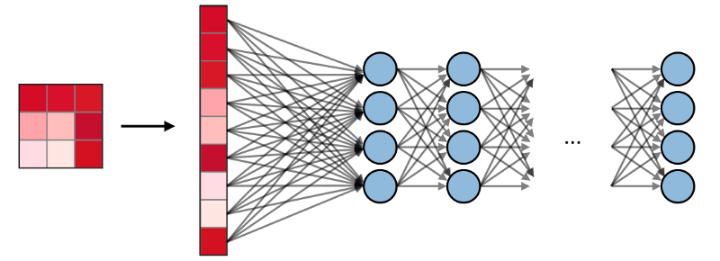

### Визуализация СНС в PyTorch

Теперь, когда у нас есть полная идеология построения СНС, давайте реализуем СНС с помощью фреймворка PyTorch от Facebook.

**Шаг 1**: Загрузка входного изображения, которое должно быть отправлено через сеть. (Здесь мы делаем это с помощью Numpy и OpenCV),

    import cv2
    import matplotlib.pyplot as plt
    %matplotlib inline
    
    img_path = 'dog.jpg'
    
    bgr_img = cv2.imread(img_path)
    gray_img = cv2.cvtColor(bgr_img, cv2.COLOR_BGR2GRAY)
    
    
    gray_img = gray_img.astype("float32")/255
    
    plt.imshow(gray_img, cmap='gray')
    plt.show()
    

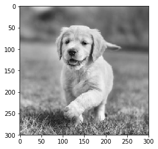

**Шаг 2**: Визуализация фильтров

Давайте визуализируем фильтры, чтобы лучше понять, какие из них мы будем использовать,

    import numpy as np
    
    filter_vals = np.array([
      [-1, -1, 1, 1],
      [-1, -1, 1, 1],
      [-1, -1, 1, 1],
      [-1, -1, 1, 1]
    ])
    
    print('Filter shape: ', filter_vals.shape)
    
    
    filter_1 = filter_vals
    filter_2 = -filter_1
    filter_3 = filter_1.T
    filter_4 = -filter_3
    filters = np.array([filter_1, filter_2, filter_3, filter_4])
    
    
    fig = plt.figure(figsize=(10, 5))
    for i in range(4):
        ax = fig.add_subplot(1, 4, i+1, xticks=[], yticks=[])
        ax.imshow(filters[i], cmap='gray')
        ax.set_title('Filter %s' % str(i+1))
        width, height = filters[i].shape
        for x in range(width):
            for y in range(height):
                ax.annotate(str(filters[i][x][y]), xy=(y,x),
                            color='white' if filters[i][x][y]<0 else 'black')
    

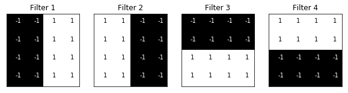

**Шаг 3**: Определение СНС

Этот СНС имеет сверточный слой и слой пулинга с функцией максимума, и веса инициализируются с использованием фильтров, изображенных выше,

    import torch
    import torch.nn as nn
    import torch.nn.functional as F
    
    class Net(nn.Module):
        
        def __init__(self, weight):
            super(Net, self).__init__()
            
            k_height, k_width = weight.shape[2:]
            
            self.conv = nn.Conv2d(1, 4, kernel_size=(k_height, k_width), bias=False)
            
            self.conv.weight = torch.nn.Parameter(weight)
            
            self.pool = nn.MaxPool2d(2, 2)
    
        def forward(self, x):
            
            
            conv_x = self.conv(x)
            activated_x = F.relu(conv_x)
            
            
            pooled_x = self.pool(activated_x)
            
            
            return conv_x, activated_x, pooled_x
        
    
    weight = torch.from_numpy(filters).unsqueeze(1).type(torch.FloatTensor)
    model = Net(weight)
    
    
    print(model)
    

  

>     Net(
>     (conv): Conv2d(1, 4, kernel_size=(4, 4), stride=(1, 1), bias=False)
>     (pool): MaxPool2d(kernel_size=2, stride=2, padding=0, dilation=1, ceil_mode=False)
>     )

**Шаг 4**: Визуализация фильтров  
Быстрый взгляд на используемые фильтры,

    def viz_layer(layer, n_filters= 4):
        fig = plt.figure(figsize=(20, 20))
        
        for i in range(n_filters):
            ax = fig.add_subplot(1, n_filters, i+1)
            ax.imshow(np.squeeze(layer[0,i].data.numpy()), cmap='gray')
            ax.set_title('Output %s' % str(i+1))
    
    fig = plt.figure(figsize=(12, 6))
    fig.subplots_adjust(left=0, right=1.5, bottom=0.8, top=1, hspace=0.05, wspace=0.05)
    for i in range(4):
        ax = fig.add_subplot(1, 4, i+1, xticks=[], yticks=[])
        ax.imshow(filters[i], cmap='gray')
        ax.set_title('Filter %s' % str(i+1))
    
        
    gray_img_tensor = torch.from_numpy(gray_img).unsqueeze(0).unsqueeze(1)
    

Фильтры:

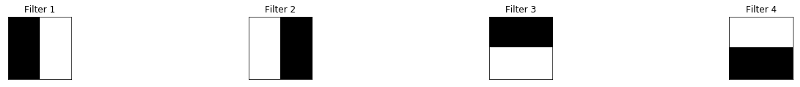

**Шаг 5**: Отфильтрованные результаты по слоям

Изображения, которые выводятся в слой CONV и POOL, показаны ниже,

    viz_layer(activated_layer)
    viz_layer(pooled_layer)
    

Сверточные слои

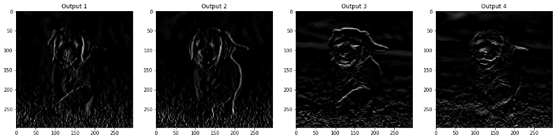

Слои пулинга

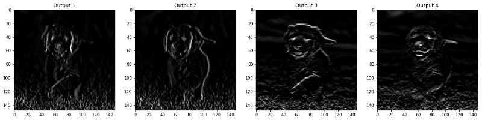  
[Источник](https://towardsdatascience.com/understanding-convolutional-neural-networks-through-visualizations-in-pytorch-b5444de08b91)