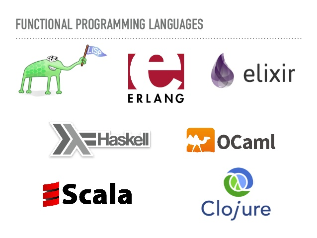

Почему вы должны думать о функциональном программировании

Привет, Хабр! Представляю вашему вниманию перевод своей статьи [«Why you should think about functional programming»](https://medium.com/@taluyev/why-you-should-think-about-functional-programming-94fdf30936fb), посвященной функциональному программированию.

Почему вы должны думать о функциональном программировании? Давайте ответим на следующие вопросы:

*   всегда ли ваши проекты выполняются в определенные сроки?
*   Были ли у пользователей какие-либо жалобы?
*   Поддержка проекта никогда не занимала много времени?
*   Новый функционал всегда удачно вписывается в существующую архитектуру?

Если ответы на все вышеупомянутые вопросы положительные, вам не нужно ничего менять, ваша команда — редкий пример гармоничного персонала, методологии и инструментов. В противном случае вы должны быть открыты для новых подходов к решению ваших проблем, включая критический взгляд на используемые технические средства и языки программирования.  

## Первый взгляд

Как вы знаете, программисты — чрезвычайно креативные люди, но в то же время они склонны следовать некоторым тенденциям при выборе языка программирования. Среди огромного количества языков функциональные языки все больше приобретают фанатов и ими все больше уверенно пользуются компании по всему миру. Использование функциональных языков может значительно повысить производительность и качество работы программистов. Естественно, это зависит от сочетания задач, языка и навыков программирования. В этом случае программист просто описывает, что он хочет, вместо перечисления последовательности действий, необходимых для получения результата. Таким образом, разработчик сосредотачивается на высоко-уровневом «что требуется» вместо того, чтобы застрять на низкоуровневом «как это сделать».

Функциональное программирование — это стиль написания программ посредством компиляции набора функций. Его основной принцип заключается в том, чтобы обернуть почти все в функцию, написать множество небольших многократно используемых функций, а затем просто вызывать их одну за другой. Кроме того, структура этих функций должна соответствовать определенным правилам и решать некоторые проблемы.

Итак, если любая задача может быть решена путем объединения вызовов нескольких функций, то:

1.  Как реализовать условия if-else?
2.  Как решить трюки с Null Exception?
3.  Как убедиться, что функция действительно «многоразовая» и может использоваться где угодно?
4.  Как сделать так, чтобы данные, передаваемые нашим функциям, были изменены и могли использоваться в других местах?
5.  Если функция принимает несколько значений, но при объединении в цепочку вы можете передать только одну функцию, то как нам сделать эту функцию частью цепочки?

Чтобы решить все эти проблемы, функциональные языки предоставляют инструменты и решения из математики, такие как монады, функторы и так далее.

Преимущества функционального программирования уже давно признаны широкой публикой. Успешная разработка программного обеспечения часто сводится к максимальному упрощению существующих механизмов, которые позволяют новым приложениям адаптироваться к требованиям современных пользователей. И в то же время мы должны спешить, успев в короткие сроки представить продукты клиентам с неограниченными возможностями. Изменяющимся требованиям намного легче следовать, когда разработанные приложения можно разделить на несколько простых функций, которые нетрудно проверить. В таких алгоритмах нет хитрых побочных эффектов и абстрактных формулировок, предназначенных для результатов в глобальном масштабе.

Так почему же эксперты так долго упускают из виду функциональное программирование? И почему это становится таким распространенным сегодня?

## Где функциональное программирование используется в реальном мире?

Поскольку функциональное программирование — это прежде всего подход к написанию кода, вы можете использовать его принципы на любом языке. Однако есть языки, специально отточенные функциональным подходом. Более современные функциональные языки, такие как Elm и Elixir, согласно GitHub и Stack Overflow, постепенно и уверенно набирают популярность. Растущая популярность JavaScript также привела к повышению интереса к концепциям функционального программирования для использования на этом языке. Кроме того, опытные разработчики в области функционального программирования впоследствии начали работать над средами Single Web Application — SPA, и в результате у нас есть Redux, React, MobX и другие библиотеки, используемые миллионами людей.

Примеры из реальной жизни:

*   Apache Spark
*   Scalding (от Twitter)
*   Apache Kafka
*   Finagle (от Twitter)
*   Akka
*   Autocad
*   emacs (LISP)

Так что же такое функциональное программирование, откуда взялся такой бум и почему его стоит рассмотреть? Давайте разберемся.

## О функциональном программировании

Несколько лет назад лишь несколько экспертов имели представление о функциональном программировании, но в течение последних трех лет почти каждая кодовая база больших приложений активно использовала идеи, взятые из мира функционального программирования. И для этого есть объективные причины:

*   функциональное программирование позволяет писать более лаконичный и предсказуемый код
*   это легче проверить (хотя учиться с нуля нелегко)

  

## Ключевые особенности разработки программного обеспечения с использованием функционального программирования

  

*   Чистая функция очень проста. Он всегда должен возвращать один и тот же результат. При одинаковых значениях Х и Y мы всегда получим один и тот же результат функции. Предсказуемость играет важную роль во время работы программы в функциональном программировании.
*   Избегать общего состояния, изменчивых данных и побочных эффектов;  
    Неизменяемый объект — это объект, состояние которого нельзя изменить после его создания. Неизменяемые объекты более потоко-ориентированы, чем изменяемые объекты. Если функция не работает предсказуемо — это приведет к нежелательным побочным эффектам. В императивных языках функция в процессе реализации может считывать и изменять значения глобальных переменных и выполнять ввод / вывод. Поэтому, если мы вызываем одну и ту же функцию дважды с одним и тем же аргументом, может случиться так, что мы получим два разных результата. Такая функция называется побочным эффектом.
    
    Функциональное программирование помогает нам писать потоко-ориентированный код.
    
*   Распространенность декларативного, а не императивного подхода.

  

## Композиция функций

Композиция функций — это подход функционального программирования, который включает в себя вызов одних функций в качестве аргументов других для создания сложной композиции из более простых функций. Этот метод компоновки позволяет вам взять две или более простых функций и объединить их в одну более сложную функцию, которая выполняет под-функции в логическом порядке с любыми данными. Чтобы получить этот результат, вы помещаете одну функцию внутрь другой и выполняете операции с внешними функциями над результатом внутренней функции, пока не получите результат. И результат может быть разным, в зависимости от порядка, в котором применяются функции.

В результате, с другим логическим порядком вызова чистых функций и тем же значением аргумента, мы получим более сложную функциональность, которая дает нам желаемый результат и делает его предсказуемым.

## Преимущества функционального программирования

Функциональное программирование помогает сделать код более понятным, предсказуемым и легким для чтения. Использование принципов функционального программирования помогает избавиться от ненужных абстракций с непредсказуемым поведением, поэтому сделать программу более предсказуемой и уменьшить количество возможных ошибок.

В функциональных языках функции могут быть переданы другим функциям в качестве аргумента или возвращены в результате. Функции, которые принимают функциональные аргументы, называются функциями или функционалами высшего порядка. Самым популярным функционалом является карта. карта, которая применяет некоторую функцию ко всем элементам списка, формируя другой список из результатов.

В чисто функциональном программировании оператор присваивания отсутствует, объекты не могут быть изменены и уничтожены, новые можно создавать только путем декодирования и синтеза существующих. Встроенный в язык сборщик мусора позаботится о ненужных объектах. Благодаря этому на чистом функциональном языке все функции свободны от побочных эффектов. Однако это не мешает этому языку имитировать некоторые полезные императивные свойства, такие как исключения и изменяемые массивы. Конечно, для этого есть специальные приемы.

## Недостатки функционального программирования

  

*   Одна из проблем функционального программирования заключается в том, что оно отличается от того, что вы уже знаете. Вы должны заново выучить многое из того, что вы уже знаете в императивной обстановке! Многие опытные разработчики, которым уже знакомо то, что они уже знают, не собираются решать проблемы по-другому. Требуется время и усилия, чтобы думать по-другому.
*   Легко написать чистые функции, но объединить их в законченное приложение — вот где все становится сложнее.
*   Большая проблема с предсказуемой производительностью. Использование только неизменяемых значений и рекурсии может потенциально привести к проблемам с производительностью, включая использование ОЗУ и скорость, поэтому большинство функциональных языков не являются особенно хорошим выбором для мягких или жестких систем реального времени или встроенных вычислений.
*   Функциональное программирование имеет тенденцию писать код в слишком абстрактной форме, когда сам программист больше не понимает, что он написал через некоторое время.
*   Чистые функции и ввод / вывод на самом деле не смешиваются.

  

## Заключение

Если вам и вашей команде разработчиков кажется, что ваш стиль кодирования не дает вам необходимого уровня управления сложностью бизнес-области, засоряя ваш код ненужным синтаксическим мусором, что приводит к потере времени, попробуйте функциональное программирование. Таким образом, в областях, связанных с большим количеством вычислений или преобразований данных, параллельным / асинхронным программированием, вы можете получить значительные преимущества, погрузившись в функциональное программирование.

Написание кода на функциональном языке дает вам возможность взглянуть на проблему с другой стороны, где разработка вашего решения может быть более эффективной. И это просто увеличит количество способов выразить ваши идеи.

Разрабатывая свое решение с использованием парадигмы функционального программирования, вы будете все быстрее и быстрее ускорять весь процесс разработки, становясь все более опытным. Похоже, вы ведете свой автомобиль на повышенной передаче, в сравнении с тем, как движутся программисты-императивщики.

Функциональное программирование может изменить ваш стиль написания кода в лучшую сторону. Но освоить его довольно сложно и отнимает много времени, и многие посты и учебные пособия не учитывают детали (например, монады, аппликативные функторы и т. д.) и не дают практических примеров, которые помогли бы начинающим использовать мощные методы функционального программирования каждый день. Но вы можете привлечь в команду уже опытных программистов, что сэкономит ваше время, усилия и деньги.

Если вы все сделаете правильно, результат будет более понятный, лаконичный и вы будете иметь читабельный код. Разве это не то, что мы все хотим?

Роман Талуев,  
разработчик программного обеспечения в Quasarbyte