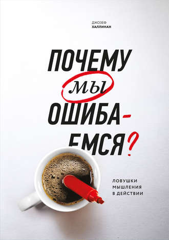

Книга «Почему мы ошибаемся. Ловушки мышления в действии». Выдержки часть 2

  
[Книга «Почему мы ошибаемся. Ловушки мышления в действии». Выдержки часть 1.](https://habr.com/ru/post/424603/)

**Восприятие и фрейминг**  
Несколько лет назад исследователи в Великобритании хотели выяснить влияет, ли музыка на выбор вина в магазине, для этого на верхней полке установили магнитофон, а ниже на стеллаже несколько бутылок французского и немецкого вина. А после проигрывали, то немецкую, то французскую музыку. Ну и конечно, как вы понимаете музыка влияла, в день, когда играла французская, французское вино брали около 40 бутылок а когда играла немецкая около 12.

В опросе на выходе из магазина только 14% отметили, что музыка повлияла на их выбор.  
  
Не думаю, что это было не прогнозируемо и так, сейчас уже про запахи говорят нужные, а уж музыку ставить все умеют. Хотя у нас её еще так не используют.

> [Эффект фрейминга](https://ru.wikipedia.org/wiki/%D0%AD%D1%84%D1%84%D0%B5%D0%BA%D1%82_%D1%84%D1%80%D0%B5%D0%B9%D0%BC%D0%B8%D0%BD%D0%B3%D0%B0) (framing effect, от англ. frame рамка, обрамление) — когнитивное искажение, при котором форма подачи информации влияет на ее восприятие человеком. Так, одно и то же утверждение, в зависимости от формулировки и смысловых акцентов, может быть представлено как в негативном, так и в позитивном свете («Стакан наполовину пуст или наполовину полон»), в качестве выгоды или потери.

Эксперименты Даниела Канемана и Амоса Тверски продемонстрировали зависимость формулирования вопроса и ответа на него.

Двум группам предложили гипотетическую задачу, США готовится к эпидемии неизвестной болезни, по прогнозам она унесет жизни 600 человек. Разработано 4 программы — А Б В Г. Каждой группе дали по два варианта действия.

Первая группа ( вариант спасения ):  
— если будет принята программа А спасем 200 человек.  
— если программа Б, то на 30% спасем всех 600 человек и на 70% эти все умрут.

Вторая группа ( вариант смерти ):  
— если будет принята программа В то умрут 400 человек.  
— если программа Г, то на 30% никто не умрет и на 70% 600 человек умрут.

Да, очевидно, что варианты отличаются только формулировкой. И популярные ответы должны быть парные, А В или Б Г.

Но по итогу получилось так, из первой группы 72% предпочли вариант А, а из второй 78% выбрали вариант Г, а не В как предполагалось.

Исследователи сделали вывод, что **в ситуация когда предполагаются потери люди больше склонны идти на риск.** Если акцент делается на потерях (смерти), то выбирают более рискованный путь, но с шансом спасти всех, а при оценке выгод (спасения) выбирают менее рискованный путь с сохранением того что есть. Возможно, такой выбор обуславливается тем, как человек воспринимает риск.

> Существует два разных подхода к анализу риска: автоматический, или интуитивный, и более вдумчивый, содержательный анализ, — утверждает профессор психологии из Орегонского университета Пол Словик. — Наше восприятие риска проистекает в основном из чувств и эмоций, поэтому большую часть времени мы функционируем по системе номер один.

Точно так же человек оценивает риски и в более повседневных ситуациях, например при финансовом инвестировании или выборе кредитования.

**Якорение**  
Когда человеку нужно принять решение, он привязывает его к числу, часто не имеющим отношения к делу, если слышит или видит это число непосредственно перед моментом принятия решения.

Эксперимент — людей просили записать первые три цифры номера телефона, а затем задавали вопрос, вроде даты смерти известного человека или длины реки и тому подобные.  
И всегда была четкая корреляция между цифрами номера телефона и предполагаемыми ответами. Конечно здесь уловка в том, что человек не знает точно ответ, а делает предположение.

**Окружение**  
Окружение и контекст помогают вспомнить детали. Эксперимент — школьников повели на прогулку в парк, а на следующий день попросил описать эту прогулку. Качество подробностей оставляло желать лучшего, но когда их снова привели туда же, они вспомнили намного больше деталей. Как совет, хотите погрузиться в приятные воспоминания, окажитесь там же или соберите вокруг себя больше контекстных вещей. =)  
И наоборот, с глаз долой, из сердца вон.

**Иллюзия контроля**  
Наше прошлое или текущее везение позволяет быть уверенными, что и дальше повезет. Хотя, конечно же, удаче все ровно на предыдущие показатели.

Эксперимент среди студентов — игра в карты, у кого больше номинал тот и выиграл, нужно предсказать заранее процент своего успеха. Для усложнения, первая группа студентов играла с уверенным и хорошо одетым человеком ( профи ), а вторая с не уверенным в невзрачной одежде ( дилетант ).

Как вы можете догадаться по контексту, вторая группа значительно завышала свои прогнозы на победу. Ведь обыграть дилетанта проще, но у нас речь про карты, процент выпадения которых от мастерства не зависит.

Аналогичен и другой эксперимент, прогноз выпадения орла или решки (орлянка), одной группе говорят, что они уже угадали первые несколько результатов, а второй, что они в них ошиблись.  
Здесь первая группа была более уверена в себе. Хотя рандому все ровно и шансы каждый раз равные.

> Более 40% участников эксперимента заявили, что эффективность игры в орлянку можно повысить с помощью практики.

Вывод заключается в обманчивом впечатлении, что чем большим объемом информации мы владеем, тем больше контролируем ситуацию. Иллюзия контроля ситуации. Сам термин «иллюзия контроля» ввела в обращение Эллен Лангер.

**Личные качества**  
В Финляндии провели исследования среди игроков на биржах, замеряли активность их портфеля каждый раз когда им выписывали штраф за превышение скорости. Каждый раз после штрафа скорость оборота акции увеличивалась на 11%. При этом инвесторы, торгующие активнее зарабатывают меньше. В 1990-ых годах, когда была тенденция к повышению, среднегодовая доходность составляла 17.3, а те кто торговал активнее заработали лишь 11.4. Думаю такие же «активные инвесторы» постоянно перестраиваются на дороге в надежде полосу побыстрее. Но в рамках данного исследования выходит, что если ты торгуешь на бирже и у тебя много штрафов, торгуешь ты плохо.

**Самоуверенность мужчин**  
Самого эксперимента не было описано. Считается, что мужчины более самоуверенны и легче идут на риск, чем женщины. Исследования показали, что **мужчины завышают ожидание от полученной выгоды при риске**, и от этого считают риск оправданным. То есть дело в неверных оценках конечной выгоды, в простой ошибке, а не в уверенности.

**Заключение**  
На этом буду сворачиваться, конечно это долеко вся книга, в ней много примеров из медицины, из военной отрасли. Но они очень завязаны на менталитете или на законах штатов.

Были и знакомые нам абонементы в фитнес, которые покупаются, но не расходуются, потому что человек переоценивает себя на момент его покупки. И редкие у нас подарочные карты со скидками, которые покупаются в подарок и не тратятся никогда.

Книга говорит, что ошибаться просто, в чем-то это даже повседневность, и полезно останавливаться и спрашивать себя, а почему я решил так, а не иначе.  
В программировании есть хорошая практика иногда спрашивать себя — «а не делаю ли я фигню?». Думаю такой вопрос не лишен смысла и по жизни.

На этом все, спасибо, что прочли. Надеюсь было интересно =)

[Книга «Почему мы ошибаемся. Ловушки мышления в действии». Выдержки часть 1](https://habr.com/ru/post/424603/)