Предиктивная аналитика данных — моделирование и валидация

Представляю вашему вниманию перевод главы из книги Hands-On Data Science with Anaconda  
**«Предиктивная аналитика данных — моделирование и валидация»**

Наша основная цель в проведении различных анализов данных — это поиск шаблонов, чтобы предсказать, что может произойти в будущем. Для фондового рынка исследователи и специалисты проводят различные тесты, чтобы понять рыночные механизмы. В этом случае можно задать много вопросов. Каким будет уровень рыночного индекса в ближайшие пять лет? Каков будет следующий ценовой диапазон IBM? Будет ли волатильность рынка увеличиваться или уменьшаться в будущем? Каким может быть влияние, если правительства изменят свою налоговую политику? Какова потенциальная прибыль и убытки, если одна страна начнет торговую войну с другой? Как мы прогнозируем поведение потребителя, анализируя некоторые связанные переменные? Можем ли мы предсказать вероятность того, что студент-выпускник успешно закончит учебу? Можем ли мы найти связь между определенным поведением одного конкретного заболевания?

Поэтому мы рассмотрим следующие темы:

*   Понимание предиктивного анализа данных
*   Полезные наборы данных
*   Прогнозирование будущих событий
*   Выбор модели
*   Тест Грэнджера на причинность

## Понимание предиктивного анализа данных

У людей может быть много вопросов касательно будущих событий.

*   Инвестор, если он может предсказать будущее движение цены акций, он может получить большую прибыль.
*   Компании, если бы они могли прогнозировать тенденцию своей продукции, они могли бы увеличить свою цену акций и долю на рынке продукции.
*   Правительства, если бы они могли предсказать влияние стареющего населения на общество и экономику, у них было бы больше стимулов для разработки лучшей политики с точки зрения государственного бюджета и других соответствующих стратегических решений.
*   Университеты, если бы они могли хорошо понимать рыночный спрос с точки зрения качества и набора навыков для своих выпускников, они могли бы разработать набор лучших программ или запустить новые программы для удовлетворения будущих потребностей с точки зрения рабочей силы.

Для лучшего прогноза исследователи должны рассмотреть множество вопросов. Например, не слишком ли мал образец данных? Как удалить отсутствующие переменные? Является ли этот набор данных предвзятым в плане процедур сбора данных? Как мы относимся к экстремальным значениям или выбросам? Какова сезонность и как мы справляемся с этим? Какие модели мы должны применять? В этой главе будут затронуты некоторые из этих вопросов. Начнем с полезного набора данных.

Одним из лучших источников данных является [UCI Machine Learning Repository](https://archive.ics.uci.edu/ml/datasets.html). Зайдя на сайт мы увидим следующий список:

Например, если выбрать первый набор данных (Abalone), мы увидим следующее. Для экономии места отображается только верхняя часть:

Отсюда пользователи могут загрузить набор данных и найти определения переменных. Следующий код может быть использован для загрузки набора данных:

    dataSet<-"UCIdatasets" 
    path<-"http://canisius.edu/~yany/RData/" 
    con<-paste(path,dataSet,".RData",sep='') 
    load(url(con)) 
    dim(.UCIdatasets) 
    head(.UCIdatasets)

Соответствующий вывод показан здесь:

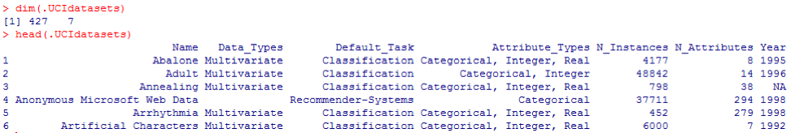

Из предыдущего вывода мы знаем, что в наборе данных имеется 427 наблюдения (набора данных). Для каждого из них у нас есть 7 связанных функций, таких как _Name, Data\_Types, Default\_Task, Attribute\_Types, N\_Instances_ (количество экземпляров), _N_Attributes_ (количество атрибутов) и _Year_. Переменная, называемая _Default_Task_, может быть интерпретирована как основное использование каждого набора данных. Например, первый набор данных, называемый _Abalone_, может быть использован для _Classification_. Функция _unique()_ может быть использована для поиска всех возможных _Default_Task_, показанных здесь:

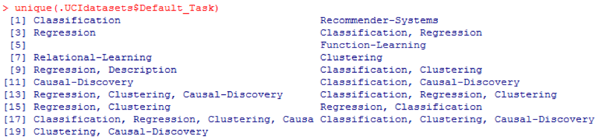

### R пакет AppliedPredictiveModeling

Этот пакет включает в себя множество полезных наборов данных, которые могут использоваться для этой главы и других. Самый простой способ найти эти наборы данных — с помощью функции _help()_, показанной здесь:

    library(AppliedPredictiveModeling) 
    help(package=AppliedPredictiveModeling) 
    

Здесь мы покажем несколько примеров загрузки этих наборов данных. Чтобы загрузить один набор данных, мы используем функцию _data()_. Для первого набора данных, называемого _abalone_, у нас есть следующий код:

    library(AppliedPredictiveModeling) 
    data(abalone) 
    dim(abalone) 
    head(abalone)
    

Вывод выглядит следующим образом:

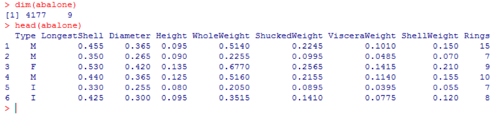

Иногда, большой набор данных включает в себя несколько суб-наборов данных:

    library(AppliedPredictiveModeling) 
    data(solubility) 
    ls(pattern="sol") 
    

  

    [1] "solTestX"       "solTestXtrans"  "solTestY"
    [4] "solTrainX"      "solTrainXtrans" "solTrainY"
    

Для загрузки каждого набора данных, мы могли бы использовать функции _dim()_, _head()_, _tail()_ и _summary()_.

### Аналитика временных рядов

Временные ряды можно определить как набор значений, полученных в последовательные моменты времени, часто с равными интервалами между ними. Существуют разные периоды, такие как годовой, ежеквартальный, ежемесячный, еженедельный и ежедневный. Для временных рядов ВВП (валовой внутренний продукт) мы обычно используем квартальные или годовые. Для котировок — годовые, ежемесячные и суточные частоты. Используя следующий код, мы можем получить данные ВВП США как ежеквартально, так и за годовой период:

    рath<-"http://canisius.edu/~yany/RData/" 
    dataSet<-"usGDPannual" 
    con<-paste(path,dataSet,".RData",sep='') 
    load(url(con)) 
    head(.usGDPannual) 

  

    YEAR  GDP 
    1 1930 92.2 
    2 1931 77.4 
    3 1932 59.5 
    4 1933 57.2 
    5 1934 66.8 
    6 1935 74.3
    

  

    dataSet<-"usGDPquarterly" 
    con<-paste(path,dataSet,".RData",sep='') 
    load(url(con)) 
    head(.usGDPquarterly) 
    

  

        DATE GDP_CURRENT GDP2009DOLLAR 
    1 1947Q1       243.1        1934.5 
    2 1947Q2       246.3        1932.3 
    3 1947Q3       250.1        1930.3 
    4 1947Q4       260.3        1960.7 
    5 1948Q1       266.2        1989.5 
    6 1948Q2       272.9        2021.9
    

Однако у нас есть много вопросов для анализа временных рядов. Например, с точки зрения макроэкономики мы имеем деловые или экономические циклы. Отрасли или компании могут иметь сезонность. Например, используя сельскохозяйственную промышленность, фермеры будут тратить больше в весенние и осенние сезоны и меньше на зиму. Для розничной торговли у них был бы огромный приток денег в конце года.

Чтобы манипулировать временными рядами, мы могли бы использовать множество полезных функций, включенных в пакет R, называемый _timeSeries_. В примере мы возьмем среднесуточные данные с еженедельной частотой:

    library(timeSeries)
    data(MSFT)
    x <- MSFT
    by <- timeSequence(from = start(x), to = end(x), by = "week")
    y<-aggregate(x,by,mean)
    

Мы могли бы также использовать функцию _head()_, чтобы увидеть несколько наблюдений:

    head(x)
    

  

    GMT
    Open High Low Close Volume
    2000-09-27 63.4375 63.5625 59.8125 60.6250 53077800
    2000-09-28 60.8125 61.8750 60.6250 61.3125 26180200
    2000-09-29 61.0000 61.3125 58.6250 60.3125 37026800
    2000-10-02 60.5000 60.8125 58.2500 59.1250 29281200
    2000-10-03 59.5625 59.8125 56.5000 56.5625 42687000
    2000-10-04 56.3750 56.5625 54.5000 55.4375 68226700
    

  

    head(y)

  

    GMT
    Open High Low Close Volume
    2000-09-27 63.4375 63.5625 59.8125 60.6250 53077800
    2000-10-04 59.6500 60.0750 57.7000 58.5500 40680380
    2000-10-11 54.9750 56.4500 54.1625 55.0875 36448900
    2000-10-18 53.0375 54.2500 50.8375 52.1375 50631280
    2000-10-25 61.7875 64.1875 60.0875 62.3875 86457340
    2000-11-01 66.1375 68.7875 65.8500 67.9375 53496000

## Прогнозирование будущих событий

Есть много методов, которые мы могли бы использовать при попытке предсказать будущее, таких как скользящее среднее, регрессия, авторегрессия и т. п. Во-первых, давайте начнем с простейшего для скользящего среднего:

    movingAverageFunction<- function(data,n=10){
      out= data
      for(i in n:length(data)){
        out[i] = mean(data[(i-n+1):i])
      }
      return(out)
    }

В предыдущем коде значение по умолчанию для количества периодов равно 10\. Мы могли бы использовать набор данных, называемый MSFT, включенный в пакет R, называемый _timeSeries_ (см. Следующий код):

    library(timeSeries)
    data(MSFT)
    p<-MSFT$Close
    
    ma<-movingAverageFunction(p,3)
    head(p)

  

    [1] 60.6250 61.3125 60.3125 59.1250 56.5625 55.4375

  

    head(ma)

  

    [1] 60.62500 61.31250 60.75000 60.25000 58.66667 57.04167

  

    mean(p[1:3])

  

    [1] 60.75

  

    mean(p[2:4])

  

    [1] 60.25

В ручном режиме мы находим, что среднее из первых трех значений _x_ совпадает с третьим значением _y_. В каком-то смысле мы могли бы использовать скользящее среднее для прогнозирования будущего.

В следующем примере мы покажем, как оценить ожидаемую доходность рынка в следующем году. Здесь мы используем индекс S&P500 и историческое среднегодовое значение в качестве наших ожидаемых значений. Первые несколько команд используются для загрузки связанного набора данных под названием _.sp500monthly_. Целью программы является оценка среднегодового среднего и 90-процентного доверительного интервала:

    library(data.table)
    path<-'http://canisius.edu/~yany/RData/'
    dataSet<-'sp500monthly.RData'
    link<-paste(path,dataSet,sep='')
    load(url(link))
    
    p<-.sp500monthly$ADJ.CLOSE
    n<-length(p)
    logRet<-log(p[2:n]/p[1:(n-1)])
    years<-format(.sp500monthly$DATE[2:n],"%Y")
    y<-data.frame(.sp500monthly$DATE[2:n],years,logRet)
    colnames(y)<-c("DATE","YEAR","LOGRET")
    y2<- data.table(y)
    z<-y2[,sum(LOGRET),by=YEAR]
    z2<-na.omit(z)
    annualRet<-data.frame(z2$YEAR,exp(z2[,2])-1)
    n<-nrow(annualRet)
    std<-sd(annualRet[,2])
    stdErr<-std/sqrt(n)
    ourMean<-mean(annualRet[,2])
    min2<-ourMean-2*stdErr
    max2<-ourMean+2*stdErr
    cat("[min mean max ]\n")

  

    [min mean max ]
    

  

    cat(min2,ourMean,max2,"\n")

  

    0.05032956 0.09022369 0.1301178
    

Как видно из результатов, историческая среднегодовая доходность для S&P500 составляет 9%. Но мы не можем заявить, что доходность индекса в следующем году будет равна 9%, т.к. она может быть от 5% до 13%, а это огромные колебания.

### Сезонность

В следующем примере мы покажем использование автокорреляции. Во-первых, мы загружаем R пакет под названием _astsa_, который выступает для прикладного статистического анализа временных рядов. Затем мы загружаем ВВП США с ежеквартальной частотой:

    library(astsa)
    path<-"http://canisius.edu/~yany/RData/"
    dataSet<-"usGDPquarterly"
    con<-paste(path,dataSet,".RData",sep='')
    load(url(con))
    x<-.usGDPquarterly$DATE
    y<-.usGDPquarterly$GDP_CURRENT
    plot(x,y)
    diff4 = diff(y,4)
    acf2(diff4,24)

В вышеуказанном коде — функция _diff()_ принимает разницу, например текущее значение минус предыдущее значение. Второе значение ввода указывает на задержку. Функция, называемая _acf2()_, используется для построения и печати ACF и PACF временного ряда. ACF обозначает функцию автоковариации, а PACF обозначает функцию частичной автокорреляции. Соответствующие графики показаны здесь:

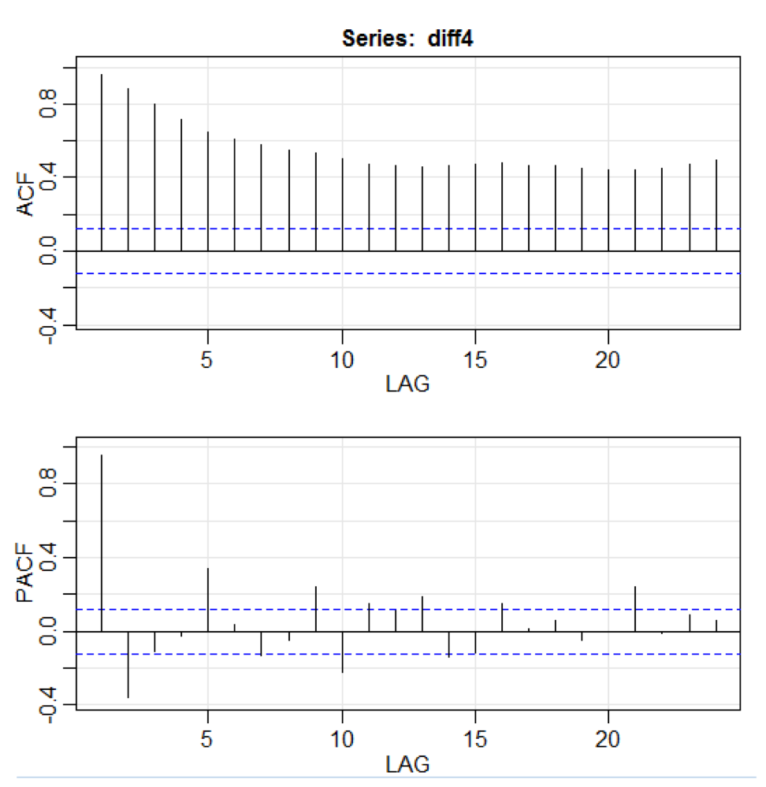

### **Визуализация компонентов**

Понятно, что концепции и наборы данных были бы намного более понятными, если бы мы могли использовать графики. Первый пример показывает колебания ВВП США за последние пять десятилетий:

    path<-"http://canisius.edu/~yany/RData/"
    dataSet<-"usGDPannual"
    con<-paste(path,dataSet,".RData",sep='')
    load(url(con))
    title<-"US GDP"
    xTitle<-"Year"
    yTitle<-"US annual GDP"
    x<-.usGDPannual$YEAR
    y<-.usGDPannual$GDP
    plot(x,y,main=title,xlab=xTitle,ylab=yTitle)

Соответствующий график показан здесь:

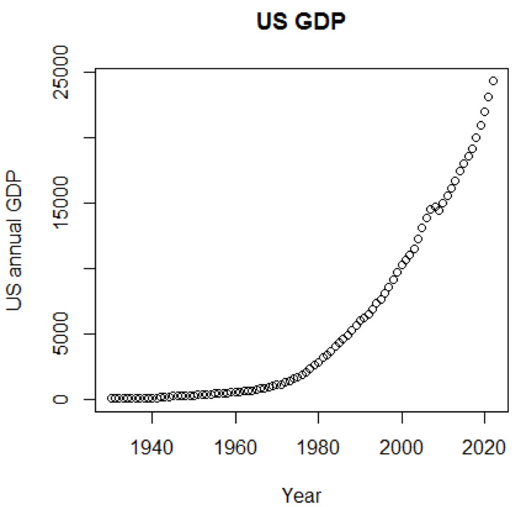

Если бы мы использовали логарифмическую шкалу для ВВП, у нас был бы следующий код и график:

    yTitle<-"Log US annual GDP" 
    plot(x,log(y),main=title,xlab=xTitle,ylab=yTitle)

Следующий график близок к прямой линии:

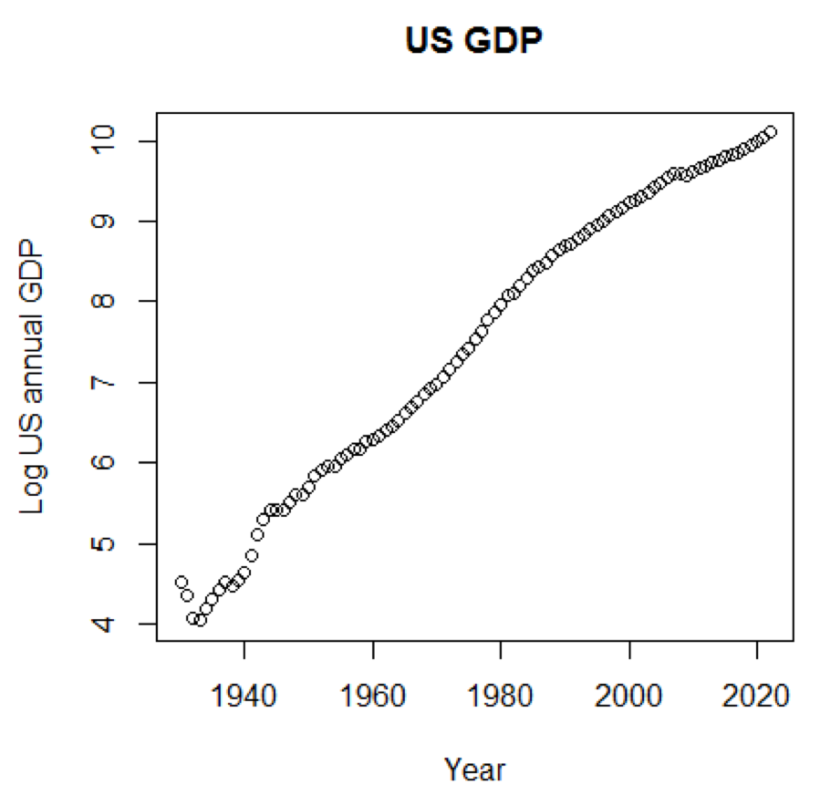

### R пакет – LiblineaR

Этот пакет представляет собой линейные прогностические модели, основанные на LIBLINEAR C/C++ Library. Вот один из примеров использования набора данных _iris_. Программа пытается предсказать, к какой категории относится растение, используя данные обучения:

    library(LiblineaR)
    data(iris)
    attach(iris)
    x=iris[,1:4]
    y=factor(iris[,5])
    train=sample(1:dim(iris)[1],100)
    xTrain=x[train,];xTest=x[-train,]
    yTrain=y[train]; yTest=y[-train]
    s=scale(xTrain,center=TRUE,scale=TRUE)
    
    tryTypes=c(0:7)
    tryCosts=c(1000,1,0.001)
    bestCost=NA
    bestAcc=0
    bestType=NA
    
    for(ty in tryTypes){
       for(co in tryCosts){
         acc=LiblineaR(data=s,target=yTrain,type=ty,cost=co,bias=1,cross=5,verbose=FALSE)
         cat("Results for C=",co,": ",acc," accuracy.\n",sep="")
         if(acc>bestAcc){
             bestCost=co
             bestAcc=acc
             bestType=ty
         }
       }
    }
    cat("Best model type is:",bestType,"\n")
    cat("Best cost is:",bestCost,"\n")
    cat("Best accuracy is:",bestAcc,"\n")
    
    m=LiblineaR(data=s,target=yTrain,type=bestType,cost=bestCost,bias=1,verbose=FALSE)
    
    s2=scale(xTest,attr(s,"scaled:center"),attr(s,"scaled:scale"))
    pr=FALSE; 
    if(bestType==0 || bestType==7) pr=TRUE
    p=predict(m,s2,proba=pr,decisionValues=TRUE)
    res=table(p$predictions,yTest) 
    print(res)
    
    BCR=mean(c(res[1,1]/sum(res[,1]),res[2,2]/sum(res[,2]),res[3,3]/sum(res[,3])))
    print(BCR)
    

Вывод следующий. BCR — это сбалансированная классификационная ставка. Для этой ставки, чем выше, тем лучше:

    cat("Best model type is:",bestType,"\n")

  

    Best model type is: 4

  

    cat("Best cost is:",bestCost,"\n")

  

    Best cost is: 1 

  

    cat("Best accuracy is:",bestAcc,"\n")

  

    Best accuracy is: 0.98

  

    print(res)
           yTest
                 setosa versicolor virginica
      setosa 16 0 0
      versicolor 0 17 0
      virginica 0 3 14
    print(BCR)
    

  

    [1] 0.95

  

### R пакет – eclust

Этот пакет представляет собой средо-ориентированную кластеризацию для интерпретируемых прогнозных моделей в высокоразмерных данных. Сначала давайте рассмотрим набор данных с именем _simdata_, который содержит смоделированные данные для пакета:

    library(eclust)
    data("simdata")
    dim(simdata)
    

  

    [1] 100 502

  

    simdata[1:5, 1:6]
    

  

                  Y E Gene1 Gene2 Gene3 Gene4
    [1,] -94.131497 0 -0.4821629 0.1298527 0.4228393 0.36643188
    [2,] 7.134990 0 -1.5216289 -0.3304428 -0.4384459 1.57602830
    [3,] 1.974194 0 0.7590055 -0.3600983 1.9006443 -1.47250061
    [4,] -44.855010 0 0.6833635 1.8051352 0.1527713 -0.06442029
    [5,] 23.547378 0 0.4587626 -0.3996984 -0.5727255 -1.75716775
    

  

    table(simdata[,"E"])
    

  

    0 1 
    50 50
    

Предыдущий вывод показывает, что размерность данных равна 100 на 502. **Y** — это вектор непрерывного отклика, а **E** — двоичная переменная среды для метода ECLUST. **E = 0** для неэкспонированных (n = 50) и **E = 1** для экспонированных (n = 50).

Следующая программа R оценивает z-преобразование Фишера:

    library(eclust)
    data("simdata")
    X = simdata[,c(-1,-2)]
    firstCorr<-cor(X[1:50,])
    secondCorr<-cor(X[51:100,])
    score<-u_fisherZ(n0=100,cor0=firstCorr,n1=100,cor1=secondCorr)
    dim(score)

  

    [1] 500 500
    

  

    score[1:5,1:5]
    

  

              Gene1 Gene2 Gene3 Gene4 Gene5
    Gene1 1.000000 -8.062020 6.260050 -8.133437 -7.825391
    Gene2 -8.062020 1.000000 9.162208 -7.431822 -7.814067
    Gene3 6.260050 9.162208 1.000000 8.072412 6.529433
    Gene4 -8.133437 -7.431822 8.072412 1.000000 -5.099261
    Gene5 -7.825391 -7.814067 6.529433 -5.099261 1.000000
    

Определим z-преобразование Фишера. Предполагая, что у нас есть набор из **n** пар **x**_i_ и **y**_i_, мы могли бы оценить их корреляцию, применяя следующую формулу:

Здесь **p** — корреляция между двумя переменными, а  и  являются выборочные средние для случайных величин **х** и **у**. Значение **z** определяется как:

**ln** — функция натурального логарифма, а **arctanh()** — обратная гиперболическая касательная функция.

При нахождении хорошей модели, иногда мы сталкиваемся нехваткой/переизбытком данных. Следующий пример заимствован [отсюда](http://scikit-learn.org/stable/auto_examples/model_selection/plot_underfitting_overfitting.html#sphx-glr-auto-examples-model-selection-plot-underfitting-overfitting-py) . Он демонстрирует проблемы работы с этим и то, как мы можем использовать линейную регрессию с полиномиальными признаками для аппроксимации нелинейных функций. Указанная функция:

В следующей программе мы пытаемся использовать линейные и полиномиальные модели для аппроксимации уравнения. Слегка измененный код показан здесь. Программа иллюстрирует влияние нехватки/переизбытка данных на модель:

    import sklearn
    import numpy as np
    import matplotlib.pyplot as plt
    from sklearn.pipeline import Pipeline
    from sklearn.preprocessing import PolynomialFeatures 
    from sklearn.linear_model import LinearRegression
    from sklearn.model_selection import cross_val_score 
    
    np.random.seed(123)
    n= 30 
    degrees = [1, 4, 15]
    def true_fun(x):
        return np.cos(1.5*np.pi*x)
    x = np.sort(np.random.rand(n))
    y = true_fun(x) + np.random.randn(n) * 0.1
    plt.figure(figsize=(14, 5))
    title="Degree {}\nMSE = {:.2e}(+/- {:.2e})"
    name1="polynomial_features"
    name2="linear_regression"
    name3="neg_mean_squared_error"
    
    for i in range(len(degrees)):
        ax=plt.subplot(1,len(degrees),i+1)
        plt.setp(ax, xticks=(), yticks=())
        pFeatures=PolynomialFeatures(degree=degrees[i],include_bias=False)
        linear_regression = LinearRegression()
        pipeline=Pipeline([(name1,pFeatures),(name2,linear_regression)])
        pipeline.fit(x[:,np.newaxis],y)
        scores=cross_val_score(pipeline,x[:,np.newaxis],y,scoring=name3,cv=10)
        xTest = np.linspace(0, 1, 100)
        plt.plot(xTest,pipeline.predict(xTest[:,np.newaxis]),label="Model")
        plt.plot(xTest,true_fun(xTest),label="True function")
        plt.scatter(x,y,edgecolor='b',s=20,label="Samples")
        plt.xlabel("x")
        plt.ylabel("y")
        plt.xlim((0,1))
        plt.ylim((-2,2))
        plt.legend(loc="best")
        plt.title(title.format(degrees[i],-scores.mean(),scores.std()))
    plt.show()
    

Полученные графики показаны здесь:

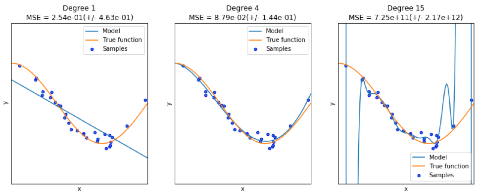

### Python пакет – model-catwalk

Пример можно найти [здесь](https://pypi.python.org/pypi/model-catwalk/0.2.1).

Первые несколько строк кода показаны здесь:

    import datetime
    import pandas
    from sqlalchemy import create_engine
    from metta import metta_io as metta
    from catwalk.storage import FSModelStorageEngine, CSVMatrixStore
    from catwalk.model_trainers import ModelTrainer
    from catwalk.predictors import Predictor
    from catwalk.evaluation import ModelEvaluator
    from catwalk.utils import save_experiment_and_get_hash
    help(FSModelStorageEngine)

Соответствующий вывод показан здесь. Для экономии места представлена только верхняя часть:

    Help on class FSModelStorageEngine in module catwalk.storage:
    
    class FSModelStorageEngine(ModelStorageEngine)
     | Method resolution order:
     | FSModelStorageEngine
     | ModelStorageEngine
     | builtins.object
     | 
    | Methods defined here:
     | 
     | __init__(self, *args, **kwargs)
     | Initialize self. See help(type(self)) for accurate signature.
     | 
     | get_store(self, model_hash)
     | 
     | ----------------------------------------------------------------------
    

  

    | Data descriptors inherited from ModelStorageEngine:
     | 
     | __dict__
     | dictionary for instance variables (if defined)
     | 
     | __weakref__
     | list of weak references to the object (if defined)
    

  

### Python пакет – sklearn

Поскольку _sklearn_ — очень полезный пакет, стоит показать больше примеров использования этого пакета. Приведенный здесь пример показывает, как использовать пакет для классификации документов по темам с использованием подхода «bag-of-words».  
В этом примере используется матрица _scipy.sparse_ для хранения объектов и демонстрируются различные классификаторы, которые могут эффективно обрабатывать разреженные матрицы. В этом примере используется набор данных из 20 групп новостей. Он будет автоматически загружен, а затем кэширован. ZIP-файл содержит входные файлы и может быть загружен [здесь](http://people.csail.mit.edu/jrennie/20Newsgroups/20news-bydate.tar.gz). Код доступен [здесь](https://scikit-learn.org/0.16/auto_examples/text/document_classification_20newsgroups.html). Для экономии места показаны только первые несколько строк:

    import logging
    import numpy as np
    from optparse import OptionParser
    import sys
    from time import time
    import matplotlib.pyplot as plt
    from sklearn.datasets import fetch_20newsgroups
    from sklearn.feature_extraction.text import TfidfVectorizer
    from sklearn.feature_extraction.text import HashingVectorizer
    from sklearn.feature_selection import SelectFromModel
    

Соответствующий вывод показан здесь:

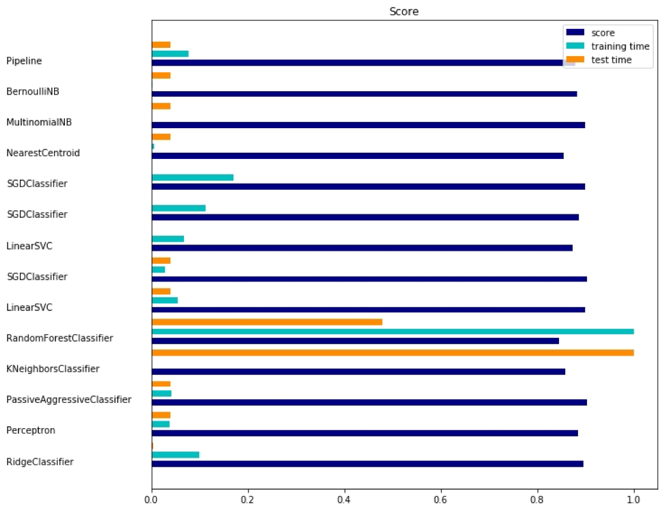

Для каждого метода есть три показателя: оценка, время обучения и время тестирования.

### Julia пакет – QuantEcon

Возьмем для примера использование Марковских цепей:

    using QuantEcon
    P = [0.4 0.6; 0.2 0.8];
    mc = MarkovChain(P)
    x = simulate(mc, 100000);
    mean(x .== 1)
    
    mc2 = MarkovChain(P, ["employed", "unemployed"])
    simulate(mc2, 4)

Результат:

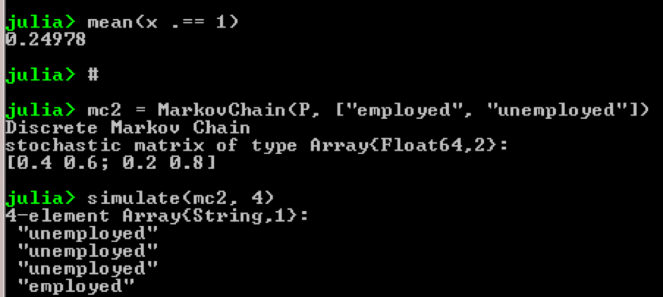

Цель примера состоит в том, чтобы увидеть, как человек из одного экономического статуса в будущем трансформируется в другого. Во-первых, давайте посмотрим на следующий график:

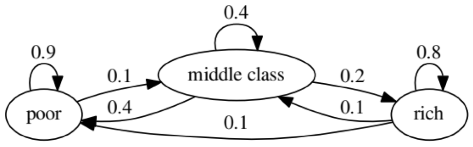

Давайте посмотрим на крайний левый овал со статусом «poor». 0.9 означает, что человек с таким статусом имеет 90% шансов остаться бедным, а 10% переходит в средний класс. Он может быть представлен следующей матрицей, нули находятся там, где нет ребра между узлами:

Говорят, что два состояния, x и y, связаны друг с другом, если существуют положительные целые числа j и k, такие как:

Цепь Маркова _P_ называется неприводимой, если все состояния связываются; то есть, если _x_ и _y_ сообщаются для каждого (x, y). Следующий код подтвердит это:

    using QuantEcon
    P = [0.9 0.1 0.0; 0.4 0.4 0.2; 0.1 0.1 0.8];
    mc = MarkovChain(P)
    is_irreducible(mc)
    

Следующий график представляет экстремальный случай, так как будущий статус для бедного человека будет на 100% бедным:

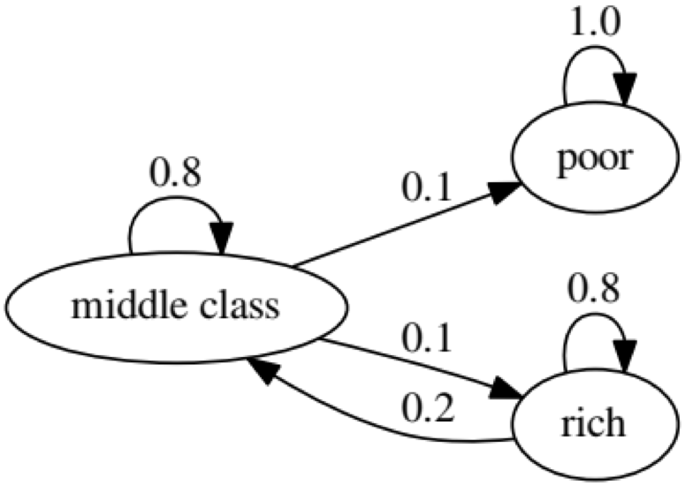

Следующий код также подтвердит это, так как результат будет _false_:

    using QuantEcon
    P2 = [1.0 0.0 0.0; 0.1 0.8 0.1; 0.0 0.2 0.8];
    mc2 = MarkovChain(P2)
    is_irreducible(mc2)
    

  

Тест Грэнджера на причинность используется для определения того, является ли один временной ряд фактором, и предоставляет полезную информацию для прогнозирования второго. В следующем коде набор данных с именем _ChickEgg_ используется в качестве иллюстрации. Набор данных имеет две колонки, число цыплят и количество яиц, с отметкой времени:

    library(lmtest)
    data(ChickEgg)
    dim(ChickEgg)
    

  

    [1] 54 2

  

    ChickEgg[1:5,]

  

    chicken egg
    [1,] 468491 3581
    [2,] 449743 3532
    [3,] 436815 3327
    [4,] 444523 3255
    [5,] 433937 3156

Вопрос в том, можем ли мы использовать число яиц в этом году, чтобы предсказать число цыплят в следующем году?

Если это так, то количество цыплят будет причиной по Грэнджеру для количества яиц. Если это не так, мы говорим, что количество цыплят не является причиной по Грэнджеру для количества яиц. Вот соответствующий код:

    library(lmtest)
    data(ChickEgg)
    grangertest(chicken~egg, order = 3, data = ChickEgg)

    Granger causality test
    Model 1: chicken ~ Lags(chicken, 1:3) + Lags(egg, 1:3)
    Model 2: chicken ~ Lags(chicken, 1:3)
      Res.Df Df F Pr(>F) 
    1 44 
    2 47 -3 5.405 0.002966 **
    ---
    Signif. codes: 0 ‘***’ 0.001 ‘**’ 0.01 ‘*’ 0.05 ‘.’ 0.1 ‘ ’ 1
    

В модели 1 мы пытаемся использовать лаги цыплят плюс лаги яиц, чтобы объяснить количество цыплят.

Т.к. значение **P** довольно мало (оно значимо при 0,01) мы говорим, что количество яиц является причиной по Грэнджеру для количества цыплят.

Следующий тест показывает, что данные о цыплятах не могут быть использованы для прогнозирования следующего периода:

    grangertest(egg~chicken, order = 3, data = ChickEgg)
    

  

    Granger causality test
    
    Model 1: egg ~ Lags(egg, 1:3) + Lags(chicken, 1:3)
    Model 2: egg ~ Lags(egg, 1:3)
      Res.Df Df F Pr(>F)
    1 44 
    2 47 -3 0.5916 0.6238
    

В следующем примере мы проверяем доходность IBM и S&P500 с целью выяснить, что их них является причиной по Грэнджеру для другого.

Сначала мы определим функцию доходности:

    ret_f<-function(x,ticker=""){
         n<-nrow(x)
         p<-x[,6]
         ret<-p[2:n]/p[1:(n-1)]-1
         output<-data.frame(x[2:n,1],ret)
         name<-paste("RET_",toupper(ticker),sep='')
         colnames(output)<-c("DATE",name)
         return(output)
    }
    

  

    >x<-read.csv("http://canisius.edu/~yany/data/ibmDaily.csv",header=T)
    ibmRet<-ret_f(x,"ibm")
    x<-read.csv("http://canisius.edu/~yany/data/^gspcDaily.csv",header=T)
    mktRet<-ret_f(x,"mkt")
    final<-merge(ibmRet,mktRet)
    head(final)
    

  

            DATE RET_IBM RET_MKT
    1 1962-01-03 0.008742545 0.0023956877
    2 1962-01-04 -0.009965497 -0.0068887673
    3 1962-01-05 -0.019694350 -0.0138730891
    4 1962-01-08 -0.018750380 -0.0077519519
    5 1962-01-09 0.011829467 0.0004340133
    6 1962-01-10 0.001798526 -0.0027476933
    

Теперь функция может быть вызвана с входными значениями. Цель программы — проверить, можем ли мы использовать отставания на рынке для объяснения доходности IBM. Точно так же мы проверяем, объяснить отставания IBM доходами рынка:

    library(lmtest)
    grangertest(RET_IBM ~ RET_MKT, order = 1, data =final)
    

  

    Granger causality test
    Model 1: RET_IBM ~ Lags(RET_IBM, 1:1) + Lags(RET_MKT, 1:1)
    Model 2: RET_IBM ~ Lags(RET_IBM, 1:1)
      Res.Df Df F Pr(>F) 
    1 14149 
    2 14150 -1 24.002 9.729e-07 ***
    ---
    Signif. codes: 0 ‘***’ 0.001 ‘**’ 0.01 ‘*’ 0.05 ‘.’ 0.1 ‘ ’ 1
    

Результаты показывают, что индекс S&P500 можно использовать для объяснения доходности IBM за следующий период, поскольку он статистически значим на уровне 0,1%. Следующий код будет проверять, объясняет ли отставание IBM изменение S&P500:

    grangertest(RET_MKT ~ RET_IBM, order = 1, data =final)
    

  

    Granger causality test
    Model 1: RET_MKT ~ Lags(RET_MKT, 1:1) + Lags(RET_IBM, 1:1)
    Model 2: RET_MKT ~ Lags(RET_MKT, 1:1)
      Res.Df Df F Pr(>F) 
    1 14149 
    2 14150 -1 7.5378 0.006049 **
    ---
    Signif. codes: 0 ‘***’ 0.001 ‘**’ 0.01 ‘*’ 0.05 ‘.’ 0.1 ‘ ’ 1
    

Результат предполагает, что в течение этого периода доходность IBM может быть использованы для объяснения индекса S&P500 следующего периода.