Преимущества анализа приложений 7 уровня в межсетевых экранах. Ч.1

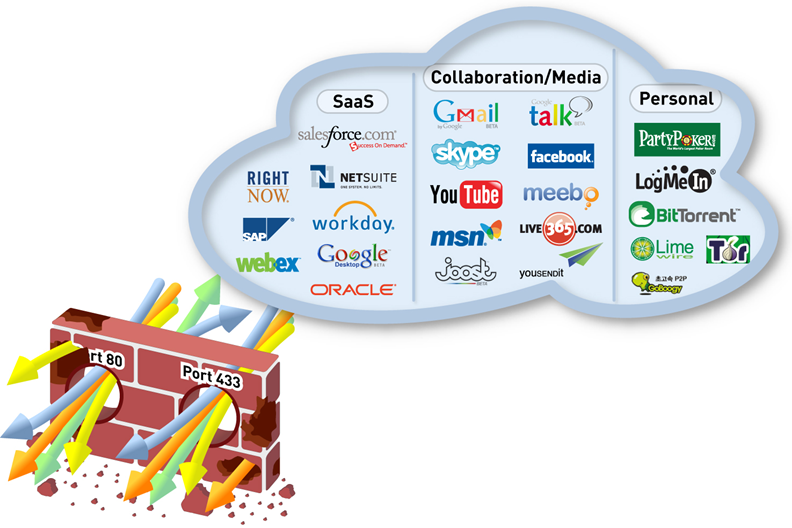

### Почему появилась эта статья?

  

> Неоднократно приходил к коллегам-безопасникам, которые пользуются межсетевым экраном нового поколения и видел, что они продолжают писать правила по номерам портов. На мое предложение перейти писать по имени приложений, слышал «А вдруг так не заработает?». Если вам тоже «страшно» или непонятно зачем писать правила по приложениям, от эта статья для вас.

Новое поколение межсетевых экранов удобнее и безопаснее, благодаря новой архитектуре движка и новой идеологии управления сетевыми потоками.

  

## Введение

Skype, TOR, Ultrasurf, TCP-over-DNS и еще несколько сотен приложений и туннелей спокойно проходят сквозь statefull inspection firewall и HTTP прокси. Многие средства защиты открывают соединения, но не проверяют, что ходит внутри них. Предлагаю разобраться, как контролируемо разрешать соединения приложений в новом поколении firewall, где правила пишутся по именам приложений, что соответствует 7 уровню модели OSI ISO. Такие межсетевые экраны имеют название Next Generation Firewall, межсетевой экран нового поколения или просто NGFW.

  

> Администратору межсетевого экрана нужно не только разрешить соединение, а еще гарантировать, что внутри разрешенного соединения ходит то, что вы хотели, включая проверки передаваемых файлов. Это называется **безопасное разрешение приложений**.  
> 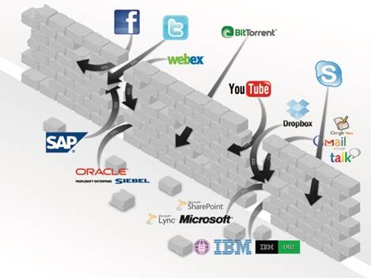  

Существует несколько важных отличий в работе с трафиком, которые понимаешь лишь когда переходишь на реальное использование правил, где критерием является приложение 7 уровня модели ISO OSI:

  

*   ИТ администратор видит, что NGFW визуализирует сетевой трафик, то есть показывает содержимое поля данных пакетов, имена пользователей и какое приложение работает и какие файлы передает.  
    
*   ИТ безопасность видит, что NGFW обеспечивают безопасное разрешение приложений, поскольку более глубокий анализ данных в пакете позволяет увидеть вирусы, подключить отправку неизвестных файлов в песочницу, проверить тип файла, ключевые слова для DLP, проверить категорию URL, проверить что идет внутри SSL и SSH, сравнить с уже известными всему миру индикаторами компрометации, включить DNS фильтр и другие современные техники.  
    

Чтобы понять причины этого сравним журналы L4 и L7 firewall.

  

> А) Сравните запись в журнале **L4 firewall**, который разбирает только заголовок транспортного (четвертого) уровня модели OSI ISO — в данном случае TCP:  
> 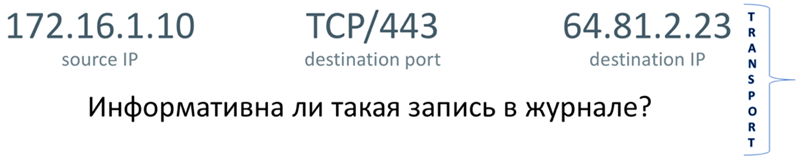  

Да, есть информация об источнике и получателе, можно догадаться по номеру порта 443, что внутри, с большой степенью вероятности (как говорят англичане) соединение SSL. Я лично не могу увидеть в этой записи какой-то инцидент. А вы?

  

> Б) Сравните запись в журнале **L7 firewal**l для того же самого TCP соединения, где разбирается еще и сам контент передаваемый в поле данных TCP/IP:  
> 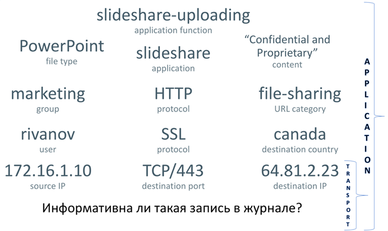  

Здесь вы видите, что Иванов из отдела маркетинга выложил на Slideshare файл с пометкой «не для распространения». Это пример реального инцидента, где сотрудник выложил конфиденциальные планы развития компании на год в Интернет. Эта информация получена в L7 firewall на основе анализа того же самого соединения, что и выше у L4 firewall и сразу информации становится достаточно, чтобы понять, что был инцидент. И это совершенно другой подход к анализу трафика. Но, сразу предупрежу, что такой глубокий анализ накладывает серьезную нагрузку на процессор и оперативную память устройства.

Иногда ощущается, что уровень детализации журналов в NGFW похож на уровень детализации в системах SIEM, которые собирают информацию по крупицам из разных источников. Именно поэтому NGFW один из лучших источников информации для SIEM.

  

## Определения

Нужно подсветить термины, которыми мы будем дальше оперировать. У меня нет цели в деталях дать все определения.

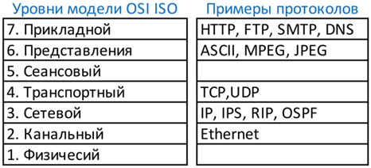

**Семиуровневая модель OSI ISO** – это модель взаимодействия между сетевыми устройствами, которая гласит, что существует 7 последовательных уровней абстракции взаимодействия: первый — физический, следующий канальный, сетевой, четвертый — транспортный, затем сессионный, представления и седьмой уровень – приложений (см. картинку выше).  
Каждое сетевое устройство работает на своем уровне абстракции: веб сервер и браузер – на уровне приложений (уровень 7 или кратко L7), маршрутизаторы — общаются друг с другом на канальном (2) и сетевом уровне (3), когда передают друг другу фреймы и пакеты.  
Межсетевые экраны тоже являются сетевыми устройствами и могут быть в зависимости от своего типа и свитчами и роутерами и даже быть «виртуальным кабелем» с точки зрения сетевой топологии, но на эти сетевые устройства ложится дополнительная нагрузка: они должны анализировать содержимое пакетов.  
И вот глубина анализа сетевых пакетов может отличаться. Анализируют ли они 4 или 7 уровень — в этом есть важное отличие.

  

## Firewall

**Межсетевой экран (МСЭ), Network Firewall**– это сетевое устройство, которое делит сеть на сегменты с разными политиками безопасности и контролирует эти политики. Например, сегмент Интернет – там можно все что угодно. И сегмент вашего ЦОД – там можно работать только выделенному списку сотрудников по разрешенным приложениям. Внутри одного хоста VMware может быть несколько виртуальных сетей с виртуальными машинами и разными политиками доступа к ним.  
Политика безопасности firewall содержит правила, которые приводит в действие программный код устройства, анализируя каждый фрейм и пакет пришедший и исходящий с firewall. В правилах firewall задаются критерии проверки (квалификаторы), по которым принимается решение пропускать или блокировать трафик. Примерами квалификаторов в правилах являются: адрес, порт, приложение, пользователь, зона. Межсетевой экран последовательно, правило за правилом, сверху внизу по списку просматривает критерии и если входящий трафик соответствует всем критериям правила, (логическая операция «И» между критериями) то применяется указанное действие: заблокировать или пропустить. Действие выполняется как для первого пакета, так и для всех последующих пакетов одного TCP/IP соединения.  
Существуют разные типы и реализации firewall. Мы рассмотрим классификацию по степени используемой глубины анализа трафика: L3, L4 и L7.

  

## L3 Firewall

**L3 firewall** – это межсетевой экран, который пропускает через себя трафик и анализирует только заголовки IP протокола, то есть адрес откуда и куда идет трафик. Такие межсетевые экраны называют **пакетный фильтр**. Правила имеют название «список доступа» или access-list (ACL) и этот функционал на сегодня работает практически в любом маршрутизаторе и операционной системе. Такой анализ не требует серьезной нагрузки на процессоры и память firewall.

  

## L4 Firewall

**L4 firewall** – это межсетевой экран, который пропускает через себя трафик и проверяет заголовки протоколов 4 уровня: TCP, UDP, ICMP, то есть основными критериями проверки для пропуска трафика является IP адреса и порты TCP/UDP или сервисы ICMP.  
Также в L4 firewall появляется понятие stateful inspection, когда каждый проходящий запрос запоминается и хранится состояние запроса для того, чтобы разрешать необходимые ответные соединения. То есть появляется понятие инициатора соединения, что логично в сетях, построенных на клиент-серверной технологии. Такой межсетевой экран тратит память на хранение данных о каждом соединении, то есть появляется ограничение на максимальное количество хранимых одновременных сессий в памяти. В L4 firewall уже не нужно писать ответное правило для обратного соединения, как это требуется в L3 firewall, потому что на основе состояния соединения, межсетевой экран автоматически разрешает обратные соединения. То есть L4 firewall удобнее, чем пакетный фильтр.  
Современные L4 firewall хранят состояние не только TCP, UDP и ICMP, но и отслеживают взаимодействие некоторых L7 приложений. Например, состояние FTP, HTTP, SIP, и другие приложения, что уже зависит от конкретной реализации firewall. Нужно задавать производителю L4 firewall вопрос: какие конкретно приложения поддерживает их движок stateful inspection firewall.

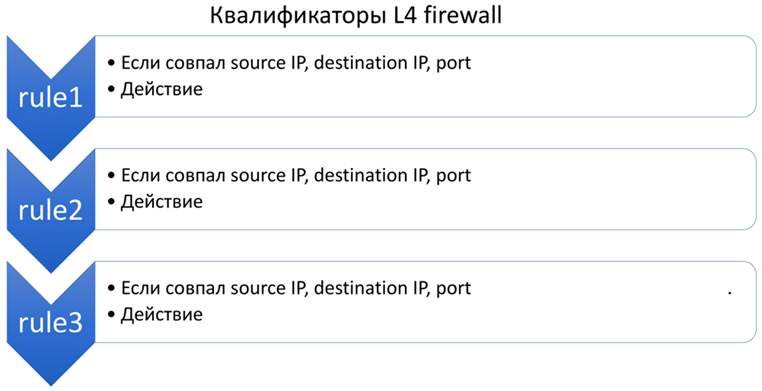

## L7 Firewall

**L7 firewall** – это межсетевой экран, который пропускает через себя IP трафик сети и проверяет и заголовки 4 уровня и сегмент данных каждого IP пакета, то есть понимает L7 трафик уровня приложений, вплоть до того какие файлы передаются и в каком направлении. Поскольку анализируется больше данных, то и критериев проверки в правилах L7 firewall больше: имя пользователя, приложение, URL категория, состояние софта на компьютере пользователя. Нагрузка на L7 firewall гораздо выше, поскольку его процессор должен постоянно анализировать мегабайты поля данных, которые передает приложение, в то время как L4 firewall проверяет только несколько байт заголовка IP пакета с адресами источника и получателя и портами. Размер буфера для хранения состояния каждого приложения L7 требуется гораздо больше, поскольку данных на L7 передается больше, чем просто в заголовке TCP/IP. Из-за выросшего размера буфера при использовании анализа приложений, количество одновременно хранимых в памяти сессий у L7 firewall меньше L4 firewall при том же объеме памяти. Поскольку L7 firewall видит по контенту что за приложение идет по сети, то номер порта не несет особенного смысла и правила можно писать по имени приложения L7. Кроме того современные приложения генерируют много соединений и все эти соединения являются частью одного приложения. Этот вид firewall позволяет вернуть контроль за современными динамическими приложениями, работающими по любому порту, например, teamviewer, bittorent, tor, о которых L4 firewall ничего не знает. То есть L7 firewall в современных реалиях нужен, если в сети нужна безопасность.

  

> Если после прочтения данной статьи вы продолжите использовать L4 firewall то, это значит, что на безопасность вам наплевать.

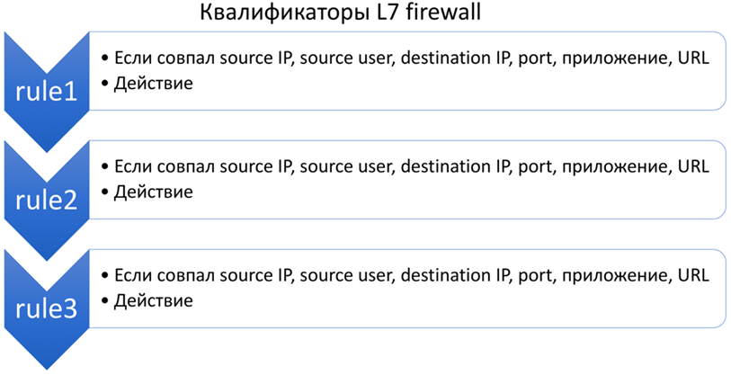

## UTM

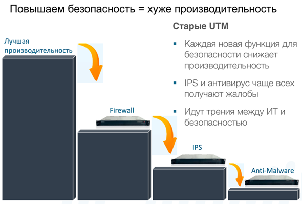

**UTM** – это сетевое устройство, внутри которого установлено несколько различных компонентов защиты, которые последовательно анализируют проходящий через устройство трафик. Ядром UTM является L4 firewall, система предотвращения атак (IPS), антивирус, анализ категорий URL в HTTP и HTTPS. Часто UTM еще реализуют функции VPN шлюза. Управление всеми этими компонентами как правило осуществляется из нескольких разных систем управления. Трафик внутри UTM последовательно проходит через модули фильтрации и на выходе остается чистый трафик, который разрешен политиками безопасности каждого модуля. UTM может быть использован как платформа для других функций: защита от вирусов, IPS, DDoS, QoS, DLP, DNS фильтр, базы индикаторов компрометации Threat Intelligence, защита от фишинга и так далее (зависит от производителя).

  

> Притча про человека, который заказал семь шапочек из одной шкуры, написана в том числе для покупателей UTM: чем больше функций вы захотите после покупки включить, тем большую нагрузку будут нести процессора UTM для анализа одного и того же объема трафика. Больше функций – меньше скорость устройства.

Идея UTM – нагрузить один процессор как можно большим количеством функций стала эволюционным тупиком, потому что число функций росло и выдерживать всю эту нагрузку процессоры не могли. Сегодня, несмотря на заявленные хорошие функции, никто не включает в UTM весь функционал, чтобы исключить задержки трафика.

  

> Цель UTM: реализовать на одном сервере как можно больше функций, чтобы удешевить устройство для пользователя.

Сейчас производители UTM стали ставить движки анализа приложений 7 уровня, чтобы говорить, что они NGFW, чем сбивают с толку потребителя. Однако это легко распознать, если посмотреть в политику безопасности: правила по-прежнему базируются на критериях проверки полей L4. А для фильтрации L7 приложений используется отдельный раздел настроек, то есть приложение L7 не является квалификатором, как должно быть в L7 firewall. Распознавать приложение L7 и использовать приложение L7 как критерий политики безопасности – это «две большие разницы».

  

## NGFW

**NGFW** – это сетевое устройство, внутри которого реализован L7 firewall. Поскольку квалификатором основным становится имя приложения L7, то правила пишутся по новым критериям. В NGFW всегда работает динамическое сопоставление IP адресов пользователи сети, поэтому имя пользователя тоже становится квалификатором(критерием). NGFW включает в себя функции расшифрования SSL/TLS и SSH для распознавания приложений и атак внутри них, IPS, антивируса, URL фильтрации.  
Термин NGFW сначала был придуман маркетингом компании Palo Alto Networks. Но постепенно прижился на рынке и все производители UTM сейчас тоже называют себя NGFW. И действительно, NGFW тоже выполняет несколько функций одновременно, почему же тогда NGFW не UTM? Отличие важно знать. Оно в том, что в NGFW функции безопасности приложений (IPS, антивирус, URL фильтрация) ускорены аппаратно. Существуют специализированные аппаратные чипы: IPS проверяет атаки на своем чипе, антивирус сигнутуры на своем, расшифрование SSL — на своем и так далее. Разделение функций по разным процессорам дает возможность запускать защитные функции параллельно и не ждать, когда закончит работать предыдущая функция, как в UTM. Для примера в аппаратных межсетевых экранах компании Palo Alto Networks установлено до 60  
специализированных процессоров компании Cavium выполняющих ускорение функций безопасности, сетевых функций и управления. Важно, что NGFW содержат единый программный интерфейс управления всеми функциями одновременно.

  

> Идея NGFW в отличие от UTM – реализовать каждую функцию на отдельном процессоре, который специализирован под требуемый функционал.

По такой же схеме когда-то пошли производители компьютеров, которые вынесли функции математики и графики в отдельные математические и графические сопроцессоры. Поэтому в NGFW стоят отдельные процессоры под распознавание приложений L7, под расшифрование SSL/SSH, под проверку сигнатур антивируса, проверку сигнатур IPS и так далее. Это позволяет включить все функции одновременно, без деградации и задержки трафика в устройстве на время проверки. Почему компьютеры без графических акселераторов никто уже не покупает, а межсетевые экраны без ускорения покупают? Потому что ускорение не нужно на небольших скоростях, но когда скорости анализа трафика выходят за 1-5 Гигабит — реализовать все функции безопасности уже невозможно без ускорения.  
Цель устройства NGFW: дать возможность безопасно работать компании не замедляя трафик. Это позволяет постоянно проверять, что приложения передают нужный компании безопасный контент, и параллельная работа движков защиты с одним потоком трафика гарантирует заданную производительность при всех включенных функциях безопасности и также минимальную задержку трафика.

  

## Примеры

  

> Пример политики L7 в Palo Alto Networks NGFW  
> 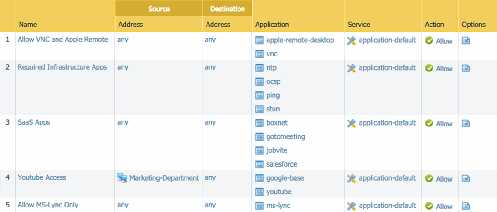  

Зачем может потребоваться URL категория, как квалификатор? Например, вы можете части сотрудников разрешить все-таки посещать вредоносные сайты браузером, но заблокировать им скачивание файлов.

  

> Пример политики Palo Alto Networks с использованием проверок Host Information Profile и URL категорий.  
> 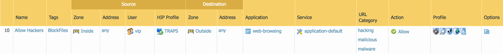  

В этой политике также задействована проверка наличия хостовой защиты TRAPS в колонке HIP Profile, которая не даст зайти на сайт с вредоносным кодом и эксплойтами, без установленной защиты на компьютере. TRAPS это агент защиты от вредоносного кода и эксплойтов.  
Блокировка скачивания файлов производится в настройках колонки Profile, где применен профиль блокировки передачи всех файлов по любому приложению. Вот так выглядит его настройка:

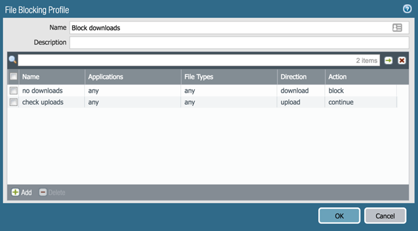

## Прокси-сервер

**Прокси-сервер**– это устройство, которое терминирует на себе трафик какого-то приложения, проверяет это трафик различными методиками и отправляет этот трафик дальше. Чаще всего используются в сетях прокси-сервера для протоколов HTTP и HTTPS. Поскольку UTM и NGFW анализируют потоки HTTP и HTTPS прозрачно, не требуя явно указывать настройки прокси-сервера у клиентов, то HTTP прокси постепенно исчезают из компаний.

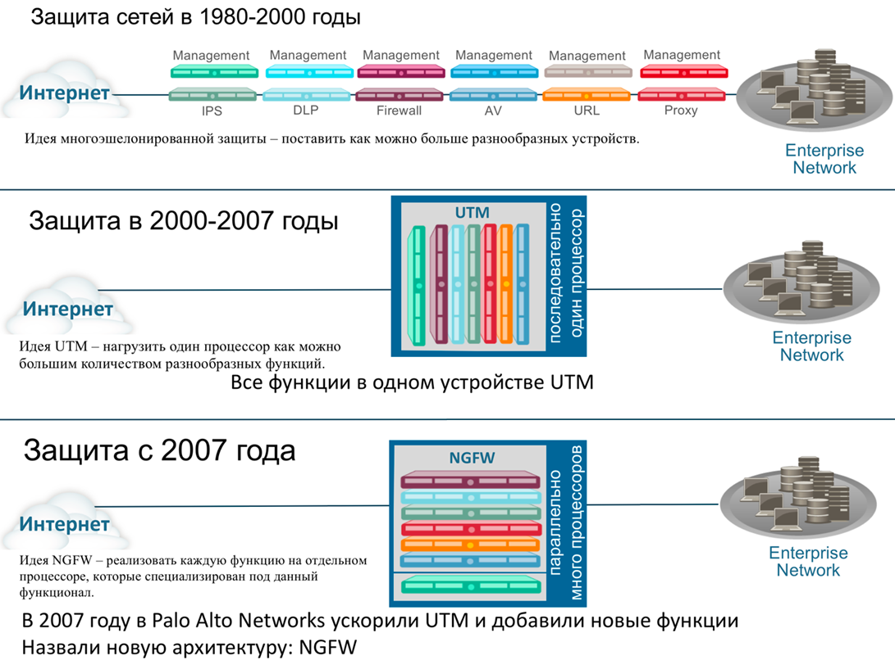

## Заблуждения о Stateful Inspection

Отдельную главу я должен посвятить этому святому каждому сетевому инженеру и безопаснику понятию. Нужно подчеркнуть и дополнить важные вещи, которые часто упускают на курсах по межсетевым экранам. Если вы уже изучали основы stateful inspection, то скорее всего у вас есть несколько заблуждений.  
**Есть одно заблуждение**, которое я иногда вижу у коллег. Внимание! Stateful inspection — это не только про состояние соединения TCP, UDP или ICMP! Это еще и про состояние других более сложных протоколов и приложений: FTP, SIP, RPC, SMTP, SMB и так далее!

  

> Пример.  
> Протокол FTP — это протокол уровня приложений. И в нем есть команда PORT, которая может назначать новое TCP подключение. Любой firewall, который позиционирует себя как stateful inspection firewall, должен контролировать команды FTP и видеть команду PORT и разрешать соединение на порт и адрес, который там запрошен. И это еще не все: firewall еще и должен подменять параметры команды PORT и вставлять правильный адрес, если FTP сервер работает за NAT.

То есть в любом современном L4 firewall есть компонент, который подглядывает за L7 уровнем. И такой протокол не один: еще есть HTTP, RPC, и другие… И такие анализаторы протоколов 7 уровня называются Application Layer Gateway (ALG).

  

> Пример.  
> Самый «любимый» одновременно у сетевиков и безопасников – это ALG для SIP, с которым многие, кто настраивает SIP ALG на L4 firewall наелись проблем, и часто заканчивается его отключением.

То есть уже в L4 firewall есть зачатки анализа протоколов 7 уровня. L4 firewall отличаются друг от друга количеством реализованных ALG. Когда вы сравниваете обычные L4 firewall, то справедливый вопрос системному инженеру производителя будет: сколько протоколов и приложений поддерживает ваш движок Stateful Inspection? Как правило никто не отвечает.

  

> Получается, что L7 firewall — это тоже stateful inspection firewall, но который анализирует и хранит статус ВСЕХ приложений, а не только выборочно, как L4 firewall.

**Второе заблуждение** вносят сами производители firewall. Возьмите любой datasheet, где производитель пишет такой параметр, как «число одновременных сессий». Вопрос к производителю следующий: сессии каких именно протоколов и приложений измерялись и был ли включен хотя бы stateful для TCP, не говоря уже были ли проверки для L7 уровня?  
Мы знаем, что у каждого протокола или приложения есть состояние, которое помнит firewall. И для хранения этого состояния нужно выделить буфер в памяти устройства. По сути, параметр «число одновременных сессий» означает сколько буферов для хранения состояний можно уместить в памяти устройства. Нужно понимать, что для L4 firewall чаще всего измеряют этот параметр для голого TCP или даже UDP. То есть для TCP нужен буфер, в который умещается только IP и порт соединения. Однако в тесте для L7 приложений, например, HTTP этот буфер будет значительно большего размера, ведь хранить, например, параметры запроса GET внутри HTTP требуется больше памяти. А память не резиновая. Соответственно, если производитель пишет такой параметр как «число одновременных сессий», то он должен писать:

  

*   был ли это просто тест работы в режиме свитча/роутера, c выключенным stateful inspection,
*   был ли это режим L4, где он запоминал только заголовки TCP/IP,
*   было ли какое-то приложение L7 уровня взято для теста.  
    Правильно L7 firewall измерять на числе одновременных сессий HTTP, на пакетах разной длины: 64Кб, 44Кб, 16Кб, 1.5Кб. Понятно, что если каким-то производителем все измерения были сделаны на UDP 1518 байт, то скорее всего в вашу сеть такое устройство не подойдет, поскольку заставить ваших пользователей посылать только UDP пакеты длиной 1518 байт – не получится, а уж тем более заставить отвечать такими пакетами сервера HTTP. Нужно сказать такому производителю, что производительность L7 firewall нужно измерить хотя бы на трафике с протоколом HTTP. Из известных компаний, которые проводят такие тесты публично: компания NSS Labs.  
    Сами производители firewall проводят тесты на заказ в своих лабораториях, которым можно заказать свой профиль трафика, например: 30% трафика HTTPS, 10% трафика SMB, 10% трафика FTP и так далее.

  

> Пример.  
> После проверки на генераторе трафика IXIA устройства одного из производителей UTM:  
> 
> *   в режиме L4 firewall — 4 000 000 одновременных сессий,
> *   в режиме L7 firewall — 200 000 одновременных сессий.  
>     Это показатель того, что буферов для сессий L7 в памяти устройства меньше из-за их большого размера.
> 
>   

И, кстати говоря, также будет и с общей производительностью устройства: с выключенными проверками контента приложений межсетевой экран работает в 10 раз быстрее, чем с включенными. Использовать только анализ заголовков 4 уровня для ускорения устройства можно, но безопасности уже никакой.

**Третий важный момент** – работа в кластере. Все межсетевые экраны должны работать в кластере, потому что если один межсетевой экран перестает работать, то его задача «лечь грудью» и заблокировать весь трафик — такова теория построения защиты на базе межсетевых экранов. Пока «сломанный» firewall блокирует трафик, задачу по пропуску легитимного трафика должен взять на себя соседний firewall. А что же будет с соединениями, которые шли через первый? Скорее всего первый firewall передавал состояние всех соединений второму, но вот передавал ли он соседу только состояние IP заголовков или полностью состояние всех приложений L7 уровня: а ведь там были какие-то SSL соединения которые были расшифрованы и над ними трудился IPS и антивирус – они собирали пакеты в буфера, чтобы проверять содержимое. И тут оказывается тоже L4 и L7 firewall отличаются: передать состояние L4 не то же самое, что передать состояние L7. Это тоже важно понимать.

**Существует еще одно заблуждение**, что L7 firewall могут работать в кластерах более двух устройств — это неверно, поскольку объем передаваемых данных L7 растет экспоненциально с каждым новым узлом в кластере и обработка данных даже двух соседок превышает затраты по обработке данных своего же устройства. Именно поэтому кластеры больше двух устройств работают только обмениваясь заголовками L4, и при переключении кластеров все функции анализа приложений и защиты перезапускаются.  
Поэтому нужно грамотно сравнивать L4 и L7 firewall, также как когда вы сравниваете подходит ли вам легковой автомобиль и танк на войне. L7 firewall для повышения безопасности вашей сети проделывает более сложную работу, гораздо больше работы идет на его процессорах и ему нужно больше памяти для хранения состояния ваших приложений! Все это нужно делать для безопасности.

Часть 2\. Влияние L7 Firewall на безопасность  
(продолжение следует)

Только зарегистрированные пользователи могут участвовать в опросе. [Войдите](https://habr.com/ru/auth/login/), пожалуйста.