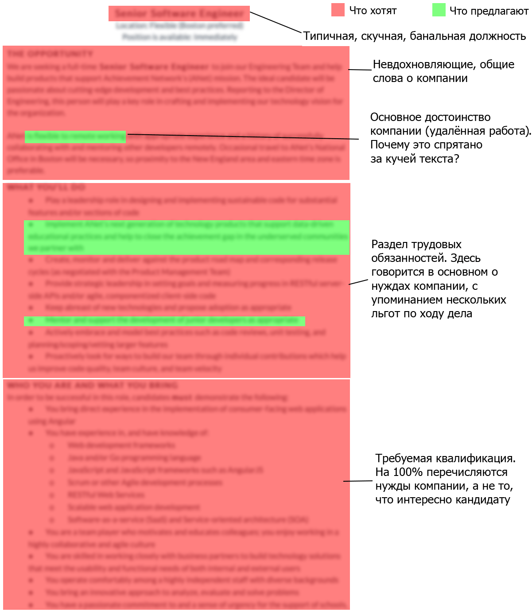

Приглашая опытного разработчика, вы не покупаете, а продаёте

Несомненно, нанять опытного программиста сложно. Но я не верю, что рынок полностью иссяк. На протяжении карьеры я работал со многими командами, которые делятся на две категории: те, которые никак не могут нанять опытных разработчиков, и те, которые привлекают их с лёгкостью. На самом деле у второй категории вообще не было проблем с наймом.

Есть много причин, почему некоторым не удаётся привлечь талантов. Однако все команды, которые делали это с лёгкостью, поняли один простой факт о текущей ситуации на рынке:

_**При найме сеньоров не компания выбирает кандидата, а кандидат выбирает компанию.**_

Проще говоря:

_**Приглашая опытного разработчика, вы не покупаете, а продаёте.**_  
  
Если вы не согласны, позвольте рассказать о своём опыте. Несколько лет назад моё резюме попало к рекрутерам. На тот момент у меня было около трёх лет опыта работы инженером-программистом в небольших компаниях. Несколько дней почтовый ящик штурмовала лавина писем с предложениями. В другой раз резюме опять попало к рекрутерам — и они звонили по три раза в день.

Эта история ничего не говорит о моих способностях как программиста. Такие истории могут рассказать многие коллеги с разным уровнем квалификации. В текущей рыночной ситуации у инженера с многолетним опытом работы множество вариантов.

Самое смешное, что в обоих случаях мне не особенно нравилась текущая работа. Меня интересовали другие варианты, но эти рекрутеры настолько плохо сработали, что я отказался даже встретиться с кем-то из них лично. Так что не думайте, что сеньоры не заинтересованы в вашем предложении: просто нужно сделать его убедительным — вы должны продать его! Большинство HR-менеджеров и рекрутеров, с которыми я разговаривал, склонны согласиться с этим утверждением. Но если посмотреть на реальные действия, они не соответствуют их словам.

На самом деле, почти вся система современного рекрутинга неудовлетворительна. Оно плохо работает для всех вовлечённых сторон, но особенно для кандидата. Рассмотрим несколько конкретных областей.

Представьте, что вы ищете кандидата на другую (не техническую) должность. Вы разместили объявление и получили более 200 резюме. Сколько времени вы потратите на каждое резюме? Минуту или две, даже меньше? Именно так ведёт себя опытный программист при поиске работы.

Ваше объявление — как резюме кандидата. Он потратит всего несколько секунд на оценку, и если оно не привлечет его внимания, пойдёт дальше. К сожалению, большинство объявлений ужасны.

Рассмотрим типичное объявление на вакансию ведущего программиста. Я пошёл на один из больших сайтов с вакансиями и ввёл в поиск \[Senior Software Engineer\]. Выбрал случайную публикацию — и заблюрил её, чтобы не светить конкретную компанию. Красные области говорят о потребностях работодателя, а зелёные зоны — о том, что работодатель может предложить кандидату.

Если мыслить категориями покупки, это совершенно нормально — вы говорите, что вам нужно. Но если исходить из логики продажи, это безумие! Вы привыкли читать резюме: представьте, что в резюме кандидата более 50% текста о том, что он хочет.

Вместо этого, вероятно, резюме будет на 100% содержать информацию о достоинствах кандидата и преимуществах, которые он может дать компании. Человек оптимизировал текст и поместил самые убедительные аргументы на самые видные места.

Выходя за рамки объявлений, о большинстве компаний вообще трудно найти важную информацию. Будьте честны, легко ли найти ответы на все вопросы, которые очень важны для будущих сотрудников? В одном клике от вашей вакансии?

*   Как организована компания?  
    
*   Какой стиль управления и методологию разработки (например, Scrum, XP) использует команда? Есть ли у руководства техническая подготовка?  
    
*   Сколько человек в команде?  
    
*   Как вы отслеживаете рабочие часы? Отслеживаете время прихода и ухода?  
    
*   Над каким продуктом/областью я буду работать?  
    
*   Как выглядит офис? Какое оборудование я буду использовать?  
    
*   Как люди обычно одеваются в офисе?  
    
*   Команда ходит обедать вместе?  
    
*   …

Конечно, у разных людей разные потребности. Не всем интересен каждый из этих вопросов, но для многих ответы критически важны.

Например, коллеги часто рассказывали о плохом опыте работы с менеджерами-гуманитариями. В будущем они категорически отказываются работать с такими людьми. Поэтому если у вас есть менеджер с техническим образованием — обязательно доведите эту информацию до кандидатов. Для некоторых это очень мощный стимул!

Посмотрите с другой стороны, поставьте себя на место соискателя. Представьте, что вы хотите купить новый компьютер. Вы видите объявление, которое кажется интересным, но у вас все ещё остались вопросы. Тогда вы идёте на сайт продавца, но не можете найти ответы. Продолжаете искать — и через некоторое время, наконец, находите номер телефона. Вы звоните, но, к сожалению, собеседник не может ответить на все эти вопросы. Вместо этого он просит отправить письмо, в котором вы подробно изложите, почему хотите купить компьютер. Вы также должны отправить доказательство, что у вас достаточно денег на покупку. После этого, возможно, вас пригласят на личную встречу, где они с радостью ответят на все интересующие вас вопросы о компьютере.

Вы действительно пойдёте через весь этот процесс? Или просто поищете другой компьютер, где продавец без заморочек? Таков опыт большинства кандидатов, которые пытаются получить ответы на вопросы выше. У большинства компаний вы ничего не узнаете, пока не пройдёте собеседование. Это тупик для большинства инженеров, что подводит меня к следующему пункту.

Вернёмся к примеру с покупкой компьютера. Представьте, что вы прошли через весь процесс — и попали в магазин. У вас ещё остались вопросы, и вы ждёте сотрудника, чтобы он ответил на них. Но он опаздывает на полчаса. Затем продолжает спрашивать, почему вы хотите купить компьютер, не отвечая ни на один из ваших вопросов. Когда наконец до них доходит дело, то говорит, что у него больше нет времени. Или что не может ответить, потому что не знает специфику этого компьютера. Просит зайти попозже. И вообще сначала надо пройти компьютерную викторину — и проверить, что вы достаточно хорошо знаете компьютер, чтобы его купить. Когда вы отправите тест (который отнял у вас больше часа личного времени), вы ничего не услышите от них в течение нескольких недель.

Я лично испытал всё это.

Разберём сценарий по пунктам, с рекомендациями. Большинство из них кажутся очевидными, но многие компании почему-то не могут их понять.

*   Не опаздывать. Не заставляйте кандидата ждать.  
    
*   Хорошо подготовиться. Вы должны прочитать резюме кандидатов и структуру интервью. Вы должны знать как можно больше о должности и ответить на все вопросы.  
    
*   Быть дружелюбным. Это кажется очевидным, но это очень важно, а многие компании не справляются. Это вопрос менталитета. Создайте ощущение, что вам действительно нужен этот человек. Никогда не думайте, что он должен что-то доказать, если что-то доказать должны вы. Даже если кандидат окажется слабым, всё равно лучше произвести на него хорошее впечатление. Может быть, он расскажет друзьям о своём опыте или повторно пришлёт резюме через несколько лет, отточив навыки.  
    
*   Быстро принимать решения, без нахальства.

  

Понятно, что вы хотите знать, способен ли человек действительно выполнять свою работу и делать её хорошо. Возвращаясь к приведённому выше примеру с покупкой компьютера, конечно же продавец хочет убедиться, что у вас есть деньги. Но если он умён, то просто предположит, что деньги есть. Он проверит это предположение только в самый последний момент.

Вы должны сделать то же самое. Конечно, этот момент во многом зависит от вашей конкретной ситуации и ресурсов. Если у вас много претендентов, то нужно произвести некую предварительную оценку их навыков. Но в любом случае поступайте как умный продавец и постарайтесь сделать так, чтобы кандидат действительно захотел эту работу. И когда дело дойдётт до оценки, она должна быть максимально быстрой и безболезненной для кандидата.

Мнения по этому поводу расходятся, но если собеседование проводит другой инженер, то, возможно, нет необходимости проводить формальную оценку квалификации. По моему опыту, навыки довольно легко оценить: дружеской беседы о технических интересах и последних проектах обычно достаточно. Если вы решите, что необходима формальная оценка, позвольте кандидату выбрать между небольшим заданием на дом и ограниченной по времени задачей в офисе. В любом случае рекомендую давать задание как можно ближе к реальной работе. Пусть пользуются собственным ноутбуком, доступом в интернет, задают вопросы. Это должно быть больше похоже на совместную работу, чем на проверку навыков.

Эти темы заслуживают отдельной статьи. Первые дни в компании могут быть важнее, чем сама процедура приёма на работу. Не буду вдаваться в детали, но имейте в виду, что если процессы в компании не очень отлажены, то могут возникнуть трудности с наймом отличных людей, даже при идеальных продажах.

Возможно, тут от вас мало что зависит. Но, по крайней мере, вы знаете о преимуществах и недостатках своей компании и можете чётко донести их до кандидата.

К счастью, многое тут субъективно. Как я уже упоминал, у разных людей разные требования к работе. Некоторые любят работать из дома, другие предпочитают проводить время в офисе с отличной командой. Важно, чтобы вы поговорили с сотрудниками и знали, что они предпочитают и как они справляются прямо сейчас. Эти знания позволят наилучшим образом донести информацию до потенциальных кандидатов.

Кроме того, отдельные менеджеры просто не допускают некоторых вольностей, таких как работа из дома или гибкий график. Даже когда вы настроены на продажу, то не сможете удовлетворить все запросы кандидата, и это нормально. Просто имейте в виду, что отсутствие некоторых льгот является потенциальной слабостью вашей компании, когда дело доходит до найма инженеров. Полезно знать слабости своего «продукта», чтобы лучше его преподнести. И, возможно, стоит открыто рассказать о них. В первую очередь, это предотвратит найм неподходящих кандидатов.

Если вы раньше нанимали персонал в другой отрасли, то сложно изменить мышление. В большинстве отраслей «продавец» — это кандидат. Смена ролей несёт много последствий. Все системы, инструменты и процессы, которые мы создавали на протяжении десятилетий, больше не применимы или могут быть значительно улучшены.

Поэтому мой совет — прекратите сопротивляться, смиритесь с ролью продавца и приступите к хорошей работе. Предпринимая любое действие по поиску кандидатов, поставьте себя на место профессионала, у которого на столе лежит пять предложений. Задайте себе вопрос: «Как мне победить конкурентов?» Также убедитесь, что все коллеги, кто участвует в найме, понимают ситуацию — например, поделитесь с ними этой статьёй! ;-)