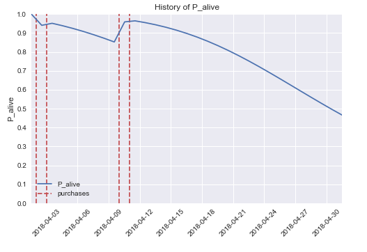
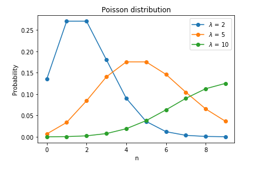
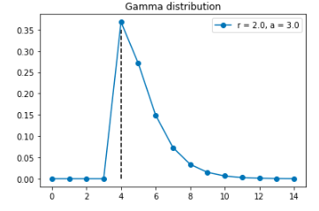
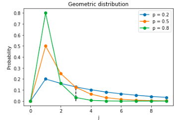
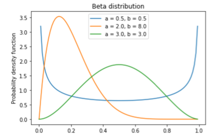
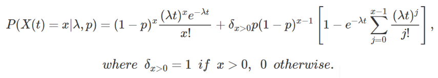
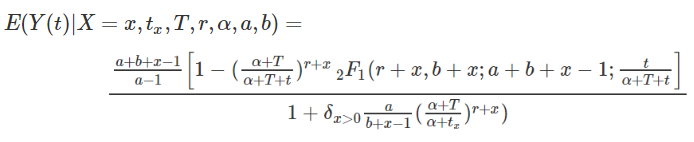
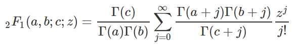
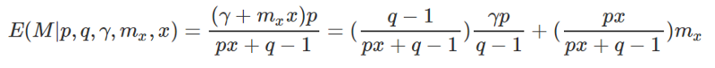

Применяем data science для определения жизненного цикла клиента

Привет, Хабр! Представляю вашему вниманию перевод моей статьи ["Understanding the Customer Lifetime Value with Data Science"](https://medium.com/taxify-labs/understanding-the-customer-lifetime-value-with-data-science-c14dcafa0364).

_Взаимоотношения с клиентами важны для каждой компании и играют ключевую роль в росте бизнеса. Одна из наиболее важных метрик в этой сфере — пожизненная ценность клиента (customer lifetime value, далее LTV) — предсказание чистого дохода, связанного со всеми будущими отношениями с клиентом. Чем дольше клиенты продолжают пользоваться продуктами компании, увеличивая прибыль, тем выше их LTV.  
_  
Есть много маркетинговых статей, о том, как важны LTV и сегментирование клиентов. Но, как Data Scientist’а, меня больше интересуют формулы и я хочу понимать, как модель на самом деле работает. Как предсказать LTV, используя только 3 признака? В этом посте, я покажу некоторые модели, которые используются для маркетинговой сегментации клиентов и объясню математику, на которой они основаны. Здесь будет много формул, но не переживайте: все уже готово в библиотеках Python. Цель этого блога показать, как математика делает всю работу.

  

### Beta-geometric/negative binomial модель для определения вероятности, что клиент “жив”

Рассмотрим такой пример \[из онлайн-сервиса для заказа поездок (такси) по городу\]: пользователь зарегистрировался 1 месяц назад, сделал 4 поездки и последняя поездка состоялась 20 дней назад. Основываясь только на этих данных, такая эта модель может предсказать вероятность, что клиент будет активен в течение определенного периода времени (как показано на графике), а также число транзакций в будущем (которое является основой для понимания ценности клиента в течение всей его “жизни” — взаимоотношений клиента и компании).

_Модель дает прямое руководство к действию для бизнеса: предпринять маркетинговые меры по отношению к пользователю, когда его вероятность активности снижается ниже определенного уровня, чтобы предотвратить его уход._

Эта модель была предложена [Fader, Hardie and Lee](http://mktg.uni-svishtov.bg/ivm/resources/Counting_Your_Customers.pdf) и называется Beta Geometric / Negative Binomial distribution model (BG/NBD).

BG/NBD модель обладает такими свойствами:

Когда пользователь активен, количество его транзакций за период _t_ описывается распределением Пуассона с параметром транзакций _λ_.

_Распределение Пуассона помогает предсказать происходящие события, используя данные о том, как часто события происходили в прошлом. Например, если пользователь делал в среднем 2 поездки в неделю (λ=2 на графике ниже), то вероятность того, что он сделает 3 заказа на следующей неделе равна 0.18._

  

1.  Гетерогенность параметра транзакций среди пользователей (что означает, как клиенты отличаются друг от друга в покупательском поведении) имеет Гамма распределение с параметрами _r (форма)_ и _α (масштаб)_.

_Гамма распределение подходит для процессов со временем ожидания между событиями с распределением Пуассона (в нашем случае для параметра транзакций _λ_). Например, рассмотрим пользователя, который делает в среднем 2 транзакции в неделю. В таком случае, вероятность того, что время ожидания до того, как пользователь сделает 3 покупки будет больше 4 недель, равна области на графике справа от вертикальной пунктирной линии (под голубой линией распределения) — 0.13._

  

1.  Пользователи могут стать неактивными после любой транзакции с вероятностью _p_, и точка их ухода (когда они становятся неактивными) распределена между покупками по Геометрическому закону.

_Геометрическое распределение похоже на Бернулли исходы и используется для моделирования количества исходов до (и включая) первый успешный исход. Если для некоторого пользователя _p=0.2_, то его вероятность быть неактивным после 3 транзакций равна 0.12 (синяя линия на графике)._

  

1.  Гетерогенность (вариации между пользователями) в вероятности ухода имеет Бета распределение с параметрами формы _α_ и _β_.

_Бета распределение лучшим образом подходит для представления вероятностных распределений вероятностей — случай, когда мы не знаем вероятность заранее, но у нас есть некоторое обоснованные априорные предпосылки, описываемые _α_ и _β_ (мат. ожидание Бета распределения _α/(α+β))_._

Для предыдущего примера с пользователем, у которого априорная вероятность ухода равна 0.2, оранжевая линия на графике с α=2 и _β=8_ описывает функцию плотности вероятности для вероятности ухода пользователя.

  

1.  Параметр транзакций и вероятность ухода независимо распределены между пользователями.

Математическая нотация для признаков пользователя _X_:

X=x,tx,T

где x — число транзакций за некоторый период времени _(0,T\]_, и tx(<=T) — время последней покупки.  
Основываясь только на этих признаках, модель предсказывает будущие покупательские предпосылки пользователей:  
P(X(t)=x) — вероятность x транзакций за период t в будущем,  
E(Y(t)|X=x,tx,T) — ожидаемое число транзакций за период для пользователя с определенным поведением.

Теперь мы можем найти эти два главных показателя. Не вдаваясь в детали, я покажу финальные формулы (больше выкладок в статьях).

Вероятность быть активным:

Ожидаемое число транзакций:

где 2F1 — гипер-геометрическая функция Гаусса

  

### Гамма-гамма модель для оценки LTV

До этого момента, мы использовали только частоту и недавность покупок клиента. Но в дополнение к этому, мы можем применить денежную составляющую его транзакций. Добавим новые данные в наш пример: пользователь сделал эти 4 поездки по цене 10, 12, 8, 15. Гамма-гамма модель помогает предсказать наиболее вероятную ценность транзакции в будущем.  
Суммирую все вместе, теперь у нас есть все элементы, чтобы определить LTV клиента:

_**LTV = ожидаемое число транзакций _цена транзакии_ маржа**_

где первый элемент из BG/NB модели, второй — из Гамма-гамма модели, а маржа устанавливается бизнесом.

_Математическая нотация для гамма-гамма модели:_  
Пользователь совершил x транзакций с ценностью z1,z2,… и mx=Zi/x — наблюдаемое среднее ценности транзакции.  
E(M) — скрытое среднее ценности транзакции, и то, что нам интересно — E(M|mx,x) — ожидаемая денежная ценность пользователя, основанная на его покупательском поведении.

Свойства Гамма-гамма модели:  
Денежная ценность транзакций пользователя случайна и находится в пределах их средних транзакционных ценностей.

Средняя ценность транзакции варьируется среди пользователей, но не варьируется для конкретного пользователя во времени.

Средняя ценность транзакции имеет Гамма распределение среди пользователей.

В статьях подробно описывается вывод формулы через еще несколько Гамма распределений. В итоге получается:

где _p_ параметр формы и _v_ параметр масштаба гамма распределения для транзакций Zi,q параметр формы и γ параметр масштаба для гамма распределения _v_ (допущение модели, что _p_ постоянно — коэффициенты вариации на индивидуальном уровне одни и те же для пользователей). Как и раньше, мы можем использовать метод максимума правдоподобия, чтобы найти параметры модели.

Мы закончили с математикой и теперь мы можем оценить LTV пользователей. Но что насчет точности этой модели?

  

### Оценка точности модели

Традиционный подход предлагает разделить данные на две группы — часть для тренировки, часть для теста. В статьях авторы показывают, что их подход работает хорошо. Я тоже попробовала эти модели на реальных данных и тоже получила похожие результаты.

График показывает распределение реальных и предсказанных транзакций для данных из тестовой группы: ошибка здесь составляет 2.8%.

  

### Как применять

Как я говорила в начале, все модели уже имплементированы. Например, библиотека Python “[lifetimes](https://lifetimes.readthedocs.io/en/master/)” содержит все функции и метрики, необходимые, чтобы определить LTV. Детально написанная документация содержит много примеров и объяснений. Там также есть примеры sql запросов, чтобы получать данные в необходимом формате. Так что приступить к работе можно всего за несколько минут.

  

### Заключение

В этом посте, я показала в деталях, как LTV пользователей может быть оценено, используя только несколько признаков.

Я хочу заметить, что иногда можно отойти от часто используемых gradient boosted trees и попробовать другие подходы, которые имеют сравнимый уровень точности. Статистическое обучение все еще может быть использовано на практике и может помочь бизнесу лучше понимать клиентов.

  

#### References

[Fader, Peter & G. S. Hardie, Bruce & Lok Lee, Ka. (2005). “Counting Your Customers” the Easy Way: An Alternative to the Pareto/NBD Model. Marketing Science.](http://mktg.uni-svishtov.bg/ivm/resources/Counting_Your_Customers.pdf)  
[Fader, Peter & G. S. Hardie, Bruce (2013). The Gamma-Gamma Model of Monetary Value.](http://www.brucehardie.com/notes/025/gamma_gamma.pdf)  
[Fader, Peter S., Bruce G. S. Hardie, and Ka Lok Lee (2005), “RFM and CLV: Using Iso-value Curves for Customer Base Analysis,” Journal of Marketing Research.](http://brucehardie.com/papers/rfm_clv_2005-02-16.pdf)