Пробую .NET Core + Kubernetes + appmetrics + prometheus + grafana + jobs + health checks

Краткое знакомство с kubernetes для разработчиков на примере разворачивания простого шаблонного сайта, с постановкой его на мониторинг, выполнением джобов по расписанию и health checks (все исходники прилагаются)

— [Установка Kubernetes](https://habr.com/ru/post/437286/#1)  
— [Установка UI](https://habr.com/ru/post/437286/#2)  
— [Запуск своего приложения в кластере](https://habr.com/ru/post/437286/#3)  
— [Добавление кастомных метрик в приложение](https://habr.com/ru/post/437286/#4)  
— [Сбор метрик через Prometheus](https://habr.com/ru/post/437286/#5)  
— [Отображение метрик в Grafana](https://habr.com/ru/post/437286/#6)  
— [Выполнение задач по расписанию](https://habr.com/ru/post/437286/#7)  
— [Отказоустойчивость](https://habr.com/ru/post/437286/#8)  
— [Выводы](https://habr.com/ru/post/437286/#9)  
— [Заметки](https://habr.com/ru/post/437286/#10)  
— [Список литературы](https://habr.com/ru/post/437286/#11)  
  

## Установка Kubernetes

_не подходит для linux-пользователей, вам придётся использовать [minikube](https://kubernetes.io/docs/tasks/tools/install-minikube/#linux)_

1.  У тебя есть Docker Desktop
2.  В нём нужно найти и включить Kubernetes single-node cluster  
    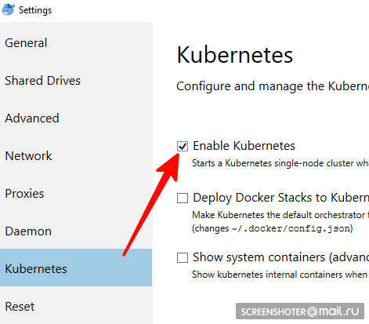
3.  Теперь у тебя есть апи [http://localhost:8001/](http://localhost:8001/) для работы с кубернетисом
4.  Общение с ним происходит через удобную утилиту kubectl  
    Проверь её версию командой \> `kubectl version`  
    Последняя актуальная пишется сюда [https://storage.googleapis.com/kubernetes-release/release/stable.txt](https://storage.googleapis.com/kubernetes-release/release/stable.txt)  
    Скачать можно по соответствующей ссылке [https://storage.googleapis.com/kubernetes-release/release/v1.13.2/bin/windows/amd64/kubectl.exe](https://storage.googleapis.com/kubernetes-release/release/v1.13.2/bin/windows/amd64/kubectl.exe)
5.  Проверь, что кластер работает \> `kubectl cluster-info`

  

## Установка UI

  

1.  Интерфейс разворачивается в самом же кластере  
    
        kubectl create -f https://raw.githubusercontent.com/kubernetes/dashboard/master/aio/deploy/recommended/kubernetes-dashboard.yaml
    
2.  Получи токен, для доступа к интерфейсу
    
        kubectl describe secret
    
      
    И копируй  
    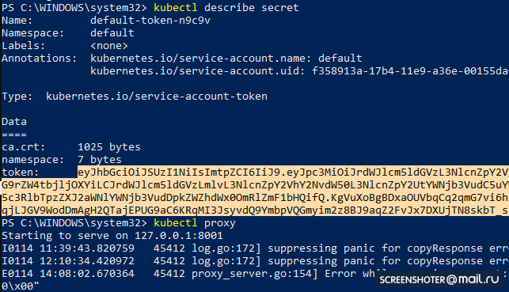
3.  Теперь запускай прокси
    
        kubectl proxy
    
4.  И можешь пользоваться [http://localhost:8001/api/v1/namespaces/kube-system/services/https:kubernetes-dashboard:/proxy/](http://localhost:8001/api/v1/namespaces/kube-system/services/https:kubernetes-dashboard:/proxy/)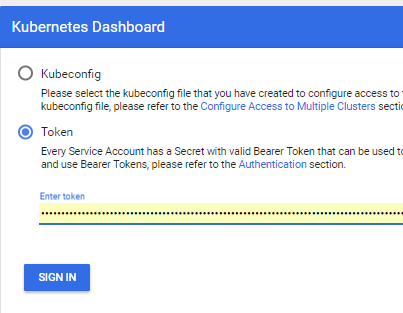

## Запуск своего приложения в кластере

  

1.  Я сделал стандартное mvc netcoreapp2.1 приложение через студию [https://github.com/SanSYS/kuberfirst](https://github.com/SanSYS/kuberfirst)
2.  Dockerfile:
    
        FROM microsoft/dotnet:2.1-aspnetcore-runtime AS base
        WORKDIR /app
        EXPOSE 80
         
        FROM microsoft/dotnet:2.1-sdk AS build
        WORKDIR /src
        COPY ./MetricsDemo.csproj .
        RUN ls
        RUN dotnet restore "MetricsDemo.csproj"
        COPY . .
        RUN dotnet build "MetricsDemo.csproj" -c Release -o /app
         
        FROM build AS publish
        RUN dotnet publish "MetricsDemo.csproj" -c Release -o /app
         
        FROM base AS final
        WORKDIR /app
        COPY --from=publish /app .
        ENTRYPOINT ["dotnet", "MetricsDemo.dll"]
    
3.  Собрал это дело с тэгом metricsdemo3
    
        docker build -t metricsdemo3 .
    
4.  Но! Кубер по дефолту тянет образы из хаба, потому поднимаю локальный регистри
5.  заметка — не пробовал запускать в кубернетисе
    
        docker create -p 5000:5000 --restart always --name registry registry:2
        
    
6.  И прописываю его, как разрешённый небезопасный:  
    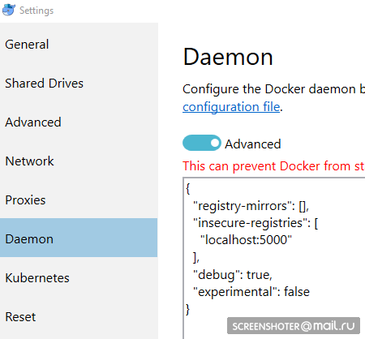
    
        {
         "registry-mirrors": [],
         "insecure-registries": [
          "localhost:5000"
         ],
         "debug": true,
         "experimental": false
        }
    
7.  Перед пушем в регистри ещё пару телодвижений
    
        docker start registry
        docker tag metricsdemo3 localhost:5000/sansys/metricsdemo3
        docker push localhost:5000/sansys/metricsdemo3
    
8.  Получится примерно так:  
    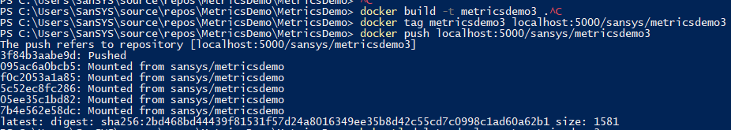
9.  **Запуск через UI**
    
    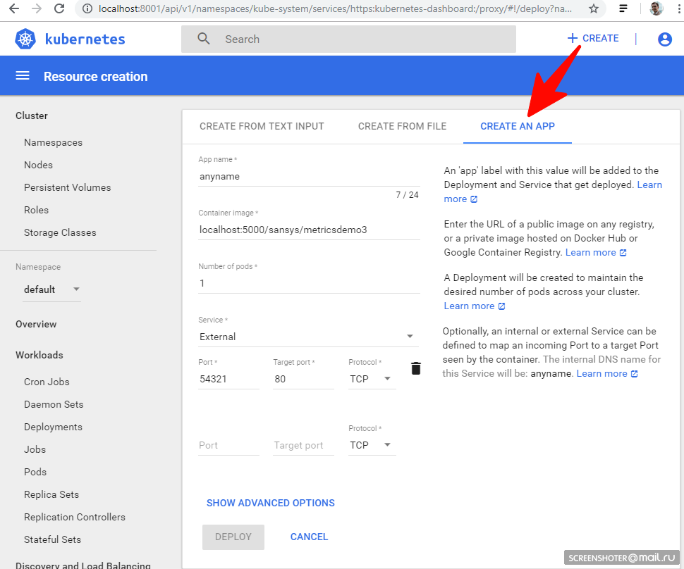  
    

#### Если запустился, то всё ок и можно приступать к эксплуатации

Создай файл деплоя

**1-deployment-app.yaml**

    kind: Deployment
    apiVersion: apps/v1
    metadata:
      name: metricsdemo
      labels:
        app: web
    spec:
      replicas: 2 
     
      
      selector:
        matchLabels:
          app: metricsdemo
     
      template:
        metadata:
          labels:
            app: metricsdemo 
        spec:
          containers:
          - name: metricsdemo 
            image: localhost:5000/sansys/metricsdemo3 
            ports:
            - containerPort: 80 
     
    
    ---
     
    kind: Service
    apiVersion: v1
    metadata:
      name: metricsdemo 
      labels:
        apptype: business 
        instancetype: web 
    spec:
      selector:
        app: metricsdemo 
      type: LoadBalancer 
      ports:
      - protocol: TCP 
        port: 9376
        targetPort: 80
        name: portapi 

Небольшое описание

*   Kind — указывает, что за тип сущности описывается через yaml файл
*   apiVersion — в какое апи передаётся объект
*   labels — по сути просто метки (ключи слева и значения можно придумывать самим)
*   selector — позволяет связывать сервисы с деплоем, к примеру, через метки

Далее:

    kubectl create -f .\1-deployment-app.yaml
    

И вы должны увидеть в интерфейсе свой деплой [http://localhost:8001/api/v1/namespaces/kube-system/services/https:kubernetes-dashboard:/proxy/#!/deployment?namespace=default](http://localhost:8001/api/v1/namespaces/kube-system/services/https:kubernetes-dashboard:/proxy/#!/deployment?namespace=default)

**Скрин**

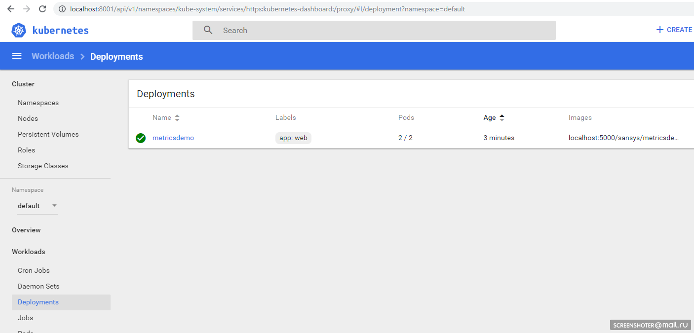

Внутри которого есть Replica Set, показывающий, что приложение запущено в двух экземплярах (Pods) и есть один связанный сервис с адресом из вне, чтобы открыть задеплоенное приложение в браузере

**Скрины**

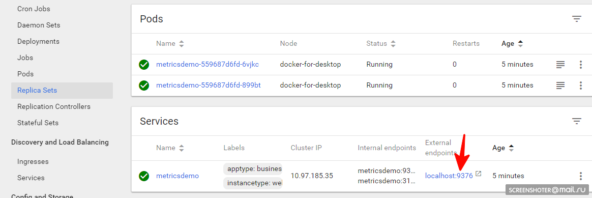  
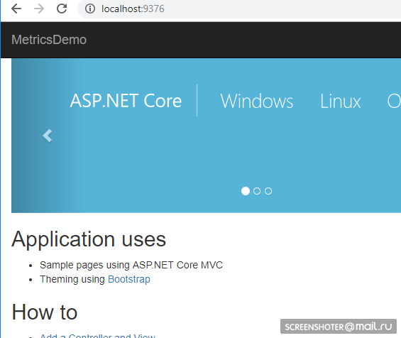  

  

## Добавление кастомных метрик в приложение

В приложение добавил пакет [https://www.app-metrics.io/](https://www.app-metrics.io/)  
Расписывать подробно, как их добавлять не буду, пока кратко — регистрирую мидлварю для инкремента счётчиков вызовов методов апи

**Вот так выглядит мидлваря**

    private static void AutoDiscoverRoutes(HttpContext context)
    {
        if (context.Request.Path.Value == "/favicon.ico")
            return;
     
        List<string> keys = new List<string>();
        List<string> vals = new List<string>();
     
        var routeData = context.GetRouteData();
        if (routeData != null)
        {
            keys.AddRange(routeData.Values.Keys);
            vals.AddRange(routeData.Values.Values.Select(p => p.ToString()));
        }
     
        keys.Add("method");     vals.Add(context.Request.Method);
        keys.Add("response");   vals.Add(context.Response.StatusCode.ToString());
        keys.Add("url");        vals.Add(context.Request.Path.Value);
     
        Program.Metrics.Measure.Counter.Increment(new CounterOptions
        {
            Name = "api",
            //ResetOnReporting = true, // обнулять, если коллетор собрал данные
            MeasurementUnit = Unit.Calls,
            Tags = new MetricTags(keys.ToArray(), vals.ToArray())
        });
    }
    

И собранные метрики доступны по адресу [http://localhost:9376/metrics](http://localhost:9376/metrics)

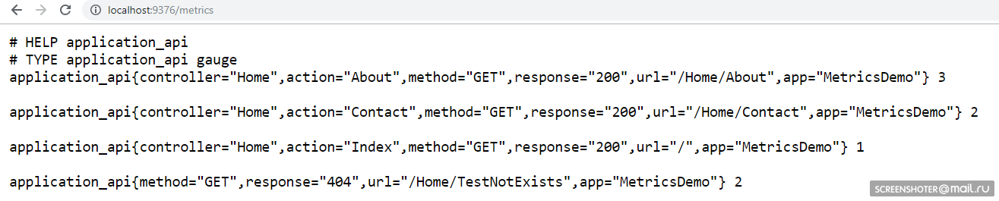

\* IMetricRoot или его абстракцию можно спокойно регистрировать в сервисах и юзать в приложении ( _services.AddMetrics(Program.Metrics);_ )

## Сбор метрик через Prometheus

Самая базовая настройка прометеуса: добавить в его конфиг (prometheus.yml) новый job и скормить ему новый таргет:

    global:
      scrape_interval:     15s
      evaluation_interval: 15s
     
    rule_files:
      
      
     
    scrape_configs:
      - job_name: prometheus
        static_configs:
          - targets: ['localhost:9090', 'ещё_один_сервис:порт']

Но у прометеуса есть нативная поддержка сбора метрик из кубернетиса [https://prometheus.io/docs/prometheus/latest/configuration/configuration/#kubernetes\_sd\_config](https://prometheus.io/docs/prometheus/latest/configuration/configuration/#kubernetes_sd_config)  
Мониторить я хочу каждый сервис в отдельности фильтруя по метке apptype: business  
Ознакомившись с докой джоб получается таким:

    - job_name: business-metrics 
      metrics_path: /metrics
      kubernetes_sd_configs:
        - role: endpoints 
      static_configs:
      - targets:
        - localhost:9090
      relabel_configs: 
      - action: keep
        regex: default;business
        source_labels:
        - __meta_kubernetes_namespace
        - __meta_kubernetes_service_label_apptype

В кубернетисе есть специальное место для хранения файлов конфигов — [ConfigMap](https://kubernetes.io/docs/tasks/configure-pod-container/configure-pod-configmap/)  
Вот там этот конфиг и сохраняю:

**2-prometheus-configmap.yaml**

    apiVersion: v1
    kind: ConfigMap 
    metadata:
      name: prometheus-config 
      namespace: default
      labels:
        kubernetes.io/cluster-service: "true"
        addonmanager.kubernetes.io/mode: EnsureExists
    data:
      
      prometheus.yml: |
        global:
          scrape_interval:     5s 
          evaluation_interval: 5s 
        scrape_configs:
        - job_name: prometheus
          static_configs:
          - targets:
            - localhost:9090
     
        - job_name: business-metrics 
          metrics_path: /metrics
          kubernetes_sd_configs:
            - role: endpoints 
          static_configs:
          - targets:
            - localhost:9090
          relabel_configs: 
          - action: keep
            regex: default;business
            source_labels:
            - __meta_kubernetes_namespace
            - __meta_kubernetes_service_label_apptype
    

Отправление в кубернетис

    kubectl create -f .\2-prometheus-configmap.yaml

Теперь нужно задеплоить прометеус с этим файлом конфига

**kubectl create -f .\\3-deployment-prometheus.yaml**

    apiVersion: extensions/v1beta1
    kind: Deployment
    metadata:
      name: prometheus
      namespace: default
    spec:
      replicas: 1
      template:
        metadata:
          labels:
            app: prometheus-server
        spec:
          containers:
            - name: prometheus
              image: prom/prometheus
              args:
                - "--config.file=/etc/config/prometheus.yml"
                - "--web.enable-lifecycle"
              ports:
                - containerPort: 9090
              volumeMounts:
                - name: prometheus-config-volume 
                  mountPath: /etc/config/ 
          volumes:
            - name: prometheus-config-volume 
              configMap:
                defaultMode: 420
                name: prometheus-config 
     
    ---
     
    kind: Service
    apiVersion: v1
    metadata:
      name: prometheus
    spec:
      selector:
        app: prometheus-server 
      type: LoadBalancer 
      ports:
      - protocol: TCP
        port: 9090
        targetPort: 9090
    

Обрати внимание — файл prometheus.yml нигде не указывается  
Все файлы, которые были указаны в конфиг-мапе становятся файлами в разделе prometheus-config-volume, который монтируется в директорию /etc/config/  
Также у контейнера указаны аргументы запуска с путём до конфига  
--web.enable-lifecycle — говорит о том, что можно дёрнуть POST /-/reload, что применит новые конфиги (полезно, если конфиг меняется «на лету» и не хочется перезапускать контейнер)

Собственно деплой

    kubectl create -f .\3-deployment-prometheus.yaml

Последи малость за подъёмом подов и ходи по адресу [http://localhost:9090/targets](http://localhost:9090/targets), должен там увидеть эндпоинты своего сервиса

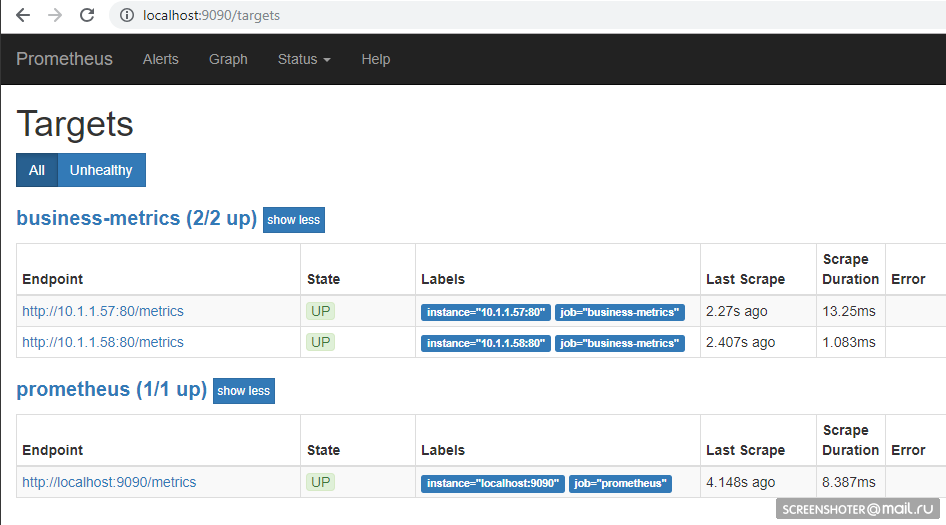

А на главной странице можно писать запросы к прометеусу

    sum by (response, action, url, app) (delta(application_api[15s]))

  

**При условии, что по сайту таки кто-то походил, то получится так**

  

Язык запросов — [https://prometheus.io/docs/prometheus/latest/querying/basics/](https://prometheus.io/docs/prometheus/latest/querying/basics/)

## Отображение метрик в Grafana

Нам повезло — до версии 5 конфиги дашборд можно было только по HTTP API подсунуть, но теперь можно проделать тот же трюк, что и с прометеусом  
Графана по дефолту при запуске [умеет подтягивать конфиги](http://docs.grafana.org/administration/provisioning/) источников данных и дашборд

1.  `/etc/grafana/provisioning/datasources/` — конфиги источников (настройки доступа к прометеус, постгрес, заббикс, эластик и т.п.)
2.  `/etc/grafana/provisioning/dashboards/` — настройки доступа к дашбордам
3.  `/var/lib/grafana/dashboards/` — тут буду хранить сами дашборды в виде json-файлов

  

**Получилось вот так**

    apiVersion: v1
    kind: ConfigMap
    metadata:
      creationTimestamp: null
      name: grafana-provisioning-datasources
      namespace: default
    data:
      all.yml: |
        datasources:
        - name: 'Prometheus'
          type: 'prometheus'
          access: 'proxy'
          org_id: 1
          url: 'http://prometheus:9090'
          is_default: true
          version: 1
          editable: true
     
    ---
     
    apiVersion: v1
    kind: ConfigMap
    metadata:
      creationTimestamp: null
      name: grafana-provisioning-dashboards
      namespace: default
    data:
      all.yml: |
        apiVersion: 1
         
        providers:
        - name: 'default'
          orgId: 1
          folder: ''
          type: file
          disableDeletion: false
          updateIntervalSeconds: 10 
          options:
            path: /var/lib/grafana/dashboards
     
    ---
     
    apiVersion: v1
    kind: ConfigMap
    metadata:
      creationTimestamp: null
      name: grafana-dashboards
      namespace: default
    data:
      service-http-requests.json: |
        {
          "annotations": {
            "list": [
              {
                "builtIn": 1,
                "datasource": "-- Grafana --",
                "enable": true,
                "hide": true,
                "iconColor": "rgba(0, 211, 255, 1)",
                "name": "Annotations & Alerts",
                "type": "dashboard"
              }
            ]
          },
          "editable": true,
          "gnetId": null,
          "graphTooltip": 0,
          "links": [],
          "panels": [
            {
              "aliasColors": {},
              "bars": false,
              "dashLength": 10,
              "dashes": false,
              "fill": 1,
              "gridPos": {
                "h": 9,
                "w": 12,
                "x": 0,
                "y": 0
              },
              "id": 2,
              "legend": {
                "alignAsTable": false,
                "avg": false,
                "current": false,
                "max": false,
                "min": false,
                "rightSide": true,
                "show": true,
                "total": false,
                "values": false
              },
              "lines": true,
              "linewidth": 1,
              "links": [],
              "nullPointMode": "null",
              "percentage": false,
              "pointradius": 5,
              "points": false,
              "renderer": "flot",
              "seriesOverrides": [],
              "spaceLength": 10,
              "stack": false,
              "steppedLine": false,
              "targets": [
                {
                  "expr": "sum by (response, action, url, app) (delta(application_api[15s]))",
                  "format": "time_series",
                  "interval": "15s",
                  "intervalFactor": 1,
                  "legendFormat": "{{app}} {{response}} - {{url}}",
                  "refId": "A"
                }
              ],
              "thresholds": [],
              "timeFrom": null,
              "timeRegions": [],
              "timeShift": null,
              "title": "Http requests",
              "tooltip": {
                "shared": true,
                "sort": 0,
                "value_type": "individual"
              },
              "type": "graph",
              "xaxis": {
                "buckets": null,
                "mode": "time",
                "name": null,
                "show": true,
                "values": []
              },
              "yaxes": [
                {
                  "format": "short",
                  "label": null,
                  "logBase": 1,
                  "max": null,
                  "min": null,
                  "show": true
                },
                {
                  "format": "short",
                  "label": null,
                  "logBase": 1,
                  "max": null,
                  "min": null,
                  "show": true
                }
              ],
              "yaxis": {
                "align": false,
                "alignLevel": null
              }
            }
          ],
          "refresh": "5s",
          "schemaVersion": 16,
          "style": "dark",
          "tags": [],
          "templating": {
            "list": []
          },
          "time": {
            "from": "now-30m",
            "to": "now"
          },
          "timepicker": {
            "refresh_intervals": [
              "5s",
              "10s",
              "30s",
              "1m",
              "5m",
              "15m",
              "30m",
              "1h",
              "2h",
              "1d"
            ],
            "time_options": [
              "5m",
              "15m",
              "1h",
              "6h",
              "12h",
              "24h",
              "2d",
              "7d",
              "30d"
            ]
          },
          "timezone": "",
          "title": "Business metrics",
          "uid": "Dm0tD0Qik",
          "version": 1
        }

  

**Сам деплой, ничего нового**

    apiVersion: extensions/v1beta1
    kind: Deployment
    metadata:
      name: grafana
      namespace: default
      labels:
        app: grafana
        component: core
    spec:
      replicas: 1
      template:
        metadata:
          labels:
            app: grafana
            component: core
        spec:
          containers:
          - image: grafana/grafana
            name: grafana
            imagePullPolicy: IfNotPresent
            resources:
              limits:
                cpu: 100m
                memory: 100Mi
              requests:
                cpu: 100m
                memory: 100Mi
            env:
              - name: GF_AUTH_BASIC_ENABLED
                value: "true"
              - name: GF_AUTH_ANONYMOUS_ENABLED
                value: "true"
              - name: GF_AUTH_ANONYMOUS_ORG_ROLE
                value: Admin
            readinessProbe:
              httpGet:
                path: /login
                port: 3000
              
              
            volumeMounts:
            - name: grafana-provisioning-datasources
              mountPath: /etc/grafana/provisioning/datasources/
            - name: grafana-provisioning-dashboards
              mountPath: /etc/grafana/provisioning/dashboards/
            - name: grafana-dashboards
              mountPath: /var/lib/grafana/dashboards/
          volumes:
            - name: grafana-provisioning-datasources
              configMap:
                defaultMode: 420
                name: grafana-provisioning-datasources
            - name: grafana-provisioning-dashboards
              configMap:
                defaultMode: 420
                name: grafana-provisioning-dashboards
            - name: grafana-dashboards
              configMap:
                defaultMode: 420
                name: grafana-dashboards
          nodeSelector:
            beta.kubernetes.io/os: linux
     
    ---
     
    apiVersion: v1
    kind: Service
    metadata:
      name: grafana
      namespace: default
      labels:
        app: grafana
        component: core
    spec:
      type: LoadBalancer
      ports:
      - protocol: TCP
        port: 3000
        targetPort: 3000
      selector:
        app: grafana
        component: core

Разворачиваем

    kubectl create -f .\4-grafana-configmap.yaml
    kubectl create -f .\5-deployment-grafana.yaml

Помни, что графана не сразу поднимается, она немного шарашит миграциями sqlite, что можешь [в логах пода увидеть](http://localhost:8001/api/v1/namespaces/kube-system/services/https:kubernetes-dashboard:/proxy/#!/service/default/grafana?namespace=default)  
Теперь иди по адресу [http://localhost:3000/](http://localhost:3000/)  
И кликай по дашборде

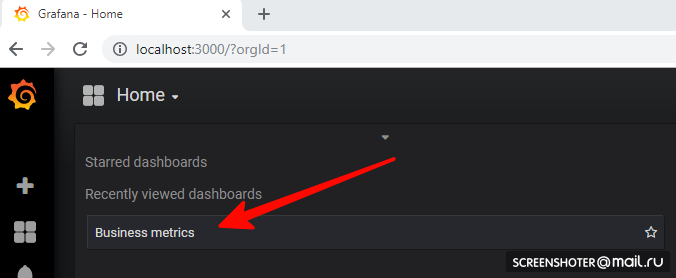  
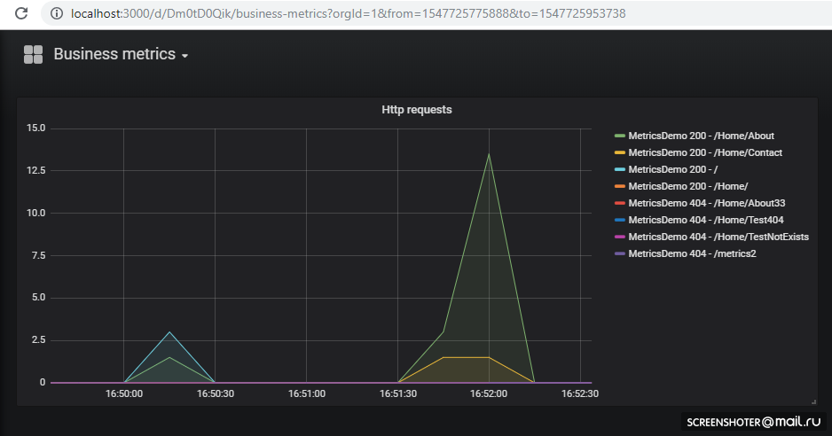

Если хочешь добавить новую вьюху или изменить существующую — меняй прямо в интерфейсе, а после жми Сохранить, получишь модальное окно с json, который нужно засунуть в конфиг-мапу

**Всё развёрнуто и отлично работает**

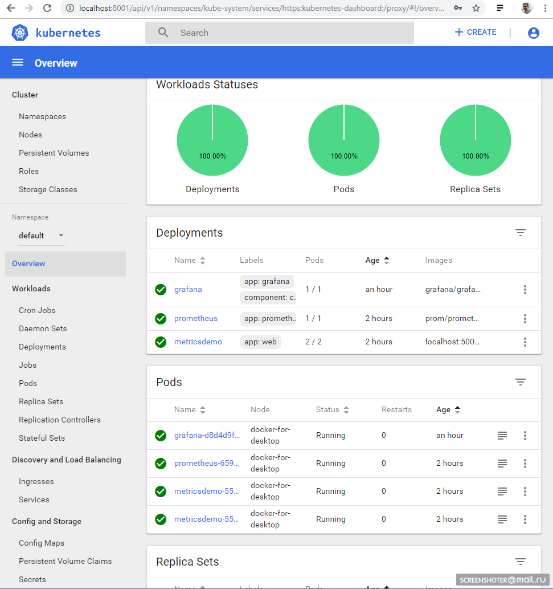

  

## Выполнение задач по расписанию

Для выполнения задач по крону в кубере есть понятие CronJob  
С помощью CronJob можно задать расписание выполнения любых задач, самый простой пример:

    
    apiVersion: batch/v1beta1
    kind: CronJob
    metadata:
      name: runapijob
    spec:
      schedule: "*/1 * * * *"
      jobTemplate:
        spec:
          template:
            spec:
              containers:
              - name: runapijob
                image: busybox
                args:
                - /bin/sh
                - -c
                - date; wget -O - http://metricsdemo:9376/api/job/run/wakeUp > /dev/null
              restartPolicy: OnFailure

В секции schedule задаётся классическое правило для крона  
По триггеру запускается pod контейнера (busybox) в котором я дёргаю метод апи сервиса metricsdemo  
Для слежения за джобом можно воспользоваться командой

    kubectl.exe get cronjob runapijob --watch

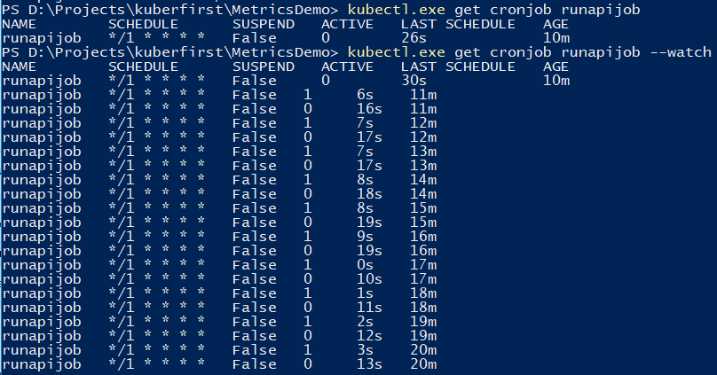

Основной сервис, который дёргается из джоба, запущен в нескольких экземплярах, потому обращение к сервису уходит на один из подов с примерно равномерным разбросом

**Как это выглядит в прометеусе**

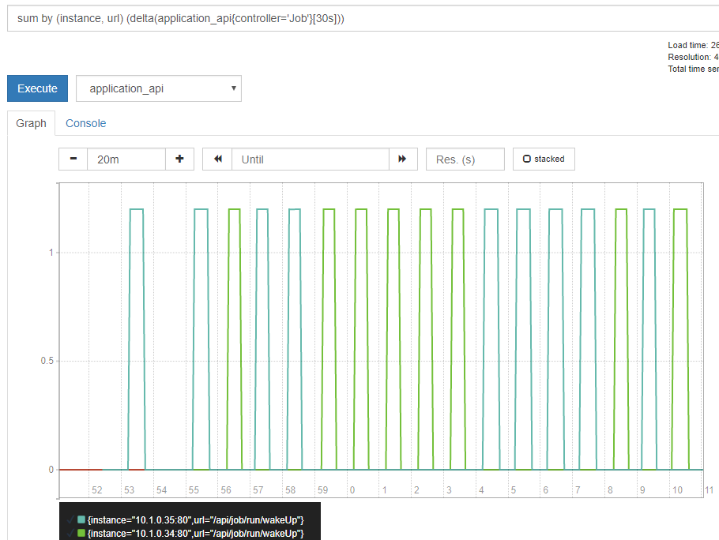

  

**В целях отладки джобы можно триггерить вручную**

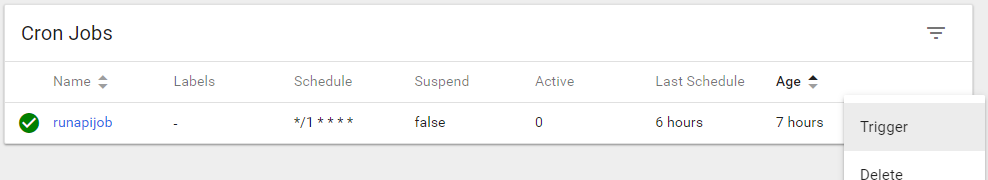

Небольшое демо на примере расчёта числа π, про разницу в запусках из консоли

    
    kubectl run pi --image=perl -- perl -Mbignum=bpi -wle 'print bpi(2000)'
     
    
    kubectl run pi --image=perl --restart=OnFailure -- perl -Mbignum=bpi -wle 'print bpi(2000)'
     
    
    kubectl run pi --image=perl --restart=OnFailure --schedule="0/5 * * * ?" -- perl -Mbignum=bpi -wle 'print bpi(2000)'

## Отказоустойчивость

Если приложение неожиданно завершается, то кластер перезапускает pod  
К примеру я сделал метод, который роняет апи

    [HttpGet("kill/me")]
    public async void Kill()
    {
        throw new Exception("Selfkill");
    }

_\* исключение возникшее в api в методе async void считается Unhandled exception, что полностью крашит приложение_

Делаю обращение к [http://localhost:9376/api/job/kill/me](http://localhost:9376/api/job/kill/me)  
В списке подов видно, что один из подов сервиса был перезапущен

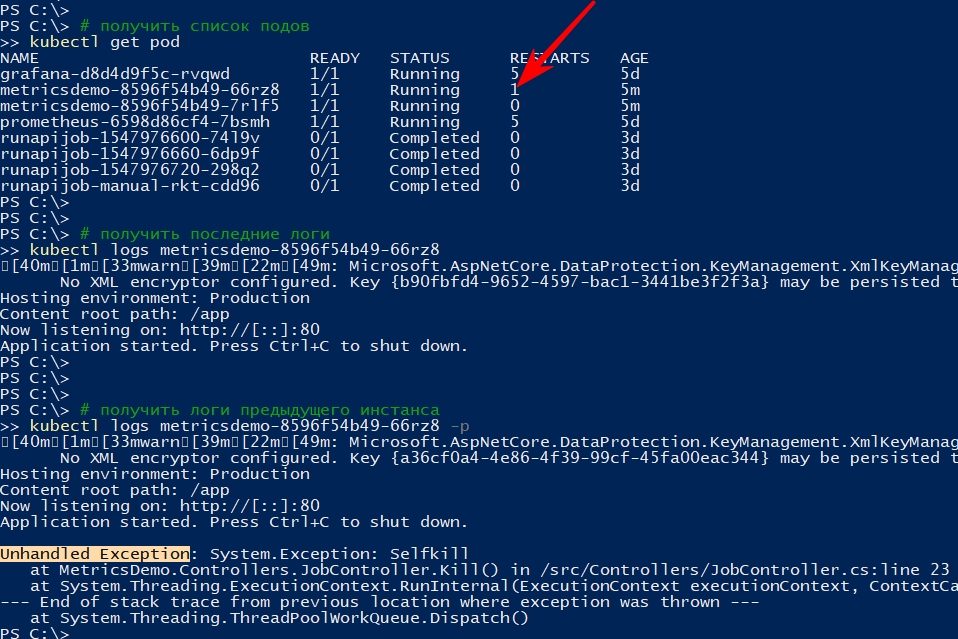

Команда logs показывает текущий вывод, а с параметром -p выдаст логи предыдущего инстанса. Таким образом можно узнать причину перезапуска

Думаю с простым падением всё ясно: упал — поднялся

Но приложение может быть и условно живым, т.е. не павшим, но и ничего не делающим, либо делающим свою работу, но медленно

Согласно [документации](https://kubernetes.io/docs/tasks/configure-pod-container/configure-liveness-readiness-probes/) существует, как минимум, два вида проверок «на живучесть» приложений в подах

1.  readiness — этот вид проверки используется для того, чтобы понимать — можно ли пускать траффик на этот pod. Если нет — pod выводится из балансировки, пока не войдёт в норму  
    
2.  liveness — проверка приложения «на живучесть». В частности — если нет доступа до жизненно необходимого ресурса или приложение вовсе не отвечает (допустим, дедлок и потому — таймаут), то контейнер будет перезапущен. Все http-коды между 200 и 400 считаются успешными, остальные — фейл  
    

Проверю рестарт по таймауту, для этого добавляю новый метод апи, который по определённой команде начнёт замедлять метод проверки живучести на 123 сек

    static bool deadlock;
     
    [HttpGet("alive/{cmd}")]
    public string Kill(string cmd)
    {
        if (cmd == "deadlock")
        {
            deadlock = true;
            return "Deadlocked";
        }
     
        if (deadlock)
            Thread.Sleep(123 * 1000);
     
        return deadlock ? "Deadlocked!!!" : "Alive";
    }

В файл 1-deployment-app.yaml в контейнер дописываю пару секций:

    containers:
    - name: metricsdemo
      image: localhost:5000/sansys/metricsdemo3:6
      ports:
      - containerPort: 80
      readinessProbe: 
        httpGet:
          path: /health
          port: 80
        initialDelaySeconds: 5
        periodSeconds: 5
      livenessProbe:  
        httpGet:
          path: /api/job/alive/check
          port: 80
        initialDelaySeconds: 5
        periodSeconds: 5

Редеплою, убеждаюсь, что апишка запустилась и подписываюсь на события

    kubectl get events --watch

Жму меню Deadlock me ([http://localhost:9376/api/job/alive/deadlock](http://localhost:9376/api/job/alive/deadlock))

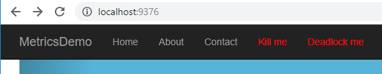

И в течение пяти секунд начинаю наблюдать проблему и её решение

    1s    Warning   Unhealthy   Pod   Liveness probe failed: Get http://10.1.0.137:80/api/job/alive/check: net/http: request canceled (Client.Timeout exceeded while awaiting headers)
    1s    Warning   Unhealthy   Pod   Liveness probe failed: Get http://10.1.0.137:80/api/job/alive/check: net/http: request canceled (Client.Timeout exceeded while awaiting headers)
    0s    Warning   Unhealthy   Pod   Liveness probe failed: Get http://10.1.0.137:80/api/job/alive/check: net/http: request canceled (Client.Timeout exceeded while awaiting headers)
    0s    Warning   Unhealthy   Pod   Readiness probe failed: Get http://10.1.0.137:80/health: dial tcp 10.1.0.137:80: connect: connection refused
    0s    Normal   Killing   Pod   Killing container with id docker://metricsdemo:Container failed liveness probe.. Container will be killed and recreated.
    0s    Normal   Pulled   Pod   Container image "localhost:5000/sansys/metricsdemo3:6" already present on machine
    0s    Normal   Created   Pod   Created container
    0s    Normal   Started   Pod   Started container

## Выводы

  

1.  С одной стороны порог вхождения оказался гораздо ниже, чем я думал, с другой — это вовсе не настоящий kubernetes-кластер, а лишь комп разработчика. И не были рассмотрены лимиты на ресурсы, стейтфул-приложения, а/б тестирование и т.п.
2.  Прометеус пробовал вовсе впервые, но чтение различных документов и примеров в процессе обзора кубера дали понять, что для сбора метрик с кластера и приложений в нём он весьма неплох
3.  Настолько хорош, что позволяет разработчику реализовать на своём компе фичу и приложить помимо инфы к деплою — деплой графика к графане. Как следствие новые метрики автоматом без доп. усилий начнут выводиться на стейдже и проде. Удобно

## Заметки

  

1.  Приложения могут обращаться друг к другу по `имени сервиса:порту`, что и сделано с графаной → прометеус. Для тех, кто знаком с docker-compose тут ничего нового
2.  `kubectl create -f file.yml` — создать сущность
3.  `kubectl delete -f file.yml` — удалить сущность
4.  `kubectl get pod` — получить список всех подов (service, endpoints...)
    *   `--namespace=kube-system` — фильтрация по неймспейсу
    *   `-n kube-system` — аналогично
5.  `kubectl -it exec grafana-d8d4d9f5c-cvnkh -- /bin/bash` — аттач к поду
6.  `kubectl delete service grafana` — удалить сервис, pod. деплой (--all — удалить все)
7.  `kubectl describe` — описать сущность (можно все сразу)
8.  `kubectl edit service metricsdemo` — редактирование всех ямлов «на лету» через запуск блокнота
    
    **Демо**
    
    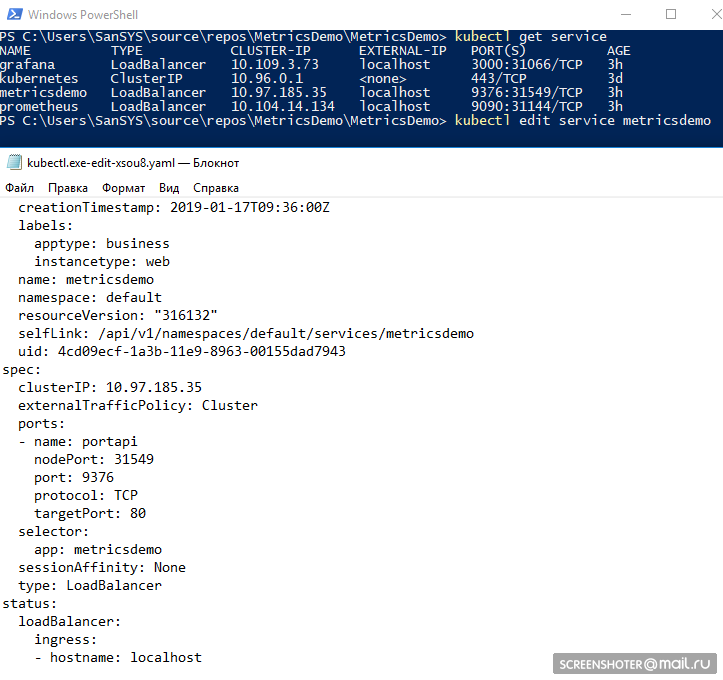
    
9.  `kubectl --help` — отличный хелп)
10. Типичная проблема — есть pod (считай — запущенный образ), что-то пошло не так и вариантов, кроме, как поотлаживать внутри нет (via tcpdump/nc etc.). — Юзай kubectl-debug [habr.com/ru/company/flant/blog/436112](https://habr.com/ru/company/flant/blog/436112/)  
    

## Список литературы

  

1.  [What is App Metrics?](https://www.app-metrics.io/)
2.  Kubernetes  
    *   [Kubernetes Deployment Tutorial For Beginners](https://devopscube.com/kubernetes-deployment-tutorial/)
    *   [Deployments](https://kubernetes.io/zh/docs/concepts/workloads/controllers/deployment/)
    *   [Run a Stateless Application Using a Deployment](https://kubernetes.io/docs/tasks/run-application/run-stateless-application-deployment/)
    *   [Что такое ConfigMap](https://kubernetes.io/docs/tasks/configure-pod-container/configure-pod-configmap/)
    *   [CronJob](https://kubernetes.io/docs/tasks/job/automated-tasks-with-cron-jobs/)
    *   [Liveness an readiness probes](https://kubernetes.io/docs/tasks/configure-pod-container/configure-liveness-readiness-probes/)
    *   [kubectl Cheat Sheet](https://kubernetes.io/docs/reference/kubectl/cheatsheet/)
3.  Prometheus  
    *   [Язык запросов](https://prometheus.io/docs/prometheus/latest/querying/basics/)
    *   [Конфигурация прометеуса для кубера](https://prometheus.io/docs/prometheus/latest/configuration/configuration/#kubernetes_sd_config)
    *   [Устройство и механизм работы Prometheus Operator в Kubernetes](https://habr.com/ru/company/flant/blog/353410/)
4.  [Конфигурация предподготовленной графаны](http://docs.grafana.org/administration/provisioning/)
5.  [Подсмотреть, как делают люди](https://github.com/microservices-demo/microservices-demo/tree/master/deploy/kubernetes/manifests-monitoring) (но там уже некоторые вещи устарели) — там в принципе и про логгирование, алертинг и т.п.
6.  [Helm](https://github.com/helm/helm) — The package manager for Kubernetes — через него можно было попроще организовать прометеус+графана, но вручную — больше появляется понимания
7.  [Ямлы для прометеуса от кубера](https://github.com/kubernetes/kubernetes/tree/master/cluster/addons/prometheus)
8.  [Kubernetes Failure Stories](https://github.com/hjacobs/kubernetes-failure-stories)

 [ Исходный код и ямлы доступны на гитхабе](https://github.com/SanSYS/kuberfirst)

Только зарегистрированные пользователи могут участвовать в опросе. [Войдите](https://habr.com/ru/auth/login/), пожалуйста.