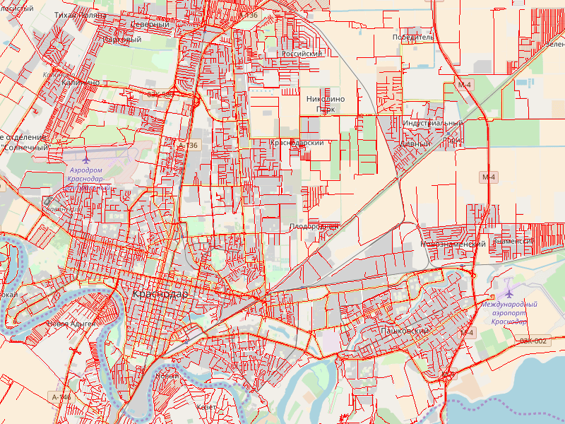
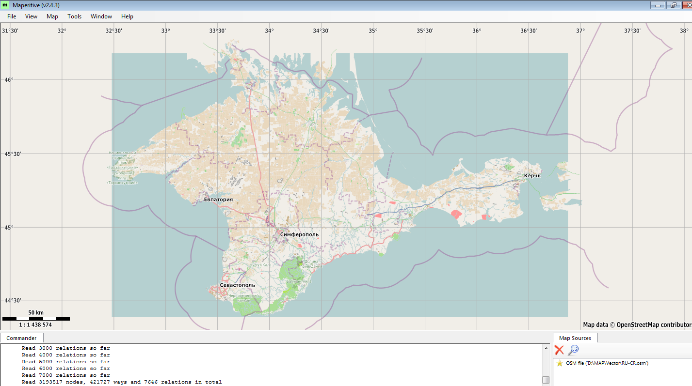
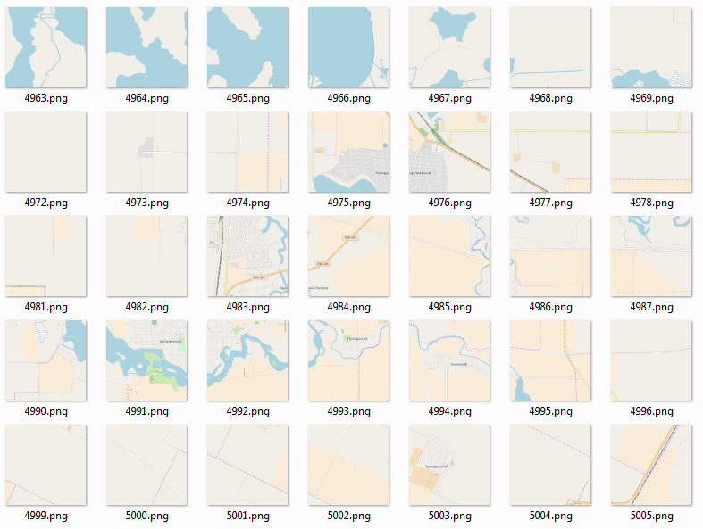
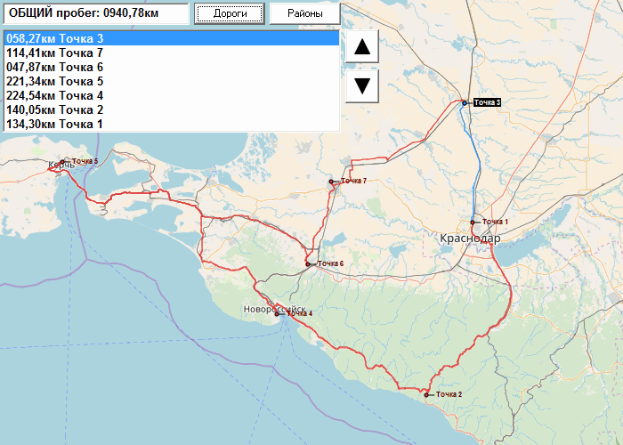

Простая логистика своими руками

Хочу поделиться с Вами опытом создания логистической системы на одном торговом предприятии.

Одним прекрасным днём, в не близком 2012 году, руководитель поставил задачу: подумать над проблемой оптимизации затрат на транспортную логистику организации.  
Основная сфера деятельности предприятия оптовая продажа и доставка продукции, где транспортные расходы занимают весомую долю затрат.

Руководство посчитало, что пришло время, навести порядок в расходовании средств на топливо, а также были подозрения, что водители дополнительно занимаются ещё «левой» доставкой между рейсами. В предприятиях малого-среднего звена многое строится на доверии, так как держать отдельных людей для контроля накладно и не всегда целесообразно. Когда же затраты растут, а эффективность падает, то просто необходимо что-то делать.  
  
Для начала пробовали решить проблему управленческими методами: постоянное измерение уровня топлива, показаний тахометра, измерение времени на доставку при личном сопровождении груза. Эффект был около ничего, кроме негатива, подозрений и лишних движений (измерять это тоже для кого-то работа). Если при одиночном маршруте ещё можно было определить примерные рамки, то при рейсе из 25-35 торговых объектов всё очень сильно менялось, разброс был очень большим, как по времени, так и по топливу.

Задача: отправлять загруженный автотранспорт по торговым предприятиям уменьшив пробег, а следовательно и издержки. По возможности не допускать отклонение от маршрута. Цель уменьшить издержки с минимальными вложениями по финансам и времени на внедрение, так сказать ещё вчера. В ходе обсуждений сошлись на нескольких альтернативах:

1.  использовать один из сервисов для расчёта маршрутов и учёта ГСМ;
2.  поставить на автопарк модули трекинга/отслеживания положения;
3.  спроектировать что-то самим;

Решили попробовать все три решения и выбрать наилучшее:

1\. Хорошее готовое решение на тот момент мы не нашли. Либо проектирование под ключ, но дорого, либо берите как есть и дальше по договорённости. Попробовали несколько онлайн сервисов. В целом не плохо, но в основном сложность сводилось к дублированию информации из учётной системы, количеству действий для получения результата (нажми здесь, перейди сюда, обнови справочник), всё онлайн (на тот момент это было критично). Но самый большой недостаток — это сложность в составление маршрутов с множеством точек и выбор лучшего маршрута. Обычно всё приходилось подбирать вручную, подгоняя значения, что долго и не всегда удачно в результате.

После пары месяцев работы отказались от такого решения.

2\. В качестве эксперимента поставили на дюжину автомобилей модули отслеживания GSM.  
Результат более удачный. Всегда знаешь, где был автомобиль. Но и по затратам более дорого, чем первый вариант. Однако после выявления пары случаев отклонения от маршрута (один водитель шабашил, второй навещал даму сердца, в рабочее время), сотрудники принялись усиленно избавляться от таких устройств. Хотя они и ранее не восторженно принимали данное нововведение. То случайно клемма питания слетела, то при ремонте двигателя устройство из строя вышло, то электроника на солнце «перегрелась». Так за три года мы потеряли 9 устройств. В целом решение оказалось положительным, но из минусов — приходилось долго просматривать пройденные маршруты на выявление подозрительной активности, что не очень удобно. Плюсом в системе отслеживания был пункт об экспорте трека, что позволило накопить определённую статистику по маршрутам.

Позже мы использовали другую систему от одного из крупных сотовых операторов для корпоративной связи и отслеживания активности торговых агентов, результат был похожим: симки ломались, телефоны терялись, забывались дома, батарея истощалась, люди всегда найдут выход.

3\. Параллельно с первыми двумя подходами решили

~изобрести велосипед~

, реализовать в своей учётной системе возможность строить маршруты самостоятельно.

Для начала завели все места посещения и внесли их гео-координаты в БД. Получали координаты по данным GPS трекера при посещении, а также визуально по картам [OSM](https://www.openstreetmap.org/), находя нужное место мышью и копируя координаты.

На втором этапе нужно было получить векторные карты региона в удобном формате.  
Выбор пал на тот же OSM, так как карты имеют открытый формат. Парсить дамп планеты мы не осилили, поэтому изначально выгружали данные кусками в XML, через экспорт из самого OSM, а затем соединяли территории. Позднее натолкнулись на проект [GIS-LAB](http://gis-lab.info/). Эти достойные люди на протяжении многих лет выкладывали [ежедневный дамп](http://gis-lab.info/projects/osm_dump/) территорий, разбитый по регионам. Но кушать хочется всем, проект в последнее время заглох, а ребята [переехали](http://nextgis.com/), и делают ту же работу за вполне вменяемую цену.

Получив карту в формате XML мы извлекли слой отвечающий за дороги согласно [спецификации](https://wiki.openstreetmap.org/wiki/RU:Highway_classification). Так как объём карт нескольких соседних регионов занимал десяток гигабайт, был написан SAX парсер на RUBY, он выбирал только нужные теги и объединял соседние регионы, в которых осуществлялась деятельность в единую структуру.

Сам проект написан как внешняя DLL к учётной системе написанная на Pascal. Парк устройств, на которых должна была работать система, был мягко говоря устаревшим, поэтому было ограничение в 1 ГБ ОЗУ (Да, есть ещё компании, которые используют такую технику, 10 лет работает, проработает ещё столько же). Изначально было желание разбить карту на куски и грузить в ОЗУ по мере необходимости (как на навигаторах), но это было крайне медленно. В итоге удалось скомпоновать до разумной полусотни МБ.

В OSM карты дорог представлены в виде векторных участков дорожного полотна с дополнительными атрибутами. В своём решении мы использовали [списки смежности](https://ru.wikipedia.org/wiki/%D0%A1%D0%BF%D0%B8%D1%81%D0%BE%D0%BA_%D1%81%D0%BC%D0%B5%D0%B6%D0%BD%D0%BE%D1%81%D1%82%D0%B8). Где вершина — это точка на карте, а рёбра — это пути к соседней точке. Для оптимизации мы считаем, что из одной вершины может быть максимум четыре пути (перекрёсток). Если путей больше 4, то нужно разбить ребро на два дополнительных, так у нас всегда для каждой точки карты будет фиксированное количество рёбер = 4. Такой подход позволяет производить выравнивание данных в памяти, хотя несколько избыточен.

Стоит отметить, что Земля представляет собой, не шар (неожиданно), а [геоид](https://ru.wikipedia.org/wiki/%D0%93%D0%B5%D0%BE%D0%B8%D0%B4), но для целей картографии упрощают до сфероида или [эллипсоида](https://ru.wikipedia.org/wiki/%D0%A4%D0%B8%D0%B3%D1%83%D1%80%D0%B0_%D0%97%D0%B5%D0%BC%D0%BB%D0%B8).

Для наших целей я нашёл формулу для расчёта расстояний между двумя точками на поверхности эллипсоида, осознать весь глубинный смысл которой я не смог, но это не мешает нам её использовать.

**код**

    function distance(StartLong:Single; StartLat:Single; EndLong:Single; EndLat:Single) : Single;
    const
    D2R: Double = 0.017453;         
    E2: Double = 0.006739496742337; 
    var
    fPhimean: Double;                 
    fdLambda: Double;                 
    fAlpha: Double;                   
    fRho: Double;                     
    fNu: Double;                      
    fR: Double;                       
    fz: Double;                       
    begin
    fdLambda := (StartLong - EndLong) * D2R;
    fPhimean := ((StartLat + EndLat) / 2.0) * D2R;
    fRho := (6378137.0 * (1 - E2)) / Power(1 - E2 * (Power(Sin(fPhimean),2)), 1.5);
    fNu := 6378137.0 / (Sqrt(1 - E2 * (Sin(fPhimean) * Sin(fPhimean))));
    fz := Sqrt(Power(Sin((StartLat - EndLat) * D2R/2.0),2) + Cos(EndLat*D2R) * Cos(StartLat*D2R) * Power(Sin(fdLambda/2.0),2));
    fz := 2 * ArcSin(fz);
    fAlpha := ArcSin(Cos(EndLat * D2R) * Sin(fdLambda) * 1 / Sin(fz));
    fR := (fRho * fNu) / ((fRho * Power(Sin(fAlpha),2)) + (fNu * Power(Cos(fAlpha),2)));
    distance := fz * fR;            
    end;
    

  

После создания базы дорог был необходим визуальный слой для отображения окружающего пространства. Тут помог проект [maperitive](http://maperitive.net/), он позволил распарсить OSM карту регионов на тайловые участки по слоям приближения, точно так же как это делает 10^100 или Яндекс. Была попытка работать с картами гигантов онлайн, отрисовывая векторную карту поверх слоя браузера, но из-за лицензионных ограничений решили отказаться. В итоге создали виртуальный диск и залили туда дамп тайлов на пару десятков гигабайт, зато всё под рукой и не тормозит. Правда, примерно раз в полгода приходиться освежать, обычно это совпадает с перегрузкой карт.

Для совмещения тайловой картинки и векторной карты нужно знать, что тайлы, Google, OpenStreetMap, Bing, Yahoo представлены в проекции [Меркатора](https://ru.wikipedia.org/wiki/%D0%9F%D1%80%D0%BE%D0%B5%D0%BA%D1%86%D0%B8%D1%8F_%D0%9C%D0%B5%D1%80%D0%BA%D0%B0%D1%82%D0%BE%D1%80%D0%B0) (точнее [WEB MERCATOR](https://en.wikipedia.org/wiki/Web_Mercator_projection), которая является проекцией на сферу), где каждый более глубокий слой в два раза детальнее предыдущего.

Яндекс.Карты используют проекцию Меркатора эллипсоида.

Это не принципиально, если можешь пересчитать гео-координаты на плоскость проекции и обратно.

Мы выбрали 17 уровень детализации как максимальный. Ближе нет смысла из-за увеличения хранения количества тайлов (каждый уровень в 4 раза больше предыдущего), а также их низкой информационной наполненности.

2^17 * 256 =33554432 (256 — размер ребра тайла в пикселях).

**код**

    Const     
    size  =33554432; 
    center=16777216; 
    EXCT=0.081819790992; 
    map_type=true; 
    
    
    function TO_X(X:Single):Integer;  
    begin
    TO_X := floor(center+size*(x/360)); 
    end;
    
    
    function TO_Y(Y:Single):Integer;  
    var ls:single;
    begin
    ls:=sin(Y*Pi/180);               
    if map_type then	 
     TO_Y := floor(center-atanh(ls)*(size/(2*Pi))) 
    else
     TO_Y := floor(center-(atanh(ls) - EXCT * atanh(EXCT * ls))*(size/(2*Pi))); 
    end;
    
    
    function TO_LON(X:Single):Single;
    begin
    TO_LON := (X - center) * 360 / size;
    end;
    
    
    function TO_LAT(Y:Single):Single;
    var g:Double;
    begin
    if map_type then
     
     TO_LAT:= (180 / Pi)* (2 * ArcTan(exp((center - y) * 2 * Pi / size)) - Pi / 2) 
    else
    begin
     
     g := (PI/2) - 2 * ArcTan(1 / Exp((20037508.342789 - (y*64) / 53.5865938) / 6378137)); 
     TO_LAT:=  180 / Pi * (g + 0.00335655146887969 * Sin(2 * g) + 0.00000657187271079536 * Sin(4 * g) + 0.00000001764564338702 * Sin(6 * g) + 0.00000000005328478445 * Sin(8 * g));
    end;
    end;
    
    

  

Теперь, когда у нас есть базовые инструменты, мы можем приступить непосредственно к задаче создания оптимального маршрута. Соединяем торговые объекты с ближайшим ребром в графе дорог, а затем запускаем поиск кратчайшего пути. Для этого используем разновидность алгоритма [Дейкстры](https://ru.wikipedia.org/wiki/%D0%90%D0%BB%D0%B3%D0%BE%D1%80%D0%B8%D1%82%D0%BC_%D0%94%D0%B5%D0%B9%D0%BA%D1%81%D1%82%D1%80%D1%8B) для разряженной его вариации последовательно для каждого пункта посещения. На выходе получаем [матрицу смежности](https://ru.wikipedia.org/wiki/%D0%9C%D0%B0%D1%82%D1%80%D0%B8%D1%86%D0%B0_%D1%81%D0%BC%D0%B5%D0%B6%D0%BD%D0%BE%D1%81%D1%82%D0%B8), размера (N+1)*(N+1) с нулевой главной диагональю, где N-количество точек посещения без учёта точки выезда.

Полученная матрица хранит минимальные расстояния по дорогам между всеми торговыми объектами, что является классической [задачей коммивояжера](https://ru.wikipedia.org/wiki/%D0%97%D0%B0%D0%B4%D0%B0%D1%87%D0%B0_%D0%BA%D0%BE%D0%BC%D0%BC%D0%B8%D0%B2%D0%BE%D1%8F%D0%B6%D1%91%D1%80%D0%B0). Так как алгоритмическая сложность такой задачи зашкаливает, мы использовали для решения [метод ветвей и границ](https://ru.wikipedia.org/wiki/%D0%9C%D0%B5%D1%82%D0%BE%D0%B4_%D0%B2%D0%B5%D1%82%D0%B2%D0%B5%D0%B9_%D0%B8_%D0%B3%D1%80%D0%B0%D0%BD%D0%B8%D1%86). При n <15 полный перебор, иначе подключали грубую оценку в глубину. Вариант конечно не идеальный, но вполне рабочий.

В итоге получили маршрут, близкий к оптимальному по расстоянию с оценкой в км. При необходимости, оператор может вручную изменить маршрут в пользу приоритета отдельных точек.

Решение работает в организации порядка 7 лет, вполне успешно, хотя и не без недостатков, как в точности, так и в удобстве. Результаты вполне соотносятся с данными GPS-трекинга автомобилей. По моей оценке, внедрение логистики позволило сэкономить 10-12% выделяемых средств на топливо. Программа была спроектирована, запущена и сопровождалась всего одним человеком – Вашим покорным слугой.

Моё консервативное руководство не горит желанием «светиться», поэтому для внимания предлагаю вымышленный пример маршрута.

Без визуализации расчет идёт в разы быстрее, а внутри одного населённого пункта, практически мгновенно.

Спустя столько лет, иногда руки чешутся залезть в код и переписать его с новым опытом на новую, более современную платформу, но пока в этом нет экономической целесообразности.

Вот и всё, что я хотел вам поведать, надеюсь было интересно.  
Приношу извинения, если был где-то не точен.