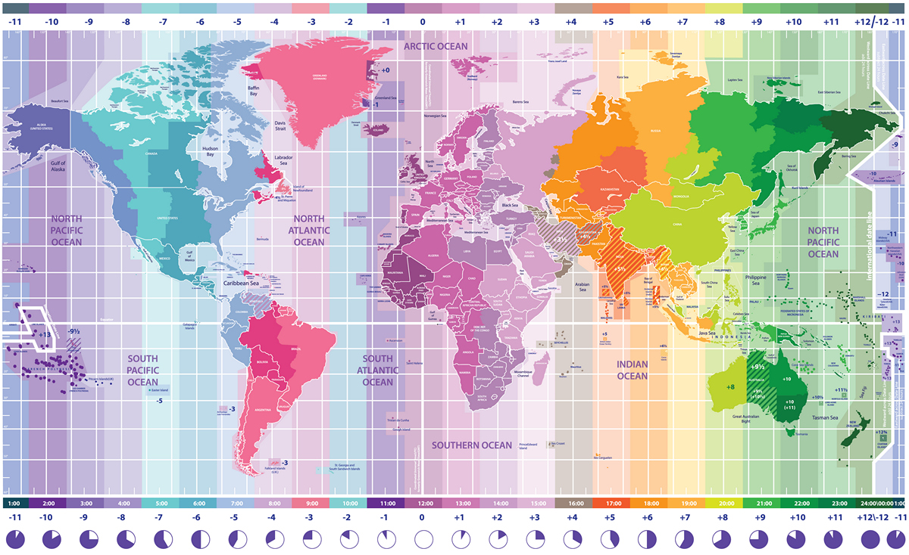

Работа с часовыми поясами в JavaScript / Блог компании Mail.ru Group

Недавно я работал над задачей добавления часовых поясов в JS-библиотеку календаря, которую ведёт моя команда. Мне было хорошо известно о никудышной поддержке часовых поясов в JavaScript, но я надеялся, что абстрагирование имеющихся объектов данных позволит легко решить большинство трудностей.

Однако мои мечты пошли прахом. Когда я углубился в задачу, то понял, что в этом языке действительно трудно работать с часовыми поясами. Реализовать что сложнее простого форматирования времени и вычисления даты с комплексными операциями (функции календаря) было чрезвычайно трудным делом. Я получил ценный опыт решения этой проблемы, и это повлекло за собой новые затруднения.

В этой статье я хочу обсудить, с чем я столкнулся и как это решал. Пока я писал текст, осознал, что причиной всех невзгод было плохое понимание мной самой темы часовых поясов. В свете этого осознания я предлагаю сначала подробно поговорить об определении и стандартах, а уже потом переходить к JavaScript.  

## Что такое часовой пояс?

Часовой пояс — это географический регион, в котором используется единое местное время, установленное правительством страны. Многие страны целиком относятся к каким-то конкретным часовым поясам, а на территориях больших государств, вроде России и США, применяется несколько часовых поясов. Любопытно, что хотя Китай тоже достаточно велик, однако в нём принят лишь один часовой пояс. Иногда это приводит к странным ситуациям, когда в западной части страны восход начинается около 10 утра.

## GMT, UTC и смещение

  

#### GMT

Местное южнокорейское время обозначается как `GMT+09:00`. GMT расшифровывается как Greenwich Mean Time (среднее время по Гринвичу), то есть это время на часах Королевской обсерватории в Гринвиче, Великобритания. Она расположена на нулевом меридиане. Радиосигнал GMT-системы начал транслироваться с 5 февраля 1924 года, а сама она превратилась в мировой стандарт с 1 января 1972 года.

#### UTC

Многие считают, что GMT и UTC — это одно и то же, частенько используя их как взаимозаменяемые системы. Но это ошибка. Система UTC появилась в 1972-м как способ компенсации эффекта вращения Земли. В основе системы лежит Международное атомное время (International Atomic Time), вычисляемое по частоте электромагнитных колебаний атомов цезия. Иными словами, UTC — более точная замена GMT. Хотя реальное различие во времени между двумя системами очень мало, всё же разработчикам ПО лучше опираться на UTC.

Интересный факт: когда UTC ещё разрабатывалась, в англоговорящих странах предлагали назвать её CUT (Coordinated Universal Time), а во франкоговорящих — TUC (Temps Universal Coordonn). Однако ни один из лагерей не смог победить, и систему договорились назвать UTC, чтобы по буквам из обоих предложенных вариантов (C, T и U).

#### Смещение

`+09:00` в `UTC+09:00` означает, что местное время на 9 часов опережает стандартное UTC-время. То есть когда в Южной Корее 9 вечера, в регионе UTC полдень. Разница между стандартным UTC-временем и местным называется «смещением», которое выражается в виде положительных или отрицательных значений: `+09:00`, `-03:00` и т. д.

Во многих странах принято давать своим часовым поясам уникальные имена. Например, часовой пояс Южной Кореи называется KST (Korea Standard Time), его смещение выражается как `KST = UTC+09:00`. Однако смещение `+09:00` используется не только Южной Кореей, но и Японией, Индонезией и многими другими странами, поэтому связь между смещениями и поясами выражается не как 1:1, а как 1:N. Список стран со смещением `+09:00` представлен [здесь](https://en.wikipedia.org/wiki/UTC+09:00).

Некоторые смещения оперируют не только часами. К примеру, в Северной Корее стандартным временем является `+08:30`, а в Австралии в некоторых регионах используются `+8:45`, `+09:30` и `+10:30`.

Полный список UTC-смещений находится [здесь](https://en.wikipedia.org/wiki/List_of_UTC_time_offsets).

## Часовой пояс !== смещение?

Как я уже говорил, мы используем имена часовых поясов (KST, JST) со смещениями как взаимозаменяемые, не различая их. Но будет ошибочным считать одним и тем же время и смещение конкретного региона. Причин несколько:

#### Летнее время (DST)

В некоторых странах этот термин неизвестен, но во многих государствах практикуют переход на летнее время, в основном в Европе. Для этого принят международный термин DST — Daylight Saving Time. Оно означает перевод часов в летний период на один час вперёд относительного стандартного времени.

К примеру, в Калифорнии зимой используется PST (Pacific Standard Time, Тихоокеанское стандартное время), а летом PDT (Pacific Daylight Time, `UTC-07:00`). В США и Канаде термин Pacific Time (PT, Тихоокеанское время) применяется для регионов, в которых используются два часовых пояса.

Когда начинается и заканчивается летнее время? Всё зависит от страны. Например, в США и Канаде до 2006 года DST использовался с 2 часов ночи первого воскресенья апреля до 12 ночи последнего воскресенья октября. А с 2007-го летнее время стали отсчитывать с 2 ночи второго воскресенья марта до 2 ночи первого воскресенья ноября. В Европе в разных странах практикуется прогрессивное применение DST в зависимости от каждого часового пояса.

#### Меняются ли часовые пояса?

Каждая страна сама определяет, какими часовыми поясами ей пользоваться, поэтому местное время может меняться по любым политическим и/или экономическим причинам. Например, в США границы DST поменяли в 2007-м, потому что Джордж Буш инициировал энергетическую политику в 2005-м. Египет и Россия раньше переходили на летнее время, но отказались от этого с 2011-го.  
В ряде случаев правительство может изменить не только порядок перехода на летнее время, но и стандартное время. К примеру, раньше на Самоа использовалось смещение `UTC-10:00`, но потом они перешли на `UTC+14:00` для снижения убытков в торговле из-за разницы во времени с Австралией и Новой Зеландией. Это решение привело к выпадению из жизни страны целого дня — 30 декабря 2011 года, о чём написали [газеты по всему миру](https://www.abc.net.au/news/2011-12-30/samoa-skips-friday-in-time-zone-change/3753350).

В Нидерландах с 1909 года применялось смещение `+0:19:32.13`, с 1937-го страна перешла на `+00:20`, а с 1940-го на `+01:00`, с тех пор основное время там не менялось.

## Часовой пояс 1: смещение N

Итак, часовой пояс может иметь одно или несколько смещений. Какое именно время принято в качестве стандартного, зависит от текущих политических и/или экономических причин в конкретной стране.

В повседневной жизни это не вызывает затруднений, пока не попытаешься систематизировать эти данные на основе каких-то правил. Представим, что вы хотите установить на своём смартфоне стандартное время с помощью какого-то смещения. Если вы живёте в регионе, в котором практикуется переход на летнее время, то смартфон должен знать, когда именно нужно переходить туда и обратно. То есть нужно установить взаимосвязь между стандартным и летним временем в одном часовом поясе (например, Pacific Time).

Но это не получится сделать с помощью пары простых правил. Например, когда в США в 2007-м поменяли начало и конец DST, 31 мая 2006 должно было использовать в качестве стандартного времени PDT (`-07:00`), а 31 марта 2007 — PST (`-08:00`). Получается, чтобы ссылаться на конкретный часовой пояс, нужно знать всю историю изменения часовых поясов или дату изменения правил перехода на летнее время.

Вы можете сказать: «Часовой пояс в Нью-Йорке — PST (`-08:00`)». Однако необходимо пояснить: «Текущий часовой пояс в Нью-Йорке — это PST». При этом для точной реализации системы нужно использовать ещё более точное выражение. Забудьте термин «часовой пояс». Вы должны сказать: «Сейчас в Нью-Йорке в качестве стандартного времени используется PST».

Так что же мы должны использовать вместо смещения для определения часового пояса конкретного региона? Название этого региона. Точнее, вы должны группировать в единые часовые пояса те регионы, в которых одинаково переходят на летнее и стандартное время. Можно использовать наименования вроде PT (Pacific Time), но они лишь объединят под собой текущие стандартное и летнее время, и вовсе не обязательно учитывают все исторические изменения. Более того, поскольку PT имеет хождение лишь в США и Канаде, вам нужно опираться на устоявшиеся стандарты авторитетных организаций, чтобы обеспечить универсальность применения вашего ПО.

## База данных часовых поясов IANA

Должен признаться, что информация о часовых поясах — это, скорее, база данных, а не набор правил, потому что эта информация должна содержать все соответствующие исторические изменения. Есть несколько стандартных баз, предназначенных для решения задач, связанных с часовыми поясами. Чаще всего используют [IANA Time Zone Database](https://www.iana.org/time-zones), и обычно называют её tz database (или tzdata). База содержит исторические данные об изменениях стандартного времени и DST по всему земному шару. Причём организована она так, чтобы можно было проверить все исторические данные и убедиться в точности времени начиная с Unix time (`1970.01/01 00:00:00`). Хотя вы можете найти в базе информацию и до 1970-го, однако их точность не гарантируется.

Соглашение о наименованиях использует правило «регион/место». В качестве региона обычно используют название континента или океана (Азия, Америка, Тихий океан), а в качестве места — названия основных городов (Сеул, Нью-Йорк). Причина в том, что города обычно существуют дольше стран. Например, часовой пояс Южной Кореи — `Asia/Seoul`, а Японии — `Asia/Tokyo`. Хотя обе страны используют одно смещение `UTC+09:00`, у них по-разному менялось местное время, поэтому их разделили на разные часовые пояса.

Базой IANA управляет много сообществ разработчиков и историков. В неё сразу заносят свеженайденные исторические данные и обновляют текущие политики, так что базу сегодня можно считать самым надёжным источником. Более того, её используют под капотом многие Unix-системы, включая Linux и MacOS, а также ряд популярных языков программирования, в том числе Java и PHP.

Обратите внимание, что Windows использует [базу данных Microsoft](https://support.microsoft.com/en-us/help/22803/daylight-saving-time). Однако, она неточна с точки зрения исторических данных и поддерживается только самой Microsoft. Поэтому база менее надёжна, чем база IANA.

## JavaScript и база IANA

Функциональность, связанная с часовыми поясами, реализована в JavaScript из рук вон. По умолчанию язык использует текущий пояс региона (точнее, пояс, выбранный при установке ОС), и не существует способа поменять его. Более того, даже спецификации для стандарта баз данных в JavaScript расплывчаты, и вы это поймёте сами, если решите разобраться со спецификацией для ES2015. Про местный часовой пояс и доступность DST есть лишь пара туманных заявлений. К примеру, DST определяется так: [ECMAScript 2015 — Daylight Saving Time Adjustment](http://www.ecma-international.org/ecma-262/6.0/#sec-daylight-saving-time-adjustment).

> Это алгоритм, зависящий от реализации, использующий лучшую доступную информацию о часовых поясах для определения настройки перехода на местное летнее время DaylightSavingTA(t), которая вычисляется в миллисекундах. Реализация ECMAScript должна помочь наилучшим образом определять настройку перехода на местное летнее время.

Похоже, они просто говорят: «Чуваки, попробуйте заставить это работать». Помимо прочего, вам придётся решать проблему совместимости с разными браузерами. Вы скажете: «Какой бардак!», а потом прочитаете следующую строку:

> Примечание: рекомендуем в ваших реализациях пользоваться информацией из базы данных часовых поясов IANA [http://www.iana.org/time-zones/](http://www.iana.org/time-zones/).

Да. Спецификации ECMA передают вам мяч вот такой незатейливой рекомендацией пользоваться базой IANA, потому что в JavaScript нет специальной стандартной базы данных. В результате разные браузеры для вычисления времени используют собственные операции с часовыми поясами, которые зачастую несовместимы друг с другом. Позднее в ECMA для международного API добавили опцию использования данных IANA в формате ECMA-402 `Intl.DateTimeFormat`. Вот только эта опция гораздо менее надёжна, чем аналоги в других языках программирования.

## Часовой пояс в сервер-клиентская среда

Рассмотрим простой сценарий: нам нужно определить часовой пояс. Допустим, мы создаём календарь, который будет обрабатывать информацию о времени. Когда пользователь в клиентской среде вводит в окне регистрации дату и время, дата передаётся на сервер и сохраняется в базе данных. Затем клиент получает от сервера зарегистрированную в расписании дату для отображения на экране.

Здесь нужно кое с чем определиться. Что, если некоторые из клиентов, обращающихся к серверу, находятся в разных часовых поясах? Событие в расписании, которое в Сеуле зарегистрировано на 10 марта 2017 в 23.30, в Нью-Йорке должно отображаться как 10 марта 2017 в 9.30. Чтобы сервер мог обслуживать клиентов из разных часовых поясов, хранящееся на нём расписание должно содержать абсолютные значения, которые никак не зависят от пояса. У каждого сервера свой способ хранения таких значений, этот вопрос выходит за рамки статьи, поскольку всё зависит от конкретного сервера или базы данных. В целом, дата и время, передаваемые от клиента на сервер, должны быть представлены либо в виде значений на основе единого смещения (обычно, UTC), либо в виде значений, содержащих информацию о часовом поясе клиентской среды.

Обычно такие данные передаются в виде [Unix-времени](https://ru.wikipedia.org/wiki/Unix-%D0%B2%D1%80%D0%B5%D0%BC%D1%8F) в формате UTC или по стандарту [ISO-8601](https://ru.wikipedia.org/wiki/ISO_8601) с информацией о смещении. Если в нашем примере преобразовать в Unix-время сеульское 21.30 10 марта 2017, то получится целочисленное значение `1489113000`. А в формате ISO-8601 получится строковое значение `2017–03–10T11:30:00+09:00`.

Если вы используете в браузерной среде JavaScript, то должны преобразовать введённое значение, как описано выше, а затем преобразовать его обратно, чтобы соответствовало пользовательскому часовому поясу. Нужно решить обе эти задачи. С точки зрения языка программирования, первая операция называется «парсингом», а вторая «форматированием». Теперь давайте посмотрим, как это делается в JavaScript.

Даже когда вы работаете с JS в серверной среде, используя Node.js, вам может потребоваться парсить данные, полученные от клиента. Но поскольку часовые пояса серверов и баз данных обычно синхронизируют, а форматирование возлагают на клиенты, в браузерной среде вам нужно определиться с несколькими факторами. Дальше я буду объяснять применительно к браузерной среде.

## Объект Date в JavaScript

Задачи, подразумевающие работу с данным или временем, решаются с помощью объекта `Date`. Это нативный объект, определённый в ECMAScript, как `Array` или `Function`. То есть он, по большей части, реализован с помощью нативного кода вроде С++. API хорошо описан в [документации MDN](https://developer.mozilla.org/en-US/docs/Web/JavaScript/Reference/Global_Objects/Date). Большое влияние на объект оказал класс [java.util.Date](https://docs.oracle.com/javase/7/docs/api/java/util/Date.html) из Java, поэтому он унаследовал некоторые нежелательные свойства, вроде характеристик изменяемых данных и начинающегося с нуля месяца (`month`).

Под капотом объект `Date` в JavaScript работает с временем, используя абсолютные значения в формате Unix-времени. Но на конструкторы и методы вроде функций `parse()`, `getHour()`, `setHour()` и прочих влияет часовой пояс клиента (точнее, пояс, указанный в ОС, в которой работает браузер). Так что если вы создаёте объект `Date` напрямую, используя введёные пользователем данные, то в этих данных будет отражён местный часовой пояс клиента.

Как я упоминал, JavaScript не предоставляет какого-либо способа произвольно изменить часовой пояс. Поэтому будем считать, что мы можем напрямую использовать значение часового пояса, указанное в браузере.

## Создание объекта Date с помощью введённых пользователем данных

Вернёмся к первому примеру. Допустим, пользователь ввёл на своём устройстве сеульское время 11.30 11 марта 2017. Эти данные сохраняются в виде пяти чисел: 2017, 2, 11, 11 и 30 — год, месяц, день, часы и минуты соответственно (поскольку месяц начинается с 0, его значение должно быть 3–1=2). С помощью конструктора можно легко создать объект `Date`:

    const d1 = new Date(2017, 2, 11, 11, 30);
    d1.toString(); 

Если посмотрите на значение, возвращённое `d1.toString()`, то увидите, что абсолютное значение созданного объекта равно 11.00 11 марта 2017, оно вычислено с помощью смешения `+09:00` (KST).

Вы можете использовать в конструкторе и строковые данные. Если применить их к `Date`, объект внутренне вызовет `Date.parse()` и вычислит правильное значение. Эта функция поддерживает спецификации [RFC2888](https://tools.ietf.org/html/rfc2822#section-3.3) и [ISO-8601](https://ru.wikipedia.org/wiki/ISO_8601). Но в [MDN-документации к Date.parse()](https://developer.mozilla.org/en-US/docs/Web/JavaScript/Reference/Global_Objects/Date/parse) говорится, что возвращаемое этим методом значение зависит от браузера, а формат строкового типа может влиять на точное финальное значение. Поэтому лучше этим методом не пользоваться. К примеру, в Safari и Internet Explorer строковое значение вроде `2015–10–12 12:00:00` возвращает `NaN`, а в Chrome и Firefox возвращает локальный часовой пояс. В некоторых ситуациях возвращается значение на основе UTC.

## Создание объекта Date с помощью серверных данных

Допустим, что вы хотите получить данные с сервера. Если они в виде числового Unix-времени, то для создания объекта `Date` можете просто использовать конструктор. Я ещё не упоминал, что когда конструктор `Date` получает одно значение в качестве единственного параметра, то вычисляет значение Unix-времени в миллисекундах (внимание: JS обрабатывает Unix-время в миллисекундах. Это означает, что второе значение нужно умножать на 1000). При выполнении следующего кода мы получим такое же значение, как в предыдущем примере:

    
    const d1 = new Date(1489199400000);
    d1.toString(); 

А если вместо Unix-времени использовать строковый тип ISO-8601? Как я объяснил выше, тогда метод `Date.parse()` становится ненадёжен и лучше его не использовать. Однако начиная с ECMAScript 5 вы можете в конструкторе `Date` в Internet Explorer 9.0 и выше использовать строковые в формате ISO-8601.

Если же вы используете не самый свежий браузер, то удостоверьтесь в наличии буквы `Z` в конце значений. Без неё ваш старый браузер может интерпретировать значение на основе местного времени, а не UTC. Вот пример использования в Internet Explorer 10:

    const d1 = new Date('2017-03-11T11:30:00');
    const d2 = new Date('2017-03-11T11:30:00Z');
    d1.toString(); 
    d2.toString(); 

Согласно спецификации, в обоих случаях должно получиться одно и то же значение. Но они отличаются. В более позднем браузере значения будут одинаковыми. Чтобы эта проблема не возникала, всегда добавляйте `Z` в конце строки, если отсутствует информация о часовом поясе.

## Создание Date для передачи серверу

Теперь можно пользоваться ранее созданным `Date`, свободно извлекать или добавлять время на основе местных часовых поясов. Только в конце обработки не забывайте преобразовывать данные в предыдущий формат, прежде чем возвращать серверу.

Если это Unix-время, можете воспользоваться методом `getTime()` (не забывайте о миллисекундах).

    const d1 = new Date(2017, 2, 11, 11, 30);
    d1.getTime(); 

Что насчёт строкового значения в формате ISO-8601? Как я говорил, Internet Explorer 9.0 и выше поддерживают ECMAScript 5, а поздние версии поддерживают ISO-8601. Поэтому с помощью методов `toISOString()` или `toJSON()`можно создать строку в ISO-8601 (`toJSON()` можно использовать для рекурсивных вызовов с `JSON.stringify()` и другими). Оба метода дают одинаковый результат, за исключением случаев обработки неверных данных:

    const d1 = new Date(2017, 2, 11, 11, 30);
    d1.toISOString(); 
    d1.toJSON();      
    const d2 = new Date('Hello');
    d2.toISOString(); 
    d2.toJSON();      

Для создания строки в формате UTC можете использовать методы `toGMTString()` или `toUTCString()`. Получится значение, удовлетворяющее требованиям [RFC-1123](https://tools.ietf.org/html/rfc1123).

Объект `Date` включает в себя `toString()`, `toLocaleString()` и их методы расширения. Но пользы от них мало, поскольку они используются, в основном, для возвращения строк на основе местного часового пояса, причём возвращаемые значения зависят от браузера и ОС.

## Изменение местного часового пояса

Как видите, в JS есть какая-то поддержка часовых поясов. А если нужно в приложении изменить местный пояс без учёта указанного в ОС значения? Или если нужно в одном приложении отобразить одновременно несколько часовых поясов? Как я уже несколько раз говорил, JS не позволяет вручную менять местный часовой пояс. Единственным решением будет добавление или удаление смещения из даты, для которой вы уже знаете значение смещения нужного пояса. Но не огорчайтесь. Быть может, есть другой путь.

Вернёмся к нашему примеру с Сеулом. Пусть этот часовой пояс указан в браузере. Пользователь вводит сеульское время 11.30 11 марта 2017 и хочет увидеть его как местное нью-йоркское время. Сервер передаёт дату в Unix-времени в миллисекундах и уведомляет, что нью-йоркское смещение равно `-05:00`. Теперь можете преобразовать данные, если вам известно смещение местного часового пояса.

В этом сценарии можно использовать метод `getTimeZoneOffset()`. Это единственный API в JavaScript, который позволяет получить информацию о местном часовом поясе. Метод возвращает значение смещения текущего пояса в минутах:

    const seoul = new Date(1489199400000);
    seoul.getTimeZoneOffset(); 

Значение `-540` означает, что часовой пояс на 540 минут опережает целевой. Обратите внимание на минус, хотя смещение Сеула содержит плюс (`+09:00`). Не знаю, почему, но отображается именно так. Если будем с помощью этого метода вычислять смещение для Нью-Йорка, то получим `60 * 5 = 300`. Преобразуем разницу `840` в миллисекунды и создадим новый объект `Date`. Теперь воспользуемся его методом `getXX` для преобразование значения в нужный вам формат. Создадим простую форматирующую функцию для сравнения результатов:

    function formatDate(date) {
       return date.getFullYear() + '/' +
          (date.getMonth() + 1) + '/' +
          date.getDate() + ' ' +
          date.getHours() + ':' + 
          date.getMinutes();
       }
    const seoul = new Date(1489199400000);
    const ny = new Date(1489199400000 - (840 * 60 * 1000));
    formatDate(seoul);  
    formatDate(ny);     

`formatDate()` показывает корректные дату и время в соответствии с разницей часовых поясов Сеула и Нью-Йорка. Похоже, мы нашли простое решение. А можно ли преобразовать в местный часовой пояс, если мы знаем смещение нужного региона? К сожалению, нет. Я уже говорил, что данные о часовых поясах — это база данных, хранящая все исторические изменения смещений. Так что для получения корректного значения часового пояса вы должны знать смещение на нужную дату (не текущую).

## Проблема преобразования местного часового пояса

Если ещё немного поработаете с вышеприведённым примером, то скоро столкнётесь с проблемой. Допустим, пользователь хочет проверить местное время в Нью-Йорке, а затем изменить дату с 11 на 15 число. Если воспользоваться методом `setDate()` из объекта `Date`, то можно изменить дату, не затрагивая остальные значения.

    ny.setDate(15);
    formatDate(ny);   

Выглядит просто, но есть скрытая ловушка. Что будет, если нужно передать данные обратно серверу? Они ведь изменились, поэтому вы не сможете использовать методы `getTime()` или `getISOString()`. Поэтому придётся сделать обратное преобразование, прежде чем отправлять данные на сервер.

    const time = ny.getTime() + (840 * 60 * 1000);  

Некоторые могут удивиться, почему я добавил использование преобразованных данных, всё равно ведь придётся преобразовывать их обратно перед возвращением. Ведь можно же обработать данные без преобразования и временно создать преобразованный объект `Date` только при форматировании? Нет. Если в объекте `Date` на основе сеульского времени изменить дату с 11-го на 15-е, то добавляются 4 дня (`24 * 4 * 60 * 60 * 1000`). Но в случае с местным нью-йоркским временем дата изменилась с 10-го на 15-е, то есть добавилось 5 дней (`24* 5 * 60 * 60 * 1000`). Так что для получения точного результата нужно вычислять данные на основе местного смещения.

На этом проблемы не заканчиваются. Вы не получите желаемое значение, просто добавив или вычтя смещение. Поскольку для Нью-Йорка летнее время начинается с 12 марта, смещение для 15 марта 2017 равно `-04:00`, а не `-05:00`. И когда вы делаете обратное преобразование, то нужно добавить 780 минут, что на 60 минут меньше, чем до этого.

    const time = ny.getTime() + (780 * 60 * 1000);  

С другой стороны, если местный часовой пояс пользователя относится к Нью-Йорку и нужно узнать время в Сеуле, то ненужное применение летнего времени приведёт к другой проблеме.

Попросту говоря, вы не можете использовать одно лишь смещение для выполнения точных операций на основе выбранного часового пояса. Если собрать воедино всё, что мы уже обсудили, то станет понятно, что есть ещё сложности с летним временем. Для получения точного значения нужна база данных, содержащая всю историю изменения смещений, вроде той же [базы IANA](https://www.iana.org/time-zones).

Для решения этой задачи вам придётся хранить всю базу, и при извлечении даты или времени из объекта `Date` находить эту дату и соответствующее смещение, а затем преобразовывать значение по описанному выше процессу. В теории, всё это реализуемо. Но по факту вам придётся потратить слишком много сил, не говоря уже о тестировании надёжности преобразованных данных. Хотя не спешите расстраиваться. Пока что мы обсуждали только некоторые проблемы JS и способы их решения. Теперь можно воспользоваться хорошей библиотекой.

## Moment Timezone

[Moment](https://momentjs.com/) — отработанная JavaScript-библиотека, почти ставшая стандартом. Она предоставляет различные API для дат и их форматирования, и многие пользователи считают библиотеку стабильной и надёжной. Есть к ней и модуль расширения [Moment Timezone](https://momentjs.com/timezone/), который решает рассмотренные выше проблемы. Он содержит данные базы IANA для точного вычисления смещений и предоставляет набор API, которые можно использовать для изменения и форматирования часовых поясов.

Я не буду подробно рассказывать об использовании библиотеки или её структуре. Лишь покажу, как с её помощью можно легко решить вышеописанные задачи. За подробностями отправляю к [документации](https://momentjs.com/timezone/docs/).

Итак, воспользуемся Moment Timezone:

    const seoul = moment(1489199400000).tz('Asia/Seoul');
    const ny = moment(1489199400000).tz('America/New_York');
    seoul.format(); 
    ny.format();    
    seoul.date(15).format();  
    ny.date(15).format();     

Смещение `seoul` осталось прежним, а смещение `ny` изменилось с `-05:00` на `-04:00`. И если воспользуетесь функцией `format()`, можете получить строку в формате ISO-8601, в которой аккуратно применено смещение. Получается гораздо проще приведённого мной выше решения.

## Заключение

Мы обсудили API часовых поясов, поддерживаемые в JavaScript, и связанные с ними сложности. Если вам не нужно вручную менять свой местный часовой пояс, можете реализовать необходимые функции даже с помощью базовых API, подразумевающих использование Internet Explorer 9 и выше. Если же нужно менять вручную, то всё становится очень сложным. В регионе без перехода на летнее время и редкими сменами часового пояса вы можете частично реализовать нужную функциональность, преобразуя данные с помощью `getTimezoneOffset()`. Но если вам нужна полноценная поддержка часовых поясов, не делайте её с нуля. Лучше воспользуйтесь библиотекой наподобие Moment Timezone.

Я пытался сделать всё самостоятельно, но не смог, что не удивительно. После многочисленных попыток могу дать совет: используйте библиотеку. Начиная писать статью, я ещё не знал, что сказать в заключении, а теперь знаю. Не рекомендую использовать сторонние библиотеки вслепую, не зная поддерживаемых ими возможностей JavaScript и возможных подводных камней. Как и всегда, выбирайте правильный инструмент под свою ситуацию.

## Полезные ссылки

  

*   [Pluralsight: Date and Time Fundamentals](https://www.pluralsight.com/courses/date-time-fundamentals)
*   [Wikipedia: timezone](https://ru.wikipedia.org/wiki/%D0%A7%D0%B0%D1%81%D0%BE%D0%B2%D0%BE%D0%B9_%D0%BF%D0%BE%D1%8F%D1%81)
*   [Wikipedia: DST](https://ru.wikipedia.org/wiki/%D0%9B%D0%B5%D1%82%D0%BD%D0%B5%D0%B5_%D0%B2%D1%80%D0%B5%D0%BC%D1%8F)
*   [Wikipedia: Unix Time](https://ru.wikipedia.org/wiki/Unix-%D0%B2%D1%80%D0%B5%D0%BC%D1%8F)
*   [Wikipedia: ISO-8601](https://ru.wikipedia.org/wiki/ISO_8601)
*   [IANA timezone Database](https://www.iana.org/time-zones)
*   [Microsoft Daylight Saving Time & Time Zone Blog](https://blogs.technet.microsoft.com/dst2007)
*   [MDN: Date API](https://developer.mozilla.org/en-US/docs/Web/JavaScript/Reference/Global_Objects/Date)
*   [java.util.Date API](https://docs.oracle.com/javase/7/docs/api/java/util/Date.html)
*   [Moment Timezone](https://momentjs.com/timezone/)
*   [RFC-1123](https://tools.ietf.org/html/rfc1123)
*   [RFC2888](https://tools.ietf.org/html/rfc2822#section-3.3)