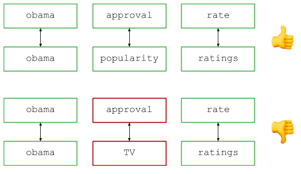
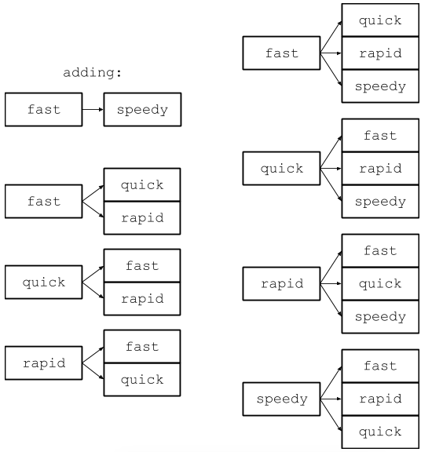
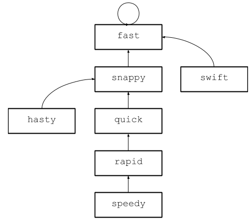
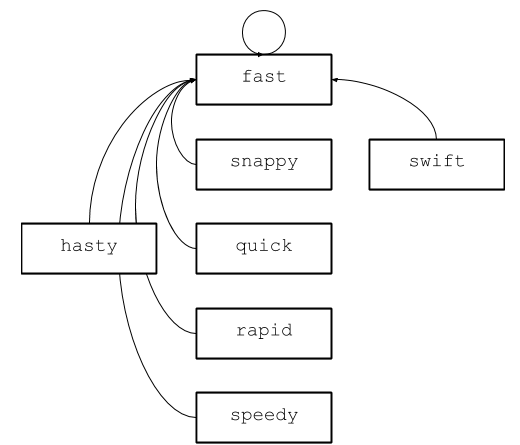

Разбор задачи с собеседования в Google: синонимичные запросы

Это новая статья из [разбора задач с собеседований в Google](https://medium.com/@alexgolec/introducing-google-interview-questions-deconstructed-a012e41ea631). Когда я там работал, то предлагал кандидатам такие задачи. Потом произошла утечка, и их запретили. Но у медали есть обратная сторона: теперь я могу свободно объяснить решение.  
  
Для начала отличные новости: я ушёл из Google! Рад сообщить, что теперь работаю техническим руководителем Reddit в Нью-Йорке! Но эта серия статей всё равно получит продолжение.

_Дисклеймер: хотя собеседование кандидатов является одной из моих профессиональных обязанностей, в этом блоге я делюсь личными наблюдениями, историями и личным мнением. Пожалуйста, не считайте это официальным заявлением Google, Alphabet, Reddit, любого другого лица или организации._

После [двух последних](https://hackernoon.com/google-interview-questions-deconstructed-the-knights-dialer-f780d516f029) [статей](https://medium.com/@alexgolec/google-interview-questions-deconstructed-the-knights-dialer-impossibly-fast-edition-c288da1685b8) о ходе конём в наборе телефонного номера мне пришли критические замечания, что это не реалистичная проблема. Как ни полезно изучить навыки мышления кандидата, но вынужден признать: задача действительно немного нереалистичная. Хотя у меня есть некоторые мысли по поводу корреляции между вопросами на собеседованиях и реальностью, но я пока оставлю их при себе. Будьте уверены, я везде читаю комментарии и мне есть что ответить, только не сейчас.

Но когда задачу про ход конём запретили несколько лет назад, я принял критику близко к сердцу и попытался заменить её вопросом, который немного больше относится к сфере деятельности Google. А что может актуальнее для Google, чем механика поисковых запросов? Так я нашёл этот вопрос и долгое время его использовал, прежде чем он тоже попал в паблик и был запрещён. Как и прежде, я сформулирую вопрос, погружусь в его объяснение, а затем расскажу, как использовал его на собеседованиях и почему он мне нравится.

Итак, вопрос.

Представьте, что вы управляете популярной поисковой системой и в логах видите два запроса: скажем, «рейтинги одобрения Обамы» и «уровень популярности Обамы» (если я правильно помню, это реальные примеры из базы вопросов, хотя сейчас они немного устарели...). Мы видим разные запросы, но все согласятся: пользователи ищут по сути одну и ту же информацию, так что запросы следует считать эквивалентными при подсчёте количества запросов, показа результатов и т. д. **Как определить, что два запроса являются синонимами?**

Давайте формализуем задачу. Предположим, есть два набора пар строк: пары синонимов и пары запросы.

Если говорить конкретно, вот пример входных данных для иллюстрации:

    SYNONYMS = [
      ('rate', 'ratings'),
      ('approval', 'popularity'),
    ]
    
    QUERIES = [
      ('obama approval rate', 'obama popularity ratings'),
      ('obama approval rates', 'obama popularity ratings'),
      ('obama approval rate', 'popularity ratings obama')
    ]

Нужно выдать список логических значений: являются ли синонимичными запросы в каждой паре.

На первый взгляд, это простая задача. Но чем дольше думаете, тем сложнее она становится. Может ли у слова быть несколько синонимов? Имеет ли значение порядок слов? Являются ли синонимичные отношения транзитивными, то есть если А синонимично B, а B синономично С, то является ли А синонимом С? Могут ли синонимы охватывать несколько слов, как «США» является синонимом для фраз «Соединённые Штаты Америки» или «Соединённые Штаты»?

Такая неоднозначность сразу даёт возможность проявить себя хорошему кандидату. Первое, что он делает — выискивает такие двусмысленности и пытается их разрешить. Все делают это по-разному: одни подходят к доске и пытаются вручную решить конкретные случаи, а другие смотрят на вопрос и сразу видят пробелы. В любом случае, выявление этих проблем на раннем этапе имеет решающее значение.

Фаза «понимания проблемы» имеет большое значение. Я люблю называть программную инженерию фрактальной дисциплиной. Как у фракталов, приближение раскрывает дополнительную сложность. Вы думаете, что понимаете проблему, потом смотрите поближе — и видите, что упустили какую-то тонкость или деталь реализации, которую можно улучшить. Или другой подход к проблеме.

  
_Множество Мандельброта_

**Калибр инженера во многом определяется тем, насколько глубоко он может понять проблему.** Преобразовать расплывчатую постановку задачи в подробный набор требований — первый шаг в этом процессе, и умышленная недосказанность позволяет оценить, насколько хорошо кандидат подходит к новым ситуациям.

_Оставим в стороне тривиальные вопросы, вроде «Имеют ли значение заглавные буквы?», которые не влияют на основной алгоритм. На эти вопросы я всегда даю самый простой ответ (в этом случае «Предположим, что все буквы уже предварительно обработаны и приведены к строчным»)_

Если кандидаты задают вопросы, я всегда начинаю с самого простого случая: у слова может быть несколько синонимов, порядок слов имеет значение, синонимы не транзитивны. Это даёт довольно ограниченную функциональность поисковой системе, но в ней достаточно тонкостей для интересного собеседования.

Высокоуровневый обзор выглядит следующим образом: разбейте запрос на слова (например, по пробелам) и сравните соответствующие пары для поиска идентичных слов и синонимов. Визуально это выглядит так:

В коде:

    def synonym_queries(synonym_words, queries):
        '''
        synonym_words: iterable of pairs of strings representing synonymous words
        queries: iterable of pairs of strings representing queries to be tested for 
                 synonymous-ness
        '''
        output = []
        for q1, q2 in queries:
            q1, q2 = q1.split(), q2.split()
            if len(q1) != len(q2):
                output.append(False)
                continue
            result = True
            for i in range(len(q1)):
                w1, w2 = q1[i], q2[i]
                if w1 == w2:
                    continue
                elif words_are_synonyms(w1, w2):
                    continue
                result = False
                break
            output.append(result)
        return output

Легко, правда? Алгоритмически это довольно просто. Никакого динамического программирования, рекурсии, сложных структур и т. д. Простая манипуляция стандартной библиотекой и алгоритм, который работает за линейное время, верно?

Но здесь больше нюансов, чем кажется на первый взгляд. Безусловно, самым сложным компонентом является сравнение синонимов. Хотя компонент прост в понимании и описании, существует много способов ошибиться. Расскажу о наиболее распространённых ошибках.

Для ясности: никакие ошибки не дисквалифицируют кандидата; если что, я просто указываю на ошибку в реализации, он исправляет, и мы идём дальше. Однако собеседование — это, прежде всего, борьба со временем. Вы будете делать, замечать и исправлять ошибки, но это отнимает время, которое можно потратить на другое, например, на создание более оптимального решения. Практически все совершают ошибки, это нормально, но кандидаты, которые делают их меньше, показывают лучший результат просто потому, что тратят меньше времени исправления.

Вот почему мне нравится эта проблема. Если ход конём требует озарения в понимании алгоритма, а затем (надеюсь) простой реализации, то здесь решение — это множество шажков в правильном направлении. Каждый шаг представляет крошечное препятствие, через которое кандидат может либо изящно перепрыгнуть, либо споткнуться и подняться. Хорошие кандидаты благодаря опыту и интуиции избегают этих маленьких ловушек — и получают более подробное и правильное решение, в то время как более слабые тратят время и энергию на ошибки и обычно остаются с ошибочным кодом.

На каждом собеседовании я видел разное сочетание успехов и провалов, вот самые распространённые ошибки.

#### Случайные убийцы производительности

Во-первых, некоторые кандидаты реализовали обнаружение синонимов с помощью простого обхода списка синонимов:

    ...
    elif (w1, w2) in synonym_words:
      continue
    ...

На первый взгляд, это кажется разумным. Но при ближайшем рассмотрении идея оказывается очень, очень плохой. Для тех из вас, кто не знает Python, ключевое слово `in` — синтаксический сахар для метода _contains_ и работает над всеми стандартными контейнерами Python. Это проблема, потому что `synonym_words` — список, который реализует ключевое слово in с помощью линейного поиска. Пользователи Python особенно чувствительны к этой ошибке, потому что язык скрывает типы, но пользователи C++ и Java тоже иногда делали похожие ошибки.

За всю карьеру я всего несколько раз писал код с линейным поиском, и каждый по списку длиной не более двух десятков элементов. И даже в этом случае писал длинный комментарий с объяснением, почему выбрал такой, казалось бы, неоптимальный подход. Подозреваю, что некоторые кандидаты использовали его просто потому что не знали, как работает со списками ключевое слово `in` в стандартной библиотеке Python. Это простая ошибка, не фатальная, но плохое знакомство с любимым языком — не очень хорошо.

На практике этой ошибки легко избежать. Во-первых, никогда не забывайте типы своих объектов, даже если используете нетипизированный язык, такой как Python! Во-вторых, помните, что при использовании ключевого слова _in_ в списке запускается линейный поиск. Если нет гарантии, что этот список всегда останется очень маленьким, он убьёт производительность.

Чтобы кандидат опомнился, обычно достаточно напомнить ему, что входная структура является списком. Очень важно наблюдать, как кандидат реагирует на подсказку. Лучшие кандидаты сразу пытаются как-то предварительно обработать синонимы, что является хорошим началом. Однако этот подход не лишён своих подводных камней…

#### Используйте правильную структуру данных

Из приведённого выше кода сразу видно, что для реализации этого алгоритма в линейное время необходимо быстро находить синонимы. А когда мы говорим о быстром поиске, это всегда карта или массив хэшей.

Мне не важно, выберет кандидат карту или массив хэшей. Важно то, что он туда вложит (кстати, никогда не используйте dict/hashmap с переходом в `True` или `False`). Большинство кандидатов выбирают какой-то dict/hashmap. Самая распространённая ошибка — подсознательное предположение, что у каждого слова не больше одного синонима:

    ...
    synonyms = {}
    for w1, w2 in synonym_words:
      synonyms[w1] = w2
    ...
    elif synonyms[w1] == w2:
      continue 

Я не наказываю кандидатов за эту ошибку. Задача специально сформулирована так, чтобы не заострять внимание на том, что у слов может быть несколько синонимов, а некоторые кандидаты просто не сталкивались с такой ситуацией. Большинство быстро исправляет ошибку, когда я на неё указываю. Хорошие кандидаты замечают её на раннем этапе и обычно не тратят много времени.

Чуть более серьёзная проблема — неосознание, что отношения синонимов распространяются в обоих направлениях. Заметьте, что в приведённом выше коде это учитывается. Но встречаются реализации с ошибкой:

    ...
    synonyms = defaultdict(set)
    for w1, w2 in synonym_words:
      synonyms[w1].append(w2)
      synonyms[w2].append(w1)
    ...
    elif w2 in synonyms.get(w1, tuple()):
      continue

Зачем выполнять две вставки и использовать в два раза больше памяти?

    ...
    synonyms = defaultdict(set)
    for w1, w2 in synonym_words:
      synonyms[w1].append(w2)
    ...
    elif (w2 in synonyms.get(w1, tuple()) or
        w1 in synonyms.get(w2, tuple())):
      continue

Вывод: _всегда думайте, как оптимизировать код_! В ретроспективе перестановка функций поиска является очевидной оптимизацией, в ином случае можно сделать вывод, что кандидат не думал над вариантами оптимизации. Опять же, я рад дать подсказку, но лучше догадаться самому.

Некоторые умные кандидаты хотят отсортировать список синонимов, а затем использовать двоичный поиск. На самом деле у такого подхода есть важное преимущество: он не требует дополнительного пространства, кроме списка синонимов (при условии, что допускается изменение списка).

К сожалению, мешает сложность по времени: сортировка списка синонимов требует `Nlog(N)` времени, а затем ещё `log(N)` для поиска каждой пары синонимов, в то время как описанное решение предварительной обработки происходит в линейном, а затем постоянном времени. Кроме того, я категорически против того, чтобы заставлять кандидата реализовать сортировку и двоичный поиск на доске, потому что: 1) алгоритмы сортировки хорошо известны, поэтому, насколько я знаю, кандидат может выдать его не думая; 2) эти алгоритмы дьявольски сложно правильно реализовать, и часто даже лучшие кандидаты будут делать ошибки, которые ничего не говорят об их навыках программирования.

Всякий раз, когда кандидат предлагал такое решение, я интересовался временем выполнения программы и спрашивал, есть ли вариант лучше. Для информации: если интервьюер спрашивает вас, есть ли вариант лучше, почти всегда ответ «да». Если я когда-нибудь задам вам этот вопрос, ответ точно будет таким.

#### Наконец, решение

В конце концов кандидат предлагает что-то правильное и достаточно оптимальное. Вот реализация в линейном времени и линейном пространстве для заданных условий:

    def synonym_queries(synonym_words, queries):
        '''
        synonym_words: iterable of pairs of strings representing synonymous words
        queries: iterable of pairs of strings representing queries to be tested for 
                 synonymous-ness
        '''
        synonyms = defaultdict(set)
        for w1, w2 in synonym_words:
            synonyms[w1].add(w2)
    
        output = []
        for q1, q2 in queries:
            q1, q2 = q1.split(), q2.split()
            if len(q1) != len(q2):
                output.append(False)
                continue
            result = True
            for i in range(len(q1)):
                w1, w2 = q1[i], q2[i]
                if w1 == w2:
                    continue
                elif ((w1 in synonyms and w2 in synonyms[w1]) 
                        or (w2 in synonyms and w1 in synonyms[w2])):
                    continue
                result = False
                break
            output.append(result)
        return output

Несколько быстрых замечний:

*   Обратите внимание на использование `dict.get()`. Вы можете реализовать проверку, находится ли ключ в dict, а затем получить его, но это усложнённый подход, хотя таким образом вы покажете свои знания стандартной библиотеки.
*   Я лично не поклонник кода с частыми `continue`, и [некоторые руководства по стилю запрещают или не рекомендуют их](https://stackoverflow.com/questions/10975722/why-continue-is-considered-as-a-c-violation-in-misra-c2004). Я сам в первой редакции этого кода забыл оператор `continue` после проверки длины запроса. Это не плохой подход, просто знайте, что он подвержен ошибкам.

  

У хороших кандидатов после решения задачи остаётся ещё десять-пятнадцать минут времени. К счастью, есть куча дополнительных вопросов, хотя вряд ли мы напишем много кода за это время. Впрочем, в этом нет необходимости. Я хочу знать о кандидате две вещи: способен ли он разрабатывать алгоритмы и умеет ли кодировать? Задача с ходом конём сначала отвечает на вопрос о разработке алгоритма, а затем проверяет кодирование, а здесь мы получаем ответы в обратном порядке.

К тому времени, когда кандидат завершил первую часть вопроса, он уже решил проблему с (удивительно нетривиальным) кодированием. На этом этапе я могу с уверенностью говорить о его способности разрабатывать рудиментарные алгоритмы и переводить идеи в код, а также о знакомстве со своим любимым языком и стандартной библиотекой. Теперь разговор становится намного интереснее, потому что требования к программированию можно смягчить, а мы погрузимся в алгоритмы.

С этой целью вернёмся к основным постулатам первой части: важен порядок слов, синонимы нетранзитивны и для каждого слова может быть несколько синонимов. По мере продвижения интервью я изменяю каждое из этих ограничений, и в этой новой фазе у нас с кандидатом происходит чисто алгоритмическое обсуждение. Здесь я приведу примеры кода, чтобы проиллюстрировать свою точку зрения, но в реальном интервью мы говорим только об алгоритмах.

Прежде чем начать, объясню свою позицию: все последующие действия на этом этапе интервью — в основном, «бонусные баллы». Мой личный подход заключается в выявлении кандидатов, которые точно проходят первый этап и подходят для работы. Второй этап нужен для выделения самых лучших. Первый рейтинг уже очень сильный и означает, что кандидат достаточно хорош для компании, а второй рейтинг говорит, что кандидат превосходен и его найм станет для нас большой победой.

Сначала я люблю снять ограничение на транзитивность, так что если синонимами являются пары A−B и В−С, то слова A и C тоже являются синонимами. Сообразительные кандидаты быстро поймут, как адаптировать своё предыдущее решение, хотя при дальнейшем снятии других ограничений основная логика алгоритма перестанет работать.

Тем не менее, как его адаптировать? Один из распространённых подходов — поддерживать полный набор синонимов для каждого слова на основе транзитивных отношений. Каждый раз, когда мы вставляем слово в набор синонимов, мы также добавляем его в соответствующие наборы для всех слов, находящихся в этом наборе:

    synonyms = defaultdict(set)
    for w1, w2 in synonym_words:
        for w in synonyms[w1]:
            synonyms[w].add(w2)
        synonyms[w1].add(w2)
        for w in synonyms[w2]:
            synonyms[w].add(w1)
        synonyms[w2].add(w1)

_Обратите внимание, что создавая код, мы уже углубились в это решение_

Это решение работает, но далеко не оптимально. Чтобы понять причины, оценим пространственную сложность этого решения. Каждый синоним нужно добавить не только к набору начального слова, но и к наборам всех его синонимов. Если синоним один, то добавляется одна запись. Но если у нас 50 синонимов, придётся добавить 50 записей. На рисунке это выглядит следующим образом:

Обратите внимание, что мы перешли от трёх ключей и шести записей к четырём ключам и двенадцати записям. Слово с 50 синонимами потребует 50 ключей и почти 2500 записей. Необходимое пространство для представления одного слова квадратично растёт с увеличением набора синонимов, что довольно расточительно.

Есть и другие решения, но не буду слишком углубляться, чтобы не раздувать статью. Наиболее интересное из них — использование структуры данных синонимов для построения ориентированного графа, а затем поиск в ширину для нахождения пути между двумя словами. Это прекрасное решение, но поиск становится линейным по размеру набора синонимов для слова. Поскольку мы выполняем этот поиск для каждого запроса несколько раз, такой подход не оптимален.

Оказывается, поиск синонимов возможен за (почти) постоянное время благодаря структуре данных под названием непересекающиеся множества (disjoint set). Эта структура предлагает несколько иные возможности, чем обычный набор данных (set).

Обычная структура набора (hashset, treeset) представляет собой контейнер, который позволяет быстро определить, находится объект внутри или вне его. Непересекающиеся множества решают совсем иную проблему: вместо определения конкретного элемента они позволяют определить, _принадлежат ли два элемента одному набору_. Более того, структура делает это за с ослепительно быстрое время `O(a(n))`, где `a(n)` — обратная функция Аккермана. Если вы не изучали продвинутые алгоритмы, то можете не знать эту функцию, которая для всех разумных входов фактически выполняется за постоянное время.

На высоком уровне алгоритм работает следующим образом. Наборы представлены деревьями с родителями у каждого элемента. Поскольку у каждого дерева есть корень (элемент, который сам себе родитель), мы можем определить, принадлежат ли два элемента одному набору, проследив их родителей до корня. Если у двух элементов один корень, они принадлежат одному набору. Объединение множеств тоже легко: просто находим корневые элементы и делаем один из них корнем другого.

Пока всё хорошо, но пока не видно ослепительной скорости. Гениальность этой структуры — в процедуре под названием _сжатие_. Предположим, у вас есть следующее дерево:

Представьте, что вы хотите узнать, являются ли синонимами слова _speedy_ и _hasty_. Идёте по родителям каждого — и находите одинаковый корень _fast_. Теперь предположим, что мы выполняем аналогичную проверку для слов _speedy_ и _swift_. Опять идём вверх до корня, причём от _speedy_ мы идём тем же маршрутом. Можно ли избежать дублирования работы?

Оказывается, можно. В некотором смысле, каждому элементу в этом дереве суждено прийти к _fast_. Вместо того, чтобы каждый раз проходить по всему дереву, почему бы не изменить родителя для всех потомков _fast_, чтобы сократить маршрут к корню? Этот процесс называется сжатием, и в непересекающихся множествах он встроен в операцию поиска корня. Например, после первой операции по сравнению _speedy_ и _hasty_ структура поймёт, что они синонимы, и сожмёт дерево следующим образом:

_Для всех слов между speedy и fast обновился родитель, то же самое произошло с hasty_

Теперь все последующие обращения будут происходить в постоянном времени, потому что каждый узел в этом дереве указывает на _fast_. Здесь не очень просто оценить временную сложность операций: на самом деле, она не постоянна, потому что зависит от глубины деревьев, но близка к постоянной, потому что структура быстро оптимизируется. Для простоты будем считать, что время постоянное.

С этой концепцией реализуем несвязанные множества для нашей проблемы:

    class DisjointSet(object):
        def __init__(self):
            self.parents = {}
    
        def get_root(self, w):
            words_traversed = []
            while self.parents[w] != w:
                words_traversed.append(w)
                w = self.parents[w]
            for word in words_traversed:
                self.parents[word] = w
            return w
    
        def add_synonyms(self, w1, w2):
            if w1 not in self.parents:
                self.parents[w1] = w1
            if w2 not in self.parents:
                self.parents[w2] = w2
    
            w1_root = self.get_root(w1)
            w2_root = self.get_root(w2)
            if w1_root < w2_root:
                w1_root, w2_root = w2_root, w1_root
            self.parents[w2_root] = w1_root
    
        def are_synonymous(self, w1, w2):
            return self.get_root(w1) == self.get_root(w2)

Используя эту структуру, можно предварительно обработать синонимы и решить задачу за линейное время.

К этому моменту мы достигли предела того, что кандидат может показать за 40−45 минут собеседования. Всем кандидатам, которые справились с вводной частью и добились значительного прогресса в описании (не реализации) несвязанных множеств, я присваивал рейтинг «Настоятельно рекомендуется принять на работу» и позволял им задавать любые вопросы. Никогда не видел, чтобы кандидат зашёл так далеко и у него осталось много времени.

В принципе, ещё есть варианты задачи с транзитивностью: например, убрать ограничение на порядок слов или на несколько синонимов для слова. Каждое решение будет сложным и восхитительным, но оставлю их на потом.

Достоинство этой задачи в том, что она позволяет кандидатам ошибаться. Ежедневная разработка ПО состоит из бесконечных циклов анализа, выполнения и уточнения. Эта проблема даёт возможность кандидатам продемонстрировать свои способности на каждом этапе. Рассмотрим навыки, необходимые для получения максимальной оценки по этому вопросу:

*   _Проанализируйте постановку задачи_ и _определите, где она недостаточно чётко сформулирована_, разработайте однозначную формулировку. Продолжайте делать это по мере решения и возникновения новых вопросов. Для максимальной эффективности производите эти операции как можно раньше, потому чем дальше зашла работа, тем больше времени займёт исправление ошибки.  
    
*   _Сформулируйте проблему_ таким образом, чтобы к ней было легче подойти и решить. В нашем случае самым важным является наблюдение, что соответствующие слова в запросах выстраиваются друг относительно друга.  
    
*   _Реализуйте свое решение_. Это включает в себя выбор оптимальной структуры данных и алгоритмов, а также проектирование логики, читаемой и легко изменяемой в будущем.  
    
*   Вернитесь назад, _попытайтесь найти баги и ошибки_. Это могут быть фактические ошибки, как я забыл вставить оператор `continue` выше, или ошибки производительности, как использование неправильной структуры данных.  
    
*   Когда определение проблемы изменится, _повторите весь процесс: адаптируйте своё решение, где это необходимо_, или откажитесь от него, если оно не подходит. Понимание, когда нужно сделать одно или другое, является критически важным навыком и в собеседовании, и в реальном мире.  
    
*   _Осваивайте структуры данных и алгоритмы_. Непересекающиеся множества — не очень известная структура, но на самом деле не такая уж редкая и утончённая. Единственный способ гарантировать знание инструментария для работы — как можно больше учиться.

Ни один из этих навыков нельзя освоить по учебникам (за исключением, возможно, структур данных и алгоритмов). Единственный способ приобрести эти их — регулярная и обширная практика, которая хорошо согласуется с тем, что нужно работодателю: опытные кандидаты, способные эффективно применять свои знания. Смысл собеседований — найти таких людей, и задача из этой статьи долгое время хорошо мне помогала.

Как вы могли понять, задача в конце концов [стала известна общественности](https://www.careercup.com/question?id=5713824039567360). С тех пор я использовал несколько других вопросов, в зависимости от того, что спрашивали прошлые интервьюеры и от моего настроения (задавать всё время один вопрос скучно). Некоторые вопросы использую до сих пор, так что их буду держать в секрете, но некоторые нет! Можете узнать их в следующих статьях.

На ближайшее время я планирую две статьи. Во-первых, как и обещал выше, объясню решение двух оставшихся проблем для этой задачи. Я их никогда не задавал на собеседованиях, но они интересны сами по себе. Кроме того, поделюсь своими размышлениями и личным мнением о процедуре поиска сотрудников в IT, что мне особенно интересно сейчас, потому что я ищу инженеров для своей команды в Reddit.

Как всегда, если хотите узнать о выходе новых статей, следите за мной [в твиттере](https://twitter.com/alex_golec) или на [Medium](https://medium.com/@alexgolec). Если вам понравилась эта статья, не забудьте прогголосовать за неё или оставить комментарий.

Благодарю за чтение!

P. S.: Можете изучить код всех статей в [репозитории GitHub](https://github.com/alexgolec/interview-problems) или [поиграться с ним вживую](https://repl.it/@alexgolec/SynonymQueries) благодаря моим добрым друзьям из [repl.it](http://repl.it/).