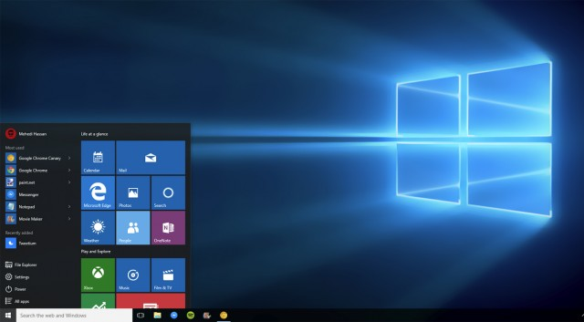
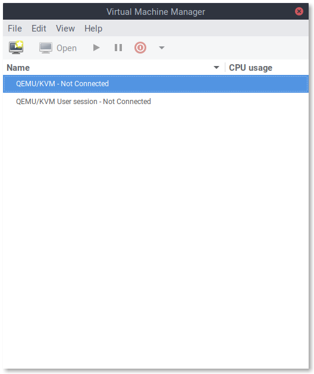
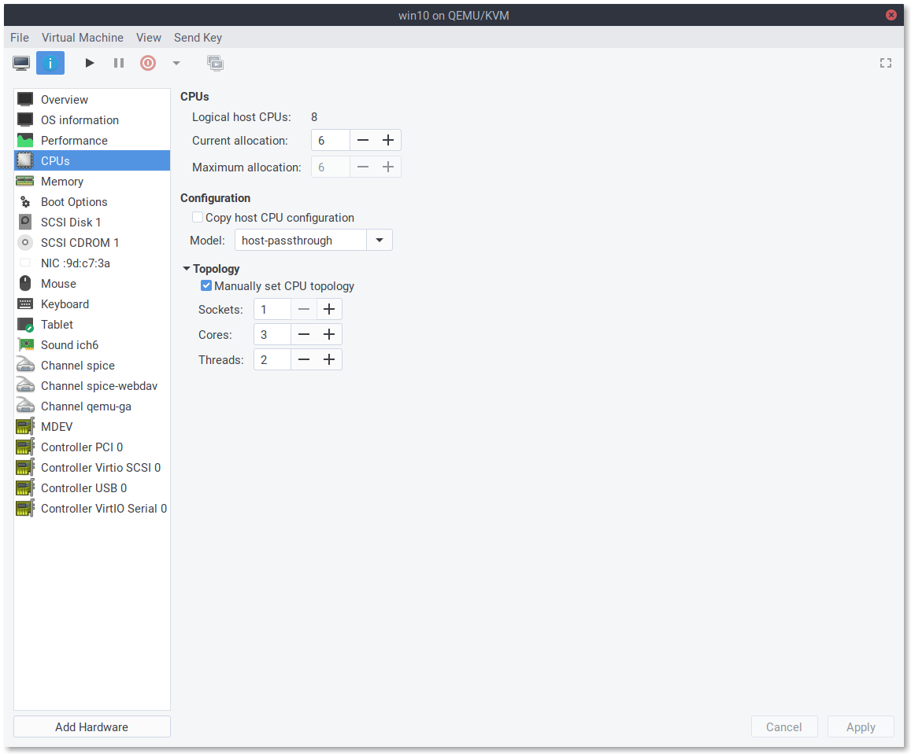
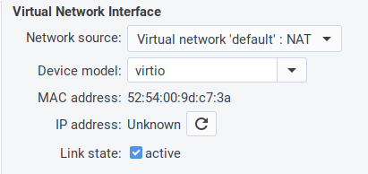

Разворачиваем виртуалку с Windows с пробросом виртуальной видеокарты с помощью QEMU и Intel GVT-g

Всем привет! Intel предложили отличное решение извечной проблемы: "у меня есть ноутбук на Linux и мне надо запускать Windows с аппаратным ускорением, но у меня нет тяжеленного ноутбука с двумя GPU и жидкостным охлаждением". С помощью архитектуры своих GPU или чего-то ещё им удалось сделать так, что вы можете разбить свой встроенный Intel GPU на два или более GPU.

К сожалению, это отнюдь не так просто… Документация слегка устарела, и некоторые вещи ломаются непонятным образом без очевидной причины. Поэтому в данном посте я расскажу вам, как настроить аппаратно ускоренную виртуальную машину с Windows с крутыми быстрыми драйверами virtio и Intel GVT-g.

Для этого вам понадобится более-менее современный GPU (_Примечание переводчика_: _согласно [официальной документации](https://github.com/intel/gvt-linux/wiki/GVTg_Setup_Guide#22-hardware-requirements), GVT-g поддерживают интегрированные видеокарты, начиная с пятого поколения Intel Core и с четвёртого поколения Xeon_).

## Шаг 1: настраиваем ядро

Проверьте, что у вас свежая версия ядра. Похоже, что опции для GVT-g были включены и до версии 4.8, но тогда они точно работали хуже, поэтому я рекомендую использовать последнее доступное ядро. Если вы достаточно оригинальны, чтобы собирать своё ядро, включите [эти опции](https://github.com/intel/gvt-linux/wiki/GVTg_Setup_Guide#32-build-kernel). Также отключите удаление неиспользуемых ksyms, поскольку эта опция [вызывает баг](https://github.com/intel/gvt-linux/issues/57).

Теперь нужно поправить аргументы командной строки ядра. Важные опции таковы:

  

    i915.enable_gvt=1 kvm.ignore_msrs=1 intel_iommu=on i915.enable_guc=0

Убедитесь, что вы не переопределили `enable_guc=0` чем-то, что включит загрузку GuC, поскольку это приведёт к удручающему крашу драйвера i915. Когда загрузитесь, зайдите в своё рабочее окружение и проверьте наличие директории `/sys/bus/pci/devices/0000:00:02.0/mdev_supported_types/`. Если её не существует, GVT-g не работает. Проверьте логи и/или поплачьте в подушку.

Как вариант решения проблемы можно добавить [эти](https://github.com/intel/gvt-linux/wiki/GVTg_Setup_Guide#321-build-the-initrd-initial-ramdisk) модули в initramfs и удалить оттуда i915.

Для более подробного логирования, можно задать переменной `drm.debug` какое-нибудь значение, например, установка её в значение 0x02 включит сообщения от драйверов.

  

## Шаг 2: создаём виртуального друга

Внутри `mdev_supported_types` можно найти целый набор директорий. Этот набор определяется количеством вашей графической памяти, каждая поддиректория соответствует некоторому типу виртуального GPU. Файл `description` в ней содержит информацию о памяти и разрешениях, поддерживаемых данным виртульным GPU. Если создание виртуального GPU с большой памятью с помощью вывода UUID в файл `/create` вам выдаёт непонятную ошибку, то у вас есть несколько опций. Сперва стоит зайти в BIOS и добавить видеопамяти, если возможно. Если это не работает, можно остановить ваш DM, переключиться на фреймбуфер, создать нужный vGPU оттуда, а затем вернуться в x11. К сожалению, такой способ приводит ко многим багам и не даёт добиться 60 FPS на моём ноутбуке. Альтернативный вариант состоит в том, чтобы создать vGPU поменьше, и использовать специальную программу для увеличения разрешения (CRU). Таким способом мне удалось добиться 60 FPS и багов и зависаний встретилось гораздо меньше.

Создать vGPU можно такой командой:

  

    $ echo ${vGPU_UUID} | sudo tee /sys/bus/pci/devices/0000:00:02.0/mdev_supported_types/${vGPU_TYPE}/create

А удалить — такой:

  

    $ echo 1 | sudo tee /sys/bus/mdev/devices/${vGPU_UUID}/remove

_Примечание переводчика_:  
_Сгенерировать UUID для vGPU можно с помощью команды `uuidgen` без аргументов. Переменная ${vGPU_TYPE} обозначает один из типов, перечисленных в директории `mdev_supported_types`. Также стоит заметить, что vGPU при каждой перезагрузке надо создавать заново, они не сохраняются между запусками ОС._

  

## Шаг 3: Cortana кричит на вас

На очереди существенно лучше поддерживаемая и существенно более медленная и болезненная вещь — установка Windows 10. Не стоит использовать торренты или неофициальную загрузку, или старую версию Windows, правильная ссылка [здесь](https://www.microsoft.com/en-us/software-download/windows10). Также стоит скачать образ диска с драйверами virtio, разработанными специально для ускорения гостей, [здесь](https://fedorapeople.org/groups/virt/virtio-win/direct-downloads/stable-virtio/virtio-win.iso). Установите `libvirt` и `virt-manager` и запустите `libvirtd`:

  

    # systemctl start libvirtd

Запустите `virt-manager` и убедитесь, что вы подключились к системной сессии `libvirt`, а не пользовательской:  

_Примечание переводчика_:  
_Для того, чтобы virt-manager мог подключиться к системной сессии, можно запустить его от имени суперпользователя, но лучше настроить авторизацию, например, как предложено на [Arch Wiki](https://wiki.archlinux.org/index.php/libvirt#Set_up_authentication)._

Как только вы это сделали, можно приступить к созданию виртуальной машины. В диалоге настройки выберите загрузку с локального iso-образа и найдите скачанный образ. Если `virt-manager` не распознал его, как образ Windows 10, выберите её вручную, поскольку это ускорит Windows, так как `virt-manager` в этом случае предоставляет некоторые интерфейсы виртуализации от Microsoft. Создайте образ диска или LVM-раздел и настройте конфигурацию, как вам нужно. Интерфейс настройки перед установкой весьма ограничен, поэтому я обычно начинаю установку и сразу её останавливаю, чтобы полностью настроить всё. Вот некоторые настройки:  
  

_Примечание переводчика_:  
_Несмотря на то, что пост о настройке виртуальной машины на ноутбуке, почему-то опущен вопрос насчёт раздачи сети с помощью беспроводного адаптера. Дело в том, что настройки сети по-умолчанию в virt-manager не годятся для беспроводной сети. В этой ситуации может помочь ответ на [этот](https://unix.stackexchange.com/questions/159191/setup-kvm-on-a-wireless-interface-on-a-laptop-machine) вопрос и комментарии к нему. Также автор предлагает использовать BIOS вместо UEFI, вероятно, из-за того, что UEFI требует дополнительной настройки. К тому же, похоже, tianocore ещё не работает с GVT-g, см. [bug 935](https://bugzilla.tianocore.org/show_bug.cgi?id=935). В моём случае, впрочем, ВМ запускалась, но Windows не распознавала монитор, к которому подключена интегральная видеокарта._

Если вам нужен быстрый доступ к диску или даже способность виртуальной машины сжимать образ диска при удалении файлов виртуальной машины (проброс TRIM, для этого нужно создать образ командой `qemu-img create -f qcow2 -o preallocation=metadata,lazy_refcounts`, полная инструкция [здесь](https://chrisirwin.ca/posts/discard-with-kvm/)), настройте основной диск на использование SCSI. Для виртуальной машины понадобятся драйвера, чтобы Windows поняла этот формат, так что подключите ранее скачанный диск с драйверами virtio для Windows 10. По умолчанию они используют IDE, но вы можете ускорить установку в разы и задействовать меньше легаси-кода, если будете использовать вместо этого для dvd-дисков SCSI. Windows поддерживает это из коробки. Также вы можете:

  

*   Заставить USB-шину использовать USB 3.0
*   Добавить каналы spice, spice-webdav и qemu-ga, чтобы работали копирование и вставка и обмен файлами между VM и хостом
*   Удалить неиспользуемое виртуальное оборудование
*   Переключить эмулируемую видекарту на QXL и переключить дисплей на SPICE, НЕ слушающий сеть (даже loopback) (_Примечание переводчика: иначе ВМ попросту крашится_).
*   Переключить тип микросхем на Q35, настройка рядом с настройками BIOS.
*   Покормить собаку

Также вы можете начать привыкать к вашему новому другу `virsh edit`. Если запустить его с помощью `sudo -E`, ваши переменные окружения, в частности EDITOR, будут использованы для редактирования, при этом вы будете использовать системную сессию libvirt, а не пользовательскую. В этом файле можно, например, назначить соответствие между физическими и виртуальными процессорами, благодаря чему кэши процессоров более консистентны и планировщик ведёт себя не так странно. Вот пример XML, который вы можете туда поместить:

  

    <vcpu placement='static'>6</vcpu>
    <cputune>
      <vcpupin vcpu='0' cpuset='1'/>
      <vcpupin vcpu='1' cpuset='2'/>
      <vcpupin vcpu='2' cpuset='3'/>
      <vcpupin vcpu='3' cpuset='5'/>
      <vcpupin vcpu='4' cpuset='6'/>
      <vcpupin vcpu='5' cpuset='7'/>
    </cputune>
    <features>
      <hyperv>
        <relaxed state='on'/>
        <vapic state='on'/>
        <spinlocks state='on' retries='8191'/>
        <runtime state='on'/>
        <synic state='on'/>
        <stimer state='on'/>
      </hyperv>
    </features>
    <cpu mode='host-passthrough' check='none'>
      <topology sockets='1' cores='3' threads='2'/>
    </cpu>

В этом фрагменте я настраиваю ВМ так, чтобы она видела процессор с тремя физическими ядрами, каждое из которых имеет два гиперпотока. Далее, каждый процессор/гиперпоток прикрепляется к своему гиперпотоку, и это соответствие не меняется. Планировщик Windows знает о гиперпотоках и может их использовать корректно, не считая их отдельными процессорами. Также я включаю некоторые интерфейсы Hyper-V, которые по умолчанию выключены и могут не иметь эффекта. Если вы используете SPICE, можно добавить следующие строки, чтобы отключить сжатие, поскольку внешняя сеть для доступа к ВМ всё равно не используется.

  

    <graphics type='spice'>
       <listen type='none'/>
       <image compression='off'/>
       <jpeg compression='never'/>
       <zlib compression='never'/>
       <playback compression='off'/>
       <streaming mode='off'/>
       
    </graphics>

Теперь можно настроить порядок загрузки и начать установку Windows. Если вы используете `virtio` или SCSI-диск, Windows не найдёт его. Вам понадобится установить драйвер SCSI с диска, который вы подключили, они находятся в директории `virtscsi/amd64`. Всё должно пройти гладко, и Windows должна загрузиться в медленном и убогом не ускоренном режиме. Cortana начнёт кричать на вас, а ваша сеть не будет работать. Прорвитесь через всё это к рабочему столу. Там запустите диспетчер устройств, найдите все неопознанные устройства, и обновите драйвера для них с диска, который вы подключили. Вы получите несколько более быструю Windows.

  

## Шаг 4: Весёлая часть

Есть три способа получить ускоренный виртуальный дисплей VM с Windows на экране вашей машины.

  

*   VNC или какой-то другой протокол удалённого доступа (обычно это весьма плохое решение). В этом варианте вам нужно только подключить vGPU и отключить все остальные дисплеи и видеокарты. Также выставьте настройку `display='off'`. Вам не нужна опция `igd-opregion`, показанная позже.
*   SPICE (у меня не получилось добиться 30 FPS или выше, но работает общий буфер обмена и передача файлов между VM и хостом).
*   Встроенный интерфейс QEMU на GTK+ (общий буфер обмена и передача файлов не работают, но можно добиться 60 FPS с помощью патча).

Что бы вы ни собирались использовать, вам всё равно придётся использовать второй вариант, чтобы установить драйвера для GPU. Встроенные драйвера от Microsoft не очень хорошо работают с GVT-g на момент написания поста, и часто ломаются. До того, как вы подсоедините vGPU к ВМ, желательно скачать [последнюю версию драйвера от Intel](https://downloadcenter.intel.com/)(Судя по всему, [Intel меняет подход к распространению драйверов](https://www.intel.com/content/www/us/en/support/articles/000031572/programs/intel-corporation.html), так что в будущем этот шаг, возможно, будет другим, либо станет вообще не нужным). Теперь убедитесь, что у вас создан vGPU. Откройте `virt-manager` и замените хороший быстрый QXL на медленный Cirrus во избежание конфликтов. Чтобы подключить vGPU к ВМ, нужно открыть `virsh edit` и где-нибудь добавить такой фрагмент:

  

    <domain type='kvm' xmlns:qemu='http://libvirt.org/schemas/domain/qemu/1.0'>
    <hostdev mode='subsystem' type='mdev' managed='no' model='vfio-pci' display='on'>

  

    <address uuid='fff6f017-3417-4ad3-b05e-17ae3e1a4615'/>

  

      <address type='pci' domain='0x0000' bus='0x00' slot='0x09' function='0x0'/>
      <rom enabled='no'/>
    </hostdev>
    <graphics type='spice'>
      <listen type='none'/>
      <image compression='off'/>
      <jpeg compression='never'/>
      <zlib compression='never'/>
      <playback compression='off'/>
      <streaming mode='off'/>
      <gl enable='yes' rendernode='/dev/dri/by-path/pci-0000:00:02.0-render'/> <!-- Ваш путь к устройству может отличаться, virt-manager может проставить это за вас, если вы отметите чекбокс с аппаратным ускорением GL. Убедитесь, что тут прописан путь к устройству, а не auto. -->
    </graphics>
    <qemu:commandline>
      <qemu:arg value='-set'/>
      <qemu:arg value='device.hostdev0.x-igd-opregion=on'/>
      <!-- libvirt пока не поддерживает эту опцию, поэтому её надо выставить вручную -->
    </qemu:commandline>
    </domain>

Замечание: Когда я предоставляю XML-фрагмент вроде этого, вам по возможности следует добавить его к текущему, не заменяя ничего.

Проверьте, что вы создали уникальные UUID для всех vGPU, которые вы используете, и что номера слотов не конфликтуют ни с какими из остальных PCI-устройств. Если номер слота находится после Cirrus GPU, виртуальная машина упадёт. Теперь вы можете запустить виртуальную машину. **Нужно установить `virt-viewer`, чтобы увидеть оба дисплея!** Подключиться к ВМ можно с помощью команды

  

    $ sudo -E virt-viewer --attach

Один из дисплеев будет пустой или не инициализированный, второй — уже знакомый маленький не ускоренный дисплей. Раскройте его и, войдя, установите драйвер для GPU. Если вам повезёт, всё заработает сразу же. В противном случае, надо выключить и снова запустить ВМ (не перезагрузить) с помощью работающего экрана. Теперь самое время открыть терминал и запустить внутри `dmesg -w`. Эта команда выдаст вам некоторую полезную информацию о проблемах и общем ходе работы с использованием vGPU. Например, при загрузке KVM будет жаловаться на заблокированные MSR, затем вы должны получить несколько сообщений о неправильном доступе, когда vGPU инициализируется. Если их слишком много — что-то не так.

Если система загрузилась, можно открыть настройки дисплея и отключить не ускоренный экран. Пустой экран можно скрыть через меню _View_ в `virt-viewer`. В принципе, ВМ уже можно использовать, но есть ещё пару вещей, которые можно сделать, чтобы добиться более высокого разрешения и более высокой скорости.

[Утилита CRU](https://www.monitortests.com/forum/Thread-Custom-Resolution-Utility-CRU) весьма полезна. Можете поиграться с ней, и даже если вы наткнётесь на какие-то графические артефакты или даже почти целиком чёрный экран, как получилось у меня, вы можете запустить файл `Restart64.exe`, идущий в комплекте с программой, чтобы перезагрузить графическую подсистему Windows. Лично я использую эту утилиту для использования более высокого разрешения на более скромном vGPU.

Чтобы добиться прекрасных 60 FPS, нужно переключиться на встроенный монитор QEMU на GTK+ без поддержки общего буфера обмена с хостом и подобных плюшек, а также изменить в нём одну строчку и пересобрать QEMU. Также понадобится добавить пачку противных аргументов командной строки в ваш XML. Удалите дисплей SPICE и видеокарту Cirrus и установите атрибут `display` у вашего vGPU в `off` (libvirt не поддерживает дисплей на GTK+ и не позволит загрузиться с `display='on'` без дисплея).

  

      <qemu:commandline>
        <qemu:arg value='-set'/>
        <qemu:arg value='device.hostdev0.x-igd-opregion=on'/>
        <qemu:arg value='-set'/>
        <qemu:arg value='device.hostdev0.display=on'/>
        <qemu:arg value='-display'/>
        <qemu:arg value='gtk,gl=on'/>
        <qemu:env name='DISPLAY' value=':1'/>
        <qemu:env name='GDK_SCALE' value='1.0'/>
      </qemu:commandline>

Масштабирование для HiDPI у монитора QEMU работает из рук вон плохо, поэтому мы его отключим. Также, вам понадобится установить переменную `DISPLAY` в тот номер дисплея, который вы используете. Чтобы дать пользователю, запускающему qemu, права доступа к X серверу, используйте команду:

  

    # xhost si:localuser:nobody

Если это не сработало, попробуйте `xhost +`, но убедитесь, что вы используете файрвол. Иначе попробуйте более безопасный метод.

При таких ухищрениях вы всё равно не получите выше 30 FPS из-за этого [глупого бага](https://github.com/intel/gvt-linux/issues/35#issuecomment-438149916) в QEMU, если вы не пропатчите его, изменив строку, как указано в комментарии по ссылке. Убедитесь, что вы собрали только QEMU для x86-64, если только вы не собираетесь использовать его на другой платформе. Я прикрепил мой PKGBUILD, который не меняет строчку, а только лишь собирает QEMU для x86_64 без поддержки сетевого хранилища [здесь](https://blog.bepbep.co/posts/gvt/PKGBUILD).

Если вы потерялись где-то по пути, можете посмотреть мой текущий [XML для libvirt](https://blog.bepbep.co/posts/gvt/win10.xml).

  

## Полезные ссылки

[Официальный гайд по настройке GVT-g](https://github.com/intel/gvt-linux/wiki/GVTg_Setup_Guide)  
[Руководство пользователя по Dma-buf](https://github.com/intel/gvt-linux/wiki/Dma_Buf_User_Guide)  
[Статья по настройке Intel GVT-g на NixOS Wiki](https://nixos.wiki/wiki/IGVT-g#Configure_KVM)  
[Статья на Arch Wiki про libvirt](https://wiki.archlinux.org/index.php/libvirt)  
[Настройка сети в KVM на беспроводном интерфейсе](https://unix.stackexchange.com/questions/159191/setup-kvm-on-a-wireless-interface-on-a-laptop-machine)  
[Сайт, посвящённый Intel GVT-g](https://01.org/igvt-g/)

P. S.: Спасибо [aNNiMON](https://habr.com/ru/users/annimon/) за помощь в вычитке текста перевода и исправлении ошибок.