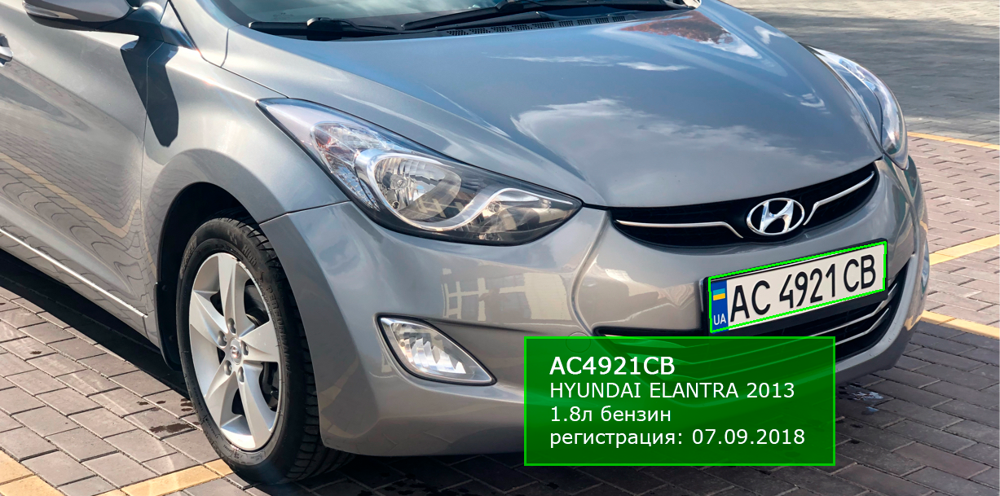
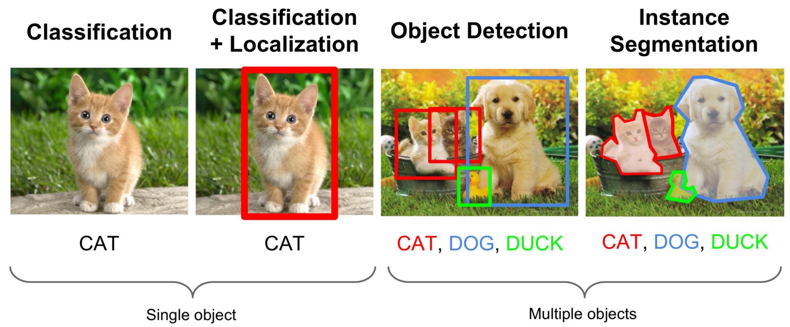
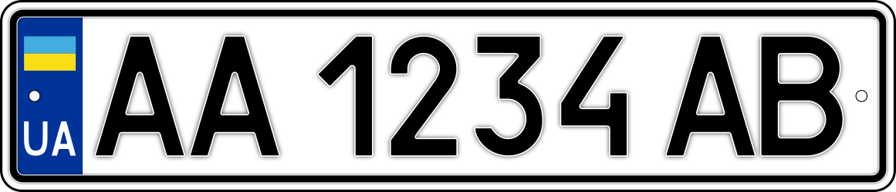

Распознавание номеров. Практическое пособие. Часть 1

Все начиналось банально — моя компания уже год платила ежемесячно плату за сервис, который умел находить регион с номерными знаками на фото. Эта функция применяется для автоматической зарисовки номера у некоторых клиентов.

И в один прекрасный день МВД Украины открыло доступ к [реестру транспортных средств](https://data.gov.ua/dataset/06779371-308f-42d7-895e-5a39833375f0). Теперь по номерному знаку стало возможным проверять некоторую информацию про автомобиль (марку, модель, год выпуска, цвет и т.д. )! Скучная рутина линейного программирования померкла перед новой свехзадачей — считывать номера по всей базе фото и валидировать эти данные с теми, что указывал пользователь. Сами знаете как это бывает «глаза загорелись» — вызов принят, все остальные задачи на время стали скучны и монотонны… Мы принялись за работу и получили неплохие результаты, чем, собственно и решили поделиться с сообществом.

> Для справки: на сайт AUTO.RIA.com, в день добавляется около 100 000 фото.

Датасаентисты давно уже знают и умеют решать подобные задачи, поэтому мы с [dimabendera](https://habr.com/ru/users/dimabendera/) написали эту статью именно для программистов. Если вы не боитесь словосочетания «сверточные сети» и умеете писать «Hello World» на питоне — милости просим под кат…  

## Кто еще распознает

Год назад я изучил этот рынок и оказалось, что работать с номерами стран exUSSR умеет не так уж много сервисов и ПО. Ниже представлен список компаний с которыми мы работали:

*   #### [Automatic License Plate Recognition](https://www.openalpr.com/)
    
    Есть opensource и коммерческая версия. Opensource-версия показала очень низкий процент распознавания, кроме того, она требовала специфические зависимости для своей сборки и работы (особенно нам не приглянулась). Коммерческая версия, вернее коммерческий сервис работает хорошо. Умеет работать с русскими и украинскими номерами. Цены умеренные — 49$/50K распознаваний в месяц. [Онлайн демка OpenALPR](https://www.openalpr.com/cloud-api.html)  
    
*   #### [Recognitor](https://habr.com/company/recognitor/)
    
    Этим сервисом мы пользовались около года. Качество хорошее. Зону с номером находит очень хорошо. Сервис не умеет работать с украинскими и европейскими номерами. Стоит отметить хорошую работу с некачественными снимками (в снегу, фото небольшого разрешения, ...). Цена на сервис тоже приемлемая, но за малые объемы берутся неохотно.

Есть множество коммерческих систем с закрытым ПО, но хорошей opensource реализации мы не нашли. На самом деле это очень странно, так как инструменты с открытым кодом, которые лежат в основе решения этой задачи давно уже существуют.

## Какие инструменты нужны для распознавания номеров

Нахождение объектов на изображении или в видео-потоке это задача из области компьютерного зрения, которая решается разными подходами, но чаще всего с помощью, так-называемых, сверточных нейронных сетей. Нам нужно найти не просто область на фото в которой встречается искомый объект, но и отделить все его точки от других объектов или фона. Эта разновидность задач называется «Instance Segmentation». На иллюстрации ниже визуализированы разные типы задач компьютерного зрения.

Я не буду сейчас писать много теории о том как работает сверточная сеть, этой информации достаточно в сети и докладов на youtube.

Из современных архитектур сверточных серей для задач сегментации часто используют: [U-Net](https://ru.wikipedia.org/wiki/U-Net) или [Mask R-CNN](https://github.com/matterport/Mask_RCNN). Мы выбрали Mask R-CNN.  
Второй инструмент, который нам понадобится — это библиотека по распознаванию текстов, которая бы могла работать с разными языками и которую можно легко настраивать под специфику текстов, которые мы будем распознавать. Тут выбор не так уж велик, самой продвинутой является [tesseract](https://github.com/tesseract-ocr/) от Google.

Так же есть ряд менее «глобальных» инструментов, с помощью которых нам нужно будет нормализовать область с номерным знаком (привести его в такой вид, при котором распознавание текста будет возможным). Обычно для таких преобразований используют opencv.

Так же, можно будет попробовать определить страну и тип, к которой относится найденный номерной знак, чтоб в постобработке применить уточняющий шаблон, характерный для этой страны и этого типа номера. Например, украинский номерной знак, начиная с 2015 года оформлен в сине-желтом оформлении состоит из шаблона «две буквы черыре цифры две буквы».

Кроме того, имея статистику частоты «встречания» в номерных знаках того или иного сочетания букв или цифр можно улучшить качество постобработки в «спорных» ситуациях. "

## Nomeroff Net

Из названия статьи понятно, что мы все реализовали и назвали проект [Nomeroff Net](https://nomeroff.net.ua/). Сейчас часть кода этого проекта уже работает в production на сайте [AUTO.RIA.com](https://auto.ria.com/). Конечно, до коммерческих аналогов еще далеко, все работает неплохо только для украинских номеров. Кроме того, приемлемая скорость работы достигается только при поддержке GPU у модуля tensorflow! Без GPU тоже можно пробовать, на не на Raspberry Pi :).

> Все материалы для нашего проекта: [размеченные датасеты](https://nomeroff.net.ua/datasets/) и [натренированные модели](https://nomeroff.net.ua/models/), мы выложили в открытый доступ с разрешения RIA.com под лицензией Creative Commons [CC BY 4.0](https://creativecommons.org/licenses/by/4.0/legalcode.ru)

#### Что нам понадобится

  

*   [Python3](https://www.python.org/downloads/)
*   [opencv-python](https://opencv.org/) не ниже версии 3.4
*   свежие [Mask RCNN](https://github.com/matterport/Mask_RCNN), [tesseract](https://github.com/tesseract-ocr/tesseract)
*   через менеджер пакетов pip3 нужно будет установить несколько модулей на python3, они будут перечислены в отдельном файле [requirements.txt](http://nomeroff.net.ua/requirements.txt)

У нас с Дмитрием все запущено на Fedora 28, уверен это все можно установить на любой другой дистрибутив Linux. Не хотелось бы этот пост превращать в инструкцию по установке и настройке tensorflow, если захотите попробовать и что-то не получается — спрашивайте в комментах, я обязательно отвечу и подскажу.

Для того, чтобы ускорить установку планируем создать dockerfile — ожидайте в ближайших апдейтах проекта.

#### Nomeroff Net «Hello world»

Давайте уже что-то попробуем распознать. Клонируем с [github-а репозиторий с кодом](https://github.com/ria-com/nomeroff-net). Качаем в папку models, [натренированные модели](https://nomeroff.net.ua/models/) для поиска и классификации номеров, немного подправим под себя переменные с расположением папок.

Все, можно распознавать:

    import os
    import sys
    import json
    import matplotlib.image as mpimg
    
    
    NOMEROFF_NET_DIR = "/var/www/nomeroff-net/"
    MASK_RCNN_DIR = "/var/www/Mask_RCNN/"
    
    MASK_RCNN_LOG_DIR = os.path.join(NOMEROFF_NET_DIR, "logs/")
    MASK_RCNN_MODEL_PATH = os.path.join(NOMEROFF_NET_DIR, "models/mask_rcnn_numberplate_0700.h5")
    REGION_MODEL_PATH = os.path.join(NOMEROFF_NET_DIR, "models/imagenet_vgg16_np_region_2019_1_18.h5")
    
    sys.path.append(NOMEROFF_NET_DIR)
    
    
    from NomeroffNet import  filters, RectDetector, TextDetector, RegionDetector, Detector, textPostprocessing
    
    
    nnet = Detector(MASK_RCNN_DIR, MASK_RCNN_LOG_DIR)
    
    nnet.loadModel(MASK_RCNN_MODEL_PATH)
    
    
    rectDetector = RectDetector()
    
    
    textDetector = TextDetector()
    
    
    regionDetector = RegionDetector()
    regionDetector.load(REGION_MODEL_PATH)
    
    img_path = './examples/images/example1.jpeg'
    img = mpimg.imread(img_path)
    NP = nnet.detect([img])
    
    
    cv_img_masks = filters.cv_img_mask(NP)
    
    for img_mask in cv_img_masks:
        
        points = rectDetector.detect(img_mask, fixRectangleAngle=1, outboundWidthOffset=3)
    
        
        zone = rectDetector.get_cv_zones(img, points)
    
        
        regionId = regionDetector.predict(zone)
        regionName = regionDetector.getLabels(regionId)
    
        
        text = textDetector.detect(zone)
        text = textPostprocessing(text, regionName)
        print('Detected numberplate: "%s" in region [%s]'%(text,regionName))
        
    

  

#### Онлайн демка

Набросали [простенькую демку](https://nomeroff.net.ua/onlinedemo.html) для тех кому не хочется все это ставить и запускать у себя :). Будьте снисходительны и терпеливы к скорости работы скрипта.

Если нужны примеры украинских номеров (для проверки работы алгоритмов коррекции), возьмите пример [из этой папки.](http://linux.ria.ua/img/articles/nomeroff-net/examples/)

#### Что дальше

Я понимаю, что тема очень нишевая и вряд ли вызовет большой интерес у широкого круга программистов, кроме того, код и модели еще достаточно «сыроваты» в плане качества распознавания, быстродействия, потребления памяти и пр. Но все же есть надежда, что найдутся энтузиасты, которым будет интересно натренировать модели под свои нужды, свою страну, которые помогут и подскажут, где есть проблемы и вместе с нами сделают проект не хуже, чем коммерческие аналоги.

#### Известные проблемы

  

*   У проекта нет документации, только базовые примеры кода.
*   В качестве модуля распознавания выбран универсальная OCR tesseract и она может прочитать многое, но ошибок делает много. В случае распознавания украинских номеров, там написана специализированная система коррекции, которая пока что компенсирует часть ошибок, но есть предчувствие что тут можно сделать значительно лучше.
*   «Квадратные» номера (номерные знаки с пропорцией 1:2) встречаются достаточно редко и мы с ними только начали разбираться, так что с ними погрешность будет больше.
*   Иногда вместо номерного знака наша модель находит дорожные знаки с названием населенного пункта, приборную доску внутри салона и др. артефакты.
*   При плохом качестве номера или малом разрешении, не совсем точно определяется регион из 4 точек

  

#### Анонс

Если это будет кому-то интересно, во второй части собираемся рассказать о том как и чем размечать свой датасет и как тренировать свои модели, которые могут работать лучше для вашего контента (вашей страны, вашего размера фото). Также поговорим о том как создать свой классификатор, который, например, поможет определять не зарисован ли номер на фото.

#### Несколько примеров в Jupyter Notebook:

  

*   [Пример нахождения масок регионов с номерными знаками](https://github.com/ria-com/nomeroff-net/blob/master/examples/demo1.ipynb)
*   [Пример нахождения и преобразования масок регионов в четырехугольные полигоны](https://github.com/ria-com/nomeroff-net/blob/master/examples/demo2.ipynb)
*   [Пример распознавания номерных знаков с визуализацией](https://github.com/ria-com/nomeroff-net/blob/master/examples/demo3.ipynb)

  

#### Полезные ссылки

  

*   [Домашняя страница Nomeroff Net](https://nomeroff.net.ua/)
*   [Nomeroff Net на GitHub](https://github.com/ria-com/nomeroff-net)
*   [Онлайн демка Nomeroff Net](https://nomeroff.net.ua/onlinedemo.html)
*   [Онлайн демка OpenALPR](https://www.openalpr.com/cloud-api.html)