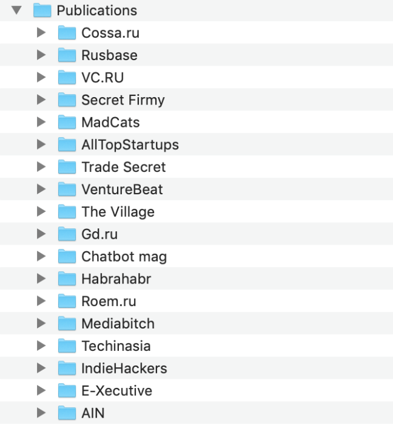

Репутация, работа и эмиграция: как использовать инструменты продвижения компаний для решения личных задач

Ведение блогов, создание контента, работа со СМИ – это то, чем занимаются всё больше компаний. Но на самом деле подобные инструменты продвижения могут использоваться не только бизнесом для привлечения клиента, но и обычными людьми для профессионального развития.

Сегодня мы поговорим о том, чем может быть полезен этот инструмент и как его применять, чтобы получить максимальные результаты: от новой работы до возможности переехать в США.

## Задача #1: построение репутации

Одна из наиболее очевидных задач. Мнение коллег по профессии часто бывает очень ценным, помогает решать сложные задачи, находить новые ниши для приложения усилий. И в отличие от разнообразных конференций, на которых найти интересных людей не всегда легко, интернет стал отличной площадкой для такого общения.

Здесь есть тематические ресурсы и форумы, где собираются представители разных профессий, которые обсуждают свою предметную область и проекты друг друга, делятся результатами работы.

## Задача #2: развитие карьеры

Активность на таких площадках не только помогает решать сиюминутные рабочие задачи, но и полезна с точки зрения развития карьеры в целом. Сегодня раскрученный блог на профессиональную тему или активность на профильных ресурсах – это почти всегда плюс в глазах рекрутера.

Существуют даже программы, которые автоматически ищут такие следы активности потенциального соискателя на разных профильных сайтах и объединяют их в общий профиль. Вот [пример](https://amazinghiring.com/) такого сервиса. В итоге при найме условного программиста рекрутер видит его статьи на Хабре, коммиты на GitHub, сообщения на форумах Open Source-проектов – и сразу понимает, знаком ли человек с нужными технологиями, интересуется ли целевой областью.

Соответственно, чем больше следов такой активности найдет робот, тем больше шансов в дальнейшем получить выгодное предложение о работе.

## Задача #3: профессиональная эмиграция

Многие специалисты хотели бы переехать на работу за границу: там больше возможностей для профессионального развития. Зачастую для получения рабочих виз привлекательных стран необходимо подтвердить свою высокую квалификацию.

К примеру, среди требований к соискателем ставшей в последнее время популярной американской визы О1 – наличие материалов в прессе. Причем важны как статьи, опубликованные самим соискателем, так и, например, материалы с упоминанием человека и его проектов.

Вот почему многие из тех, кто планирует получить такую визу, нанимают консультантов по PR. Это очень [распространенная](https://secretmag.ru/cases/stories/pervaya-volna-startap-emigracii.htm) практика, например, среди готовящихся к переезду предпринимателей. При этом такой подход отлично работает и для тех, кто собирается работать по найму.

Я знаю, о чем говорю: мне самому наличие публикаций в различных СМИ и профессиональных сообществах помогло усилить свою петицию на получение визы О1, в итоге я уже более двух лет живу в США.

_Так выглядел список папок с публикациями для различных блогов и СМИ, которые я собрал вместе с адвокатом в процессе подготовки к подаче на визу_

Позднее я помогал ряду коллег с созданием контента, когда они готовились к переезду и в итоге его успешно осуществили.

## Как использовать контент-маркетинг в личных целях: 4 совета

Понять, какие задачи можно решать с помощью контент-маркетинга, несложно, гораздо труднее понять, как именно это сделать. Ниже – четыре практических совета, которые помогут добиться хороших результатов.

### Не бойтесь рассказывать о своей работе

Одна из основных причин, по которой профессионалы в своей области не делятся знаниями и опытом, – стеснение и боязнь нарваться на негатив. Им часто кажется, что кто-то «уже писал на эту тему», а сам контент не идеален.

Это неправильно. «Написанная не идеальным образом книга лучше, чем не написанная вовсе»: ненужный перфекционизм часто становится тормозом на пути карьерного и общечеловеческого развития.

Если у вас есть идея материала, ее стоит реализовать. Любая публикация создает возможности – получить обратную связь от коллег, привлечь внимание представителей крупных компаний, даже переехать на работу в страну мечты. А когда публикации нет, никто не выскажет критику, но и дополнительных возможностей не появится.

### Пишите комментарии

При отсутствии опыта регулярного создания контента писать развернутые статьи может быть нелегко. Поэтому имеет смысл начинать профессиональную онлайн-активность с публикации комментариев.

Увидели интересную статью по вашей теме, поняли, что можете ее дополнить, – напишите комментарий. Делайте так всякий раз, когда сталкиваетесь с контентом из вашей предметной области. Дополняйте статьи, задавайте вопросы, участвуйте в дискуссиях. Авторы материалов и их читатели будут благодарны за дополнения, а вы попрактикуетесь в написании «профессиональных» текстов, пусть и небольшого размера.

Следующий шаг – предложить свои комментарии профильным СМИ. Сегодня существуют инструменты вроде системы [Pressfeed](https://pressfeed.ru/) или [Deadline Media](https://deadline.media/), где редакторы и журналисты публикуют запросы комментариев по разным темам. Вполне возможно, вы найдете там запросы комментариев по «вашим» темам.

_Список запросов журналистов с сайта Pressfeed_

Благодаря постоянной тренировке написать несколько абзацев не займет много времени, а в результате вы можете получить упоминания своего имени в крупных онлайн-СМИ.

### Прокачивайте английский

Далеко не для каждой работы нужно знание английского языка, но если говорить о профессиях из сферы интернета, то это практически обязательное требование. Поэтому стоит уделять время работе над своими знаниями в этом направлении.

К примеру, когда я работал над получением визы О1, то собрал в том числе и свои англоязычные статьи. Ниже – скриншот моего исследования для издания The Next Web. Наличие таких публикаций, по словам адвоката, повышает шансы на успешное рассмотрение визовой заявки.

_Исследование на The Next Web_

Публикация контента на английском – отличный способ прокачать навык. Сегодня существует большое количество недорогих или вовсе бесплатных инструментов, которые помогают улучшить письменный английский: от переводчиков и приложений для запоминания новых слов типа [Memrise](https://www.memrise.com/courses/english/english/) до специализированных ассистентов, например [Textly](https://textly.ai/), которые не только ищут пропущенные запятые и неправильно написанные фразы, но и дают советы по улучшению стиля.

В итоге вы убьете двух зайцев: подтянете язык и получите в свое портфолио публикации на английском (это может быть важно как для работодателей, так и при получении рабочих виз).

### Делегируйте

Если перечитать советы выше, станет ясно, что на персональное продвижение с помощью контента нужно тратить немало времени и сил. Писать комментарии и статьи, заниматься их публикацией, переводить контент на английский и думать, где его разместить, – всё это не так просто, и уж точно не очень быстро.

Поэтому стоит научиться делегировать эти задачи. Сегодня есть консультанты и целые агентства, которые могут взять на себя работу по доведению контента до ума на основе тезисов от автора и его публикацию в разных форматах: от колонок до интервью в профильных СМИ.

Если вы найдете такого исполнителя, то существенно сэкономите время, которое тратится на контент-маркетинг. В результате все плюсы этого метода можно будет достигнуть практически в фоновом режиме. Это очень полезно, особенно если вы планируете серьезные профессиональные изменения в течение ближайшей пары лет.

## Что в итоге

Опыт говорит о том, что контент-маркетинг важен не только как инструмент для компаний. Он оказывается очень эффективным и при решении персональных задач.

В сегодняшнем информационном мире ведение блогов, написание статей и комментариев на разных языках – это не попытка потешить самолюбие, а реальный способ построить репутацию, сделать следующий шаг в карьере или даже переехать в другую страну.