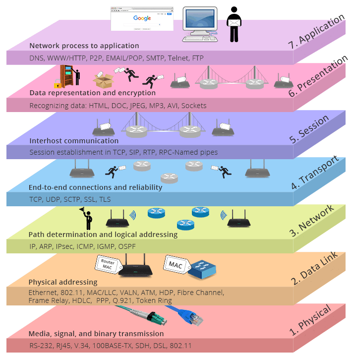
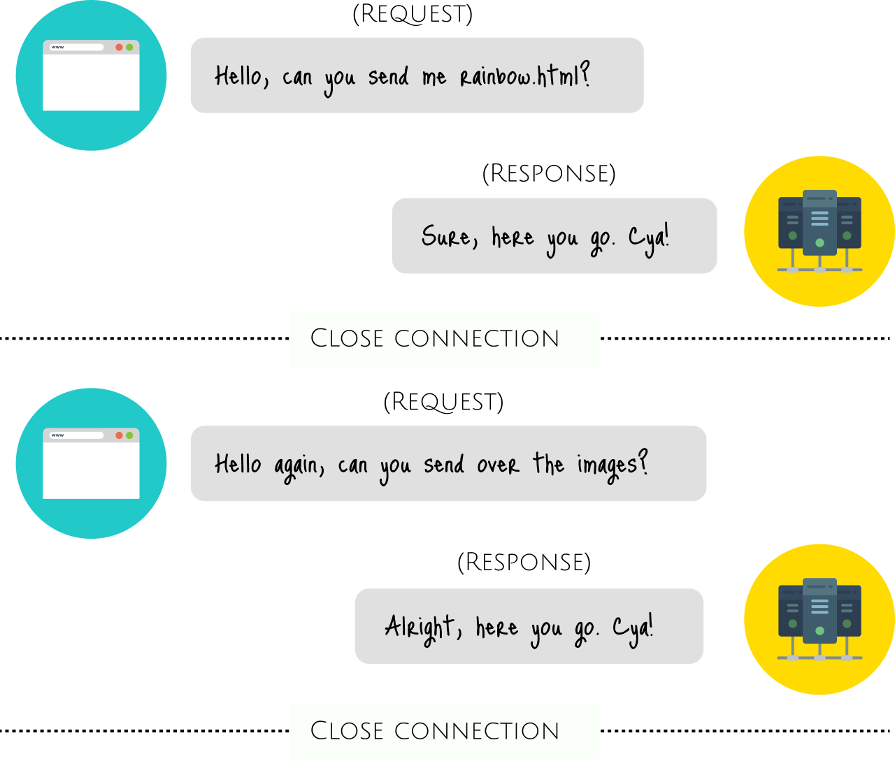
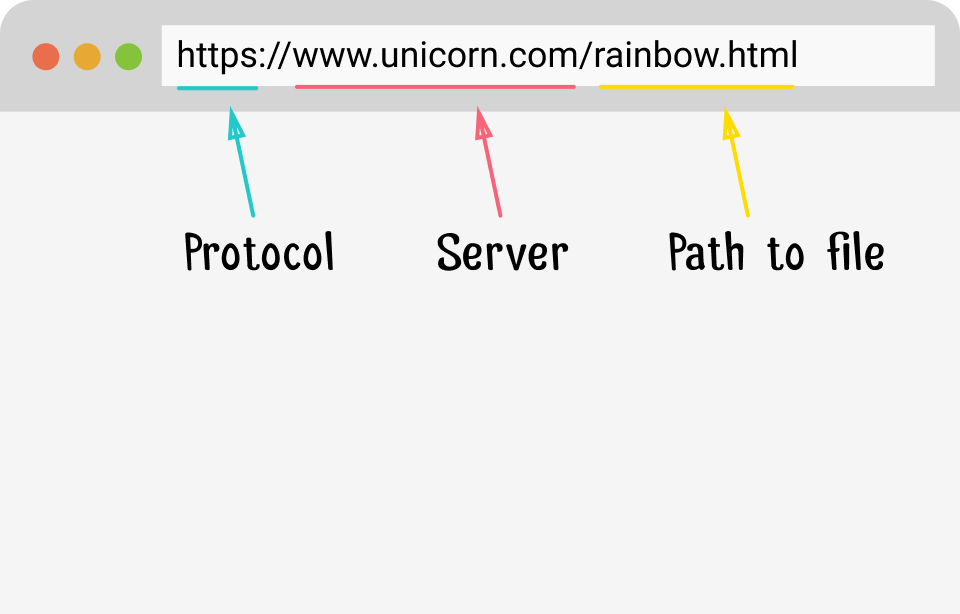

Руководство для начинающих по серверной веб-разработке с Node.js

Большую часть своей веб-карьеры я работал исключительно на стороне клиента. Проектирование адаптивных макетов, создание визуализаций из больших объемов данных, создание инструментальных панелей приложений и т. Д. Но мне никогда не приходилось иметь дело с маршрутизацией или HTTP-запросами напрямую. До не давнего времени.

Этот пост представляет собой описание того, как я узнал больше о веб-разработке на стороне сервера с помощью Node.js, и краткое сравнение написания простого HTTP-сервера с использованием 3 разных сред, Express, Koa.js и Hapi.js.

Примечание: если вы опытный разработчик Node.js, вы, вероятно, подумаете о том, что это все элементарно/просто. ¯\\_(ツ)_/¯.  

### Некоторые основы сети

Когда я начал работать в веб-индустрии пару лет назад, я наткнулся на курс по компьютерным сетям [профессора Дэвида Ветерала](https://djw.cs.washington.edu/) на Coursera. К сожалению, он больше не доступен, но лекции по-прежнему доступны на [веб-сайте Pearson](http://media.pearsoncmg.com/ph/streaming/esm/tanenbaum5e_videonotes/tanenbaum_videoNotes.html).

Мне очень понравился этот курс, потому что он объяснял, что происходило под капотом, в понятной форме, поэтому, если вы можете взять в руки учебник [«Компьютерные сети»](https://www.pearson.com/us/higher-education/program/Tanenbaum-Computer-Networks-5th-Edition/PGM270019.html), прочитайте все подробности о чудесах сети.

Здесь, однако, я собираюсь лишь кратко рассказать о контексте. [HTTP (Hypertext Transfer Protocol)](https://developer.mozilla.org/en-US/docs/Web/HTTP) — это протокол связи, используемый в компьютерных сетях. В Интернете их много, таких как [SMTP (простой протокол передачи почты)](https://en.wikipedia.org/wiki/Simple_Mail_Transfer_Protocol), [FTP (протокол передачи файлов)](https://en.wikipedia.org/wiki/File_Transfer_Protocol), [POP3 (протокол почтового отделения 3)](https://en.wikipedia.org/wiki/Post_Office_Protocol) и так далее.

Эти протоколы позволяют устройствам с совершенно разным аппаратным / программным обеспечением связываться друг с другом, поскольку они предоставляют четко определенные форматы сообщений, правила, синтаксис и семантику и т.д. Это означает, что, пока устройство поддерживает определенный протокол, оно может связываться с любым другим устройством. в сети.

  
[От TCP / IP против OSI: в чем разница между двумя моделями?](https://community.fs.com/blog/tcpip-vs-osi-whats-the-difference-between-the-two-models.html)

Операционные системы обычно поставляются с поддержкой сетевых протоколов, таких как HTTP, из коробки, что объясняет, почему нам не нужно явно устанавливать какое-либо дополнительное программное обеспечение для доступа в Интернет. Большинство сетевых протоколов поддерживают открытое соединение между двумя устройствами, что позволяет им передавать данные туда и обратно.

HTTP, на котором работает сеть, отличается. Он известен как протокол без установления соединения, потому что он основан на режиме работы запрос / ответ. Веб-браузеры отправляют на сервер запросы на изображения, шрифты, контент и т.д., но после выполнения запроса соединение между браузером и сервером разрывается.

### Servers and Clients

Термин сервер может слегка сбивать с толку людей, впервые знакомых с отраслью, поскольку он может относиться как к аппаратному обеспечению (физические компьютеры, на которых размещены все файлы и программное обеспечение, требуемое веб-сайтами), так и к программному обеспечению (программе, которая позволяет пользователям получать доступ к этим файлам в Интернете).

Сегодня мы поговорим о программной стороне вещей. Но сначала несколько определений. URL обозначает Universal Resource Locator и состоит из 3 частей: **протокола**, **сервера** и **запрашиваемого файла**.

  
Структура URL адреса

Протокол HTTP определяет несколько методов, которые браузер может использовать, чтобы попросить сервер выполнить кучу различных действий, наиболее распространенными из которых являются GET и POST. Когда пользователь щелкает ссылку или вводит URL-адрес в адресную строку, браузер отправляет GET-запрос на сервер для получения ресурса, определенного в URL-адресе.

Сервер должен знать, как обрабатывать этот HTTP-запрос, чтобы получить правильный файл, а затем отправить его обратно браузеру, который его запросил. Наиболее популярное программное обеспечение веб-сервера, которое обрабатывает это [Apache](http://httpd.apache.org/) и [NGINX](https://www.nginx.com/).

  
_Веб-серверы обрабатывают входящие запросы и отвечают на них соответственно_

Оба представляют собой полнофункциональные пакеты программного обеспечения с открытым исходным кодом, которые включают в себя такие функции, как схемы аутентификации, перезапись URL-адресов, ведение журнала и проксирование, и это лишь некоторые из них. Apache и NGINX написаны на C. Технически, вы можете написать веб-сервер на любом языке. [Python](https://docs.python.org/3/library/http.server.html), [golang.org/pkg/net/http](https://golang.org/pkg/net/http/), [Ruby](https://blog.appsignal.com/2016/11/23/ruby-magic-building-a-30-line-http-server-in-ruby.html), этот список может продолжаться довольно долго. Просто некоторые языки лучше выполняют определенные вещи, чем другие.

### Создание HTTP сервера с Node.js

[Node.js](https://nodejs.org/en/about/) — это среда выполнения Javascript, построенная на движке [Chrome V8 Javascript](https://v8.dev/docs). Он поставляется с [модулем http](https://nodejs.org/api/http.html), который предоставляет набор функций и классов для построения HTTP-сервера.

Для этого базового HTTP-сервера мы также будем использовать [файловую систему](https://nodejs.org/api/fs.html), [путь](https://nodejs.org/api/path.html) и [URL-адрес](https://nodejs.org/api/url.html), которые являются собственными модулями Node.js.

Начните с импорта необходимых модулей.

    const http = require('http') 
    const fs = require('fs') 
    const path = require('path') 
    const url = require('url') 
    

Мы также создадим словарь типов MIME, чтобы мы могли назначить соответствующий тип MIME запрашиваемому ресурсу на основе его расширения. Полный список типов MIME можно найти в [Internet Assigned Numbers Authority (интернет-центре назначенных номеров)](https://www.iana.org/assignments/media-types/media-types.xhtml).

    const mimeTypes = {
      '.html': 'text/html',
      '.js': 'text/javascript',
      '.css': 'text/css',
      '.ico': 'image/x-icon',
      '.png': 'image/png',
      '.jpg': 'image/jpeg',
      '.gif': 'image/gif',
      '.svg': 'image/svg+xml',
      '.json': 'application/json',
      '.woff': 'font/woff',
      '.woff2': 'font/woff2'
    }
    

Теперь мы можем создать HTTP-сервер с функцией `http.createServer()`, которая будет возвращать новый экземпляр `http.Server`.

    const server = http.createServer()

Мы передадим функцию-обработчик запроса в `createServer()` с объектами запроса и ответа. Эта функция вызывается один раз каждый раз, когда к серверу поступает HTTP-запрос.

    server.on('request', (req, res) => {
    
    })
    

Сервер запускается путем вызова метода `listen` объекта `server` с номером порта, который мы хотим, чтобы сервер прослушивал, например, `5000`.

    server.listen(5000)

Объект `request` является экземпляром [IncomingMessage](https://nodejs.org/api/http.html#http_class_http_incomingmessage) и позволяет нам получать доступ ко всей информации о запросе, такой как статус ответа, заголовки и данные.

Объект `response` является экземпляром [ServerResponse](https://nodejs.org/api/http.html#http_class_http_serverresponse), который является [записываемым потоком](https://nodejs.org/api/stream.html#stream_class_stream_writable) и предоставляет множество методов для отправки данных обратно клиенту.

В обработчике запросов мы хотим сделать следующее:

*   Разобрать входящий запрос и обработать его без расширений
    
        const parsedUrl = new URL(req.url, 'https://node-http.glitch.me/')
        let pathName = parsedUrl.pathname
        let ext = path.extname(pathName)
        
        
        
        if (pathName !== '/' && pathName[pathName.length - 1] === '/') {
          res.writeHead(302, {'Location': pathName.slice(0, -1)})
          res.end()
          return
        }
        
        
        
        if (pathName === '/') { 
          ext = '.html' 
          pathName = '/index.html'
        } else if (!ext) { 
          ext = '.html' 
          pathName += ext
        }
    
      
    
*   Выполните некоторые элементарные проверки, чтобы определить, существует ли запрошенный ресурс, и ответить соответственно
    
        
        const filePath = path.join(process.cwd(), '/public', pathName)
        
        fs.exists(filePath, function (exists, err) {
        
          if (!exists || !mimeTypes[ext]) {
            console.log('Файл не найден: ' + pathName)
            res.writeHead(404, {'Content-Type': 'text/plain'})
            res.write('404 Not Found')
            res.end()
            return
          }
          
          
          res.writeHead(200, {'Content-Type': mimeTypes[ext]})
          
          const fileStream = fs.createReadStream(filePath)
          fileStream.pipe(res)
        })
    
      
    

Весь код размещен на Glitch, и вы можете сделать ремикс на проект, если хотите.

[https://glitch.com/edit/#!/node-http](https://glitch.com/edit/#!/node-http)

### Создание HTTP-сервера с фреймворками Node.js

Фреймворки Node.js, такие как [Express](https://expressjs.com/), [Koa.js](https://koajs.com/) и [Hapi.js](https://hapijs.com/), поставляются с различными полезными функциями промежуточного программного обеспечения, в дополнение к множеству других удобных функций, которые избавляют разработчиков от необходимости писать самим.

Лично я чувствую, что лучше сначала изучать основы без фреймворков, просто для понимания того, что происходит под капотом, а затем после этого сходить с ума с любым фреймворком, который вам нравится.

В [Express](https://expressjs.com/) имеется собственный встроенный плагин для обслуживания статических файлов, поэтому код, необходимый для выполнения тех же действий, что и в собственном Node.js, значительно короче.

    const express = require('express')
    const app = express()
    
    
    app.use(express.static('public'))
    
    
    
    app.get('/', (req, res) => {
      res.sendFile(__dirname + '/public/index.html')
    })
    
    app.listen(5000)

Koa.js не имеет подобного плагина внутри своего ядра, поэтому любой требуемый плагин должен быть установлен отдельно. Последняя версия Koa.js использует асинхронные функции в пользу обратных вызовов. Для обслуживания статических файлов вы можете использовать плагин `koa-static`.

    const serve = require('koa-static')
    const koa = require('koa')
    const app = new koa()
    
    
    
    app.use(serve(__dirname + '/public'))
    
    app.listen(5000)

[Hapi.js](https://hapijs.com/) поддерживает настройку и вращается вокруг настройки объекта `server`. Он использует плагины для расширения возможностей, таких как маршрутизация, аутентификация и так далее. Для обслуживания статических файлов нам понадобится плагин с именем `inert`.

    const path = require('path')
    const hapi = require('hapi')
    const inert = require('inert')
    
    
    const server = new hapi.Server({
      port: 5000,
      routes: {
        files: {
          relativeTo: path.join(__dirname, 'public')
        }
      }
    })
    
    const init = async () => {
      
      await server.register(inert)
    
       
       
      server.route({
        method: 'GET',
        path: '/{param*}',
        handler: {
          directory: {
            path: '.',
            redirectToSlash: true,
            index: true
          }
        }
      })
    
      await server.start()
    }
    
    init()

У каждой из этих платформ есть свои плюсы и минусы, и они будут более очевидными для более крупных приложений, а не просто для обслуживания одной HTML-страницы. Выбор структуры будет сильно зависеть от реальных требований проекта, над которым вы работаете.

### Завершение

Если сетевая сторона вещей всегда была для вас черным ящиком, надеюсь, эта статья может послужить полезным введением в протокол, который обеспечивает работу сети. Я также настоятельно рекомендую прочитать [документацию по API Node.js](https://nodejs.org/api/), которая очень хорошо написана и очень полезна для любого новичка в Node.js в целом.

*   [HTTP by MDN](https://developer.mozilla.org/en-US/docs/Web/HTTP)
*   [Anatomy of an HTTP Transaction](https://nodejs.org/en/docs/guides/anatomy-of-an-http-transaction/)
*   [HTTP Server: Everything you need to know to build a simple HTTP server from scratch](https://medium.com/from-the-scratch/http-server-what-do-you-need-to-know-to-build-a-simple-http-server-from-scratch-d1ef8945e4fa)