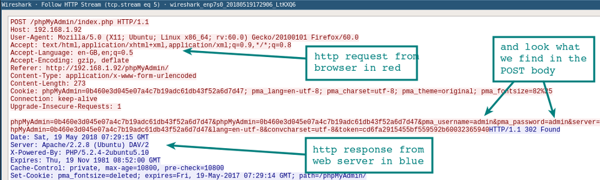
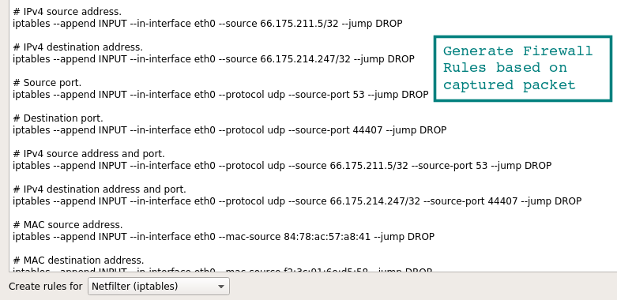
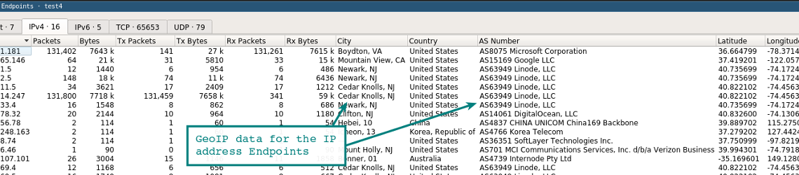
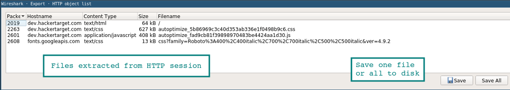
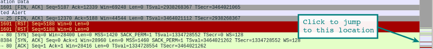

Руководство и шпаргалка по Wireshark

Даже поверхностное знание программы [Wireshark](https://wireshark.org/) и её фильтров на порядок сэкономит время при устранении проблем сетевого или прикладного уровня. Wireshark полезен для многих задач в работе сетевого инженера, специалиста по безопасности или системного администратора. Вот несколько примеров использования:

#### Устранение неполадок сетевого подключения

  

*   Визуальное отображение потери пакетов
*   Анализ ретрансляции TCP
*   График по пакетам с большой задержкой ответа

  

#### Исследование сессий прикладного уровня (даже при шифровании с помощью SSL/TLS, см. ниже)

  

*   Полный просмотр HTTP-сессий, включая все заголовки и данные для запросов и ответов
*   Просмотр сеансов Telnet, просмотр паролей, введённых команд и ответов
*   Просмотр трафика SMTP и POP3, чтение писем

#### Устранение неполадок DHCP с данными на уровне пакетов

  

*   Изучение трансляций широковещательного DHCP
*   Второй шаг обмена DHCP (DHCP Offer) с адресом и параметрами
*   Клиентский запрос по предложенному адресу
*   Ack от сервера, подтверждающего запрос

  

#### Извлечение файлов из сессий HTTP

  

*   Экспорт объектов из HTTP, таких как JavaScript, изображения или даже исполняемые файлы

  

#### Извлечение файлов из сессий SMB

  

*   Аналогично опции экспорта HTTP, но извлечение файлов, передаваемых по SMB, протоколу общего доступа к файлам в Windows

  

#### Обнаружение и проверка вредоносных программ

  

*   Обнаружение аномального поведения, которое может указывать на вредоносное ПО
*   Поиск необычных доменов или конечных IP
*   Графики ввода-вывода для обнаружения постоянных соединений (маячков) с управляющими серверами
*   Отфильтровка «нормальных» данных и выявление необычных
*   Извлечение больших DNS-ответов и прочих аномалий, которые могут указывать на вредоносное ПО

  

#### Проверка сканирования портов и других типов сканирования на уязвимости

  

*   Понимание, какой сетевой трафик поступает от сканеров
*   Анализ процедур по проверке уязвимостей, чтобы различать ложноположительные и ложноотрицательные срабатывания

Эти примеры — только вершина айсберга. В руководстве мы расскажем, как использовать столь мощный инструмент.

Wireshark работает на различных операционных системах и его несложно установить. Упомянем только Ubuntu Linux, Centos и Windows.

### Установка на Ubuntu или Debian

  

  

### Установка на Fedora или CentOS

  

  

### Установка на Windows

На [странице загрузки](https://www.wireshark.org/download.html) лежит исполняемый файл для установки. Довольно просто ставится и драйвер захвата пакетов, с помощью которого сетевая карта переходит в «неразборчивый» режим (promiscuous mode позволяет принимать все пакеты независимо от того, кому они адресованы).

С первым перехватом вы увидите в интерфейсе Wireshark стандартный шаблон и подробности о пакете.

Как только захватили сессию HTTP, остановите запись и поиграйте с основными фильтрами и настройками **Analyze | Follow | HTTP Stream**.

Названия фильтров говорят сами за себя. Просто вводите соответствующие выражения в строку фильтра (или в командную строку, если используете tshark). Основное преимущество фильтров — в удалении шума (трафик, который нам не интерестен). Можно фильтровать трафик по MAC-адресу, IP-адресу, подсети или протоколу. Самый простой фильтр — ввести `http`, так что будет отображаться только **трафик HTTP (порт tcp 80)**.

### Примеры фильтров по IP-адресам

  

    ip.addr == 192.168.0.5
    !(ip.addr == 192.168.0.0/24)

  

### Примеры фильтров по протоколу

  

    tcp
    udp
    tcp.port == 80 || udp.port == 80
    http
    not arp and not (udp.port == 53)

Попробуйте сделать комбинацию фильтров, которая показывает весь исходящий трафик, кроме HTTP и HTTPS, который направляется за пределы **локальной сети**. Это хороший способ обнаружить программное обеспечение (даже вредоносное), которое взаимодействует с интернетом по необычным протоколам.

Как только вы захватили несколько HTTP-пакетов, можно применить на одном из них пункт меню **Analyze | Follow | HTTP Stream**. Он покажет целиком сессию HTTP. В этом новом окне вы увидите HTTP-запрос от браузера и HTTP-ответ от сервера.

По умолчанию Wireshark не резолвит сетевые адреса в консоли. Это можно изменить в настройках.

**Edit | Preferences | Name Resolution | Enable Network Name Resolution**

Как и в случае `tcpdump`, процедура резолвинга замедлит отображение пакетов. Также важно понимать, что при оперативном захвате пакетов DNS-запросы с вашего хоста станут дополнительным трафиком, который могут перехватить.

Если вы ещё не баловались с `tshark`, взгляните на наше [руководство с примерами фильтров](https://hackertarget.com/tshark-tutorial-and-filter-examples/). Эту программу часто игнорируют, хотя она отлично подходит для захвата сессий на удалённой системе. В отличие от `tcpdump`, она позволяет на лету захватывать и просматривать сессии прикладного уровня: декодеры протоколов Wireshark также доступны для tshark.

Вот быстрый способ создания правил из командной строки, чтобы не искать в интернете конкретный синтаксис. Выберите подходящее правило — и перейдите в **Tools | Firewall ACL Rules**. Поддерживаются различные файрволы, такие как Cisco IOS, `ipfilter`, `ipfw`, `iptables`, `pf` и даже файрвол Windows через `netsh`.

Если Wireshark скомпилирован с поддержкой GeoIP и у вас есть бесплатные базы Maxmind, то программа может определять местоположение компьютеров по их IP-адресам. Проверьте в **About | Wireshark**, что программа скомпилирована с той версией, какая у вас в наличии. Если GeoIP присутствует в списке, то проверьте наличие на диске баз GeoLite City, Country и ASNum. Укажите расположение баз в меню **Edit | Preferences | Name Resolution**.

Проверьте систему на дампе трафика, выбрав опцию **Statistics | Endpoints | IPv4**. В колонках справа должна появиться информация о местоположении и ASN для IP-адреса.

Другая функция GeoIP — фильтрация трафика по местоположению с помощью фильтра `ip.geoip`. Например, так можно исключить трафик из конкретной ASN. Нижеуказанная команда исключает пакеты от сетевого блока ASN 63949 (Linode).

    ip and not ip.geoip.asnum == 63949

Конечно, тот же фильтр можно применить [к отдельным городам и странам](https://www.wireshark.org/docs/dfref/i/ip.html). Удалите шум и оставьте только действительно интересный трафик.

Один из способов расшифровки сессий SSL/TLS — использовать закрытый ключ с сервера, к которому подключен клиент.

Конечно, у вас не всегда есть доступ к приватному ключу. Но есть другой вариант простого просмотра трафика SSL/TLS на локальной системе. Если Firefox или Chrome загружаются с помощью специальной переменной среды, то симметричные ключи отдельных сеансов SSL/TLS записаны в файл, который Wireshark может прочитать. С помощью этих ключей Wireshark покажет полностью расшифрованную сессию!

### 1\. Настройка переменной среды

**Linux / Mac**

    export SSLKEYLOGFILE=~/sslkeylogfile.log

**Windows**

На вкладке **System Properties | Advanced** нажмите кнопку **Environment Variables** и добавьте имя переменной (SSLKEYLOGFILE), а в качестве значения — путь к файлу.

### 2\. Настройка Wireshark

Из выпадающего меню выберите **Edit | Preferences | Protocols | SSL | (Pre)-Master-Secret Log Filename — Browse**, указав файл, который вы указали в переменную среды.

Начинайте захват трафика в локальной системе.

### 3\. Перезапуск Firefox или Chrome

После перехода на сайт HTTPS лог-файл начнёт увеличиваться в размере, поскольку записывает симметричные ключи сессии.

Взгляните на ранее запущенную сессию Wireshark. Вы должны увидеть что-то похожее на скриншот внизу с расшифрованными сессиями. Расшифрованные пакеты — на вкладке в нижней панели.

Другой способ просмотра сеанса — через выпадающее меню **Analysis | Follow | Stream | SSL**. Если сеанс успешно расшифрован, вы увидите опцию для SSL.

Разумеется, будьте осторожны при записи этих ключей и пакетов. Если посторонний получит доступ к лог-файлу, то легко найдёт там ваши пароли и куки аутентификации.

Ещё один вариант выхода на базовый HTTP-трафика — использовать инструмент [Burp Suite](https://portswigger.net/burp) с загруженным сертификатом CA в браузере. В этом случае прокси расшифровывает соединение на стороне клиента, а затем устанавливает новый сеанс SSL/TLS на сервере. Есть много способов проведения такой MiTM-атаки на себя, это два самых простых.

Файлы легко извлекаются через меню экспорта.

**File | Export Objects | HTTP**

Все найденные файлы отобразятся в новом окне. Отсюда же можно сохранить отдельные файлы или сразу все. Аналогичный метод применяется для извлечения файлов из сессий SMB. Как мы уже упоминали, это протокол Microsoft Server Message Block, который используется для общего доступа к файлам под Windows.

Строка состояния в правой части окна позволяет быстро перейти в нужное место сетевого дампа, щёлкнув по цветовому индикатору. Например, красным цветом в строке состояния помечены пакеты с ошибками.

Когда только начинаете работу с Wireshark, хочется посмотреть на какие-нибудь интересные дампы с пакетами. Их можно найти на странице [Wireshark Samples](https://wiki.wireshark.org/SampleCaptures). Примеров с разными протоколами там хватит вам на несколько месяцев анализа, есть даже образцы трафика червей и эксплоитов.

Внешний вид консоли по умолчанию всячески настраивается. Можно добавлять или удалять столбцы, добавляя даже такие простые вещи как столбец времени UTC, что сразу повышает информативность логов, если анализировать историю пакетов.

Столбцы настраиваются в меню **Edit | Preferences | Appearance | Columns**. Там же изменяется общий шаблон, шрифт и цвета.

На видео — полезные советы по настройке окружения, в том числе выявление неполадок по порядковым номерам последовательности TCP.

  

В комплекте с Wireshark поставляется удобный инструмент командной строки `capinfos`. Эта утилита генерирует статистику пакетного дампа, с временем начала/окончания записи и другими подробностями. С опцией `-T` она выдаёт текст с табуляцией — он подходит для импорта в электронные таблицы или анализа в консоли.

    test@ubuntu:~$ capinfos test.pcap
    File name:           test.pcap
    File type:           Wireshark/tcpdump/... - pcap
    File encapsulation:  Ethernet
    File timestamp precision:  microseconds (6)
    Packet size limit:   file hdr: 262144 bytes
    Number of packets:   341 k
    File size:           449 MB
    Data size:           444 MB
    Capture duration:    3673.413779 seconds
    First packet time:   2018-12-01 11:26:53.521929
    Last packet time:    2018-12-01 12:28:06.935708
    Data byte rate:      120 kBps
    Data bit rate:       967 kbps
    Average packet size: 1300.72 bytes
    Average packet rate: 93 packets/s
    SHA256:              989388128d676c329ccdbdec4ed221ab8ecffad81910a16f473ec2c2f54c5d6e
    RIPEMD160:           0742b6bbc79735e57904008d6064cce7eb95abc9
    SHA1:                d725b389bea044d6520470c8dab0de1598b01d89
    Strict time order:   True
    Number of interfaces in file: 1

  

Эта статья изначально была опубликована в 2011 году, затем серьёзно обновилась. Если у вас есть какие-либо комментарии, улучшения или советы для шпаргалки, [пишите мне](https://hackertarget.com/contact/). Wireshark — один из тех незаменимых инструментов, который многие используют, но мало кто владеет в совершенстве. Тут можно углубляться всё дальше и дальше.