Learn Kubernetes in Under 3 Hours: A Detailed Guide to Orchestrating Containers

# Learn Kubernetes in Under 3 Hours: A Detailed Guide to Orchestrating Containers


Photo by [Joseph Barrientos](https://unsplash.com/photos/eUMEWE-7Ewg) on Unsplash

Why are banks paying me big bucks for something as simple as Kubernetes? When anybody — anybody can learn in under three hours?

If you doubt me, I challenge you to give it a try! By the end of this article, you will be able to run a Microservice based application on a Kubernetes Cluster. And I guarantee this because it’s how I introduce our clients to Kubernetes.

_What does this guide do differently from the other resources, Rinor?_

Quite a lot! Most guides start with the simple stuff: Kubernetes concepts and and kubectl commands. These guides assume the reader knows about application development, Microservices, and Docker containers.

In this Article we will go from :

1.  Running a Microservice based application on your computer.
2.  Building container images for each service of the Microservice application.
3.  Introduction to Kubernetes. Deploying a Microservice based application into a Kubernetes Managed Cluster.

The gradual build up provides the depth required for a mere mortal being to grasp the _simplicity_ of Kubernetes. Yes Kubernetes is simple when you know the context it is used in. Without further ado lets see what we will build.

### Application Demo

The application has one functionality. It takes one sentence as input. Using Text Analysis, calculates the emotion of the sentence.

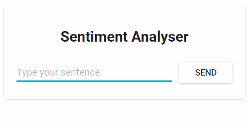

Fig. 1. Sentiment Analysis Web App

From the technical perspective, the application consists of three microservices. Each has one specific functionality:

*   **SA-Frontend:** a Nginx web server that **serves our ReactJS** static  files.
*   **SA-WebApp:** a Java Web Application that **handles requests** from the frontend.
*   **SA-Logic:** a python application that **performs Sentiment Analysis**.

It’s important to know that Microservices don’t live in isolation, they enable “separation of concerns” but they still **have to** interact with each other.

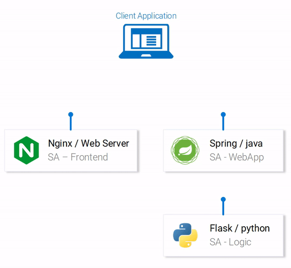

Fig. 2. Data flow in the Sentiment Analysis WebApp

This interaction is best illustrated by showing how the data flows between them:

1.  A client application requests the index.html (which in turn requests bundled scripts of ReactJS application)
2.  The user interacting with the application triggers requests to the Spring WebApp.
3.  Spring WebApp forwards the requests for sentiment analysis to the Python app.
4.  Python Application calculates the sentiment and returns the result as a response.
5.  The Spring WebApp returns the response to the React app. (Which then represents the information to the user.)

The code for all of these applications can be found in [this repository.](https://github.com/rinormaloku/k8s-mastery) I recommend cloning it immediately because we are going to build amazing things together.

### 1\. Running a Microservice based application on your computer

We need to start up all three services. Let’s get started with the most attractive one, the front-end application.

#### Setting up React for Local Development

To start the React application you need to have NodeJS and NPM installed on your computer. After installing those navigate with your Terminal to the directory **sa-frontend.** Type the following command:

npm install

This downloads all the Javascript dependencies of the React application and places them in the folder **node_modules.** (Dependencies are defined in the package.json file). After all dependencies are resolved execute the next command:

npm start

That’s it! We started our react application and by default you can access it on **localhost:3000.** Feel free to modify the code and see the effects immediately on the browser. That is made possible using **Hot Module Replacement.** This makes front end development a breeze!

#### Making Our React App Production Ready

For production we need to build our application into static files and serve them using a web server.

To build the React application navigate in your terminal to the **sa-frontend** directory. Then execute the following command:

npm run build

This generates a folder named **build** in your project tree. This folder contains all the static files needed for our ReactJS application.

#### Serving static files with Nginx

Install and start the Nginx WebServer ([how to](https://www.nginx.com/resources/wiki/start/topics/tutorials/install/)). Then move the contents of the sa-frontend/build folder to \[_your\_nginx\_installation_dir_\]/**html.**

This way the generated index.html file will be accessible in \[_your\_nginx\_installation_dir_\]/html/index.html. T**his is the default file that Nginx serves**.

By default the Nginx WebServer listens on port 80. You can specify a different port by updating server.listen property in the file \[_your\_nginx\_installation_dir_\]/conf/nginx.conf.

Open your browser and hit the endpoint localhost:80, see the ReactJS application appear.

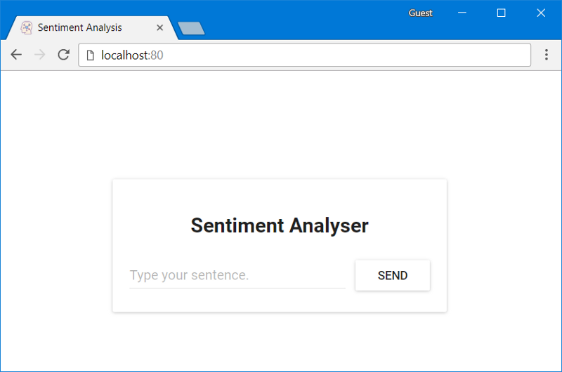

Fig. 3. React app served from Nginx

Typing in the field: “Type your sentence.” and pressing the button Send will fail with a 404 error (You can check it in your browser console). But why that? Let’s inspect the code.

#### Inspecting the Code

In the file **App.js** we can see that pressing the Send button triggers the analyzeSentence method. The code for this method is shown below. (Each line that is commented with #Number will be explained below the script):
```
analyzeSentence() {  
    fetch('http://**localhost:8080**/sentiment', {  // #1  
        method: 'POST',  
        headers: {  
            'Content-Type': 'application/json'  
        },  
        body: JSON.stringify({  
                       sentence: this.textField.getValue()})// #2  
    })  
        .then(response => response.json())  
        .then(data => this.setState(data));  // #3  
}
```
#1: URL at which a POST call is made. (An application should be listening for calls at that URL).

#2: The Request body sent to that application as displayed below:
```
{  
    sentence: “I like yogobella!”  
}
```
#3: The response updates the component state. This triggers a re-render of the component. If we received the data, (i.e. the JSON object containing the typed sentence and the polarity) we would display the component polarityComponent because the condition would be fulfilled and we would define the component:

const polarityComponent = this.state.polarity !== undefined ?  
    <Polarity sentence={this.state.sentence}   
              polarity={this.state.polarity}/> :  
    null;

Everything seems correct. But what are we missing? If you guessed that we didn’t set up anything to listen on localhost:8080, then you are correct! We must start our Spring Web application to listen on that port!

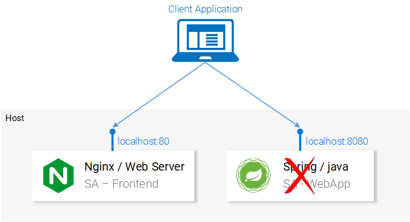

Fig. 4. Microservice Spring WebApp missing

#### Setting up the Spring Web Application

To start up the Spring application you need to have JDK8 and Maven installed. (their environment variables need to be set up as well). After installing those you can continue to the next part.

#### Packaging the Application into a Jar

Navigate in your Terminal to the directory **sa-webapp** and type the following command:

    mvn install

This will generate a folder named **target,** in the directory **sa-webapp.** In the folder **target** we have our Java application packaged as a jar: ‘**sentiment-analysis-web-0.0.1-SNAPSHOT.jar**’

#### Starting our Java Application

Navigate to the target directory and start the application with the command:

    java -jar sentiment-analysis-web-0.0.1-SNAPSHOT.jar

Darn.. We got an error. Our application fails on startup and our only lead is the exception in the stack trace:

Error creating bean with name 'sentimentController': Injection of autowired dependencies failed; nested exception is java.lang.IllegalArgumentException: **Could not resolve placeholder 'sa.logic.api.url'** in value "${sa.logic.api.url}"

The important information here is the placeholder sa.logic.api.url in the **SentimentController**. Let’s check that out!

### Inspecting the Code
```
@CrossOrigin(origins = "*")  
@RestController  
public class SentimentController {

    @Value("${sa.logic.api.url}")    // #1  
    private String saLogicApiUrl;

    @PostMapping("/sentiment")  
    public SentimentDto sentimentAnalysis(  
        @RequestBody SentenceDto sentenceDto)   
    {  
        RestTemplate restTemplate = new RestTemplate();

        return restTemplate.postForEntity(  
                saLogicApiUrl + "/analyse/sentiment",    // #2  
                sentenceDto, SentimentDto.class)  
                .getBody();  
    }  
}
```
1.  The **SentimentController** has a field named saLogicApiUrl. The field get’s defined by the property `sa.logic.api.url` .
2.  The String saLogicApiUrl is concatenated with the value “/analyse/sentiment”. Together they form the URL to make the request for Sentiment Analysis.

**Defining the Property**

In Spring the default property source is **application.properties.** (Located in _sa-webapp/src/main/resources_). But that’s not the only means to define a property, it can be done with the earlier command as well:

java -jar sentiment-analysis-web-0.0.1-SNAPSHOT.jar   
     --sa.logic.api.url=WHAT.IS.THE.SA.LOGIC.API.URL

The property should be initialized with the value that defines where our Python application is running, this way we will let our Spring Web Application know where to forward messages on run time.

To make things simpler let’s decide that we will run the python application on `localhost:5000.` Lets just not forget it!

Run the below command and we are ready to move to the last service the python application.
```
java -jar sentiment-analysis-web-0.0.1-SNAPSHOT.jar   
     --sa.logic.api.url=http://localhost:5000
```
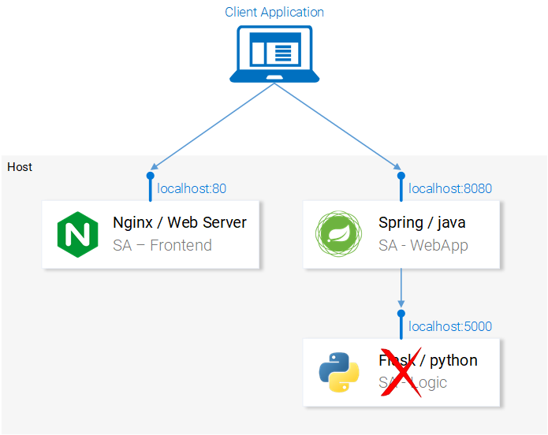

#### Setting up the Python Application

To start the Python application, we need to have Python3 and Pip installed. (Their environment variables need to be set up as well).

#### Installing Dependencies

Navigate in the Terminal to the directory **sa-logic/sa** ([repo](https://github.com/rinormaloku/k8s-mastery))  and type the following command:

**python -m pip install -r requirements.txt**  
**python -m textblob.download_corpora**

#### Starting the app

After using Pip to install the dependencies we are ready to start the application by executing the following command:

**python sentiment_analysis.py**  
\* Running on [http://0.0.0.0:5000/](http://localhost:5000/) (Press CTRL+C to quit)

This means that our application is running and listening for HTTP Requests on port 5000 on localhost.

#### Inspecting the Code

Let’s investigate the code to understand what is happening in the **SA Logic** python application.
```
from textblob import TextBlob  
from flask import Flask, request, jsonify

app = Flask(\_\_name\_\_)                                   #1

@app.route("/analyse/sentiment", methods=\['POST'\])      #2  
def analyse_sentiment():  
    sentence = request.get_json()\['sentence'\]           #3  
    polarity = TextBlob(sentence).sentences\[0\].polarity #4  
    return jsonify(                                     #5  
        sentence=sentence,  
        polarity=polarity  
    )

if \_\_name\_\_ == '\_\_main\_\_':  
    app.run(host='0.0.0.0', port=5000)                #6

1.  Instantiate a Flask object.
2.  Defines the path at which a POST request can be made.
3.  Extract the “sentence” property from the request body.
4.  Instantiate an anonymous TextBlob object and get the polarity from the first sentence. (We have only one).
5.  Return the response with the body containing the sentence and the polarity to the caller.
6.  Run the flask object **app** to listen for requests on 0.0.0.0:5000 (calls to localhost:5000 will reach this app aswell).

**The services are set up to communicate with each other. Re-open the frontend in localhost:80 and give them a try before continuing on!**

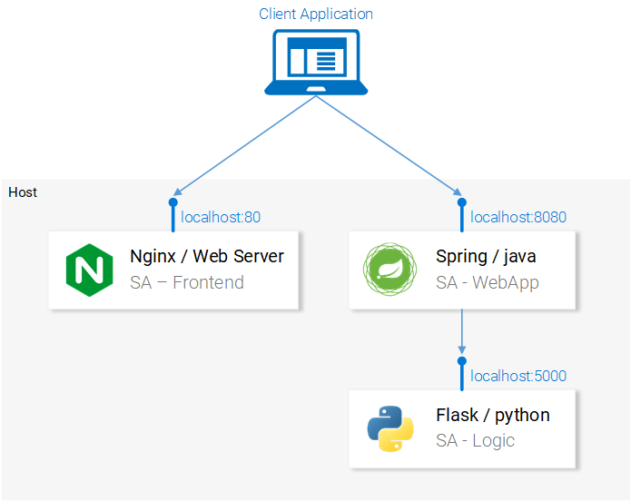

Fig. 6. Microservice architecture completed

In the next section, we will go over how to start the services in Docker Containers, as it is a prerequisite to being able to run them in a Kubernetes Cluster.

* * *

### 2\. Building container images for each service

Kubernetes is a container orchestrator. Understandably we need containers to be able to orchestrate them. But what are containers? This is best answered from the Documentation at docker.

> _A container image is a lightweight, stand-alone, executable package of a piece of software that includes everything needed to run it: code, runtime, system tools, system libraries, settings. Available for both Linux and Windows based apps, containerized software will always run the same, regardless of the environment._

It means that containers can run on any computer — even in the production server — **with no differences**.

For illustration purposes let’s compare how our React Application would be served using a Virtual Machine vs. a Container.

#### Serving React static files from a VM

The cons of using a Virtual Machine:

1.  Resource inefficient, each VM has the overhead of a fully-fledged OS.
2.  It is platform dependent. What worked on your computer might not work on the production server.
3.  Heavyweight and slow scaling when compared to Containers.

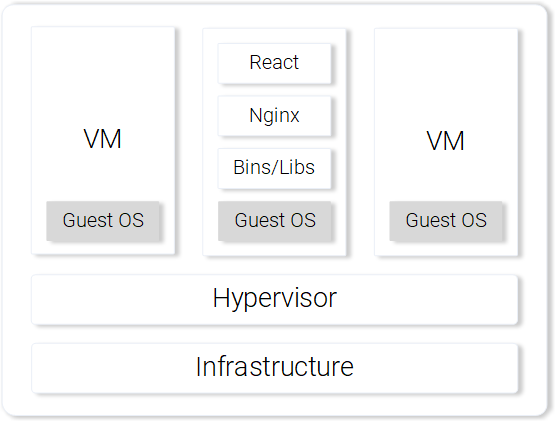

Fig. 7. Nginx web server with static files on a VM

#### Serving React static files from a Container

The pros of using a Container.

1.  Resource efficient, use the Host OS with the help of Docker.
2.  Platform independent. The container that you run on your computer will work anywhere.
3.  Lightweight using image layers.

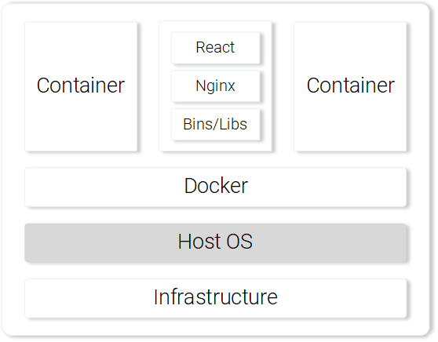

Fig. 8. Nginx web server serving static files in a Container

Those are the most prominent features and benefits of using containers. For more information continue reading on the [Docker documentation](https://www.docker.com/what-container).

#### Building the container image for the React App (Docker intro)

The basic building block for a Docker container is the .dockerfile. The **Dockerfile** starts with a base container image and follows up with a sequence of instructions on how to build a new container image that meets the needs of your application.

Before we get started defining the Dockerfile, let’s remember the steps we took to serve the react static files using nginx:

1.  Build the static files (npm run build)
2.  Startup the nginx server
3.  Copy the contents of the **build** folder from your sa-frontend project to nginx**/**html.

In the next section, you will notice parallels on how creating a Container is similar to what we did during local React setup.

#### Defining the Dockerfile for SA-Frontend

The instructions in the Dockerfile for the SA-Frontend is only a two-step task. That is because the Nginx Team provided us with [a base image](https://hub.docker.com/_/nginx/) for Nginx, which we will use to build on top of. The two steps are:

1.  Start from the base **Nginx Image**
2.  Copy the **sa-frontend/build** directory to the containers nginx**/**html directory.

Converted into a Dockerfile it looks like:

**FROM** nginx  
**COPY** build **/**usr**/**share**/**nginx**/**html

Isn’t it amazing, it’s even humanly readable, let’s recapitulate:

Start from the nginx image. (Whatever the guys did over there). Copy the **build** directory to the **nginx/html** directory in the image. That’s it!

You may be wondering, how did I know where to copy the build files? i.e. `/usr/share/nginx/html`. Quite simple: It was documented in the nginx [image](https://hub.docker.com/_/nginx/) in Docker Hub.

#### Building and Pushing the container

Before we can push our image, we need a Container Registry to host our images. Docker Hub is a free cloud container service that we will use for this demonstration. You have three tasks before continuing:

1.  [Install Docker CE](https://www.docker.com/community-edition)
2.  Register to the Docker Hub.
3.  Login by executing the below command in your Terminal:

docker login -u="$DOCKER\_USERNAME" -p="$DOCKER\_PASSWORD"

After completing the above tasks navigate to the directory **sa-frontend.** Then execute the below command (replace $DOCKER\_USER\_ID with your docker hub username. For e.g. rinormaloku/sentiment-analysis-frontend)

docker build -f Dockerfile -t $DOCKER\_USER\_ID/sentiment-analysis-frontend .

We can drop `-f Dockerfile` because we are already in the directory containing the Dockerfile.

To push the image, use the docker push command:

docker push $DOCKER\_USER\_ID/sentiment-analysis-frontend

Verify in your docker hub repository that the image was pushed successfully.

#### Running the container

Now the image in `$DOCKER_USER_ID/sentiment-analysis-frontend` can be pulled and run by anyone:

docker pull $DOCKER\_USER\_ID/sentiment-analysis-frontend  
docker run -d -p 80:80 $DOCKER\_USER\_ID/sentiment-analysis-frontend

Our Docker container is running!

Before we continue lets elaborate the 80:80 which I find confusing:

*   The first 80 is the port of the host (i.e. my computer)
*   The second 80 stands for the container port to which the calls should be forwarded.

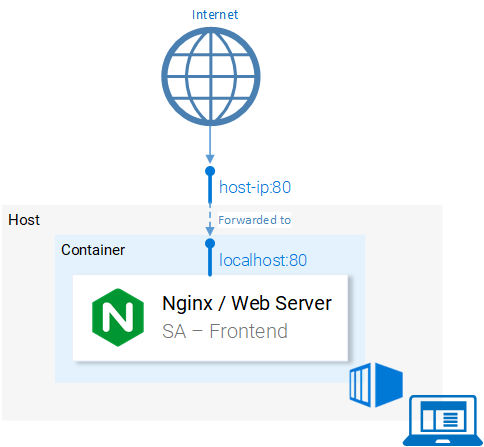

Fig. 9. Port Mapping of Host to Container

It maps from &lt;hostPort&gt; to &lt;containerPort&gt;. Meaning that calls to host port 80 should be mapped to the port 80 of the container, as shown in figure 9.

Because the port was run in the host (your computer) in port 80 it should be accessible on the localhost:80. If you do not have native docker support, you can open the application in &lt;docker-machine ip&gt;:80. To find your docker-machine ip execute `docker-machine ip`

Give it a try! You should be able to access the react application in that endpoint.

#### The Dockerignore

We saw earlier that building the image for SA-Frontend was slow, pardon me, **Extremely slow**. That was the case because of the **build context** that had to be sent to the Docker Deamon. In more detail, the **build context** directory is defined by the last argument in the docker build command (the trailing dot), which specifies the build context. And in our case, it included the following folders:
```
sa-frontend:  
|   .dockerignore  
|   Dockerfile  
|   package.json  
|   README.md  
**+---build**  
+---node_modules  
+---public  
\\---src
```
But the only data we need is in the **build** folder. Uploading anything else will be a waste of time. We can improve our build time by dropping the other directories. That’s where `.dockerignore` comes into play. For you it will be familiar because it’s like `.gitignore`, i.e. add all directories that you want to ignore in the `.dockerignore` file, as shown below:

node_modules  
src  
public

The `.dockerignore` file should be in the same folder as the Dockerfile. Now building the image takes only seconds.

Let’s continue with the Java Application.

#### Building the container image for the Java Application

Guess what! You learned almost everything about creating container images! That’s why this part is extremely short.

Open the Dockerfile in **sa-webapp**, and you will find only two new keywords:

**ENV** SA\_LOGIC\_API_URL [http://localhost:5000](http://localhost:5000/)  
…  
**EXPOSE** 8080

The keyword **ENV** declares an Environment Variable inside the docker container. This will enable us to provide the URL for the Sentiment Analysis API when starting the Container.

Additionally, the keyword **EXPOSE** exposes a port that we want to access later on. **But hey!!!** We didn’t do that in the Dockerfile in SA-Frontend, good catch! This is for documentation purposes only, in other words it will serve as information to the person reading the Dockerfile.

You should be familiar with building and pushing the container image. If any difficulties arise read the README.md file in **sa-webapp** directory.

#### Building the container image for the Python Application

In the Dockerfile in **sa-logic** there are no new keywords. Now you can call yourself a Docker-Master 😉.

For building and pushing the container image read the the README.md in **sa-logic** directory.

#### Testing the Container-ized Application

Can you trust something that you didn’t test? Neither can I. Let’s give these containers a test.

1.  Run the **sa-logic** container and configure to listen on port 5050:

docker run -d -p 5050:5000 $DOCKER\_USER\_ID/sentiment-analysis-logic

2\. Run **sa-webapp container** and configure to listen on port 8080, and additionally we need to change the port in which the python app listens by overriding the environment variable SA\_LOGIC\_API_URL.

$ docker run -d -p 8080:8080 -e SA\_LOGIC\_API\_URL='http://&lt;container\_ip or docker machine ip&gt;:5000' $DOCKER\_USER\_ID/sentiment-analysis-web-app

Checkout the [README](https://github.com/rinormaloku/k8s-mastery/blob/master/sa-webapp/README.md) on how to get the container ip or docker machine ip.

3\. Run **sa-frontend** container:

docker run -d -p 80:80 $DOCKER\_USER\_ID/sentiment-analysis-frontend

We are done. Open your browser on **localhost:80.**

**Attention:** If you changed the port for the sa-webapp, or if you are using docker-machine ip, you need to update App.js file in **sa-frontend** in the method analyzeSentence to fetch from the new IP or Port. Afterwards you need to build, and use the updated image.

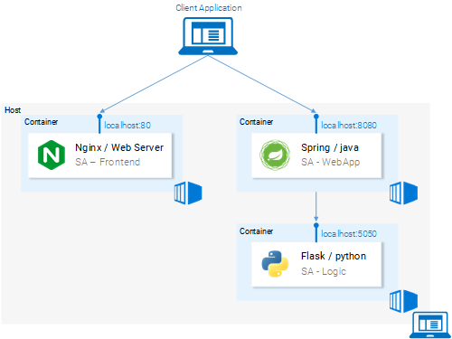

Fig. 10. Microservices running in Containers

#### Brain Teaser — Why Kubernetes?

In this section, we learned about the Dockerfile, how to use it to build an image, and the commands to push it to the Docker registry. Additionally, we investigated how to reduce the number of files sent to the build context by ignoring useless files. And in the end, we got the application running from containers. So why Kubernetes? We will investigate deeper into that in the next article, but I want to leave you a brainteaser.

*   Our Sentiment Analysis web app became a world hit and we suddenly have a million requests per minute to analyze sentiments and we experience huge load on **sa-webapp** and **sa-logic**. How can we scale the containers?

* * *

### Introduction to Kubernetes

I promise and I am not exaggerating that by the end of the article you will ask yourself “Why don’t we call it Supernetes?”.


Fig. 11. Supernetes

If you followed this article from the beginning we covered so much ground and so much knowledge. You might worry that this will be the hardest part, but, it is the simplest. The only reason why learning Kubernetes is daunting is because of the “everything else” and we covered that one so well.

### What is Kubernetes

After we started our Microservices from containers we had one question, let’s elaborate it further in a Q&A format:  
**Q:** How do we scale containers?  
**A:** We spin up another one.  
**Q:** How do we share the load between them? What if the Server is already used to the maximum and we need another server for our container? How do we calculate the best hardware utilization?  
**A:** Ahm… Ermm… (Let me google).  
**Q:** Rolling out updates without breaking anything? And if we do, how can we go back to the working version.

Kubernetes solves all these questions (and more!). My attempt to reduce Kubernetes in one sentence would be: “Kubernetes is a Container Orchestrator, that abstracts the underlying infrastructure. (Where the containers are run)”.

We have a faint idea about Container Orchestration. We will see it in practice in the continuation of this article, but it’s the first time that we are reading about “abstracts the underlying infrastructure”. So let’s take a close-up shot, at this one.

#### Abstracting the underlying infrastructure

Kubernetes abstracts the underlying infrastructure by providing us with a simple API to which we can send requests. Those requests prompt Kubernetes to meet them at its best of capabilities. For example, it is as simple as requesting “Kubernetes spin up 4 containers of the image x”. Then Kubernetes will find under-utilized nodes in which it will spin up the new containers (see Fig. 12.).

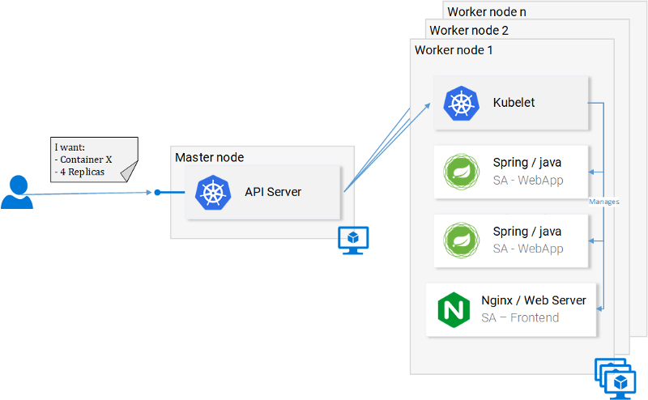

Fig. 12. Request to the API Server

What does this mean for the developer? That he doesn’t have to care about the number of nodes, where containers are started and how they communicate. He doesn’t deal with hardware optimization or worry about nodes going down (and they will go down _Murphy’s Law_), because new nodes can be added to the Kubernetes cluster. In the meantime Kubernetes will spin up the containers in the other nodes that are still running. It does this at the best possible capabilities.

In figure 12 we can see a couple of new things:

*   **API Server**: Our only way to interact with the Cluster. Be it starting or stopping another container (err *pods) or checking current state, logs, etc.
*   **Kubelet**: monitors the containers (err *pods) inside a node and communicates with the master node.
*   ***Pods**: Initially just think of pods as containers.

And we will stop here, as diving deeper will just loosen our focus and we can always do that later, there are useful resources to learn from, like the official documentation (the hard way) or reading the amazing book [Kubernetes in Action](https://www.amazon.com/Kubernetes-Action-Marko-Luksa/dp/1617293725), by [Marko Lukša](https://twitter.com/markoluksa).

#### Standardizing the Cloud Service Providers

Another strong point that Kubernetes drives home, is that it standardizes the Cloud Service Providers (CSPs). This is a bold statement, but let’s elaborate with an example:

– An expert in Azure, Google Cloud Platform or some other CSP ends up working on a project in an entirely new CSP, and he has no experience working with it. This can have many consequences, to name a few: he can miss the deadline; the company might need to hire more resources, and so on.

In contrast, with Kubernetes this isn’t a problem at all. Because you would be executing the same commands to the API Server no matter what CSP. You on a declarative manner request from the API Server **what you want.** Kubernetes abstracts away and implements the **how** for the CSP in question.

Give it a second to sink in — this is extremely powerful feature. For the company it means that they are not tied up to a CSP. They calculate their expenses on another CSP, and they move on. They still will have the expertise, they still will have the resources, and they can do that for _cheaper!_

All that said, in the next section we will put Kubernetes in Practice.

### Kubernetes in Practice — Pods

We set up the Microservices to run in containers and it was a cumbersome process, but it worked. We also mentioned that this solution is not scalable or resilient and that Kubernetes resolves these issues. In continuation of this article, we will migrate our services toward the end result as shown in figure 13, where the Containers are orchestrated by Kubernetes.


Fig. 13. Microservices running in a Kubernetes Managed Cluster

In this article, we will use Minikube for debugging locally, though everything that will be presented works as well in Azure and in Google Cloud Platform.

### Installing and Starting Minikube

Follow official documentation for installing [Minikube](https://kubernetes.io/docs/tasks/tools/install-minikube/). During Minikube installation, you will also install **Kubectl.** This is a client to make requests to the Kubernetes API Server.

To start Minikube execute the command `minikube start` and after it is completed, execute kubectl get nodes and you should get the following output

**kubectl get nodes**  
NAME       STATUS    ROLES     AGE       VERSION  
minikube   Ready     &lt;none&gt;    11m       v1.9.0

Minikube provides us with a Kubernetes Cluster that has only one node, but remember we do not care how many Nodes there are, Kubernetes abstracts that away, and for us to learn Kubernetes that is of no importance. In the next section, we will start with our first Kubernetes resource \[DRUM ROLLS\] **the Pod**.

#### Pods

I love containers, and by now you love containers too. So why did Kubernetes decide to give us Pods as the smallest deployable compute unit? What does a pod do? Pods can be composed of one or even a group of containers that share the same execution environment.

But do we really need to run two containers in one pod? Erm.. Usually, you run only one container and that’s what we will do in our examples. But for cases when for e.g. two containers need to share volumes, or they communicate with each other using inter-process communication or are otherwise tightly coupled, then that’s made possible using **Pods**. Another feature that Pods make possible is that we are not tied to Docker containers, if desired we can use other technologies for e.g. [Rkt](https://coreos.com/rkt/).

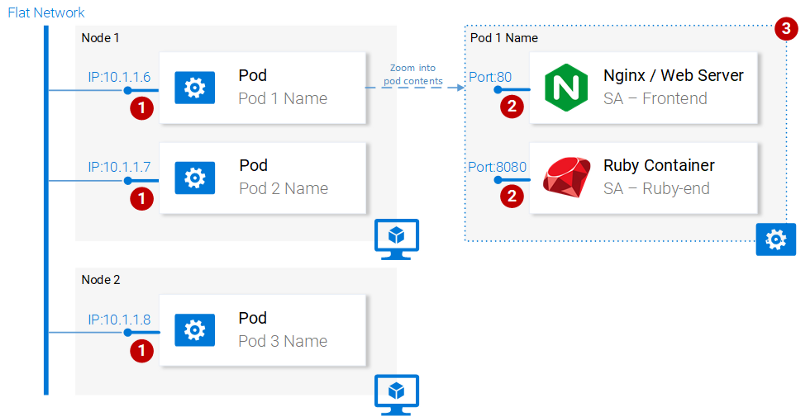

**Fig. 14. Pod properties**

To summarize, the main properties of Pods are (also shown in figure 14):

1.  Each pod has a unique IP address in the Kubernetes cluster
2.  Pod can have multiple containers. The containers share the same port space, as such they can communicate via localhost (understandably they cannot use the same port), and communicating with containers of the other pods has to be done in conjunction with the pod ip.
3.  Containers in a pod share the same volume*, same ip, port space, IPC namespace.

*Containers have their own isolated filesystems, though they are able to share data using the Kubernetes resource **Volumes.**

This is more than enough information for us to continue, but to satisfy your curiosity check out the [official documentation](https://kubernetes.io/docs/concepts/workloads/pods/pod/).

### Pod definition

Below we have the manifest file for our first pod **sa-frontend**, and then below we explain all the points.
```
apiVersion: v1  
kind: Pod                                            # 1  
metadata:  
  name: sa-frontend                                  # 2  
spec:                                                # 3  
  containers:  
    \- image: rinormaloku/sentiment-analysis-frontend # 4  
      name: sa-frontend                              # 5  
      ports:  
        \- containerPort: 80                          # 6
```
1.  **Kind:** specifies the kind of the Kubernetes Resource that we want to create. In our case, a **Pod**.
2.  **Name:** defines the name for the resource. We named it **sa-frontend**.
3.  **Spec** is the object that defines the desired state for the resource. The most important property of a Pods Spec is the Array of containers.
4.  **Image** is the container image we want to start in this pod.
5.  **Name** is the unique name for a container in a pod.
6.  **Container Port:**is the port at which the container is listening. This is just an indicator for the reader (dropping the port doesn’t restrict access).

### Creating the SA Frontend pod

You can find the file for the above pod definition in `resource-manifests/**sa-frontend-pod.yaml.**` You either navigate in your terminal to that folder or you would have to provide the full location in the command line. Then execute the command:

**kubectl create -f sa-frontend-pod.yaml**  
pod "sa-frontend" created

To check if the Pod is running execute the following command:

**kubectl get pods**  
```
NAME                          READY     STATUS    RESTARTS   AGE  
sa-frontend                   1/1       Running   0          7s
```
If it is still in **ContainerCreating** you can execute the above command with the argument `--watch` to update the information when the Pod is in Running State.

#### Accessing the application externally

To access the application externally we create a Kubernetes resource of type **Service**, that will be our next article, which is the proper implementation, but for quick debugging we have another option, and that is port-forwarding:

**kubectl port-forward sa-frontend 88:80**  
Forwarding from 127.0.0.1:88 -> 80

Open your browser in **127.0.0.1:88** and you will get to the react application.

#### The wrong way to scale up

We said that one of the Kubernetes main features was scalability, to prove this let’s get another pod running. To do so create another pod resource, with the following definition:
```
apiVersion: v1  
kind: Pod                                              
metadata:  
  name: sa-frontend2      # The only change  
spec:                                                  
  containers:  
    \- image: rinormaloku/sentiment-analysis-frontend   
      name: sa-frontend                                
      ports:  
        \- containerPort: 80
```
Create the new pod by executing the following command:
```
**kubectl create -f sa-frontend-pod2.yaml**  
pod "sa-frontend2" created
```
Verify that the second pod is running by executing:
```
**kubectl get pods**  
NAME                          READY     STATUS    RESTARTS   AGE  
sa-frontend                   1/1       Running   0          7s  
sa-frontend2                  1/1       Running   0          7s
```
Now we have two pods running!

**Attention:** this is not the final solution, and it has many flaws. We will improve this in the section for another Kubernetes resource **Deployments**.

#### Pod Summary

The Nginx web server with the static files is running inside two different pods. Now we have two questions:

*   How do we expose it externally to make it accessible via URL, and
*   How do we load balance between them?


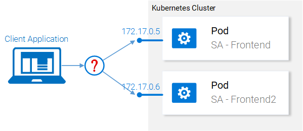

Fig. 15. Load balancing between pods

Kubernetes provides us the **Services** resource. Let’s jump right into it, in the next section.

### Kubernetes in Practice — Services

The Kubernetes **Service** resource acts as the entry point to a set of pods that provide the same functional service. This resource does the heavy lifting, of discovering services and load balancing between them as shown in figure 16.

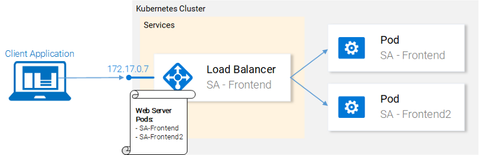

Fig. 16. Kubernetes Service maintaining IP addresses

In our Kubernetes cluster, we will have pods with different functional services. (The frontend, the Spring WebApp and the Flask Python application). So the question arises how does a service know which pods to target? I.e. how does it generate the list of the endpoints for the pods?

This is done using **Labels**, and it is a two-step process:

1.  Applying a label to all the pods that we want our Service to target and
2.  Applying a “selector” to our service so that defines which labeled pods to target.

This is much simpler visually:

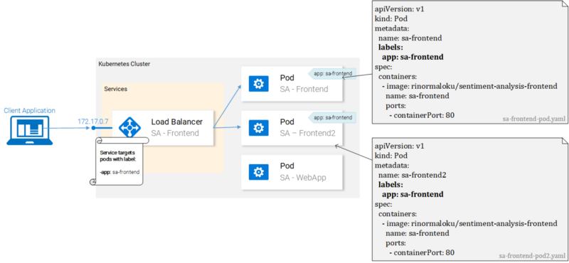

Fig. 17. Pods with labels and their manifests

We can see that pods are labeled with “app: sa-frontend” and the service is targeting pods with that label.

#### Labels

Labels provide a simple method for organizing your Kubernetes Resources. They represent a key-value pair and can be applied to every resource. Modify the manifests for the pods to match the example shown earlier in figure 17.

Save the files after completing the changes, and apply them with the following command:

**kubectl apply -f sa-frontend-pod.yaml**  
Warning: kubectl apply should be used on resource created by either kubectl create --save-config or kubectl apply  
pod "sa-frontend" configured  
**kubectl apply -f sa-frontend-pod2.yaml**   
Warning: kubectl apply should be used on resource created by either kubectl create --save-config or kubectl apply  
pod "sa-frontend2" configured

We got a warning (apply instead of create, roger that). In the second line, we see that the pods “sa-frontend” and “sa-frontend2” are configured. We can verify that the pods were labeled by filtering the pods that we want to display:

**kubectl get pod -l app=sa-frontend**  
NAME           READY     STATUS    RESTARTS   AGE  
sa-frontend    1/1       Running   0          2h  
sa-frontend2   1/1       Running   0          2h

Another way to verify that our pods are labeled is by appending the flag `--show-labels` to the above command. This will display all the labels for each pod.  
Great! Our pods are labeled and we are ready to target them with our Service. Lets get started defining the Service of type LoadBalancer shown in Fig. 18.


Fig. 18. Load balancing with the LoadBalancer Service

### Service definition

The YAML definition of the Loadbalancer Service is shown below:
```
apiVersion: v1  
kind: Service              # 1  
metadata:  
  name: sa-frontend-lb  
spec:  
  type: LoadBalancer       # 2  
  ports:  
  \- port: 80               # 3  
    protocol: TCP          # 4  
    targetPort: 80         # 5  
  selector:                # 6  
    app: sa-frontend       # 7
```

1.  **Kind:** A service.
2.  **Type:** Specification type, we choose LoadBalancer because we want to balance the load between the pods.
3.  **Port:** Specifies the port in which the service gets requests.
4.  **Protocol:** Defines the communication.
5.  **TargetPort:** The port at which incomming requests are forwarded.
6.  **Selector:** Object that contains properties for selecting pods.
7.  **app:** sa-frontend Defines which pods to target, only pods that are labeled with “app: sa-frontend”

To create the service execute the following command:

**kubectl create -f service-sa-frontend-lb.yaml**  
service "sa-frontend-lb" created

You can check out the state of the service by executing the following command:

**kubectl get svc**  
NAME             TYPE           CLUSTER-IP      EXTERNAL-IP   PORT(S)        AGE  
sa-frontend-lb   LoadBalancer   10.101.244.40   &lt;pending&gt;     80:30708/TCP   7m

The **External-IP** is in pending state (and don’t wait, as it’s not going to change). This is only because we are using **Minikube**. If we would have executed this in a cloud provider like Azure or GCP, we would get a Public IP, which makes our services worldwide accessible.

Despite that, Minikube doesn’t let us hanging it provides a useful command for local debugging, execute the following command:

**minikube service sa-frontend-lb**  
Opening kubernetes service default/sa-frontend-lb in default browser...

This opens your browser pointing to the services IP. After the Service receives the request, it will forward the call to one of the pods (which one doesn’t matter). This abstraction enables us to see and act with the numerous pods as one unit, using the Service as an entry point.

#### Service Summary

In this section, we covered labeling resources, using those as selectors in Services, and we defined and created a LoadBalancer service. This fulfills our requirements to scale the application (just add new labeled pods) and to Load balance between the pods, using the service as an entry point.

### Kubernetes in Practice — Deployments

Kubernetes Deployments help us with one constant in the life of every application, and that is **change**. Moreover, the only applications that do not change are the ones that are already dead, and while not, new requirements will come in, more code will be shipped, it will be packaged, and deployed. And on each step of this process, mistakes can be made.

The Deployment resource automates the process of moving from one version of the application to the next, with zero downtime and in case of failures, it enables us to quickly roll back to the previous version.

#### Deployments in Practice

Currently, we have **two pods** and **a service** exposing them and load balancing between them (see Fig. 19.). We mentioned that deploying the pods separately is far from perfect. It requires separately managing each (create, update, delete and monitoring their health). Quick updates and fast rollbacks are out of the question! This is not acceptable and the **Deployments** Kubernetes resource solves each of these issues.

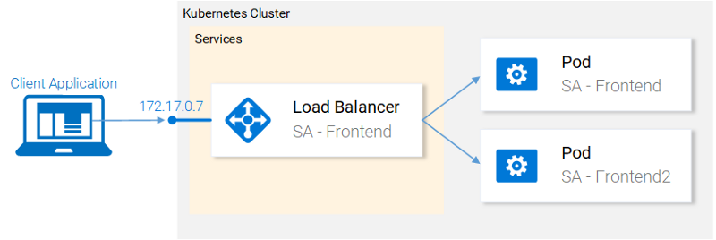

Fig. 19. Current state

Before we continue let’s state what we want to achieve, as it will provide us with the overview that enables us to understand the manifest definition for the deployment resource. What we want is:

1.  Two pods of the image rinormaloku/sentiment-analysis-frontend
2.  Zero Downtime deployments,
3.  Pods labeled with `**app:** sa-frontend` so that the services get discovered by the Service **sa-frontend-lb.**

In the next section, we will translate the requirements into a Deployment definition.

### Deployment definition

The YAML resource definition that achieves all the above-mentioned points:
```
apiVersion: extensions/v1beta1  
kind: Deployment                                          # 1  
metadata:  
  name: sa-frontend  
spec:  
  replicas: 2                                             # 2  
  minReadySeconds: 15  
  strategy:  
    type: RollingUpdate                                   # 3  
    rollingUpdate:   
      maxUnavailable: 1                                   # 4  
      maxSurge: 1                                         # 5  
  template:                                               # 6  
    metadata:  
      labels:  
        app: sa-frontend                                  # 7  
    spec:  
      containers:  
        \- image: rinormaloku/sentiment-analysis-frontend  
          imagePullPolicy: Always                         # 8  
          name: sa-frontend  
          ports:  
            \- containerPort: 80
```

1.  **Kind:** A deployment.
2.  **Replicas** is a property of the deployments Spec object that defines how many pods we want to run. So only 2.
3.  **Type** specifies the strategy used in this deployment when moving from the current version to the next. The strategy **RollingUpdate** ensures Zero Downtime deployments.
4.  **MaxUnavailable** is a property of the RollingUpdate object that specifies the maximum unavailable pods allowed (compared to the desired state) when doing a rolling update. For our deployment which has 2 replicas this means that after terminating one Pod, we would still have one pod running, this way keeping our application accessible.
5.  **MaxSurge** is another property of the RollingUpdate object that defines the maximum amount of pods added to a deployment (compared to the desired state). For our deployment, this means that when moving to a new version we can add one pod, which adds up to 3 pods at the same time.
6.  **Template:** specifies the pod template that the Deployment will use to create new pods. Most likely the resemblance with Pods struck you immediately.
7.  `**app:** sa-frontend` the label to use for the pods created by this template.
8.  **ImagePullPolicy** when set to **Always**, it  will pull the container images on each redeployment.

Honestly, that wall of text got even me confused, let’s just get started with the example:

**kubectl apply -f sa-frontend-deployment.yaml**  
deployment "sa-frontend" created

As always let’s verify that everything went as planned:

**kubectl get pods**  
NAME                           READY     STATUS    RESTARTS   AGE  
sa-frontend                    1/1       Running   0          2d  
sa-frontend-5d5987746c-ml6m4   1/1       Running   0          1m  
sa-frontend-5d5987746c-mzsgg   1/1       Running   0          1m  
sa-frontend2                   1/1       Running   0          2d

We got 4 running pods, two pods created by the Deployment and the other two are the ones we created manually. Delete the ones we created manually using the command `kubectl delete pod <pod-name>`.

**Exercise:** Delete one of the pods of the deployment as well and see what happens. Think for the reason before reading the explanation below.

**Explanation:** Deleting one pod made the Deployment notice that the current state (1 pod running) is different from the desired state (2 pods running) so it started another pod.

So what was so good about Deployments, besides keeping the desired state? Let’s get started with the benefits.

#### Benefit #1: Rolling a Zero-Downtime deployment

Our Product manager came to us with a new requirement, our clients want to have a green button in the frontend. The developers shipped their code and provided us with the only thing we need, the container image `rinormaloku/sentiment-analysis-frontend:green`. Now it’s our turn, we the DevOps have to roll a Zero-Downtime deployment, Will the hard work pay off? Let’s see that!

Edit the file `sa-frontend-deployment.yaml` by changing the container image to refer to the new image: `rinormaloku/sentiment-analysis-frontend:green`. Save the changes as `sa-frontend-deployment-green.yaml` and execute the following command:

**kubectl apply -f sa-frontend-deployment-green.yaml --record**  
deployment "sa-frontend" configured

We can check the status of the rollout using the following command:

**kubectl rollout status deployment sa-frontend**  
Waiting for rollout to finish: 1 old replicas are pending termination...  
Waiting for rollout to finish: 1 old replicas are pending termination...  
Waiting for rollout to finish: 1 old replicas are pending termination...  
Waiting for rollout to finish: 1 old replicas are pending termination...  
Waiting for rollout to finish: 1 old replicas are pending termination...  
Waiting for rollout to finish: 1 of 2 updated replicas are available...  
deployment "sa-frontend" successfully rolled out

According to the output the deployment was rolled out. It was done in such a fashion that the replicas were replaced one by one. Meaning that our application was always on. Before we move on let’s verify that the update is live.

#### Verifying the deployment

Let’s see the update live on our browsers. Execute the same command that we used before `minikube service sa-frontend-lb`, which opens up the browser. We can see that the button was updated.

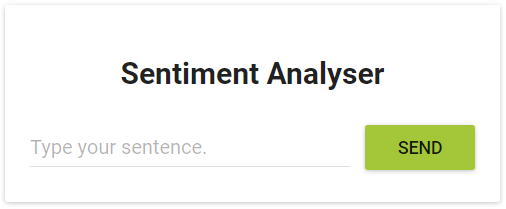

Fig. 20. The Green button

#### Behind the scenes of “The RollingUpdate”

After we applied the new deployment, Kubernetes compares the new state with the old one. In our case, the new state requests two pods with the image `rinormaloku/sentiment-analysis-frontend:green.` This is different from the current state running so it kicks in the **RollingUpdate**.


Fig. 21. RollingUpdate replacing pods

The RollingUpdate acts according to the rules we specified, those being “**maxUnavailable:** 1″ and “**maxSurge:** 1″. This means that the deployment can terminate only one pod, and can start only one new pod. This process is repeated until all pods are replaced (see Fig. 21).

Let’s continue with the benefit number 2.

**Disclaimer:** _For entertainment purposes, the next part is written as a novella._

#### Benefit #2: Rolling back to a previous state

The Product Manager runs into your office and he is having a **crisis!**

“The application has a critical bug, in PRODUCTION!! Revert back to the previous version immediately” — yells the product manager.

He sees the coolness in you, not twitching one eye. You turn to your beloved terminal and type:

**kubectl rollout history deployment sa-frontend**  
deployments "sa-frontend"  
REVISION  CHANGE-CAUSE  
1         &lt;none&gt;           
2         kubectl.exe apply --filename=sa-frontend-deployment-green.yaml --record=true

You take a short look at the previous deployments. “The last version is buggy, meanwhile the previous version worked perfectly?” — you ask the Product Manager.

“Yes, are you even listening to me!” — screams the product manager.

You ignore him, you know what you have to do, you start typing:

**kubectl rollout undo deployment sa-frontend --to-revision=1**  
deployment "sa-frontend" rolled back

You refresh the page and the change is undone!

The product managers jaw drops open.

You saved the day!

_The end!_

* * *

Yeah… it was a boring novella. Before Kubernetes existed it was so much better, we had more drama, higher intensity, and that for a longer period of time. Ohh good old times!

Most of the commands are self-explanatory, besides one detail that you had to work out yourself. Why the first revision has a **CHANGE-CAUSE** of &lt;none&gt; meanwhile the second revision has a **CHANGE-CAUSE** of “_kubectl.exe apply –filename=sa-frontend-deployment-green.yaml_  _–record=true_“.

If you concluded that it’s because of the `--record` flag that we used when we applied the new image then you are totally correct!

In the next section, we will use the concepts learned thus far to complete the whole architecture.

### Kubernetes and everything else in Practice

We learned all the resources that we need to complete the architecture that’s why this part is going to be quick. In figure 22 we have greyed out everything that we still have to do. Lets start from the bottom: **Deploying the sa-logic deployment**.

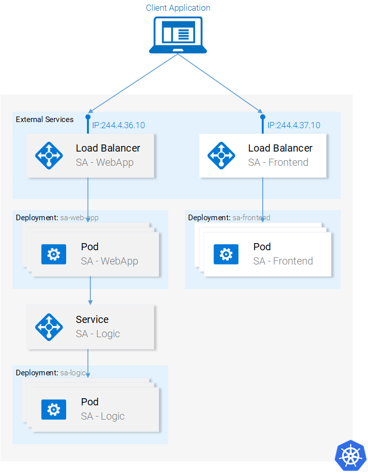

Fig. 22. Current Application State

#### Deployment SA-Logic

Navigate in your terminal to the folder resource-manifests and execute the following command:

**kubectl apply -f sa-logic-deployment.yaml --record**  
deployment "sa-logic" created

The deployment SA-Logic created three pods. (Running the container of our python application). It labeled them with `**app:** sa-logic.` This labeling enables us to target them using a selector from the SA-Logic service. Please take time to open the file `sa-logic-deployment.yaml` and check out the contents.

It’s the same concepts used all over again, let’s jump right into the next resource: **the service SA-Logic**.

#### Service SA Logic

Lets elaborate why we need this Service. Our Java application (running in the pods of SA — WebApp deployment) depends on the sentiment analysis done by the Python Application. But now, in contrast to when we were running everything locally, we don’t have one single python application listening to one port, we have 2 pods and if needed we could have more.

That’s why we need a **Service** that “acts as the entry point to a set of pods that provide the same functional service”. This means that we can use the Service SA-Logic as the entry point to all the SA-Logic pods.

Let’s do that:

**kubectl apply -f service-sa-logic.yaml**  
service "sa-logic" created

**Updated Application State:** We have 2 pods (containing the Python Application) running and we have the SA-Logic service acting as an entry point that we will use in the SA-WebApp pods.

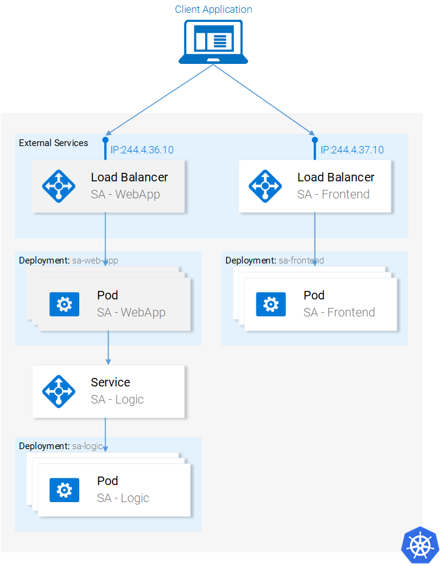

Fig. 23. Updated Application State

Now we need to deploy the SA-WebApp pods, using a deployment resource.

#### Deployment SA-WebApp

We are getting the hang out of deployments, though this one has one more feature. If you open the file `sa-web-app-deployment.yaml` you will find this part new:

\- image: rinormaloku/sentiment-analysis-web-app  
  imagePullPolicy: Always  
  name: sa-web-app  
 **env:  
    \- name: SA\_LOGIC\_API_URL  
      value: "**[**http://sa-logic**](http://sa-logic/)**"**  
  ports:  
    \- containerPort: 8080

The first thing that interests us is what does the **env** property do? And we surmise that it is declaring the environment variable SA\_LOGIC\_API_URL with the value “[http://sa-logic](http://sa-logic/)” inside our pods. But why are we initializing it to [**http://sa-logic**](http://sa-logic/), what is **sa-logic**?

Lets get introduced to **kube-dns**.

#### KUBE-DNS

Kubernetes has a special pod the **kube-dns**. And by default, all Pods use it as the DNS Server. One important property of **kube-dns** is that it creates a DNS record for each created service.

This means that when we created the service **sa-logic** it got an IP address. Its name was added as a record (in conjunction with the IP) in kube-dns. This enables all the pods to translate the **sa-logic** to the SA-Logic services IP address.

Good, now we can continue with:

#### Deployment SA WebApp (continued)

Execute the command:

**kubectl apply -f sa-web-app-deployment.yaml --record**  
deployment "sa-web-app" created

Done. We are left to expose the SA-WebApp pods externally using a LoadBalancer Service. This enables our react application to make http requests to the service which acts as an entry point to the SA-WebApp pods.

#### Service SA-WebApp

Open the file `service-sa-web-app-lb.yaml`, as you can see everything is familiar to you.  
So without further adoexecute the command:

**kubectl apply -f service-sa-web-app-lb**.**yaml**  
service "sa-web-app-lb" created

The architecture is complete. But we have one single dissonance. When we deployed the SA-Frontend pods our container image was pointing to our SA-WebApp in [http://localhost:8080/sentiment](http://localhost:8080/sentiment). But now we need to update it to point to the IP Address of the SA-WebApp Loadbalancer. (Which acts as an entry point to the SA-WebApp pods).

Fixing this dissonance provides us with the opportunity to succinctly encompass once more everything from code to deployment. (It’s even more effective if you do this alone instead of following the guide below). Let’s get started:

1.  Get the SA-WebApp Loadbalancer IP by executing the following command:

```
minikube service list  
|-------------|----------------------|-----------------------------|  
|  NAMESPACE  |         NAME         |             URL             |  
|-------------|----------------------|-----------------------------|  
| default     | kubernetes           | No node port                |  
| default     | sa-frontend-lb       | http://192.168.99.100:30708 |  
| default     | sa-logic             | No node port                |  
| default     | sa-web-app-lb        | http://192.168.99.100:31691 |  
| kube-system | kube-dns             | No node port                |  
| kube-system | kubernetes-dashboard | http://192.168.99.100:30000 |  
|-------------|----------------------|-----------------------------|
```

2\. Use the SA-WebApp LoadBalancer IP in the file `sa-frontend/src/App.js`, as shown below:

analyzeSentence() {  
        fetch('http://**192.168.99.100:31691**/sentiment', { /* shortened for brevity */})  
            .then(response => response.json())  
            .then(data => this.setState(data));  
    }

3\. Build the static files `npm run build` (you need to navigate to the folder **sa-frontend**)

4\. Build the container image:

docker build -f Dockerfile -t $DOCKER\_USER\_ID/sentiment-analysis-frontend:minikube .

5\. Push the image to Docker hub.

docker push $DOCKER\_USER\_ID/sentiment-analysis-frontend:minikube

6\. Edit the sa-frontend-deployment.yaml to use the new image and

7\. Execute the command kubectl apply -f sa-frontend-deployment.yaml

Refresh the browser or if you closed the window execute `minikube service sa-frontend-lb`. Give it a try by typing a sentence!


### Article summary

Kubernetes is beneficial for the team, for the project, simplifies deployments, scalability, resilience, it enables us to consume any underlying infrastructure and you know what? From now on, let’s call it Supernetes!

What we covered in this series:

*   Building / Packaging / Running ReactJS, Java and Python Applications
*   Docker Containers; how to define and build them using Dockerfiles,
*   Container Registries; we used the Docker Hub as a repository for our containers.
*   We covered the most important parts of Kubernetes.
*   Pods
*   Services
*   Deployments
*   New concepts like Zero-Downtime deployments
*   Creating scalable apps
*   And in the process, we migrated the whole microservice application to a Kubernetes Cluster.

I am Rinor Maloku and I want to thank you for joining me on this voyage. Since you read this far I know that you loved this article and would be interested in more. I write articles that go into this depth of detail for new technologies every 3 months. You can always expect an example application, hands-on practice, and a guide that provides you with the right tools and knowledge to tackle any real-world project.

To stay in touch and not miss any of my articles subscribe to my [newsletter](https://tinyletter.com/rinormaloku), follow me on [Twitter](https://twitter.com/rinormaloku), and check out my page [rinormaloku.com](https://rinormaloku.com/).

*   [Kubernetes](https://medium.freecodecamp.org/tagged/kubernetes?source=post)
*   [Docker](https://medium.freecodecamp.org/tagged/docker?source=post)
*   [Java](https://medium.freecodecamp.org/tagged/java?source=post)
*   [DevOps](https://medium.freecodecamp.org/tagged/devops?source=post)
*   [Web Development](https://medium.freecodecamp.org/tagged/web-development?source=post)