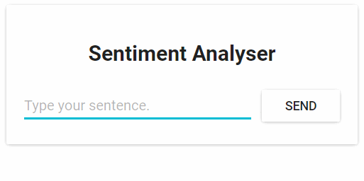
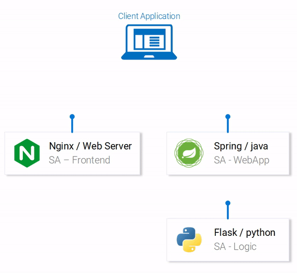
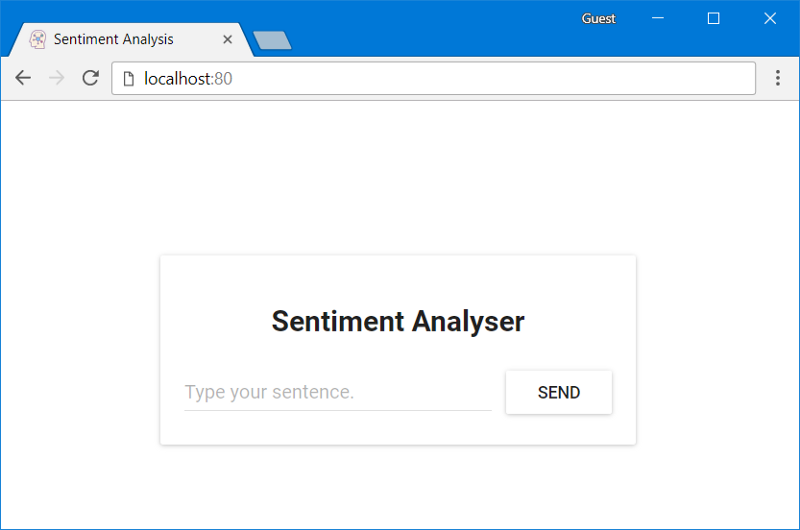
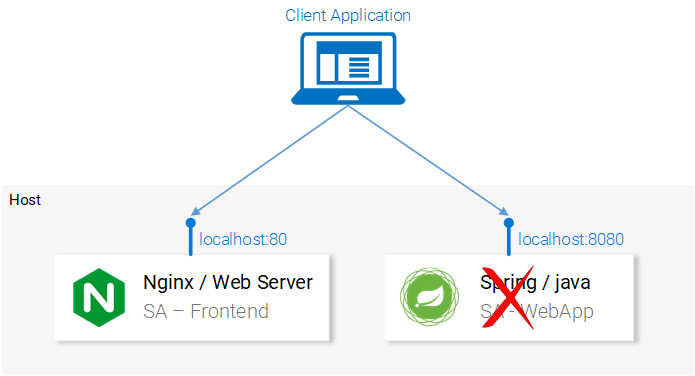
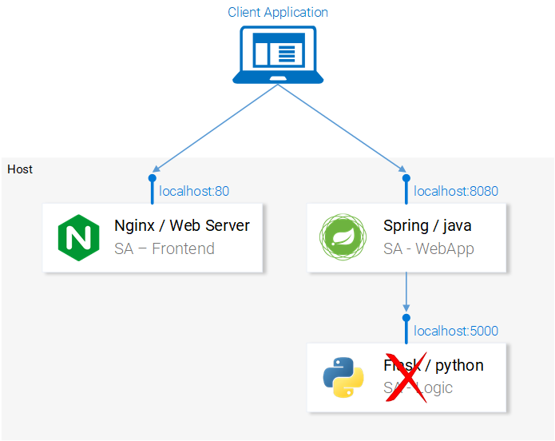
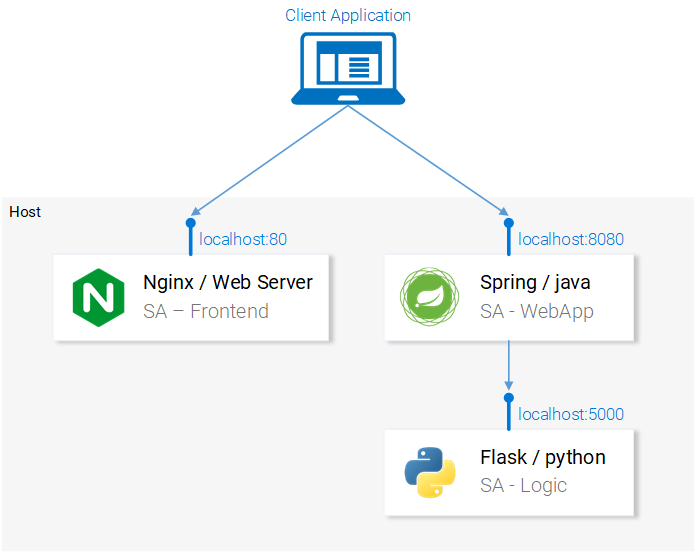
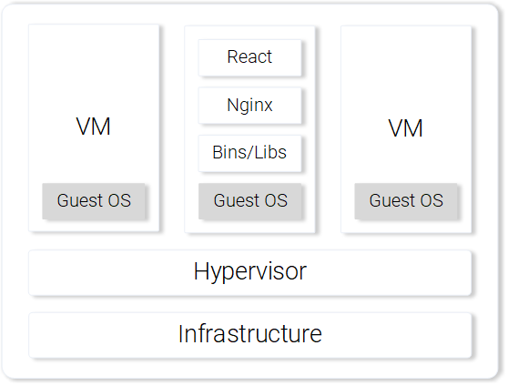
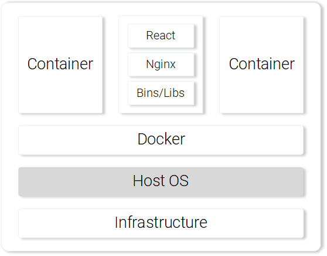
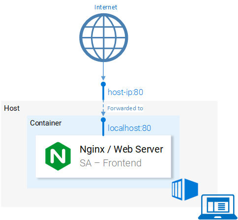
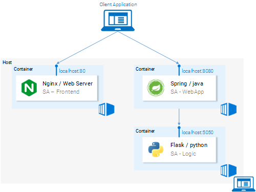

Руководство по Kubernetes, часть 1: приложения, микросервисы и контейнеры / Блог компании RUVDS.com

> По нашей просьбе Хабр создал хаб [Kubernetes](https://habr.com/hub/kubernetes/) и нам приятно разместить первую публикацию в нём. Подписывайтесь!

Kubernetes — это просто. Почему же банки платят мне за работу в этой сфере большие деньги, в то время как любой может освоить эту технологию буквально за несколько часов?

  
  
Если вы сомневаетесь в том, что Kubernetes можно изучить так быстро — предлагаю вам попытаться сделать это самим. А именно, освоив этот материал, вы сможете запустить приложение, основанное на микросервисах, в кластере Kubernetes. Я могу это гарантировать, так как именно по такой методике, которая использована здесь, я обучаю работе с Kubernetes наших клиентов. Что отличает это руководство от других? На самом деле — много всего. Так, большинство подобных материалов начинается с объяснения простых вещей — концепций Kubernetes и особенностей команды kubectl. Авторы этих материалов полагают, что их читатель знаком с разработкой приложений, с микросервисами и с контейнерами Docker. Мы же пойдём другим путём. Сначала расскажем о том, как запустить на компьютере приложение, основанное на микросервисах. Потом рассмотрим сборку образов контейнеров для каждого микросервиса. А уже после этого познакомимся с Kubernetes и разберём развёртывание приложения, основанного на микросервисах, в кластере, управляемом Kubernetes.

Такой подход, с постепенным приближением к Kubernetes, даст глубину понимания происходящего, необходимую обычному человеку для того, чтобы понять то, как просто всё устроено в Kubernetes. Kubernetes — это, безусловно, простая технология, при условии, что тому, кто хочет её освоить, известно, где и как она используется.

Теперь, без лишних слов, приступим к работе и поговорим о приложении, с которым мы будем работать.

## Экспериментальное приложение

Наше приложение будет выполнять лишь одну функцию. Оно принимает, в качестве входных данных, одно предложение, после чего, используя средства анализа текстов, производит анализ тональности (sentiment analysis) этого предложения, получая оценку эмоционального отношения автора предложения к некоему объекту.

Вот как выглядит главное окно этого приложения.

_Веб-приложение для анализа тональности текстов_

С технической точки зрения приложение состоит из трёх микросервисов, каждый из которых решает определённый набор задач:

*   SA-Frontend — веб-сервер Nginx, который обслуживает статические файлы React.
*   SA-WebApp — веб-приложение, написанное на Java, которое обрабатывает запросы от фронтенда.
*   SA-Logic — Python-приложение, которое выполняет анализ тональности текста.

Важно заметить то, что микросервисы существуют не в изоляции. Они реализуют идею «разделения обязанностей», но им, при этом, необходимо взаимодействовать друг с другом.

_Потоки данных в приложении_

На вышеприведённой схеме можно видеть пронумерованные этапы работы системы, иллюстрирующие потоки данных в приложении. Разберём их:

1.  Браузер запрашивает у сервера файл `index.html` (который, в свою очередь, производит загрузку пакета React-приложения).
2.  Пользователь взаимодействует с приложением, это вызывает обращение к веб-приложению, основанному на Spring.
3.  Веб-приложение перенаправляет запрос на выполнение анализа текста Python-приложению.
4.  Python-приложение проводит анализ тональности текста и возвращает результат в виде ответа на запрос.
5.  Spring-приложение отправляет ответ React-приложению (а оно, в свою очередь, показывает результат анализа текста пользователю).

Код для всех этих приложений можно найти [здесь](https://github.com/rinormaloku/k8s-mastery). Рекомендую вам прямо сейчас скопировать себе этот репозиторий, так как впереди нас ждёт много интересных экспериментов с ним.

## Запуск приложения, основанного на микросервисах, на локальном компьютере

Для того чтобы приложение заработало, нам нужно запустить все три микросервиса. Начнём с самого симпатичного из них — с фронтенд-приложения.

### ▍Настройка React для локальной разработки

Для того чтобы запустить React-приложение, вам нужно установить на своём компьютере платформу Node.js и NPM. После того, как вы всё это установите, перейдите, используя терминал, в папку проекта `sa-frontend` и выполните следующую команду:

    npm install

Благодаря выполнению этой команды в папку `node_modules` будут загружены зависимости React-приложения, записи о которых имеются в файле `package.json`. После завершения загрузки зависимостей в той же папке выполните такую команду:

    npm start

Вот и всё. Теперь React-приложение запущено, доступ к нему можно получить, перейдя в браузере по адресу `localhost:3000`. Можете что-нибудь поменять в его коде. Эффект от этих изменений вы тут же увидите в браузере. Это возможно благодаря так называемой «горячей» замене модулей. Благодаря этому фронтенд-разработка превращается в простое и приятное занятие.

### ▍Подготовка React-приложения к выводу в продакшн

Для целей реального использования React-приложения нам нужно преобразовать его в набор статических файлов и отдавать их клиентам, используя веб-сервер.

Для сборки React-приложения, снова, используя терминал, перейдите в папку `sa-frontend` и выполните следующую команду:

    npm run build

Это приведёт к созданию в папке проекта директории `build`. В ней будут содержаться все статические файлы, необходимые для работы React-приложения.

### ▍Обслуживание статических файлов средствами Nginx

Для начала нужно установить и запустить веб-сервер Nginx. [Здесь](https://www.nginx.com/resources/wiki/start/topics/tutorials/install/) можно его загрузить и найти инструкции по установке и запуску. Затем нужно скопировать содержимое папки `sa-frontend/build` в папку `[your_nginx_installation_dir]/html`.

При таком подходе сгенерированный в процессе сборки React-приложения файл `index.html` будет доступен по адресу `[your_nginx_installation_dir]/html/index.html`. Это — файл, который, по умолчанию, Nginx-сервер выдаёт при обращении к нему. Сервер настроен на прослушивание порта `80`, но его можно настроить так, как вам нужно, отредактировав файл `[your_nginx_installation_dir]/conf/nginx.conf`.

Теперь откройте браузер и перейдите по адресу `localhost:80`. Вы увидите страницу React-приложения.

_React-приложение, обслуживаемое сервером Nginx_

Если вы сейчас что-нибудь введёте в поле `Type your sentence` и нажмёте на кнопку `Send` — ничего не произойдёт. Но, если заглянуть в консоль, там можно увидеть сообщения об ошибках. Для того чтобы понять, где именно происходят эти ошибки, разберём код приложения.

### ▍Анализ кода фронтенд-приложения

Взглянув на код файла `App.js`, мы можем увидеть, что нажатие на кнопку `Send` вызывает метод `analyzeSentence()`. Код этого метода приведён ниже. При этом обратите внимание на то, что к каждой строке, к которой имеется комментарий вида `# Номер`, имеется пояснение, приведённое ниже кода. Таким же образом мы будем разбирать и другие фрагменты кода.

    analyzeSentence() {
        fetch('http://localhost:8080/sentiment', {  // #1
            method: 'POST',
            headers: {
                'Content-Type': 'application/json'
            },
            body: JSON.stringify({
                           sentence: this.textField.getValue()})// #2
        })
            .then(response => response.json())
            .then(data => this.setState(data));  // #3
    }

**1.** URL, по которому выполняется POST-запрос. Подразумевается, что по этому адресу находится приложение, ожидающее подобные запросы.

**2.**Тело запроса, отправляемое приложению. Вот пример тела запроса:

    {
        sentence: "I like yogobella!"
    }

**3.**При получении ответа на запрос производится обновление состояния компонента. Это вызывает повторный рендеринг компонента. Если мы получаем данные (то есть — JSON-объект, содержащий введённые данные и вычисленную оценку текста), мы выведем компонент `Polarity`, так как будут соблюдены соответствующие условия. Вот как мы описываем компонент:

    const polarityComponent = this.state.polarity !== undefined ?
        <Polarity sentence={this.state.sentence} 
                  polarity={this.state.polarity}/> :
        null;

Код, как кажется, выглядит вполне работоспособным. Что же тут, всё-таки, не так? Если вы предположите, что по тому адресу, по которому приложение пытается отправить POST-запрос, нет пока ничего, что может этот запрос принять и обработать, то вы будете абсолютно правы. А именно, для обработки запросов, поступающих по адресу `http://localhost:8080/sentiment`, нам нужно запустить веб-приложение, основанное на Spring.

_Нам нужно Spring-приложение, способное принять POST-запрос_

### ▍Настройка веб-приложения, основанного на Spring

Для того чтобы развернуть Spring-приложение, вам понадобится JDK8 и Maven и правильно настроенные переменные среды. После того, как вы всё это установите, вы можете продолжать работу над нашим проектом.

### ▍Упаковка приложения в jar-файл

Перейдите, с помощью терминала, в папку `sa-webapp` и введите следующую команду:

    mvn install

После выполнения этой команды в папке `sa-webapp` будет создана директория `target`. Здесь будет находиться Java-приложение, упакованное в jar-файл, представленное файлом `sentiment-analysis-web-0.0.1-SNAPSHOT.jar`.

### ▍Запуск Java-приложения

Перейдите в папку `target` и запустите приложение следующей командой:

    java -jar sentiment-analysis-web-0.0.1-SNAPSHOT.jar

В ходе выполнения этой команды произойдёт ошибка. Для того чтобы приступить к её исправлению, мы можем проанализировать сведения об исключении в данных трассировки стека:

    Error creating bean with name 'sentimentController': Injection of autowired dependencies failed; nested exception is java.lang.IllegalArgumentException: Could not resolve placeholder 'sa.logic.api.url' in value "${sa.logic.api.url}"

Для нас тут самое важное — упоминание о невозможности выяснения значения `sa.logic.api.url`. Проанализируем код, в котором происходит ошибка.

### ▍Анализ кода Java-приложения

Вот фрагмент кода, в котором происходит ошибка.

    @CrossOrigin(origins = "*")
    @RestController
    public class SentimentController {
        @Value("${sa.logic.api.url}")    // #1
        private String saLogicApiUrl;
        @PostMapping("/sentiment")
        public SentimentDto sentimentAnalysis(
            @RequestBody SentenceDto sentenceDto) 
        {
            RestTemplate restTemplate = new RestTemplate();
            return restTemplate.postForEntity(
                    saLogicApiUrl + "/analyse/sentiment",    // #2
                    sentenceDto, SentimentDto.class)
                    .getBody();
        }
    }

  

1.  В S`entimentController` есть поле `saLogicApiUrl`. Его значение задаётся свойством `sa.logic.api.url`.
2.  Строка `saLogicApiUrl` конкатенируется со значением `/analyse/sentiment`. Вместе они формируют адрес для выполнения обращения к микросервису, выполняющему анализ текста.

  

### ▍Задание значения свойства

В Spring стандартным источником значений свойств является файл `application.properties`, который можно найти по адресу `sa-webapp/src/main/resources`. Но его использование — это не единственный способ задания значений свойств. Сделать это можно и с помощью команды следующего вида:

    java -jar sentiment-analysis-web-0.0.1-SNAPSHOT.jar --sa.logic.api.url=WHAT.IS.THE.SA.LOGIC.API.URL

Значение этого свойства должно указывать на адрес нашего Python-приложения.

Настраивая его, мы сообщаем веб-приложению Spring о том, куда ему нужно обращаться для выполнения запросов на анализ текста.

Для того чтобы не усложнять себе жизнь, решим, что Python-приложение будет доступно по адресу `localhost:5000` и постараемся об этом не забыть. В результате команда для запуска Spring-приложения будет выглядеть так:

    java -jar sentiment-analysis-web-0.0.1-SNAPSHOT.jar --sa.logic.api.url=http://localhost:5000

_В нашей системе не хватает Python-приложения_

Теперь нам осталось лишь запустить Python-приложение и система заработает так, как ожидается.

### ▍Настройка Python-приложения

Для того чтобы запустить Python-приложение, у вас должны быть установлены Python 3 и Pip, и нужно, чтобы были правильно настроены соответствующие переменные среды.

### ▍Установка зависимостей

Перейдите в папку проекта `sa-logic/sa` и выполните следующие команды:

    python -m pip install -r requirements.txt
    python -m textblob.download_corpora

  

### ▍Запуск приложения

После установки зависимостей мы готовы к тому, чтобы запустить приложение:

    python sentiment_analysis.py

После выполнения этой команды нам сообщат следующее:

    * Running on http://0.0.0.0:5000/ (Press CTRL+C to quit)

Это означает, что приложение запущено и ожидает запросы по адресу `localhost:5000/`

### ▍Исследование кода

Рассмотрим код Python-приложения для того, чтобы понять то, как оно реагирует на запросы:

    from textblob import TextBlob
    from flask import Flask, request, jsonify
    app = Flask(__name__)                                   #1
    @app.route("/analyse/sentiment", methods=['POST'])      #2
    def analyse_sentiment():
        sentence = request.get_json()['sentence']           #3
        polarity = TextBlob(sentence).sentences[0].polarity #4
        return jsonify(                                     #5
            sentence=sentence,
            polarity=polarity
        )
    if __name__ == '__main__':
        app.run(host='0.0.0.0', port=5000)                #6

  

1.  Инициализация объекта `Flask`.
2.  Задание адреса для выполнения к нему POST-запросов.
3.  Извлечение свойства `sentence` из тела запроса.
4.  Инициализация анонимного объекта `TextBlob` и получение значения `polarity` для первого поступившего в теле запроса предложения (в нашем случае это — единственное предложение, передаваемое на анализ).
5.  Возврат ответа, в теле которого содержится текст предложения и вычисленный для него показатель `polarity`.
6.  Запуск Flask-приложения, которое будет доступно по адресу `0.0.0.0:5000` (обратиться к нему можно и используя конструкцию вида `localhost:5000`).

Теперь микросервисы, из которых состоит приложение, запущены. Они настроены на взаимодействие друг с другом. Вот как выглядит схема приложения на данном этапе работы.

_Все микросервисы, из которых состоит приложение, приведены в работоспособное состояние_

Теперь, прежде чем продолжать, откройте React-приложение в браузере и попытайтесь проанализировать с его помощью какое-нибудь предложение. Если всё сделано правильно — после нажатия на кнопку `Send` вы увидите под текстовым полем результаты анализа.

В следующем разделе мы поговорим о том, как запустить наши микросервисы в контейнерах Docker. Это нужно для того, чтобы подготовить приложение для запуска в кластере Kubernetes.

## Контейнеры Docker

[Kubernetes](https://ru.wikipedia.org/wiki/Kubernetes) — это система для автоматизации развёртывания, масштабирования и управления контейнеризированными приложениями. Её ещё называют «оркестратором контейнеров» (container orchestrator). Если Kubernetes работает с контейнерами, то нам, прежде чем этой системой пользоваться, нужно сначала этими контейнерами обзавестись. Но сначала давайте поговорим о том, что такое контейнеры. Пожалуй, лучший ответ на вопрос о том, что это такое, можно найти в [документации](https://www.docker.com/resources/what-container) к Docker:

_Образ контейнера — это легковесный, автономный, исполняемый пакет, содержащий некое приложение, который включает в себя всё необходимое для его запуска: код приложения, среду исполнения, системные средства и библиотеки, настройки. Контейнеризированными программами можно пользоваться в средах Linux и Windows, при этом они всегда будут работать одинаково независимо от инфраструктуры._

Это означает, что контейнеры можно запускать на любых компьютерах, в том числе, на продакшн-серверах, и в любых средах заключённые в них приложения будут работать одинаково.

Для того чтобы исследовать особенности контейнеров и сопоставить их с другими способами запуска приложений, рассмотрим пример обслуживания React-приложения с использованием виртуальной машины и контейнера.

### ▍Обслуживание статических файлов React-приложения средствами виртуальной машины

Пытаясь организовать обслуживание статических файлов средствами виртуальных машин, мы столкнёмся со следующими недостатками:

1.  Неэффективное использование ресурсов, так как каждая виртуальная машина представляет собой полноценную операционную систему.
2.  Зависимость от платформы. То, что работает на некоем локальном компьютере, вполне может не заработать на продакшн-сервере.
3.  Медленное и требовательное к ресурсам масштабирование решения, основанного на виртуальных машинах.

_Веб-сервер Nginx, обслуживающий статические файлы, запущенный на виртуальной машине_

Если же для решения аналогичной задачи применить контейнеры, то, в сравнении с виртуальными машинами, можно будет отметить следующие их сильные стороны:

1.  Эффективное использование ресурсов: работа с операционной системой с помощью Docker.
2.  Независимость от платформы. Контейнер, который разработчик сможет запустить на своём компьютере, будет работать где угодно.
3.  Легковесное развёртывание за счёт использования слоёв образов.

_Веб-сервер Nginx, обслуживающий статические файлы, запущенный в контейнере_

Мы сопоставили виртуальные машины и контейнеры лишь по нескольким пунктам, но даже этого достаточно для того, чтобы ощутить сильные стороны контейнеров. [Здесь](https://www.docker.com/what-container) можно найти подробности о контейнерах Docker.

### ▍Сборка образа контейнера для React-приложения

Основным строительным блоком контейнера Docker является файл `Dockerfile`. В начале этого файла делают запись о базовом образе контейнера, затем туда включают последовательность инструкций, указывающую на порядок создания контейнера, который будет соответствовать нуждам некоего приложения.

Прежде чем мы займёмся работой с файлом `Dockerfile`, вспомним о том, что мы делали для того, чтобы подготовить файлы React-приложения для выкладки на Nginx-сервер:

1.  Сборка пакета React-приложения (`npm run build`).
2.  Запуск Nginx-сервера.
3.  Копирование содержимого директории `build` из папки проекта `sa-frontend` в папку сервера `nginx/html`.

Ниже вы сможете увидеть параллели между созданием контейнера и вышеописанными действиями, выполняемыми на локальном компьютере.

### ▍Подготовка файла Dockerfile для приложения SA-Frontend

Инструкции, которые будут содержаться в `Dockerfile` для приложения `SA-Frontend`, состоят всего из двух команд. Дело в том, что группа разработчиков Nginx подготовила базовый [образ](https://hub.docker.com/_/nginx/) для Nginx, который мы будем использовать для создания нашего образа. Вот те два шага, которые нам нужно описать:

1.  Основой образа нужно сделать образ Nginx.
2.  Содержимое папки `sa-frontend/build` нужно скопировать в папку образа `nginx/html`.

Если перейти от этого описания к файлу `Dockerfile`, то выглядеть он будет так:

    FROM nginx
    COPY build /usr/share/nginx/html

Как видите, всё тут очень просто, при этом содержимое файла даже оказывается вполне читабельным и понятным. Этот файл говорит системе о том, что нужно взять образ `nginx` со всем тем, что в нём уже имеется, и скопировать содержимое директории `build` в директорию `nginx/html`.

Тут у вас может возникнуть вопрос, касающийся того, откуда я знаю о том, куда именно нужно копировать файлы из папки `build`, то есть — откуда взялся путь `/usr/share/nginx/html`. На самом деле, и тут нет ничего сложного. Дело в том, что соответствующие сведения можно найти в [описании](https://hub.docker.com/_/nginx/) образа.

### ▍Сборка образа и загрузка его в репозиторий

Прежде чем мы сможем работать с готовым образом, нам нужно отправить его в репозиторий образов. Для этого мы воспользуемся бесплатной облачной платформой для хостинга образов Docker Hub. На данном этапе работы вам нужно сделать следующее:

1.  Установить [Docker](https://www.docker.com/community-edition).
2.  Зарегистрироваться на сайте Docker Hub.
3.  Войти в учётную запись, выполнив в терминале команду следующего вида:
    
        docker login -u="$DOCKER_USERNAME" -p="$DOCKER_PASSWORD"
    

Теперь нужно, с помощью терминала, перейти в директорию `sa-frontend` и выполнить там команду следующего вида:

    docker build -f Dockerfile -t $DOCKER_USER_ID/sentiment-analysis-frontend .

Здесь и далее в подобных командах `$DOCKER_USER_ID` нужно заменить на ваше имя пользователя на Docker Hub. Например, эта часть команды может выглядеть так: `rinormaloku/sentiment-analysis-frontend`.

При этом данную команду можно сократить, убрав из неё `-f Dockerfile`, так как в папке, в которой мы выполняем данную команду, этот файл уже есть.

Для того чтобы отправить готовый образ в репозиторий нам понадобится такая команда:

    docker push $DOCKER_USER_ID/sentiment-analysis-frontend

После её выполнения проверьте список своих репозиториев на Docker Hub для того, чтобы понять, удачно ли прошла отправка образа в облачное хранилище.

### ▍Запуск контейнера

Теперь кто угодно может загрузить и запустить образ, известный как `$DOCKER_USER_ID/sentiment-analysis-frontend`. Для того чтобы это сделать, нужно выполнить следующую последовательность команд:

    docker pull $DOCKER_USER_ID/sentiment-analysis-frontend
    docker run -d -p 80:80 $DOCKER_USER_ID/sentiment-analysis-frontend

Теперь контейнер запущен, и мы можем продолжать работу, создав другие нужные нам образы. Но, прежде чем продолжать, давайте разберёмся с конструкцией `80:80`, которая встречается в команде запуска образа и может показаться непонятной.

*   Первое число `80` — это номер порта хоста (то есть — локального компьютера).
*   Второе число `80` — это порт контейнера, на который должен быть перенаправлен запрос.

Рассмотрим следующую иллюстрацию.

_Перенаправление портов_

Система осуществляет перенаправление запросов с порта `<hostPort>` на порт `<containerPort>`. То есть обращение к порту `80` компьютера перенаправляется на порт `80` контейнера.

Так как порт `80` открыт на локальном компьютере, то обратиться к приложению с этого компьютера можно по адресу `localhost:80`. Если же ваша система не поддерживает Docker, приложение можно запустить на виртуальной машине Docker, адрес которой будет выглядеть как `<docker-machine ip>:80`. Для того чтобы выяснить IP-адрес виртуальной машины Docker, можно воспользоваться командой `docker-machine ip`.

На данном этапе, после успешного запуска контейнера фронтенд-приложения, у вас должна быть возможность открыть его страницу в браузере.

### ▍Файл .dockerignore

Собирая образ приложения `SA-Frontend`, мы могли заметить, что этот процесс оказывается крайне медленным. Происходит так из-за того, что демону Docker должен быть отправлен контекст сборки образа. Директория, представляющая собой контекст сборки, задаётся последним аргументом команды `docker build`. В нашем случае в конце этой команды стоит точка. Это приводит к тому, что в контекст сборки включается следующая структура:

    sa-frontend:
    |   .dockerignore
    |   Dockerfile
    |   package.json
    |   README.md
    +---build
    +---node_modules
    +---public
    \---src

Но нам из всех присутствующих здесь папок нужна лишь папка `build`. Загрузка чего угодно другого — это пустая трата времени. Сборку можно ускорить, указав Docker на то, какие директории можно проигнорировать. Именно для того, чтобы это сделать, нам и нужен файл `.dockerignore`. Вам, если вы знакомы с файлом `.gitignore`, структура этого файла, наверняка, покажется знакомой. В нём перечисляются директории, которые система сборки образа может проигнорировать. В нашем случае содержимое этого файла выглядит так:

    node_modules
    src
    public

Файл `.dockerignore` должен находиться в той же папке, что и файл `Dockerfile`. Теперь сборка образа будет занимать считанные секунды.

Займёмся теперь образом для Java-приложения.

### ▍Сборка образа контейнера для Java-приложения

Знаете что, а ведь вы уже изучили всё необходимое для создания образов контейнеров. Именно поэтому данный раздел будет весьма коротким.

Откройте файл `Dockerfile`, который находится в папке проекта `sa-webapp`. Если вы прочтёте текст этого файла, то в нём вам встретятся всего две новые конструкции, начинающиеся с ключевых слов `ENV` и `EXPOSE`:

    ENV SA_LOGIC_API_URL http://localhost:5000
    …
    EXPOSE 8080

Ключевое слово `ENV` позволяет объявлять переменные окружения внутри контейнеров Docker. В частности, в нашем случае оно позволяет задать URL для доступа к API приложения, выполняющего анализ текста.

Ключевое слово `EXPOSE` позволяет указать Docker на то, что порт нужно открыть. Мы собираемся пользоваться этим портом в ходе работы с приложением. Тут можно заметить, что в `Dockerfile` для приложения `SA-Frontend` такой команды нет. Это нужно лишь для целей документирования, другим словами, эта конструкция предназначена для того, кто будет читать `Dockerfile`.

Сборка образа и отправка его в репозиторий выглядит точно так же, как в предыдущем примере. Если же вы пока не очень уверены в своих силах — соответствующие команды можно найти в файле `README.md` в папке `sa-webapp`.

### ▍Сборка образа контейнера для Python-приложения

Если вы взглянете на содержимое файла `Dockerfile` в папке `sa-logic`, то ничего нового для себя вы там не найдёте. Команды для сборки образа и отправки его в репозиторий тоже должны быть уже вам знакомы, но их, как и в случае с другими нашими приложениями, можно найти в файле `README.md` в папке `sa-logic`.

### ▍Тестирование контейнеризированных приложений

Можете ли вы доверять чему-то такому, что вы не протестировали? Я тоже не могу. Испытаем наши контейнеры.

1.  Запустим контейнер приложения `sa-logic` и настроим его на прослушивание порта `5050`:
    
        docker run -d -p 5050:5000 $DOCKER_USER_ID/sentiment-analysis-logic
    
2.  Запустим контейнер приложения `sa-webapp` и настроим его на прослушивание порта `8080`. Кроме того, нам нужно настроить порт, на котором Python-приложение будет ждать запросы от Java-приложения, переназначив переменную окружения `SA_LOGIC_API_URL`:
    
        $ docker run -d -p 8080:8080 -e SA_LOGIC_API_URL='http://<container_ip or docker machine ip>:5000' $DOCKER_USER_ID/sentiment-analysis-web-app
    

Для того чтобы узнать о том, как выяснить IP-адрес контейнера или виртуальной машины Docker — обратитесь к файлу [README](https://github.com/rinormaloku/k8s-mastery/blob/master/sa-webapp/README.md).

Запустим контейнер приложения `sa-frontend`:

    docker run -d -p 80:80 $DOCKER_USER_ID/sentiment-analysis-frontend

Теперь всё готово к тому, чтобы перейти в браузере по адресу `localhost:80` и испытать приложение.

Обратите внимание на то, что если вы меняли порт для `sa-webapp`, или если вы работаете с виртуальной машиной Docker, вам понадобится отредактировать файл `App.js` из папки `sa-frontend`, поменяв IP-адрес или номер порта в методе `analyzeSentence()`, подставив вместо устаревших данных актуальные сведения. После этого нужно снова собрать образ и воспользоваться им.

Вот как выглядит схема нашего приложения теперь.

_Микросервисы выполняются в контейнерах_

## Итоги: зачем нам кластер Kubernetes?

Только что мы изучили файлы `Dockerfile`, поговорили о том, как собирать образы и отправлять их в репозиторий Docker. Кроме того, мы научились ускорять сборку образов, пользуясь файлом `.dockerignore`. В итоге наши микросервисы теперь выполняются в контейнерах Docker. Тут у вас может возникнуть вполне оправданный вопрос о том, зачем нам Kubernetes. Ответу на данный вопрос будет посвящена вторая часть этого материала. А пока подумайте над следующим вопросом:  
Предположим, что наше веб-приложение для анализа текстов стало всемирно популярным. Каждую минуту к нему приходят миллионы запросов. Это значит, что микросервисы `sa-webapp` и `sa-logic` будут находиться под огромной нагрузкой. Как масштабировать контейнеры, в которых выполняются микросервисы?

