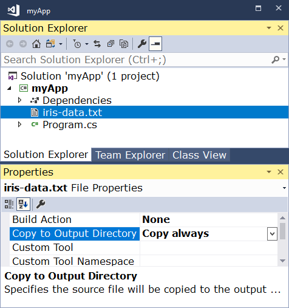

Руководство по ML.NET — первое приложение за 10 минут / Блог компании Microsoft

 [ sahsAGU](https://habr.com/ru/users/sahsAGU/ "Автор публикации") сегодня в 09:00

*   Перевод

В прошлом году мы представили ML.NET, кросс-платформенную и открытую систему машинного обучения для разработчиков .NET. За это время она очень сильно развилась и прошла через множество версий. Сегодня делимся руководством по тому, как создать свое первое приложение на ml.net за 10 минут.

*[Это руководство на английском](https://habr.com/ru/company/microsoft/blog/436732/).

**Ниже туториал для Windows. Но ровно то же самое можно сделать и на [MacOS](https://dotnet.microsoft.com/learn/machinelearning-ai/ml-dotnet-get-started-tutorial?initial-os=macos)/[Linux](https://dotnet.microsoft.com/learn/machinelearning-ai/ml-dotnet-get-started-tutorial?initial-os=linux).

## Установите .NET SDK

Чтобы начать создавать приложения .NET, вам просто нужно скачать и установить .NET SDK (Software Development Kit).

## Создайте свое приложение

Откройте командную строку и выполните следующие команды:

    dotnet new console -o myApp
    cd myApp

Команда `dotnet` создаст для вас `new` приложение типа `console`. Параметр `-o` создает директорий с именем `myApp`, в котором хранится ваше приложение, и заполнит его необходимыми файлами. Команда cd myApp вернет вас в созданный директорий приложения.

## Установите пакет ML.NET

Чтобы использовать ML.NET, вам необходимо установить пакет Microsoft.ML. В командной строке выполните следующую команду:

    dotnet add package Microsoft.ML --version 0.9.0

  

## Скачайте БД

Наше показательное приложение машинного обучения будет предсказывать тип цветка ириса (setosa, versicolor или virginica) на основе четырех характеристик: длина лепестка, ширина лепестка, длина чашелистика и ширина чашелистика.

Откройте репозиторий машинного обучения [UCI](https://archive.ics.uci.edu/ml/machine-learning-databases/iris/iris.data): набор данных Iris, скопируйте и вставьте данные в текстовый редактор (например, «Блокнот») и сохраните их как `iris-data.txt` в каталоге `myApp`.

Когда вы добавите данные, это будет выглядеть следующим образом: каждый ряд представляет различный образец цветка ириса. Слева направо столбцы представляют: длину чашелистика, ширину чашелистика, длину лепестка, ширину лепестка и тип цветка ириса.

    5.1,3.5,1.4,0.2,Iris-setosa
    4.9,3.0,1.4,0.2,Iris-setosa
    4.7,3.2,1.3,0.2,Iris-setosa
    ...

  

#### Используете Visual Studio?

Если вы используете Visual Studio, вам необходимо настроить `iris-data.txt` для копирования в output-директорий.

## Немного покодим

Откройте `Program.cs` в любом текстовом редакторе и замените весь код следующим:

    using Microsoft.ML;
    using Microsoft.ML.Data;
    using System;
    
    namespace myApp
    {
        class Program
        {
            
            
            
            
            
            public class IrisData
            {
               [LoadColumn(0)]
                public float SepalLength;
    
                [LoadColumn(1)]
                public float SepalWidth;
    
                [LoadColumn(2)]
                public float PetalLength;
    
                [LoadColumn(3)]
                public float PetalWidth;
    
                [LoadColumn(4)]
                public string Label;
            }
    
            
            public class IrisPrediction
            {
                [ColumnName("PredictedLabel")]
                public string PredictedLabels;
            }
    
            static void Main(string[] args)
            {
                
                var mlContext = new MLContext();
    
                
                
                var reader = mlContext.Data.CreateTextReader<IrisData>(separatorChar: ',', hasHeader: true);
                IDataView trainingDataView = reader.Read("iris-data.txt");
    
                
                
                
                
                
                var pipeline = mlContext.Transforms.Conversion.MapValueToKey("Label")
                    .Append(mlContext.Transforms.Concatenate("Features", "SepalLength", "SepalWidth", "PetalLength", "PetalWidth"))
                    .Append(mlContext.MulticlassClassification.Trainers.StochasticDualCoordinateAscent(labelColumn: "Label", featureColumn: "Features"))
                    .Append(mlContext.Transforms.Conversion.MapKeyToValue("PredictedLabel"));
    
                
                var model = pipeline.Fit(trainingDataView);
    
                
                
                var prediction = model.CreatePredictionEngine<IrisData, IrisPrediction>(mlContext).Predict(
                    new IrisData()
                    {
                        SepalLength = 3.3f,
                        SepalWidth = 1.6f,
                        PetalLength = 0.2f,
                        PetalWidth = 5.1f,
                    });
    
                Console.WriteLine($"Predicted flower type is: {prediction.PredictedLabels}");
            }
        }
    }

  

## Запустите ваше приложение

В командной строке выполните следующую команду:

    dotnet run

Последняя строка вывода — это предсказанный тип цветка ириса. Вы можете изменить значения, передаваемые в функцию `Predict`, чтобы увидеть прогнозы, основанные на различных измерениях.

Поздравляем, вы создали свою первую модель машинного обучения с ML.NET!

## Не останавливайтесь на достигнутом

Теперь, когда вы получили основы, вы можете продолжить обучение с нашими учебниками по ML.NET.

Теги:

*   [Microsoft](https://habr.com/ru/search/?q=%5BMicrosoft%5D&target_type=posts)
*   [ml.net](https://habr.com/ru/search/?q=%5Bml.net%5D&target_type=posts)