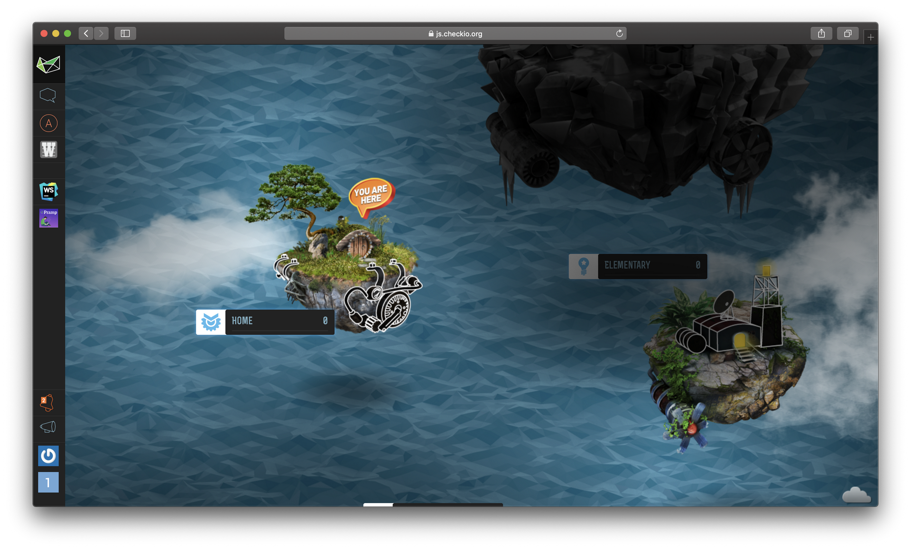
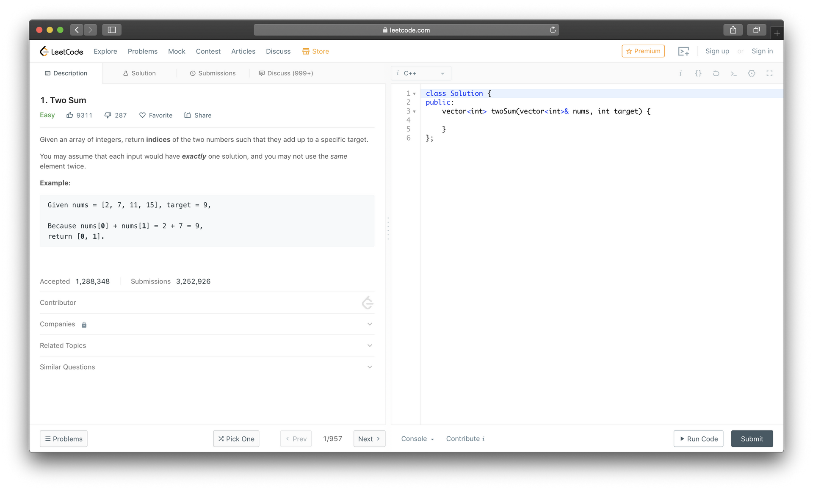
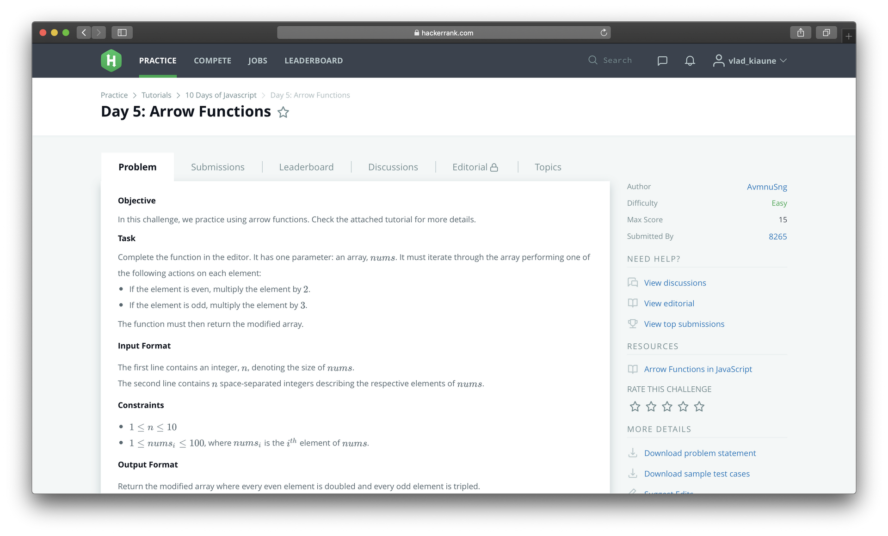
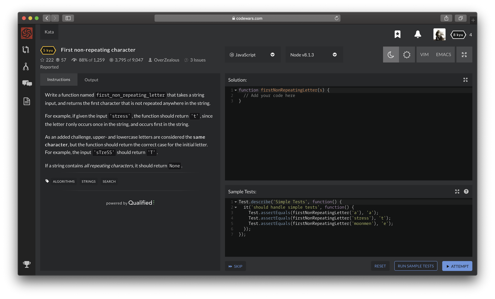
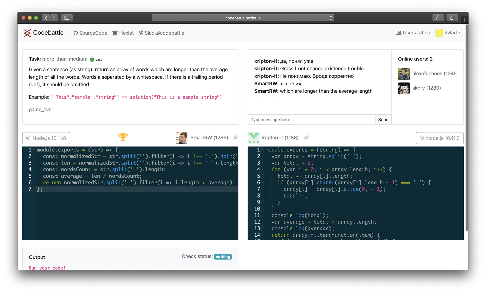

Семь бесплатных автоматизированных платформ-задачников для прокачки навыков программирования / Блог компании Hexlet

_Привет! Недавно сделали подборку [бесплатных сервисов для изучения программирования с нуля](https://habr.com/company/hexlet/blog/432802/). В комментариях получили много заинтересовавших нас платформ. Из них составили отдельный список таких, которые подойдут профессиональным программистам._

**[CheckiO](https://checkio.org/)**

Проект из Украины «Чекио» сфокусирован на Python и JavaScript. Это сборник игровых задач по программированию для тех, кто уже не новичок. Большой упор на геймификацию, симпатичную графику и общение в сообществе. В самом решении задач игрового процесса нет, но есть общий сценарий для прохождения платформы. Полезная фича — смотреть другие решения и подсказывать студентам как их можно улучшить.

**[leetcode](https://leetcode.com/)**

Сборник задач по программированию на разных языках. Цель сервиса — готовить программистов к заданиям, которые встречаются на интервью. Платформа сразу даёт фидбэк на правильность и эффективность решения, показывает варианты решений и позволяет обсудить их с другими участниками. В платной версии можно пройти автоматизированное интервью в Google, Facebook или Amazon: робот подберёт вопросы, засечёт время и даже поможет оценить.

**[Hackerrank](https://www.hackerrank.com/)**

Известный американский проект включает «челленджи», соревнования, вакансии, лидерборд и помощь в подготовке к интервью. Много тематических туториалов в стиле «30 Days of Code» или «10 Days of Statistics».

Задания делятся по конкретным скиллам: алгоритмы, структуры данных и математику. Задачи можно решать на большинстве популярных языков: C++/#, Java, PHP, Python, JavaScript, Kotlin и другие. Еще Hackerrank выпускает [ежегодные исследования на тему востребованных технологий и образования в программировании](https://research.hackerrank.com/student-developer/2018/).

**[Codewars](https://www.codewars.com/)**

Крутая платформа с задачами на алгоритмы разных уровней сложности. Можно создавать кланы, приглашать знакомых и устраивать соревнования. Подойдет для оттачивания скиллов и дополнительной практики. Геймификация в стиле каратэ: за прохождение заданий повышается «Кю», практика называется «Ката», еще есть «Кумитэ» для шеринга кода в стиле спарринга: каждый поочередно фиксит баги и рефакторит код.

**[Codebattle](http://codebattle.hexlet.io/)**

Codebattle — проект сообщества Хекслета. Название говорит за себя: вам и сопернику даётся задача, выбираете язык и решаете. Вы видите код соперника в реальном времени, результаты запуска тестов и можете общаться с ним и зрителями в чате. Кто первый решит задачу (пройдёт тесты) — тот победил.

**Еще известные сервисы:**

**[Kaggle](https://kaggle.com/)**. Платформа для дата-саентистов и специалистов по машинному обучению. Предлагает открытые датасеты и контесты от компаний с призовыми фондами.

**[Codeforces](https://codeforces.com/)**. Проект ориентирован на олимпиадные задачи, публикует новости с ACM ICPC и поддерживается Telegram.

_Поделитесь в комментариях какими платформами-задачниками вы пользуетесь и чем они нравятся. Интересные сервисы добавим в этот пост._