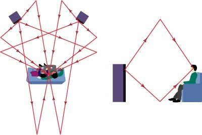

Акустика помещения, советы и тонкости настройки, статья. Портал "www.hifinews.ru"

**Акустические свойства помещения вносят определенный вклад в качество воспринимаемой слушателем звуковой панорамы. Не у всех есть специальные помещения, предназначенные исключительно для установки в них аудио оборудования высокого класса. Но и для тех, кто слушает музыку в обычной жилой комнате, есть много советов и замечаний, следуя которым вы сможете оптимизировать звучание имеющейся аудиотехники.**

* * *

Сохранить и прочитать потом —         

* * *

Акустические свойства помещения вносят определенный вклад в качество воспринимаемой слушателем звуковой панорамы. Не у всех есть специальные помещения, предназначенные исключительно для установки в них аудио оборудования высокого класса. Но и для тех, кто слушает музыку в обычной жилой комнате, есть много советов и замечаний, следуя которым вы сможете оптимизировать звучание имеющейся аудиотехники. Но об этом поговорим чуть позже. А сначала давайте обозначим исходные данные для решения нашей задачи. Специально возводимые, акустически оптимизированные залы имеют, как правило, форму неправильного параллелепипеда, с непараллельными друг другу боковыми стенками, а потолки, как в театрах и концертных залах, выполнены в форме ската. Стандартная комната имеет классическую прямоугольную форму, способствующую наложению друг на друга излучаемых и отражаемых волн звука. В зависимости от используемых в строительстве и отделке материалов акустические свойства одинаковых по объему и форме помещений могут сильно отличаться. Если в вашей среде прослушивания используются твердые бетонные конструкции стен и перекрытий, они будут способствовать отражению излучаемого звука. Гипсокартонные панели или деревянная обшивка будут поглощать большую часть звуковой энергии. Учитывая это и используя следующие советы, вы сможете улучшить качество звука.

Прежде чем приступить к делу, настоятельно рекомендуется проштудировать какой-либо толковый справочник по акустике. Возможно, для новичков будет довольно трудно разобраться в теории распространения звуковых волн. Но усвоенные знания окупятся сторицей и помогут вам более грамотно оборудовать помещение, получить из вашей комнаты оптимальное звуковое пространство для прослушивания, при этом лучше понять особенности распределения звукового поля. Итак, если вы не дипломированный специалист по акустике, поищите хорошую книгу, доступную для вашего уровня понимания, чтобы расширить свои познания, получив для осмысления много полезной, увлекательной информации.

Одна из самых больших проблем, которую я вижу по общению со своими друзьями и знакомыми – излишнее внимание именно акустике помещения. Конечно, акустика помещения важна, но она должны быть последним звеном, которому вы должны уделить внимание уже после расстановки ваших аудиосистем и выбора оптимального места для прослушивания. Правильное размещение громкоговорителей в пространстве помещения даст гораздо больший эффект, чем устранение акустических дефектов помещения. Уделите необходимое время расстановке аудиоколонок и найдите идеальное местечко для прослушивания. После того как вы сделали все возможное для того, чтобы музыка звучала "правильно", считайте что выполнили 90% работы и теперь пришло время для создания благоприятных акустических условий. Считайте, что акустическая подготовка помещения – это как глазурь на торте. Опять же, в наших условиях это будет самая простая коррекция акустики помещения. Тем, кто заинтересован в более глубоком понимании влияния особенностей помещения на звук, следует обратиться к серьезным источникам по акустической тематике.

По акустическим свойствам все помещения можно разделить на три основных типа: звонкое; глухое и нейтральное помещения. Как правило, нам желательно иметь комнату с нейтральными акустическими характеристиками, которая тяготеет немного к звонкому типу. Звонкая комната отличается длительным временем реверберации. Реверберация — это процесс затухания интенсивности звука при его многократных отражениях. Каждый из нас когда-нибудь оказывался в звонком помещении. Представьте себе большую столовую или зал, где гуляет эхо, а звуки кажутся звенящими. Из такого зала акустическая энергия никуда не уходит, а отражаясь от стен и потолка попадает в точку прослушивания, где часть ее улавливают наши уши. Если у вас комната с отделкой из дерева лиственных пород, с плиточными полами, практически без мягких материалов в отделке, вы понимаете, что такое звонкая (гулкая) комната. Станьте посередине комнаты, хлопайте в ладоши и слушайте. Звук хлопка превращается в эхо и длится некоторое время после хлопка. Это реверберация и эффект затухания акустической энергии. В такой комнате потребуются отделочные материалы для поглощения отражений на средних и высоких частотах с целью укрощения излишней акустической энергии.

Глухая комната полная противоположность звонкому помещению. Звуки, как правило, будут глушиться и если выполнить тот же самый тест с хлопаньем в ладоши, вы заметите, что звук затихает даже прежде, чем вы перестали хлопать. Глухие помещения, как правило, застелены коврами, завешены тяжелыми драпировками и практически не имеют отражающих поверхностей. Комната для прослушивания музыки не должна быть ни глухой, ни звонкой. Нам нужно что-то среднее, в целом нейтральное по акустическим параметрам помещение, и которое при этом все-таки ближе к звонкому типу.

Причина, по которой мы хотим иметь нейтральное акустическое помещение, заключается в том, что реальный мир представляет собой комбинацию поглощающих и резонансных, в акустическом отношении, поверхностей. Нужно добиться такой акустики в помещении, чтобы звук чрезмерно не поглощался элементами интерьера и в тоже время не отбрасывался нам полностью.

Если у вас слишком глухая комната, для того чтобы добиться более естественного звучания поищите возможности для замены на другую отделку части тканевых драпировок или ковровых покрытий, которые поглощают акустическую энергию. Если же помещение слишком звонкое, то, как правило, гораздо легче определить точки отражения для подавления эффекта реверберации.

Будем считать, что у вас стандартная по размерам комната в квартире или отдельном доме. Если есть возможность использовать ее специально под домашний театр, можете обратиться к специалистам по акустической отделке помещений, чтобы они помогли наилучшим образом откорректировать ее акустические характеристики.

**Определение точек отражения**

К счастью, коррекция акустических свойств помещения в области средних и высоких частот довольно проста и обойдется относительно недорого. В зависимости от ее размеров, за $200 - $500, вы сможете и сами откорректировать акустические характеристики вашей комнаты. Для начала придется определить точки отражения, прежде чем покупать отделочные материалы для обработки таких зон.

Все, что вам понадобится – это небольшое зеркало (по крайней мере, 30 х 30 см), помощь друга или родственника, а также самоклеющаяся лента, или карандаш (если вы не возражаете против маркировки стен). Опять же, делать это нужно только уже после оптимальной и окончательной расстановки аудиоколонок.

Попросите вашего помощника, удерживая зеркало на уровне ваших ушей, перемещать его по плоскости стены, пока вы сидите в точке прослушивания. На боковых стенах комнаты слева и справа от вас будут расположены первичные и вторичные точки отражения относительно вашей позиции, по две с каждой стороны. Вы должны сидеть и контролировать перемещаемое помощником зеркало вдоль левой стены, пока не увидите в зеркале ВЧ динамик (твитер) аудиоколонки левого канала. Это будет первая точка отражения. Попросите помощника отметить это место на стене карандашом или маркировочной лентой. Теперь зеркало должно скользить дальше вдоль левой стены, пока не увидите твитер аудиоколонки правого канала, также отмечаете и это место. Аналогично, cделайте то же самое и для правой стены. Теперь у вас есть по две точки отражения на правой и левой стенах комнаты.

Такие же точки отражения находятся на потолке и полу. Сегодня у многих людей жесткие отражающие полы застелены ковровым покрытием или отдельным ковриком. В этом случае точками отражения на полу можно вообще пренебречь. Если же у вас жесткий пол без ковра, для борьбы с отражениями от пола можно разместить коврик перед аудиоколонками. Не у всех в комнате подвесные или натяжные потолки. Кто-то может быть вообще предпочитает классическое помещение с каменным потолком. В этом случае нужно будет отметить два места для акустической обработки сверху. Попросите вашего помощника, стоя на стремянке или стуле, (пожалуйста, обязательно предусмотрите все меры безопасности!) удерживая зеркало перемещать его вдоль плоскости потолка, до тех пор, пока не увидите в нем твитер левого канала, отметьте это место, и cделайте то же самое для правого канала. Вам не стоит пока беспокоиться относительно задней или передней стенки помещения.

Теперь у вас есть отмеченные точки отражения, которые легко обработать звукопоглощающим (для средних и высоких частот) материалом. Помните, акустические панели не поглощают частоты ниже 300 Гц (обычно, хотя, есть и исключения), так что точки отражения позволяют контролировать чистоту, звонкость и реверберацию.

Применяйте напыляемое акустическое покрытие экономно, тем более, что и стоит оно достаточно дорого. Понемногу добавляйте слой за слоем, пока не достигнете желаемого акустического состояния комнаты. Вы же не хотите, переборщить и сделать глухое помещение, которое будет высасывать свежесть и энергию из вашей аудиосистемы. Если же у вас изначально глухое помещение, придется удалять плотные шторы, ковры и другие элементы интерьера, пока вы не добьетесь прозрачного звучания. В качестве звукопоглощающих материалов используют также, как специальные панели, так и разнообразные подручные средства, вплоть до ячеистых упаковок от яиц. Подходящие материалы всегда найдутся, все дело лишь в нарушении эстетики помещения.

**Определение акустических резонансов помещения**

Каждое помещение имеет акустические резонансы или, как еще говорят, комнатные моды (англ. Mode). Пропорции комнаты, т.е. соотношения длины, ширины и высоты, задают расположение резонансов в частотном спектре. Таким образом, геометрические размеры помещения определяют частоты, на которых будут возникать резонансы при прослушивании музыки, т.е. отдельные, имеющие огромное значение для воспроизводимой музыки частоты будут или чрезмерно усиливаться или же подавляться в отдельных точках помещения.

Лучшим способом определения акустических резонансов и стоячих волн (низкие частоты имеют тенденцию распространяться, отражаться и накладываться друг на друга) в помещении считается использование специального программного обеспечения. Профессиональное программное обеспечение довольно дорого, требует установки микрофонов с последующим анализом акустических характеристик помещения. Если у вас есть такая программа для расчета акустических параметров, несомненно, следует ее использовать. Но если вы просто хотите получить общее представление о том, как ваша комната взаимодействует с системой можно использовать и более простые программы, известные также как акустические калькуляторы. В оригинальной статье предлагается использовать http://amroc.andymel.eu.

Один из русскоязычных упрощенных вариантов (Калькулятор аксиальных мод) можно найти на http://www.acoustic.ua/forms/calculator8.html, он обеспечивает упрощенный анализ продольных акустических резонансов (аксиальных мод) в комнате. Акустический калькулятор позволяет по размерам вашего помещения построить графики резонансов при распространении звуковых волн вдоль, поперек и по высоте комнаты. Если несколько резонансов помещения совпадают по частоте (интервал между ними равен нулю), то такие моды (резонансы) называются вырожденными. В этом случае на амплитудно-частотной характеристике, как правило, наблюдается выраженный пик. Проблемные частоты в интерфейсе программы будут выделены красным цветом.

Если два резонанса (моды) разделены интервалом 20 Гц и более, то такие моды называются изолированными. В этом случае на АЧХ помещения, как правило, наблюдается выраженный «провал». Проблемные интервалы будут выделены оранжевым цветом.

Эти пики с провалами на АЧХ и придают нежелательную окраску звучанию вокала и музыки. В особенности они заметны в диапазоне частот 95-175 Гц. Статические звуковые пики возникают в разных точках комнаты, в зависимости от положения акустических систем, размеров помещения и звуковой частоты. Вы можете определить такие пики, перемещаясь по комнате и слушая низкочастотный звук. Как только вы входите в зону стоячей волны, баса становится очень много, а в других местах его почти нет, теряется локализация и четкость баса он превращается в простое «буханье».

На частотах выше 300 Гц уже можно пренебречь влиянием резонансов помещения на тональный баланс. Предполагается, что на основе графика в продольной плоскости и по высоте комнаты можно выбирать оптимальное место, как для размещения акустических излучателей, так и место для слушателя. И, кроме того, основываясь на полученных данных по пикам и провалам, также проводится корректировка акустических характеристик помещения, которая уже гораздо сложнее установки звукопоглощающих покрытий в точках отражения для коррекции остальной части звукового диапазона. В этот комплекс мер могут входить как простейшие мероприятия, типа закрепления подушек в углах комнаты, так и устройство специальных «ловушек для басов» (типа резонатора Гельмгольца) для выравнивания нижней части АЧХ помещения. К сожалению, некоторые из этих методов требуют много места и в небольшой комнате не применимы по причине отсутствия для них пространства. В идеале, вы должны иметь комнату для прослушивания с объемом более 40 кубических метров, тогда будет гораздо легче настроить акустику помещения.

Есть много готовых великолепных решений, многие из которых на самом деле дешевле, чем создание собственных устройств. Но если вы хотите сами заняться акустическим обустройством помещения, досконально разобраться в его особенностях и возможностях, то это тема уже отдельной статьи и не одной.

Материал подготовлен по материалам проекта theabsolutesound.com (перевод с английского - hifiNews.RU)

* * *

_Подготовлено по материалам портала "www.hifinews.ru", октябрь 2014 г._ **www.hifinews.ru**