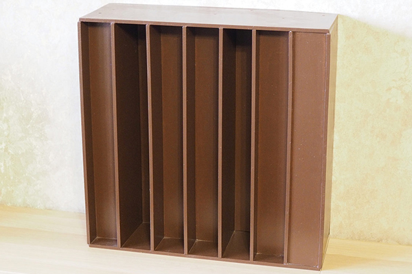
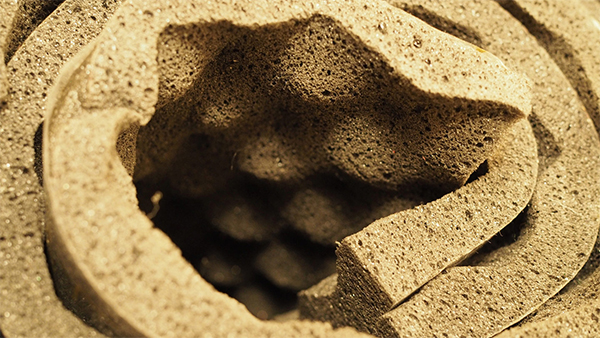
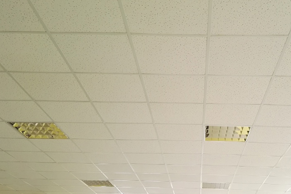

Акустика помещения: меблировка (часть 2)

Сохранить и прочитать потом —         

Есть мебель, созданная для красоты и торжественных мероприятий. Бывает мебель, созданная для удобства и повседневного использования. Но и та и другая может быть мебелью, созданной для звука.

## Ясность в понятиях

В [первой части](https://www.audiomania.ru/content/art-5285.html) мы рассмотрели основные моменты, связанные с акустической _подготовкой_ помещения. В этот раз поговорим об акустической _обработке помещения_.

Под акустической _подготовкой_ помещения мы имели в виду капитальные меры, направленные на строительство помещения, предназначенного под прослушивание музыки или просмотр кинофильмов.

Под акустической _обработкой_ помещения мы будем понимать всевозможные способы улучшения его акустических свойств, не предполагающие кардинальных изменений (тех, которыми мы занимались при акустической подготовке). Разделить доступные к использованию средства в области акустической обработки можно по разным критериям, мы остановимся на делении по частотному диапазону.

## Низкие частоты. Бас-ловушки. Суть в объеме

Наиболее популярным средством борьбы с проблемами в области низких частот являются бас-ловушки. Наиболее частой проблемой — эффект стоячих волн. Вследствие того, что звуковые волны в этой области имеют большие длины, акустическая мебель данного типа достаточно объемна.

Принцип, по которому работают бас-ловушки, построен на поглощении энергии звуковой волны. Однако реализация этого принципа может быть разной. Существуют два основных типа бас-ловушек: резистивные и резонансные.

  
_Схематичное представление работы резистивной ловушки_

Первые, резистивные, представляют из себя толстый слой пористого материала, проходя через который звуковая волна будет терять свою энергию, испытывая сопротивление со стороны среды, в которой она распространяется. Такая потеря энергии максимально эффективно будет происходить там, где скорость волны наибольшая, а это соответствует расстоянию в четверть ее длины относительно отражающей звуковую волну поверхности.

Отдельно обратим внимание на то, что непосредственно у самой поверхности скорость волны будет равна нулю, поэтому при равной толщине установка бас-ловушки у стены даст наименьший эффект. В целом резистивные ловушки имеют большой размер, и их работа ограничена только верхними частотами низкочастотного диапазона, на нижних частотах их применение нерационально.

Давайте вместе посчитаем: для частоты 60 Гц длина волны будет соответствовать 8 м, а это значит, что для корректной работы, рассчитанной на четверть волны, размер установленной у стены ловушки должен быть не меньше двух метров. Таким образом, для частоты 60 Гц в трех плоскостях объем бас-ловушки должен составлять 8 м³.

Для находящихся же в основном в продаже 30-35 см угловых бас-ловушек эффективная работа будет происходить не ниже частоты 250 Гц. Не очень впечатляющий результат, правда? Зато такие ловушки работают в очень широком диапазоне частот, эффективно выравнивая в нем амплитудно-частотную характеристику.

  
_Схематичное представление работы резонансной ловушки_

Вторые, резонансные, представляют из себя систему, состоящую из герметично закрытой конструкции. Одна из ее поверхностей является мембраной, имеющей массу, которую звуковая волна будет раскачивать (мембрана войдет в резонанс с определенной частотой).

Запертый внутри бас-ловушки воздух подвергнется сжатию и растяжению, что вызовет сопротивление для деформации мембраны. Именно на преодоление этого сопротивления звуковая волна потратит свою энергию и вдобавок потеряет ее из-за трения воздуха внутри конструкции.

Преимущество резонансных ловушек в том, что они существенно меньших размеров и могут быть спроектированы на работу на любой конкретной частоте, однако диапазон относительно проектной частоты будет очень невелик. Кроме того, при низкой громкости энергии звуковой волны попросту не хватит на раскачивание мембраны такой ловушки, поэтому тем, кто предпочитает слушать музыку тихо, такой вариант не подойдет.

С другой стороны, на маленькой громкости человек физиологически не воспринимает большую часть низких частот, и эффект стоячих волн просто не наблюдается. В отличие от резистивных, резонансные ловушки необходимо устанавливать как можно ближе к поверхности, поскольку они работают тем эффективнее, чем выше давление в области мембраны.

Все бас-ловушки строятся на одном из этих двух принципов или совмещая их (например, щит Бекеши). Бас-ловушки бывают как стационарными, когда конструкция жестко закреплена, так и мобильными — такие можно передвигать. В общем случае логичнее разместить бас-ловушки у соединения стен, пола или потолка (поверхностей помещения), а эффективнее всего — в ближайших к колонкам углах, тогда устройство заработает по всем трем осям. В качестве одомашненного решения в качестве бас-ловушки может выступать только плотно набитый шкаф с пуховыми подушками и зимними одеялами.

## Средние частоты. Рассеиватели (диффузоры). Суть в форме

Использование диффузоров направлено на улучшение амплитудно-частотной характеристики в условиях имеющегося помещения. Их применение позволяет снизить или восполнить излишнюю силу звука на определенных частотах, что улучшает разборчивость.

Работа любых типов диффузоров направлена на то, чтобы подвергнуть изменениям заложенное природой равенство угла падающего и отраженного луча. Однако реализация этого принципа может отличаться в зависимости от цели.

Разделим условно все диффузоры на симметричные и несимметричные. Так, симметричными диффузорами мы будем называть направленные на создание равномерного звукового поля, в то время как несимметричными являются те, которые направлены на избавление от прямых отражений. Разберемся в этих тонкостях.

  
_Диффузор Шредера — самый популярный рассеиватель_

Начнем с симметричных диффузоров. Самым популярным примером данного типа является диффузор Шредера. Это устройство, состоящее из чередующихся ребер и перпендикулярных им панелей различной глубины, рассчитанных по определенной математической модели (которая описывает соотношение ширины и глубины ячейки).

При падении под одним и тем же углом звуковая волна заходит в созданные ребрами и панелями карманы, но выходит из каждого через разное время и под разным углом, претерпев разное количество отражений. Тем самым диаграмма направленности отраженного звука становится цилиндрической, а энергия отраженного звука уменьшается в зависимости от звукопоглощающих свойств материала и количества отражений.

Однако тут есть очень важный момент — все это работает только тогда, когда звуковая волна (луч) не падает на панели диффузора под прямым углом. В этом случае диффузор окажется абсолютно бесполезным: все, упавшее на него под прямым углом, точно также отразится обратно.

Именно поэтому такие диффузоры размещают на площадках первых отражений, которые звуковая волна достигает под острым или тупым углом — это фронтальная стена между АС и боковые от слушателя поверхности, а также стена за слушателем. Все это делается для достижения такого звукового поля, в котором сила отраженного звука будет снижена, а сильное доминирование тех или иных частот исключено.

Помимо этого, положительным эффектом для прослушивания музыки станет увеличение времени реверберации. Отразившись несколько раз от панели и ребер диффузора, звук вернется к нам позже, чем если бы он отразился просто от ровной поверхности. Закрыв глаза, мы сможем накинуть нашей комнате как минимум пару-тройку квадратных метров, а при большой площади покрытия даже пяток.

  
_Отражение звука от разных типов диффузоров_

Для звука, падающего под прямым углом на поверхность, существуют несимметричные диффузоры, направленные на избавление от прямого отражения. Простейшим примером такого диффузора может служить изогнутый лист фанеры, закрепленный на стене. Отраженный от него звук хаотично разойдется в разные стороны, но точно не вернется туда, откуда пришел.

Если в вашем помещении присутствует эффект порхающего эха, то несимметричные диффузоры, расположенные на стенах ровно напротив громкоговорителей акустических систем, помогут справиться с проблемой. В принципе роль несимметричного диффузора может выполнять любая конструкция, не имеющая внешних поверхностей, находящихся в одной плоскости со стеной, на которую она устанавливается.

Положительным эффектом в борьбе с порхающим эхом несимметричного диффузора по сравнению с поглотителем станет то, что мы незначительным образом повлияем на АЧХ (в пределах звукопоглощающих свойств материала, из которого изготовлен диффузор). Однако нужно понимать: говорить об эффективности можно только тогда, когда устройство может быть создано на основе расчетов (в основном это касается симметричных диффузоров), а расчеты эти в свою очередь подтверждены на практике.

Задумываясь об использовании диффузора, представьте, что будет происходить с падающей на него звуковой волной, чем аргументирована его конструкция и насколько он уместен для ваших целей. Эстетическая составляющая также может сыграть важную роль. В качестве одомашненного решения наиболее удачным вариантом будет использование книжных стеллажей открытого типа, также можно задействовать канцелярский шкаф, полку с дисками и т.д.

## Высокие частоты. Поглотители звука. Суть в материале

Поглотители служат для корректировки звучания за счет уменьшения силы звука и обычно применяются для диапазона высоких частот. Самым популярным материалом среди поглотителей является пористый материал, известный как акустический поролон.

  
_Поролон — самый популярный акустический поглотитель_

Больше других пользуются спросом изделия в форме волн и пирамидок, что (помимо оригинального внешнего вида) обусловлено более высокой эффективностью по причине увеличения рабочей площади поверхности.

Достаточно толстый акустический поролон может превратиться в поглотитель для средних частот, а дальнейшее наращивание толщины сделает из него бас-ловушку резистивного типа (хотя эффективность будет ниже, чем при использовании каменной ваты в качестве наполнителя).

  
_Подвесной каркасный потолок с плитами-поглотителями_

Очень широкое промышленное распространение среди поглотителей звука получили плиты с жесткой волокнистой структурой и/или перфорацией. Например, от таких производителей, как Armstrong и Heradesign.

Если вы работаете в обычном бизнес-центре, гуляя в следующий раз по коридору, посмотрите на потолок. С большой долей вероятности это будет подвесной каркасный потолок с плитами одного из этих производителей. Открытые офисы, конференц-залы, комнаты переговоров — типичные места для применения подобных решений. В жилищных условиях их применяют достаточно редко, выглядят они совсем не по-домашнему. В качестве «одомашненных» средств можно использовать ковры и шторы.

## Электронная коррекция звука

Напоследок нельзя не затронуть тему электронной коррекции акустики помещения, пусть она и не подходит под определение акустическая обработка.

Если наше помещение далеко от идеала, а использование акустической мебели в нем затруднительно — электронная коррекция позволит эффективно решить распространенные проблемы. Даже если у нас акустически подготовленное и обработанное помещение, электронная коррекция не будет лишней, а позволит провести тонкий тюнинг амплитудно-частотной и импульсной характеристик. Правда, последнее утверждение будет справедливо только в том случае, если мы используем цифровые источники совместимых форматов — тогда мы имеем возможность провести коррекцию без потерь.

Помимо универсальных программных и аппаратно-программных средств, существуют также специализированные электронные корректоры, рассчитанные на работу только в низкочастотном диапазоне — электронные бас-ловушки. Как правило, они комплектуются сабвуфером, который используется для воспроизведения проблемных частот музыкальной фонограммы в противофазе. Таким образом, проблемные частоты вместо суммирования друг с другом начинают вычитаться друг из друга, нивелируя негативный эффект стоячих волн, создаваемый помещением.

## Неясность в понимании

Просмотр кино и прослушивание музыки — это две крайности одной и той же сущности, как заметил бы капитан Джек Воробей. Рассуждая о возможности совмещения стерео и кинотеатральной системы, уточняя свои предпочтения в кино и музыке, мы редко задумываемся над тем, что концепции их построения с точки зрения акустики помещения противоречат друг другу (громкость звука, время реверберации и т.д.). Если для кино ковер с высоким ворсом на весь пол и плотные толстые шторы во всю стену — это хорошо, то для музыки не очень.

В целом теме акустической подготовки и акустической обработки помещения уделяется недостаточное внимание, в то время как размен на более несущественные вещи (выбор силовых кабелей, например) может всерьез и надолго занять наше внимание. В связи с этим в качестве завершения статьи я предлагаю к размышлению следующий тезис: _Даже самая технически совершенная звуковоспроизводящая аппаратура не может выйти по качеству звучания за рамки акустических характеристик помещения, в котором она играет._

* * *

_Подготовлено по материалам портала "Stereo & Video", сентябрь 2017 г._ **[www.stereo.ru](http://stereo.ru/to/x7eh-akustika-pomescheniya-meblirovka-chast-2)**