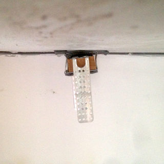
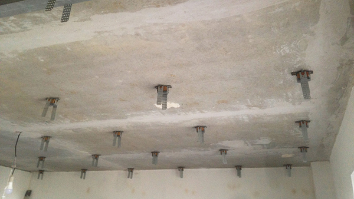
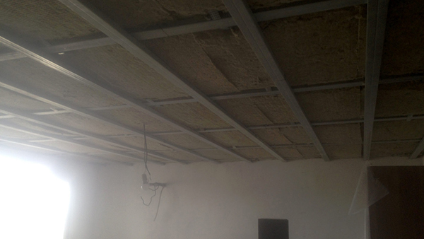
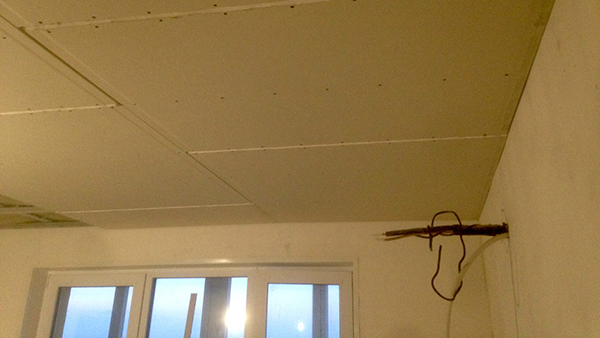
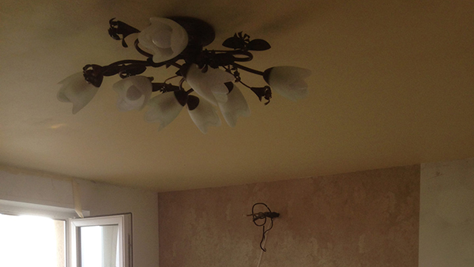
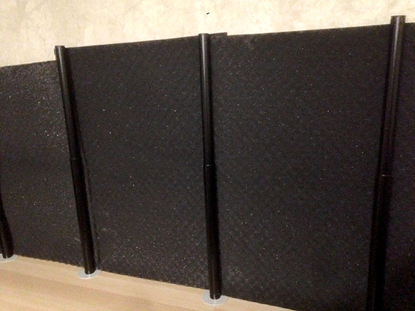
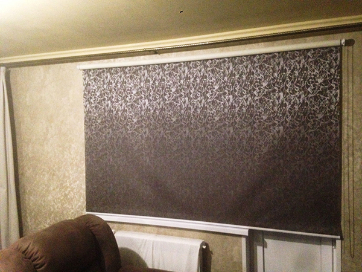

Акустика помещения: фундамент (часть 1)

Сохранить и прочитать потом —         

Отличный звук начинается с таланта композитора и проходит длинный путь перед тем как доставить нам удовольствие от прослушивания.

## Исполнение, запись и воспроизведение звука

Представим условный маршрут, по которому он (звук) движется:

1\. Талант композитора  
2\. Мастерство исполнителя  
3\. Качество инструмента  
4\. Качество звукозаписывающей аппаратуры  
5\. Мастерство звукорежиссера  
6\. Качество носителя  
7\. Качество звуковоспроизводящей аппаратуры  
8\. Акустика помещения  
9\. Опыт слушателя

В этом списке опущены такие пункты, как «профессионализм маркетологов», ведь их влияние на звук отсутствует в аспекте его качественной составляющей. Хотя несомненно услышать то, чего нельзя найти на рынке, не получится. Представленные пункты, объединенные по три, являются по сути этапами исполнения звука (с первого по третий), его записи (с четвертого по шестой) и последующего воспроизведения (с седьмого по девятый).

Если сами мы не являемся теми людьми, которые мастерски исполняют хиты на качественном инструменте, то возможность услышать отличный звук у нас ограничивается посещением концерта или прослушиванием фонограммы. В первом случае из маршрута движения звука можно смело вычеркнуть этап записи, а из оставшихся шести пунктов повлиять мы можем только на первый, второй и девятый — выбирая композитора и исполнителя с учетом вашего опыта. При прослушивании фонограммы в нашей власти дополнительно оказываются пункты с шестого по восьмой. Одному из них и будет посвящена эта статья, а именно — акустике помещения.

Акустика помещения. А почему она вообще важна? Издаваемый звуковоспроизводящей аппаратурой звук доходит до наших ушей только по линии прямой видимости в случае концерта в поле. При прослушивании в условиях помещения у него появляется компания из звука, доходящего до наших ушей после отражений от окружающих поверхностей. Более того, компания эта весьма неспокойная, а потому отраженный от поверхностей звук активно взаимодействует с тем звуком, который старается достичь нас напрямую. В итоге получается, что акустика помещения может внести серьезный вклад в дошедший до наших ушей звук, который будет ощутимо отличаться от записанного на фонограмме. Что же со всем этим делать любителям музыки?

## Звукоизоляция помещения

Наслаждаться музыкой под рев взлетающего истребителя или постоянные перестукивания по шпалам проезжающего мимо товарного состава, скорее всего, у нас не получится. Существуют различные санитарные нормы, которые хоть как-то ограждают нас от самых неприятных источников шума, но даже шум автомобильной дороги около дома может запросто мешать спать, не говоря уже о вдумчивом прослушивании музыки. Опять же нельзя забывать про соседей. Звукоизоляция является одной из фундаментальных и не имеющих замены мер по созданию хорошей акустики помещения. Наиболее рациональные варианты благоустройства по этому вопросу в зависимости от возможностей по строительству и проведению ремонта выглядят следующим образом:

1\. Если мы занимаемся индивидуальным жилищным строительством или живем в частном доме со свободным участком земли — мы можем построить комнату для прослушивания подальше от источников шума, снабдив ее дополнительно более толстыми стенами. Часто можно видеть, как подобную практику используют при строительстве домашних кинотеатров. Правда, цель в таких случаях преследуют зачастую противоположную — оградить жилое пространство от громко звучащих киноэффектов. В случае переезда при возможности нужно выбирать расположение жилья, которое не находится в непосредственной близости с транспортными развязками и промышленными объектами.

2\. Если уместен капитальный ремонт помещения, то лучшим способом звукоизоляции станет постройка так называемой «комнаты в комнате» или «коробки в коробке». Как видно из названия, суть заключается в том, что внутри помещения с небольшим выносом от всех поверхностей строится еще одно помещение со своими стенами, полом, потолком, дверными и оконными проемами. Дополнительным преимуществом данного решения является отсутствие жестких связей между «комнатой внутри» и «комнатой снаружи» при условии устройства плавающего пола — это позволяет избавиться не только от воздушного, но и ударного шума.

3\. Если уместен капитальный ремонт помещения, но на совсем радикальные меры мы не готовы, то можно провести адресную звукоизоляцию. Например, изолировать потолок от шума соседей сверху и стену от шума коридора на лестничной площадке. Для этого необходимо произвести облицовку поверхностей по одной из [типовых звукоизоляционных конструкций](https://www.knauf.ru/solutions/special-solutions/solution-acoustics/#showtab-tab3271446_2). Классическим решением у всех производителей является «бутерброд» из двух листов гипсокартонной плиты на металлическом каркасе со слоем каменной ваты и воздушным зазором до стены.

_Устройство звукоизоляционного потолка — установлены виброизолирующие подвесы_

_Устройство звукоизоляционного потолка — установлены металлический профиль и каменная вата_

_Устройство звукоизоляционного потолка — произведена обшивка гипсокартонными плитами_

_Устройство звукоизоляционного потолка — произведены шпатлевка и покраска_

4\. Если ни о каких капитальных мерах речи не идет, то мы можем попробовать провести борьбу с последствиями. Поставить самую большую и тяжелую мебель у той стены, со стороны которой находится наиболее сильный источник шума. Значение здесь будут иметь совокупность массы и размера такой мебели. Других способов избавиться от шума, увы, нет.

Также имеет смысл максимально отдалять от помещения для прослушивания собственные источники шума, например, внешний блок кондиционера или стиральную машинку. И не нужно верить производителям волшебных обоев, снижающих уровень воздушного шума в помещении на 60 дБ: с текущим уровнем научно-технического прогресса это невозможно. Но стоит обращать внимание на сертификаты испытаний и описанную в них методику, как правило, выдаваемые значения по снижению справедливы для огромной конструкции, уже поверх которой наклеены волшебные обои. Производители лукавят, не упоминая о ней в рекламных проспектах. Единственным существующим волшебством в звукоизоляции является полная герметизация стыков смежных помещений. Если между ними есть хотя бы несколько сквозных дыр и гуляет ветер, как сквозь замочную скважину, звукоизоляция заметно снижается. То же самое касается дверей без уплотнителей по периметру.

## Пропорции, форма и размер помещения

Мы периодически слышим про комнатные моды. Что это такое? Это собственные акустические резонансы помещения. Рассмотрим поведение звуковой волны в типичном помещении в форме прямоугольного параллелепипеда. Извлеченная нашими громкоговорителями, она доходит до противоположной стены, отражается от нее и возвращается обратно. Потом она снова отражается уже от стены за громкоговорителями и проделывает весь этот путь снова и снова (до тех пор, пока полностью не потеряет энергию). В зависимости от расстояния между этими двумя параллельными стенами, всегда найдется такая частота, которая на втором круге своей гонки совпадет по фазе с вновь извлеченной звуковой волной и усилит ее. На слух это явление будет восприниматься как подъем громкости на определенной частоте (может быть также справедливо для всех кратных ей более высоких частот).

При многократном суммировании звуковой волны подобным образом мы можем наблюдать на высоких и средних частотах эффект порхающего эха, а на низких — эффект стоячей волны. Стоит отметить, что кратные размеры помещения, худшими из возможных пропорций которых будут кубические, усугубляют эту ситуацию, ведь одни и те же частоты начнут усиливать друг друга в нескольких плоскостях. Именно поэтому одной из важных акустических задач является расчет таких форм, пропорций и размеров помещения, при которых влияние комнатных мод было бы минимальным. Вот что можно здесь предпринять в зависимости от наших возможностей:

1\. Если мы занимаемся индивидуальным жилищным строительством и хотим с комфортом слушать музыку, то нам нужно еще на стадии проекта заложить такое помещение, которое соответствовало бы рекомендациям в этой области. Наиболее известные благополучные соотношения размеров помещений в форме прямоугольного параллелепипеда можно найти в специализированной литературе или сети интернет. Если у нас не типичный случай, то лучше обратиться к профессионалам.

2\. Если у нас есть только возможность выбора помещения в уже имеющемся жилье, то нужно стараться выбрать такое, соотношения которого в трех измерениях не будут один к двум или два к трем. Неправильная форма комнаты зачастую является преимуществом в борьбе с комнатными модами.

3\. Если мы имеем то, что имеем, но нас преследуют проблемы резонансов помещения, и мы очень хотим улучшить его акустику — при возможности однозначно стоит рассмотреть пусть небольшой, но все-таки капитальный ремонт. Постройка искусственной стены вдоль имеющейся, или скос нескольких углов помещения даст гарантированно положительный эффект, хотя и отнимет один или несколько метров площади жилья.

4\. Если ни о каких черновых работах и речи идти не может, нам придется бороться с последствиями. Решить проблемы в области высоких и средних частот можно относительно просто (использовав акустический поролон или несимметричные диффузоры). В случае проблем с низкими частотами остается только прибегнуть к использованию басовых ловушек. Эти конструкции занимают много места и их размещение в жилом помещении, не предназначенном специально для просушивания музыки, затруднительно. Однако других способов справиться с проблемами в низкочастотном диапазоне пассивными средствами нет. Впрочем, можно прибегнуть и к такому экстравагантному способу, как активная басовая ловушка.

_Акустический поролон отлично решает проблемы с эффектом порхающего эха_

## Материалы и формы поверхностей помещения

Последняя фундаментальная составляющая акустики помещения — это материалы и формы поверхностей. Они значительным образом влияют на соотношение поглощения и отражения звука на разных частотах, поэтому фонограмма, воспроизведенная в панельной квартире и подвале кирпичного дома, прозвучит по-разному. Что здесь можно сделать:

1\. При возможности нам нужно выбирать помещение со стенами из тяжелого однородного материала. При этом любые неравномерности в поверхностях в виде окон и дверей лучше избегать. При большом количестве окон или стеклянных стен низких частот в помещении может не оказаться совсем. Пока не будет открыт секрет телепортации, лучшим способом проникнуть в такое помещение станет тяжелая звукоизоляционная межкомнатная дверь (стандартные щитовые с сотовым заполнением не подойдут), установленная в коробку с порогом и имеющая уплотнитель по всему периметру проема.

2\. Если выбора нам не дано, а окна в помещении есть, в качестве борьбы с последствиями мы можем использовать занавес, как это делают в комнатах прослушивания салонов, торгующих аудио и видео аппаратурой. Во всем остальном, касающемся вопросов материала и формы, нам на помощь придет различного вида житейская и акустическая меблировка. Она поможет привести амплитудно-частотную характеристику помещения к достойным показателям, а это — одно из ключевых требований к достоверному воспроизведению музыкальной фонограммы.

_Рулонные шторы не панацея в борьбе с окнами, но это лучше, чем совсем ничего_

_**Продолжение следует**_

* * *

_Подготовлено по материалам портала "Stereo & Video", август 2017 г._ **[www.stereo.ru](http://stereo.ru/to/ua7ky-akustika-pomescheniya-fundament-chast-1)**