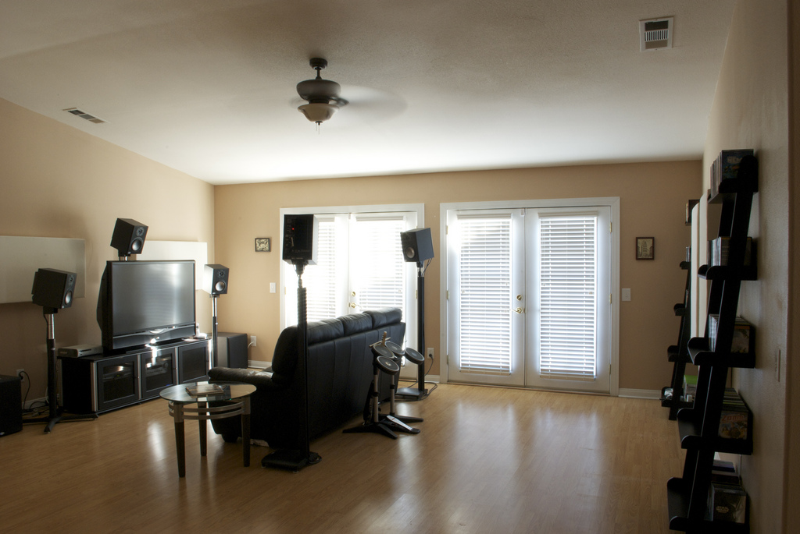
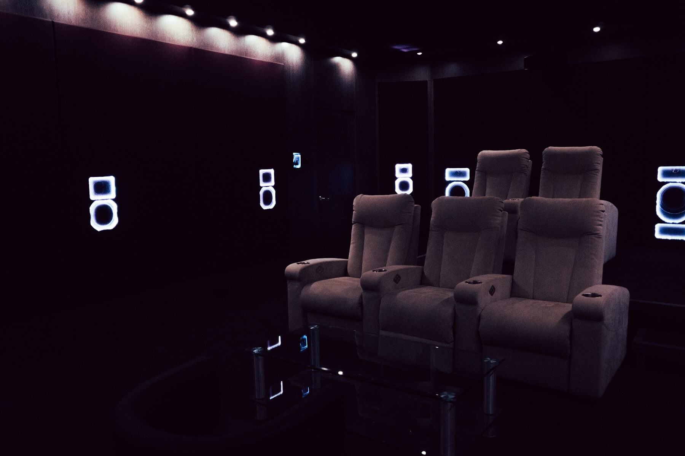
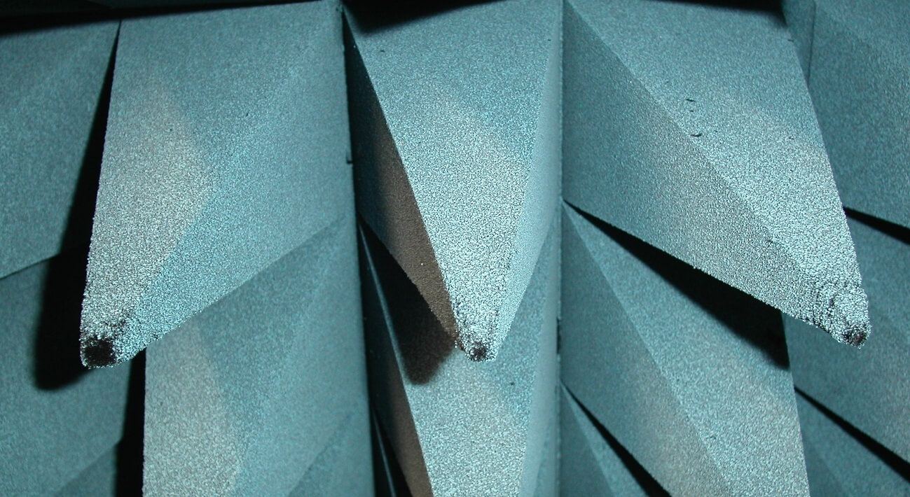

Смотрим фильмы дома: 10 материалов о строительстве домашнего кинотеатра и выборе оборудования / Блог компании Аудиомания

Это — подборка статей из нашего блога «[Мир Hi-Fi](https://www.audiomania.ru/mirhifi/)». Здесь есть материалы, которые помогут вам собрать достойный домашний кинотеатр и подготовить для него помещение. Под катом — обзор 3D-телевизоров, советы по акустической коррекции и правила расстановки колонок.

_Фото: [PascalSijen](https://www.flickr.com/photos/pascalsijen/3518284515/) / [CC BY](https://creativecommons.org/licenses/by/2.0/)_

## Как выбрать аппаратуру для домашнего кинотеатра

  

*   [Строим домашний кинотеатр: выбор акустики, ее установка и настройка](https://www.audiomania.ru/content/art-4641.html). Даём практические рекомендации по выбору колонок для кино. Также в материале описаны распространенные ошибки, совершаемые при расстановке аппаратуры — размещение боковых колонок близко к зрителю, установка динамиков параллельно стенам комнаты и чрезмерное расширение зоны просмотра. Расскажем, как их избежать, и приведем схему, которой можно следовать, расставляя акустику.

  

*   [HDMI 2.1 на подходе: что нужно знать](https://www.audiomania.ru/content/art-5564.html). Отвечаем на основные вопросы про HDMI 2.1: зачем нужен новый стандарт, чем он отличается от предшественников и потребуется ли обновить HDMI-кабель, купив телевизор с поддержкой технологии. Среди достоинств новинки — способность передавать 4K-сигнал на скорости до 120 Гц и поддержка мониторов с динамической частотой обновления.

  

*   [Что купить: ЖК-телевизор или OLED-телевизор? Подробное сравнение](https://www.audiomania.ru/content/art-4822.html). Статья-ликбез про основные различия технологий ЖК и OLED. Сравниваем все важные характеристики: от качества изображения и стоимости до хрупкости и уровня создаваемого шума. Новое в материале смогут найти как заядлые любители техники, так и менее опытные пользователи, выбирающие новый телевизор для дома.

  

*   [Руководство по выбору 3D-телевизора](https://www.audiomania.ru/content/art-3981.html). Пошаговая инструкция по выбору 3D-телевизора. Вы узнаете, на каких характеристиках можно сэкономить, а за какие стоит доплатить. Специальная таблица поможет рассчитать оптимальный размер и разрешение телевизора. И, наконец, рассмотрим плюсы и минусы покупки такой техники в интернет-магазинах. В качестве введения — краткий обзор 3D-технологий: от привычных цветных очков до разработок в области безочковых экранов.

  

## Как оформить помещение

  

*   [Инсталляция потолочных колонок для окружающих форматов своими руками](https://www.audiomania.ru/content/art-6340.html). Иллюстрированное руководство по установке потолочных колонок Dolby Atmos. В статье описан весь процесс: от этапа планирования до финальной настройки оборудования. Вы научитесь находить потолочные балки с помощью магнитов, правильно расставлять акустику, а также подбирать и протягивать кабели. Хотя оригинальная статья была написана для американского читателя, обустраивающего частный дом, она будет полезной и тем, кто проживает в квартире. Правда, в этом случае в помещении должен иметься подвесной потолок из гипсокартона.

  
_Фото: [большой кинозал в шоуруме «Аудиомании»](https://www.audiomania.ru/content/art-6034.html)_

*   [Акустика помещения: фундамент](https://www.audiomania.ru/content/art-5285.html). Первая из двух статей по подготовке комнаты для размещения аудиосистемы. Рассмотрим установку изоляционного потолка, дополнительных стен и дверей, а также «скос» углов комнаты. Есть в статье и информация для тех, кто не готов на такие решительные действия. Речь идет о герметизации смежных комнат и коррекции звука с помощью акустического поролона. В конце разберем принципы расстановки мебели, которые помогут уменьшить количество постороннего шума.

  

*   [Акустика помещения: меблировка](https://www.audiomania.ru/content/art-5356.html). Вторая часть серии подробнее рассказывает, как улучшить акустику комнаты без капитального ремонта. Рассмотрим разные типы рассеивателей и поглотителей звука. Есть рекомендации и для тех, кто хочет улучшить акустику комнаты подручными средствами.

  

*   [Советы от THX: как получить от домашнего кинотеатра всё](https://www.audiomania.ru/content/art-5167.html). Рекомендации по установке и настройке домашнего кинотеатра от технического директора THX Скотта Фрэнсиса (Scott Francis). Он рассказал, как выбрать место под колонки, какие ошибки легко допустить при размещении акустической системы и как настроить экран, принимая во внимание освещение. В качестве иллюстраций приводятся разные схемы расстановки колонок: в форматах 5.1, 7.1, Dolby True HD и DTS HD Master Audio.

  

*   [Акустика помещения, советы и тонкости настройки](https://www.audiomania.ru/content/art-3992.html). Лекарство от акустического перфекционизма. Автор утверждает, что правильная расстановка колонок часто важнее акустических характеристик самого помещения. И чтобы добиться достойного звучания, достаточно «обработать» лишь самые проблемные зоны. В статье вы узнаете, как эти зоны определить и что с ними делать.

  
_Фото: [Bryan Tong Minh](https://commons.wikimedia.org/wiki/File:Anechoic_chamber_wall.JPG) / [CC BY-SA](https://creativecommons.org/licenses/by-sa/3.0)_

*   [Строим домашний кинотеатр: акустическая обработка помещения](https://www.audiomania.ru/content/art-4640.html). Выбираем комнату для домашнего кинотеатра. Автор рассматривает особенности и недостатки разных домашних пространств: от акустически подходящего, но неприглядного подвала, до гостиной. Внимание уделяется акустике комнаты и менее очевидным факторам, например накоплению тепла от техники.

  

* * *

_О чем мы пишем в Telegram-канале:_

 _ [Ученые научились передавать узконаправленные звуковые сообщения с помощью лазеров](https://t.me/audiomaniaRU/695)  
 [Наука утверждает, что посещение концертов укрепляет здоровье](https://t.me/audiomaniaRU/694)  
​ [Лейбл KPM оцифровал весь свой каталог](https://t.me/audiomaniaRU/691)_

* * *