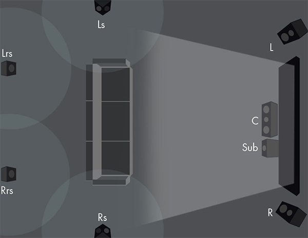
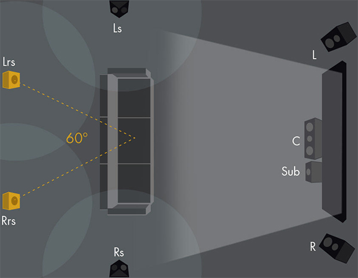
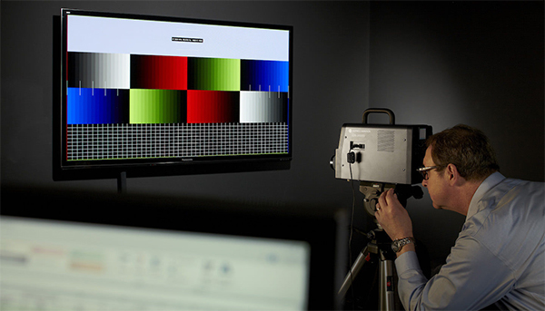
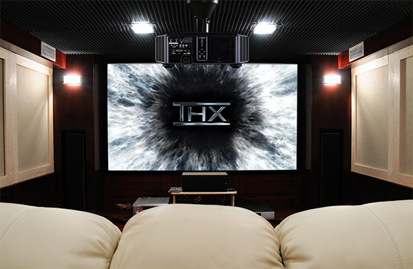

Советы от THX: как получить от домашнего кинотеатра всё

Сохранить и прочитать потом —         

Сертификация THX была создана для того, чтобы кинотеатры соответствовали определенным стандартам. С тех пор сфера влияния компании расширилась, в нее вошли как домашние кинотеатры, так и отдельные AV-продукты. И поэтому я спросил технического директора THX Скотта Фрэнсиса (Scott Francis), может ли он дать какие-нибудь советы относительно того, как оптимизировать и расположить экран, акустику и кресла так, чтобы получить от домашней системы максимум. Причем в самых разных ситуациях — при индивидуальном просмотре, семейном, или же при просмотре большой компанией как фильмов, так и ТВ-шоу и спортивных программ.

Он начал с прописной истины: «Вообще, идеальный сетап — тот, который вам больше всего нравится и вызывает у вас и ваших гостей больше всего радостных эмоций. Не нужно бояться что-то менять на свой вкус или же ради комфорта гостей только лишь потому, что имеющаяся система считается “технически правильной”».

## Каково идеальное расположение экрана?

В идеале экран должен быть расположен прямо напротив, с центром практически на уровне глаз с основной позиции просмотра. Отклонение от горизонтальной или вертикальной оси на 10-30 градусов на качество не сильно влияет, да и у современных экранов углы обзора широкие, рассчитанные на просмотр большой компанией. Обычно условия диктует комната, и поэтому нужно думать над посадочными местами, выбирая саму мебель и ее расположение так, чтобы исключить боль в шее и прочий дискомфорт в течение длительного просмотра.

Очень часто такую проблему создают экраны, которые вешают над каминами — они в итоге расположены слишком высоко для большинства моделей диванов, из-за чего приходится задирать голову вверх. Однако если чаще всего вы смотрите на экран, развалившись на диване, такое решение может оказаться удобным. В этой ситуации можно даже добавить второй ряд из высоких стульев, расположенных за основным диваном возле бара или стола, что вполне часто встречается в совмещенных кухнях/гостиных.

Если же вы используете проектор, а не телевизор, то угол обзора может быть более неудобным. Найдите такое место, в котором вам не придется задирать голову.

## Каково идеальное расположение колонок?

Когда место для экрана известно, можно устанавливать акустику: ее следует поставить примерно симметрично относительно точки фокуса — центра экрана. Большинство комнат нельзя назвать симметричными — у них могут быть три стены, смещенные центральные линии, ступеньки и иные архитектурные излишества. Некоторые из этих необычностей не так сильно мешают в организации пространства для просмотра и прослушивания, но если вы не можете расположить левый, правый и центральный каналы в плоскости под правильным углом с одинаковым расстоянием до правой и левой колонки от точки прослушивания, значит, что-то не так. Возможно, следует поменять расположение экрана.

Центральный канал следует установить максимально близко к экрану — в среднем непосредственно над или под ним, хотя в проекторных инсталляциях можно и за полотном акустически прозрачного экрана. Для спортивных трансляций это не так уж и важно, но в художественных фильмах большая часть диалогов исходит именно отсюда, так что близко расположенный к экрану центральный канал добавит картине реалистичности.

  
_Схема расстановки колонок в 5.1-канальной системе_

Левый и правый канал должны находиться на одинаковом расстоянии от центрального и от точки просмотра. Небольшое отклонение от линии в 10-20% можно скомпенсировать с помощью ресивера, но сильное отклонение сломает построение сцены, и вместо контента вы будете слышать колонки. Для спортивных трансляций широкая расстановка каналов — интересное решение, но в художественных фильмах колонки, расположенные в углах тупого треугольника (где угол отклонения оси, по которой распространяется звук от колонок, от центральной оси выше 30 градусов) могут звучать не так хорошо.

Я видел, как многие люди монтируют левый и правый канал сразу же рядом с дисплеем. Мне такой вариант не нравится, кажется, что он уменьшает сцену. Для большинства контента расширение сцены за пределами экрана — выигрышный вариант.

Однако если вы используете комнату для стерео, то от небольшого расстояния между правым и левым каналом можно выиграть. Конкретнее: если правый и левый каналы расположены в пределах 15 градусов относительно линии взгляда, прямой звук будет доминировать над отраженным. С увеличением угла будут увеличиваться отражения, а от этого возрастут и помехи.

  
_Схема расстановки колонок в 7.1-канальной системе_

Акустика объемного звучания и верхние каналы должны быть расположены симметрично относительно места прослушивания, и их, что самое важное, должно быть слышно! Я часто вижу, как люди просто лепят их куда попало или вовсе вешают на потолок, направляя вниз. Рассмотрите вариант с более компактными колонками объемного звучания, которые вы сможете расположить примерно на уровне уха без каких-либо препятствий для звука. Симметрия в рамках длины пути — один из самых важных параметров.

В системе 5.1 акустику объемного звучания нужно расположить слегка позади, иначе сцена может схлопнуться. С другой стороны, если она слишком далеко, может потеряться тот самый объемный, погружающий эффект. Экспериментируйте с расположением акустики, учитывая возможности комнаты, и решите, в каком варианте она лучше всего отыгрывает нравящийся вам контент.

Для спортивных передач мне нравится такая система: фронтальные и задние каналы расположены практически в углах четырехугольника, а слушатель при этом находится в центре задней половины этого четырехугольника, ближе к задним каналам. Для моих ушей такая расстановка создает серьезный эффект стадиона.

  
_Схема расстановки системы формата Dolby True HD или DTS HD Master Audio (сурраунд-колонки следует поставить так, чтобы получился 60° угол от позиции слушателя)_

Сабвуферы очень просто расположить примерно, и почти невозможно разместить точно. Вы наверняка слышали, что бас распространяется во всех направлениях и поэтому расстановка сабвуфера не особо важна. Это в некоторой степени верно, но установка сабвуфера слишком далеко от центра или в каких-нибудь необычных местах может привести к интересным эффектам в звучании и задержке для определенных мест для прослушивания. Использование двух сабвуферов может эту проблему во многом решить, равно как и перемещение единственного сабвуфера по помещению. В конце концов, и настройки задержки могут помочь. В соответствии с акустикой конкретной комнаты, расположение на разном расстоянии от стен или углов тоже может достаточно сильно повлиять. Экспериментируйте с местом установки и контентом.

_На сайте THX сказано: «Если у вас есть четыре сабвуфера, поставьте по одному по центру каждой стены. Если у вас два сабвуфера, поставьте их по одному по центру двух стен друг напротив друга. Если у вас один сабвуфер, поставьте его по центру фронтальной стены»._

## Каково идеальное расположение кресел относительно экрана и акустики?

Там, где вы видите и слышите хорошо! Подумайте обо всех отражающих и поглощающих поверхностях в комнате и о том пути, который должна пройти звуковая волна, стремясь добраться до ваших ушей. За вами есть твердая стена? Может быть, картина или ковер помогут справиться с отражениями от этой стены. Вы с кресла должны без проблем видеть весь экран и все колонки.

Затем подумайте о «сквозных линиях», проходящих от динамиков сквозь вашу голову. Что находится за вашей головой? Стена? Покрыта ли она отражающим или поглощающим материалом? Каков угол отражения? Может ли звук как-то странно от нее отразиться и создать в комнате гул или грязь? В этом может помочь подстройка угла атаки, расположения или способа крепления колонки, но можно и со стеной что-нибудь сделать.

## Каковы лучшие настройки для дневного просмотра с засветкой — например, во время просмотра спортивной трансляции большой компанией?

Большинство современных телевизоров очень яркие и могут работать практически в любых условиях, однако не стоит забывать о ярком свете из окон и дверей. Бывает очень сложно скомпенсировать прямой поток света, исходящий от окна непосредственно в экран, так что таких ситуаций стоит избегать.

Спортивные трансляции традиционно проходят с более высокой цветовой температурой и более острыми гамма-кривыми, чем художественные фильмы. Температура между 5000 и 6500K, скорее всего, пойдет для баскетбола: соревнования по нему проходят в помещении, и такая температура соответствует подсветке баскетбольной площадки. Выше 6800K я бы не рекомендовал — будет слишком холодный цвет.

Если у вас на просмотр соберется толпа, то наверняка в комнате будет включено дополнительное освещение, так что не забывайте и об общей яркости. Ради нее можно пожертвовать уровнем черного, подняв уровень яркости выше среднего — с художественными фильмами вы такого, скорее всего, не сделаете.

## Каковы лучшие настройки телевизора для просмотра динамичного контента, вроде спорта?

Скорее всего у вашего телевизора есть режим «спорт», и я бы начал с него. Настройки такого режима очень сильно разнятся от модели к модели. Например, проработка краев на некоторых устройствах работает хорошо, а на других ей нужно несколько кадров для того, чтобы войти в строй. Для художественных фильмов это нормально, но в спортивных трансляциях бесит.

Многие телевизоры могут создавать промежуточные кадры, используя «предсказывающие» алгоритмы: чаще всего такой процесс называют интерполяцией кадров. Если ваша модель умеет создавать такие кадры хорошо, то выглядеть трансляция будет менее «кристаллически» и грубо. Однако может получиться и эффект «мыльной оперы». Некоторые телевизоры симулируют эффект затухания люминофора в этих промежуточных кадрах, знакомый по ЭЛТ-телевизорам и плазмам, и он выглядит симпатично.

## Каковы лучшие настройки звука для просмотра спортивных трансляций?

Выкручивайте на полную! Если вы построили сетап в соответствии с моими советами, то трансляция должна быть хорошей. Большинство процессоров и ресиверов оснащены различными эффектами, среди которых встречается и «стадион», и в хороших системах в таких эффектах нет необходимости, но на импровизированном коллективном просмотре они могут и улучшить звучание.

В частности, баскетбол изобилует четкими перкусионными верхами, широко расположенными в пространстве. Некоторым все эти скрипы кроссовок и мячей о глянцевый пол кажутся слишком противными, и для таких слушателей нужно немножко смягчить верха.

## Есть ли у вас еще советы по просмотру спортивных трансляций, а не художественных фильмов или ТВ-шоу?

Чипсы и другую хрустящую еду нужно жевать строго во время тайм-аутов. В моем доме для этих целей служат креветки в маринаде из текилы и лайма, приготовленные на гриле. Не кидайте ничего в экран, если результат игры вас не устраивает, и наслаждайтесь проведенным временем!

* * *

_Подготовлено по материалам журнала "Stereo & Video", июнь 2017._ **[www.stereo.ru](http://stereo.ru/to/zyy7i-sovety-ot-thx-kak-poluchit-ot-domashnego-kinoteatra-vsyo-perevod)**