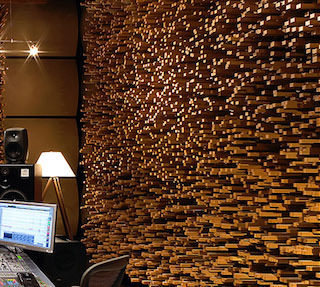
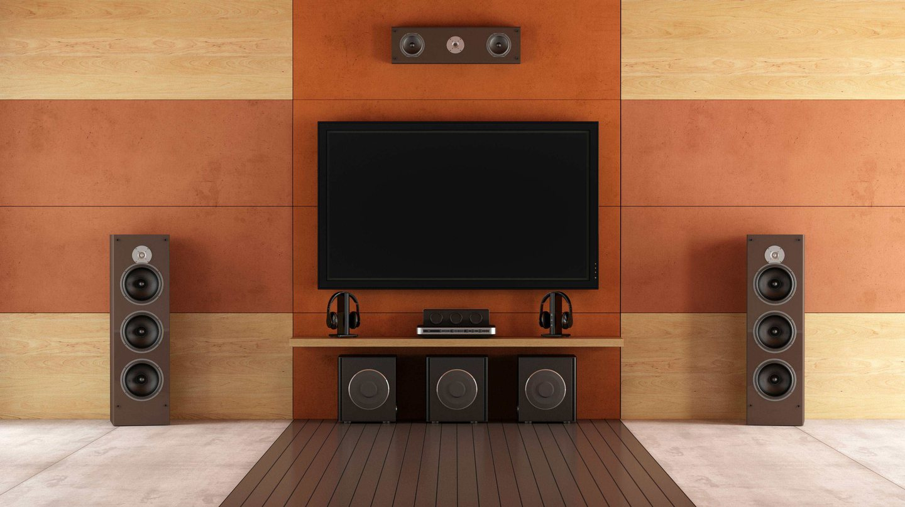
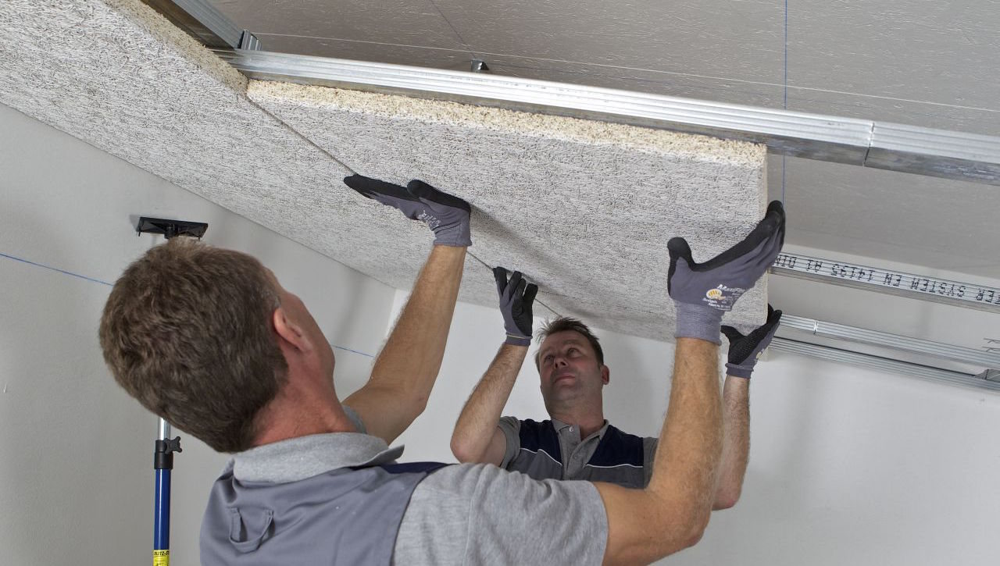
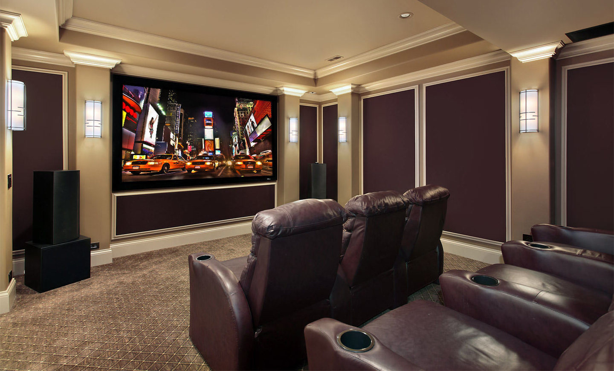
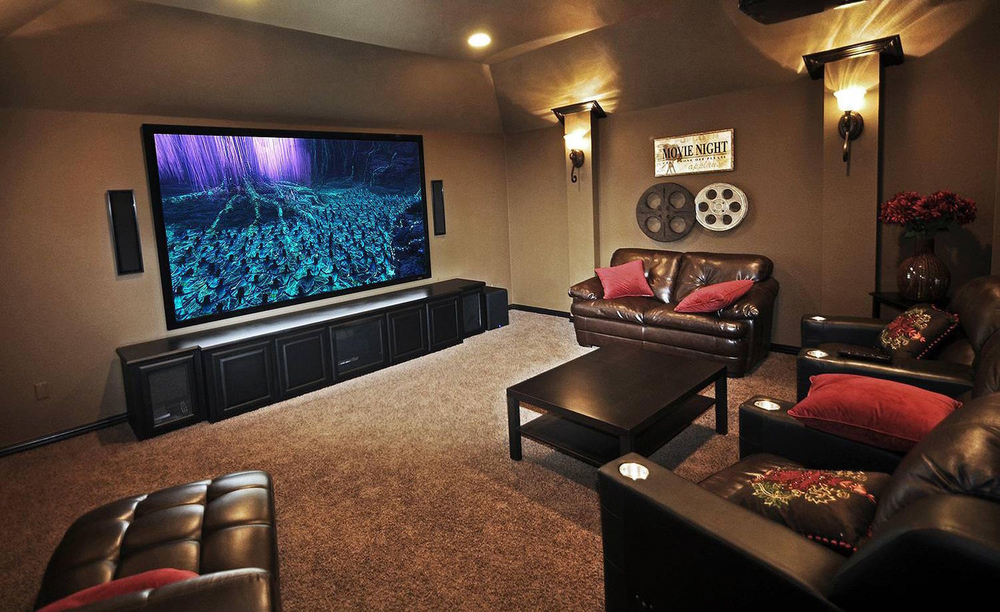
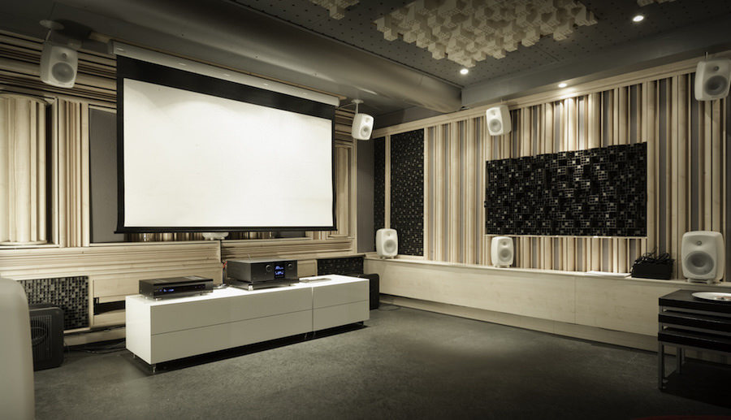
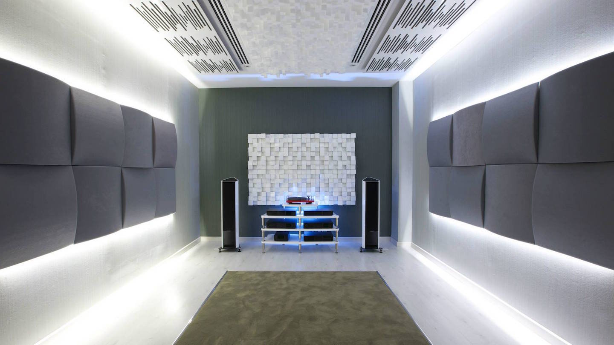

Строим домашний кинотеатр: акустическая обработка помещения (часть 1), статья. Журнал "Stereo & Video"

Сохранить и прочитать потом —         

* * *

Театр, как известно, начинается с вешалки, а серьезный домашний кинотеатр — с требований к его построению. Эти требования можно выразить численными значениями (в стандартах многие параметры указаны), но сначала я предлагаю определить два простых правила качественного ДК: 1) Зритель не должен видеть ничего, кроме происходящего на экране, 2) Зритель не должен слышать ничего, кроме звуковой дорожки фильма.

Их выполнение гарантирует максимальное «погружения» зрителя при просмотре, потому что все его внимание будет направлено на происходящее на экране, ничто не будет его отвлекать.

Я еще не раз вернусь к этим правилам, при описании различных аспектов создания ДК, но сейчас начну с первого этапа — этапа строительства помещения. В идеальных условиях именно на этом этапе должны определиться будущие характеристики домашнего кинотеатра.

Итак, выбор оптимального помещения под ДК начинается, как ни странно, с бюджета. От площади выбранного помещения зависит размер экрана, а от его диагонали зависит яркость проектора и дистанция до зрительских мест, и эти расстояния важно учитывать при выборе акустических систем, потому что звуковое давление колонки должны выдавать с запасом на затухание звука по пути до слушателя. Понятное дело, яркость проектора сильно влияет на его цену, в свою очередь, акустика, способная давать высокое звуковое давление, тоже недешевая и, к тому же, требует мощных и дорогих усилителей.Наконец, высокое звуковое давление требует и повышенного внимания к качеству и точности акустической обработки помещения. И так зависимость цены ДК от площади нелинейная, а если брать акустическую обработку — то сложность возрастает в кубе, ведь при увеличении площади в два раза, площадь обрабатываемых поверхностей увеличится в 8 раз! Тем не менее, по моим наблюдениям, оптимальная площадь комнаты для ДК высокого класса на 2-5 мест — 50-80 кв.м. с высотой потолка 2,5-4 метра.

**Изолировать и поглотить**

Акустическая обработка помещений традиционно решает две задачи: звукопоглощение и звукоизоляция.В случае с домашним кинотеатром, при нужном балансе звукопоглощения в комнате формируется правильная, стандартная акустическая обстановка, которая значительно снижает вредное влияние комнаты на звук (отражения) и создает акустическую атмосферу, схожую с таковой в студии звукозаписи, где производился построцессинг. Т.е. в идеальном варианте мы должны слышать всё то же и так же, как звукорежиссер слышал во время финального просмотра перед сдачей фильма в прокат. (Пока мы не принимаем во внимание вопросы качества усиления, декодеров, АС и пр.) Понятно, что каждый звук имеет значение — он неслучайно введен в дорожку фильма, идентичное его воспроизведение даст лучше понять задумку режиссера, обеспечит правильное художественное восприятие фильма.

В свою очередь, звукоизоляция — это значительное снижение проникающих в домашний кинотеатр внешних шумов. Лучше соотношение сигнал/шум — шире динамический диапазон, а последний напрямую связан с реалистичностью восприятия. Звукоизоляция, вдобавок, не дает услышать зрителю другие посторонние звуки из других комнат, которые отвлекут его от просмотра. Наконец, решается защита остальной части дома от звуков работающего на полной мощности домашнего кинотеатра.

Помимо звукоизоляции самой комнаты, отдельная задача — заглушить различную технику: кондиционеры, мощные усилители с гудящими трансформаторами, проектор и т.д. Особенно шумный проектор зачастую помещают в отдельный короб, компоненты ставят в специально выделенный для них шкаф или даже отдельную аппаратную комнату. Заодно индикаторы техники, опять же, не будут отвлекать зрителя.

**В подвале**

Лучшее место для ДК в доме — подвальное помещение. Такую комнату просто затемнить (не забудьте про светящуюся табличку с надписью «Вход», подсветку пола и ступеней), естественная звукоизоляция разом решает почти все проблемы заглушки комнаты, остаются только вопросы подачи воздуха через вентиляционные каналы, двери и потолок. Для снижения уровня шумов за пределами такого ДК применяют специальные конфигурации заглушенных вентиляционных каналов, звукоизолирующие двери с тамбуром.

Однако есть и неочевидные проблемы с размещением кинотеатра в подвале. Например, из-за того, что практически все материалы, применяемые для акустической обработки, имеют отличные теплоизоляционные характеристики, мы получим «термос», тогда как хороший ДК может иметь выделяемые тепловые мощности на уровне нескольких киловатт. Другими словами, к вопросам охлаждения ДК в подвале нужно отнестись максимально серьезно. Я встречал такие проекты, когда температура просмотра повышалась настолько быстро, что там было трудно находится спустя полчаса после начала киносеанса.

Следующая проблема подвальных помещений — низкие частоты не поглощаются бетонными стенами цоколя, а практически полностью отражаются обратно в помещение. В таких условиях комната ведет себя как высокодобротный резонатор, и в результате амплитуды паразитных резонансов могут превысить полезный сигнал на 15-20 дБ! И так как низкие частоты стихают медленно, они продолжают «играть» еще долго после того, как основной сигнал закончился.

Эффективных материалов для звукопоглощения на низких частотах мало, они дороги и их требуется много. Так, чтобы эффективно заглушить бетонные стены на частотах ниже 80-100 Гц, потребуются многослойные конструкции, по принципу действия, кстати, схожие с многослойной броней, когда между собой чередуются вязкие отражающие и поглощающие слои. Вязкий слой частично пропускает НЧ и попутно переводит звук в тепло (звуковые волны заставляют материал изгибаться и вибрировать), а поглощающий слой из пористого продуваемого материала глушит межслойные отражения и, в свою очередь, преобразует в тепло движение воздуха в порах материала.Есть одно универсальное решение для подавления НЧ резонансов.

Делается облицовка бетонных стен с относом двойными листами ГВЛ с вибродемпфирующей прокладкой между ними, а получившуюся полость заполняют пористым или волокнистым звукопоглощающим материалом, например, минватой. Затем на эти фальшстены из ГВЛ наклеивают листы из распространенных акустических материалов типа поролона, панелей Heradesign и т.п. — это уже требуется, чтобы получить правильный уровень поглощения в средне- и высокочастотном диапазонах. В деле борьбы с «гуляющим» низом наиболее внимательно нужно отнестись к тыловой стене, где формируется первое отражение звуковой волны, приходящей от фронтальных динамиков и сабвуферов.

Существует еще т.н. SBIR-эффект (Speaker Boundary Interference Response). Суть его в том, что первые отражения от близко расположенной стены приходят к зрителю с некоторой задержкой по отношению к прямому звуку, и определенные частоты встают в противофазу. В итоге в АЧХ получается сильный провал. Чтобы избежать этой проблемы, все ДК высокого класса выполняют на встраиваемой акустике, чтобы диффузоры динамиков находились в плоскости стены, тогда и условий для возникновения SBIR-эффекта не будет.

**Алгоритмы**

В последнее время получили распространение т.н. «активные системы», когда задачу управления комнатными отражениями берет на себя специальный звуковой процессор. Он очень эффективен как раз в низкочастотном диапазоне, где акустика сама по себе не позволяет добиться нужного результата. Фактически, они помогают удешевить «пассивную» акустическую обработку комнаты за счет этого сочетания, когда за низкие частоты 100-1000 Гц отвечает процессор, а выше результат достигается «архитектурными» методами. На мое мнение, таким образом достигается наилучший результат.

В большинстве специализированных звуковых процессоров используется параметрический эквалайзер, скрупулезно настраиваемый на подавление конкретных комнатных резонансов. Причем параметрическая эквализация есть у процессоров разных категорий, от массовых моделей, до премиальных, как ADA, JBL Synthesis, Theta Digital и других. Однако у «параметрики» есть и свои недостатки, которые ограничивают область применения такой обработки. Прежде всего, по своему принципу действия эквалайзер уменьшает амплитуду резонанса за счет «вырезания» очень узкой полосы сигнала, что иногда приводит буквально к пропаданию отдельных нот. Вдобавок, при неправильном применении параметрического эквалайзера легко добавить системе серьезные фазовые искажения. Хорошо настроить такую систему трудно — нужен большой опыт.

Существуют и другие типы обработок звука, которые управляют комнатными отражениями с высокой точностью. Например, процессоры французской фирмы Trinnov Audio имеют патентованные алгоритмы, которые подавляют отражения, не затрагивая при этом полезный сигнал. Технологию кратко можно описать так: процессор на этапе калибровки подробно измеряет все отражения, а затем в основной сигнал подмешивает эти же «отражения», но только в противофазе. Звуки гасят друг друга, а полезный сигнал не меняется.

**Комнатный вопрос**

Вернусь к «комнатному вопросу». Не у всех есть возможность разместить домашний кинотеатр в подвале, более того, кинозал часто совмещают с гостиной. Это не очень хороший вариант, но других порой нет. Тут получению хорошей звуковой картины будут мешать окна, дверные проемы, гипсокартонные стены-перегородки и мебель, и, конечно же, будет очень трудно получить хорошую звукоизоляцию. Потому для ДК и рекомендуется лучше выбирать комнату без окон, с одной дверью, у которой минимум общих с жилыми помещениями стен. Отмечу, что проблемы со звукоизоляцией уменьшаться наполовину, если ДК разместить в комнате на первом или последнем этаже.

Задачи звукопоглощения, как и в случае с ДК с подвалом, решаются подобным же образом, только здесь дополнительно надо будет повесить на окна тяжелые светонепроницаемые шторы. Легкие перегородки из гипсокартона могут вызвать серьезные проблемы с АЧХ — появится провал на частоте резонанса этой самой перегородки. В итоге ее нужно будет дополнительно усиливать или заменить на жесткую — кирпич, пенобетон и т.д., чтобы исключить такие явления.

**Плюс стерео**

Очень часто в одной комнате совмещают домашний кинотеатр и стерео, однако требования к акустической обработке у этих двух типов систем существенно отличаются. Если для стерео необходимо, чтобы комната не была сильно заглушена и слушатель легко понимал, в каком пространстве он находится, то в случае с ДК нужно стремиться практически полностью избавиться от комнатных отражений. Представьте себе сцену диалога в пустыне, а вы четко слышите комнату — чувство погружения тут же пропадет. Что делать в такой ситуации?

Почти у всех процессоров-ресиверов есть музыкальный режим для работы в стерео — в сигнал будет добавлена реверберация, которая пойдет на тыловые и сурраунд-колонки. Это лучший выход для ДК, совмещенного со стереосетапом в одном помещении, которое акустически обработано для кинотеатра.

Наконец, еще один случай специальной акустической обработки — использование дипольных АС (тыловых или боковых). Так как они используют отражения от стен, глушить тыловую часть комнаты противопоказано, основное звукопоглощение переносится на фронт.

[_Продолжение следует_](https://www.audiomania.ru/content/art-4641.html)

_Подготовлено по материалам журнала "Stereo & Video", март 2016 г._ **[www.stereo.ru](http://stereo.ru/to/fyn6j-stroim-domashniy-kinoteatr-akusticheskaya-obrabotka-pomescheniya-chast-1)**