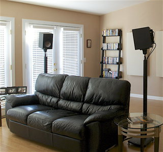
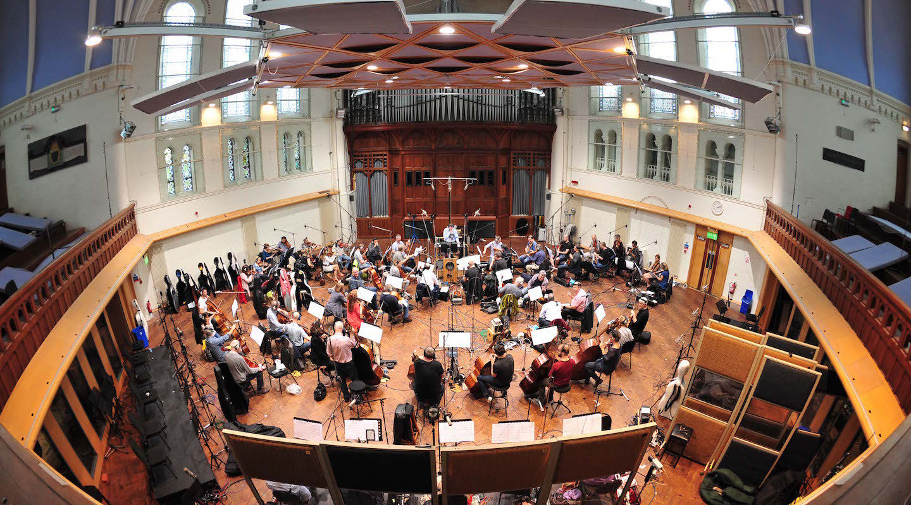
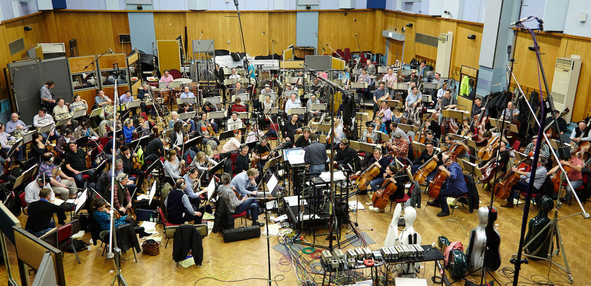
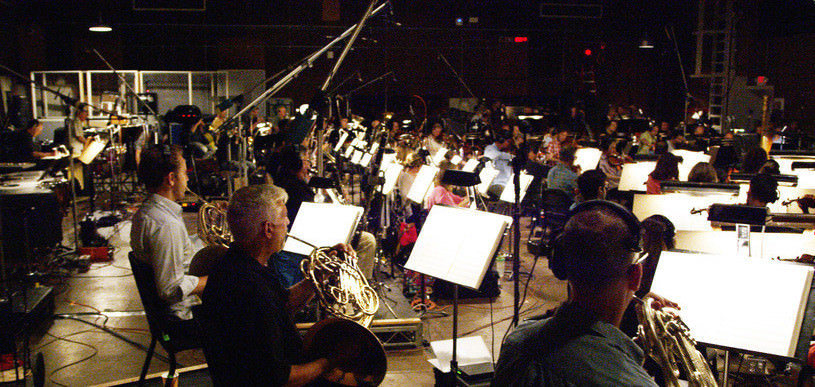
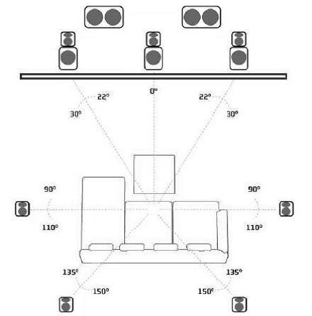
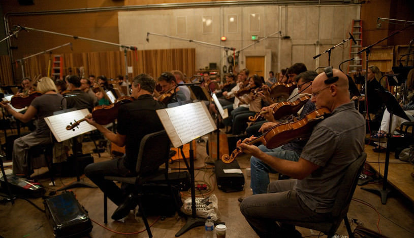
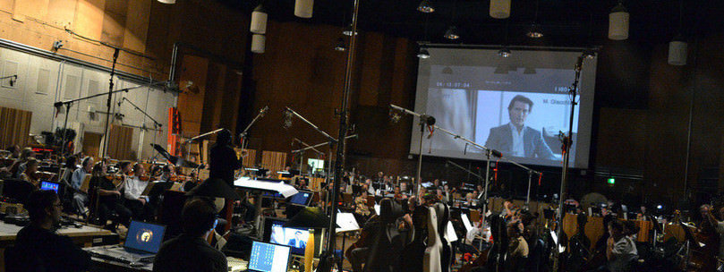
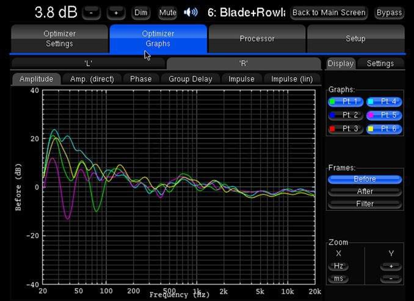
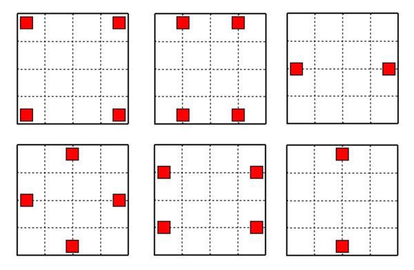
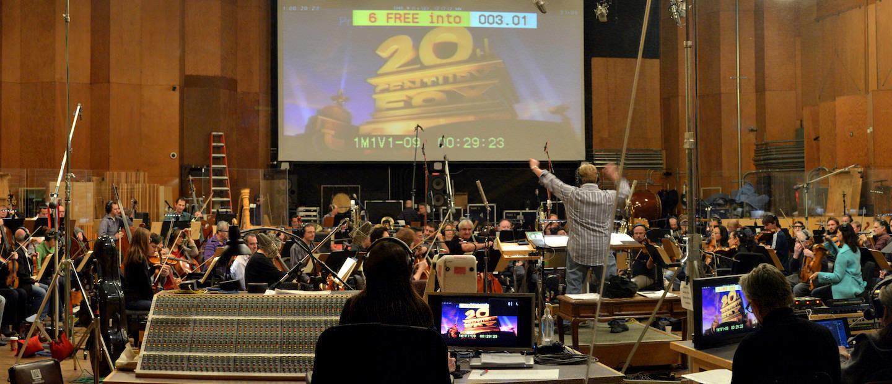

Строим домашний кинотеатр: выбор акустики, ее установка и настройка (часть 2), статья. Журнал "Stereo & Video"

Сохранить и прочитать потом —         

* * *

Природные звуки, куда можно отнести и музыку, имеют усредненный спектр, соответствующий т.н. розовому шуму. Последний характеризует одинаковое содержание энергии на каждую октаву. Например, интенсивность звука в полосе 40-80 Гц должно получится такой же, как и в полосе 4000-8000 Гц. Все акустические системы, предназначенные для воспроизведения музыки, проектируют исходя из этих соотношений. Но в кино все иначе.

Звуковая дорожка в фильмах редко воспроизводит музыку и звуки природы, в боевиках, например, колонки должны без искажений воспроизвести звуки выстрела (идеальная импульсная характеристика), взрывов, бьющегося стекла и т.п., где спектральная плотность звука уже не подчиняется закону розового шума. Кроме того, как я писал в первой статье, для корректного создания подобных ударно-импульсных звуков большое значение имеет и правильная акустическая обработка помещения, в частности, отсутствие эха. Иначе зритель может потерять чувство погружения, если вдруг распознает несоответствие эха в звуковой дорожке фильма, эхо-сигналу от самой комнаты. Как пример, одиночный выстрел на экране максимально возбудит комнатные отражения, причем они будут отчетливо слышны в тишине после выстрела.

Собственно, из-за того, что звуковая дорожка фильма по своему спектру ближе к белому шуму, и приходится повысить требования к аппаратуре для кинозала. Если говорить языком характеристик, техника должна отыгрывать звуки без искажений во всем диапазоне со средним давлением 85 дБ и пиковым 105 дБ.

_Запись саундтрека к мультфильму «Пингвины Мадагаскара» в лондонской Air Studio_

Отсюда следует, например, что применение в акустике для ДК обычных купольных твитеров нецелесообразно. В силу небольших размеров купола (традиционно — 1 дюйм) его мощностные возможности ограничены размерами звуковой катушки (теплоотвод затруднен). Тогда как мощность и количество высокочастотного сигнала в кино значительно выше, чем в музыке. Это может привести к тепловой компрессии, то есть последующим искажениями. А бывает и что динамик, не выдержав такой нагрузки, перегорает.

Поэтому лучшая рекомендация для домашних кинотеатров (особенно с дистанцией от АС до места прослушивания более 4-х метров) — ставить рупорные колонки с компрессионными драйверами в СЧ/ВЧ-звеньях. К тому же у такого типа выше показатель чувствительности динамиков. В низкочастотном спектре лучше, чтобы работали драйверы профессионального типа с увеличенным диаметром звуковой катушки.

Вообще, дистанция в 4 метра — это условная граница, пересекая которую надо ответить на вопрос: сможет ли система выдать нужное звуковое давление? Большинство обычных АС при установке в ДК не обеспечат по норме и 3-метровое расстояние. И раз уж речь зашла о дистанции, мощности и чувствительности, напомню основные соотношения, чтобы оперативно определить соответствие выбранных усилителей и АС размерам домашнего кинотеатра.

**Расстояние и давление**

Итак, согласно стандартам мы должны получить звуковое давление 85 дБ (105 в пике) без искажений по всей полосе частот. Звуковое давление на расстоянии 1 метр от АС при подаче на колонку 1 Ватта мощности — это «чувствительность», ее практически всегда указывают в паспортных данных продукта. Далее вычисляем максимальное звуковое давление в точке прослушивания — каждое удвоение мощности даст нам +3 дБ звукового давления, а каждое удвоение дистанции — спад –6 дБ.

_Запись саундтрека к мультфильму «Как приручить дракона 2» в лондонской студии Abbey Road_

Возьмем, например, наиболее распространенную акустику для музыки с типовой чувствительностью в 91 дБ. На расстоянии 4 метра из-за спада в –12 дБ нужно компенсировать потери дополнительным усилением в размере 105–(91–12) = 26 дБ. Это примерно соответствует усилителю мощностью 500 Вт. Не всякие колонки готовы выдержать такую мощность.Однако это еще не все, основная проблема в том, что в спецификациях АС параметры мощности указывают из расчета сигнала с частотой 1000 Гц и, значительно реже, в розовом шуме. Поэтому при выборе АС лучше иметь запас по максимальному давлению в 3–6 дБ.

Есть пара способов увеличить звуковое давление. Можно разместить АС в плоскости стены, тогда мы получим дополнительно 5–6 дБ на частотах ниже ~300 Гц. Или применить активный мультиампинг, когда пассивные фильтры кроссоверов исключаются из системы и вместо них используются активные электронные (чаще цифровые) кроссоверы для усилителей мощности. При этом полосные усилители подключаются напрямую каждый к своему динамику, что помогает получить большее звуковое давление и лучшее качество.

**Какую акустику для кино покупать**

В отличие от музыкальной акустики, где слушателям может нравиться некоторая окраска звука, в кинотеатральных системах такой подход недопустим. Кино требует от колонок минимальных искажений, отсутствие послезвучий и высокого звукового давления. Поэтому в ДК не стоит применять ламповое усиление и аудиофильскую акустику с «особенным» звучанием. В кинотеатре нужно обеспечить минимальное количество комнатных переотражений, поэтому для него лучше других подходят колонки с узкой диаграммой и такие, где свойства направленности мало зависят от частоты. Как многим известно, подобные характеристики у АС рупорного типа, причем с рупором т.н. «постоянной направленности».

_Запись саундтрека к фильму «Звездные Войны: Пробуждение силы» в студии MGM, Калифорния_

Могу сказать, что самым удачным считается эллиптический рупор с направленностью 60х90 градусов. Дальше можно рассматривать обычные колонки с купольными и коническими диффузорами, а вот разных типов «панельной» акустики (электростаты, ленточная, АМТ и прочие) лучше избегать, даже если они применяются только в высокочастотном звене — у них бывает очень неравномерная направленность и проблемы с перегрузочной способностью на НЧ. Диполи и всенаправленные типы АС для кинотеатров не подходят за исключением специальных настенных моделей (т.н. «сурраунды»).

Из типов оформления на первое место я поставлю фазоинвертор низкой эффективности (площадь портов менее ~15% от площади НЧ-диффузора), а на второе — закрытый ящик. Такие типы, как «лабиринты», TDL, обратные рупоры и т.п., где тыловое излучение практически полностью выводится наружу с задержкой — для ДК не подходят, как и варианты открытых оформлений.

**Размещение акустики в комнате**

Естественно, в кинозвуке есть стандарты по размещению АС — в частности, указывается угол относительно места слушателя, и по возможности, этих стандартов надо придерживаться, чтобы получить звук «как задумал режиссер».

На картинке выше нарисована схема расположения динамиков в одном из самых распространенных форматов 7.1: три фронтальных канала, два боковых, два тыловых и сабвуфер (его расположение не нормируется, поскольку считается, что человеческий слух не способен определить положение источника на такой низкой частоте звука). Если строить ДК в наиболее распространенном формате кадра 2.40:1 с рекомендованным углом просмотра 35-55 градусов, то, как видно на изображении, фронтальные каналы могут находиться либо в формате экрана, либо — центральный канал за экраном, а боковые по краям полотна. И это будет лучший вариант. Прежде всего, потому что боковые каналы следует раздвигать до максимального значения в стандарте ±30 градусов. Тогда получится равномерная панорама между фронтальными и боковыми спикерами, а центральный канал окажется перед экраном, что позволит избежать потерь в звукопрозрачном полотне (высокие частоты поглощаются на 1-6 дБ — тканный вариант, и до 12 дБ — перфорированный).

Позволю себе замечание насчет расположения центрального канала. Ставить его под экраном на полу, как можно часто увидеть, — очень грубая ошибка. Так мы получим сильное переотражение звука от пола, которое снизит разборчивость диалогов и даст легко определяемое направление на источник звука, абсолютно не совпадающие с тем, что происходит на экране. По этой причине «законное» положение центрального канала таково — излучатель должен находиться на высоте 5/8 от нижней части экрана. На такой же высоте располагают фронтальные LR-каналы и сурраунд (для форматов 5.1 и 7.1).

_Запись саундтрека к фильму «Жизнь Пи» в студии The Newman Scoring Stage, г. Лос-Анджелес_

Хочу заметить, что новые форматы 3D-звука, как Dolby Atmos, DTS:X, Aura 3D — все они имеют разные карты стандартного расположения АС. И что же тогда делать, если вы строите «самый лучший» ДК? Выход могут предложить звуковые процессоры, как, например Trinnov Altitude 32 с его функцией 3D Remapping, которая виртуально «переставит» АС на свои места в полном соответствии с воспроизводимым стандартом. На сегодня пока это единственный аппарат, который обещает подобные виртуальные «перестановки» на одном наборе АС.

**Ошибки расстановки акустики**

Итак, затрону основные ошибки при размещении АС и возможные методы их исправления.

1\. Нет возможности применить звукопрозрачный экран. В таких случаях можно разместить колонку центрального канала над экраном. Еще один вариант — активировать функцию центрального виртуального канала, которая есть у некоторых проекторов. Так может получиться даже лучше, чем ставить поверх полотна.

2\. Размещение боковых каналов слишком близко к зрителю (помещение вытянутой формы). В таком случае, когда в одном ряду сядут несколько зрителей, станет невозможно обеспечить баланс звука от боковых каналов для всех зрителей, кроме центрального. Единственный способ решения этой проблемы — поднять боковые каналы выше, усреднив, таким образом, расстояние до зрителей.

_Запись саундтрека к фильму «Миссия невыполнима: Протокол Фантом» в студии The Newman Scoring Stage, г. Лос-Анджелес_

3\. Зрительские места размещены вплотную к стене. Вообще, такой расстановки кресел лучше избегать сразу, она в корне неверна. Но если другого выхода нет, единственный способ что-то улучшить — применить дипольный тип АС на тыловой стене над зрителями.

4\. Применение недорогих потолочных маломощных динамиков. Часто их размещают немного в стороне от зрителя, и если добавить высоту потолка, то итоговая дистанция от динамиков до зрителя превысит те самые пороговые 4 метра, о который я писал в начале статьи. Частично эту ситуацию может исправить процессор, но до конца «излечить» ее не получится, это компромиссное решение.

5\. Все АС необходимо направить в центр зрительской зоны, а точнее на VIP-место. Этим правилом часто пренебрегают и ставят колонки параллельно стенам комнаты. В итоге получают повышенную неравномерность и сильные отражения от стен помещения.

6\. Чрезмерное расширение зоны просмотра. Помните, точные поканальные задержки можно сделать только для одной точки (зрительского места) в зале, поэтому зрителей нужно «рассаживать» максимально компактно.7. Расположение АС в формате 5.1, когда есть возможность ставить 7.1, я также считаю ошибкой. В формате 5.1 всегда заметен провал во фронтально-боковой панораме, а применение двух дополнительных АС и пары каналов усиления ненамного удорожает смету.

8\. Использование одного сабвуфера. С одним низкочастотником в системе практически невозможно получить равномерное звуковое давление по всей зрительской зоне. Для иллюстрации ниже приведу график измерения одной системы в помещении 60 кв.м. в зоне примерно 3х2 метра. Обратите внимание, что неравномерность на низких частотах достигает 30 дБ в зависимости от места замера.

_Два ряда, пара мест в первом ряду и три места во втором размечены по центру зала 50 кв.м. в позиции примерно 34 по длине зала. Хорошо видно, что неравномерность на некоторых частотах достигает более 30 дБ_

По этим причинам в домашних кинотеатрах высокого класса ставят больше одного саба. Оптимальное число — 4, а минимальное — 2. При этом пару сабвуферов ставят по центрам противоположных стен, а если взять четыре низкочастотника, то и способов будет побольше ([исследование Harman](http://hometheaterhifi.com/technical/technical-reviews/an-interview-with-todd-welti-and-kevin-voecks/)).

При таком размещении сабов достигается равномерное низкочастотное покрытие всей зрительской зоны, но нужно обязательно применять параметрические эквалайзеры для выравнивания нескольких пиков звукового давления. Сначала для каждого из сабов в настройках устанавливают задержку, которая компенсирует разницу в дистанциях низкочастотников до центра зрительской зоны, а дальше эквалайзером выравнивают его отклик, а затем применяют фильтр еще и в общем LF-канале. Это очень сложная задача, но более простого пути нет. Несколько ее облегчить призваны многоканальные аудиопроцессоры, но помните, что выбирать модель нужно с достаточным числом каналов, ведь каждый сабвуфер заберет себе по одному. Хотя можно снизить количество каналов при небольшой потере качества, если выводить один канал на пару сабвуферов.

**Усиление и кабели**

Для домашнего кинотеатра всегда предпочтительнее мощное «токовое» усиление класса AB. Однако для больших проектов лучше брать импульсные усилители, поскольку они имеют значительно меньшее тепловыделение в режиме холостого хода — порядка 5-8%, что в схеме ДК с общей потребляемой мощностью 5-10 кВт меньше киловатта. В свою очередь, аналоговое усиление в холостом режиме будет потреблять порядка 3 кВт. К тому же, хорошие аналоговые усилители мощностью более 300 Вт на канал очень дорогие, а способных выдать 500 – 1000 Вт на рынке и вообще представлено совсем немного — выбирать не из чего. Тогда как качеством звучания современные импульсные усилители уже ничем не уступают лучшим образцам аналогового усиления.

_Запись саундтрека к фильму «Крепкий орешек 5: Хороший день, чтобы умереть» в студии The Newman Scoring Stage, г. Лос-Анджелес_

Помимо рядовых проблем акустических кабелей с недостаточным их сечением и ограничением тока, есть и еще одна, о которой следует напомнить строителям домашнего кинотеатра — это скин-эффект. Этот «эффект» приводит к задержке низкочастотной составляющей сигнала и хорошо известен в стереосистемах. Там для борьбы используют плоские кабели, коаксиальные конструкции, набор тонких проводников с изоляцией (литцендрат) и т.д. Но в случае с кино, решить эту проблему проще. Как правило, в ДК используется частотное деление на 80 Гц (ниже работают сабвуферы), поэтому последствия скин-эффекта легко корректируются задержками в основных каналах относительно канала НЧ-эффектов.

_Подготовлено по материалам журнала "Stereo & Video", май 2016 г._ **[www.stereo.ru](http://stereo.ru/to/1sh1h-stroim-domashniy-kinoteatr-vybor-akustiki-ee-ustanovka-i-nastroyka-chast-2)**