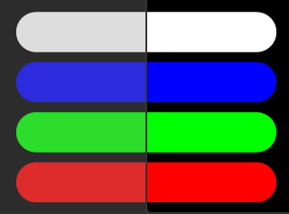
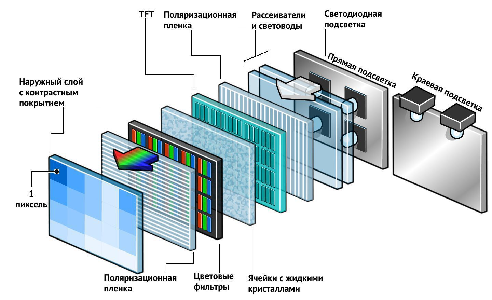
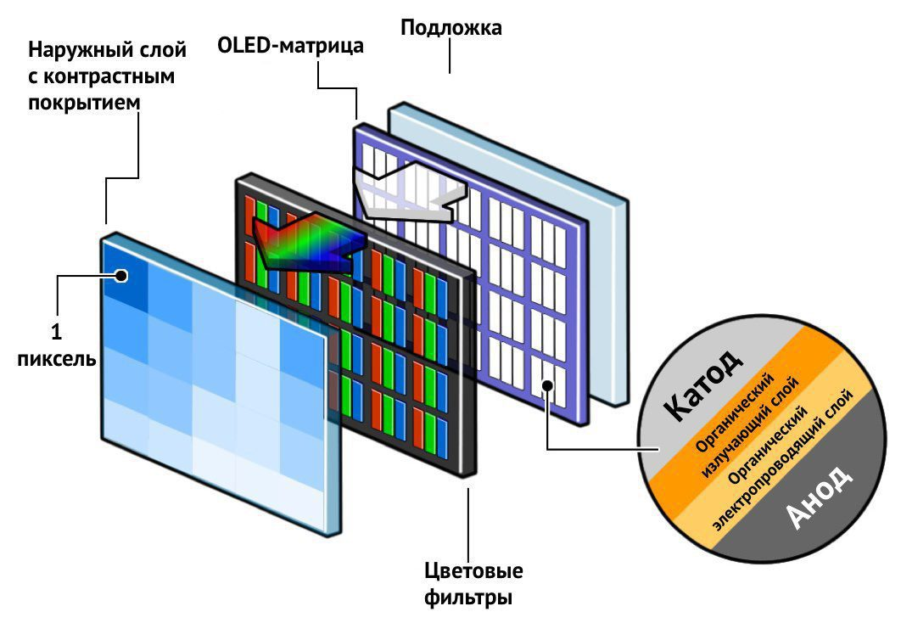
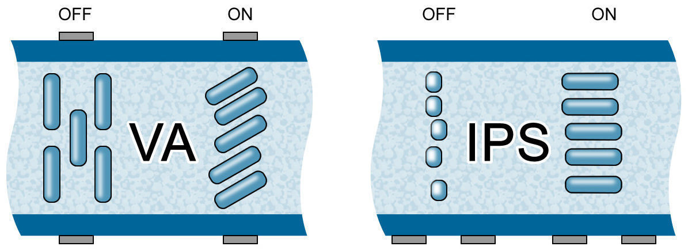
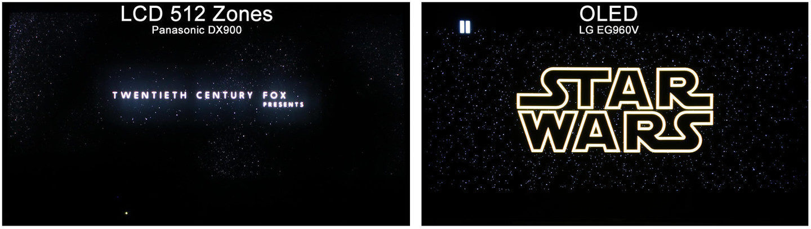
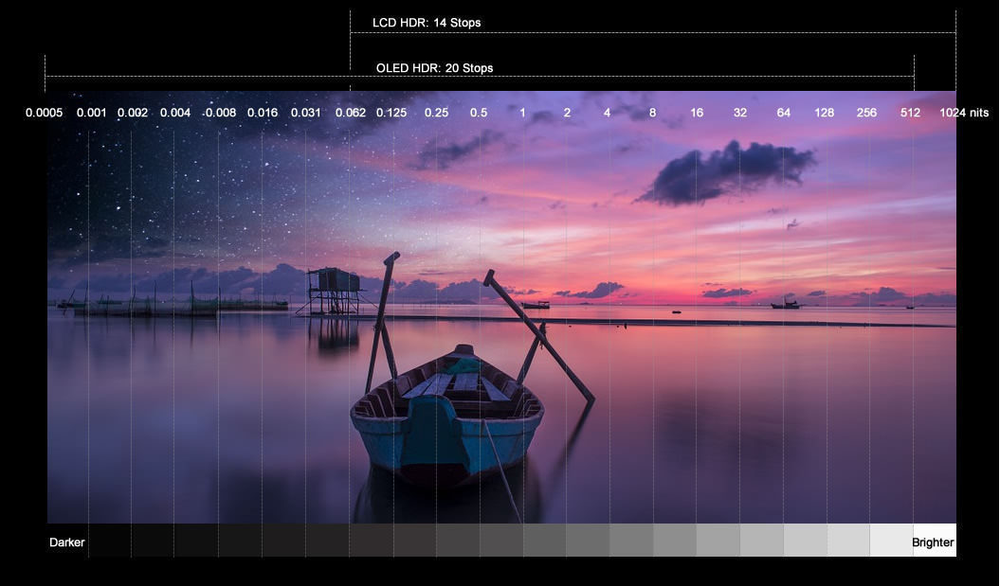
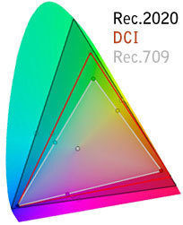
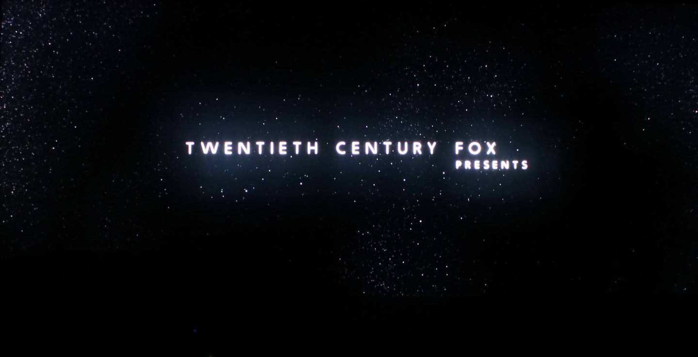
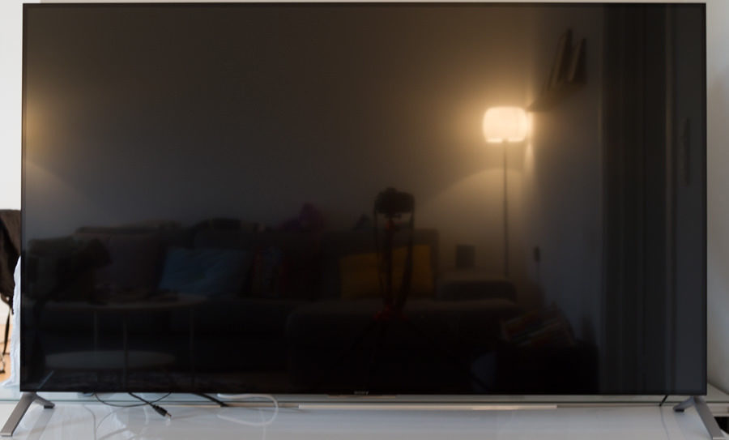

Что купить: ЖК-телевизор или OLED-телевизор? Подробное сравнение [Перевод], статья. Журнал "Stereo & Video"

Сохранить и прочитать потом —         

На данный момент на рынке телевизоров используются две технологии производства самих дисплеев: LCD и OLED. Они достаточно сильно отличаются друг от друга по многим параметрам, и в этом ликбезе показаны основные моменты, плюсы и минусы технологий. Какая придется по душе пользователю — решать ему.

**ЖК-панели**

За годы существования ЖК-матрицы (они же LCD) не сильно изменились. Аббревиатура «ЖК» означает «жидкокристаллический» и говорит о том, что активный элемент экрана — жидкие кристаллы. Источник света в них находится за матрицей и представляет собой массив светодиодов, хотя ранее производители использовали более крупные флуоресцентные лампы. Диоды можно расположить по контуру дисплея (боковая или краевая подсветка) или позади (т.н. полная или прямая подсветка).

В дисплеях с боковой подсветкой сложно контролировать локальную яркость света по всему экрану, потому как источники света расположены только по бокам. Для того, чтобы покрыть всю площадь дисплея, используется отраженный свет, и поэтому контролировать можно только яркость определенной крупной области. С полной подсветкой локализировать свет можно точнее: диоды расположить в сетке и управлять каждым из них или конкретной зоной. Самое высокое число диодов в ЖК-дисплее на данный момент составляет 5 200 штук, столько диодов можно разместить только на панели размером в 100 дюймов. При этом каждый диод подсветит примерно 6 400 пикселей в разрешении UHD.

Обычно свет проходит через несколько уровней пластика, которые призваны его рассеять и сделать излучение более гомогенным. Эти слои пластика расположены между диодами и жидкими кристаллами, поэтому экраны с полной подсветкой довольно толстые.

Для управления интенсивностью каждого из базовых цветов технология ЖК использует ячейки с жидкими кристаллами в каждом пикселе. Эти кристаллы можно вращать, изменяя электрическое поле, и таким образом управлять световым потоком, проходящим через них. Как только интенсивность базового цвета достигает необходимого значения, свет проходит через цветофильтр, отсекающий все цвета, кроме красного, зеленого и синего. Если присмотреться к экрану, можно разглядеть эти красные, зеленые и синие субпиксели, которые создают полноценный пиксель.

Скорость изменения цветов ЖК-матрицей зависит от того, насколько быстро изменяется положение кристалла. Этот показатель влияет на размытие и следы, которые видны на динамичной картинке. В идеале хотелось бы, чтобы кристаллы меняли положение мгновенно, однако это невозможно: обычно кристаллам для этого нужны миллисекунды (поэтому и возникают эффекты размытия и следы).

После прохождения света через кристалл его интенсивность во всех направлениях отрегулировать уже нельзя. Классическая лампочка распространяет свет с одинаковой интенсивностью во всех направлениях, но в ЖК-дисплеях сам принцип, основанный на использовании жидких кристаллов, состоит в том, что большая часть светового потока направлена вперед. То есть световая и цветовая интенсивность получится максимальной только в том случае, если зритель находится непосредственно перед телевизором. Эта особенность важна при рассмотрении углов обзора.

**OLED-панели**

Вероятно, многие из вас знают, что OLED — это особый вид светодиодов (LED) — органический. Структура OLED-матрицы отличается от ЖК, потому как интенсивность цвета контролируется не с помощью слоя с жидкими кристаллами: здесь каждая ячейка — отдельный светодиод. В такой структуре можно избавиться от нескольких слоев «сэндвича», формирующего финальный экран, поскольку каждый субпиксель способен выдавать белый свет.

Этот свет, который испускает каждый отдельный диод независимо от соседей, проходит через пассивный светофильтр, как и в ЖК, и уже дальше — к зрителю. Интенсивность и смешение красного, зеленого и синего цветов зависит от интенсивности света, идущего из диодов, расположенных перед красными, зелеными и синими субпикселями. Хочется чистого черного цвета — просто отключите все ячейки, хочется самого белого — включите все пиксели с максимальной интенсивностью.

Техпроцесс создания OLED-панелей позволяет сделать их намного тоньше, чем ЖК. Без слоя подсветки ЖК-панели тоже тонкие, но бесполезные.

Важно понимать, что на данный момент только LG Display способна массово производить OLED-панели, и поэтому LG контролирует развитие и разработку данной технологии.

**Сравнение технологий**

**Размеры**

**LCD:** 32-150 дюймов.

Такие дисплеи производят практически в любом мыслимом размере, от 20-дюймовых телевизоров до 150-дюймовых гигантов. Плюс ко всему ЖК-матрицы используются в часах, телефонах, планшетах и других устройствах.

**OLED:** 55-77 дюймов.

На данный момент OLED-телевизоры доступны только в трех размерах: 55, 65 и 77 дюймов, но дисплеи, сделанные по этой технологии, также используются в часах, телефонах и планшетах.

**Вывод:** у ЖК-панелей намного больше опций в плане размеров, чем у OLED.

**Внешний вид**

**LCD:** тонкие с боковой подсветкой, с полноразмерной потолще.

Есть такие ЖК-панели с боковой подсветкой, которые могут сравняться в толщине с OLED. И раз уж таким панелям необходим «сэндвич» из рассеивающих линз, то и минимальная толщина в этой технологии ограничена.

**OLED:** очень тонкие.

Без рамки OLED-дисплей может быть настолько тонким, что его можно будет скатать в трубочку. Однако до потребителей такие модели пока еще не добрались.

**Вывод:** одной из проблем, связанных с толщиной панели, становится электроника, которая увеличивает размер телевизора. Без этого и LCD, и OLED были бы ощутимо тоньше, чем сейчас, но есть несколько телевизоров, у которых электронные компоненты и разъемы вынесены в отдельный блок.

**Подгруппы**

**LCD:** несколько видов LCD-панелей.

Разница между дешевым и дорогими LCD-матрицами очевидна. Для телевизоров используются два вида:

— VA LCD (высокая контрастность, низкие углы обзора)

— IPS LCD (низкая контрастность, высокие углы обзора)

Для каждого из этих видов производитель может использовать разные виды подсветки: боковую, полную и полную с контролем зон.

**OLED:** один вид. Разница между дешевыми и дорогими OLED-матрицами невелика.

Сейчас для телевизоров выпускается только один тип OLED-матриц, которые производит LG, потому как Samsung от разработки технологии отказалась. Именно поэтому большинство OLED-телевизоров ведут себя похоже. Разница обычно заключается в разрешении, поддержке HDR, 3D и так далее.

Панели от LG, помимо продуктов самой LG, используются в телевизорах Panasonic, Loewe, Philips, Metz, Bang & Olufsen, Grundig, Skyworth и других производителей.

**Вывод:** из-за нескольких видов ЖК-дисплеев качество изображения на них сильно отличается.

**Углы обзора**

**LCD:** узкий на VA, широкий на IPS.

В зависимости от типа LCD-матрицы (VA или IPS) углы обзора различаются, но вне зависимости от ее типа интенсивность цвета и контрастности падает с увеличением угла обзора. Самый узкий — у VA, в то время как IPS еще позволяет попытаться занять удобное положение перед экраном.

_Схема показывает, как жидкие кристаллы в матрицах VA и IPS типа перекрывают световой поток_

**OLED:** близко к идеалу.

К OLED-панелям на самом деле не применяют такую характеристику, как углы обзора. Свет излучается с одинаковой интенсивностью во все стороны.

**Максимальная яркость**

**LCD:** до 1 800 нит.

Современное поколение ЖК-панелей способно выдавать немало света — заметно больше 1 000 нит на пиковой яркости. Способности кристаллов блокировать свет — неизменны, поэтому на высоких уровнях яркости уровень черного заметно падает. Проще говоря, динамический диапазон размещен выше за счет ухудшения черного.

**OLED:** менее 700 нит.

Ограничения OLED-панелей связаны с тем, сколько энергии панель может вытянуть из сети в конкретный промежуток времени: несколько пикселей могут достигнуть максимальной яркости, но чем больше пикселей увеличивают яркость, тем меньше становится общая яркость изображения. На 2016 год пиковая яркость OLED-дисплеев составляет 600-700 нит. Важно отметить, что рядом с максимально ярким пикселем одновременно может находиться абсолютно черный выключенный соседний пиксель: в технологии OLED есть возможность контролировать каждый пиксель индивидуально на всей ширине динамического диапазона.

**Заметка:** значения яркости соответствуют показателям в разных моделях на 2016 год.

**Уровень черного**

**LCD:** 0.05 нит у лучшего LED с боковой подсветкой, менее 0.02 нит у ЖК с полной подсветкой.

Уровень черного в ЖК-матрицах зависит от того, насколько полностью блокируют свет жидкие кристаллы. К сожалению, они с этим не справляются на сто процентов. В этом смысле панели VA-типа лучше, чем IPS, так как у IPS черный заметно менее черный, что можно компенсировать отключением подсветки, однако ни один ЖК-дисплей не может управлять интенсивностью света каждого конкретного пикселя во всем динамическом диапазоне.

**OLED:** 0 нит.

Черный в OLED-телевизорах — это цвет выключенной панели. В OLED-матрице просто отключается пиксель, который должен отображать черный цвет, и глаз не видит никакой засветки, в чем, собственно, и состоит одна из уникальных особенностей технологии.

**Вывод:** не просто так говорят «OLED — это новый черный», это и правда фишка технологии.

**Контрастность**

**LCD:** VA — менее 4 000:1, IPS — менее 1 000:1.

Из-за того, что в ЖК-матрицах приходится блокировать постоянную подсветку за каждым пикселем, такие дисплеи не могут достичь высокого уровня контрастности: свет все равно откуда-нибудь проберется. Поэтому ЖК-панели в основном используют динамическое или локальное затемнение в попытках контролировать интенсивность подсветки и получить более темный черный (аналогично для белого). Однако из-за этого вокруг ярких объектов появляются ореолы, а вокруг темных — тени, поскольку в ЖК-панелях нельзя индивидуально контролировать каждый пиксель. В стандартом ЖК-телевизоре от 0 до 20 зон, в дорогом — от 100 до 500. При этом в UHD-моделях 8,2 миллиона пикселей и примерно 25 миллионов субпикселей.

**OLED:** бесконечна.

Контрастность OLED-панелей неисчислима, потому что черный у них — действительно черный с яркостью в 0 нит. Нет никаких ореолов или теней вокруг объектов, поскольку OLED может контролировать каждый пиксель индивидуально.

_Слева ЖК-телевизор Panasonic DX900 (прямая подсветка, 512 зон), справа — OLED-телевизор LG EG960V_

**Вывод:** OLED может отобразить полноценный черный пиксель безо всякой засветки, и это — одно из основных отличий технологий ЖК и OLED. У OLED-дисплеев контрастность максимальна, у ЖК — лимитирована.

**Динамический диапазон**

**LCD:** 8-17 единиц.

Динамический диапазон зависит от типа панели и типа подсветки. В худшем случае (для телевизоров с поддержкой HDR) значение соответствует 8 единицам. В лучшем дисплеи с полной подсветкой с локальным затемнением способны на динамический диапазон в 15-17 единиц, но не без ореолов вокруг ярких объектов в контрастных сценах. И такого результата в 15-17 единиц ЖК-панель может добиться только в определенных изображениях. Лучшие ЖК-дисплеи показывают ярче OLED, но проигрывают им в способности отобразить настоящий черный цвет. Чем больше у ЖК-панели зон, тем выше динамический диапазон.

**OLED:** более 20 единиц.

Уже было сказано, что OLED-панели не могут достичь такой же высокой яркости, что и ЖК, но зато отображают чернейший черный. Отношение между двумя параметрами — черным и белым — называется контрастностью, а динамический диапазон позволяет определить, что же находится между двумя этими крайностями. OLED-панели способны на динамический диапазон в более чем 20 единиц безо всяких ореолов и засветок, и поэтому динамический диапазон любого OLED-телевизора выше, чем даже самой дорогой ЖК-модели.

**Вывод:** человеческий глаз работает в динамике, зрачок способен воспринимать динамический диапазон в 46 единиц — от минимального уровня яркости в 0,000001 нит до 100 000 000 нит. Динамический диапазон во многом схож с контрастностью, но дает большее представление о динамике, особенно в рамках формата HDR. Его измеряют не линейно, а логарифмически. Каждая единица динамического диапазона эквивалентна увеличившейся в два раза интенсивности света. К примеру, разница между 16 и 512 нит составляет 496 нит, но 5 единиц, в то время как разница между 512 и 1024 нит составляет 512 нит, но 1 единицу.

**Цветовой охват**

**LCD:** 96-97% DCI-P3.

К 2020 году компании планируют освоить более широкую цветовую палитру Rec.2020, в которую входят 75% оттенков, различимых человеческим глазом. ЖК-дисплеи могут добиться этого с помощью технологии квантовых точек, но на данный момент такие панели покрывают 96-97% палитры DCI-P3.

**OLED:** 96-97% DCI-P3.

К 2020 году компании также планируют освоить более широкую цветовую палитру Rec.2020. Неясно, каким именно образом это можно реализовать технически в OLED, но есть вариант с использованием в структуре тех же самых квантовых точек. На данный момент лучшие OLED-панели отображают 96-97% оттенков палитры DCI-P3.

**Заметка:** Rec.709 — используется практически для всего современного SDR-контента. DCI-P3 — используется для HDR-контента. Rec.2020 — цель, к которой все стремятся.

**Отображение HDR**

**LCD:** высокая максимальная яркость, но недостаточно темный черный, нет попиксельной регулировки.

За отображение HDR отвечают несколько параметров. У ЖК-панелей высокая контрастность, за счет которой страдает отображение темных оттенков. Это из-за того, что в ЖК нельзя контролировать яркость конкретных пикселей, только определенных зон. У лучших моделей этих зон 100-500. Между лучшими и худшими моделями огромная разница в отображении HDR.

**OLED:** глубокий черный, но невысокая максимальная яркость, есть попиксельная регулировка.

За отображение HDR отвечают несколько параметров. У OLED-панелей максимальный черный, но они не настолько яркие, как ЖК. Однако в OLED-панелях можно регулировать яркость каждого индивидуального пикселя: благодаря этому полноценный черный и полноценный белый пиксели могут находиться рядом, что важно для отображения HDR. Между лучшими и худшими моделями разница в отображении HDR небольшая.

**Заметка:** HDR включает в себя такие параметры, как увеличенный динамический диапазон (от черного к белому) и увеличенное цветовое пространство (DCI-P3 и Rec.2020). Обычно HDR идет в комплекте с разрешением 4K, но также может использоваться и в HD. Индустрия перечислила необходимые параметры дисплея в сертификации UHD Premium.

**Неравномерность подсветки**

**LCD:** высокая вероятность, может быть очень заметно.

Светодиодный свет должен быть распределен по панели очень равномерно, а это непросто. Большинство панелей с боковой подсветкой страдают от неравномерности и засветок. Полная подсветка ведет себя лучше, но иногда образует вертикальные линии. Подсветка с локальным затемнением еще лучше, но выдает ореолы вокруг ярких объектов.

_Неравномерная подсветка. ЖК-телевизор Sony X90_

Неравномерная подсветка — одна из основных проблем ЖК-панелей. Она была и в то время, когда использовались лампы CCFL в качестве источника, а с переходом на светодиоды положение ухудшилось.

_Ореол вокруг букв хорошо заметен. ЖК-телевизор Panasonic DX900_

**OLED:** низкая вероятность, заметить можно только в определенных сценах.У OLED нет отдельной подсветки, но проблемы с равномерностью могут встретиться в случае, если степень светимости разная в различных областях экрана. В первых поколениях OLED-панелей были заметны чуть более яркие вертикальные полоски. Также неровная подсветка заметна при отображении серых цветов.

С этими проблемами практически справились в моделях 2016 года, и многие считают, что с развитием технологии от неравномерности удастся избавиться полностью.

**Отражающая способность**

**LCD:** средне-низкая.

В ЖК-дисплее есть слой, который поглощает либо отражает свет, из-за чего картинка выглядит немного полинявшей. Сложно найти матовую ЖК-панель: все они с глянцевым покрытием, которое позволяет поддерживать контрастность на сносном уровне, но зато собирает все блики и отражения (как темное зеркало), что может повлияет на отображение темных цветов. У самых неотражающих ЖК-панелей отражающая способность достигает 2%.

_Телевизор Sony X90_

**OLED:** низкая.

У OLED-дисплея нет такого дополнительного слоя, поэтому цвета не линяют. Отражения могут присутствовать, но они существенно не повлияют на уровень черного. У OLED-телевизоров последних поколений отражающая способность составляет 1%. В цифрах разница между 1% и 2% хотя и не кажется большой, но на деле заметна.

**Вывод:** выходом могут стать изогнутые телевизоры, но только в том случае, если вы сидите правильно по отношению к телевизору. В других положениях изогнутый телевизор может наоборот усиливать отражения.

**Размытие**

**LCD:** высокий/средний.

Напомним, что в каждом пикселе — ячейки с жидкими кристаллами. Эти кристаллы могут двигаться под действием электрического поля. Если они двигаются слишком медленно, картинка в динамике становится размытой. У ЖК по определению есть такой параметр, как размытие, но за годы развития технологии положение улучшилось. Степень размытия определяется цветовым сдвигом. Из черного в белый, например, пиксель может перейти очень быстро (надо приложить больший вольтаж), в то время как из фиолетового в красный — медленнее (меньший вольтаж). Также на ЖК-панелях бывают заметны ореолы в движении. Все современные ЖК-дисплеи используют схему, которая ускоряет изменение положения кристаллов. Некоторые производители применяют т.н. «сканирующую подсветку», когда подсветка мерцает с частотой в 2-3 раза превышающей частоту вывода кадров.

**OLED:** средний/низкий.

По определению в OLED-технологии нет размытия, но упоминаемый параметр — 10 микросекунд. Современные OLED-матрицы работают по принципу «выборка и хранение», как и ЖК-матрицы (в отличие от плазмы, которая отрисовывала картинку каждый раз заново). Из-за этого возможно небольшое размытие, чаще всего незаметное человеческому глазу (так как OLED переключается между цветами с одинаково высокой скоростью в отличие от ЖК). Впрочем, если приглядеться — размытие заметить можно; подсветка у OLED-панелей не мерцает, подстановка промежуточных черных кадров не требуется.

**Вывод:** за размытие отвечают два фактора — либо пиксели не успевают вовремя сменить цвет, либо человеческий глаз так воспринимает мир. У глаза есть световая «память» — ретенция. Яркие объекты остаются на сетчатке до тех пор, пока в визуальной среде что-нибудь не изменится. Если периодически вставлять черные кадры, глаз может «перезагрузиться» — этот метод и называется «сканирующим черным».

**Задержка входящего сигнала**

**LCD:** зависит от конкретной модели, в лучшем случае 20 миллисекунд.

Задержка сильно зависит от конкретной модели. Также она зависит от режима просмотра: известно, что задержка может достигать 75-100 мс в некоторых предустановленных режимах с динамическими настройками. У многих телевизоров есть специальный игровой режим, в котором используется минимальная задержка. Лучший результат — менее 20 мс, и это довольно немного.

**OLED:** зависит от конкретной модели, в лучшем случае менее 35 миллисекунд.

У лучших OLED-телевизоров задержка составляет менее 35 мс, однако это зависит не от самой технологии дисплея, а от электроники.

**Вывод:** задержка сигнала — время, которое проходит сигнал от момента поступления в телевизор до отображения, измеряется в миллисекундах. Он не так уж важен при просмотре новостей и фильмов, но критичен в играх. При слишком высокой задержке кажется, что контроллер медленно отвечает на действия игрока. Считается, что для игр приемлемы значения менее 50 мс, оптимальны — менее 25 мс. В основном задержка зависит не от технологии дисплея, а от подводящей сигнал к дисплею электроники.

**Выгорание**

**LCD:** средний/низкий риск.

Выгорание LCD маловероятно, но может произойти при неправильном использовании. Например, если оставить телевизор включенным на несколько дней без перерывов.

**OLED:** высокий риск.

Технология OLED сравнительно молодая, поэтому нет точных данных о вероятности выгорания, но есть сообщения о ретенции, которая со временем исчезает. Выгорание было замечено на демонстрационных образцах в магазинах, но выставочные образцы используются намного агрессивнее, чем домашние. Основной производитель OLED-панелей LG сообщил, что принял меры по защите от ретенции в своих продуктах, учитывая те панели, которые он поставляет других брендам.

**Заметка:** выгорание — навсегда, ретенция — временное явление.

**Битые пиксели**

**LCD:** низкая вероятность.

В начале производства ЖК битые (мертвые) пиксели попадались регулярно. Сейчас они встречаются редко, а на панелях с UHD-разрешением с нормального расстояния их заметить практически нереально.

_На этом фото есть битый пиксель_

**OLED:** низкая вероятность.

На OLED-панелях битые пиксели тоже могут встретиться, но с распространением UHD-разрешения вероятность заметить их становится все менее высокой. Тем не менее сообщения о «глюках», при которых пиксель постоянно излучал свет, были.

**Вывод:** для того, чтобы битый пиксель появился, должен сломаться контроллер, отвечающий за него, и такое может произойти с дисплеем любого типа. Разница только в том, как это выглядит и зависит это от пассивного состояния пикселя.

**Масса**

**LCD:** 55 дюймов — 15-25 килограммов, 65 дюймов — 23-40 килограммов.

У ЖК-панелей есть подсветка. Она тяжелая. Боковая весит меньше, полноразмерная — больше. Еще вес добавляет электроника, акустика, материалы и прочее.

**OLED:** 55 дюймов — 13-18 килограммов, 65 дюймов — 17-23 килограмма.

Сама OLED-матрица легкая, но ей нужна прочная рамка, к примеру, из стекла или металла. Были также прототипы OLED-телевизоров массой менее двух килограммов: вся электроника и разъемы размещались в отдельном блоке.

**Вывод:** без электроники и разъемов телевизоры были бы легче. Но ЖК все равно тяжелее OLED.

**Хрупкость**

**LCD:** низкая.

Телевизоры с LCD-панелями можно перевозить хоть в горизонтальном, хоть в вертикальном положении. Чем крупнее устройство, тем аккуратнее с ним надо быть: из-за того, что дисплей представляет собой «сэндвич», нужно быть осторожнее с давлением на панель.

**OLED:** высокая.

По идее OLED может быть достаточно прочным, так как саму панель с диодами можно прикрепить на пластиковую основу. Однако дошедшие до потребителей телевизоры настолько тонки, что требуют особой осторожности в обращении. Вся их крепость — в поддерживающей рамке. Перевозить строго вертикально.

**Энергопотребление**

**LCD:** 55 дюймов — 80-150 Вт, 65 дюймов — 110-180 Вт.

Энергопотребление ЖК-дисплея в меньшей степени зависит от типа изображения, чем OLED, потому как основной пожиратель энергии — подсветка. Большинство подсветок достаточно стабильны, но днем потребляют больше энергии, чем ночью (за счет увеличения яркости). Подсветка с локальным затемнением в среднем потребляет больше примерно на 30-90 Вт. Видео в формате HDR вынуждает телевизор потреблять на 40-90 Вт больше: подсветка в эти моменты работает на максимуме.

**OLED:** 55 дюймов — 80-150 Вт, 65 дюймов — 110-180 Вт.

Энергопотребление OLED-панели сильно зависит от изображения: яркая сцена потребляет больше энергии, чем темная, потому что каждый пиксель питается отдельно. В темных сценах многие пиксели просто выключены и, соответственно, не требуют энергии, но в ярких сценах пиксели работают по полной и хотят кушать. Формат HDR увеличивает потребление в среднем на 20-50 Вт.

**Жизненный цикл**

**LCD:** сами панели живут долго, остальные компоненты — нет.

Телевизоры LCD производят уже десяток лет, и поэтому мы имеем представление о сроках их эксплуатации. В среднем подсветка проживет 60-100 000 часов. Чаще всего первыми умирают другие компоненты — электролиты и схемы.

**OLED:** недостаточно данных.

Первый OLED-телевизор был куплен в 2012 году и до сих пор работает. По словам LG OLED проживет 100 000 часов. Цвета в OLED с RGB-пикселями могут со временем тускнеть по-разному, но LG использует белые пиксели, теряющие со временем яркость. Представители компании заявляют, что используют алгоритмы, которые подстраиваются под возрастные болячки телевизора.

**Вывод:** если производитель использовал слишком дешевую электронику — тип панели на срок службы не повлияет, телевизор сломается. Желание сбалансировать цену и качество часто выливается в использование дешевых компонентов. И чаще всего эти компоненты приходят в негодность раньше, чем сами панели.

**Шум**

**LCD:** панели тихие, но шумят вентиляторы.

Сам дисплей звуков не издает, как и подсветка, но светодиоды — это небольшие печки, и их нужно охлаждать (особенно в полноразмерной подсветке с локальным затемнением), а для этого производитель может использовать вентиляторы. Которые жужжат.

**OLED:** панели тихие, но шумит блок питания.

Сама панель беззвучная и каждый пиксель не так уж и сильно греется, поэтому охлаждать их не нужно. Но дешевый блок питания может шуметь, потому как степень энергопотребления самого телевизора меняется, иногда резко. Тем не менее, о шумящих блоках питания сообщили всего несколько раз.

**Вывод:** шумящие блоки питания — это результат экономии производителя. Шум может зависеть от различных параметров, включая окружающую среду (температуру, к примеру). Блоки питания склонны шуметь при использовании и с OLED, и с ЖК-телевизорами с полноразмерной подсветкой и локальным затемнением, поскольку у них непостоянное энергопотребление. Но вентиляторы пользователей беспокоят больше.

**Стоимость**

**LCD:** от 10 000 рублей.

ЖК-телевизоры продаются всех форм и размеров. Процесс производства отлажен, что позволило добиться низкой стоимости. В ближайшее время могут снизиться цены только на крупные модели, более 65 дюймов.

**OLED:** от 90 000 рублей.

Минимальный размер OLED-телевизора — 55 дюймов. Процесс производства не настолько отлажен, поэтому стоимость снизится только в случае дальнейшего развития технологии и роста популярности.

**Вместо итогов**

Цель этой статьи — не выявить победителя, но сопоставить плюсы и минусы двух конкурирующих технологий. Именно вам решать, какие характеристики для вас важны; на данный момент OLED-дисплеи значительно дороже, чем ЖК, но в течение нескольких лет, вероятно, станут доступнее.

* * *

_Подготовлено по материалам журнала "Stereo & Video", октябрь 2016 г._ **[www.stereo.ru](http://stereo.ru/to/k4fpf-chto-kupit-zhk-televizor-ili-oled-televizor-podrobnoe-sravnenie-perevod)**