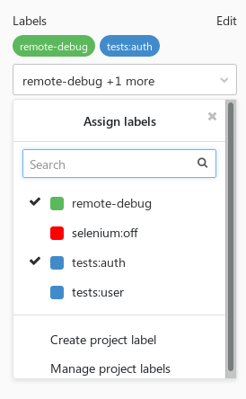
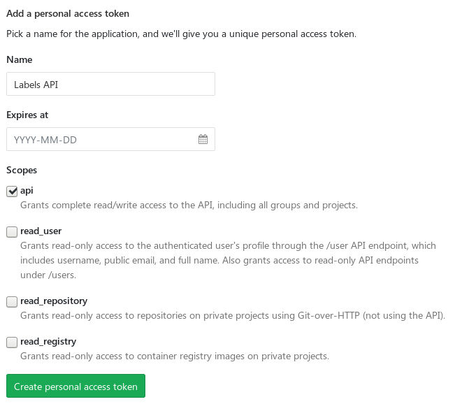
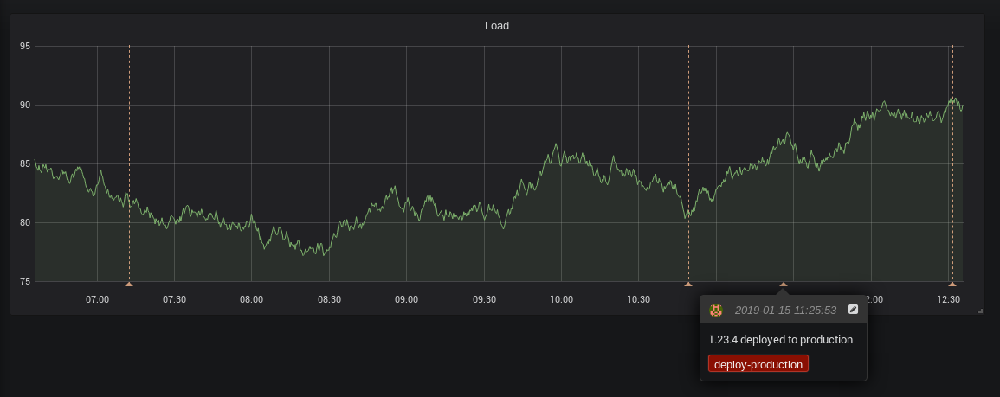
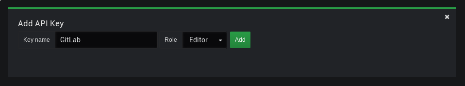

Советы по созданию нестандартных рабочих процессов в GitLab CI / Блог компании Флант

_**Прим. перев.**: Оригинальную статью написал Miłosz Smółka — один из основателей небольшой польской компании [Three Dots Labs](https://threedotslabs.com/), специализирующейся на «продвинутых backend-решениях». Автор опирается на свой опыт активной эксплуатации GitLab CI и делится накопленными советами для других пользователей этого Open Source-продукта. Прочитав их, мы поняли, насколько нам близки описанные им проблемы, поэтому решили поделиться предлагаемыми решениями с более широкой аудиторией._

На этот раз я затрону более продвинутые темы в GitLab CI. Частой задачей здесь является реализация в пайплайне нестандартных возможностей. Большинство советов специфичны для GitLab, хотя некоторые из них можно применить и к другим системам CI.

## Запуск интеграционных тестов

Как правило, проверку кода с помощью **юнит-тестов** легко подключить к любой системе CI. Обычно это не сложнее, чем запустить одну из команд, встроенных в стандартный набор утилит языка программирования. В таких тестах вы скорее всего будете использовать различные моки и заглушки, чтобы спрятать детали реализации и сосредоточиться на тестировании конкретной логики. Например, можно использовать in-memory-БД в качестве хранилища или написать заглушки для HTTP-клиентов, которые будут всегда возвращать уже подготовленные ответы.

Однако рано или поздно вам понадобятся **интеграционные тесты**, чтобы покрыть тестами более нестандартные ситуации. Не буду вдаваться в дискуссию обо всех возможных типах тестирования и просто скажу, что под _интеграционными_ я подразумеваю тесты, которые используют какой-либо вид внешних ресурсов. Это может быть настоящий сервер БД, HTTP-сервис, подключаемое хранилище и т.п.

В GitLab легко запускать подключаемые ресурсы как Docker-контейнеры, связанные с контейнером, в котором запущены скрипты. Эти зависимости можно определить с помощью [`services`](https://docs.gitlab.com/ee/ci/docker/using_docker_images.html#what-is-a-service). Они доступны по имени образа или же по выбранному вами названию, если указать его в поле `alias`.

Вот простой пример использования подключаемого контейнера с MySQL:

    integration_tests:
      stage: tests
      services:
        - name: mysql:8
          alias: db
      script:
        - ./run_tests.sh db:3306
    

В таком случае в тестовых скриптах понадобится подключаться к хосту `db`. Использование алиаса — это, как правило, хорошая идея, поскольку позволяет заменять образы без необходимости в модификации кода тестов. Например, образ `mysql` можно заменить на `mariadb`, а скрипт будет по-прежнему корректно отрабатывать.

#### Ожидание контейнеров

Поскольку подключаемые контейнеры требуют времени для своей загрузки, возможно, вам потребуется реализовать ожидание перед тем, как отправлять какие-либо запросы. Простой путь — скрипт [wait-for-it.sh](https://github.com/vishnubob/wait-for-it) с определяемым таймаутом.

### Использование Docker Compose

Для большинства случаев `services` должно быть достаточно. Однако иногда может потребоваться и взаимодействие с внешними сервисами. Например, в случае запуска Kafka и ZooKeeper в двух отдельных контейнерах (так собраны официальные образы). Другой пример — запуск тестов с динамическим числом узлов, например Selenium. Лучшим решением для запуска таких сервисов будет [Docker Compose](https://docs.docker.com/compose/):

    version: '3'
    services:
      zookeeper:
        image: confluentinc/cp-zookeeper
        environment:
          ZOOKEEPER_CLIENT_PORT: 2181
    
      kafka:
        image: confluentinc/cp-kafka
        environment:
          KAFKA_ZOOKEEPER_CONNECT: zookeeper:2181
          KAFKA_ADVERTISED_LISTENERS: PLAINTEXT://kafka:9092
        ports:
          - 9092:9092
    

Если вы используете свою инсталляцию с GitLab runner'ами на заслуживающих доверия серверах, запуск Docker Composer можно выполнить через [Shell executor](https://docs.gitlab.com/runner/executors/shell.html). Другая возможная опция — контейнер [Docker in Docker](https://hub.docker.com/_/docker) (`dind`). Но в таком случае прочитайте сначала [эту статью](https://jpetazzo.github.io/2015/09/03/do-not-use-docker-in-docker-for-ci/).

Один из способов использования Compose — настроить окружение, запустить тесты и затем всё уничтожить. Простой Bash-скрипт будет выглядеть так:

    docker-compose up -d
    ./run_tests.sh localhost:9092
    docker-compose down

Пока вы запускаете тесты в минимальном окружении, всё будет хорошо. Хотя может возникнуть ситуация, в которой понадобится установка некоторых зависимостей… Есть другой способ запуска тестов в Docker Compose — он позволяет создавать свой образ Docker с тестовым окружением. В одном из контейнеров вы запускаете тесты и выходите с соответствующим кодом возврата:

    version: '3'
    services:
      zookeeper:
        image: confluentinc/cp-zookeeper
        environment:
          ZOOKEEPER_CLIENT_PORT: 2181
    
      kafka:
        image: confluentinc/cp-kafka
        environment:
          KAFKA_ZOOKEEPER_CONNECT: zookeeper:2181
          KAFKA_ADVERTISED_LISTENERS: PLAINTEXT://kafka:9092
    
      tests:
        image: registry.example.com/some-image
        command: ./run_tests.sh kafka:9092
    

Заметьте, что мы избавились от необходимости сопоставлять порты. В данном примере тесты могут взаимодействовать со всеми сервисами напрямую.

А их запуск осуществляется одной командой:

    docker-compose up --exit-code-from tests

Опция `--exit-code-from` подразумевает `--abort-on-container-exit`, что означает: всё окружение, инициированное `docker-compose up`, будет остановлено после того, как один из контейнеров завершит работу. Код завершения этой команды будет эквивалентен exit-коду выбранного сервиса (т.е. это `tests` в примере выше). Если команда, запускающая тесты, завершится с ненулевым кодом, то и вся команда `docker-compose up` завершит работу с ним же.

## Использование лейблов как CI-тегов

**Предупреждение**: это скорее необычная идея, но мне она показалась очень полезной и гибкой.

Как вы, возможно, знаете, у GitLab есть фича Labels, доступная на уровне проекта и группы. Лейблы могут устанавливаться на тикеты и merge request'ы. Однако у них нет взаимосвязи с пайплайнами.

Небольшая доработка позволит получить доступ к лейблам merge request'а в скриптах job'а. В GitLab 11.6 всё стало ещё проще, т.к. появилась переменная окружения `CI_MERGE_REQUEST_IID` (да, именно с `IID`, а не `ID`), если пайплайн использует `only: merge_requests`.

Если же `only: merge_requests` не используется или вы работаете с более старой версией GitLab, MR всё ещё можно получить — с помощью обращения к API:

    curl "$CI_API_V4_URL/projects/$CI_PROJECT_ID/repository/commits/$CI_COMMIT_SHA/merge_requests?private_token=$GITLAB_TOKEN"

Нужное нам поле — `iid`. Однако помните, что для заданного коммита может вернуться множество MR'ов.

Когда MR IID получен, осталось лишь обратиться к [Merge Requests API](https://docs.gitlab.com/ee/api/merge_requests.html) и воспользоваться полем `labels` из ответа:

    curl "$CI_API_V4_URL/projects/$CI_PROJECT_ID/merge_requests/$CI_MERGE_REQUEST_IID?private_token=$GITLAB_TOKEN"

  

### Авторизация

К сожалению, на данный момент использовать `$CI_JOB_TOKEN` для доступа к API проекта [не представляется возможным](https://gitlab.com/gitlab-org/gitlab-ce/issues/29566) (по крайней мере, если проект не является публичным). Если у проекта ограниченный доступ (internal или private), для авторизации в GitLab API понадобится сгенерировать персональный API-токен.

Однако это не самое безопасное решение, поэтому будьте внимательны. Если токен попадёт в нехорошие руки, то с ним может появиться и доступ на запись во все ваши проекты. Один из способов снижения рисков — создать отдельный аккаунт с правом только на чтение репозитория и генерирование персонального токена для этого аккаунта.

#### Насколько безопасны ваши переменные?

Ещё несколько версий назад секция _Variables_ называлась _Secret Variables_, что звучит так, словно они были созданы для надёжного хранения учётных данных и другой критичной информации. На самом же деле переменные просто спрятаны от пользователей, у которых нет прав Maintainer. Они не зашифрованы на диске, и их утечка может с лёгкостью произойти через переменные окружения в скриптах.

Помните об этом, когда добавляете любые переменные, и рассмотрите варианты хранения секретов в более безопасных решениях (например, [Vault от HashiCorp](https://www.vaultproject.io/)).

### Случаи использования

Что делать со списками лейблов — решать вам. Вот некоторые идеи:

*   Используйте их для сегментации тестов.
*   Используйте семантику ключ-значение с двоеточием в качестве разделителя (например, лейблы вроде `tests:auth`, `tests:user`)
*   Включайте определённые фичи для job'ов.
*   Разрешайте отладку определённых job'ов, если лейбл существует.

  

## Вызов внешних API

Хоть GitLab и поставляется с набором уже доступных возможностей, весьма вероятно, что вы захотите использовать и другие утилиты, которые можно проинтегрировать с пайплайнами. Простейший способ реализации — это, конечно, вызовы старого доброго `curl`.

Если вы создаёте свои инструменты, их можно научить прослушивать [GitLab Webhooks](https://docs.gitlab.com/ee/user/project/integrations/webhooks.html) (см. вкладку **Integrations** в настройках проекта). Однако если собираетесь использовать их с какими-то критичными системами, убедитесь, что они отвечают требованиям высокой доступности.

### Пример: аннотации Grafana

Если вы работаете с [Grafana](https://grafana.com/), [аннотации](http://docs.grafana.org/reference/annotations/) — отличный способ отмечать на графиках события, которые происходили в течение времени. Их можно добавлять не только вручную по клику в GUI, но и обращениями к [Grafana REST API](http://docs.grafana.org/http_api/annotations/):

Для доступа к API понадобится сгенерировать API Key. Рассмотрите возможность создания отдельного юзера с ограниченным доступом:

Определите две переменные в настройках проекта:

*   `GRAFANA_URL` — URL к инсталляции Grafana (например, `https://grafana.example.com`);
*   `GRAFANA_APIKEY` — сгенерированный ключ к API.

Чтобы иметь возможность его повторного использования, положите скрипт в [репозиторий с общими скриптами](https://threedots.tech/post/keeping-common-scripts-in-gitlab-ci/):

    #!/bin/bash
    set -e
    
    if [ $# -lt 2 ]; then
        echo "Usage: $0 <text> <tag>"
        exit 1
    fi
    
    readonly text="$1"
    readonly tag="$2"
    readonly time="$(date +%s)000"
    
    cat >./payload.json <<EOF
    {
        "text": "$text",
        "tags": ["$tag"],
        "time": $time,
        "timeEnd": $time
    }
    EOF
    
    curl -X POST "$GRAFANA_URL/api/annotations" \
         -H "Authorization: Bearer $GRAFANA_APIKEY" \
         -H "content-type: application/json" \
         -d @./payload.json

Теперь можно добавить в конфигурацию CI его вызов с нужными параметрами:

    deploy:
        stage: deploy
        script:
          - $SCRIPTS_DIR/deploy.sh production
          - $SCRIPTS_DIR/grafana-annotation.sh "$VERSION deployed to production" deploy-production

Эти вызовы можно поместить в скрипт `deploy.sh`, чтобы упростить конфигурацию CI.

## Бонус: быстрые советы

У GitLab [замечательная документация](https://docs.gitlab.com/ee/ci/yaml) по всем возможным ключевым словам, которые можно использовать для конфигурации CI. Не хочу дублировать её содержимое здесь, но укажу на некоторые полезные кейсы. Кликайте по заголовкам для знакомства с документацией по теме.

### [Продвинутое использование only/except](https://docs.gitlab.com/ee/ci/yaml/#only-and-except-simplified)

С помощью задания шаблонов для переменных CI можно определять нестандартные сборки для некоторых веток. Это может помочь, например, для определения push'ей срочных исправлений, но не стоит этим злоупотреблять:

    only:
      refs:
        - branches
      variables:
        - $CI_COMMIT_REF_NAME =~ /^hotfix/

В GitLab есть множество [предопределённых переменных](https://docs.gitlab.com/ee/ci/variables/#predefined-variables-environment-variables) в каждом CI job'е — воспользуйтесь ими.

### [YAML anchors](https://docs.gitlab.com/ee/ci/yaml/#anchors)

Используйте их во избежание дублирования.

С версии 11.3 можно также воспользоваться ключевым словом [extends](https://docs.gitlab.com/ee/ci/yaml/#extends):

    .common_before_script: &common_before_script
      before_script:
        - ...
        - ...
    
    deploy:
      <<: *common_before_script

  

### [Исключение артефактов](https://docs.gitlab.com/ee/ci/yaml/#dependencies)

По умолчанию все артефакты, собираемые в пайплайне, будут переданы всем последующим job'ам. Если же явно перечислить артефакты, от которых зависят job'ы, можно сэкономить время и дисковое пространство:

    dependencies:
      - build

Либо — наоборот — полностью пропустить все, если ни один из них не требуется:

    dependencies: []

  

### [Стратегия Git](https://docs.gitlab.com/ee/ci/yaml/#git-strategy)

Пропустите клонирование репозитория, если job не будет использовать эти файлы:

    variables:
      GIT_STRATEGY: none

Всё!

Спасибо за чтение! С обратной связью и по вопросам обращайтесь ко мне в [Twitter](https://twitter.com/m1_10sz) или [Reddit](https://www.reddit.com/user/mi_losz).

Больше советов по GitLab можно прочитать в предыдущих публикациях:

*   [Keeping common scripts in GitLab CI](https://threedots.tech/post/keeping-common-scripts-in-gitlab-ci/);
*   [Automatic Semantic Versioning in GitLab CI](https://threedots.tech/post/automatic-semantic-versioning-in-gitlab-ci/).

  

## P.S. от переводчика

Читайте также в нашем блоге:

*   «[GitLab CI для непрерывной интеграции и доставки в production. Часть 1: наш пайплайн](https://habr.com/ru/company/flant/blog/332712/)»;
*   «[GitLab CI для непрерывной интеграции и доставки в production. Часть 2: преодолевая трудности](https://habr.com/ru/company/flant/blog/332842/)»;
*   «[Сборка проектов с GitLab CI: один .gitlab-ci.yml для сотни приложений](https://habr.com/ru/company/flant/blog/340996/)»;
*   «[Сборка и дeплой приложений в Kubernetes с помощью dapp и GitLab CI](https://habr.com/ru/company/flant/blog/345580/)»;
*   «[Лучшие практики CI/CD с Kubernetes и GitLab (обзор и видео доклада)](https://habr.com/ru/company/flant/blog/345116/)».