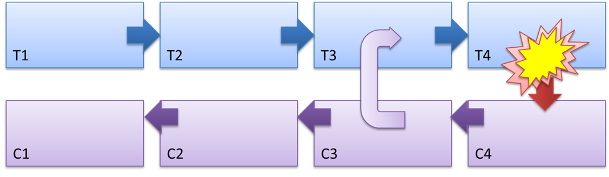

Согласованность данных в высоконагруженных системах

[Seva_Morotskiy](https://habr.com/users/Seva_Morotskiy/ "Автор публикации") вчера в 11:06

## Проблематика

Практически любая информационная система требует хранения данных на постоянной основе. В большинстве систем с малой и средней нагрузкой эту функцию выполняют реляционные СУБД, неоспоримым преимуществом которых является гарантия согласованности данных.

Классический пример, объясняющий, что такое согласованность данных – операция перевода денежных средств с одного счёта на другой. В момент, когда операция изменения баланса одного счёта уже выполнилась, а другого – ещё не успела, может произойти сбой. Тогда с одного счёта средства будут списаны, а на другой не поступят. Такое состояние данных системы называется рассогласованным, и, пожалуй, нет необходимости объяснять, к каким последствиям это может привести. Реляционные СУБД предоставляют механизм транзакций, гарантирующий согласованность данных в любой момент времени. Транзакция – это конечный набор операций, который переводит одно согласованное состояние в другое согласованное состояние. В случае ошибки на любом шаге СУБД отменяет все выполненные ранее операции и возвращает данные к первоначальному согласованному состоянию. Иными словами – либо выполнятся все операции, либо ни одной.

Что касается крупномасштабных систем, то в них далеко не всегда возможно использовать единую базу данных из-за слишком большой нагрузки. В таких случаях каждому модулю системы (сервису) предоставляется своя отдельная база данных. В этом случает встаёт вопрос как для такой кластерной архитектуры обеспечить согласованность данных.

## Решение проблемы согласованности данных

Один из вариантов решения – распределённые транзакции. Сначала все узлы кластера должны согласиться, что выполнение операции возможно, затем выполняется фиксация изменений на всех узлах. Поскольку никакого общего устройства хранения у узлов нет, то единственный способ прийти к общему мнению — договориться, используя какой-либо протокол распределенного консенсуса.

Простой протокол для фиксации глобальных транзакций — двухфазный коммит (2PC). Узел, выполняющий транзакцию, считается координатором. На подготовительной фазе (prepare) координатор сообщает остальным узлам о фиксации транзакции и дожидается от них подтверждения, что они готовы выполнить фиксацию. Если хотя бы один узел не готов — транзакция обрывается. На фазе фиксации (commit) координатор сообщает всем узлам о решении зафиксировать транзакцию. При получении от всех подтверждения, что все ок, координатор тоже фиксирует транзакцию.

#### Рисунок 1 – Общая схема двухфазного коммита

Этот протокол позволяет обойтись минимумом сообщений, но не устойчив к сбоям. Например, при отказе координатора после фазы prepare, остальные узлы не имеют информации о том, должна ли транзакция быть зафиксирована или отменена (им придется ждать устранения сбоя). Ещё один серьёзный недостаток 2PC (и других протоколов распределённых транзакций, например 3PC) – при росте количества узлов кластера производительность двухфазных коммитов падает.

#### Рисунок 2 – Зависимость скорости выполнения двухвазного коммита от количества серверов в кластере СУБД

Кроме того, подход распределённых транзакций накладывает ограничение: все модули системы должны использовать одну и туже СУБД, что не всегда удобно.

Другой вариант – обеспечить некий механизм, позволяющий работать с различными базами данных (для сервисов) как с единой базой данных (решить проблему с целостностью данных в распределённой базе). При этом требуется некий аналог транзакции для распределённой системы («бизнес-транзакция»).

В обычных транзакциях, а также в двухфазных коммитах, все операции контролируются механизмом транзакций (с использованием блокировок), и это делается с целью обеспечить возможность откатить любую операцию (пессимистический подход – любую операцию считаем потенциально вызывающей сбой). Это является узким местом системы. Альтернативный вариант – так называемый оптимистический подход: считаем, что большинство операций завершаются успешно. Дополнительные же действия производим уже по факту произошедшего сбоя. Т.е. уменьшаем издержки для большинства операций, что приводит к повышению производительности.

## Что такое Saga (Сага) и как она работает

Альтернативой транзакциям для микросервисной архитектуры является Saga. Saga (сага) представляет собой набор шагов, выполняемых различными модулями системы (сервисами); так же требуется сервис саги, отвечающий за операцию (бизнес-транзакцию) в целом. Шаги связаны через граф событий. После выполнения саги система должна перейти из одного согласованного состояния в другое (в случае успешного выполнения), или вернутся к предыдущему согласованному состоянию (в случае отмены).

Как реализовать такой возврат или откат бизнес-транзакции? Для этого в сагах используется механизм отменяемости шагов (компенсирующие действия). Например, один из шагов был выполнен успешно (допустим в таблицу базы данных пользователей была добавлена запись), но на одном из следующих шагов произошёл сбой, и всю сагу следует отменить. Тогда этому же сервису поступает команда – отменить действие. Но в СУБД сервиса локальная транзакция уже завершена, запись пользователя добавлена. Тогда для возврата к предыдущему состоянию сервис должен выполнить компенсирующее действие (в нашем примере – удалить запись). Отменяемость шагов позволяет реализовать в рамках саги атомарность (Atomicity) – «всё или ничего» — все шаги выполняются или компенсируются.

#### Рисунок 3 – Механизм работы Saga и природа компенсирующего действия

На рисунке 3 шаги саги обозначены как T1...T4, компенсирующие действия: C1...C4.  
Саги поддерживают идемпотентность шагов (действие, многократное повторение которого эквивалентно однократному). Подход саг обеспечивает возможность повторить любой шаг (например, если не получили отклик об успешном завершении). Так же идемпотентность позволяет восстановить состояние при потере данных на каком-либо узле (сбой и восстановление). При выполнении шага каждый сервис должен определять (по ключу идемпотентности) выполнял он уже этот шаг, или нет (если нет – выполнить, иначе — пропустить). Для компенсирующих действий тоже возможно добавление ключей идемпотентности и повторы операций (обеспечение персистентности/устойчивости).

## Резюме

Из четырёх требований к транзакционной системе ACID (атомарность, согласованность, изолированность, устойчивость) механизм саг позволяет реализовать три – все, кроме изолированности. Отсутствие изолированности может приводить к аномалиям («грязные чтения», «неповторяющиеся чтения», перезапись изменений между различными бизнес-транзакциями и т.д.). Для преодоления подобных ситуаций требуется использовать дополнительные механизмы, например версионность изменяемых объектов.

Саги позволяют решить следующие задачи:

*   Обеспечивать зависимые изменения данных для бизнес критичных данных;
*   Иметь возможность задать строгий порядок шагов;
*   Соблюсти 100% consistency (согласовать данные даже в случае аварий);
*   Обеспечить проверку работоспособности на всех уровнях.

  

## Область применения и примеры применения

Саги часто используют в системах с большим количеством запросов. Например, популярные почтовые сервисы, социальные сети. Однако подход может найти применение и в проектах меньшего масштаба.

Наша компания имеет опыт разработки системы учёта для крупного предприятия, которая была рассчитана на несколько десятков пользователей и все данные хранились в одной реляционной СУБД. Проблема возникла при реализации автоматического расчёта запланированных работ: в некоторых случаях расчёты были очень большими и требовали вставки миллионов записей в таблицы СУБД, что значительно нагружало СУБД и замедляло работу всей системы.

Было найдено решение — вынести логику расчёта работ в отдельный сервис со своей отдельной СУБД для хранения самих работ и сопутствующих объектов. Согласованность данных обеспечивалась при помощи саги. Если при расчёте происходил сбой, то в основной модуль приложения поступала команда отменить логическую операцию расчёта.

## Библиотеки с поддержкой Saga

Приложение разрабатывалось на .Net, и для данной технологии существует несколько библиотек-менеджеров сервисов с поддержкой саг. Мы рассматривали библиотеки NServiceBus, MassTransit и Rebus. В итоге остановились на Rebus — эта библиотека проще для освоения, при этом полностью реализует принцип саг и свободна для использования. NServiceBus и MassTransit — более сложные инструменты с массой дополнительных возможностей. В рамках нашей задачи они не потребовались, но возможно в будущих проектах с более сложной логикой будет целесообразно их использовать.

Tags:

*   [saga](https://habr.com/search/?q=%5Bsaga%5D&target_type=posts)