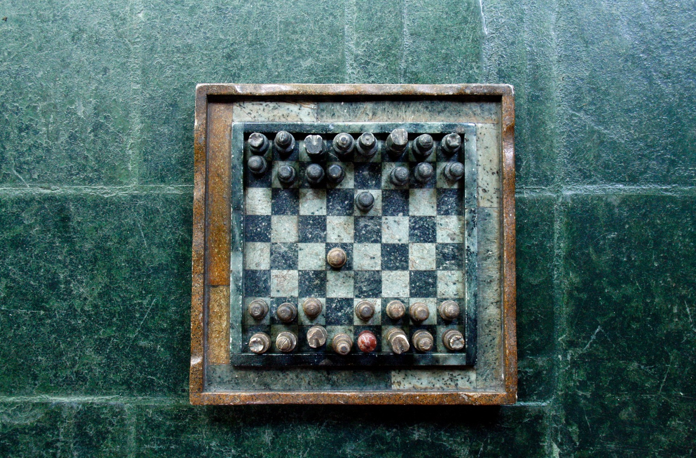
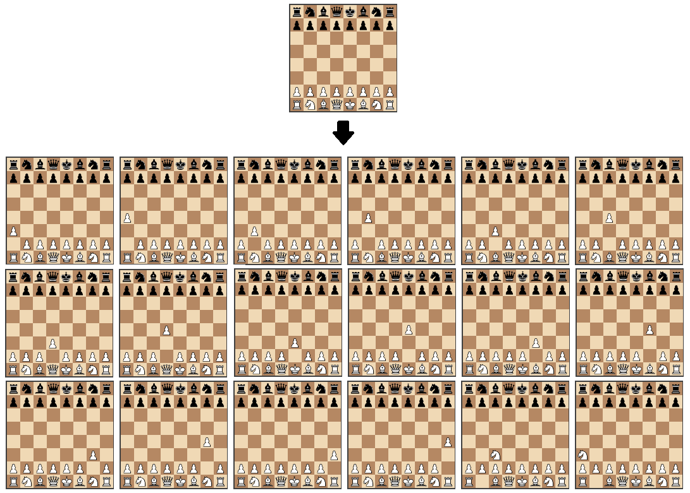
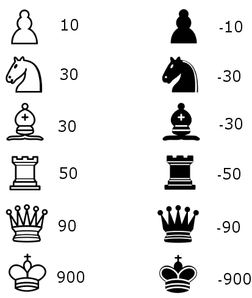
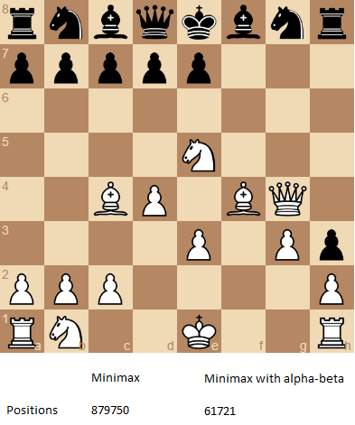
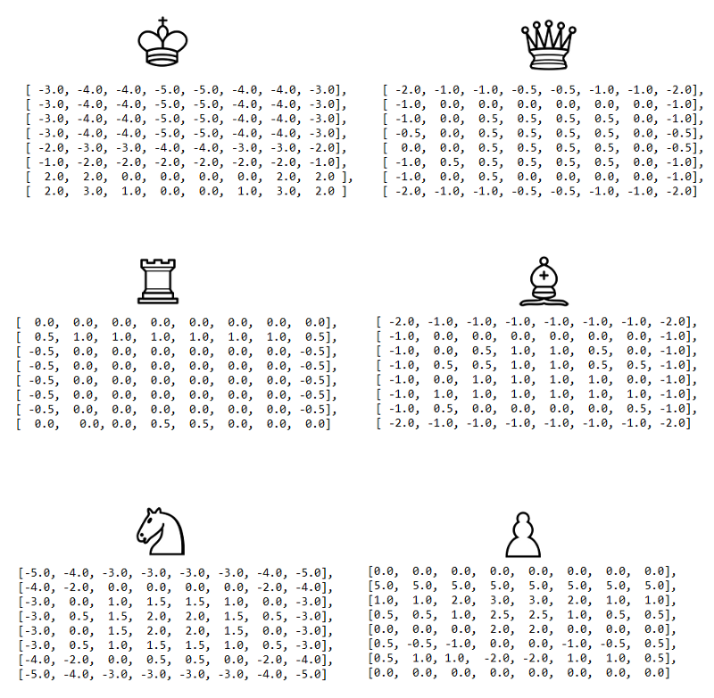

Создаем несложный шахматный ИИ: 5 простых этапов / Блог компании Skillbox

Перевели для вас статью Лори Хартикка (Lauri Hartikka) о создании простейшего ИИ для шахмат. Она написана еще в 2017 году, но базовые принципы остались теми же. Все файлы, которые использовал Лори, тоже доступны.

Простой искусственный интеллект, который умеет играть в шахматы, можно создать на базе четырех концепций:

1.  1\. Перемещение;
2.  2\. Оценка доски;
3.  [3\. Минимакс](https://ru.wikipedia.org/wiki/%D0%9C%D0%B8%D0%BD%D0%B8%D0%BC%D0%B0%D0%BA%D1%81);
4.  [4\. Альфа-бета-отсечение](https://ru.wikipedia.org/wiki/%D0%90%D0%BB%D1%8C%D1%84%D0%B0-%D0%B1%D0%B5%D1%82%D0%B0-%D0%BE%D1%82%D1%81%D0%B5%D1%87%D0%B5%D0%BD%D0%B8%D0%B5). На каждом этапе работы с алгоритмом будет использоваться одна из них, это позволит постепенно совершенствовать игровые способности ИИ.

> **Skillbox рекомендует:** Прикладной онлайн-курс [«Аналитик данных Python»](https://skillbox.ru/python-data/?utm_source=skillbox.media&utm_medium=habr.com&utm_campaign=PTNANA&utm_content=articles&utm_term=chess).
> 
> **Напоминаем:** _для всех читателей «Хабра» — скидка 10 000 рублей при записи на любой курс Skillbox по промокоду «Хабр»._

Готовый исходный код можно найти на [GitHub](https://github.com/lhartikk/simple-chess-ai).

  

### Этап 1\. Визуализация шахматной доски с генерацией ходов

На этом этапе мы будем использовать библиотеки [chess.js](https://github.com/jhlywa/chess.js) для генерации ходов и [chessboard.js](https://github.com/oakmac/chessboardjs/) для визуализации доски. Библиотека, которая отвечает за генерацию ходов, позволяет применять все шахматные правила, так что мы можем рассчитывать каждое действие для конкретного расположения фигур.

  
При клике на картинке она откроется в полном разрешении.

Работа с этими библиотеками позволяет сконцентрироваться на главной задаче — поиске и создании алгоритма, который позволяет найти оптимальный ход. Работу начинаем с написания функции, которая возвращает случайный ход из списка всех возможных.

    var calculateBestMove =function(game) {
        
        var newGameMoves = game.ugly_moves();
        return newGameMoves[Math.floor(Math.random() * newGameMoves.length)];
    };

Несмотря на то, что алгоритм не является идеальным игроком в шахматы, для большинства игроков его уровня этого будет вполне достаточно.

  
Черные ходят случайным образом. ([исходники и игра онлайн](https://jsfiddle.net/lhartikk/m14epfwb/4/))

### Этап 2\. Оценка позиции

Теперь давайте разберемся, у какой стороны преимущество в том или ином положении. Самый простой путь — подсчитать относительную силу фигур на доске, это можно сделать при помощи таблицы.

Используя функцию оценки, мы получаем возможность создать алгоритм, который выбирает ход с максимальной оценкой.

    var calculateBestMove = function (game) {
     
        var newGameMoves = game.ugly_moves();
        var bestMove = null;
        
        var bestValue = -9999;
     
        for (var i = 0; i < newGameMoves.length; i++) {
            var newGameMove = newGameMoves[i];
            game.ugly_move(newGameMove);
     
            
            var boardValue = -evaluateBoard(game.board())
            game.undo();
            if (boardValue > bestValue) {
                bestValue = boardValue;
                bestMove = newGameMove
            }
        }
     
        return bestMove;
     
    };

В принципе, уровень прежний, но алгоритм уже может взять чужую фигуру, когда такая возможность есть.

  
Черные получили возможность брать белые фигуры. (Исходники и игра [здесь](https://jsfiddle.net/lhartikk/m5q6fgtb/1/)).

### Этап 3\. Дерево поиска с минимакс

После этого мы создаем дерево поиска. Теперь программа может выбрать из него лучший ход. Это делается при помощи минимакс-алгоритма.

Здесь рекурсивное дерево с отображением всех возможных ходов анализируется до заданной глубины. Позиция же оценивается по листьям нашего дерева.

Далее мы возвращаем минимальное или максимальное значение потомка в родительский узел. Все зависит от того, ход какой стороны сейчас просчитывается. Другими словами, результат максимизируется или минимизируется на каждом из уровней.

  
Здесь лучшим ходом для белых является b2-c3, поскольку он гарантирует, что игрок доберется до позиции с оценкой -50.

    var minimax = function (depth, game, isMaximisingPlayer) {
        if (depth === 0) {
            return -evaluateBoard(game.board());
        }
        var newGameMoves = game.ugly_moves();
        if (isMaximisingPlayer) {
            var bestMove = -9999;
            for (var i = 0; i < newGameMoves.length; i++) {
                game.ugly_move(newGameMoves[i]);
                bestMove = Math.max(bestMove, minimax(depth - 1, game, !isMaximisingPlayer));
                game.undo();
            }
            return bestMove;
        } else {
            var bestMove = 9999;
            for (var i = 0; i < newGameMoves.length; i++) {
                game.ugly_move(newGameMoves[i]);
                bestMove = Math.min(bestMove, minimax(depth - 1, game, !isMaximisingPlayer));
                game.undo();
            }
            return bestMove;
        }
    };

С минимакс-алгоритмом наш ИИ уже стал понимать базовую тактику шахмат.

Минимакс с глубиной 2 (Исходники и игра [здесь](https://jsfiddle.net/k96eoq0q/1/))

Стоит отметить, что эффективность минимакс-алгоритма увеличивается с глубиной поиска. За это отвечает следующий этап.

### Этап 4\. Альфа-бета-отсечения

Это метод оптимизации минимакс-алгоритма, дающий возможность игнорировать некоторые ветви в дереве поиска. А это позволяет увеличить глубину поиска, затрачивая прежний объем ресурсов.

Альфа-бета-отсечение основано на ситуации, когда мы можем остановить оценку определенной ветви, если обнаруживается, что новый ход приведет к худшей ситуации, чем та, которую мы видели при оценке предыдущего.

На результат минимакса оптимизация не влияет, но все начинает работать быстрее.

Этот алгоритм гораздо более эффективен в том случае, если сначала проверить пути, ведущие к хорошим ходам.

  
Изображение демонстрирует ходы, которые становятся ненужными в процессе использования альфа-бета-отсечения.

Как видите, с альфа-бета-отсечением минимакс оптимизируется, и весьма значительно.

  
Количество позиций, которые требуется оценить в случае поиска с глубиной 4 и начальной позицией, которая изображена выше. (исходники и игра доступны [здесь](https://jsfiddle.net/Laa0p1mh/3/))

### Этап 5\. Улучшенная функция оценки

Изначальная функция оценки достаточно простая, поскольку она просто считает очки фигур, находящихся на доске. Для ее оптимизации можно учитывать положение фигур. К примеру, если разместить коня в центре доски, то он становится дороже — спектр доступных ходов для этой фигуры расширится.

На этом этапе мы будем работать с несколько видоизмененной версией квадратных таблиц, изначально описанной в [вики Chess Programming](https://chessprogramming.wikispaces.com/Simplified+evaluation+function).

И теперь наш алгоритм играет уже весьма неплохо, конечно, по сравнению со средним игроком.

  
Исходники и игра доступны [здесь](https://jsfiddle.net/q76uzxwe/1/)

### Заключение

Достоинством предложенного алгоритма является то, что он не делает совсем уж глупых ошибок. Конечно, стратегию здесь сложно назвать совершенной, но тем не менее.

Реализация нашего алгоритма выполнена всего в 200 строк кода, так что базовые принципы достаточно просты. Финальную версию программы можно <a href=«[github.com/lhartikk/simple-chess-ai](https://github.com/lhartikk/simple-chess-ai)'>видеть на GitHub.

В алгоритм можно добавить и другие модули, включая:

*   [упорядочивание ходов](https://chessprogramming.wikispaces.com/Move+Ordering);
*   ускорение [генерации ходов](https://chessprogramming.wikispaces.com/Move+Generation);
*   [и оценку эндшпиля](https://chessprogramming.wikispaces.com/Endgame).

Больше о шахматных алгоритмах можно узнать на [Chess Programming Wiki](https://chessprogramming.wikispaces.com/).

> **Skillbox рекомендует:**
> 
> *   Практический курс [«Мобильный разработчик PRO»](https://skillbox.ru/agima/?utm_source=skillbox.media&utm_medium=habr.com&utm_campaign=AGIMA&utm_content=articles&utm_term=chess)
> *   Онлайн-курс [«Профессия веб-разработчик»](https://skillbox.ru/webdev/?utm_source=skillbox.media&utm_medium=habr.com&utm_campaign=WEBDEV&utm_content=articles&utm_term=chess)
> *   Двухлетний практический курс [«Я — веб-разработчик PRO»](https://iamwebdev.skillbox.ru/?utm_source=skillbox.media&utm_medium=habr.com&utm_campaign=WEBDEVPRO&utm_content=articles&utm_term=chess).