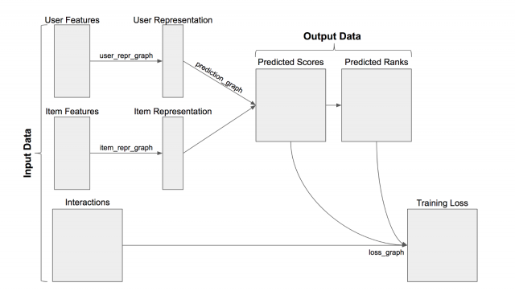

Создаем рекомендательную систему

Рекомендательные системы используются во многих облачных сервисах для предоставления пользователям персонализированные _товары или услуги_ (далее — _предметы_). Для этого производится обучение прогнозных моделей на предыдущих взаимодействиях пользователей с _предметами_, чтобы определить вкусы пользователей и улучшить точность рекомендации.

В стой статье мы рассмотрим пример создания новой рекомендательной в среде Python с использованием [TensorRec](https://www.pydoc.io/pypi/tensorrec-0.11/autoapi/tensorrec/index.html), включая методы обработки входных данных и алгоритмы. Также мы создадим прототип [рекомендательной системы](https://github.com/jfkirk/tensorrec/blob/master/examples/getting_started.py).  

### Общий обзор рекомендательной системы

[TensorRec](https://www.pydoc.io/pypi/tensorrec-0.11/autoapi/tensorrec/index.html) — это библиотека Python для построения рекомендательных систем. Система рекомендаций TensorRec потребляет три части входных данных: 1) предикторы, извлекаемые из пользователей; 2) придикторы, извлекаемые из _предметов_ и взаимодействия пользователя с _элементами_. Основываясь на особенностях пользователя / _предмета_, система предскажет, какие предметы рекомендовать. Взаимодействия используются во время обучения модели: прогнозы сравниваются с взаимодействиями оптимизируя модель с помощью штрафов, которых система учится уменьшать.

Для разработки прототипа рекомендательной системы необходимо решить три задачи: учет взаимодействия пользователей с _предметами_, выбор предикторов и структурирование самих рекомендаций.

Результат работы рекомендательной системы выглядят следующим образом:

    userId, movieId, rating, timestamp
    1,      1,       4.0,    964982703
    1,      3,       4.0,    964981247
    1,      6,       4.0,    964982224
    1,      47,      5.0,    964983815
    1,      50,      5.0,    964982931
    1,      70,      3.0,    964982400
    ...

Строки данных записей представляют рейтинги: предпочтения пользователей касательно фильма. Эти рейтинги будут использоваться для наших взаимодействий. Нашим первым шагом к обучению рекомендательной модели является форматирование данных взаимодействия. Ниже [код](https://gist.github.com/jfkirk/90928701b75ea1ddf6f1ec64fd4bd969#file-tensorrec_getting_started_loading-py), который поможет считывать CSV файл с рейтингами.

    
    print('Loading ratings')
    with open('ratings.csv', 'r') as ratings_file:
        ratings_file_reader = csv.reader(ratings_file)
        raw_ratings = list(ratings_file_reader)
        raw_ratings_header = raw_ratings.pop(0)
    
    
    
    movielens_to_internal_user_ids = defaultdict(lambda: len(movielens_to_internal_user_ids))
    movielens_to_internal_item_ids = defaultdict(lambda: len(movielens_to_internal_item_ids))
    for row in raw_ratings:
        row[0] = movielens_to_internal_user_ids[int(row[0])]
        row[1] = movielens_to_internal_item_ids[int(row[1])]
        row[2] = float(row[2])
    n_users = len(movielens_to_internal_user_ids)
    n_items = len(movielens_to_internal_item_ids)

На этом этапе мы разбиваем данные с рейтингами на два набора: 1) набор для обучения и 2) набор для тестирования. Наши прототипы будут обучаться на тренировочном наборе и мы оценим их точность с помощью тестового набора. Метод разделения обучающих / тестовых наборов случайным образом может быть не эффективным. Тут существуют более тщательные методы, но мы будем использовать метод случайных выборов, так как это быстро и понятно для целей этого примера.

    
    random.shuffle(raw_ratings)  
    cutoff = int(.8 * len(raw_ratings))
    train_ratings = raw_ratings[:cutoff]
    test_ratings = raw_ratings[cutoff:]

Далее мы реорганизуем эти рейтинги в [редкую матрицу](https://docs.scipy.org/doc/scipy/reference/sparse.html). В этой матрице каждая строка представляет пользователя, а каждый столбец — фильм. Значения \[i, j\] в этой матрице являются взаимодействием пользователя i с фильмом j.

    
    def interactions_list_to_sparse_matrix(interactions):
        users_column, items_column, ratings_column, _ = zip(*interactions)
        return sparse.coo_matrix((ratings_column, (users_column, items_column)),
                                 shape=(n_users, n_items))
    
    
    sparse_train_ratings = interactions_list_to_sparse_matrix(train_ratings)
    sparse_test_ratings = interactions_list_to_sparse_matrix(test_ratings)

  

### Прототип коллаборативного фильтра

Фильтр для коллаборативной работы — это алгоритм, который узнает, какие пользователи имеют схожие вкусы, и рекомендует пользователю _предметы_ на основе того, что понравилось подобным пользователям. Распространенным способом сделать это является матричная факторизация. В матричной факторизации мы должны изучить две матрицы (примеры пользователей и примеры _предметов_), которые при умножении друг на друга аппроксимируют взаимодействия:

В этом случае строки W представляют собой примеры пользователей, столбцы H представляют собой примеры _предметов_, а значения в V представляют собой их взаимодействия. Необходимо обучиться на данных W и H, чтобы получить наиболее приближенное значение приближение V.

Ширина W и высота H являются одинаковым. Это общее измерение называется «количеством компонентов». Модель с большим количеством компонентов будет обучаться на более сложных представлениях пользователей и _предметов_, но это может привести к переобучению данных. В общем, мы хотим попытаться втиснуть много информации в небольшие представления. По этой причине в нашем прототипе мы произвольно выбрали 5 компонентов. При дальнейшем создании прототипа мы должны экспериментировать с увеличением и уменьшением количества компонентов при этом избегать чрезмерного обучения.

TensorRec будет выполнять матричную факторизацию по умолчанию, если ему предоставляются только идентичные матрицы в качестве предикторов пользователя / _предмета_. Эти матрицы идентичности часто называют «индикаторными предикторами».

    
    user_indicator_features = sparse.identity(n_users)
    item_indicator_features = sparse.identity(n_items)
    
    
    cf_model = tensorrec.TensorRec(n_components=5)
    
    
    print("Training collaborative filter")
    cf_model.fit(interactions=sparse_train_ratings,
                 user_features=user_indicator_features,
                 item_features=item_indicator_features)

Теперь мы создали две матрицы индикаторов, построили простую модель коллаборативного фильтра с 5 компонентами и обучили модель. Далее, необходимо проверить, насколько хорошо работает модель.

Чтобы сделать это, мы рассмотрим показатель, называемый Recall, для среднестатистического пользователя, какая доля прогнозируемых _предметов_ попали в верхнюю строчку рейтинга. Другими словами, если наш показатель Recall равен 0,06 из 10 ти, то есть 6% -ная вероятность, что конкретный фильм, который мне нравится, попадет в мои 10 лучших рекомендаций.

Recall является хорошим показателем для многих рекомендательных систем, поскольку он имитирует поведение рекомендательного продукта: если на веб-сайте с фильмами будут показаны только мои 10 лучших рекомендаций, то их алгоритм будет эффективен при размещении фильмов, которые мне нравятся. Мой топ 10.

Прежде чем рассчитывать значение данной метрики, мы хотим решить, какие взаимодействия следует считать «лайк». В этом случае я решил использовать все оценки по крайней мере 4,0 в качестве «лайков» и игнорировать остальные.

    
    sparse_train_ratings_4plus = sparse_train_ratings.multiply(sparse_train_ratings >= 4.0)
    sparse_test_ratings_4plus = sparse_test_ratings.multiply(sparse_test_ratings >= 4.0)
    
    
    
    def check_results(ranks):
        train_recall_at_10 = tensorrec.eval.recall_at_k(
            test_interactions=sparse_train_ratings_4plus,
            predicted_ranks=ranks,
            k=10
        ).mean()
        test_recall_at_10 = tensorrec.eval.recall_at_k(
            test_interactions=sparse_test_ratings_4plus,
            predicted_ranks=ranks,
            k=10
        ).mean()
        print("Recall at 10: Train: {:.4f} Test: {:.4f}".format(train_recall_at_10,
                                                                test_recall_at_10))
    
    
    
    print("Matrix factorization collaborative filter:")
    predicted_ranks = cf_model.predict_rank(user_features=user_indicator_features,
                                            item_features=item_indicator_features)
    check_results(predicted_ranks)

Результат данного скрипта выглядит следующим образом:

    Matrix factorization collaborative filter:
    Recall at 10: Train: 0.0008 Test: 0.0010

Результаты не очень хорошие. Эти результаты говорят нам о том, что среди тестовых фильмов вероятность того, что понравившийся фильм попадет в топ-10, составляет всего 0,1%. Эта система рекомендаций неэффективна, и далее мы будем искать способы ее улучшения.

### Функция потерь

Один из способов настроить нашу систему TensorRec — изменить _график потерь_. Функция потерь принимает во внимание прогнозы и взаимодействия и вычисляет штрафы, которых система будет пытаться уменьшить в процессе обучения.

По умолчанию TensorRec использует RMSE (среднеквадратическая ошибка) в качестве функции потерь. Это означает, что TensorRec пытается точно оценить значения взаимодействий: если я оценил фильм на 4,5, TensorRec пытается получить прогнозируемый балл ровно 4,5.

Это интуитивно понятно, но оно не совпадает с тем, как рекомендательные системы работают во многих продуктах: веб-сайт фильмов не должен точно прогнозировать мой рейтинг, он просто должен ранжировать фильмы, которые мне понравятся, выше фильмов, которые могут не понравиться мне. По этой причине многие системы функционируют путем «обучения ранжированию». Мы можем заставить нашу систему TensorRec работать таким образом, используя функцию потерь, называемый [WMRB](https://arxiv.org/abs/1711.04015).

WMRB, что означает «пакет взвешенного маржинального запаса», работает, беря случайную выборку элементов, с которыми пользователь не взаимодействовал, и сравнивая свои прогнозы с элементами, которые ему нравятся. Со временем это подталкивает элементы, которые нравятся пользователю, на вершину рейтинга.

Мы можем указать TensorRec использовать WMRB, указав его при построении модели и указав размер образца при настройке модели. В этом случае мы хотим обучить модель только положительным рейтингам (≥4,0), поэтому WMRB подталкивает их к вершине.

    
    print("Training collaborative filter with WMRB loss")
    ranking_cf_model = tensorrec.TensorRec(n_components=5,
                                           loss_graph=tensorrec.loss_graphs.WMRBLossGraph())
    ranking_cf_model.fit(interactions=sparse_train_ratings_4plus,
                         user_features=user_indicator_features,
                         item_features=item_indicator_features,
                         n_sampled_items=int(n_items * .01))
    
    
    print("WMRB matrix factorization collaborative filter:")
    predicted_ranks = ranking_cf_model.predict_rank(user_features=user_indicator_features,
                                                    item_features=item_indicator_features)

Ниже показан результат:

    WMRB matrix factorization collaborative filter:
    Recall at 10: Train: 0.1098 Test: 0.0776

Данный результат намного лучше. Мы упали с вероятности 0,1% того, что понравившийся предмет достиг 10 лучших, и с вероятностью 7,76%. Это пример того, насколько эффективной может быть правильная функция потерь. TensorRec позволяет вам задавать и настраивать ваши собственные функции потерь, и вы можете увидеть больше примеров графиков потерь здесь.

### Добавление предикторов из метаданных

Чтобы продолжить эксперименты, мы должны попытаться использовать другие доступные нам данные. В примере MovieLens мы можем использовать метаданные фильма, такие как жанры фильма, для обогащения рекомендаций.

При просмотре сырых данных, метаданные выглядят следующим образом:

    movieId, title,                    genres
    1,       Toy Story (1995),         Adventure|Animation|Children|C...
    2,       Jumanji (1995),           Adventure|Children|Fantasy
    3,       Grumpier Old Men (1995),  Comedy|Romance
    4,       Waiting to Exhale (1995), Comedy|Drama|Romance
    ...

Сначала, мы хотим прочитать эти данные, сопоставить фильмы с нашими внутренними идентификаторами и отслеживать жанры для каждого фильма. Затем мы оцифруем метки жанров с помощью MultiLabelBinarizer от Scikit. Бинаризованный вывод будет нашим предиктором для нашей новой рекомендательной системы.

    
    movie_genres_by_internal_id = {}
    movie_titles_by_internal_id = {}
    for row in raw_movie_metadata:
        row[0] = movielens_to_internal_item_ids[int(row[0])]  
        row[2] = row[2].split('|')  
        movie_genres_by_internal_id[row[0]] = row[2]
        movie_titles_by_internal_id[row[0]] = row[1]
    
    
    print("Raw metadata example:\n{}\n{}".format(raw_movie_metadata_header, 
                                                 raw_movie_metadata[0]))
    
    
    
    movie_genres = [movie_genres_by_internal_id[internal_id]
                    for internal_id in range(n_items)]
    
    
    movie_genre_features = MultiLabelBinarizer().fit_transform(movie_genres)
    n_genres = movie_genre_features.shape[1]
    print("Binarized genres example for movie {}:\n{}".format(movie_titles_by_internal_id[0], 
                                                              movie_genre_features[0]))
    
    
    movie_genre_features = sparse.coo_matrix(movie_genre_features)

Выполнение этого выведет пример необработанных метаданных и бинаризованных жанров:

    Raw metadata example:
    ['movieId', 'title', 'genres']
    [0, 'Toy Story (1995)', ['Adventure', 'Animation', 'Children', 'Comedy', 'Fantasy']]
    Binarized genres example for movie Toy Story (1995):
    [0 0 1 1 1 1 0 0 0 1 0 0 0 0 0 0 0 0 0 0]

  

### Рекомендация на основе контенте

Теперь, когда у нас есть метаданные о наших товарах, мы можем попытаться рекомендовать их исключительно на основе метаданных товаров.

Для этого мы настроим модель TensorRec для использования графа сквозного представления для функций элементов. Для нас это означает, что представления элементов будут такими же, как и функции элементов, которые передаются (только жанры фильмов), и представления пользователей будут отражать, насколько пользователь любит этот конкретный жанр.

    
    print("Training content-based recommender")
    content_model = tensorrec.TensorRec(
        n_components=n_genres,
        item_repr_graph=tensorrec.representation_graphs.FeaturePassThroughRepresentationGraph(),
        loss_graph=tensorrec.loss_graphs.WMRBLossGraph()
    )
    content_model.fit(interactions=sparse_train_ratings_4plus,
                      user_features=user_indicator_features,
                      item_features=movie_genre_features,
                      n_sampled_items=int(n_items * .01))
    
    
    print("Content-based recommender:")
    predicted_ranks = content_model.predict_rank(user_features=user_indicator_features,
                                                 item_features=movie_genre_features)
    check_results(predicted_ranks)

Ниже результаты:

    Content-based recommender:
    Recall at 10: Train: 0.0471 Test: 0.0130

Результаты не так хороши, как ранжирующий фильтр для совместной работы, но со значением Recall в 1,3% он значительно эффективнее, чем наш самый первый коллаборативный фильтр.

У этой системы есть серьезный недостаток: одни жанры не очень описательны и не дают достаточной информации для обоснованной рекомендации. Если бы у нас было больше описательных метаданных (больше тегов, актеров, поджанров и т. Д.), то мы могли бы добиться большего успеха с этой системой рекомендаций на основе контента.

С другой стороны, у этой системы есть явное преимущество: полагаясь только на предикторы метаданных и не используя предикторы индикаторов, мы можем рекомендовать фильмы, которых не было при обучении модели. Точно так же, если у нас есть ценные пользовательские метаданные, мы можем избежать использования пользовательских индикаторов и делать прогнозы для пользователей, которые никогда ранее не взаимодействовали с фильмом. Это называется рекомендацией «холодный старт».

### Создаем рекомендаций

У нас есть обученная модель, и теперь мы можем использовать эту модель, чтобы давать рекомендации для наших пользователей. Мы делаем это, передавая вектор функций пользователя и все предикторы _товара_ в **predict_rank()** и проверяя получившиеся ранги:

    
    u432_features = sparse.csr_matrix(user_indicator_features)[432]
    u432_rankings = hybrid_model.predict_rank(user_features=u432_features,
                                              item_features=full_item_features)[0]
    
    
    
    
    u432_top_ten_recs = numpy.where(u432_rankings <= 10)[0]
    print("User 432 recommendations:")
    for m in u432_top_ten_recs:
        print(movie_titles_by_internal_id[m])

Этот фрагмент кода выведет 10 лучших рекомендаций для пользователя 432. Я выбрал пользователя 432, потому что я знаком с фильмами, которые они оценили, поэтому я чувствую, что могу поставить себя на их место и судить об их рекомендациях. Мы должны отметить, что фильмы, которые пользователь 432 уже оценил, будут по-прежнему включены — если мы хотим отфильтровать их, нам нужно будет сделать это с этапом последующей обработки.

Давайте посмотрим на тренировочные данные пользователя 432, чтобы увидеть, какие фильмы им нравятся:

    User 432 liked:
    Usual Suspects, The (1995)
    Pulp Fiction (1994)
    Silence of the Lambs, The (1991)
    Reservoir Dogs (1992)
    Shawshank Redemption, The (1994)
    Kill Bill: Vol. 1 (2003)
    Social Network, The (2010)
    Trainspotting (1996)
    Arrival (2016)
    My Big Fat Greek Wedding (2002)

Некоторое преступление, какая-то темная комедия и заметная любовь к Тарантино. Давайте посмотрим на рекомендации пользователя 432 от нашей гибридной модели:

    User 432 recommendations:
    Seven (a.k.a. Se7en) (1995)
    Usual Suspects, The (1995)
    Pulp Fiction (1994)
    Silence of the Lambs, The (1991)
    Fargo (1996)
    American Beauty (1999)
    Fight Club (1999)
    Shawshank Redemption, The (1994)
    Departed, The (2006)
    Memento (2000)

Еще несколько криминальных фильмов с определенной темной комедией! Это выглядит довольно хорошо, но давайте проверим тестовые фильмы пользователя 432:

    User 432's held-out movies:
    Fargo (1996)
    American History X (1998)
    Fight Club (1999)
    Dark Knight Rises, The (2012)

И Fargo, и Fight Club выполнили рекомендации пользователя 432 — это отличный результат! Для этого конкретного пользователя мы получили значение Recall 50%.