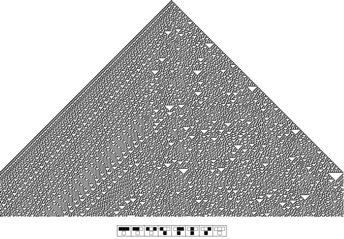

Стивен Вольфрам «Делая большие проекты»

Я люблю делать проекты, которые кажутся безумными.

И полагаю, делал это около 35 лет в науке (я начал молодым) и около 30 лет в технологической сфере. Сегодня я хочу рассказать немного о том, что такое «делать безумные проекты» и немного о моих проектах.

В первом приближении, я работал над тремя большими проектами в моей жизни.  
  
Как вы, возможно, знаете, Mathematica — это язык — система, которая применима во всех случаях, когда людям требуются алгоритмические вычисления.

Ее ранние применения ограничивались математикой и учебными целями. Но в результате она стала одним из видов высокотехнологичных инструментов для алгоритмических вычислений и разработки программного обеспечения. И я думаю, что в ближайшее время она получит еще большее распространение. Одна из причин — CDF (Computable Document Format), который мы разработали.

«A New Kind of Science» или как ее еще часто называют — «NKS» — это область фундаментальной науки, которую я разработал.

Вы знаете, мы привыкли думать о программах, как о вещах, которые мы, люди, пишем. Но в фундаментальной науке существует такой вопрос: если вы просто начнете создавать крошечные программы, скажем наугад, то что они будут делать? Поэтому, NKS — это про исследование вычислительной вселенной возможных программ такого рода.

И большим открытием стало то, что крошечные простые программы могут делать невероятно сложные вещи.

И это, похоже, большая тайна природы, связанная с тем, как все физические, биологические и другие системы образуют столь сложные вещи.

Это также дает нам новый невероятный источник для технологий. Вместо того чтобы «копать» физический мир для поиска материалов, мы можем «копать» вычислительную вселенную для поиска алгоритмов. Мы можем получать удивительные вещи, которые нам, людям, никогда бы не пришли в голову, но на практике, как показали наши продукты, могут оказаться необычайно ценными. Это что-то вроде «нового вида технологий».

Одно из мест, где мы широко использовали это — Wolfram|Alpha. Я надеюсь многие из вас слышали об этой системе или даже пользовались ею.

Идея Wolfram|Alpha немного похожа на компьютер из Star Trek — взять знания нашей цивилизации и сделать их вычислимыми, чтобы мы могли автоматически давать ответы как эксперты из разных областей.

Наверняка вы знаете Siri — технологию интеллектуального помощника от Apple, которая в т.ч. использует Wolfram|Alpha и делает общение с компьютером в стиле Star Trek еще ближе.

Как это работает? Как мы вычисляем все эти автоматические ответы?

Хотел бы я ответить, что это просто изящный трюк. Что мы парсим интернет с помощью какого-то хитрого алгоритма или что-то вроде того. Но нет. Мы делаем это по-другому. Мы действительно индивидуально вычисляем ответы на каждый запрос.

И я должен сказать — это очень непросто. Это безумно сложное сочетание технологий и контента.

Вы должны сначала получить эти тысячи областей данных, а потом еще и поддерживать их. Должны реализовать модели, методы и алгоритмы из этих областей — Mathematica сейчас имеет около 15 миллионов строк кода. Должны понимать естественный язык людей. Должны знать, как лучше всего структурировать и представить данные ответа. Должны подключить экспертов в каждой нужной точке.

Вы знаете, все эти вещи действительно крайне сложны. Более того, любая из них могла вообще оказаться невозможной. К счастью, этого не случилось. И как результат мы имеем этот растущий инструмент, создающий, как я это называю, «knowledge-based computing» (вычисления, основанные на знаниях), и делающий все вышеописанные вещи возможными.

Хорошо, так как же я оказался вовлеченным во все эти проекты?

Я вырос в Англии, пошел в хорошую школу (что я всегда считал неважным), заинтересовался физикой. Будучи еще подростком, я начал публиковать различные статьи по физике, играл роль профессионального физика.

Очень рано — это было в середине 70-х, я понял, что могу автоматизировать массу задач, которые делаю, с помощью компьютера. И это всегда было чем-то вроде правила для меня — искать самые лучшие инструменты, создавая иногда их самостоятельно, а затем — использовать их.

Когда мне было 20, я начал работать в качестве члена физического факультета в Калифорнийском технологическом институте. И я разработал большую программную систему, которая была предшественником Mathematica. Это была ужасная история в духе «роковой встречи интеллектуальной собственности и университета». В конечном счете, я прекратил все размышления и основал свою компанию на базе моего программного продукта.

Разумеется, я был просто дитем физики. Что я мог знать о бизнесе? И, конечно, я сделал много ошибок. К примеру, вместо того чтобы делать в начале все самостоятельно, я нанял директора вдвое старше своего.

Я начал беспокоиться — компания начала делать вещи, которые мне казались глупыми и скучными. Хотя, в конечном счете, после многих испытаний и невзгод, это в сущности оказалось полезным. В итоге мы даже стали публичной компанией в середине 90-х.

Но я вынес много уроков. В частности о том, чего не следует делать, начиная бизнес. И я убедился в этом, оказывая консалтинговые услуги для различных технологических компаний, и видя все эти глупые вещи, где я бы сказал — «я бы никогда не стал делать так, будь это моя компания».

Но в то время моей ежедневной работой была наука, и я обнаружил крайне интересные и фундаментальные вещи, которые, как я думал, могут иметь множество различных последствий и применений.

Моим планом «А» было вовлечение в эту тему большого количества людей, которые смогли бы помочь в работе над ней. Я назвал эту область «теорией сложных систем», которая в последствии стала «теорией сложности».

Я начал думать, где организовать первый исследовательский центр этой области. Выбор пал на Иллинойсский университет. Был запущен первый журнал. И я пытался организовать все эти «социальные процессы».

Но дело двигалось очень медленно. И тогда я решил, что нужен план «Б».

Заключался он в следующем — делать самые лучшие инструменты, которые я только смогу. И забыть обо всех этих людях. Просто погрузиться в науку сам для себя.

Так — 25 лет назад — я начал работу над Mathematica.

Она была нужна как мне самому, так и в качестве полезного и успешного продукта. И на этот раз, конечно, я уже сам возглавил компанию, не привлекал чужих денег и т.д.

И в целом мой план «Б» сработал очень неплохо.

Пять лет я работал над подготовкой и запуском первой версии Mathematica и запуском самой компании.

А потом я сделал кое-что сумасшедшее — я решил, что пришло время начать по-настоящему использовать Mathematica и сложившуюся ситуацию, чтобы добиться прогресса в науке, которого я так хотел. Я полагал, что это займет год, может быть два. Но в итоге это заняло десять с половиной.

Почти десятилетие я вел образ жизни отшельника, удаленно управляя компанией и каждую ночь работая над фундаментальной наукой.

Оглядываясь назад, я вижу несколько потрясающих вещей, которые случились за тот период. Первое — что компания продолжила расти, и довольно неплохо. Второе — несмотря на все мои опасения, не случилось никаких серьезных инцидентов или бунтов. И третье — что даже по прошествии целой декады, приближаясь к завершению моей большой книги «A New Kind of Science», я почти не отклонился от изначально задуманного перечня глав. Но получил на порядок более обширное содержание и открытия, которые я даже не мог себе представить в начале пути.

В итоге, после завершения книги, мне было очень интересно вернуться с полной отдачей к деятельности компании. Мне нужно было переосмыслить очень много вещей. Я начал пытаться понять, какие теперь возможности открывались, учитывая все что мы сделали до этого.

Вы знаете, со мной случалось это много раз. Я разрабатываю некий интеллектуальный фреймворк, зачастую с помощью технологий. А потом постепенно, через 5-10 лет, начинаю понимать, какие возможности этот фреймворк открывает.

Так было и с Mathematica, где в основе лежит большая идея символьного программирования, которая является фреймворком на котором все держится. И затем я постепенно понял, что он на порядок более универсальный и мощный и может поддерживать все больше и больше возможностей.

Вы знаете, было очень забавно наблюдать, как переплетались все мои проекты.

Я начал заниматься физикой и использовал компьютеры как инструмент. Потом я разработал мой первый язык программирования, размышляя об этом в некотором роде как физик: как я могу взять все эти вычисления, которые нужны людям, и разложить их до уровня «элементарных частиц»? Но потом я понял, что из примитивов, которые я создам, я как раз и могу построить все эти вещи.

Поэтому я начал думать над тем, как построить эту «искусственную физику» из моих примитивов. А потом начал думать и над целой вычислительной вселенной.

И работая над всем этим, я понял очень много глубоких мыслей. О нашей физической вселенной. О способах создания технологий. И даже о таких вещах, как природа интеллекта.

Можно было бы предположить, что это будет похоже в большей степени на академическую философию. Но для меня все это стало чем-то намного более важным.

На самом деле, я должен сказать, что начинают появляться очень важные применения NKS по всему миру — в науке, программном обеспечении, биотехнологиях и даже искусстве. Но вероятно самым важным рубежом стали все же вычисляемые знания (computational knowledge) и Wolfram|Alpha.

Какая связь?

Даже когда я был ребенком, я думал о том, как системно организовать знания и сделать их вычислимыми. Я даже нашел не так давно некоторые наработки, которые сделал, когда мне было 12\. И я был потрясен, насколько они оказались близки концепции современной Wolfram|Alpha.

Но я всегда думал, что для того чтобы все это воплотить, мне нужно разобраться в общих проблемах искусственного интеллекта. И примерно каждые 10 лет я возвращался к этому вопросу, но каждый раз он мне казался совершенно неприступным.

Но благодаря NKS и размышлениями о природе интеллекта, я понял, что мой подход был ошибочным, и что в некотором фундаментальном смысле у нас уже есть все необходимое для вычислимых знаний, с помощью обычных традиционных вычислений.

Конечно, с практической точки зрения, у меня также была Mathematica, которая была самым большим и мощным инструментом для произведения таких вычислений.

И еще у меня была другая вещь: компания, которая к тому моменту была прибыльной уже 23 года, полная разносторонних и очень талантливых людей (сегодня их около 700), вовлеченных в работу над «невозможными» проектами.

То есть в некотором смысле у меня была эта странная комбинация, которую я строил больше 30 лет, которая сделала возможным попытку создания Wolfram|Alpha.

Вы знаете, это забавно. На каком-то уровне, я думаю, самая главная вещь в этом и других «невозможных» проектах — это простая уверенность в том, что ты можешь сделать этот проект.

Наличие веры, или даже самоуверенности — это верить в то, что несмотря на массу других людей, которые попробовали и потерпели неудачу, а теперь думают, что это невозможно, мы все равно сможем сделать это. А потом главное вовлечь в эту веру остальных людей.

Это всегда странно — двигаться из ничего к чему-то значимому. Начиная только с идеи, постепенно превращать ее во что-то реальное, изобретая по пути все эти вещи, которые начинаются с очень маленького масштаба и потом постепенно становятся целыми структурами.

Я уверен, что у любого, кто был вовлечен в подобного рода проекты, есть некоторая священная уверенность, которая длится как минимум 10 лет, и дает понять, что да, с правильным усилием «ничто» может превратиться во «что-то».

Мне, к примеру, нравится придумывать идеи и изучать природу вещей. И я должен сказать, что сейчас в этом смысле восхитительное время. Я полагаю, что со всеми этими продуктами, которые мы создали, будь то Mathematica, NKS или Wolfram|Alpha, и учитывая общее состояние развития технологий, мы наблюдаем, своего рода, кембрийский взрыв. Я чувствую себя более счастливым и продуктивным, чем за все эти 30 лет, которые я был вовлечен в индустрию технологий.

Я бы хотел поговорить и о том, что нас ждет, но не думаю что это будет уместно именно в этой статье. Тем не менее, позвольте мне высказать несколько мыслей.

Вы знаете, я словно спроектировал свою жизнь и компанию для достижения единственной цели: иметь самую эффективную схему превращения идей в реальность. И это здорово: сегодня большую часть дня я посвящаю именно идеям. И я считаю день неудачным, если мне не пришло в голову хотя бы несколько довольно хороших идей или изобретений.

Я приложил немало усилий, чтобы создать команду в компании. Я полагаю, что я человек, которому в принципе интересны люди, поэтому я получал удовольствие от этого процесса. Многие из наших сотрудников работают в компании уже очень длительное время. И все 20 лет я делал казалось бы сумасшедшие вещи, оставаясь удаленным генеральным директором, на расстоянии 1000 миль от главного офиса, просто весь день совершая конференц-звонки и показывая свой экран. И это оказалось так эффективно: люди распределены, виртуальны. И все просто привыкли так работать.

Вы знаете, если вы делаете что-то вроде Wolfram|Alpha, зачастую ужасает, насколько много разных видов компетенций тебе нужно. От теории систем до лингвистики, контента и так далее. Не только много больших проектов, но и тысячи микро-проектов. И везде нужна экспертиза внутри.

У нас есть такая база данных, мы называем ее «WhoKnowsWhat» — «кто что знает». И я всегда прочесываю ее, чтобы найти внутренних экспертов. Как пару дней назад, к примеру, в рамках большого обзора контента Wolfram|Alpha у нас появились некоторые вопросы по поводу нефтяных вышек. Я сказал себе: наверняка у нас внутри есть люди, которые в этом что-то смыслят. И «WhoKnowsWhat» подсказала мне, что да, действительно, у нас есть пара человек, которые раньше работали в нефтяной отрасли. И в итоге эти двое были включены в ряд обсуждений, касающихся контента Wolfram|Alpha в этой области.

Я считаю, что это очень важный элемент культуры компании, и что никто не видит в этом ничего странного. Один из тех двух был из продаж, второй из графического дизайна. Но все привыкли к мысли, что могут внести небольшой вклад в другие проекты.

Сегодня у нас в работе просто абсурдное количество проектов, а по факту — продуктов. И я очень горжусь тем, сколько мы успеваем, учитывая наш относительно небольшой масштаб компании.

Я думаю, что у нас это получается по нескольким причинам.

Во-первых, мы практически одержимы идеей создания глубоко проработанных продуктов. На всем протяжении мы создавали Mathematica именно таким последовательным способом, где каждая часть проработана и автоматизирована на максимум.

В итоге это значит, что мы можем серьезно полагаться на существующие блоки, создавая все большие и большие блоки, что в свою очередь позволяет делать весь процесс все быстрее и быстрее.

И в нашей компании мы абсолютно поглощены «поеданием собачей еды». Мы используем Mathematica абсолютно для всего. От тестирования до веб-аналитики, в финансовых отчетах и так далее.

И за многие годы мы создали потрясающие системы для всех этих задач. Что, по-хорошему, мы должны продавать и другим людям. И, скорее всего, так и будем делать.

Ах да, еще мы выстроили все виды сервисов внутри компании. Будь то графический дизайн, юридическая помощь или локализация. Поэтому, когда появляется новый проект, мы хорошо понимаем все доступные ресурсы и сервисы, они вшиты в нашу культуру и всегда готовы включиться в процесс.

Я думаю, в случае каждого нового проекта мы очень индивидуально подходим к вопросу формирования команды. Выбирая отдельных людей, которые лучшим образом подойдут для данного проекта. Что-то вроде создания внутреннего стартапа. И это позволяет нам достигать довольно больших результатов с относительно небольшими ресурсами, в силу того что в основе уже лежит целый стек технологий и процессов, который мы построили.

Некоторые из этих стартапов даже вылились в отдельные компании. И, судя по всему, у нас будут впереди еще примеры таких случаев, возможно при наличии внешних партнеров.

Когда я смотрю на то что мы делаем, я всегда стараюсь определить временные рамки. От еженедельных релизов с обновлениями Wolfram|Alpha, до вещей, которые потребуют много лет разработки.

И вы знаете, у меня всегда в запасе есть большой арсенал идей.

Зачастую самая большая проблема заключается в том, когда именно браться за ту или иную. Не слишком рано, не слишком поздно. Я имею в виду, что если бы Исаак Ньютон решил основать компанию, занимающуюся спутниками, это было бы слишком рано. И в NKS есть идеи, которым 50, а может уже и больше лет.

Но обычно происходит так, что соприкасающиеся технологии, которые могут стать опорой для других идей, появляются на горизонте. И это момент, когда я действительно погружаюсь в работу над ними.

Я человек больших проектов. И я полагаю, сложный вопрос — это начинать новые. Я имею в виду, что проекты, которые уже были начаты, будут существовать как минимум столько, сколько и я сам. И все они растут и развиваются, требуя много усилий.

Но в каждом из этих проектов, мне посчастливилось вырастить хорошие команды, полные энтузиазма и талантов, которые в состоянии продвигать эти проекты дальше, с моим участием только на высоком уровне.

Поэтому, я могу проделывать эту страшную вещь, говоря: «У меня есть идея!», довольно часто. «Посмотрим, кто может сделать это». «Надо организовать встречу по этому поводу». «Кто будет управлять этим проектом?». И дальше, в течение месяцев, а иногда лет, это превращается в реальность. А потом я начинаю использовать все это как еще один слой, чтобы построить еще что-то новое.

Для меня это были восхитительные 30 лет в технологической сфере. И меня очень вдохновляет, что мы системно построили целый стек технологий, которые открывает сейчас еще большие возможности.

Наша компания в целом и подходы, которые мы применяем, очень сильно отличаются от всего остального, что есть в индустрии. Вероятно и наши цели тоже немного другие: про то как построить все эти огромные вещи, независимо от их сложности.

Но я надеюсь мне удалось немного рассказать о том, на что было похоже создание некоторых из этих «безумных» продуктов.