Тренинг Cisco 200-125 CCNA v3.0. Сертифицированный сетевой специалист Cisco (ССNA). День 1. Основы сети / Блог компании ua-hosting.company

<iframe src="https://www.youtube.com/embed/n2D1o-aM-2s?list=PLh94XVT4dq02frQRRZBHzvj2hwuhzSByN" frameborder="0" allow="accelerometer; autoplay; encrypted-media; gyroscope; picture-in-picture" allowfullscreen></iframe>

Данный 46-дневный видеокурс актуализирован по состоянию на 2018 год и содержит 49 видеоуроков продолжительностью от 17 до 65 минут.

Добро пожаловать, я ваш преподаватель Имран Рафаи, сегодня мы начнём нашу серию лекций с темы «Основы сети». Этот видеокурс идеально подходит не только тем, кто собирается сдавать экзамены на сертифицированного сетевого специалиста Cisco, но и тем, кто интересуется сетями или хочет начать карьеру в области сетей. Сертификат CCNA очень ценная вещь, и я призываю всех, кто стремится к совершенству в этой области, получить этот сертификат, потому что он имеет большое значение для оценки вашего профессионализма. Прежде чем продолжить, я попрошу вас сосредоточиться на первых 3-х днях обучения, потому что в эти дни я буду освещать фундаментальные понятия, которые станут основой вашей сетевой карьеры и пригодятся вам, может быть, даже через 20 лет.

Не стесняйтесь задавать мне вопросы, пишите непосредственно мне через форму связи на сайте [www.nwking.org](http://www.nwking.org/) или заходите на мои странички в социальных сетях:

[www.twitter.com/imranrafai](http://www.twitter.com/imranrafai)  
[www.linkedin.com/in/imranrafai](http://www.linkedin.com/in/imranrafai)  
[www.facebook.com/imran.rafai](http://www.facebook.com/imran.rafai)

Итак, начнём с самого простого вопроса – что такое сеть. Когда я задаю этот вопрос своим студентам, то чаще всего получаю ответы типа: «Сеть – это Facebook, Twitter, Picasa и так далее», то есть всё, что вы видите на иконках этого слайда.

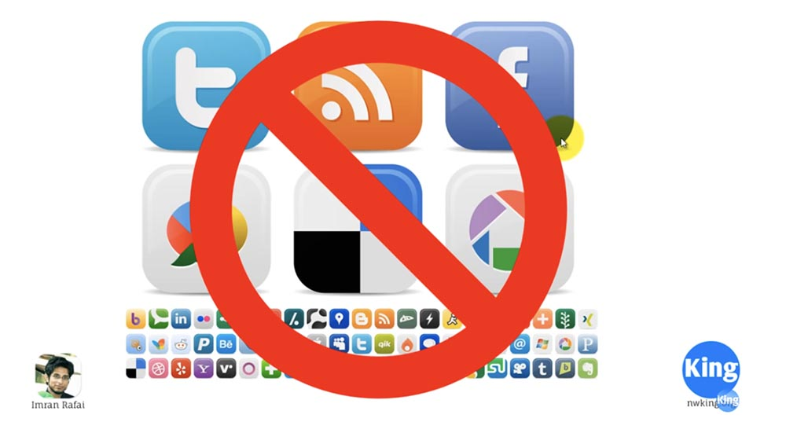

Но социальная сеть – это не та сеть, о которой мы собираемся узнать, и не та, о которой я буду говорить. То, что нас интересует – это сеть между компьютерами, основа для таких приложений, как Twitter и Facebook, потому что все сети построены по такому же принципу.

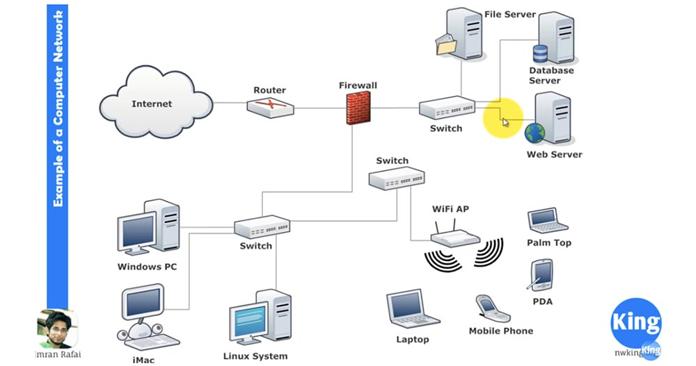

Мы изучим именно такую сеть, которая приведена на слайде, и если в конце этого урока у нас останется время, то немного поговорим об использующихся здесь приложениях. Когда я создавал этот слайд, то задумался, как можно, не используя множество технических терминов, объяснить концепцию сети студентам, которые только собираются изучать сетевую индустрию.  
Не могу же я рассказывать таким образом: «вот эта штука связывается с этой вещью или вот с этой штукой». Я подумал о том, что нужен лучший способ для объяснения концепции сети и вспомнил историю, которую рассказывала мне моя преподавательница, когда я изучал сети. Речь шла о том, как в старину короли обменивались сообщениями. Они вручали сообщение гонцу, который верхом скакал по дорогам и тропинкам, затем проезжал городские ворота, входил в покои другого короля и вручал ему это сообщение. Если провести аналогию с компьютерной сетью, то сообщение – это данные, которые могут быть чем угодно: файлом .doc или .excel программы MS Word, изображением, видео. Дороги, по которым путешествовал гонец – это компьютерные сети. Конечно, компьютерная сеть гораздо более интересна, чем простая мощенная дорога, но можно сделать вывод, что причиной изобретения компьютерной сети была необходимость установить связи между компьютерами.

На этой картинке вы видите компьютеры Windows, Linux и iMac, ноутбук, мобильный телефон, планшет, карманный ПК. Вверху справа вы видите веб-сервер, сервер базы данных, файловый сервер. Несмотря на то, что все эти устройства работают под управлением разных операционных систем, они абсолютно без проблем общаются друг с другом. В этом состоит волшебство компьютерной сети, которая работает на глобальном стандарте под названием «сетевая модель OSI». Этот стандарт четко определяет, что любой, кто производит компьютерные устройства, должен обеспечить их взаимодействие друг с другом на едином языке сетевого общения.  
Давайте рассмотрим подробнее, как работает интернет. На этом сладе вы видите основную модель сети, это 2 компьютера, соединённые кабелем.

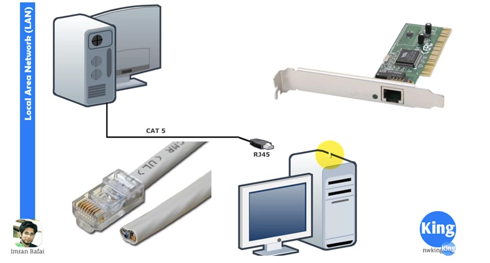

В данном случае у нас имеется сетевой кабель Cat 5, вы видите, как он выглядит в разрезе. Эти кабеля бывают разного цвета – синего, красного, или какого-нибудь другого. Под защитной оболочкой расположены 9 тоненьких проводков, которые соединены с коннектором типа RJ45. На задней части вашего компьютера, если мы говорим о системном блоке ПК, имеется гнездо для подключения этого кабеля, которое находится на сетевой карте. Таким образом, два компьютера могут общаться друг с другом, и такая базовая сеть называется сеть Ethernet. Я постараюсь написать это слово на экране мышкой, это мне очень удаётся, может быть, к следующему видео я куплю стилус, чтобы писать более разборчивым почерком. Итак, соединив этим кабелем 2 компьютера, вы получите очень простую сеть, но что делать, если у вас больше двух компьютеров, скажем, 5? Вероятно, в этом случае вам понадобится больше сетевых карт, чем обычно имеет один компьютер.

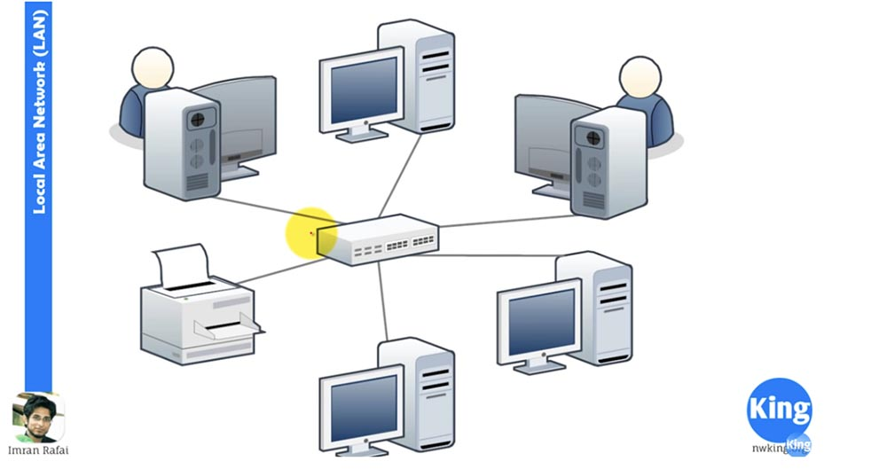

В этом случае все компьютеры связываются друг с другом через сетевое устройство — свитч, или хаб. Свитч и хаб – это абсолютно разные устройства, они имеют разные функции, мы рассмотрим их в следующих видеоуроках. Пока что вам достаточно знать, что через такое сетевое устройство, в данном случае эти свитч, компьютеры могут общаться друг с другом.

Парень слева имеет документ, который он хочет отправить по сети парню справа. Всё, что он должен для этого сделать – это отправить документ через свой IP-адрес Вы спросите, что такое IP-адрес? IP-адрес это то, благодаря чему компьютеры распознают друг друга в сети. Мы поговорим об этих адресах на следующих видеоуроках, пока же просто запомните, что они являются идентификаторами компьютеров.

Другой важной причиной, по которой люди используют компьютерные сети, является применение таких устройств, как вот этот принтер. Предположим, что это очень дорогой принтер или сканер, который приобрела компания, и если у нас нет общей сети, он может быть подсоединён только напрямую к одному компьютеру. Допустим, что этот пользователь распечатывает не больше 1 страницы в день, и все остальные пользователи в данной компании печатают до 2-х страничек в день. Тогда компания будет вынуждена приобрести персональные принтеры для каждого пользователя, причём их использование будет минимальным. Поэтому компания инвестирует деньги в сетевую инфраструктуру, которая позволяет иметь всего 1 дорогой и качественный принтер на всех сотрудников, подключенный к сети, и таким образом экономит деньги и максимально эффективно использует бюджет, предназначенный для сферы IT.

Вот в чём заключается основное требование к компьютерным сетям и основная причина их использования.

Итак, компьютерная сеть в офисе, или даже в одной комнате, но обычно это сеть в одной компании, называется LAN – локальной сетью. Это такая сеть, которая расположена в одном географическом районе. Предположим, что в вашей компании есть два офиса — в Нью-Йорке и Бостоне.

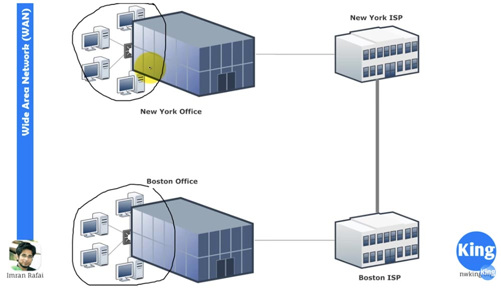

Чтобы связать их, вы создаете сеть между двумя офисами вашей компании. Конечно, если у вас есть очень много денег и вы получили разрешение властей, то можете самостоятельно соединить эти офисы кабелем, проложив его под землёй от Нью-Йорка до Бостона. Но большинство компаний не имеют ни таких денег, ни желания их тратить таким образом, поэтому лучший способ сделать это — подключить оба офиса к локальному ISP – провайдеру, или интернет-провайдеру. ISP уже имеют между собой достаточно мощные сети с высокой пропускной способностью, поэтому ваши данные из офиса в Нью-Йорке поступают по сети к локальному ISP, затем пересылаются бостонскому провайдеру и от него попадают в ваш бостонский офис. Поэтому компьютер в нью-йоркском офисе абсолютно свободно соединяется с компьютером в бостонском офисе, используя ISP.

Таким образом, создаётся широкая сеть, под словом «широкая» я подразумеваю географический район большой площади, соединяющая множество локальных сетей. Она может распространяться по всей стране, она может быть организована в разных городах одной и той же страны, или в разных странах. По сути, всё это LAN.

Как же это работает, как вы подключаете компьютер к своему ISP? Обычно у вас на стене имеется небольшая розетка, к которой подсоединён кабель от вашей сетевой карты, а с другой стороны к ней подключён свитч вашей компании. От этой розетки к интернет-провайдеру проложен подземный кабель, и такой же подземный кабель проложен между офисами ISP в Нью-Йорке и Бостоне. В Бостоне повторяется аналогичная схема – подземный интернет-кабель из офиса ISP входит в офис компании и подсоединяется к розетке, куда подключается роутер, к которому подсоединены офисные компьютеры.

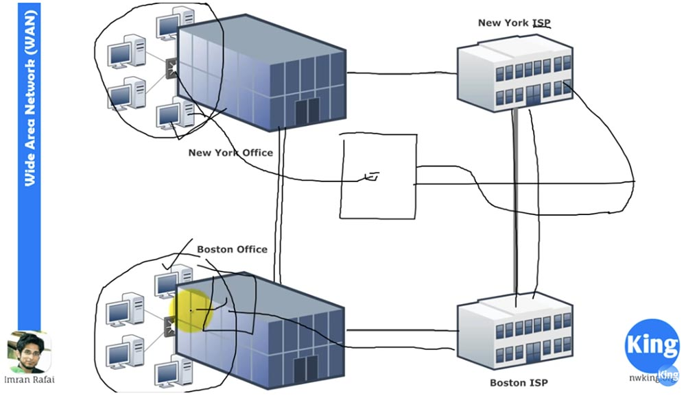

Вот так работает сеть LAN. Интернет тоже использует ISP, потому что Интернет — это не что иное, как очень обширная сеть LAN, которая покрывает весь мир, в котором имеется множество общедоступных ресурсов. В Google сказано, что «интернет — это глобальная компьютерная сеть, предоставляющая разнообразные информационно-коммуникационные средства, которая состоит из взаимосвязанных сетей, использующих стандартизированные протоколы связи».

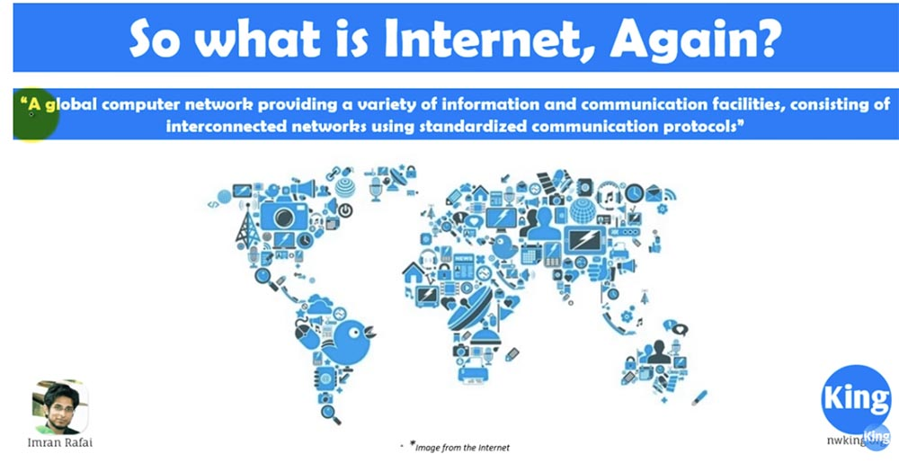

Вот такое длинное определение. Таким образом, интернет представляет собой объединение множества локальных сетей. У вас есть LAN здесь, здесь и здесь, и все они соединены друг с другом. Американские сети соединяются с европейскими, африканскими, сетями в Азии, Индии, все они связаны друг с другом – вот что собой представляет интернет. Если кто-то из Индии захочет связаться с Нью-Йорком, данные будут проходить по такому пути, а если между Европой и США связь прервётся, то данные отправятся по более длинному пути через Африку и Южную Америку. Итак, интернет – это множество взаимно соединённых локальных сетей.  
Давайте поговорим о приложениях, о которых я уже упоминал. Существует множество интернет-приложений, и все мы пользуется такими приложениями, как Skype, eBay, CNN, YouTube.

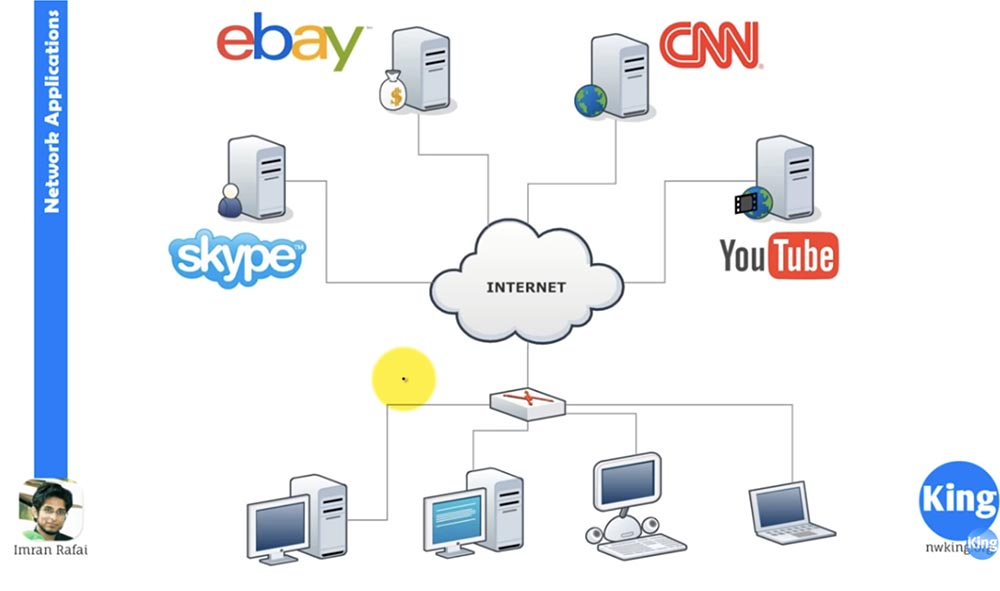

На этом рисунке показана очень малая доля интернет-приложений, вы знаете гораздо большее число. Рассмотрим, как работает, например, YouTube, который принадлежит Google.

Компания Google где-то в интернете организовала публичный, доступный для всех сервер, так что если я хочу посмотреть видео на YouTube, то захожу в свой веб-браузер и печатаю [www.youtube.com/watch](http://www.youtube.com/watch). Процесс, который при этом происходит на заднем плане, намного сложнее, но мы попытаемся его упростить и показать, как это работает, в следующих видеоуроках.

Скажем, что когда кто-то печатает youtube.com и нажимает “Enter”, компьютер отправляет HTTP-запрос публичному серверу YouTube. Когда сервер получает этот запрос, он думает: «отлично, это HTTP-запрос, поэтому я отправляю обратно HTML-файл». Он создает HTML-файл и отправляет его мне обратно. Мой браузер принимает этот файл и говорит: «я знаю, что это за HTML-файл, и я знаю, как его обработать, чтобы показать видео с сайта YouTube». Таким же образом это происходит и с eBay, CNN, Skype. Вот как в основном работает интернет: имеется публичный сервер, на котором присутствуют файлы, которые запрашивает ваш компьютер, и эти файлы отсылаются вам в ответ на запрос. Вот как интернет помогает глобализировать информационный мир.

Прежде чем обсуждать интернет, рассмотрим его важнейшее свойство — скорость. Давайте обсудим, в чём состоит разница между битом и байтом. Бит – это минимальная часть информации, которую понимает компьютер, он может равняться 0 или 1. Байт – это единица информации, состоящая из 8 битов.

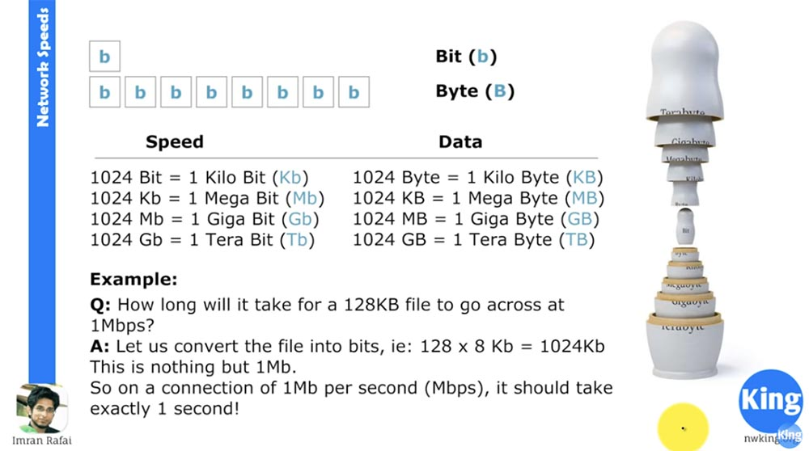

Таким образом, один байт может выглядеть, например, так: 1 1 0 1 1 1 0 1. Люди часто путаются в этих единицах, поэтому запомните: данные всегда измеряются в байтах. Когда я говорю, что у меня есть 1 ГБ оперативной памяти, это означает 1гигабайт RAM, но когда я говорю о скорости, что у меня есть 10 Мбит/с, это означает, что у меня передаётся 10 мегабит в секунду. Таким образом, данные измеряются в байтах, а скорость передачи данных– в битах в секунду. Если вы путаете эти два понятия, вам придётся нелегко. Если я говорю «байт в секунду», это означает «8 бит в секунду». Так что запомните, что скорость всегда обозначается маленькой буквой b – это бит, а размер – большой буквой В, это байт. Один килобит = 1024 бита, точно так же как 1 килобайт = 1024 байта.

Рассмотрим пример. Как долго будет передаваться файл размером 128 КБ в сети со скоростью 1 Мб/с? Переведём размер файла из байтов в биты: 128 х 8 килобит = 1024 килобит, или 1 мегабит. Таким образом, при заданной скорости соединения время передачи файла такого размера займёт не более 1 секунды.

Если вы усвоите разницу между битами и байтами, то вам будет очень легко понять содержание остальных видеоуроков. Если мы говорим о скорости, нужно упомянуть ещё о трёх важных факторах, которые замедляют скорость. Все эти факторы всегда взаимосвязаны. Когда вы подключите кабель от маршрутизатора к своему компьютеру, тот сообщает, что подключен к сети скоростью 100 Мб/с. На сегодня это максимальная скорость, которую может обеспечить сетевая карта LAN. Но не забывайте, что скорость, о которой мы говорим, это скорость между вашим компьютером и роутером. Ваше подключение к интернету может иметь скорость 1 Мбит/с, поэтому если вы пытаетесь подключиться к интернету на скорости 100 мегабит, у вас это не выйдет, потому что интернет может передать только 1 мегабит. Предположим, вы хотите передать файл из своего офиса в Бангалоре в офис в Нью-Йорке. Так что ваш файл через шлюз – роутер поступает со скоростью 1 мегабит/с к провайдеру интернета в Бангалоре. Провайдер в Бангаолре связан с провайдером в Мумбаи высокоскоростной линией связи, способной обеспечить скорость 100 Мб/с.

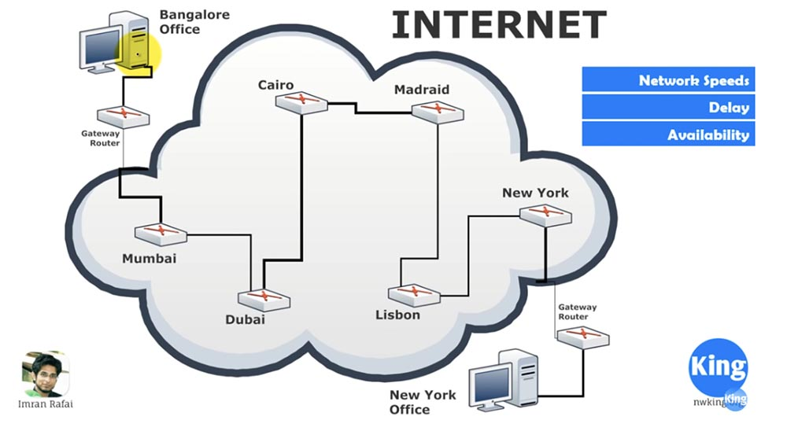

Скорость между ISP в Мумбаи и ISP в Дубае медленнее, потому что между ними проложена линия, обеспечивающая только 10 Мбит/с, но зато между Дубаем и Каиром снова имеется скоростное соединение 100 Мбит/с. Далее между Каиром и Мадридом тоже может быть высокоскоростной интернет, потом скорость падает и так далее. Вот что происходит в сети интернет, которая представляет собой кучу роутеров с различной скоростью передачи данных. Даже если у меня в Бангалоре высокоскоростное соединение в 100 Мбит/с, скорость передачи между бангалорским и нью-йоркским офисами будет определяться минимальной скоростью соединения на линии связи, в данном случае скоростью на участке между IPS в Нью-Йорке и компьютером в нью-йоркском офисе, то есть 1 Мбит/с.

Вот таким образом работает скорость интернета. Конечно, в действительно соединение между Бангалором и Нью-Йорком не происходит через Мумбаи, Дубаи и Каир, я привел эти города в качестве примера, и реальный путь передачи данных может быть другим. Но в целом пакеты данных перемещаются таким образом из одного места в другое. Таким образом, скорость зависит от множества факторов, в том числе от скорости на разных участках сетевого маршрута. Итак, второй критический фактор – это задержки. Давайте предположим, что у нас есть еще один офис в Бостоне, я расположу его правее офиса в Нью-Йорке. При отправке данных из Нью-Йорка в Бостон они проходят меньшее количество узлов и, следовательно, он достигнет цели гораздо быстрее. Отсюда следует вывод – если расстояние между двумя устройствами велико, у вас могут возникнуть задержки связи.

Поэтому если вы из Сингапура заходите на google.com или youtube.com, сеть направит вас не к серверу Google в США, а к ближайшему к вам серверу, может быть, к серверу IPS в самом Сингапуре, при этом задержка будет незначительной. Но если связь между Каиром и Дубаем разрывается, придётся пройти более длинный обходной путь от Hью-Йорка до Бангалора, возможно, через Россию, Китай и Индию. Это очень долгий процесс, и здесь возникает третий фактор – доступность, то есть наличие необходимых ресурсов для работы сети интернет.

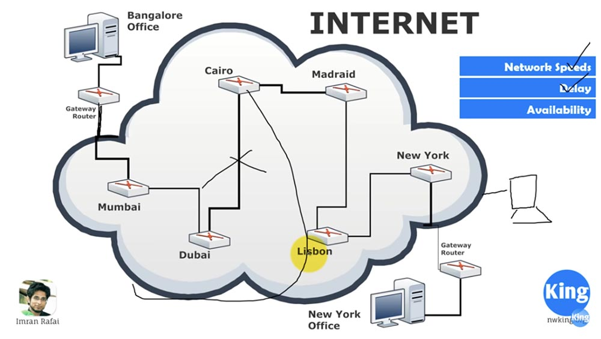

Доступность означает, что все связи между серверами должны быть в рабочем состоянии.  
Ещё одна вещь, которую мы обсудим в этом видеоуроке – это топология сети. Существует три фундаментальных типа топологии: «звезда» (star), «кольцо» (ring) и «шина» (bus).

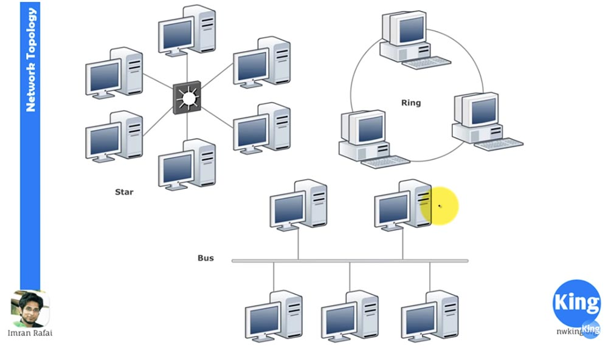

«Звезда» является одной из самых старых схем соединения компьютеров, которая существует до наших дней. Здесь все компьютеры или устройства подключены к центральному свитчу. Если один из компьютеров потеряет связь со свитчем, это никак не отразится на соединении остальных компьютеров, но данный компьютер полностью потеряет связь с сетью.

В «кольце» каждый компьютер соединён с другим, и если связь на участке между двумя соседними компьютерами прервётся, они всё равно смогут связаться друг с другом через следующий компьютер.

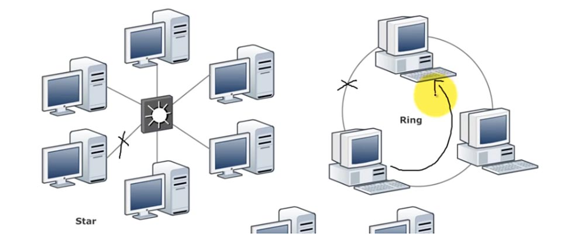

В «шине» каждый компьютер также по отдельности присоединён к сети с помощью своего собственного небольшого сетевого устройства. Таким образом, если один участок сети выйдет из строя, компьютеры, расположенные рядом, смогут общаться друг с другом, но утратят связь с компьютерами сегмента сети, который расположен за повреждённым участком.

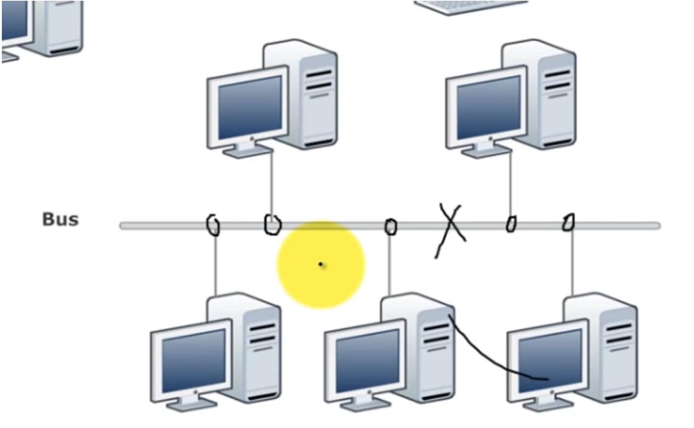

Давайте посмотрим, как это реализовано в современном мире, вернувшись к первому слайду с изображением сети. Как видите, свитч и три ближайших к нему компьютера соединены в общую сеть топологии «звезда», точно также соединены со свитчем серверы, расположенные в правом верхнем углу. Практически по такой же схеме мобильные устройства подключены к точке доступа WiFi AP. Два центральных свитча соединены по схеме «шина», поэтому если связь между ними прервётся, устройства справа смогут взаимодействовать друг с другом, но не смогут связаться с левым сегментом сети. Иногда свитчи соединяются дополнительными линиями связи, поэтому даже если соединение на одном участке прервётся, связь сможет осуществляться по другим сегментам сети.

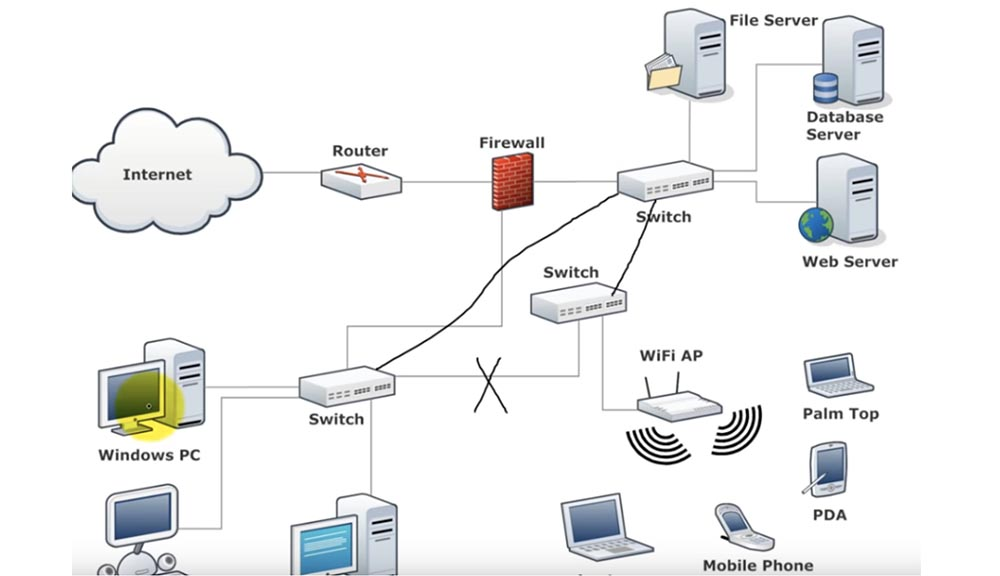

Таким образом, в реальном мире используется гибридная, или смешанная топология сети, которая использует и «звезду», и «кольцо», и «шину».  
Это вся информация, которую я хотел изложить вам в нашем первом видеоуроке. Если вы чего-то не поняли, то всегда сможете пересмотреть это видео. Не стесняйтесь обращаться ко мне по указанным выше контактам, вы также можете подписаться на наш канал на YouTube, чтобы просматривать наши свежие видео. Вы также можете посетить наш сайт. На этом всё, встретимся на втором видеоуроке.

Спасибо, что остаётесь с нами. Вам нравятся наши статьи? Хотите видеть больше интересных материалов? Поддержите нас оформив заказ или порекомендовав знакомым, **30% скидка для пользователей Хабра на уникальный аналог entry-level серверов, который был придуман нами для Вас:** [Вся правда о VPS (KVM) E5-2650 v4 (6 Cores) 10GB DDR4 240GB SSD 1Gbps от $20 или как правильно делить сервер?](https://habr.com/company/ua-hosting/blog/347386/) (доступны варианты с RAID1 и RAID10, до 24 ядер и до 40GB DDR4).

**VPS (KVM) E5-2650 v4 (6 Cores) 10GB DDR4 240GB SSD 1Gbps до весны бесплатно** при оплате на срок от полугода, заказать можно [тут](https://ua-hosting.company/vpsnl).

**Dell R730xd в 2 раза дешевле?** Только у нас **[2 х Intel Dodeca-Core Xeon E5-2650v4 128GB DDR4 6x480GB SSD 1Gbps 100 ТВ от $249](https://ua-hosting.company/serversnl) в Нидерландах и США!** Читайте о том [Как построить инфраструктуру корп. класса c применением серверов Dell R730xd Е5-2650 v4 стоимостью 9000 евро за копейки?](https://habr.com/company/ua-hosting/blog/329618/)