Тренинг Cisco 200-125 CCNA v3.0. Сертифицированный сетевой специалист Cisco (ССNA). День 2. Модели OSI и TCP-IP / Блог компании ua-hosting.company

Из предыдущего видео мы узнали об основах сети, а сегодня поговорим о модели OSI и модели TCP/IP. Когда я говорю моделях, то имею ввиду не что иное, как набор правил, или набор стандартов. Вы можете спросить, зачем нужен набор правил или стандартов в компьютерной индустрии? Чтобы это понять, нам нужно узнать немного об истории компьютерной индустрии.

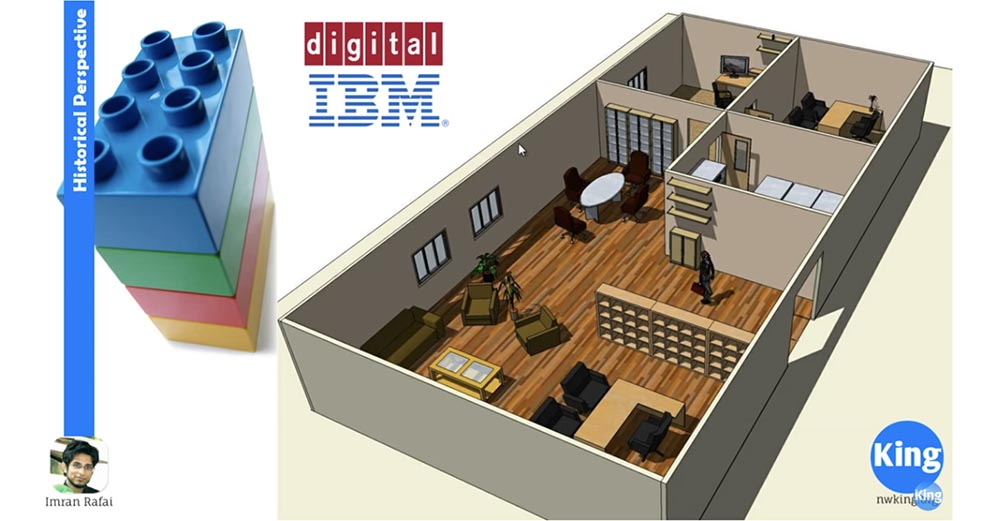

Не так давно состоялась ожесточенная битва между IBM и Digital Equipment Corporation (DEC) за то, кто из них является ведущим производителем компьютеров. Но при этом возникла проблема. Оба этих производителя выпускали компьютерное оборудование, которое было несовместимо друг с другом. То есть если вы купили компьютер IBM, то вам нужно было приобрести для него монитор, принтер и все остальное тоже у IBM. Аналогично, если вы купили устройство от DEC, то должны были купить все аксессуары и другие устройства этого же производителя, чтобы ими можно было пользоваться.

Было много компаний, которые купили оборудование обоих производителей, так, что, например, в бухгалтерии имелись компьютеры IBM, а отдел маркетинга был оборудован компьютерами DEC. В результате эти устройства не могли ни общаться, ни поделиться информацией друг с другом. Таким образом, отсутствие единого стандарта не позволяло двигаться компьютерным технологиям вперёд. Это происходило примерно в то время, когда Международная организация по стандартам, известная как ISO, пришла к выводу, что существует необходимость создания общего компьютерного стандарта. ISO разработала OSI — Open System Interconnect, или эталонную модель OSI. Примерно в то же время был создан конкурирующий стандарт — модель TCP/IP, появлению которого посодействовало Министерство обороны. Модель TCP/IP больше похожа на урезанную версию модели OSI и по причине большей актуальности стала отраслевым стандартом. Чтобы получить понятие о моделях, необходимо рассмотреть понятие «уровень стека». Рассмотрим его на примере изображенного на картинке офиса. В каждом офисе есть разные уровни сотрудников: генеральный директор, старший офисный персонал, менеджер по зарплате, аккаунт менеджер, менеджер по обслуживанию, обслуживающий персонал, младший офисный персонал – самые разные сотрудники. Причина, по которой в штате каждой компании есть разные сотрудники с разными названиями должностей, объясняется тем, что они выполняют разные обязанности и имеют разный уровень ответственности.

Поэтому когда что-то не сделано или не выполнена какая-то конкретная задача, вы знаете, кто несет за это ответственность. Например, если зарплата не перечислена вовремя, то за это отвечает менеджер по зарплате. Не важно, что в этом может быть виноват банк, первый контакт, который вы используете для выяснения вопроса – это менеджер по зарплате. Если ваш офис не убирается, то за это ответственный хозяйственный отдел. То есть должностная иерархия позволяет распределить ответственность.

Точно так же нам нужно обладать знаниями о модели OSI и модели TCP/IP, потому что при изучении компьютерных сетей или при возникновении в них проблем нам нужно знать, что на каком уровне работает. Потому что в случае неполадки нам не понадобится проверять всё оборудование, так как используя уровневый подход, мы будем точно знать, в чем может быть проблема.

Перейдём непосредственно к моделям, чтобы разобраться, как они работают и какие уровни в этом участвуют. Давайте сравним обе модели.

Слева вы видите уровни модели OSI, справа — TCP/IP. Позвольте мне взять маркер, чтобы было понятнее. Я промаркировал уровни разыми цветами, так что вы не запутаетесь. Начнем обсуждение слева, с модели OSI. Прежде чем мы пойдем дальше, я подчеркну, что как студенты-сетевики, вы должны знать все эти уровни и их расположение наизусть!

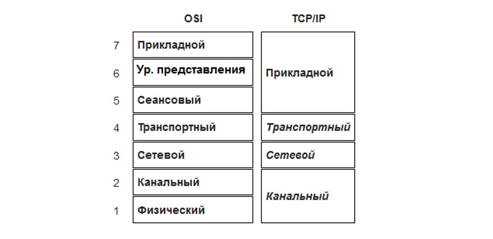

Вам нужно знать, что уровень 7 – это прикладной уровень, 6 уровень – уровень представления, 5 уровень – сеансовый. Вам нужно знать, где находятся эти уровни! Один из способов запоминания последовательности уровней – это использование мнемоники. Одной из самых популярных фраз для запоминания уровней OSI Physical, Data link, Network, Transport, Session, Presentation, Application снизу вверх звучит так: Please, Do Not Throw Sausage Pizza Away (Пожалуйста, не выбрасывайте пиццу с колбасой)!

Если вы хотите запомнить расположение уровней сверху вниз, пользуйтесь фразой All People Seem To Need Data Processing (Кажется, все люди нуждаются в обработке данных).

В способе запоминания — сверху вниз или снизу вверх — выбор остается за вами, вы просто должны помнить, что 1 уровень физический, а 7 – прикладной. Некоторые люди путаются, считая, что уровни идут по нарастающей сверху вниз, и 1 уровень – это прикладной. Это не так, первый уровень – физический, а прикладной – это 7 уровень.

Если вы хотите запомнить расположение уровней модели TCP/IP, используйте мнемонику «TCP/IP comes in A TIN». Это ничего не значит, вам просто нужно запомнить A TIN – Application, Transport, Internet, Network. Если у вас есть лучший способ запоминания, пользуйтесь им, пока твердо не выучите эти последовательности.

Итак, начнем с прикладного уровня. Прикладной уровень – это точка контакта для всех сетевых приложений, общая точка их соприкосновения. Многие авторы говорят и пишут, что все приложения на вашем компьютере находятся на этом уровне приложений, что не соответствует действительности. Во-первых, прикладной уровень касается только сетевых приложений, во-вторых, любые приложения на вашем компьютере не имеют ничего общего с прикладным уровнем, если они не общаются по сети.

Чтобы вам было легче это понять, приведу простой пример. Предположим, что вы удалили с вашего ПК драйверы интерфейса беспроводной связи Wi-Fi и Bluetooth, драйверы сетевой карты Ethernet или даже физически удалили эти устройства. Так вот, если вы теперь запустите, например, Microsoft Word, он не сможет общаться с прикладным уровнем и из-за это не сможет общаться ни с каким другим уровнем. Это потому, что Microsoft не может получить доступ к сети, потому что ваша операционная система даже не имеет сетевой карты!

Точно так же в обычной системе, если вы запустите веб-браузер, например, Chrome, IE, Safari и наберёте в адресной строке что-то вроде [www.cnn.com](http://www.cnn.com/), веб-браузер создаст http-запрос, который взаимодействует с прикладным уровнем. Прикладной уровень передаёт эти данные уровню представления (часто ошибочно называемому представительским уровнем), уровень представления передаёт их сеансовому уровню, тот – транспортному и так до тех пор, пока данные не достигнут физического уровня. Вот как это работает.

Таким образом, если приложение взаимодействует с сетями, то это происходит только через прикладной уровень. Этот уровень обеспечивает доступ к сетевым службам. На этом уровне работают протоколы FTP, TFTP, SNMP, DNS, HTTP, их довольно много. Вы можете просто «погуглить» полный список всех протоколов, работающих на этом уровне!

Далее мы рассмотрим уровень представления. Этот уровень осуществляет представление и шифрование данных. Уровень представления – то, где происходят все преобразование данных, он отвечает за кодирование данных, то есть после него данные для других уровней становятся одинаковыми, независимо от того, картинка это или документ. Затем он принимает данные, поступающие на обратном пути со сеансового уровня, преобразует их в презентабельный вид и передаёт на прикладной уровень. Поэтому если у вас есть необработанные данные, поступающие со сеансового уровня, они преобразуются на уровне представления. Если это изображение, уровень создает изображение, если это документ Word, он создает документ Word. Кроме того, на этом уровне работают все службы шифрования, такие, как TLS и SSL.

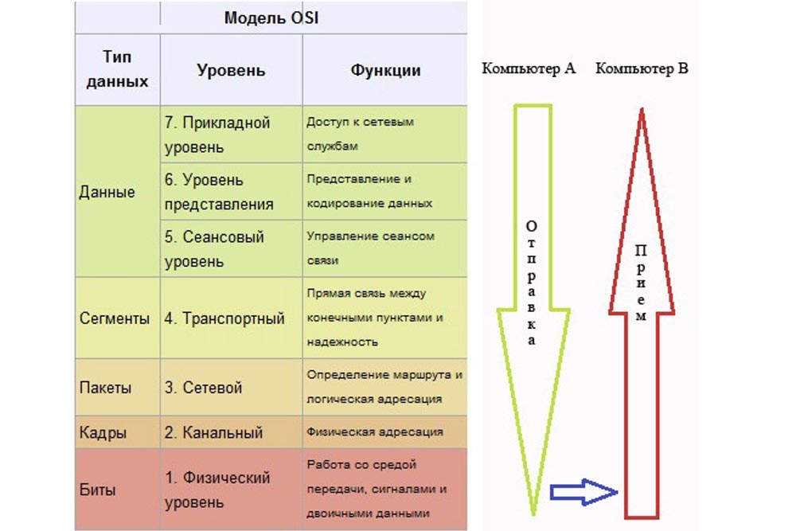

Далее у нас расположен сеансовый уровень, который создает и поддерживает сеансы передачи данных. Предположим, что ваш компьютер запускает два приложения – программу Telnet и браузер IE. Оба эти приложения получают доступ к сети. Поэтому этот уровень создает 2 различные сессии и поддерживает их. Таким образом, когда сеанс веб-браузера прекращается, сеанс Telnet не оборвётся, потому что они являются отдельными сеансами. То есть этот уровень поддерживает различные сеансы.

Вы видите, что три верхних уровня 5,6,7 модели OSI и уровень 4 модели TCP/IP промаркированы одинаковым синим цветом. Как сетевой инженер, особенно сетевой инженер Cisco, я сделал это по той причине, что мы очень редко будем обращаться к уровням 5,6,7. Это связано с тем, что большинство устройств Cisco не смотрят дальше 4 уровня. Уровни 1, 2, 3 и 4 очень важны для инженера Cisco, а уровни 5,6,7 не так критичны. Вам просто нужно знать, как это работает, и вы в основном узнали, что делают эти три верхних уровня. Дело в том, что о них в основном заботится операционная система, но относительно работы уровней 1, 2, 3 и 4 вы как сетевой инженер должны знать абсолютно всё.

Теперь мы перейдём к рассмотрению транспортного уровня. Этот уровень также важен для сетевого инженера. Когда идущая сверху информация поступает на транспортный уровень, он разбивает данные на управляемые сегменты, а на обратном пути опять собирает их из сегментов. Для создания инкапсуляции транспортный уровень добавляет свой собственный заголовок каждому сегменту.

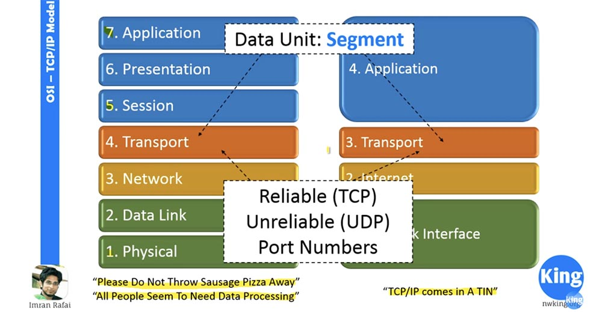

Транспортный уровень принимает два важных решения: использовать доверенное (TCP) или недоверенное (UDP) соединение, и создаёт номера портов. Когда приложениям нужно использовать доверенное соединение, применяется TCP – протокол управления передачей. Если допускается установление недоверенного соединения, транспортный уровень использует UDP – протокол пользовательских датаграмм. Когда я говорю «доверенный», это не значит, что он лучше, чем «недоверенный», единственное различие между ними состоит в том, что при установке доверенного соединения необходимо получить подтверждение для каждого отправленного пакета. В недоверенном соединении подтверждать получение каждого сегмента передачи не нужно, поэтому оно работает быстрее из-за меньших накладных расходов. Так, если у нас имеются приложения реального времени, они будут использовать UDP, потому что это быстрее, и это происходит в реальном времени. Если вы смотрели потоковое видео или прямую онлайн-трансляцию, временами на экране появляются зеленые пиксели. Это означает, что информация для этого сегмента изображения, или этого пикселя, не была получена, и принимающее устройство не имеет никакого способа известить об этом передающее устройство.

Вторая функция, о которой заботится транспортный уровень, это создание номеров портов. Номер порта — это число, которое прикрепляется к IP-адресу, чтобы определить, от какого процесса приходит информация. Транспортный уровень создает случайный номер порта источника (процесса-отправителя) и присоединяет номер порта пункта назначения (получателя). Так что если ваш трафик поступает на сервер, то сервер имеет стандартный номер порта 80. Если вы собираетесь отправить данные на IP-адрес 10.10.10.10, то транспортный уровень добавляет к этому адресу номер порта 80, в результате чего создаётся сокет 10.10.10.10.80, представляющий собой не что иное, как IP-адрес и номер порта.

Транспортный уровень создает сокет и отправляет его ниже, сетевому уровню. Он также добавляет номер порта источника. Зачем нужен этот номер? Причина в том, что если на компьютере запущено 2 приложения, и данные приходят на один и тот же IP-адрес, то транспортный уровень должен знать, какие данные передаются какому приложению. Он определит это по номеру порта источника.

Далее мы рассмотрим сетевой уровень. Когда сетевой уровень получает сегмент от транспортного уровня, он добавляет к нему заголовок сетевого уровня. Добавление заголовка превращает сегмент в пакет.

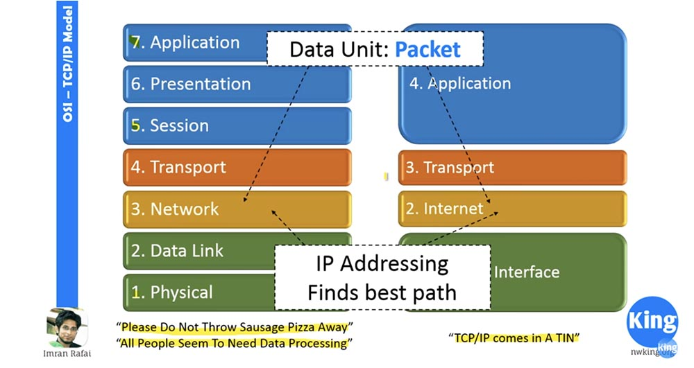

Таким образом, одна из важнейших функций сетевого уровня является перевод физических IP-адресов в логические адреса, то есть логическая адресация. О ней мы узнаем в следующем видео «День 3». Пока что просто запомните, что сетевой уровень – это уровень, на котором добавляются IP-адреса и происходит выбор оптимального пути для передачи данных. Оптимальный путь означает, что сетевой уровень сравнивает IP-адреса и проверяет, находится ли IP-адрес назначения в локальной подсети. Если он не находится в локальной подсети, то уровень найдет оптимальный путь к пункту назначения.

Далее у нас находится канальный уровень. Когда пакет поступает из сети, канальный уровень добавляет к нему канальный заголовок. В результате пакет превращается во фрейм. Канальный уровень отвечает за MAC-адресацию. MAC — это не что иное, как сокращение от Media Access Control, а MAC – адрес — это аппаратный адрес.

Это означает, что каждая сетевая карта вашего компьютера имеет собственный MAC-адрес. Он также известен как Burn-in-Address, который нельзя изменить. Существуют программные способы подмены адреса, но физически его невозможно изменить.

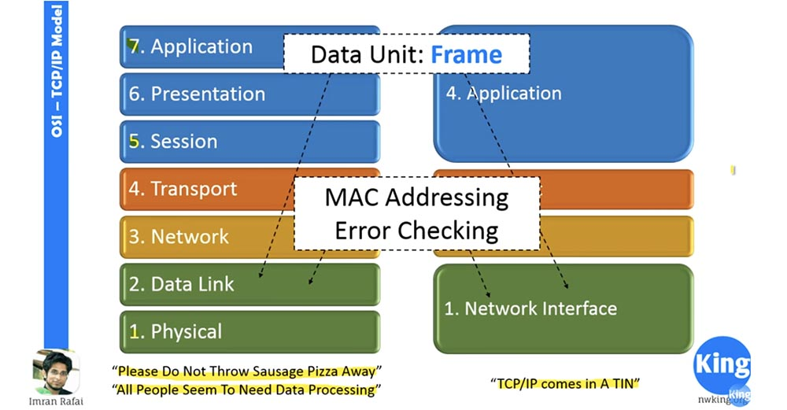

Это уровень, на котором происходит проверка ошибок. Поэтому, когда информация поступает с физического уровня, канальный уровень проверяет её на наличие ошибок, возникших в процессе передачи, и исправляет их. Он может использовать циклическую проверку избыточности – алгоритм вычисления контрольной суммы CRC, проверку четности или любой другой механизм проверки ошибок.

Затем следует физический уровень, где фактически происходит передача данных. Здесь данные существуют в виде битов. Этот уровень имеет дело с проводами, кабелями, аппаратными портами или разъемами и подобными вещами, которые обеспечивают процессы, происходящие на этом уровне. Когда кто-то говорит вам, что у него не работает интернет, вы как компьютерный или сетевой инженер начинаете работу с устранения неполадок на физическом уровне. В первую очередь вы проверите все разъёмы и кабели, и если они в порядке, перейдёте к поиску неполадок на 2,3,4 уровнях. Именно поэтому нам нужно знать о сетевых моделях и помнить, что любое изменение на одном из уровней не повлияет на соседние, потому что так предусмотрено стандартом.

Поэтому, если на физическом уровне вместо сетевого кабеля локальной сети я предпочту использовать беспроводную связь, это не должно никак отразиться на остальных уровнях, потому что изменение произошло только на физическом уровне. Таким образом, пока на физическом уровне получение информации происходит в штатном режиме, способ получения этой информации не имеет никакого значения.

Аналогично происходит и на сетевом уровне. Сейчас мы находимся в разгаре переходной фазы от IPv4 к IPv6, так что это изменение относится только к третьему уровню. Слой 4 и слой 2 от этого не пострадают, пока будет соблюдаться существующий стандарт и они будут получать данные так же, как это происходило ранее.

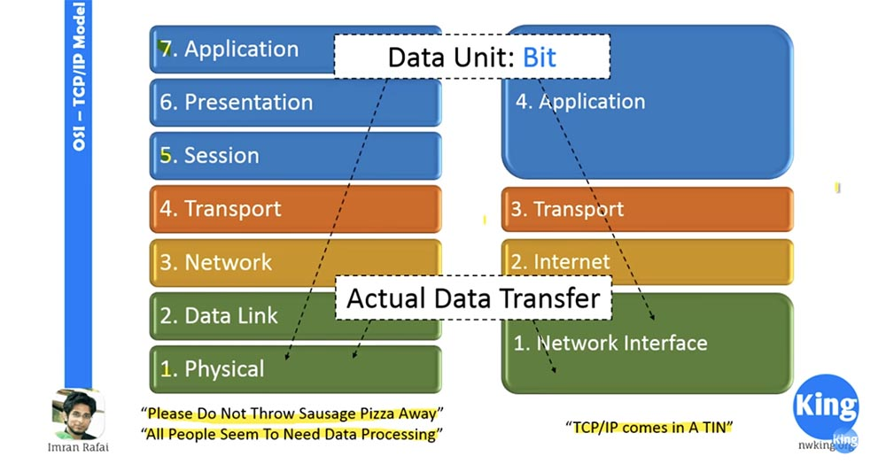

Такова красота многоуровневого подхода к организации сети. Если сравнить левую и правую половину рисунка, видно, что уровень 5,6,7 модели OSI сопоставим с уровнем 4 модели TCP / IP. Транспортный уровень выполняет аналогичные функции в обеих моделях, аналогичное соответствие имеет место на уровнях 2 и 3, а уровни 1 и 2 модели OSI по своим функциям соответствуют уровню 1 модели TCP/IP.

Далее мы рассмотрим, как функционирует модель OSI. Допустим, человечек слева собирается отправить информацию правому человечку и для этого создаёт данные. Поскольку мы условились, что три верхних уровня 5,6 и 7 нас не особо интересуют, перейдём сразу к 4 транспортному уровню, куда поступают наши данные.

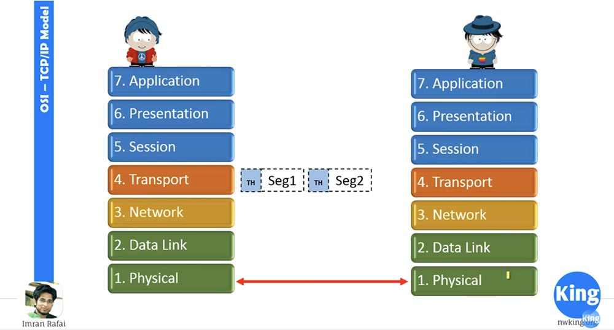

Транспортный уровень принимает данные, сегментирует их и добавляет свой собственный заголовок – вы видите его на рисунке. Предположим, что здесь мы имеем дело с UDP, поэтому он не ждет подтверждений. Он отправляет сегмент 1 на сетевой уровень, тот добавляет в сегмент сетевой заголовок, и теперь он становится пакетом.

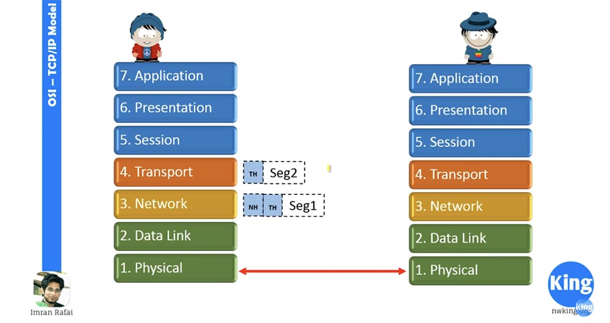

Далее сетевой уровень отправляет этот пакет 1 на канальный уровень. Тот принимает пакет и снабжает его заголовком Data Link.

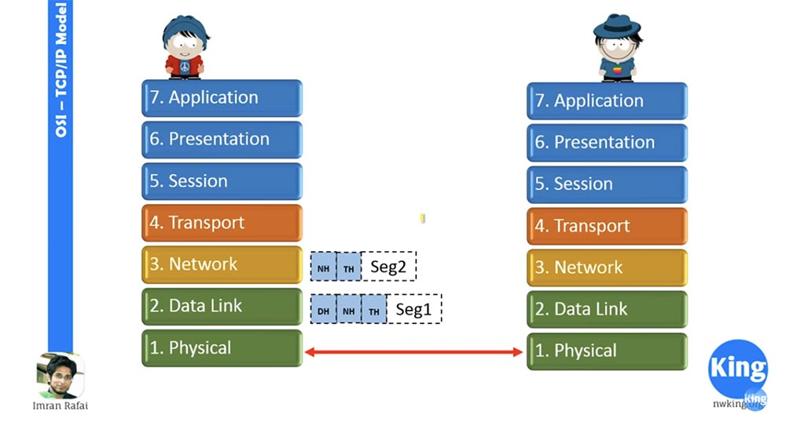

Как вы видите, в отношении сегмента 2 действует та же процедура. Затем сегмент 1 переходит на физической уровень связи, который конвертирует его в последовательность битов и отсылает на физический уровень нашего адресата.

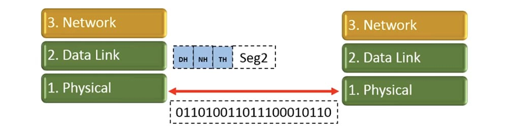

Итак, наш сегмент 1 был преобразован, и точно также в последовательность битов будет преобразован второй сегмент. К тому времени правый физический уровень уже примет предыдущий сегмент в виде физических битов и преобразует его в сегмент с соответствующим набором заголовков.

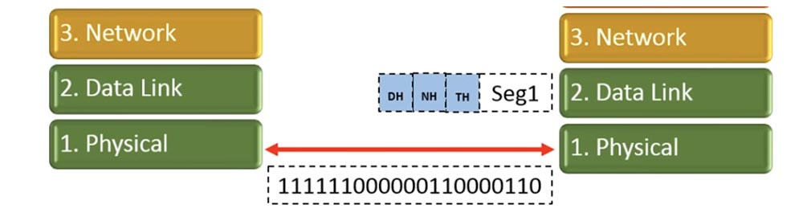

Получающие уровни на каждом шаге обрезают соответствующий заголовок и передают сегмент выше. Таким образом, когда сегмент 1 перейдёт с канального уровня на сетевой, он утратит заголовок канального уровня.

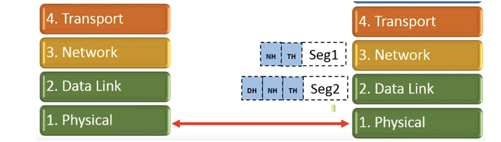

Аналогично произойдёт и со вторым сегментом. Когда сегмент 1 достигнет транспортного уровня, сетевой заголовок будет удалён. Далее транспортный уровень будет ждать, пока он не получит все переданные сегменты.

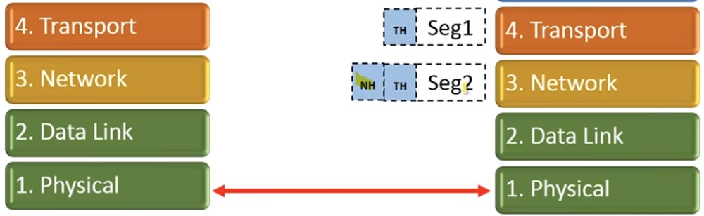

Это то, что делает транспортный уровень — ждёт, пока до него доберётся 2 сегмент.

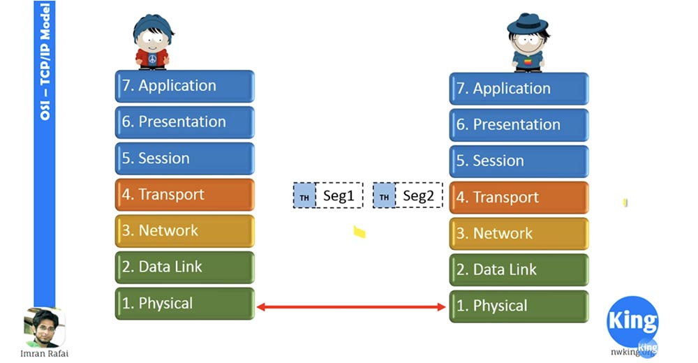

После этого транспортный слой удалит все свои заголовки, объединит сегменты в массив данных и передаст данные верхним уровням, и правый человечек получит совершенно те же данные, что отослал ему левый человечек.

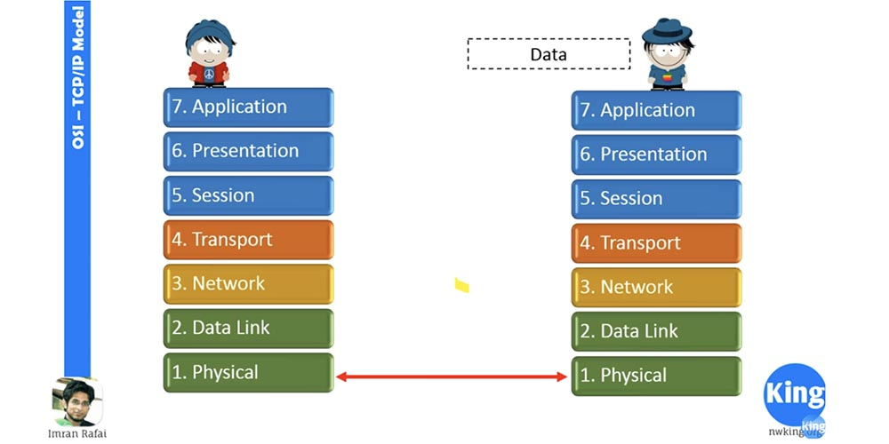

Это обобщенное представление того, как работает передача данных по сети. Это всё, что мы должны были выучить во втором видеоуроке. В последующих уроках мы изучим все остальные понятия, касающиеся сетей, и если вы чего-то не поймёте, обращайтесь ко мне на электронную почту imran.rafai@nwking.org. Благодарю за внимание.

Спасибо, что остаётесь с нами. Вам нравятся наши статьи? Хотите видеть больше интересных материалов? Поддержите нас оформив заказ или порекомендовав знакомым, **30% скидка для пользователей Хабра на уникальный аналог entry-level серверов, который был придуман нами для Вас:** [Вся правда о VPS (KVM) E5-2650 v4 (6 Cores) 10GB DDR4 240GB SSD 1Gbps от $20 или как правильно делить сервер?](https://habr.com/company/ua-hosting/blog/347386/) (доступны варианты с RAID1 и RAID10, до 24 ядер и до 40GB DDR4).

**VPS (KVM) E5-2650 v4 (6 Cores) 10GB DDR4 240GB SSD 1Gbps до весны бесплатно** при оплате на срок от полугода, заказать можно [тут](https://ua-hosting.company/vpsnl).

**Dell R730xd в 2 раза дешевле?** Только у нас **[2 х Intel Dodeca-Core Xeon E5-2650v4 128GB DDR4 6x480GB SSD 1Gbps 100 ТВ от $249](https://ua-hosting.company/serversnl) в Нидерландах и США!** Читайте о том [Как построить инфраструктуру корп. класса c применением серверов Dell R730xd Е5-2650 v4 стоимостью 9000 евро за копейки?](https://habr.com/company/ua-hosting/blog/329618/)