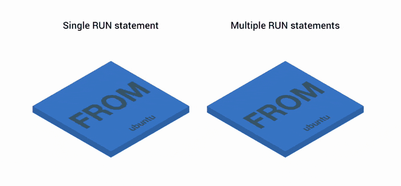

Три простых приема для уменьшения Docker-образов / Блог компании Nixys

Когда дело доходит до создания Docker-контейнеров, лучше всегда стремиться к минимизации размера образов. Образы, которые используют одни и те же слои и весят меньше — быстрее переносятся и деполятся.

Но как контролировать размер, когда каждое выполнение оператора `RUN` создает новый слой? Плюс, еще нужны промежуточные артефакты до создания самого образа...

Возможно, вы знаете, что большинство Docker-файлов имеют свои, довольно странные, особенности, например:

  

    FROM ubuntu
    RUN apt-get update && apt-get install vim

Ну зачем тут `&&`? Разве не проще запустить два оператора `RUN`, как здесь?

  

    FROM ubuntu
    RUN apt-get update
    RUN apt-get install vim

Начиная с версии Docker 1.10, операторы `COPY`, `ADD` и `RUN` добавляют новый слой к образу. В предыдущем примере были созданы два слоя вместо одного.

  

### Слои как Git-коммиты.

Docker-слои сохраняют различия между предыдущей и текущей версией образа. И как Git-коммиты, они удобны, если вы делитесь ими с другими репозиториями или образами. Фактически, при запросе образа из реестра, загружаются только недостающие слои, что упрощает разделение образов между контейнерами.

Но при этом, каждый слой занимает место, и чем их больше, тем тяжелее итоговый образ. Git-репозитории в этом отношении схожи: размер репозитория растет вместе с количеством слоев, потому что должен хранить все изменения между коммитами. Раньше была хорошая практика объединять несколько операторов `RUN` в одной строке, как в первом примере. Но теперь, увы, нет.

  

## 1\. Объединяем нескольких слоев в один с помощью поэтапной сборки Docker-образов

Когда Git-репозиторий разрастается, можно просто свести всю историю изменений в один commit и забыть о нем. Оказалось, что нечто подобное можно реализовать и в Docker — посредством поэтапной сборки.

Давайте создадим контейнер Node.js.

Начнем с `index.js`:

  

    const express = require('express')
    const app = express()
    app.get('/', (req, res) => res.send('Hello World!'))
    app.listen(3000, () => {
     console.log(`Example app listening on port 3000!`)
    })

и `package.json`:

  

    {
     "name": "hello-world",
     "version": "1.0.0",
     "main": "index.js",
     "dependencies": {
       "express": "^4.16.2"
     },
     "scripts": {
       "start": "node index.js"
     }
    }

Упакуем приложение со следующим `Dockerfile`:

  

    FROM node:8
    EXPOSE 3000
    WORKDIR /app
    COPY package.json index.js ./
    RUN npm install
    CMD ["npm", "start"]

Создадим образ:

  

    $ docker build -t node-vanilla

Проверим, что все работает:

  

    $ docker run -p 3000:3000 -ti --rm --init node-vanilla

_Теперь можно пройти по ссылке: [http://localhost:3000](http://localhost:3000/) и увидеть там «Hello World!»._

В `Dockerfile` теперь у нас есть операторы `COPY` и `RUN`, так что фиксируем увеличение как минимум на два слоя, по сравнению с исходным образом:

  

    $ docker history node-vanilla
    IMAGE          CREATED BY                                      SIZE
    075d229d3f48   /bin/sh -c #(nop)  CMD ["npm" "start"]          0B
    bc8c3cc813ae   /bin/sh -c npm install                          2.91MB
    bac31afb6f42   /bin/sh -c #(nop) COPY multi:3071ddd474429e1…   364B
    500a9fbef90e   /bin/sh -c #(nop) WORKDIR /app                  0B
    78b28027dfbf   /bin/sh -c #(nop)  EXPOSE 3000                  0B
    b87c2ad8344d   /bin/sh -c #(nop)  CMD ["node"]                 0B
    <missing>      /bin/sh -c set -ex   && for key in     6A010…   4.17MB
    <missing>      /bin/sh -c #(nop)  ENV YARN_VERSION=1.3.2       0B
    <missing>      /bin/sh -c ARCH= && dpkgArch="$(dpkg --print…   56.9MB
    <missing>      /bin/sh -c #(nop)  ENV NODE_VERSION=8.9.4       0B
    <missing>      /bin/sh -c set -ex   && for key in     94AE3…   129kB
    <missing>      /bin/sh -c groupadd --gid 1000 node   && use…   335kB
    <missing>      /bin/sh -c set -ex;  apt-get update;  apt-ge…   324MB
    <missing>      /bin/sh -c apt-get update && apt-get install…   123MB
    <missing>      /bin/sh -c set -ex;  if ! command -v gpg > /…   0B
    <missing>      /bin/sh -c apt-get update && apt-get install…   44.6MB
    <missing>      /bin/sh -c #(nop)  CMD ["bash"]                 0B
    <missing>      /bin/sh -c #(nop) ADD file:1dd78a123212328bd…   123MB

Как видим, итоговый образ возрос на пять новых слоев: по одному для каждого оператора в нашем `Dockerfile`. Давайте теперь опробуем поэтапную Docker-сборку. Используем тот же самый `Dockerfile`, состоящий из двух частей:

  

    FROM node:8 as build
    WORKDIR /app
    COPY package.json index.js ./
    RUN npm install
    FROM node:8
    COPY --from=build /app /
    EXPOSE 3000
    CMD ["index.js"]

Первая часть `Dockerfile` создает три слоя. Затем слои объединяются и копируются на второй и заключительный этапы. Сверху в образ добавляются еще два слоя. В итоге имеем три слоя.

Давайте пробовать. Сначала создаем контейнер:

  

    $ docker build -t node-multi-stage

Проверяем историю:

  

    $ docker history node-multi-stage
    IMAGE          CREATED BY                                      SIZE
    331b81a245b1   /bin/sh -c #(nop)  CMD ["index.js"]             0B
    bdfc932314af   /bin/sh -c #(nop)  EXPOSE 3000                  0B
    f8992f6c62a6   /bin/sh -c #(nop) COPY dir:e2b57dff89be62f77…   1.62MB
    b87c2ad8344d   /bin/sh -c #(nop)  CMD ["node"]                 0B
    <missing>      /bin/sh -c set -ex   && for key in     6A010…   4.17MB
    <missing>      /bin/sh -c #(nop)  ENV YARN_VERSION=1.3.2       0B
    <missing>      /bin/sh -c ARCH= && dpkgArch="$(dpkg --print…   56.9MB
    <missing>      /bin/sh -c #(nop)  ENV NODE_VERSION=8.9.4       0B
    <missing>      /bin/sh -c set -ex   && for key in     94AE3…   129kB
    <missing>      /bin/sh -c groupadd --gid 1000 node   && use…   335kB
    <missing>      /bin/sh -c set -ex;  apt-get update;  apt-ge…   324MB
    <missing>      /bin/sh -c apt-get update && apt-get install…   123MB
    <missing>      /bin/sh -c set -ex;  if ! command -v gpg > /…   0B
    <missing>      /bin/sh -c apt-get update && apt-get install…   44.6MB
    <missing>      /bin/sh -c #(nop)  CMD ["bash"]                 0B
    <missing>      /bin/sh -c #(nop) ADD file:1dd78a123212328bd…   123MB

Смотрим, изменился ли размер файла:

  

    $ docker images | grep node-
    node-multi-stage   331b81a245b1   678MB
    node-vanilla       075d229d3f48   679MB

Да, он стал меньше, но пока не значительно.

  

## 2\. Сносим все лишнее из контейнера с помощью distroless

Текущий образ предоставляет нам Node.js, `yarn`, `npm`, `bash` и много других полезных бинарников. Также, он создан на базе Ubuntu. Таким образом, развернув его, мы получаем полноценную операционную систему со множеством полезных бинарников и утилит.

При этом они не нужны нам для запуска контейнера. Единственная нужная зависимость — это Node.js.

Docker-контейнеры должны обеспечивать работу одного процесса и содержать минимально необходимый набор инструментов для его запуска. Целая операционная система для этого не требуется.

Таким образом, мы можем вынести из него все, кроме Node.js.

**Но как?**

В Google уже пришли к подобному решению — [GoogleCloudPlatform/distroless](https://github.com/GoogleContainerTools/distroless).

Описание к репозиторию гласит:

_Distroless-образы содержат только приложение и зависимости для его работы. Там нет менеджеров пакетов, shell'ов и других программ, которые обычно есть в стандартном дистрибутиве Linux._

**Это то, что нужно!**

Запускаем `Dockerfile`, чтобы получить новый образ:

  

    FROM node:8 as build
    WORKDIR /app
    COPY package.json index.js ./
    RUN npm install
    FROM gcr.io/distroless/nodejs
    COPY --from=build /app /
    EXPOSE 3000
    CMD ["index.js"]

Собираем образ как обычно:

  

    $ docker build -t node-distroless

Приложение должно нормально заработать. Чтобы проверить, запускаем контейнер:

  

    $ docker run -p 3000:3000 -ti --rm --init node-distroless

И идем на [http://localhost:3000](http://localhost:3000/). Стал ли образ легче без лишних бинарников?

  

    $ docker images | grep node-distroless
    node-distroless   7b4db3b7f1e5   76.7MB

**Еще как! Теперь он весит всего 76,7 МБ, на целых 600 Мб меньше!**

Все круто, но есть один важный момент. Когда контейнер запущен, и надо его проверить, подключиться можно с помощью:

  

    $ docker exec -ti <insert_docker_id> bash

Подключение к работающему контейнеру и запуск `bash` очень похоже на создание SSH-сессии.

Но поскольку distroless — это урезанная версия исходной операционной системы, там нет ни дополнительных бинарников, ни, собственно, shell!

Как подключиться к запущенному контейнеру, если нет shell?

Самое интересное, что никак.

Это не очень хорошо, так как исполнять в контейнере можно только бинарники. И единственный, который можно запустить — это Node.js:

  

    $ docker exec -ti <insert_docker_id> node

На самом деле в этом есть и плюс, ведь если вдруг какой-то злоумышленник сможет получить доступ к контейнеру, он причинит намного меньше вреда, чем если бы у него был доступ к shell. Иными словами, меньше бинарников — меньше вес и выше безопасность. Но, правда, ценой более сложной отладки.

Тут надо бы оговориться, что подключать и отлаживать контейнеры на prod-окружении не стоит. Лучше положиться на правильно настроенные системы логирования и мониторинга.

Но что, если нам-таки нужен дебаггинг, и при этом мы хотим, чтобы docker-образ имел наименьший размер?

  

## 3\. Уменьшаем базовые образы с помощью Alpine

Можно заменить distorless на Alpine-образ.

[Alpine Linux](https://alpinelinux.org/) — это ориентированный на безопасность, легкий дистрибутив на основе [musl libc](https://www.musl-libc.org/) и [busybox](https://www.busybox.net/). Но не будем верить на слово, а лучше проверим.

Запускаем `Dockerfile` с использованием `node:8-alpine`:

  

    FROM node:8 as build
    WORKDIR /app
    COPY package.json index.js ./
    RUN npm install
    FROM node:8-alpine
    COPY --from=build /app /
    EXPOSE 3000
    CMD ["npm", "start"]

Создаем образ:

  

    $ docker build -t node-alpine

Проверяем размер:

  

    $ docker images | grep node-alpine
    node-alpine   aa1f85f8e724   69.7MB

**На выходе имеем 69.7MB — это даже меньше, чем distroless-образ.**

Проверим, можно ли подключиться к работающему контейнеру (в случае с distrolles-образом мы не могли этого сделать).

Запускаем контейнер:

  

    $ docker run -p 3000:3000 -ti --rm --init node-alpine
    Example app listening on port 3000!

И подключаемся:

  

    $ docker exec -ti 9d8e97e307d7 bash
    OCI runtime exec failed: exec failed: container_linux.go:296: starting container process caused "exec: \"bash\": executable file not found in $PATH": unknown

Неудачно. Но, возможно, у контейнера есть `sh`'ell…:

  

    $ docker exec -ti 9d8e97e307d7 sh / #

Отлично! У нас получилось подключиться к контейнеру, и при этом его образ имеет ещё и меньший размер. Но и тут не обошлось без нюансов.

Alpine-образы основаны на muslc — альтернативной стандартной библиотеке для C. В то время, как большинство Linux-дистрибутивов, таких как Ubuntu, Debian и CentOS, основаны на glibc. Считается, что обе эти библиотеки предоставляют одинаковый интерфейс для работы с ядром.

Однако у них разные цели: glibc является наиболее распространенной и быстрой, muslc же занимает меньше места и написана с уклоном в безопасность. Когда приложение компилируется, как правило, оно компилируется под какую-то определенную библиотеку C. Если потребуется использовать его с другой библиотекой, придется перекомпилировать.

Другими словами, сборка контейнеров на Alpine-образах может привести к неожиданному развитию событий, поскольку используемая в ней стандартная библиотека C отличается. Разница будет заметна при работе с прекомпилируемыми бинарниками, такими как расширения Node.js для C++.

Например, готовый пакет PhantomJS не работает на Alpine.

  

## Так какой же базовый образ выбрать?

Alpine, distroless или ванильный образ — решать, конечно, лучше по ситуации.

**Если имеем дело с prod-ом и важна безопасность, возможно, наиболее уместным будет distroless.**

Каждый бинарник, добавленный к Docker-образу, добавляет определенный риск к стабильности всего приложения. Этот риск можно уменьшить, имея только один бинарник, установленный в контейнере.

Например, если злоумышленник смог найти уязвимость в приложении, запущенном на базе distroless-образа, он не сможет запустить в контейнере shell, потому что его там нет!

**Если же по каким-то причинам размер docker-образа для вас крайне важен, определенно стоит присмотреться к образам на основе Alpine.**

Они реально маленькие, но, правда, ценой совместимости. Alpine использует немного другую стандартную библиотеку C — muslc, так что иногда будут всплывать какие-то проблемы. С примерами можно ознакомиться по ссылкам: [https://github.com/grpc/grpc/issues/8528](https://github.com/grpc/grpc/issues/8528) и [https://github.com/grpc/grpc/issues/6126](https://github.com/grpc/grpc/issues/6126).

**Ванильные же образы идеально подойдут для тестирования и разработки.**

Да, они большие, но зато максимально похожи на полноценную машину с установленной Ubuntu. Кроме того, доступны все бинарники в ОС.

**Подытожим размер полученных Docker-образов:**

`node:8` 681MB  
`node:8` с пошаговой сборкой 678MB  
`gcr.io/distroless/nodejs` 76.7MB  
`node:8-alpine` 69.7MB

  

### Напутствие от переводчика

Читайте другие статьи в нашем блоге:

[Бэкапы Stateful в Kubernetes](https://habr.com/ru/company/nixys/blog/426543/)

[Резервное копирование большого количества разнородных web-проектов](https://habr.com/ru/company/nixys/blog/424717/)

[Telegram-бот для Redmine. Как упростить жизнь себе и людям](https://habr.com/ru/company/nixys/blog/347526/)