Тут живут драконы: матрица компетенций как инструмент тимлида / Блог компании Конференции Олега Бунина (Онтико)

Не исключено, что вы скажете: «Матрица компетенций? Серьезно?». Скорее всего вы что-то уже слышали про этот инструмент, и даже сделали какие-нибудь выводы, почему не хотите его использовать. Может быть, просто было не до того, или как убийственный аргумент «так сложилось исторически...».

На самом деле это вполне логичный и не новый инструмент, который может быть очень полезен. И внедрять его можно совершенно по-разному, что мы и попробуем вам доказать на практических кейсах двух разных команд — техподдержки и разработки. На их основе вы сами сможете оценить трудозатраты (они могут быть ну очень разные) и прикинуть более подходящий для вас путь в этом направлении.

А при чем тут драконы, объясним под катом.

  
  
_Эта статья основана на нашем с Константином Кафтаном на [TeamLead Conf](https://teamleadconf.ru/). Константин тимлид отдела технической поддержки IPONWEB, а я технический писатель группы разработки в IPONWEB, занимаюсь управлением знаниями._

Рассказ построен на практических кейсах компании IPONWEB, поэтому сначала немного познакомимся с компанией, чтобы вы могли понять, близок ли вам этот материал.

Наши HR на запрос на классную маркетинговую картинку, которая расскажет про нашу сферу, дали это:  
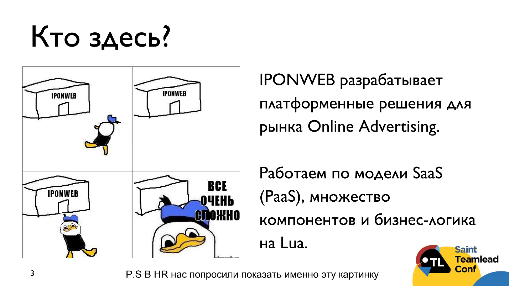

Действительно, IPONWEB разрабатывает платформы для клиентов, которые занимаются онлайн-рекламой. Мы работаем по модели Software as a Service (или точнее Platform as a Service). У нас есть много компонентов: HTTP-сервер, predict-алгоритм, UI, репортинг. Бизнес-логика для порядка 50 проектов, написанная на Lua.

Еще у нас есть флагман BidSwitch, который начинался как spin-off. Нас больше интересует интеграция партнеров (demand-side, supply-side), поэтому у нас очень много логов. Это такой же проект, на таком же стеке, но он достаточно большой, у него есть специфика и выделенная линия техподдержки, которую Константин и возглавляет.

Почему мы выбрали название «Тут живут драконы», что это значит? Так раньше на средневековых картах обозначали места, где неизвестно, что происходит — такие Terra Incognita. По этому поводу есть две истории. Первая — про структуру навыков, скиллов, которые есть у команды, и чем команда больше, тем больше таких Terra Incognita возникает; а про вторую поговорим чуть позже.

  

## Как мы здесь оказались  

Так получилось, что мы (Светлана и Константин) не очень часто пересекаемся по работе, и о том, что мы подали заявки по сути одной тематики, узнали только с [сайта конференции](http://teamleadconf.ru/). Тогда мы решили объединиться — нам показалось, что так будет интереснее для всех.

## Профайлы команд  

Команда Константина «**Technical Support**»:

*   Headcount: 10-12 человек.
*   Дистанция с тимлидом: короткая — все друг у друга на виду.
*   Набор навыков: очень разношерстный набор скиллов, компетенций, рабочих инструментов — это связано с тем, что мы имеем манеру утаскивать у коллег других команд и департаментов новые для нас задачи.
*   Стиль работы: похищение задач у коллег. Это делается, во-первых, для того, чтобы разбавить рутину саппорта, потому день за днем разбирать однотипные запросы не совсем интересно. Во-вторых, чтобы посмотреть, у кого что получается, и наметить направление развития.

Моя команда «**Lua Development**»:

*   Headcount: 40 человек, но число постоянно меняется;
*   Дистанция с тимлидом: достаточно длинная в силу специфики структуры управления в компании (она матричная). То есть тимлид не видит ежедневно каждого разработчика и не знает точно, что составляет его ежедневные задачи.
*   Набор навыков: более-менее однородный. Разработчики пишут бизнес-логику на Lua, но в то же время все они входят в бизнес-юнит, т.е. в объединение проектов, например, по тому, продают они рекламные места или покупают рекламу в качестве рекламодателя.
*   Стиль работы: специфичные задачи, bus-factor. Часто знания концентрируются в голове отдельных людей, не вся команда взаимозаменяема.

Описания команд нужны, чтобы дать понять, чем отличаются наши реализации матриц. Мы постараемся описать, как разные команды к этому шли, что получилось в итоге, поскольку структуры команд, посыл, цели, триггеры и конечные результаты оказались несколько разными.

## Цели и триггеры  

В команде Technical Support:

*   **Кто и чем занят?** Это понадобилось узнать, когда всего стало слишком много, и перестало укладываться в голове, кто же все-таки чем занят, кто и что умеет и на каком уровне.
*   **Каких специалистов не хватает?** Как следствие — кого не хватает для выполнения задач, кого нужно дообучить.
*   **Какие компетенции являются общими и необходимыми для всех?** Главное — понять на стадии подбора, что является общим и обязательным, что нужно написать для HR в профиле идеального кандидата.

В команде разработки цели и триггеры были немного другими. Изначальным стимулом стало именно управление знаниями, потому что, как уже было сказано, у нас очень специфичный бизнес — Ad Tech. Вероятность того, что кто-то придет с готовыми знаниями достаточно низкая, а при этом для разработчика знание бизнес-специфики очень важно.

В Dev Team нужно было:

*   **Ускорить онбординг новичков**. Длительное включение разработчиков в проект — большая боль. Онбординг занимал порядка полугода, то есть больше испытательного срока, а значит мы дообучаем разработчика за свой счет.
*   **Понять структуру знаний, оценить пробелы в знаниях**, найти белые пятна, наметить план обучения, наметить индивидуальные траектории роста.
*   В силу матричной структуры необходимо более **равномерно распределить разработчиков по бизнес-единицам** и задачам, и никого не обидеть. То есть не направить в один бизнес-юнит всех сеньоров.

Также была побочная цель — **сделать процесс performance review более прозрачным, понятным,** чтобы формулировать цели в единой системе координат.

### Performance review  

Performance review — это стандарт нашей компании. Раз в N месяцев с каждым сотрудником проводится performance review в присутствии сотрудника, его тимлида, в качестве рефери используется HR или нотариус. На performance review мы обследуем, что сделал сотрудник из тех задач, которые были поставлены, что у него не получилось, если не получилось, почему, чего бы хотелось достичь еще, что мы можем предложить. После этого ставятся новые цели, задачи, устанавливается следующий срок.

В команде поддержки этот срок достаточно короткий, потому что больших, растянутых по времени, проектов нет — это 3, максимум 4 месяца. В команде разработки это полугодовые циклы ревью. Раньше сроки были больше, просто потому, что у разработчиков можно лучше наметить road map. В некоторых других командах разработки, например, фронтенда performance review происходит тоже каждые 3-4 месяца. Возможно, интервал никак не связан с тем, разработкой или поддержкой занимается команда, но так сложилось у нас.

## Зачем нужна матрица компетенций  

Год назад наша компания проходила период интенсивного роста, стало больше людей, больше инструментов, больше задач — всего больше. В один прекрасный момент стало понятно, что без правильных документов трудно понять, что происходит. И мы нашли решение как систематизировать информацию: о задачах; инструментах и скиллах; сотрудниках.

А зачем это все вам? Вы узнаете о наших практических кейсах, но у вас может возникнуть резонный вопрос — как понять, что мне это нужно?

Если у вас возникли проблемы, похожие на те, что мы обозначили выше, то есть вы не понимаете полный пул задач ваших разработчиков, слишком долго вводите в курс дел новых сотрудников и другие проблемы, которые уже назывались, то это вам, наверное, нужно.

## С чего начать  

С чего начать расскажем на своем примере.

В команде техподдержки мы: определили задачи, которыми занимаемся; провели декомпозицию задач на отдельные манипуляции; выяснили, какие инструменты сотрудник должен знать для работы в том или ином секторе.

Ниже несколько упрощенный пример.  
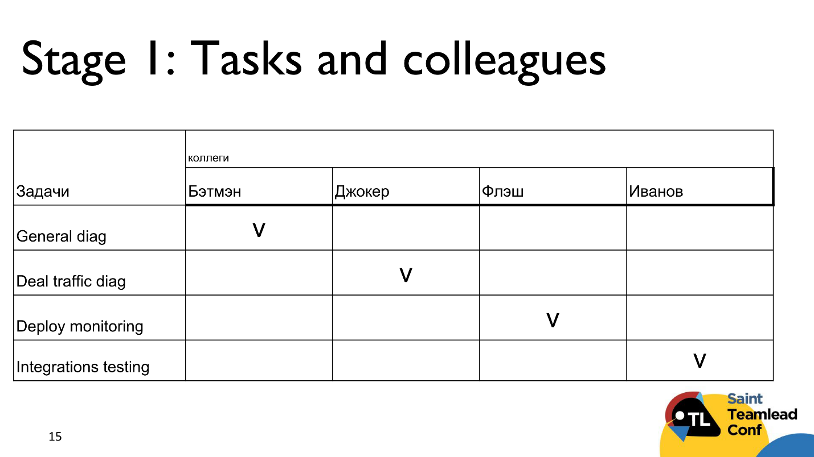

В команде есть сотрудники Бэтмэн, Джокер, Флэш и Иванов, и стандартные задачи:

*   общая диагностика трафика;
*   диагностика deal трафика;
*   мониторинг деплоев;
*   тестирование интеграции новых партнеров, как DSP, так и SSP, как покупателей, так и продавцов.

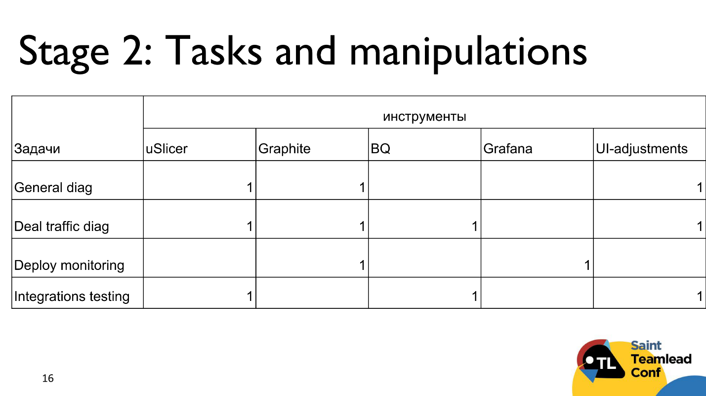

Из инструментов у нас есть:

*   uSIicer позволяет получать очень подробные цифры по торговле;
*   Graphite дает данные о состоянии системы в режиме реального времени;
*   Google BigQuery (BQ) — там живут наши логи;
*   Grafana, которая позволяет агрегировать метрики из Graphite, на нее удобно ставить алерты при необходимости;
*   Ul-adjustments в админском интерфейсе, которые позволяют изменить параметры трафика для того или иного партнера, торговой пары, дата-центра и т.д.

Потом мы выяснили, кто что знает и в каком объеме.  
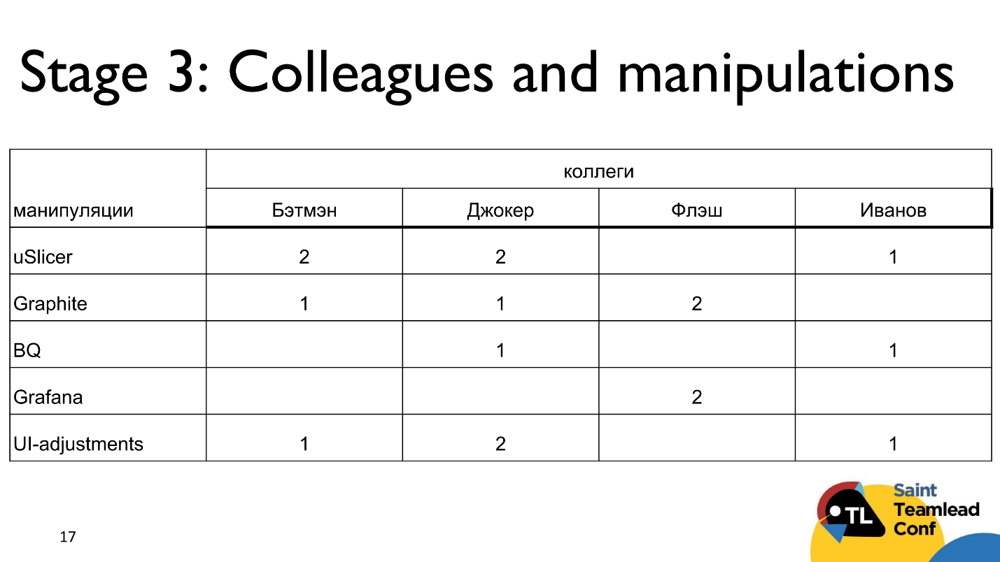

2 — эксперт, который может научить; 1 — значит человек более-менее знает; пустые ячейки вместо, чтобы никого не обижать.

Сводим в одну таблицу:  
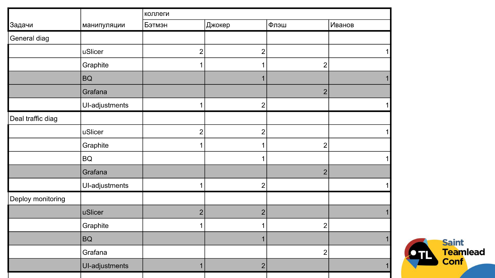

Серым выделены те инструменты, которые в той или иной задаче не обязательны. Например, для общей диагностики нам не обязательно знание BQ и Grafana. Получилась достаточно интересная картина.

#### Нежданчики (Support)  

Всплыло несколько нежданчиков, которые помогли понять:

*   Кому из коллег какие навыки следует подтянуть, чтобы привлечь их к новым задачам? (Обозначить направление развития);
*   Где могут возникнуть проблемы в случае потери сотрудника?
*   Насколько адекватна зарплата сотрудника его пулу задач?
*   Насколько хорошо команда укомплектована и обучена?

Подробнее остановимся на каждом из пунктов позже.

Вернемся к таблице.

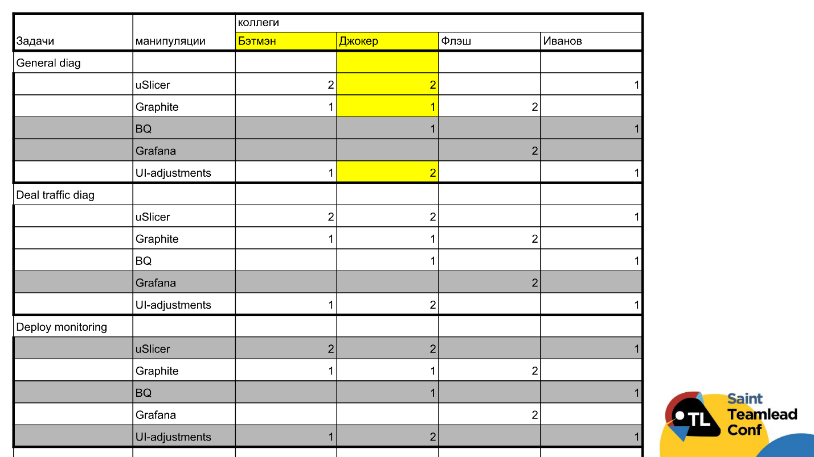

Формально в общей диагностике занят Бэтмэн. Из таблицы видно, что Джокер в случае необходимости его хорошо подменит, с учетом того, что он еще эксперт в UI — почему нет? То есть Бэтмэн у нас заменяемый.

Джокер вообще молодец — он подкован практически везде, кроме разве что deploy monitoring, но этому можно научить.

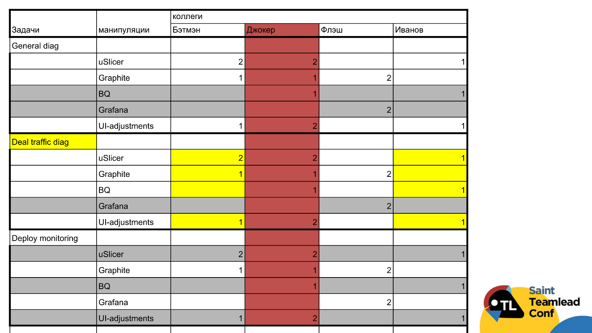

Общеизвестно, что Джокер несколько эксцентрично проводит свободное время и в любой момент может выпасть из работы. Что тогда произойдет? Тогда все будет грустно с диагностикой deal трафика.

Мало того, у нас же нет эксперта по BQ! То есть надо срочно кого-то подтянуть, обучить. Например, можно Бэтмэна обучить BQ, а Иванова — Graphite.

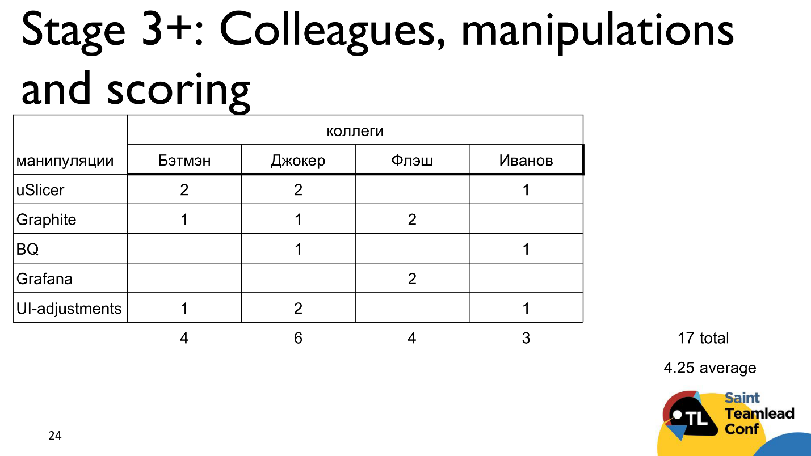

Даже с учетом такой упрощенной системы оценки, можно получить некую сумму по каждому из сотрудников, чтобы понять, насколько он компетентен и хорошо подкован. Эти оценки подкинули еще один нежданчик.

Еще две интересные вещи — это общая сумма по команде и ее средний балл. Строго говоря, эти цифры сами по себе не особо интересны — интересна динамика их изменения из месяца в месяц. Если у нас по какой-то причине начал падать total, то, скорее всего кто-то ушел, а пришел слабенький сотрудник — проблема с комплектацией, нужно обратиться к HR. Если вдруг начал падать average, значит, у нас что-то не так с обучением — виноват тимлид и только тимлид.

Важно, что в данном случае это инструмент тимлида, который не показывается сотрудникам, ведь оценки субъективны.

### Dev Team  

В Dev Team все немного более демократично, или, может быть, мы просто усложнили себе задачу. Список скиллов в команде разработки больше, хоть и однородность задач, возможно, выше.

Мы собрали **совет из 4-х опытных разработчиков** (в том числе тимлид и специалист по управлению знаниями), провели мозговой штурм, и проанализировали задачи и навыки. Мы просто шли пошагово и на своих личных ощущениях, но нескольких человек, анализировали задачи, раскладывали их на навыки, формировали список.

Сначала это был список, потом его структурировали на более универсальные скиллы, в которые входит кодинг и отдельно бизнес-скиллы, потому что для наших разработчиков это важная часть. А из этого списка навыков уже составили матрицу.

В первую итерацию матрицы у нас не входили так называемые софт-скиллы, то есть то, что нельзя назвать хард-скиллами. Это что-то, связанное с ежедневной работой, и даже входящее в критические навыки, в том числе: планирование; коммуникация с командой; умение управлять процессом разработки в мини-группах или самим собой; умение формулировать требования, например, в ходе код-ревью.

Все эти навыки мы не сразу включили, потому что не понимали, как точно их оценивать.

Во вторую итерацию они вошли в систему оценки:

*   декомпозиция задач и все, что с ней связано;
*   документирование и самодокументированный код;
*   умение общаться с менеджером проектов, то есть понимать, что он говорит, и ставить в свою очередь нужные вопросы;
*   умение правильно формулировать замечания на код-ревью и т.д.

Кстати, о софт-скиллах в саппорте. Дело в том, что софт-скиллы в команде разработки требуют отдельной оценки. Однако личностные качества, которые лишь _желательны_ для разработчика, для команды поддержки являются _обязательными_. Если человека наняли, значит, они у него уже есть по умолчанию.

В разработке мы отказались от самого понятия «софт-скиллы», а назвали это универсальными скиллами. В них не входит, например, знание английского языка или то, что ты не бесишь свою команду — этого нет, потому что это как раз ближе к софт-скиллам, описывает характер человека. Мы оцениваем навыки где-то на грани, и поэтому придумали такое название — **универсальные скиллы**.

Когда список навыков был готов, мы провели их оценку с помощью сплошного опроса. Мы проводили настоящий экзамен, в котором часть вопросов предполагала однозначный ответ, а часть обсуждало рабочие ситуации: «Как поступить, если кто-то что-то задерживает или не делает?», «Как бы ты реализовал ту или иную функциональность в проекте?». Это нам очень помогло, потому что эта часть вопросов позволила поговорить с большим количеством разработчиков.

Затем мы прогрейдировали разработчиков по шкале от 1 до 3 за каждый навык.

Те навыки, которые мы не смогли оценить с помощью первичного опроса, мы оценили с помощью пиров (peer), то есть попросили оценить коллег. У нас не было на тот момент руководителей каких-то групп, иначе это могли бы сделать они.

Эта матрица выглядит примерно так.

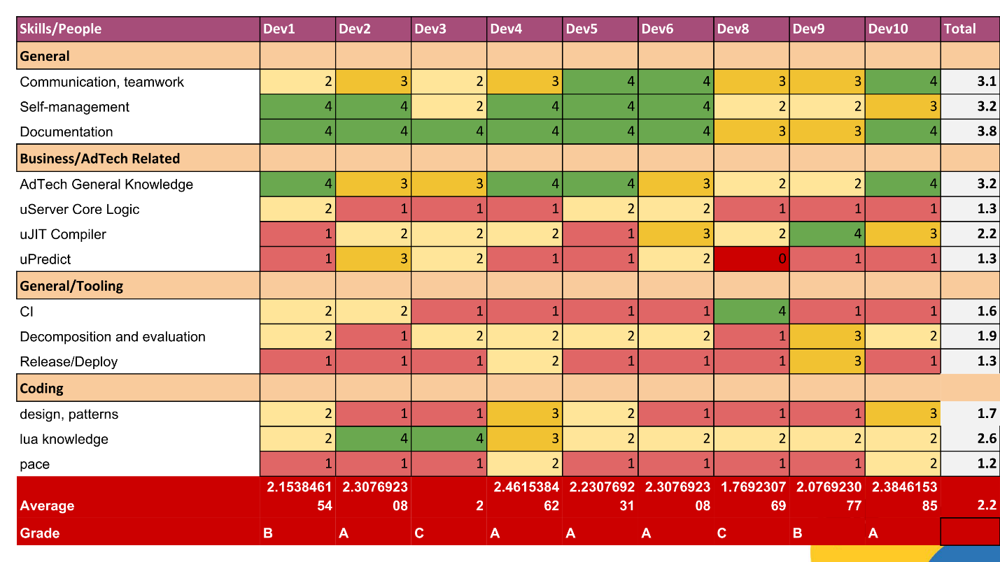

Конечно, все уместить на картинке не получилось, поэтому некоторые вещи, например, корреляции и профиль разработчиков здесь непонятны. Но и так можно примерно оценить, что получается, и посмотреть, насколько это наглядно и что можно измерять.

Цвета соответствуют оценке. Выведены те же самые метрики, что и в команде поддержки — total и различные average по скиллам.

Обратим внимание на Dev8. Из таблицы получается, что это как будто первый кандидат на увольнение. Но, во-первых, у него есть специфичное знание по одной из позиций, поэтому он нам нужен. Но важнее, что **эта таблица — не инструмент увольнения**. Об этом я тоже расскажу, мы не ради этого все затевали.

Average по навыкам — это работа, по результатам которой должен быть сформирован план, как подтянуть навык. То есть если разработчики чего-то не знают — это не их проблема. Это значит, что мы не дали им достаточно информации, и в целом знаний по какому-то из навыков вообще недостаточно в компании. Нужно либо написать документацию, либо сделать какой-то playground, чтобы они смогли попрактиковаться, либо докупить какой-то внешний курс, чтобы они могли обучиться, провести Knowledge Sharing Session, отправить их друг у друга учиться, работать в паре какое-то время, включить человека в другой проект. Могут быть разные варианты knowledge sharing. Суть в том, что нужно сначала провести мероприятие, и только потом говорить о динамике.

Важно заметить, что поскольку в нашей компании матричная структура, не всем разработчикам нужны некоторые навыки. Они их получат, когда будут выполнять задачу, связанную с этим навыком. Иначе бессмысленно, особенно если навык не входит в список критических. Например, в некоторой части проектов нет uPredict, это не критический навык. В целом этот подход помог нам сформулировать, какие навыки являются ключевыми, а какие нет, и что специалист сможет наверстать, когда у него возникнет такая практическая задача.

Другой важный момент про грейдинг. Мы изначально сделали ошибку, которой спровоцировали большее, чем могло бы быть, сопротивление команды — мы не вербализовали значение оценик 1, 2 и 3. Они были у нас в голове на уровне интуиции, но мы не могли ответить, почему один разработчик получил 1, а второй — 2. Разработчики делились друг с другом результатами греда и это спровоцировало конфликты. В отличие от группы поддержки, мы по запросу сообщали личные оценки, но не чужие.

Нужно четко определить и передать это всем, например, что в знании Lua оценка:

*   1 — означает, что разработчик знает все базовые операторы, умеет работать со структурами данных и писать классы функций;
*   2 — умеет организовывать код в библиотеки, консистентно работает с ними по ходу всего проекта и знает, что такое метатаблицы;
*   3 — знает специфику компании и проектов, например, что такое корутины (специфика работы нашего сервера с Lua), как работает код C++ с Lua-кодом, какие это накладывает ограничения, как интерпретируется, компилируется код, как работает наш JIT-компилятор.

Так можно разложить каждый навык, потому что где-то на уровне интуиции у вас это уже существует.

> **Note to self:**
> 
> *   Вербализуйте систему оценки, даже если не будете никому показывать.
> *   На самых ранних этапах постарайтесь включать в работу опытных разработчиков. Вы знаете, у кого может возникнуть самое большее сопротивление, сразу включите их в работу. Снимите все возражения заранее, как это делается в продажах.

  

## Как внедрить  

Когда первичная матрица была готова, в команде разработки мы **привязали к ней метрики**. В основном это был процент максимальных оценок по скиллам, который позволяет поставить грейд разработчику.

Помимо оценок по отдельным навыкам, нам нужно было прогрейдировать разработчиков. У нас были грейды A, B и C — что-то вроде junior, middle, senior. В IT junior, middle, senior уже слишком наполнено смыслом, в который вкладывается, в том числе, и опыт работы. Нам нужны были обозначения, абсолютно не имеющие никаких коннотаций заранее. A, B и C — это даже не как оценки в американской школе. Метрика «процент максимальных скиллов» нам помогла это сделать.

Остальные метрики — различные проценты по отдельным скиллам и среднее.

Еще мы попытались построить **корреляции с другими методами оценки сотрудников**, в том числе зарплатой. Привязать к метрикам зарплату мы, разумеется, не хотели, это было просто упражнение, но все достаточно хорошо соотнеслось.

Идея в том, что соотнося оценки по матрице с зарплатой вы проверяете какие-то свои соображения по этому поводу, и можете оценить, сколько платите за каждый конкретный процент максимальных скиллов. Можно примерно разложить, за что и сколько можно доплачивать, где менять зарплату. Или выявить, что вы кому-то серьезно не доплачиваете — оказывается, есть человек, который обладает уникальным знанием или достаточно хорошим набором скиллов, и вы были не правы.

Также мы сюда привязали те метрики, которые мы берем из других систем. У нас есть метрики из системы контроля версий, связанные с роллбэками или прохождением ревью, например. Мы их тоже сопоставили, но у нас нет цели делать жесткие привязки. Мы просто подтверждаем свои гипотезы таким образом.

**Впоследствии цели на performance review ставились в терминах этой матрицы.** То есть мы могли понятно объяснить, чем отличается 1 от 2, и в каких (только нескольких) позициях разработчику нужно за полгода подтянуться.

> Мы выработали внутреннее правило — не давать после performance review больше, чем три цели в терминах матрицы.  

  

#### Нежданчики (Dev Team)  

В разработке тоже встретились нежданчики. В принципе, мы получили многое из того, что хотели. У нас появилось четкое понимание в виде карты, с которой можно работать, где есть белые пятна, где нужно команду дообучить. Мы полностью переписали план подготовки новых сотрудников. В результате процесс адаптации человека в живой проект сократился с 5-6 месяцев до 2-3. То есть теперь за испытательный период мы полностью успеваем внедрить нового сотрудника в проект. Мы полностью переписали онбординг-план, потому что смогли выявить список ключевых навыков, которые нужны новичкам сразу. А под второстепенные навыки (или очень специфичные для отдельных проектов) артефакты знания можно создавать в процессе обучения.

В тот момент у нас были интерны, и мы не планировали брать их всех, а только одного из четырех. Но взяли троих. Напрямую мы не связываем то, что у нас сразу три интерна прижились, с тем, что мы сделали матрицу компетенций. Но мы на них свои многие соображения проверяли, и они первые, кто прошел через новый план подготовки. В частности, мы включили в него много практики, создали playground, чтобы именно по критическими скиллам они могли упражняться на практике.

Помимо того, что мы **выявили кто и насколько лоялен компании**, а кто хочет быть уникальным и незаменимым. Были критические скиллы, которыми люди хотели делиться, в то же время обнаружились узкие места, в которых люди упивались тем, насколько они уникальны и незаменимы. В этом случае автобусный фактор был результатом сознательного решение. Мы сразу смогли задокументировать эту часть фреймворка и дообучить на это второго человека. Хотя было сопротивление со человека-эксперта, который не хотел делиться знанием и хотел реализовывать это только в своем проекте.

Мы** выявили энтузиастов и драйверов команды.** Тех, кто сразу хотел что-то контрибьютить: «Давайте еще вот это добавим? А почему мы не оцениваем это?».

Совершенно неожиданно, то, что мы вообще не собирались искать, — мы нашли те вещи, которые можно перенести в серверную часть кода, в библиотеки, чтобы не изобретать велосипед. Это получилось больше благодаря проведению сплошного экзамена и дополнительному общению.

## Кейсы  

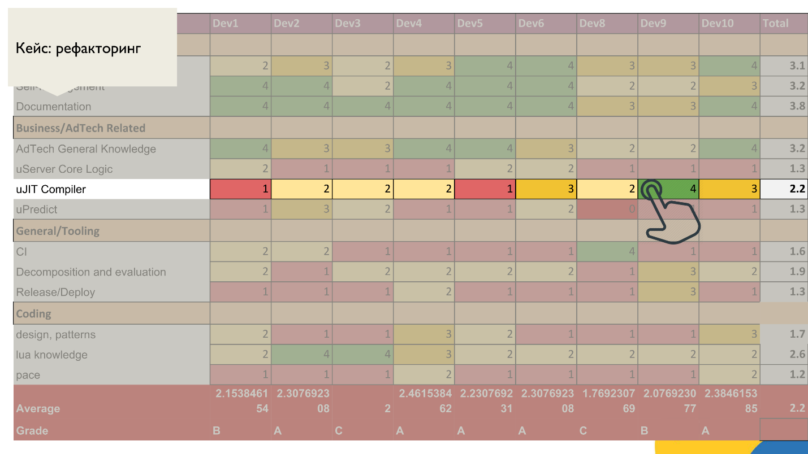

Выше типичный кейс, когда можно часть кода перенести в общую библиотеку. Тут есть какое-то знание, которым недостаточно поделиться, нужно перенести его в кодовую базу.

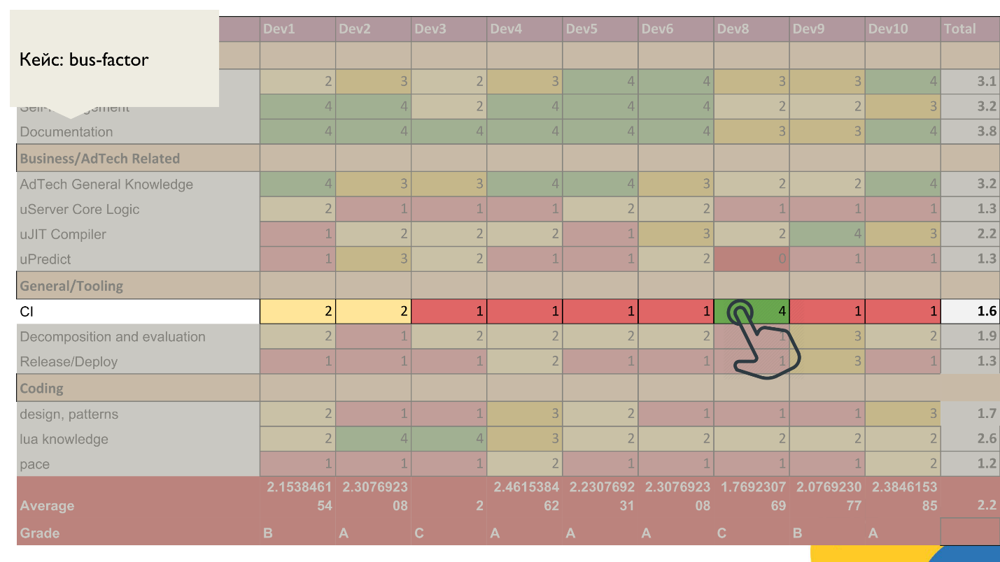

На этом примере только один разработчик знает, как настраивать CI, потому что это он его настроил. Это узкое место, в котором нужно поделиться знаниями. Кстати, это тот самый Номер 8.

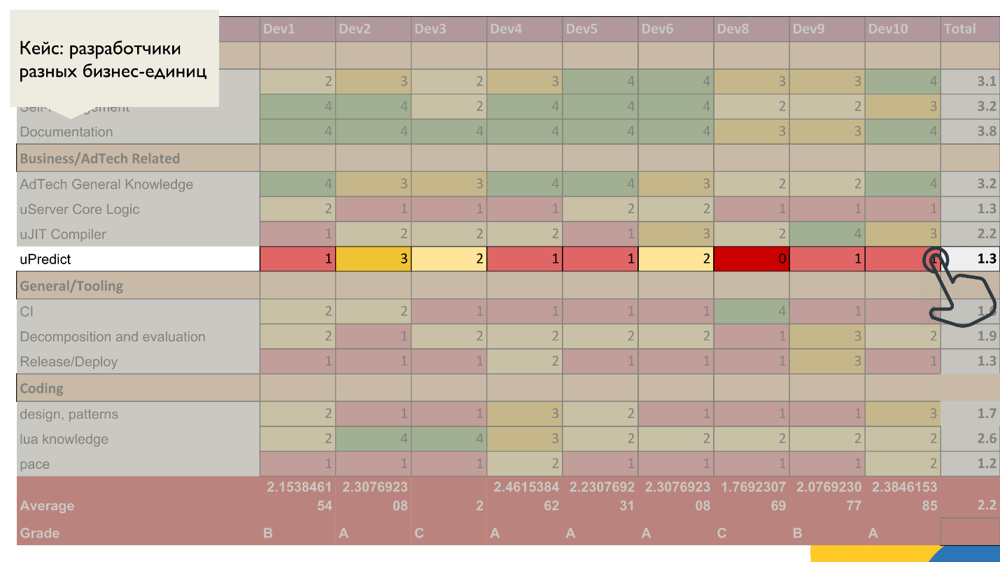

Когда мы знаем, какие навыки не входят в критические, можно применять разные фильтры, чтобы понять, какие навыки с низкой средней оценкой относятся к критическим, а какие просто специфичные для бизнес-юнитов. Мы еще только учимся вычислять профили разработчиков по этой матрице.

## Цена внедрения матрицы компетенций  

То, что всех интересует — это священные человеко-часы. Всех всегда интересует вопрос трудозатрат.  
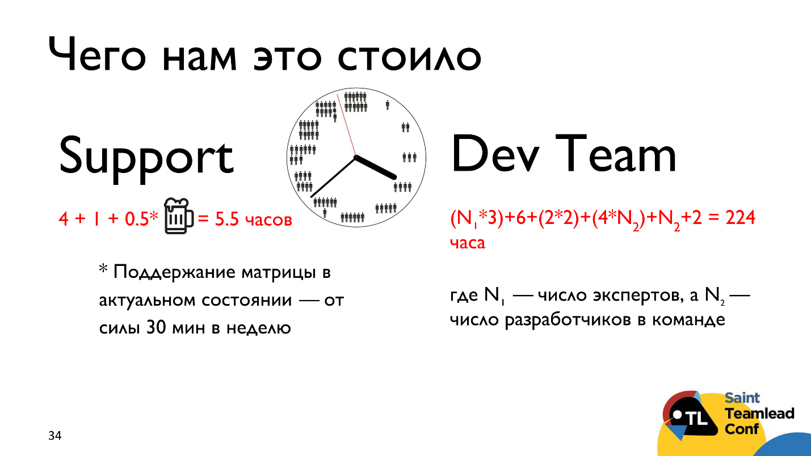

В случае службы поддержки это заняло:

*   4 часа на первую версию, т.е. декомпозицию;
*   1 час на то, чтобы все свести в одну таблицу;
*   0,5 часа и пара кружек пива HR-эксперту, который рассказал, что это называется матрицей компетенций, и можно было не изобретать велосипед и потратить еще меньше времени.

И все! На поддержание матрицы в актуальном состоянии хватает от силы 30 минут в неделю. Конечно, это зависит от того, насколько интенсивно идет ротация коллег, прибывают новые задачи, или, наоборот, они отмирают.

### Dev Team  

В команде разработки по сравнению с поддержкой немного пугающая разница в трудозатратах. Но здесь есть важный момент: на первичную оценку скиллов (составление списка) ушли те же 3-4 часа. Основные трудозатраты оказались совершенно в другом, они складываются из следующего:

*   Первичная оценка, мозговые штурмы — 3-4 часа на каждого эксперта (у нас было 4 эксперта) — время усредненное, потому что не все эксперты постоянно сидели в одной комнате и общались.
*   На само составление матрицы, в том числе на приведение разработчиков и скиллов, на настройку формул макроса, чтобы можно было удобно пользоваться таблицей, навешивать дополнительные метрики и формулы — ушло 6 часов работы.
*   Время на дополнительное выверение теста. У нас уже был квиз для новичков. Пришлось его немного раздуть и сделать универсальным, чтобы он подходил и для senior’ов. На переписывание этого квиза ушло 2 часа у knowledge-менеджера и 2 у тимлида.
*   Самая затратная часть — это оценка путем экзамена (квиза в 3-4 раунда). Это занимает много времени, потому что в квизе больше 100 вопросов, которые идут по профилям.
*   Время на корректировку метрик — еще 2 часа. Если у вас есть дополнительные методики оценки, у вас может уйти чуть больше времени в этом пункте.

Но суть в том, что где-то на середине пути вы получаете рабочий инструмент, с которым уже можно что-то делать. Даже не на финальной стадии вполне можно работать со списком и первыми грейдами.

## Детализация  

Отдельно остановимся на том, как **важно вовремя остановиться**.

> Матрица компетенций — это инструмент, а не универсальное решение всех задач.  

Нужно понять, чего вы все-таки хотите, и сколько вы готовы инвестировать времени. Первый этап, когда мы просто расписываем навыки, распределяем сотрудников, применяем элементарную оценку, не особо трудозатратен. Потом можно усложнить: ввести большее количество метрик, среднее по навыку, провести сплошной опрос и т.д.  
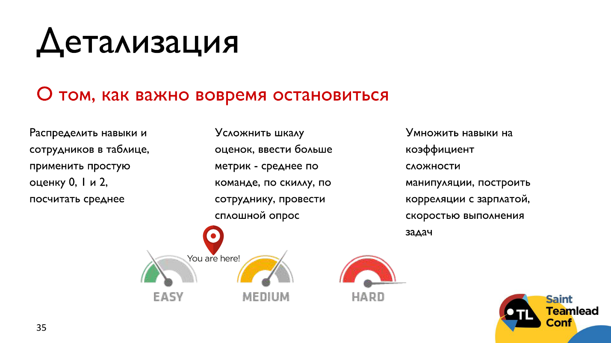

Support остановился где-то между easy и medium, а Dev Team — примерно на medium.

Для каждой манипуляции, для каждого инструмента можно еще ввести коэффициент сложности, и уже по этим коэффициентам рассчитывать финальную общую и среднюю оценку. Мы так далеко не пошли, а остановились на средней степени сложности. Суть в том, что можно наращивать уровни абстракции, но вопрос, нужно ли.

Чем матрица компетенций не является и чего с ней делать не стоит.

*   **Считать её универсальным инструментом**, рамкой, которой все должны соответствовать.

Не стоит пытаться к матрице привязать зарплату, увольнение, другие формальные мероприятия. Это ваш инструмент (либо инструмент команды), который нужен не для этого. К нему можно привязывать performance review, чтобы всем разговаривать на одном языке.

Если у вас достаточно разнородная команда, подумайте, нужна ли вам одна матрица или несколько — те самые профайлы. Мы сейчас идем в этом направлении и пока не решили эту проблему.

*   **Считать это необходимостью.** Возможно, если команда небольшая, все у всех на виду, пул задач не меняется, то все это можно держать в голове и не заморачиваться.
*   **Если вы, как тимлид все-таки взялись за это — никому не отдавайте эту работу.** Никто не знает вашу команду лучше вас. Оперирует только один хирург, второй или ассистирует, или мешается.

Бывает, когда этим занимается HR, но тогда можно получить результат, во-первых, не с первого раза, во-вторых, не тот, который ожидали, в-третьих, HR еще сделают какие-то свои выводы и будут нервировать. Просто у HR другие задачи, им может понравиться этот инструмент и они могут его использовать в своих целях, которые иногда не сходятся с задачами тимлида.

*   **Не пытайтесь распространить матрицу на всю компанию, это инструмент отдельно взятого тимлида** .

В каждой команде это может выглядеть по-разному. На нашем опыте этим инструментом заинтересовались и другие команды в компании. Они тоже хотят попробовать, но с другим заходом, у них другие причины. Им нужно будет начать все с чистого листа, а не просто брать наши матрицы и пытаться их применить. В каждой команде будет своя матрица — во фронтенд-разработке одна, в бизнесориентированной команде — другая. Эти матрицы будут отличаться не только списком и количеством скиллов.

*   **Don’t try this at home** — это и в компаниях-то не везде работает, а дома тем более :)

Слайды, дополнительные материалы и наши матрицы [здесь](https://gist.github.com/lananovikova10/954ab6351bc919c1b66fec6e0d1d9e43).

> А если вопрос управления знаниями для вас так же актуален, как для меня, приглашаю участвовать в специальной конференции [KnowledgeConf](http://knowledgeconf.ru/2019) 2019 в Москве 26 апреля.
> 
> Обсуждать планируем самые разные проблемы, от прикладных (онбординг новичков, организация базы знаний, внутренний университет, обучение на практике, фиксация инцидентов и ведение базы постмортемов) до фундаментальных (современные подходы к обучению и системному мышлению).
> 
> Мы с программным комитетом уже начали работу и получили первую двадцатку тем. [Подавайте заявки](https://conf.ontico.ru/lectures/propose?webname=kc2019), если дорожите знаниями внутри компании, и знаете, как с ними следует обращаться. А мы поможем довести материал до классного доклада.